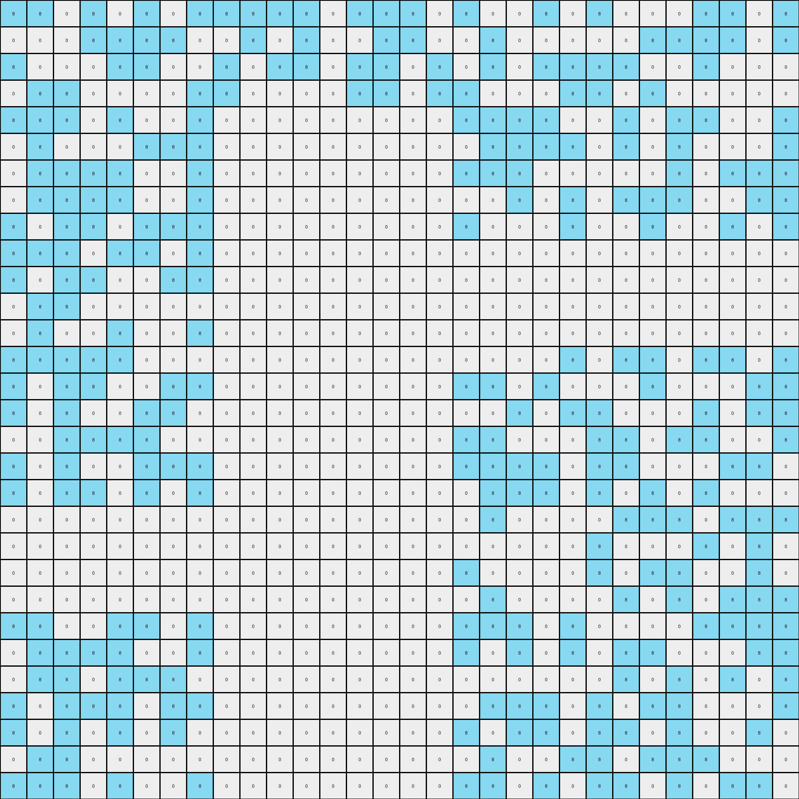
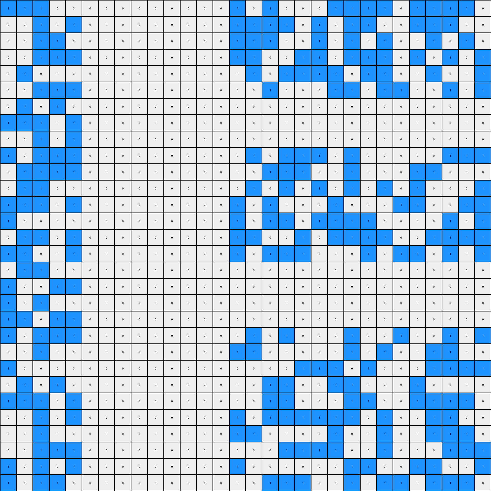

# a64e4611 • 018 • refine_coder

---

Previous Code:
```python
"""
1.  **Identify Red Objects:** Locate all connected regions of red (2) pixels in the input grid.  These define the boundaries.
2.  **Identify White Regions:**  Locate all connected regions of white (0) pixels.
3.  **Fill Enclosed White Regions:** For each white region, determine if it's fully enclosed by red pixels (using 8-connectivity). If a white region is fully enclosed, change all pixels in that region to green (3).
"""

import numpy as np
from scipy.ndimage import label, measurements

def get_connected_regions(grid, color):
    """
    Finds connected regions of a specific color in the grid.

    Args:
        grid: A 2D numpy array representing the grid.
        color: The color to find connected regions for.

    Returns:
        A list of tuples, where each tuple contains the (row, col) coordinates
        of pixels belonging to a connected region of the specified color.
        Also return the labeled array, where each region is a unique integer,
        and the number of regions
    """
    colored_pixels = (grid == color)
    labeled_array, num_features = label(colored_pixels)
    regions = []
    for i in range(1, num_features + 1):  # Iterate through each labeled region
        region_pixels = np.where(labeled_array == i)
        regions.append(list(zip(region_pixels[0], region_pixels[1])))
    return regions, labeled_array, num_features

def is_enclosed(region, labeled_array, boundary_color, grid_shape):
    """
    Checks if a region is fully enclosed by a boundary color.

    Args:
      region: list of (row, col) of the region to check
      labeled_array: labeled array from the connected regions
      boundary_color:  color of the boundary
      grid_shape: (height, width)

    Returns:
        True if the region is fully enclosed, False otherwise.
    """

    rows, cols = zip(*region)  # Unzip the coordinates
    min_row, max_row = min(rows), max(rows)
    min_col, max_col = min(cols), max(cols)

    # Check if the region touches the edges of the grid
    if min_row == 0 or max_row == grid_shape[0] - 1 or min_col == 0 or max_col == grid_shape[1] - 1:
      return False

    # Check all neighboring pixels around the *bounding box* of the region
    for r in range(min_row - 1, max_row + 2):
        for c in range(min_col - 1, max_col + 2):
          # skip the inside of the bounding box, we only care about the perimeter
            if min_row <= r <= max_row and min_col <=c <= max_col:
              continue

            # Check boundaries - if out of grid, or not red.
            if (0 <= r < grid_shape[0] and 0 <= c < grid_shape[1]):
                if labeled_array[r, c] != boundary_color:
                  
                  return False
            
    return True
  

def transform(input_grid):
    input_grid = np.array(input_grid)
    output_grid = np.copy(input_grid)
    grid_shape = input_grid.shape

    # Get red regions
    red_regions, red_labeled_array, red_num_features = get_connected_regions(input_grid, 2)

    # Label the entire red-colored area (all red regions combined) with a single label '2'
    red_combined_mask = (input_grid == 2)
    red_labeled_combined, _ = label(red_combined_mask) #we do not care about number of objects
    
    # Get white regions
    white_regions, white_labeled_array, white_num_features = get_connected_regions(input_grid, 0)

    # Fill enclosed white regions
    for white_region in white_regions:
        # Check if enclosed by red using the combined red labeled array
        if is_enclosed(white_region, red_labeled_combined, 2, grid_shape):
            for r, c in white_region:
                output_grid[r, c] = 3

    return output_grid
```

Train Set Results:

## Example 1:

Input:
```
8 8 0 8 0 8 0 8 8 8 8 8 0 8 8 8 0 8 0 0 8 0 8 0 0 0 8 8 0 8
0 0 0 8 8 8 8 0 0 8 0 8 0 0 8 8 0 0 8 0 0 0 0 0 8 8 8 8 0 8
8 0 0 0 8 8 0 0 8 0 8 8 0 8 8 0 8 0 8 0 8 8 8 8 0 0 8 0 0 0
0 8 8 0 0 0 0 8 8 0 0 0 0 8 8 0 8 8 0 0 0 8 8 0 8 0 0 0 0 0
8 8 8 0 8 0 0 8 0 0 0 0 0 0 0 0 0 8 8 8 8 0 0 8 0 8 8 0 0 8
0 8 0 0 0 8 8 8 0 0 0 0 0 0 0 0 0 0 8 8 8 8 0 8 0 8 0 0 0 8
0 8 8 8 8 0 0 8 0 0 0 0 0 0 0 0 0 8 8 8 0 0 0 0 0 8 0 8 8 8
0 8 8 8 8 0 0 8 0 0 0 0 0 0 0 0 0 0 0 8 0 8 0 8 8 8 0 0 8 8
8 0 8 8 0 8 8 8 0 0 0 0 0 0 0 0 0 8 0 0 0 8 0 0 8 0 0 8 0 8
8 8 8 0 8 8 0 8 0 0 0 0 0 0 0 0 0 0 0 0 0 0 0 0 0 0 0 0 0 0
8 0 8 8 0 0 8 8 0 0 0 0 0 0 0 0 0 0 0 0 0 0 0 0 0 0 0 0 0 0
0 8 8 0 0 0 0 0 0 0 0 0 0 0 0 0 0 0 0 0 0 0 0 0 0 0 0 0 0 0
0 8 0 0 8 0 0 8 0 0 0 0 0 0 0 0 0 0 0 0 0 0 0 0 0 0 0 0 0 0
8 8 8 8 8 0 0 0 0 0 0 0 0 0 0 0 0 0 0 0 0 8 0 8 8 0 8 8 0 8
8 0 8 8 0 0 8 8 0 0 0 0 0 0 0 0 0 8 8 0 8 0 0 0 8 0 0 0 8 8
8 0 8 0 0 8 8 0 0 0 0 0 0 0 0 0 0 0 0 8 0 8 8 0 0 0 8 0 8 8
0 0 8 8 8 8 0 0 0 0 0 0 0 0 0 0 0 8 8 0 0 0 8 8 0 8 8 0 0 8
8 0 8 0 0 8 8 8 0 0 0 0 0 0 0 0 0 8 8 8 8 0 8 8 0 0 0 8 8 0
8 0 8 8 0 8 0 8 0 0 0 0 0 0 0 0 0 0 8 8 8 0 8 0 8 0 8 0 0 0
0 0 0 0 0 0 0 0 0 0 0 0 0 0 0 0 0 0 8 0 0 0 0 8 8 8 0 8 8 8
0 0 0 0 0 0 0 0 0 0 0 0 0 0 0 0 0 0 0 0 0 0 8 0 0 0 8 0 8 0
0 0 0 0 0 0 0 0 0 0 0 0 0 0 0 0 0 8 0 0 0 0 8 0 8 8 0 0 8 0
0 0 0 0 0 0 0 0 0 0 0 0 0 0 0 0 0 0 8 0 0 0 0 8 0 8 0 8 8 8
8 8 0 0 8 8 0 8 0 0 0 0 0 0 0 0 0 8 8 8 0 8 0 0 0 0 8 8 8 8
0 8 8 8 8 0 0 8 0 0 0 0 0 0 0 0 0 8 0 8 0 8 0 8 8 0 0 0 8 8
0 8 8 0 8 8 8 0 0 0 0 0 0 0 0 0 0 0 0 0 0 0 0 8 0 8 0 8 0 8
8 0 8 8 8 0 8 8 0 0 0 0 0 0 0 0 0 0 8 8 8 0 8 0 8 8 0 0 0 8
8 0 8 0 8 0 8 0 0 0 0 0 0 0 0 0 0 8 0 8 8 0 8 8 0 8 0 0 8 0
0 8 8 0 0 0 0 0 0 0 0 0 0 0 0 0 0 0 8 0 0 8 8 0 8 8 8 0 0 0
8 8 8 0 8 0 0 8 0 0 0 0 0 0 0 0 0 8 8 0 8 0 8 8 0 8 0 8 8 0
```
Expected Output:
```
8 8 0 8 0 8 0 8 8 8 8 8 0 8 8 8 0 8 0 0 8 0 8 0 0 0 8 8 0 8
0 0 0 8 8 8 8 0 0 8 0 8 0 0 8 8 0 0 8 0 0 0 0 0 8 8 8 8 0 8
8 0 0 0 8 8 0 0 8 0 8 8 0 8 8 0 8 0 8 0 8 8 8 8 0 0 8 0 0 0
0 8 8 0 0 0 0 8 8 0 0 0 0 8 8 0 8 8 0 0 0 8 8 0 8 0 0 0 0 0
8 8 8 0 8 0 0 8 0 0 0 0 0 0 0 0 0 8 8 8 8 0 0 8 0 8 8 0 0 8
0 8 0 0 0 8 8 8 0 3 3 3 3 3 3 3 0 0 8 8 8 8 0 8 0 8 0 0 0 8
0 8 8 8 8 0 0 8 0 3 3 3 3 3 3 3 0 8 8 8 0 0 0 0 0 8 0 8 8 8
0 8 8 8 8 0 0 8 0 3 3 3 3 3 3 3 0 0 0 8 0 8 0 8 8 8 0 0 8 8
8 0 8 8 0 8 8 8 0 3 3 3 3 3 3 3 0 8 0 0 0 8 0 0 8 0 0 8 0 8
8 8 8 0 8 8 0 8 0 3 3 3 3 3 3 3 0 0 0 0 0 0 0 0 0 0 0 0 0 0
8 0 8 8 0 0 8 8 0 3 3 3 3 3 3 3 3 3 3 3 3 3 3 3 3 3 3 3 3 3
0 8 8 0 0 0 0 0 0 3 3 3 3 3 3 3 3 3 3 3 3 3 3 3 3 3 3 3 3 3
0 8 0 0 8 0 0 8 0 3 3 3 3 3 3 3 0 0 0 0 0 0 0 0 0 0 0 0 0 0
8 8 8 8 8 0 0 0 0 3 3 3 3 3 3 3 0 0 0 0 0 8 0 8 8 0 8 8 0 8
8 0 8 8 0 0 8 8 0 3 3 3 3 3 3 3 0 8 8 0 8 0 0 0 8 0 0 0 8 8
8 0 8 0 0 8 8 0 0 3 3 3 3 3 3 3 0 0 0 8 0 8 8 0 0 0 8 0 8 8
0 0 8 8 8 8 0 0 0 3 3 3 3 3 3 3 0 8 8 0 0 0 8 8 0 8 8 0 0 8
8 0 8 0 0 8 8 8 0 3 3 3 3 3 3 3 0 8 8 8 8 0 8 8 0 0 0 8 8 0
8 0 8 8 0 8 0 8 0 3 3 3 3 3 3 3 0 0 8 8 8 0 8 0 8 0 8 0 0 0
0 0 0 0 0 0 0 0 0 3 3 3 3 3 3 3 0 0 8 0 0 0 0 8 8 8 0 8 8 8
3 3 3 3 3 3 3 3 3 3 3 3 3 3 3 3 0 0 0 0 0 0 8 0 0 0 8 0 8 0
3 3 3 3 3 3 3 3 3 3 3 3 3 3 3 3 0 8 0 0 0 0 8 0 8 8 0 0 8 0
0 0 0 0 0 0 0 0 0 3 3 3 3 3 3 3 0 0 8 0 0 0 0 8 0 8 0 8 8 8
8 8 0 0 8 8 0 8 0 3 3 3 3 3 3 3 0 8 8 8 0 8 0 0 0 0 8 8 8 8
0 8 8 8 8 0 0 8 0 3 3 3 3 3 3 3 0 8 0 8 0 8 0 8 8 0 0 0 8 8
0 8 8 0 8 8 8 0 0 3 3 3 3 3 3 3 0 0 0 0 0 0 0 8 0 8 0 8 0 8
8 0 8 8 8 0 8 8 0 3 3 3 3 3 3 3 0 0 8 8 8 0 8 0 8 8 0 0 0 8
8 0 8 0 8 0 8 0 0 3 3 3 3 3 3 3 0 8 0 8 8 0 8 8 0 8 0 0 8 0
0 8 8 0 0 0 0 0 0 3 3 3 3 3 3 3 0 0 8 0 0 8 8 0 8 8 8 0 0 0
8 8 8 0 8 0 0 8 0 3 3 3 3 3 3 3 0 8 8 0 8 0 8 8 0 8 0 8 8 0
```
Transformed Output:
```
8 8 0 8 0 8 0 8 8 8 8 8 0 8 8 8 0 8 0 0 8 0 8 0 0 0 8 8 0 8
0 0 0 8 8 8 8 0 0 8 0 8 0 0 8 8 0 0 8 0 0 0 0 0 8 8 8 8 0 8
8 0 0 0 8 8 0 0 8 0 8 8 0 8 8 0 8 0 8 0 8 8 8 8 0 0 8 0 0 0
0 8 8 0 0 0 0 8 8 0 0 0 0 8 8 0 8 8 0 0 0 8 8 0 8 0 0 0 0 0
8 8 8 0 8 0 0 8 0 0 0 0 0 0 0 0 0 8 8 8 8 0 0 8 0 8 8 0 0 8
0 8 0 0 0 8 8 8 0 0 0 0 0 0 0 0 0 0 8 8 8 8 0 8 0 8 0 0 0 8
0 8 8 8 8 0 0 8 0 0 0 0 0 0 0 0 0 8 8 8 0 0 0 0 0 8 0 8 8 8
0 8 8 8 8 0 0 8 0 0 0 0 0 0 0 0 0 0 0 8 0 8 0 8 8 8 0 0 8 8
8 0 8 8 0 8 8 8 0 0 0 0 0 0 0 0 0 8 0 0 0 8 0 0 8 0 0 8 0 8
8 8 8 0 8 8 0 8 0 0 0 0 0 0 0 0 0 0 0 0 0 0 0 0 0 0 0 0 0 0
8 0 8 8 0 0 8 8 0 0 0 0 0 0 0 0 0 0 0 0 0 0 0 0 0 0 0 0 0 0
0 8 8 0 0 0 0 0 0 0 0 0 0 0 0 0 0 0 0 0 0 0 0 0 0 0 0 0 0 0
0 8 0 0 8 0 0 8 0 0 0 0 0 0 0 0 0 0 0 0 0 0 0 0 0 0 0 0 0 0
8 8 8 8 8 0 0 0 0 0 0 0 0 0 0 0 0 0 0 0 0 8 0 8 8 0 8 8 0 8
8 0 8 8 0 0 8 8 0 0 0 0 0 0 0 0 0 8 8 0 8 0 0 0 8 0 0 0 8 8
8 0 8 0 0 8 8 0 0 0 0 0 0 0 0 0 0 0 0 8 0 8 8 0 0 0 8 0 8 8
0 0 8 8 8 8 0 0 0 0 0 0 0 0 0 0 0 8 8 0 0 0 8 8 0 8 8 0 0 8
8 0 8 0 0 8 8 8 0 0 0 0 0 0 0 0 0 8 8 8 8 0 8 8 0 0 0 8 8 0
8 0 8 8 0 8 0 8 0 0 0 0 0 0 0 0 0 0 8 8 8 0 8 0 8 0 8 0 0 0
0 0 0 0 0 0 0 0 0 0 0 0 0 0 0 0 0 0 8 0 0 0 0 8 8 8 0 8 8 8
0 0 0 0 0 0 0 0 0 0 0 0 0 0 0 0 0 0 0 0 0 0 8 0 0 0 8 0 8 0
0 0 0 0 0 0 0 0 0 0 0 0 0 0 0 0 0 8 0 0 0 0 8 0 8 8 0 0 8 0
0 0 0 0 0 0 0 0 0 0 0 0 0 0 0 0 0 0 8 0 0 0 0 8 0 8 0 8 8 8
8 8 0 0 8 8 0 8 0 0 0 0 0 0 0 0 0 8 8 8 0 8 0 0 0 0 8 8 8 8
0 8 8 8 8 0 0 8 0 0 0 0 0 0 0 0 0 8 0 8 0 8 0 8 8 0 0 0 8 8
0 8 8 0 8 8 8 0 0 0 0 0 0 0 0 0 0 0 0 0 0 0 0 8 0 8 0 8 0 8
8 0 8 8 8 0 8 8 0 0 0 0 0 0 0 0 0 0 8 8 8 0 8 0 8 8 0 0 0 8
8 0 8 0 8 0 8 0 0 0 0 0 0 0 0 0 0 8 0 8 8 0 8 8 0 8 0 0 8 0
0 8 8 0 0 0 0 0 0 0 0 0 0 0 0 0 0 0 8 0 0 8 8 0 8 8 8 0 0 0
8 8 8 0 8 0 0 8 0 0 0 0 0 0 0 0 0 8 8 0 8 0 8 8 0 8 0 8 8 0
```

match: False
pixels_off: 221
size_correct: True
color_palette_correct: True
correct_pixel_counts: False

## Example 2:

Input:
```
1 1 1 0 0 0 0 0 0 0 0 0 0 0 1 0 1 0 0 0 1 1 1 1 0 1 1 1 1 0
0 0 1 0 1 0 0 0 0 0 0 0 0 0 1 1 1 1 0 1 0 1 1 0 0 1 1 1 0 0
0 0 1 1 0 0 0 0 0 0 0 0 0 0 1 1 1 0 0 1 0 1 0 1 0 0 1 0 1 0
0 0 1 1 1 0 0 0 0 0 0 0 0 0 1 1 0 0 1 1 0 1 1 1 0 1 0 1 0 1
0 1 0 0 0 0 0 0 0 0 0 0 0 0 0 1 0 1 1 1 1 0 1 1 0 0 1 0 0 1
0 0 1 1 1 0 0 0 0 0 0 0 0 0 0 0 1 0 0 0 1 1 0 1 1 0 0 1 0 1
0 1 0 1 0 0 0 0 0 0 0 0 0 0 0 0 0 0 0 0 0 0 0 0 0 0 0 0 0 0
1 1 1 0 1 0 0 0 0 0 0 0 0 0 0 0 0 0 0 0 0 0 0 0 0 0 0 0 0 0
0 0 1 0 1 0 0 0 0 0 0 0 0 0 0 0 0 0 0 0 0 0 0 0 0 0 0 0 0 0
1 0 1 1 1 0 0 0 0 0 0 0 0 0 0 1 0 1 1 1 0 1 0 0 0 0 0 1 1 1
0 1 1 1 1 0 0 0 0 0 0 0 0 0 0 0 1 1 1 0 0 1 0 0 0 1 1 0 0 0
0 1 1 0 0 0 0 0 0 0 0 0 0 0 0 1 0 1 0 1 0 1 0 1 0 1 0 0 0 1
1 1 1 0 1 0 0 0 0 0 0 0 0 0 1 0 1 0 0 0 1 0 0 0 1 1 0 0 1 1
1 0 0 0 0 0 0 0 0 0 0 0 0 0 1 0 1 1 0 1 1 1 1 0 0 0 0 1 0 1
0 1 1 0 1 0 0 0 0 0 0 0 0 0 1 1 0 0 1 0 1 1 1 1 0 0 1 1 1 1
1 1 0 0 1 0 0 0 0 0 0 0 0 0 1 0 1 1 1 0 0 0 1 0 1 1 0 1 0 1
0 1 1 0 0 0 0 0 0 0 0 0 0 0 0 0 0 0 0 0 0 0 0 0 0 0 0 0 0 0
1 0 0 1 1 0 0 0 0 0 0 0 0 0 0 0 0 0 0 0 0 0 0 0 0 0 0 0 0 0
1 0 1 0 0 0 0 0 0 0 0 0 0 0 0 0 0 0 0 0 0 0 0 0 0 0 0 0 0 0
1 1 0 1 1 0 0 0 0 0 0 0 0 0 0 0 0 0 0 0 0 0 0 0 0 0 0 0 0 0
1 0 1 1 1 0 0 0 0 0 0 0 0 0 0 1 0 1 0 0 0 1 0 0 1 0 0 1 0 1
0 0 1 0 0 0 0 0 0 0 0 0 0 0 1 1 0 0 0 0 0 1 0 1 0 0 1 1 0 0
1 0 0 0 0 0 0 0 0 0 0 0 0 0 0 0 0 0 1 1 1 0 1 0 0 0 1 1 1 1
0 1 0 1 0 0 0 0 0 0 0 0 0 0 0 0 1 1 0 0 1 1 0 0 0 1 0 0 0 0
1 1 1 0 1 0 0 0 0 0 0 0 0 0 0 0 1 1 0 0 0 1 1 0 0 1 1 1 1 0
0 0 1 0 1 0 0 0 0 0 0 0 0 0 1 0 1 1 1 1 1 1 0 1 0 0 1 1 0 0
0 0 1 0 0 0 0 0 0 0 0 0 0 0 1 1 0 0 0 0 1 0 0 1 0 0 1 1 1 0
0 0 1 1 1 0 0 0 0 0 0 0 0 0 0 0 0 1 1 1 1 0 0 1 0 0 0 1 1 1
1 0 1 0 1 0 0 0 0 0 0 0 0 0 1 0 0 0 0 0 0 1 1 0 0 1 1 0 0 1
1 0 1 1 0 0 0 0 0 0 0 0 0 0 0 0 1 1 1 0 0 1 0 1 1 0 1 1 1 0
```
Expected Output:
```
1 1 1 0 0 0 3 3 3 3 3 3 3 0 1 0 1 0 0 0 1 1 1 1 0 1 1 1 1 0
0 0 1 0 1 0 3 3 3 3 3 3 3 0 1 1 1 1 0 1 0 1 1 0 0 1 1 1 0 0
0 0 1 1 0 0 3 3 3 3 3 3 3 0 1 1 1 0 0 1 0 1 0 1 0 0 1 0 1 0
0 0 1 1 1 0 3 3 3 3 3 3 3 0 1 1 0 0 1 1 0 1 1 1 0 1 0 1 0 1
0 1 0 0 0 0 3 3 3 3 3 3 3 0 0 1 0 1 1 1 1 0 1 1 0 0 1 0 0 1
0 0 1 1 1 0 3 3 3 3 3 3 3 0 0 0 1 0 0 0 1 1 0 1 1 0 0 1 0 1
0 1 0 1 0 0 3 3 3 3 3 3 3 0 0 0 0 0 0 0 0 0 0 0 0 0 0 0 0 0
1 1 1 0 1 0 3 3 3 3 3 3 3 3 3 3 3 3 3 3 3 3 3 3 3 3 3 3 3 3
0 0 1 0 1 0 3 3 3 3 3 3 3 0 0 0 0 0 0 0 0 0 0 0 0 0 0 0 0 0
1 0 1 1 1 0 3 3 3 3 3 3 3 0 0 1 0 1 1 1 0 1 0 0 0 0 0 1 1 1
0 1 1 1 1 0 3 3 3 3 3 3 3 0 0 0 1 1 1 0 0 1 0 0 0 1 1 0 0 0
0 1 1 0 0 0 3 3 3 3 3 3 3 0 0 1 0 1 0 1 0 1 0 1 0 1 0 0 0 1
1 1 1 0 1 0 3 3 3 3 3 3 3 0 1 0 1 0 0 0 1 0 0 0 1 1 0 0 1 1
1 0 0 0 0 0 3 3 3 3 3 3 3 0 1 0 1 1 0 1 1 1 1 0 0 0 0 1 0 1
0 1 1 0 1 0 3 3 3 3 3 3 3 0 1 1 0 0 1 0 1 1 1 1 0 0 1 1 1 1
1 1 0 0 1 0 3 3 3 3 3 3 3 0 1 0 1 1 1 0 0 0 1 0 1 1 0 1 0 1
0 1 1 0 0 0 3 3 3 3 3 3 3 0 0 0 0 0 0 0 0 0 0 0 0 0 0 0 0 0
1 0 0 1 1 0 3 3 3 3 3 3 3 3 3 3 3 3 3 3 3 3 3 3 3 3 3 3 3 3
1 0 1 0 0 0 3 3 3 3 3 3 3 3 3 3 3 3 3 3 3 3 3 3 3 3 3 3 3 3
1 1 0 1 1 0 3 3 3 3 3 3 3 0 0 0 0 0 0 0 0 0 0 0 0 0 0 0 0 0
1 0 1 1 1 0 3 3 3 3 3 3 3 0 0 1 0 1 0 0 0 1 0 0 1 0 0 1 0 1
0 0 1 0 0 0 3 3 3 3 3 3 3 0 1 1 0 0 0 0 0 1 0 1 0 0 1 1 0 0
1 0 0 0 0 0 3 3 3 3 3 3 3 0 0 0 0 0 1 1 1 0 1 0 0 0 1 1 1 1
0 1 0 1 0 0 3 3 3 3 3 3 3 0 0 0 1 1 0 0 1 1 0 0 0 1 0 0 0 0
1 1 1 0 1 0 3 3 3 3 3 3 3 0 0 0 1 1 0 0 0 1 1 0 0 1 1 1 1 0
0 0 1 0 1 0 3 3 3 3 3 3 3 0 1 0 1 1 1 1 1 1 0 1 0 0 1 1 0 0
0 0 1 0 0 0 3 3 3 3 3 3 3 0 1 1 0 0 0 0 1 0 0 1 0 0 1 1 1 0
0 0 1 1 1 0 3 3 3 3 3 3 3 0 0 0 0 1 1 1 1 0 0 1 0 0 0 1 1 1
1 0 1 0 1 0 3 3 3 3 3 3 3 0 1 0 0 0 0 0 0 1 1 0 0 1 1 0 0 1
1 0 1 1 0 0 3 3 3 3 3 3 3 0 0 0 1 1 1 0 0 1 0 1 1 0 1 1 1 0
```
Transformed Output:
```
1 1 1 0 0 0 0 0 0 0 0 0 0 0 1 0 1 0 0 0 1 1 1 1 0 1 1 1 1 0
0 0 1 0 1 0 0 0 0 0 0 0 0 0 1 1 1 1 0 1 0 1 1 0 0 1 1 1 0 0
0 0 1 1 0 0 0 0 0 0 0 0 0 0 1 1 1 0 0 1 0 1 0 1 0 0 1 0 1 0
0 0 1 1 1 0 0 0 0 0 0 0 0 0 1 1 0 0 1 1 0 1 1 1 0 1 0 1 0 1
0 1 0 0 0 0 0 0 0 0 0 0 0 0 0 1 0 1 1 1 1 0 1 1 0 0 1 0 0 1
0 0 1 1 1 0 0 0 0 0 0 0 0 0 0 0 1 0 0 0 1 1 0 1 1 0 0 1 0 1
0 1 0 1 0 0 0 0 0 0 0 0 0 0 0 0 0 0 0 0 0 0 0 0 0 0 0 0 0 0
1 1 1 0 1 0 0 0 0 0 0 0 0 0 0 0 0 0 0 0 0 0 0 0 0 0 0 0 0 0
0 0 1 0 1 0 0 0 0 0 0 0 0 0 0 0 0 0 0 0 0 0 0 0 0 0 0 0 0 0
1 0 1 1 1 0 0 0 0 0 0 0 0 0 0 1 0 1 1 1 0 1 0 0 0 0 0 1 1 1
0 1 1 1 1 0 0 0 0 0 0 0 0 0 0 0 1 1 1 0 0 1 0 0 0 1 1 0 0 0
0 1 1 0 0 0 0 0 0 0 0 0 0 0 0 1 0 1 0 1 0 1 0 1 0 1 0 0 0 1
1 1 1 0 1 0 0 0 0 0 0 0 0 0 1 0 1 0 0 0 1 0 0 0 1 1 0 0 1 1
1 0 0 0 0 0 0 0 0 0 0 0 0 0 1 0 1 1 0 1 1 1 1 0 0 0 0 1 0 1
0 1 1 0 1 0 0 0 0 0 0 0 0 0 1 1 0 0 1 0 1 1 1 1 0 0 1 1 1 1
1 1 0 0 1 0 0 0 0 0 0 0 0 0 1 0 1 1 1 0 0 0 1 0 1 1 0 1 0 1
0 1 1 0 0 0 0 0 0 0 0 0 0 0 0 0 0 0 0 0 0 0 0 0 0 0 0 0 0 0
1 0 0 1 1 0 0 0 0 0 0 0 0 0 0 0 0 0 0 0 0 0 0 0 0 0 0 0 0 0
1 0 1 0 0 0 0 0 0 0 0 0 0 0 0 0 0 0 0 0 0 0 0 0 0 0 0 0 0 0
1 1 0 1 1 0 0 0 0 0 0 0 0 0 0 0 0 0 0 0 0 0 0 0 0 0 0 0 0 0
1 0 1 1 1 0 0 0 0 0 0 0 0 0 0 1 0 1 0 0 0 1 0 0 1 0 0 1 0 1
0 0 1 0 0 0 0 0 0 0 0 0 0 0 1 1 0 0 0 0 0 1 0 1 0 0 1 1 0 0
1 0 0 0 0 0 0 0 0 0 0 0 0 0 0 0 0 0 1 1 1 0 1 0 0 0 1 1 1 1
0 1 0 1 0 0 0 0 0 0 0 0 0 0 0 0 1 1 0 0 1 1 0 0 0 1 0 0 0 0
1 1 1 0 1 0 0 0 0 0 0 0 0 0 0 0 1 1 0 0 0 1 1 0 0 1 1 1 1 0
0 0 1 0 1 0 0 0 0 0 0 0 0 0 1 0 1 1 1 1 1 1 0 1 0 0 1 1 0 0
0 0 1 0 0 0 0 0 0 0 0 0 0 0 1 1 0 0 0 0 1 0 0 1 0 0 1 1 1 0
0 0 1 1 1 0 0 0 0 0 0 0 0 0 0 0 0 1 1 1 1 0 0 1 0 0 0 1 1 1
1 0 1 0 1 0 0 0 0 0 0 0 0 0 1 0 0 0 0 0 0 1 1 0 0 1 1 0 0 1
1 0 1 1 0 0 0 0 0 0 0 0 0 0 0 0 1 1 1 0 0 1 0 1 1 0 1 1 1 0
```

match: False
pixels_off: 261
size_correct: True
color_palette_correct: True
correct_pixel_counts: False

## Example 3:

Input:
```
0 2 0 2 2 2 2 0 0 0 0 0 0 0 0 0 0 2 0 0 0 0 0 0 0 2 2 0 0 0
0 0 2 0 0 0 0 0 0 0 0 0 0 0 0 0 0 0 0 0 0 2 2 2 0 0 0 2 2 0
0 2 0 0 0 2 2 0 0 0 0 0 0 0 0 0 0 2 0 2 0 0 0 0 2 0 2 0 2 0
0 0 0 0 2 0 2 0 0 0 0 0 0 0 0 0 0 2 2 0 0 2 2 0 2 2 0 0 0 0
0 2 0 0 2 2 0 0 0 0 0 0 0 0 0 0 0 0 2 0 0 0 0 2 2 0 0 2 0 0
2 0 0 0 0 0 0 0 0 0 0 0 0 0 0 0 0 2 2 2 0 0 2 0 2 0 0 0 0 2
0 0 0 2 0 2 0 0 0 0 0 0 0 0 0 0 0 2 2 0 2 0 0 2 2 2 0 0 0 0
2 2 2 2 0 0 2 0 0 0 0 0 0 0 0 0 0 0 2 0 0 0 2 0 0 0 2 0 2 0
0 0 0 0 0 0 0 0 0 0 0 0 0 0 0 0 0 0 0 2 0 0 2 0 0 0 2 2 0 2
0 0 0 0 0 0 0 0 0 0 0 0 0 0 0 0 0 2 0 0 0 0 0 0 0 0 2 2 0 0
0 0 0 0 0 0 0 0 0 0 0 0 0 0 0 0 0 0 0 2 2 0 2 2 2 0 0 0 0 2
0 0 0 0 0 0 0 0 0 0 0 0 0 0 0 0 0 0 0 2 2 2 2 0 2 0 0 0 0 0
0 0 0 0 0 0 0 0 0 0 0 0 0 0 0 0 0 0 0 0 2 0 0 0 0 0 0 0 2 2
0 0 0 0 0 0 0 0 0 0 0 0 0 0 0 0 0 2 0 0 0 0 0 2 2 0 2 0 0 2
0 0 0 0 0 0 0 0 0 0 0 0 0 0 0 0 0 2 0 0 0 0 2 0 0 2 0 0 2 0
0 0 0 0 0 0 0 0 0 0 0 0 0 0 0 0 0 0 0 0 0 2 0 0 2 0 2 0 2 0
0 0 0 0 0 0 0 0 0 0 0 0 0 0 0 0 0 0 2 0 2 2 0 0 2 2 0 0 0 2
0 0 0 0 0 0 0 0 0 0 0 0 0 0 0 0 0 0 2 2 2 2 0 2 2 2 0 2 0 2
0 0 0 0 0 0 0 0 0 0 0 0 0 0 0 0 0 0 0 0 0 0 2 0 2 0 2 0 0 0
0 0 0 0 0 0 0 0 0 0 0 0 0 0 0 0 0 0 0 0 0 2 0 0 0 2 0 2 0 0
0 0 0 2 2 2 2 0 0 0 0 0 0 0 0 0 0 0 0 2 2 0 0 2 0 2 0 0 0 0
0 0 2 0 0 2 0 0 0 0 0 0 0 0 0 0 0 0 0 0 0 2 2 0 0 0 2 2 0 2
0 0 2 2 0 2 0 0 0 0 0 0 0 0 0 0 0 0 0 2 0 0 0 0 0 0 2 2 2 0
0 2 0 0 0 2 0 0 0 0 0 0 0 0 0 0 0 0 2 0 0 2 0 0 0 0 0 2 0 2
2 0 2 0 0 0 0 0 0 0 0 0 0 0 0 0 0 2 0 2 0 0 0 0 0 0 0 0 0 2
2 2 0 0 2 0 0 0 0 0 0 0 0 0 0 0 0 0 2 2 0 0 2 0 0 2 2 0 0 0
2 0 0 0 2 2 2 0 0 0 0 0 0 0 0 0 0 2 0 0 2 0 2 0 0 0 2 2 2 2
0 2 0 2 0 0 2 0 0 0 0 0 0 0 0 0 0 2 0 0 2 0 2 0 0 0 2 0 2 2
2 0 2 2 0 0 0 0 0 0 0 0 0 0 0 0 0 2 0 0 0 2 2 0 0 0 2 0 2 0
2 0 0 2 2 0 0 0 0 0 0 0 0 0 0 0 0 2 2 2 0 2 2 2 2 2 2 0 2 2
```
Expected Output:
```
0 2 0 2 2 2 2 0 3 3 3 3 3 3 3 3 0 2 0 0 0 0 0 0 0 2 2 0 0 0
0 0 2 0 0 0 0 0 3 3 3 3 3 3 3 3 0 0 0 0 0 2 2 2 0 0 0 2 2 0
0 2 0 0 0 2 2 0 3 3 3 3 3 3 3 3 0 2 0 2 0 0 0 0 2 0 2 0 2 0
0 0 0 0 2 0 2 0 3 3 3 3 3 3 3 3 0 2 2 0 0 2 2 0 2 2 0 0 0 0
0 2 0 0 2 2 0 0 3 3 3 3 3 3 3 3 0 0 2 0 0 0 0 2 2 0 0 2 0 0
2 0 0 0 0 0 0 0 3 3 3 3 3 3 3 3 0 2 2 2 0 0 2 0 2 0 0 0 0 2
0 0 0 2 0 2 0 0 3 3 3 3 3 3 3 3 0 2 2 0 2 0 0 2 2 2 0 0 0 0
2 2 2 2 0 0 2 0 3 3 3 3 3 3 3 3 0 0 2 0 0 0 2 0 0 0 2 0 2 0
0 0 0 0 0 0 0 0 3 3 3 3 3 3 3 3 0 0 0 2 0 0 2 0 0 0 2 2 0 2
3 3 3 3 3 3 3 3 3 3 3 3 3 3 3 3 0 2 0 0 0 0 0 0 0 0 2 2 0 0
3 3 3 3 3 3 3 3 3 3 3 3 3 3 3 3 0 0 0 2 2 0 2 2 2 0 0 0 0 2
3 3 3 3 3 3 3 3 3 3 3 3 3 3 3 3 0 0 0 2 2 2 2 0 2 0 0 0 0 0
3 3 3 3 3 3 3 3 3 3 3 3 3 3 3 3 0 0 0 0 2 0 0 0 0 0 0 0 2 2
3 3 3 3 3 3 3 3 3 3 3 3 3 3 3 3 0 2 0 0 0 0 0 2 2 0 2 0 0 2
3 3 3 3 3 3 3 3 3 3 3 3 3 3 3 3 0 2 0 0 0 0 2 0 0 2 0 0 2 0
3 3 3 3 3 3 3 3 3 3 3 3 3 3 3 3 0 0 0 0 0 2 0 0 2 0 2 0 2 0
3 3 3 3 3 3 3 3 3 3 3 3 3 3 3 3 0 0 2 0 2 2 0 0 2 2 0 0 0 2
3 3 3 3 3 3 3 3 3 3 3 3 3 3 3 3 0 0 2 2 2 2 0 2 2 2 0 2 0 2
3 3 3 3 3 3 3 3 3 3 3 3 3 3 3 3 0 0 0 0 0 0 2 0 2 0 2 0 0 0
0 0 0 0 0 0 0 0 3 3 3 3 3 3 3 3 0 0 0 0 0 2 0 0 0 2 0 2 0 0
0 0 0 2 2 2 2 0 3 3 3 3 3 3 3 3 0 0 0 2 2 0 0 2 0 2 0 0 0 0
0 0 2 0 0 2 0 0 3 3 3 3 3 3 3 3 0 0 0 0 0 2 2 0 0 0 2 2 0 2
0 0 2 2 0 2 0 0 3 3 3 3 3 3 3 3 0 0 0 2 0 0 0 0 0 0 2 2 2 0
0 2 0 0 0 2 0 0 3 3 3 3 3 3 3 3 0 0 2 0 0 2 0 0 0 0 0 2 0 2
2 0 2 0 0 0 0 0 3 3 3 3 3 3 3 3 0 2 0 2 0 0 0 0 0 0 0 0 0 2
2 2 0 0 2 0 0 0 3 3 3 3 3 3 3 3 0 0 2 2 0 0 2 0 0 2 2 0 0 0
2 0 0 0 2 2 2 0 3 3 3 3 3 3 3 3 0 2 0 0 2 0 2 0 0 0 2 2 2 2
0 2 0 2 0 0 2 0 3 3 3 3 3 3 3 3 0 2 0 0 2 0 2 0 0 0 2 0 2 2
2 0 2 2 0 0 0 0 3 3 3 3 3 3 3 3 0 2 0 0 0 2 2 0 0 0 2 0 2 0
2 0 0 2 2 0 0 0 3 3 3 3 3 3 3 3 0 2 2 2 0 2 2 2 2 2 2 0 2 2
```
Transformed Output:
```
0 2 0 2 2 2 2 0 0 0 0 0 0 0 0 0 0 2 0 0 0 0 0 0 0 2 2 0 0 0
0 0 2 0 0 0 0 0 0 0 0 0 0 0 0 0 0 0 0 0 0 2 2 2 0 0 0 2 2 0
0 2 0 0 0 2 2 0 0 0 0 0 0 0 0 0 0 2 0 2 0 0 0 0 2 0 2 0 2 0
0 0 0 0 2 0 2 0 0 0 0 0 0 0 0 0 0 2 2 0 0 2 2 0 2 2 0 0 0 0
0 2 0 0 2 2 0 0 0 0 0 0 0 0 0 0 0 0 2 0 0 0 0 2 2 0 0 2 0 0
2 0 0 0 0 0 0 0 0 0 0 0 0 0 0 0 0 2 2 2 0 0 2 0 2 0 0 0 0 2
0 0 0 2 0 2 0 0 0 0 0 0 0 0 0 0 0 2 2 0 2 0 0 2 2 2 0 0 0 0
2 2 2 2 0 0 2 0 0 0 0 0 0 0 0 0 0 0 2 0 0 0 2 0 0 0 2 0 2 0
0 0 0 0 0 0 0 0 0 0 0 0 0 0 0 0 0 0 0 2 0 0 2 0 0 0 2 2 0 2
0 0 0 0 0 0 0 0 0 0 0 0 0 0 0 0 0 2 0 0 0 0 0 0 0 0 2 2 0 0
0 0 0 0 0 0 0 0 0 0 0 0 0 0 0 0 0 0 0 2 2 0 2 2 2 0 0 0 0 2
0 0 0 0 0 0 0 0 0 0 0 0 0 0 0 0 0 0 0 2 2 2 2 0 2 0 0 0 0 0
0 0 0 0 0 0 0 0 0 0 0 0 0 0 0 0 0 0 0 0 2 0 0 0 0 0 0 0 2 2
0 0 0 0 0 0 0 0 0 0 0 0 0 0 0 0 0 2 0 0 0 0 0 2 2 0 2 0 0 2
0 0 0 0 0 0 0 0 0 0 0 0 0 0 0 0 0 2 0 0 0 0 2 0 0 2 0 0 2 0
0 0 0 0 0 0 0 0 0 0 0 0 0 0 0 0 0 0 0 0 0 2 0 0 2 0 2 0 2 0
0 0 0 0 0 0 0 0 0 0 0 0 0 0 0 0 0 0 2 0 2 2 0 0 2 2 0 0 0 2
0 0 0 0 0 0 0 0 0 0 0 0 0 0 0 0 0 0 2 2 2 2 0 2 2 2 0 2 0 2
0 0 0 0 0 0 0 0 0 0 0 0 0 0 0 0 0 0 0 0 0 0 2 0 2 0 2 0 0 0
0 0 0 0 0 0 0 0 0 0 0 0 0 0 0 0 0 0 0 0 0 2 0 0 0 2 0 2 0 0
0 0 0 2 2 2 2 0 0 0 0 0 0 0 0 0 0 0 0 2 2 0 0 2 0 2 0 0 0 0
0 0 2 0 0 2 0 0 0 0 0 0 0 0 0 0 0 0 0 0 0 2 2 0 0 0 2 2 0 2
0 0 2 2 0 2 0 0 0 0 0 0 0 0 0 0 0 0 0 2 0 0 0 0 0 0 2 2 2 0
0 2 0 0 0 2 0 0 0 0 0 0 0 0 0 0 0 0 2 0 0 2 0 0 0 0 0 2 0 2
2 0 2 0 0 0 0 0 0 0 0 0 0 0 0 0 0 2 0 2 0 0 0 0 0 0 0 0 0 2
2 2 0 0 2 0 0 0 0 0 0 0 0 0 0 0 0 0 2 2 0 0 2 0 0 2 2 0 0 0
2 0 0 0 2 2 2 0 0 0 0 0 0 0 0 0 0 2 0 0 2 0 2 0 0 0 2 2 2 2
0 2 0 2 0 0 2 0 0 0 0 0 0 0 0 0 0 2 0 0 2 0 2 0 0 0 2 0 2 2
2 0 2 2 0 0 0 0 0 0 0 0 0 0 0 0 0 2 0 0 0 2 2 0 0 0 2 0 2 0
2 0 0 2 2 0 0 0 0 0 0 0 0 0 0 0 0 2 2 2 0 2 2 2 2 2 2 0 2 2
```

match: False
pixels_off: 320
size_correct: True
color_palette_correct: True
correct_pixel_counts: False
Okay, let's analyze the results of the provided code and develop a strategy to improve the natural language program.

**General Assessment:**

The initial natural language program and the generated code focused on identifying white regions enclosed by red regions and changing the white pixels to green. While this concept is correct, the implementation has flaws, especially in how it defines "enclosed". The code uses a bounding box approach within the `is_enclosed` function, which is not robust enough to handle various shapes and configurations of red and white regions, as shown in the test results. Specifically, it only looks at the perimeter, and misses interior white pixels that might be adjacent to non-white, non-red colors. All three examples failed, indicating a systematic issue with the enclosure logic, and probably the definition of object.

**Strategy for Resolving Errors:**

1.  **Improve Enclosure Detection:** The `is_enclosed` function needs a more accurate way to determine if a white region is truly surrounded by red. Instead of just checking the bounding box perimeter, we need to check *all* pixels adjacent to the white region using 8-connectivity (including diagonals). This is better handled as "any non-red pixel causes it to not be enclosed".
2. **Object Definition:**  The first approach attempted to do connected components on the red objects, and then the white.  The red objects will create the boundaries. The white ones will be tested for boundaries.  The code also includes a "combined" connected object, which is confusing and not needed.
3.  **Refine Natural Language Program:** The natural language program needs to be more precise in describing the enclosure.

**Metrics and Observations:**

Here's a summary of each example:

*   **Example 1:**
    *   Many white regions are incorrectly identified as enclosed.
    *   Pixels Off: 221.  This suggests significant error.
    * There are regions of other colors (8) adjacent to white (0) pixels inside the red boundaries.
*   **Example 2:**
    *   Similar to example 1, many white regions are incorrectly filled.
    *    Pixels off: 261.
    * There are regions of other colors (1) adjacent to white (0) pixels inside the red boundaries.
*   **Example 3:**
    *   Again, the enclosure logic fails, and the output is completely wrong.
    *    Pixels off: 320
    * There are regions of other colors adjacent to white (0) pixels inside the red boundaries.

**YAML Facts:**

```yaml
examples:
  - id: 1
    objects:
      - color: red (2)
        role: boundary
        description: Forms the enclosing shapes.
      - color: white (0)
        role: target
        description: Regions to be potentially filled.
      - color: green (3)
        role: fill
        description:  The color used to fill enclosed white regions.
      - color: other
        role:  disqualifier
        description: Adjacent to white pixels disqualifies the white area from filling

    actions:
      - name: fill_enclosed
        description: Fill white regions completely surrounded by red with green.
        criteria:
          - A white region is considered enclosed if all its adjacent pixels (8-connectivity) are red.
          - if any adjacent pixel is not red, the area is not enclosed

  - id: 2 #same object definition as above
    objects:
      - color: red (2)
        role: boundary
        description: Forms the enclosing shapes.
      - color: white (0)
        role: target
        description: Regions to be potentially filled.
      - color: green (3)
        role: fill
        description:  The color used to fill enclosed white regions.
      - color: other
        role:  disqualifier
        description: Adjacent to white pixels disqualifies the white area from filling

    actions:
      - name: fill_enclosed
        description: Fill white regions completely surrounded by red with green.
        criteria:
          - A white region is considered enclosed if all its adjacent pixels (8-connectivity) are red.
          - if any adjacent pixel is not red, the area is not enclosed
  - id: 3 #same object definitions as above
    objects:
      - color: red (2)
        role: boundary
        description: Forms the enclosing shapes.
      - color: white (0)
        role: target
        description: Regions to be potentially filled.
      - color: green (3)
        role: fill
        description:  The color used to fill enclosed white regions.
      - color: other
        role:  disqualifier
        description: Adjacent to white pixels disqualifies the white area from filling
    actions:
      - name: fill_enclosed
        description: Fill white regions completely surrounded by red with green.
        criteria:
          - A white region is considered enclosed if all its adjacent pixels (8-connectivity) are red.
          - if any adjacent pixel is not red, the area is not enclosed
```

**Natural Language Program:**

1.  **Identify Red Regions:** Find all contiguous regions of red (2) pixels in the input grid. These regions define the potential boundaries.
2.  **Identify White Regions:** Find all contiguous regions of white (0) pixels.
3.  **Check for Enclosure:** For each white region:
    *   Examine *all* pixels adjacent to the white region, including diagonals (8-connectivity).
    *   If *any* of these adjacent pixels are *not* red (2), the white region is *not* enclosed.
    *   If *all* adjacent pixels are red (2), the white region *is* enclosed.
4.  **Fill Enclosed Regions:** Change all pixels within enclosed white regions to green (3).

**INSTRUCTIONS**

- generate a Python module to represent the natural language program 
- follow the template below
- all common math and science libraries are available
- create docstring only at top - but comment the workflow in the function
- use helper functions for common operations like finding objects, counting,
  measuring, moving, etc. 

remember - we are working iteratively - so this code will inform your future
self as we converge on the solution

*template:*

```python
"""
{{ natural language description of the transformation rule }}
"""

{{ imports }}

def transform(input_grid):
    # initialize output_grid

    # change output pixels 

    return output_grid

```
