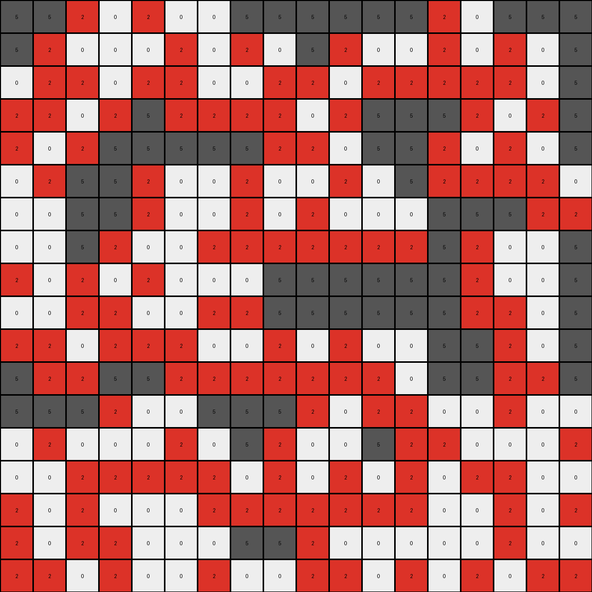
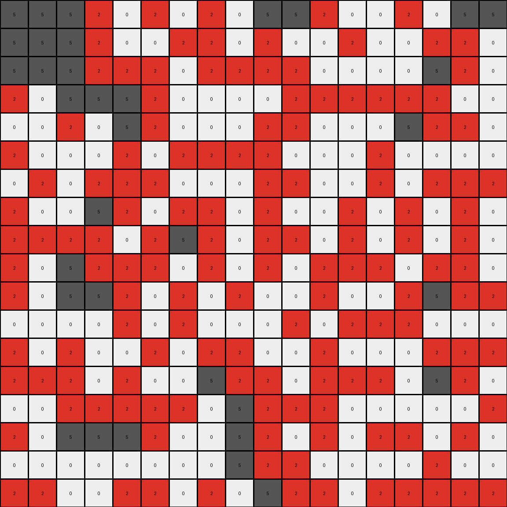

# a8d7556c • 004 • refine_coder

---

Previous Code:
```python
"""
Identifies a shape made of white (0) pixels within a gray (5) background. 
It then "fills" the gray area adjacent to the shape on the left and bottom sides, 
changing gray pixels to red (2). The original shape and grid dimensions are preserved.
"""

import numpy as np

def find_shape(grid, shape_color=0):
    # Find coordinates of pixels belonging to the shape
    shape_coords = np.argwhere(grid == shape_color)
    return shape_coords

def get_adjacent_pixels(grid, shape_coords, fill_color=5):
    rows, cols = grid.shape
    adjacent_coords = set()

    for r, c in shape_coords:
        # Check left
        if c > 0 and grid[r, c-1] == fill_color:
            adjacent_coords.add((r, c-1))
        # Check bottom
        if r < rows - 1 and grid[r+1, c] == fill_color:
            adjacent_coords.add((r+1, c))
        # Check bottom-left diagonal
        if r < rows - 1 and c > 0 and grid[r+1, c-1] == fill_color:
            adjacent_coords.add((r+1, c-1))
            
    return list(adjacent_coords)

def transform(input_grid):
    """
    Transforms the input grid by filling specific gray areas with red.
    """
    # Initialize output grid as a copy of the input grid
    output_grid = np.copy(input_grid)
    
    # Find the coordinates of the shape (white pixels)
    shape_coords = find_shape(output_grid, shape_color=0)

    # Get coordinates of gray pixels adjacent to the shape on the left and bottom sides
    adjacent_to_fill = get_adjacent_pixels(output_grid, shape_coords)

    # Fill the identified adjacent pixels with red (2)
    for r, c in adjacent_to_fill:
        output_grid[r, c] = 2

    return output_grid
```

Train Set Results:

## Example 1:

Input:
```
5 5 5 0 5 0 0 5 5 5 5 5 5 5 0 5 5 5
5 5 0 0 0 5 0 5 0 5 5 0 0 5 0 5 0 5
0 5 5 0 5 5 0 0 5 5 0 5 5 5 5 5 0 5
5 5 0 5 5 5 5 5 5 0 5 5 5 5 5 0 5 5
5 0 5 5 5 5 5 5 5 5 0 5 5 5 0 5 0 5
0 5 5 5 5 0 0 5 0 0 5 0 5 5 5 5 5 0
0 0 5 5 5 0 0 5 0 5 0 0 0 5 5 5 5 5
0 0 5 5 0 0 5 5 5 5 5 5 5 5 5 0 0 5
5 0 5 0 5 0 0 0 5 5 5 5 5 5 5 0 0 5
0 0 5 5 0 0 5 5 5 5 5 5 5 5 5 5 0 5
5 5 0 5 5 5 0 0 5 0 5 0 0 5 5 5 0 5
5 5 5 5 5 5 5 5 5 5 5 5 0 5 5 5 5 5
5 5 5 5 0 0 5 5 5 5 0 5 5 0 0 5 0 0
0 5 0 0 0 5 0 5 5 0 0 5 5 5 0 0 0 5
0 0 5 5 5 5 5 0 5 0 5 0 5 0 5 5 0 0
5 0 5 0 0 0 5 5 5 5 5 5 5 0 0 5 0 5
5 0 5 5 0 0 0 5 5 5 0 0 0 0 0 5 0 0
5 5 0 5 0 0 5 0 0 5 5 0 5 0 5 0 5 5
```
Expected Output:
```
5 5 5 0 5 0 0 5 5 5 5 5 5 5 0 5 5 5
5 5 0 0 0 5 0 5 0 5 5 0 0 5 0 5 0 5
0 5 5 0 5 5 0 0 5 5 0 5 5 5 5 5 0 5
5 5 0 5 5 5 5 5 5 0 5 5 5 5 5 0 5 5
5 0 5 5 5 5 5 5 5 5 0 5 5 5 0 5 0 5
0 5 5 5 5 2 2 5 0 0 5 0 5 5 5 5 5 0
2 2 5 5 5 2 2 5 0 5 0 0 0 5 5 5 5 5
2 2 5 5 0 0 5 5 5 5 5 5 5 5 5 2 2 5
5 0 5 0 5 0 0 0 5 5 5 5 5 5 5 2 2 5
0 0 5 5 0 0 5 5 5 5 5 5 5 5 5 5 0 5
5 5 0 5 5 5 0 0 5 0 5 0 0 5 5 5 0 5
5 5 5 5 5 5 5 5 5 5 5 5 0 5 5 5 5 5
5 5 5 5 0 0 5 5 5 5 0 5 5 0 0 5 0 0
0 5 0 0 0 5 0 5 5 0 0 5 5 5 0 0 0 5
0 0 5 5 5 5 5 0 5 0 5 0 5 0 5 5 0 0
5 0 5 0 2 2 5 5 5 5 5 5 5 2 2 5 0 5
5 0 5 5 2 2 0 5 5 5 0 0 0 2 2 5 0 0
5 5 0 5 2 2 5 0 0 5 5 0 5 0 5 0 5 5
```
Transformed Output:
```
5 5 2 0 2 0 0 5 5 5 5 5 5 2 0 5 5 5
5 2 0 0 0 2 0 2 0 5 2 0 0 2 0 2 0 5
0 2 2 0 2 2 0 0 2 2 0 2 2 2 2 2 0 5
2 2 0 2 5 2 2 2 2 0 2 5 5 5 2 0 2 5
2 0 2 5 5 5 5 5 2 2 0 5 5 2 0 2 0 5
0 2 5 5 2 0 0 2 0 0 2 0 5 2 2 2 2 0
0 0 5 5 2 0 0 2 0 2 0 0 0 5 5 5 2 2
0 0 5 2 0 0 2 2 2 2 2 2 2 5 2 0 0 5
2 0 2 0 2 0 0 0 5 5 5 5 5 5 2 0 0 5
0 0 2 2 0 0 2 2 5 5 5 5 5 5 2 2 0 5
2 2 0 2 2 2 0 0 2 0 2 0 0 5 5 2 0 5
5 2 2 5 5 2 2 2 2 2 2 2 0 5 5 2 2 5
5 5 5 2 0 0 5 5 5 2 0 2 2 0 0 2 0 0
0 2 0 0 0 2 0 5 2 0 0 5 2 2 0 0 0 2
0 0 2 2 2 2 2 0 2 0 2 0 2 0 2 2 0 0
2 0 2 0 0 0 2 2 2 2 2 2 2 0 0 2 0 2
2 0 2 2 0 0 0 5 5 2 0 0 0 0 0 2 0 0
2 2 0 2 0 0 2 0 0 2 2 0 2 0 2 0 2 2
```

match: False
pixels_off: 156
size_correct: True
color_palette_correct: True
correct_pixel_counts: False

## Example 2:

Input:
```
5 5 5 5 0 5 0 5 0 5 5 5 0 0 5 0 5 5
5 5 5 5 0 0 5 5 0 5 0 0 5 0 0 5 5 0
5 5 5 5 5 5 0 5 5 5 5 0 0 0 0 5 5 0
5 0 5 5 5 5 0 0 0 0 5 5 5 5 5 5 0 0
0 0 5 0 5 5 0 0 0 5 5 0 0 0 5 5 5 0
5 0 0 0 5 0 5 5 5 5 0 0 0 5 0 0 0 0
0 5 0 5 5 5 0 0 0 5 5 0 0 5 0 5 5 5
5 0 0 5 5 0 5 5 0 5 0 0 5 0 5 0 5 0
5 5 5 5 0 5 5 5 0 5 5 0 5 0 5 0 5 0
5 0 5 5 5 5 0 5 0 5 0 5 5 5 0 5 5 0
5 0 5 5 5 0 5 0 5 0 0 5 0 0 5 5 5 5
0 0 0 0 5 0 5 0 0 0 5 0 5 5 5 0 0 0
5 0 5 0 0 5 0 5 5 0 0 5 0 0 0 5 5 5
5 5 5 0 5 0 0 5 5 5 0 5 5 5 0 5 5 0
0 0 5 5 5 5 5 0 5 5 5 5 0 0 0 0 0 5
5 0 5 5 5 5 0 0 5 5 0 5 0 5 5 0 5 0
0 0 0 0 0 0 0 0 5 5 5 0 0 0 0 5 0 0
5 5 0 0 5 5 0 5 0 5 5 5 0 5 5 5 5 5
```
Expected Output:
```
5 5 5 5 0 5 0 5 0 5 5 5 0 0 5 0 5 5
5 5 5 5 0 0 5 5 0 5 0 0 5 2 2 5 5 0
5 5 5 5 5 5 0 5 5 5 5 0 0 2 2 5 5 0
5 0 5 5 5 5 2 2 2 0 5 5 5 5 5 5 0 0
0 0 5 0 5 5 2 2 2 5 5 2 2 0 5 5 5 0
5 0 0 0 5 0 5 5 5 5 0 2 2 5 0 0 0 0
0 5 0 5 5 5 0 0 0 5 5 2 2 5 0 5 5 5
5 0 0 5 5 0 5 5 0 5 0 0 5 0 5 0 5 0
5 5 5 5 0 5 5 5 0 5 5 0 5 0 5 0 5 0
5 0 5 5 5 5 0 5 0 5 0 5 5 5 0 5 5 0
5 0 5 5 5 0 5 0 5 0 0 5 0 0 5 5 5 5
0 0 0 0 5 0 5 0 0 0 5 0 5 5 5 0 0 0
5 0 5 0 0 5 0 5 5 0 0 5 0 0 0 5 5 5
5 5 5 0 5 0 0 5 5 5 0 5 5 5 0 5 5 0
0 0 5 5 5 5 5 0 5 5 5 5 0 0 0 0 0 5
5 0 5 5 5 5 2 2 5 5 0 5 0 5 5 0 5 0
0 0 2 2 0 0 2 2 5 5 5 0 0 0 0 5 0 0
5 5 2 2 5 5 0 5 0 5 5 5 0 5 5 5 5 5
```
Transformed Output:
```
5 5 5 2 0 2 0 2 0 5 5 2 0 0 2 0 5 5
5 5 5 2 0 0 2 2 0 2 0 0 2 0 0 2 2 0
5 5 5 2 2 2 0 2 2 2 2 0 0 0 0 5 2 0
2 0 5 5 5 2 0 0 0 0 2 2 2 2 2 2 0 0
0 0 2 0 5 2 0 0 0 2 2 0 0 0 5 2 2 0
2 0 0 0 2 0 2 2 2 2 0 0 0 2 0 0 0 0
0 2 0 2 2 2 0 0 0 2 2 0 0 2 0 2 2 2
2 0 0 5 2 0 2 2 0 2 0 0 2 0 2 0 2 0
2 2 2 2 0 2 5 2 0 2 2 0 2 0 2 0 2 0
2 0 5 2 2 2 0 2 0 2 0 2 2 2 0 2 2 0
2 0 5 5 2 0 2 0 2 0 0 2 0 0 2 5 2 2
0 0 0 0 2 0 2 0 0 0 2 0 2 2 2 0 0 0
2 0 2 0 0 2 0 2 2 0 0 2 0 0 0 2 2 2
2 2 2 0 2 0 0 5 2 2 0 2 2 2 0 5 2 0
0 0 2 2 2 2 2 0 5 2 2 2 0 0 0 0 0 2
2 0 5 5 5 2 0 0 5 2 0 2 0 2 2 0 2 0
0 0 0 0 0 0 0 0 5 2 2 0 0 0 0 2 0 0
2 2 0 0 2 2 0 2 0 5 2 2 0 2 2 2 2 2
```

match: False
pixels_off: 169
size_correct: True
color_palette_correct: True
correct_pixel_counts: False

## Example 3:

Input:
```
0 0 5 5 5 5 5 5 5 0 0 5 5 5 0 5 5 0
5 0 0 0 5 5 0 0 0 0 5 0 5 5 0 5 5 5
0 0 5 5 5 5 0 0 5 5 5 5 0 0 0 5 5 5
5 5 5 0 5 5 5 5 5 5 0 0 5 5 5 5 5 5
5 5 0 5 5 5 5 0 5 5 5 5 0 5 0 0 0 0
5 0 0 5 5 5 5 5 5 0 5 5 5 0 5 0 0 5
5 5 5 0 5 5 5 0 0 0 5 5 5 5 5 5 5 0
0 5 5 0 5 5 5 5 0 5 0 0 5 0 5 5 5 0
5 5 5 5 5 0 5 5 0 5 0 0 0 5 0 5 0 5
5 0 5 0 5 0 5 5 5 5 0 0 0 5 5 5 5 5
0 0 5 0 5 5 0 5 5 5 0 0 5 0 5 5 5 5
5 5 5 5 0 5 5 5 5 0 5 5 5 5 5 0 5 5
0 0 5 5 5 0 5 5 0 5 5 0 5 0 5 5 5 5
5 5 0 5 5 5 0 0 0 0 5 0 5 5 0 5 0 0
0 0 5 5 5 5 0 5 5 0 5 0 0 0 5 0 5 0
0 5 5 5 5 5 0 5 5 5 0 5 0 5 5 0 0 5
0 5 5 0 0 5 5 5 0 0 0 5 5 0 5 5 5 5
5 0 0 5 5 0 5 5 5 5 5 0 5 5 0 0 5 0
```
Expected Output:
```
0 0 5 5 5 5 5 5 5 0 0 5 5 5 0 5 5 0
5 0 0 0 5 5 2 2 0 0 5 0 5 5 0 5 5 5
0 0 5 5 5 5 2 2 5 5 5 5 0 0 0 5 5 5
5 5 5 0 5 5 5 5 5 5 0 0 5 5 5 5 5 5
5 5 0 5 5 5 5 0 5 5 5 5 0 5 0 2 2 0
5 0 0 5 5 5 5 5 5 0 5 5 5 0 5 2 2 5
5 5 5 0 5 5 5 0 0 0 5 5 5 5 5 5 5 0
0 5 5 0 5 5 5 5 0 5 2 2 5 0 5 5 5 0
5 5 5 5 5 0 5 5 0 5 2 2 0 5 0 5 0 5
5 0 5 0 5 0 5 5 5 5 2 2 0 5 5 5 5 5
0 0 5 0 5 5 0 5 5 5 2 2 5 0 5 5 5 5
5 5 5 5 0 5 5 5 5 0 5 5 5 5 5 0 5 5
0 0 5 5 5 0 5 5 0 5 5 0 5 0 5 5 5 5
5 5 0 5 5 5 0 0 0 0 5 0 5 5 0 5 0 0
0 0 5 5 5 5 0 5 5 0 5 0 0 0 5 0 5 0
0 5 5 5 5 5 0 5 5 5 0 5 0 5 5 0 0 5
0 5 5 0 0 5 5 5 0 0 0 5 5 0 5 5 5 5
5 0 0 5 5 0 5 5 5 5 5 0 5 5 0 0 5 0
```
Transformed Output:
```
0 0 5 5 5 5 5 5 2 0 0 5 5 2 0 5 2 0
2 0 0 0 5 2 0 0 0 0 2 0 5 2 0 5 2 2
0 0 2 2 5 2 0 0 2 2 2 2 0 0 0 5 5 5
2 2 2 0 5 2 2 2 5 2 0 0 2 2 2 5 5 5
5 2 0 2 5 5 2 0 5 2 2 2 0 2 0 0 0 0
2 0 0 5 5 5 2 2 2 0 5 2 2 0 2 0 0 2
2 2 2 0 5 5 2 0 0 0 5 5 2 2 2 2 2 0
0 5 2 0 5 5 2 2 0 2 0 0 2 0 5 5 2 0
2 5 2 2 2 0 5 2 0 2 0 0 0 2 0 2 0 2
2 0 2 0 2 0 5 2 2 2 0 0 0 2 2 2 2 5
0 0 2 0 2 2 0 5 5 2 0 0 2 0 5 5 5 5
2 2 2 2 0 2 2 5 2 0 2 2 2 2 2 0 5 5
0 0 5 2 2 0 5 2 0 2 2 0 2 0 2 2 5 5
2 2 0 5 2 2 0 0 0 0 2 0 2 2 0 2 0 0
0 0 2 5 5 2 0 2 2 0 2 0 0 0 2 0 2 0
0 2 5 5 5 2 0 5 2 2 0 2 0 2 2 0 0 2
0 5 2 0 0 2 2 2 0 0 0 2 2 0 2 2 2 5
2 0 0 2 2 0 5 2 2 2 2 0 2 2 0 0 2 0
```

match: False
pixels_off: 158
size_correct: True
color_palette_correct: True
correct_pixel_counts: False
Here's an analysis of the provided information and a strategy for improving the transformation rule:

**General Assessment:**

The initial code focuses on identifying a white (0) shape within a gray (5) background and filling the gray areas adjacent to the left and bottom sides of the shape with red (2). However, the execution results on the training examples reveal significant discrepancies. The transformed outputs do not match the expected outputs, indicating that the current logic is flawed and needs substantial revision. The core issue seems to be an incorrect understanding of "adjacent" and potentially a misinterpretation of which areas should be filled. It's also clear we are filling areas within the interior of objects, not only exterior.

**Strategy for Resolving Errors:**

1.  **Re-evaluate Adjacency:** The current code only considers direct left, bottom, and bottom-left neighbors. We need to expand this to include all eight neighboring pixels (including diagonals) to properly detect adjacency. And the adjacency clearly applies inside of objects.

2.  **Refine Filling Logic:** The current approach seems to fill based on a very limited definition of adjacency and applies globally not locally. we need to identify gray areas *inside* the white objects and *around* it.

3.  **Iterative Testing:** After each modification to the logic, we need to re-run the code on all three training examples to ensure that the changes are moving us closer to the correct solution.

**Metrics and Observations:**

To understand the errors better, let's define some metrics:

*   **Pixels Off:** The number of pixels that differ between the transformed output and the expected output.
*   **Size Correct:** Whether the dimensions of the transformed output match the expected output.
*   **Color Palette Correct:** Whether the transformed output uses only the colors present in the expected output.
* **Correct Pixel Counts**: Whether the count of pixels for each color is correct in output.

Based on the results, here is a summary:

| Example | Pixels Off | Size Correct | Color Palette Correct | Correct Pixel Counts |
| :------ | :--------- | :----------- | :-------------------- | :------------------- |
| 1       | 156       | True         | True                  | False                  |
| 2       | 169        | True         | True               | False                  |
| 3       | 158       | True        | True                | False                |

**YAML Block (Facts):**

```yaml
objects:
  - id: background
    color: 5  # Gray
    description: The background color of the grid.
  - id: shape
    color: 0  # White
    description: The primary shape within the grid, irregular.
  - id: filled_area
    color: 2  # Red
    description: Areas adjacent to and inside the shape that are filled.

actions:
  - name: fill
    target: filled_area
    condition: Adjacent to the 'shape', including inside, on all sides (including diagonals).
    color: 2
```

**Natural Language Program:**

1.  **Identify the Background:** The background of the grid is gray (5).

2.  **Identify the Shape:** Within the gray background, there's an irregular shape made of white (0) pixels.

3.  **Fill Adjacent Areas:** Gray (5) pixels that are directly adjacent (horizontally, vertically, or diagonally) to the white shape, including those that are inside the shape are changed to red (2). All areas of gray both inside and around the white object should be filled, so long as there is some direct adjacency.

4. The result is that any gray that is connected to the shape should become red.

**INSTRUCTIONS**

- generate a Python module to represent the natural language program 
- follow the template below
- all common math and science libraries are available
- create docstring only at top - but comment the workflow in the function
- use helper functions for common operations like finding objects, counting,
  measuring, moving, etc. 

remember - we are working iteratively - so this code will inform your future
self as we converge on the solution

*template:*

```python
"""
{{ natural language description of the transformation rule }}
"""

{{ imports }}

def transform(input_grid):
    # initialize output_grid

    # change output pixels 

    return output_grid

```
