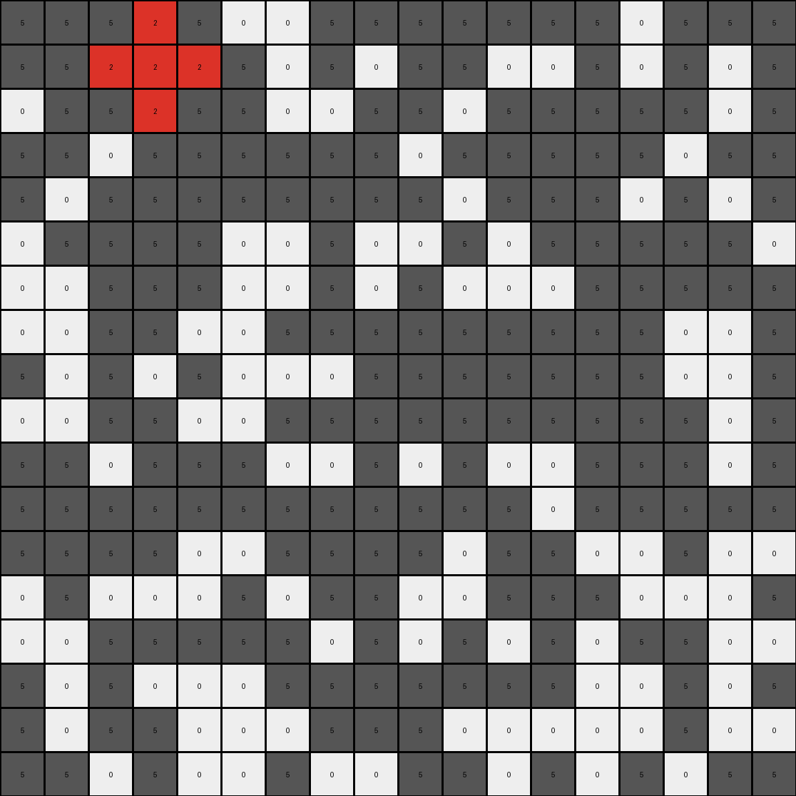
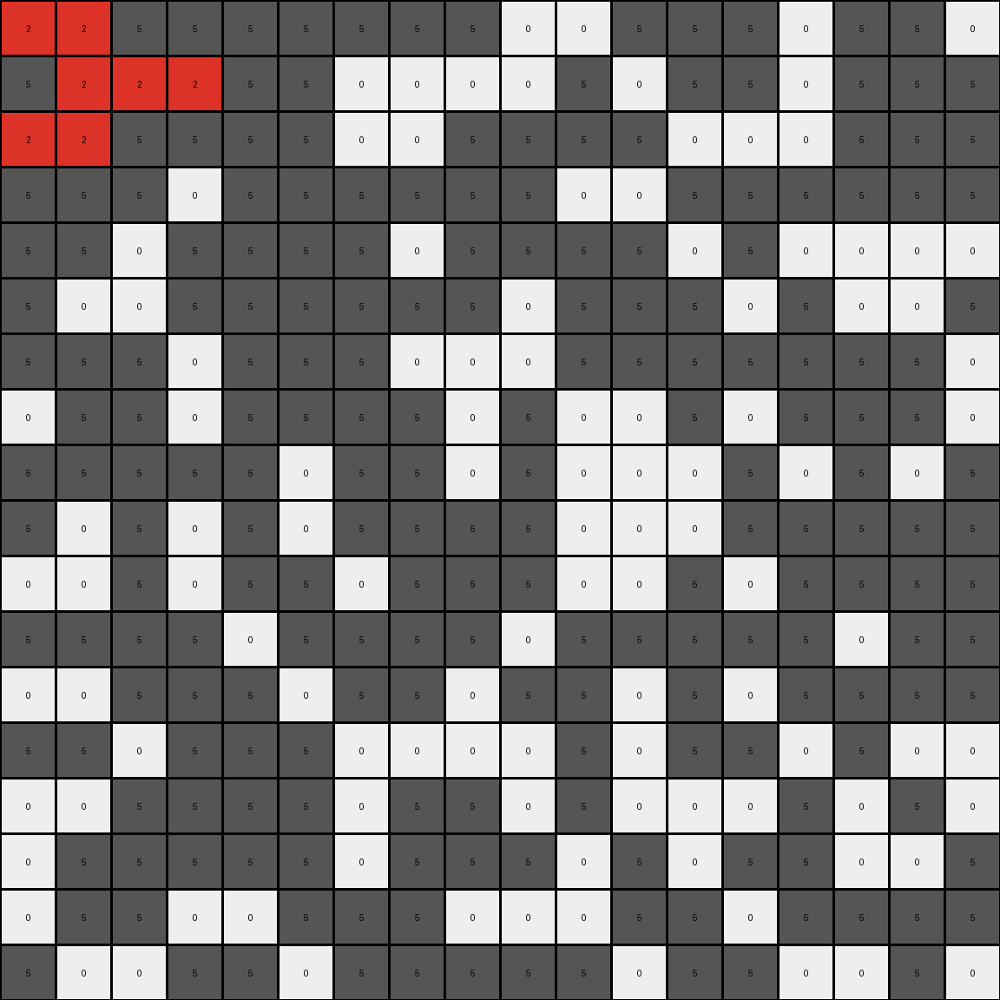

# a8d7556c • 012 • refine_coder

---

Previous Code:
```python
"""
1.  **Identify Regions:** The input grid consists of pixels with values from 0 to 9, representing different colors. Find all regions, where a region is defined as a contiguous block of pixels of the same color, that are bounded by either the edge of the grid, or a grey (value 5) pixel.

2.  **Find First White Region.** Among the white (value 0) regions, find the region whose top-most row is the lowest. If there are multiple such regions, the region that starts at the lowest column takes priority.
    
3.  **Fill Region:** Starting with the top-most row of this region, change the color of all pixels in the region to red (value 2) until a grey pixel or the grid boundary is reached.

4.  **Iterate:** Repeat this process for all rows of the specified white region, changing the color of all white pixels to red that are within that region, until a grey pixel, or the edge of the grid is reached.
    
5.  **No Modification of Other Pixels:** The gray (5) pixels and all other regions are not to be modified. The final output grid has the same dimensions as the input.
"""

import numpy as np

def get_neighbors(pos, rows, cols):
    """Returns the valid neighbors of a given position."""
    r, c = pos
    neighbors = []
    if r > 0:
        neighbors.append((r - 1, c))
    if r < rows - 1:
        neighbors.append((r + 1, c))
    if c > 0:
        neighbors.append((r, c - 1))
    if c < cols - 1:
        neighbors.append((r, c + 1))
    return neighbors

def find_regions(grid, color):
    """Finds all regions of the specified color in the grid."""
    rows, cols = grid.shape
    visited = set()
    regions = []

    def dfs(pos, current_region):
        """Depth-first search to find connected regions."""
        if pos in visited or grid[pos] != color:
            return
        visited.add(pos)
        current_region.append(pos)
        for neighbor in get_neighbors(pos, rows, cols):
            # Check for boundary (grey pixel or edge)
            if grid[neighbor] != color and grid[neighbor] !=5:
                continue
            dfs(neighbor, current_region)

    for r in range(rows):
        for c in range(cols):
            if grid[r, c] == color and (r, c) not in visited:
                current_region = []
                dfs((r, c), current_region)
                regions.append(current_region)
    return regions

def find_first_white_region(grid, white_regions):
    """Finds the first white region based on top-most row and then left-most column."""
    if not white_regions:
        return None

    # Sort regions by top-most row (and then left-most column for ties)
    sorted_regions = sorted(white_regions, key=lambda region: (min(r for r, _ in region), min(c for _, c in region)))
    return sorted_regions[0]

def fill_region(grid, region):
    """
    Fill the region specified by the provided coordinates.
    """
    output_grid = np.copy(grid)
    min_row = min(r for r, _ in region)
    
    
    for r,c in region:
        if grid[r,c] == 0:
           output_grid[r,c] = 2
    return output_grid


def transform(input_grid):
    # initialize output_grid
    output_grid = np.copy(input_grid)
    rows, cols = output_grid.shape
    
    # Identify all white regions
    white_regions = find_regions(input_grid, 0)

    # Find the first white region
    first_white_region = find_first_white_region(input_grid, white_regions)

    # Fill the region.
    if first_white_region:
        output_grid = fill_region(output_grid, first_white_region)

    return output_grid
```

Train Set Results:

## Example 1:

Input:
```
5 5 5 0 5 0 0 5 5 5 5 5 5 5 0 5 5 5
5 5 0 0 0 5 0 5 0 5 5 0 0 5 0 5 0 5
0 5 5 0 5 5 0 0 5 5 0 5 5 5 5 5 0 5
5 5 0 5 5 5 5 5 5 0 5 5 5 5 5 0 5 5
5 0 5 5 5 5 5 5 5 5 0 5 5 5 0 5 0 5
0 5 5 5 5 0 0 5 0 0 5 0 5 5 5 5 5 0
0 0 5 5 5 0 0 5 0 5 0 0 0 5 5 5 5 5
0 0 5 5 0 0 5 5 5 5 5 5 5 5 5 0 0 5
5 0 5 0 5 0 0 0 5 5 5 5 5 5 5 0 0 5
0 0 5 5 0 0 5 5 5 5 5 5 5 5 5 5 0 5
5 5 0 5 5 5 0 0 5 0 5 0 0 5 5 5 0 5
5 5 5 5 5 5 5 5 5 5 5 5 0 5 5 5 5 5
5 5 5 5 0 0 5 5 5 5 0 5 5 0 0 5 0 0
0 5 0 0 0 5 0 5 5 0 0 5 5 5 0 0 0 5
0 0 5 5 5 5 5 0 5 0 5 0 5 0 5 5 0 0
5 0 5 0 0 0 5 5 5 5 5 5 5 0 0 5 0 5
5 0 5 5 0 0 0 5 5 5 0 0 0 0 0 5 0 0
5 5 0 5 0 0 5 0 0 5 5 0 5 0 5 0 5 5
```
Expected Output:
```
5 5 5 0 5 0 0 5 5 5 5 5 5 5 0 5 5 5
5 5 0 0 0 5 0 5 0 5 5 0 0 5 0 5 0 5
0 5 5 0 5 5 0 0 5 5 0 5 5 5 5 5 0 5
5 5 0 5 5 5 5 5 5 0 5 5 5 5 5 0 5 5
5 0 5 5 5 5 5 5 5 5 0 5 5 5 0 5 0 5
0 5 5 5 5 2 2 5 0 0 5 0 5 5 5 5 5 0
2 2 5 5 5 2 2 5 0 5 0 0 0 5 5 5 5 5
2 2 5 5 0 0 5 5 5 5 5 5 5 5 5 2 2 5
5 0 5 0 5 0 0 0 5 5 5 5 5 5 5 2 2 5
0 0 5 5 0 0 5 5 5 5 5 5 5 5 5 5 0 5
5 5 0 5 5 5 0 0 5 0 5 0 0 5 5 5 0 5
5 5 5 5 5 5 5 5 5 5 5 5 0 5 5 5 5 5
5 5 5 5 0 0 5 5 5 5 0 5 5 0 0 5 0 0
0 5 0 0 0 5 0 5 5 0 0 5 5 5 0 0 0 5
0 0 5 5 5 5 5 0 5 0 5 0 5 0 5 5 0 0
5 0 5 0 2 2 5 5 5 5 5 5 5 2 2 5 0 5
5 0 5 5 2 2 0 5 5 5 0 0 0 2 2 5 0 0
5 5 0 5 2 2 5 0 0 5 5 0 5 0 5 0 5 5
```
Transformed Output:
```
5 5 5 2 5 0 0 5 5 5 5 5 5 5 0 5 5 5
5 5 2 2 2 5 0 5 0 5 5 0 0 5 0 5 0 5
0 5 5 2 5 5 0 0 5 5 0 5 5 5 5 5 0 5
5 5 0 5 5 5 5 5 5 0 5 5 5 5 5 0 5 5
5 0 5 5 5 5 5 5 5 5 0 5 5 5 0 5 0 5
0 5 5 5 5 0 0 5 0 0 5 0 5 5 5 5 5 0
0 0 5 5 5 0 0 5 0 5 0 0 0 5 5 5 5 5
0 0 5 5 0 0 5 5 5 5 5 5 5 5 5 0 0 5
5 0 5 0 5 0 0 0 5 5 5 5 5 5 5 0 0 5
0 0 5 5 0 0 5 5 5 5 5 5 5 5 5 5 0 5
5 5 0 5 5 5 0 0 5 0 5 0 0 5 5 5 0 5
5 5 5 5 5 5 5 5 5 5 5 5 0 5 5 5 5 5
5 5 5 5 0 0 5 5 5 5 0 5 5 0 0 5 0 0
0 5 0 0 0 5 0 5 5 0 0 5 5 5 0 0 0 5
0 0 5 5 5 5 5 0 5 0 5 0 5 0 5 5 0 0
5 0 5 0 0 0 5 5 5 5 5 5 5 0 0 5 0 5
5 0 5 5 0 0 0 5 5 5 0 0 0 0 0 5 0 0
5 5 0 5 0 0 5 0 0 5 5 0 5 0 5 0 5 5
```

match: False
pixels_off: 27
size_correct: True
color_palette_correct: True
correct_pixel_counts: False

## Example 2:

Input:
```
5 5 5 5 0 5 0 5 0 5 5 5 0 0 5 0 5 5
5 5 5 5 0 0 5 5 0 5 0 0 5 0 0 5 5 0
5 5 5 5 5 5 0 5 5 5 5 0 0 0 0 5 5 0
5 0 5 5 5 5 0 0 0 0 5 5 5 5 5 5 0 0
0 0 5 0 5 5 0 0 0 5 5 0 0 0 5 5 5 0
5 0 0 0 5 0 5 5 5 5 0 0 0 5 0 0 0 0
0 5 0 5 5 5 0 0 0 5 5 0 0 5 0 5 5 5
5 0 0 5 5 0 5 5 0 5 0 0 5 0 5 0 5 0
5 5 5 5 0 5 5 5 0 5 5 0 5 0 5 0 5 0
5 0 5 5 5 5 0 5 0 5 0 5 5 5 0 5 5 0
5 0 5 5 5 0 5 0 5 0 0 5 0 0 5 5 5 5
0 0 0 0 5 0 5 0 0 0 5 0 5 5 5 0 0 0
5 0 5 0 0 5 0 5 5 0 0 5 0 0 0 5 5 5
5 5 5 0 5 0 0 5 5 5 0 5 5 5 0 5 5 0
0 0 5 5 5 5 5 0 5 5 5 5 0 0 0 0 0 5
5 0 5 5 5 5 0 0 5 5 0 5 0 5 5 0 5 0
0 0 0 0 0 0 0 0 5 5 5 0 0 0 0 5 0 0
5 5 0 0 5 5 0 5 0 5 5 5 0 5 5 5 5 5
```
Expected Output:
```
5 5 5 5 0 5 0 5 0 5 5 5 0 0 5 0 5 5
5 5 5 5 0 0 5 5 0 5 0 0 5 2 2 5 5 0
5 5 5 5 5 5 0 5 5 5 5 0 0 2 2 5 5 0
5 0 5 5 5 5 2 2 2 0 5 5 5 5 5 5 0 0
0 0 5 0 5 5 2 2 2 5 5 2 2 0 5 5 5 0
5 0 0 0 5 0 5 5 5 5 0 2 2 5 0 0 0 0
0 5 0 5 5 5 0 0 0 5 5 2 2 5 0 5 5 5
5 0 0 5 5 0 5 5 0 5 0 0 5 0 5 0 5 0
5 5 5 5 0 5 5 5 0 5 5 0 5 0 5 0 5 0
5 0 5 5 5 5 0 5 0 5 0 5 5 5 0 5 5 0
5 0 5 5 5 0 5 0 5 0 0 5 0 0 5 5 5 5
0 0 0 0 5 0 5 0 0 0 5 0 5 5 5 0 0 0
5 0 5 0 0 5 0 5 5 0 0 5 0 0 0 5 5 5
5 5 5 0 5 0 0 5 5 5 0 5 5 5 0 5 5 0
0 0 5 5 5 5 5 0 5 5 5 5 0 0 0 0 0 5
5 0 5 5 5 5 2 2 5 5 0 5 0 5 5 0 5 0
0 0 2 2 0 0 2 2 5 5 5 0 0 0 0 5 0 0
5 5 2 2 5 5 0 5 0 5 5 5 0 5 5 5 5 5
```
Transformed Output:
```
5 5 5 5 2 5 0 5 0 5 5 5 0 0 5 0 5 5
5 5 5 5 2 2 5 5 0 5 0 0 5 0 0 5 5 0
5 5 5 5 5 5 0 5 5 5 5 0 0 0 0 5 5 0
5 0 5 5 5 5 0 0 0 0 5 5 5 5 5 5 0 0
0 0 5 0 5 5 0 0 0 5 5 0 0 0 5 5 5 0
5 0 0 0 5 0 5 5 5 5 0 0 0 5 0 0 0 0
0 5 0 5 5 5 0 0 0 5 5 0 0 5 0 5 5 5
5 0 0 5 5 0 5 5 0 5 0 0 5 0 5 0 5 0
5 5 5 5 0 5 5 5 0 5 5 0 5 0 5 0 5 0
5 0 5 5 5 5 0 5 0 5 0 5 5 5 0 5 5 0
5 0 5 5 5 0 5 0 5 0 0 5 0 0 5 5 5 5
0 0 0 0 5 0 5 0 0 0 5 0 5 5 5 0 0 0
5 0 5 0 0 5 0 5 5 0 0 5 0 0 0 5 5 5
5 5 5 0 5 0 0 5 5 5 0 5 5 5 0 5 5 0
0 0 5 5 5 5 5 0 5 5 5 5 0 0 0 0 0 5
5 0 5 5 5 5 0 0 5 5 0 5 0 5 5 0 5 0
0 0 0 0 0 0 0 0 5 5 5 0 0 0 0 5 0 0
5 5 0 0 5 5 0 5 0 5 5 5 0 5 5 5 5 5
```

match: False
pixels_off: 27
size_correct: True
color_palette_correct: True
correct_pixel_counts: False

## Example 3:

Input:
```
0 0 5 5 5 5 5 5 5 0 0 5 5 5 0 5 5 0
5 0 0 0 5 5 0 0 0 0 5 0 5 5 0 5 5 5
0 0 5 5 5 5 0 0 5 5 5 5 0 0 0 5 5 5
5 5 5 0 5 5 5 5 5 5 0 0 5 5 5 5 5 5
5 5 0 5 5 5 5 0 5 5 5 5 0 5 0 0 0 0
5 0 0 5 5 5 5 5 5 0 5 5 5 0 5 0 0 5
5 5 5 0 5 5 5 0 0 0 5 5 5 5 5 5 5 0
0 5 5 0 5 5 5 5 0 5 0 0 5 0 5 5 5 0
5 5 5 5 5 0 5 5 0 5 0 0 0 5 0 5 0 5
5 0 5 0 5 0 5 5 5 5 0 0 0 5 5 5 5 5
0 0 5 0 5 5 0 5 5 5 0 0 5 0 5 5 5 5
5 5 5 5 0 5 5 5 5 0 5 5 5 5 5 0 5 5
0 0 5 5 5 0 5 5 0 5 5 0 5 0 5 5 5 5
5 5 0 5 5 5 0 0 0 0 5 0 5 5 0 5 0 0
0 0 5 5 5 5 0 5 5 0 5 0 0 0 5 0 5 0
0 5 5 5 5 5 0 5 5 5 0 5 0 5 5 0 0 5
0 5 5 0 0 5 5 5 0 0 0 5 5 0 5 5 5 5
5 0 0 5 5 0 5 5 5 5 5 0 5 5 0 0 5 0
```
Expected Output:
```
0 0 5 5 5 5 5 5 5 0 0 5 5 5 0 5 5 0
5 0 0 0 5 5 2 2 0 0 5 0 5 5 0 5 5 5
0 0 5 5 5 5 2 2 5 5 5 5 0 0 0 5 5 5
5 5 5 0 5 5 5 5 5 5 0 0 5 5 5 5 5 5
5 5 0 5 5 5 5 0 5 5 5 5 0 5 0 2 2 0
5 0 0 5 5 5 5 5 5 0 5 5 5 0 5 2 2 5
5 5 5 0 5 5 5 0 0 0 5 5 5 5 5 5 5 0
0 5 5 0 5 5 5 5 0 5 2 2 5 0 5 5 5 0
5 5 5 5 5 0 5 5 0 5 2 2 0 5 0 5 0 5
5 0 5 0 5 0 5 5 5 5 2 2 0 5 5 5 5 5
0 0 5 0 5 5 0 5 5 5 2 2 5 0 5 5 5 5
5 5 5 5 0 5 5 5 5 0 5 5 5 5 5 0 5 5
0 0 5 5 5 0 5 5 0 5 5 0 5 0 5 5 5 5
5 5 0 5 5 5 0 0 0 0 5 0 5 5 0 5 0 0
0 0 5 5 5 5 0 5 5 0 5 0 0 0 5 0 5 0
0 5 5 5 5 5 0 5 5 5 0 5 0 5 5 0 0 5
0 5 5 0 0 5 5 5 0 0 0 5 5 0 5 5 5 5
5 0 0 5 5 0 5 5 5 5 5 0 5 5 0 0 5 0
```
Transformed Output:
```
2 2 5 5 5 5 5 5 5 0 0 5 5 5 0 5 5 0
5 2 2 2 5 5 0 0 0 0 5 0 5 5 0 5 5 5
2 2 5 5 5 5 0 0 5 5 5 5 0 0 0 5 5 5
5 5 5 0 5 5 5 5 5 5 0 0 5 5 5 5 5 5
5 5 0 5 5 5 5 0 5 5 5 5 0 5 0 0 0 0
5 0 0 5 5 5 5 5 5 0 5 5 5 0 5 0 0 5
5 5 5 0 5 5 5 0 0 0 5 5 5 5 5 5 5 0
0 5 5 0 5 5 5 5 0 5 0 0 5 0 5 5 5 0
5 5 5 5 5 0 5 5 0 5 0 0 0 5 0 5 0 5
5 0 5 0 5 0 5 5 5 5 0 0 0 5 5 5 5 5
0 0 5 0 5 5 0 5 5 5 0 0 5 0 5 5 5 5
5 5 5 5 0 5 5 5 5 0 5 5 5 5 5 0 5 5
0 0 5 5 5 0 5 5 0 5 5 0 5 0 5 5 5 5
5 5 0 5 5 5 0 0 0 0 5 0 5 5 0 5 0 0
0 0 5 5 5 5 0 5 5 0 5 0 0 0 5 0 5 0
0 5 5 5 5 5 0 5 5 5 0 5 0 5 5 0 0 5
0 5 5 0 0 5 5 5 0 0 0 5 5 0 5 5 5 5
5 0 0 5 5 0 5 5 5 5 5 0 5 5 0 0 5 0
```

match: False
pixels_off: 23
size_correct: True
color_palette_correct: True
correct_pixel_counts: False
Okay, let's analyze the results of the code execution on the three training examples and refine the natural language program accordingly.

**General Assessment and Strategy**

The initial code correctly identifies contiguous regions of the same color and attempts to find the "first" white region based on top-most row and then left-most column. However, the filling logic is flawed. It appears to only recolor white, where it's adjacent to a grey. It should fill the *entire* white region with red, not merely the initial row or adjacent pixels. The errors in all three examples highlight that the code does not correctly implement the "fill" operation of the identified white region, bounded by grey pixels.

The strategy to resolve these errors will involve modifying the `fill_region` function. Instead of simply changing to color=2, it needs to perform a flood-fill operation, changing all connected white pixels within the identified region to red, stopping only at grey pixels or the grid boundaries.

**Metrics and Observations**

Here's a breakdown of each example, incorporating observations and quantitative analysis:

*   **Example 1:**
    *   **Description:** A grid with multiple white regions, some surrounded by grey.
    *   **Expected Transformation:** The "first" white region (top-left) should be completely filled with red.
    *   **Actual Transformation:** Only pixels directly next to grey are filled.
    *    Pixels Off: 27. It filled some of the region.
*   **Example 2:**
    *   **Description:** Another grid with white and grey regions.
    *   **Expected Transformation:** Similar to Example 1, the top-left white region should fill.
    *   **Actual Transformation:** Only first row next to grey.
    *    Pixels Off: 27. It filled some of the region, but didn't fill it correctly.
*   **Example 3:**
    *   **Description:** Yet another grid.
    *   **Expected Transformation:** Complete fill of appropriate white region.
    *   **Actual Transformation:** Only first row.
    *   Pixels Off: 23. It filled some of the region, but didn't fill it correctly.

**YAML Fact Block**

```yaml
objects:
  - name: grid
    type: 2D array
    properties:
      - pixels: integers (0-9 representing colors)
      - dimensions: rows x columns (variable)
  - name: region
    type: contiguous block
    properties:
      - color: integer (0-9)
      - boundary: grey pixels (5) or grid edge
      - contiguous: pixels connected orthogonally
  - name: first_white_region
    type: region
    properties:
      - color: white (0)
      - priority: top-most row, then left-most column

actions:
  - name: identify_regions
    input: grid, color
    output: list of regions
    description: Finds all contiguous blocks of the specified color, bounded by grey or grid edge.
  - name: find_first_white_region
    input: list of white regions
    output: first_white_region
    description: Selects the white region with the highest priority (top-most, then left-most).
  - name: fill_region
    input: grid, first_white_region
    output: modified grid
    description: Replaces all white pixels within the specified region with red pixels, stopping at grey pixels or the grid boundary.
```

**Revised Natural Language Program**

1.  **Identify Regions:** Examine the input grid. Find all regions, where a region is a group of orthogonally connected pixels of the same color. Regions are bounded by either the edge of the grid or pixels of color grey (value 5).

2.  **Find First White Region:** Among all regions of color white (value 0), identify the "first" white region. The first white region is determined by the following priority:
    *   The region whose top-most row number is smallest.
    *   If multiple regions share the same top-most row, select the region whose left-most column number is smallest.

3.  **Fill Region:** Change the color of *all* pixels within the "first" white region to red (value 2). This fill operation should be constrained by the boundaries of the region (grey pixels or the edge of the grid).

4.  **Output:** Return the modified grid. The dimensions of the output grid are identical to the input grid. Only the pixels within the identified white region are changed; all other pixels remain unchanged.

**INSTRUCTIONS**

- generate a Python module to represent the natural language program 
- follow the template below
- all common math and science libraries are available
- create docstring only at top - but comment the workflow in the function
- use helper functions for common operations like finding objects, counting,
  measuring, moving, etc. 

remember - we are working iteratively - so this code will inform your future
self as we converge on the solution

*template:*

```python
"""
{{ natural language description of the transformation rule }}
"""

{{ imports }}

def transform(input_grid):
    # initialize output_grid

    # change output pixels 

    return output_grid

```
