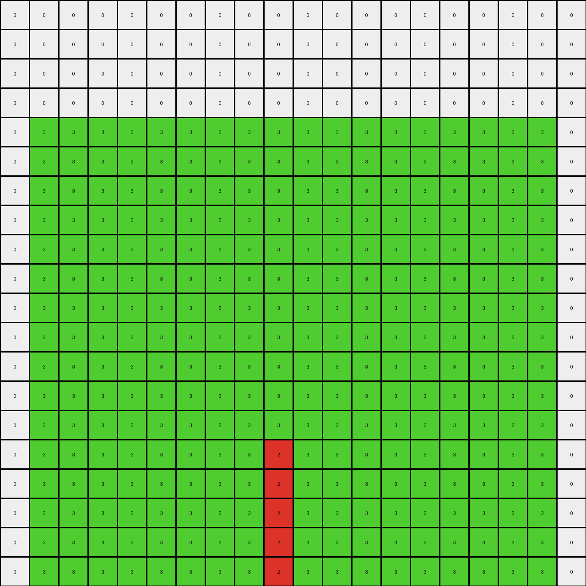
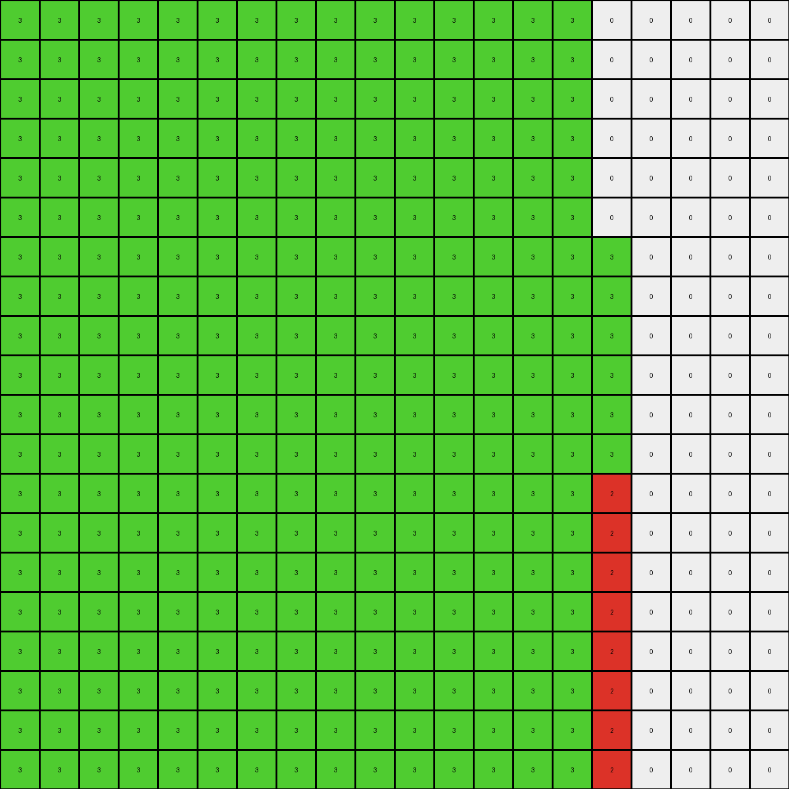

# b527c5c6 • 003 • refine_dreamer

---

Previous Code:
```python
"""
1.  **Identify Green Objects:** Locate all contiguous regions of green (3) pixels. These form the primary objects.

2.  **Vertical Expansion (Green):**  For the leftmost green object, expand the green region downwards. The expansion extends to the bottom of the grid. The width of this object matches the original width, and the y coordinates are maintained.

3.  **Red Replacement:** All red pixels on the left become part of the expanding left green block.

4.  **Red Addition (Right Side):** For the right green object. Add red pixels at the right edge of the expanded shape. It appears this starts at the original red square on the right of the initial shape and continues downwards.

5. **Vertical Expansion (Red):** Expand any new red regions vertically downwards until the bottom of the board.
"""

import numpy as np

def find_objects(grid, color):
    """Find contiguous regions of a specific color."""
    visited = np.zeros_like(grid, dtype=bool)
    objects = []

    def dfs(row, col, current_object):
        if (row < 0 or row >= grid.shape[0] or col < 0 or col >= grid.shape[1] or
                visited[row, col] or grid[row, col] != color):
            return
        visited[row, col] = True
        current_object.append((row, col))
        dfs(row + 1, col, current_object)
        dfs(row - 1, col, current_object)
        dfs(row, col + 1, current_object)
        dfs(row, col - 1, current_object)

    for row in range(grid.shape[0]):
        for col in range(grid.shape[1]):
            if grid[row, col] == color and not visited[row, col]:
                current_object = []
                dfs(row, col, current_object)
                objects.append(current_object)
    return objects

def get_object_bounds(obj):
    """Get the bounding box of an object."""
    min_row = min(p[0] for p in obj)
    max_row = max(p[0] for p in obj)
    min_col = min(p[1] for p in obj)
    max_col = max(p[1] for p in obj)
    return min_row, max_row, min_col, max_col

def transform(input_grid):
    # Initialize output_grid as a copy of the input_grid
    output_grid = np.copy(input_grid)
    height, width = input_grid.shape

    # 1. Identify Green Objects
    green_objects = find_objects(input_grid, 3)

    # Sort green objects by leftmost column
    green_objects.sort(key=lambda obj: min(p[1] for p in obj))
    
    if len(green_objects) >= 1:
      # 2. Vertical Expansion (Green) - Leftmost object
      left_green_object = green_objects[0]
      min_row, max_row, min_col, max_col = get_object_bounds(left_green_object)

      for col in range(min_col, max_col + 1):
          for row in range(min_row, height):
              output_grid[row, col] = 3

    if len(green_objects) > 1:
        right_green_object = green_objects[1]
        # get right object bounds
        min_row_r, max_row_r, min_col_r, max_col_r = get_object_bounds(right_green_object)
        
        # 3. red additions
        red_objects = find_objects(input_grid, 2)
        
        # find all the existing red pixels that touch the right object
        for robj in red_objects:
            for rpix in robj:
                r,c = rpix
                if (
                    (r + 1, c) in right_green_object or
                    (r - 1, c) in right_green_object or
                    (r , c + 1) in right_green_object or
                    (r , c - 1) in right_green_object
                ):
                    
                    # start new red generation downwards
                    for row in range(r, height):
                        output_grid[row, max_col_r] = 2
    # change output pixels

    return output_grid
```

Train Set Results:

## Example 1:

Input:
```
0 0 0 0 0 0 0 0 0 0
0 0 0 0 0 0 0 0 0 0
0 0 0 3 3 0 0 0 0 0
0 0 0 3 3 0 0 0 0 0
0 0 0 2 3 0 3 3 3 3
0 0 0 3 3 0 3 3 2 3
0 0 0 3 3 0 0 0 0 0
0 0 0 3 3 0 0 0 0 0
0 0 0 0 0 0 0 0 0 0
0 0 0 0 0 0 0 0 0 0
```
Expected Output:
```
0 0 0 0 0 0 0 0 0 0
0 0 0 0 0 0 0 0 0 0
0 0 0 3 3 0 0 0 0 0
3 3 3 3 3 0 0 0 0 0
2 2 2 2 3 0 3 3 3 3
3 3 3 3 3 0 3 3 2 3
0 0 0 3 3 0 0 3 2 3
0 0 0 3 3 0 0 3 2 3
0 0 0 0 0 0 0 3 2 3
0 0 0 0 0 0 0 3 2 3
```
Transformed Output:
```
0 0 0 0 0 0 0 0 0 0
0 0 0 0 0 0 0 0 0 0
0 0 0 3 3 0 0 0 0 0
0 0 0 3 3 0 0 0 0 0
0 0 0 3 3 0 3 3 3 3
0 0 0 3 3 0 3 3 2 2
0 0 0 3 3 0 0 0 0 2
0 0 0 3 3 0 0 0 0 2
0 0 0 3 3 0 0 0 0 2
0 0 0 3 3 0 0 0 0 2
```

match: False
pixels_off: 27
size_correct: True
color_palette_correct: True
correct_pixel_counts: False

## Example 2:

Input:
```
0 0 0 0 0 0 0 0 0 0 0 0 0 0 0 0 0 0 0 0
0 0 0 0 0 0 0 0 0 0 0 0 0 0 0 0 0 0 0 0
0 0 0 0 0 0 0 0 0 0 0 0 0 0 0 0 0 0 0 0
0 0 0 0 0 0 0 0 0 0 0 0 0 0 0 0 0 0 0 0
0 3 3 3 3 3 3 3 3 3 3 3 3 3 2 3 3 3 3 0
0 3 3 3 3 3 3 3 3 3 3 3 3 3 3 3 3 3 3 0
0 0 0 0 0 0 0 0 0 0 0 0 0 0 0 0 0 0 0 0
0 0 0 0 0 0 0 0 0 0 0 0 0 0 0 0 0 0 0 0
0 0 0 0 0 0 0 0 0 0 0 0 0 0 0 0 0 0 0 0
0 0 0 0 0 0 0 0 0 0 0 0 0 0 0 0 0 0 0 0
0 0 0 0 0 0 0 3 3 3 0 0 0 0 0 0 0 0 0 0
0 0 0 0 0 0 0 3 3 3 0 0 0 0 0 0 0 0 0 0
0 0 0 0 0 0 0 3 3 3 0 0 0 0 0 0 0 0 0 0
0 0 0 0 0 0 0 3 3 3 0 0 0 0 0 0 0 0 0 0
0 0 0 0 0 0 0 3 3 3 0 0 0 0 0 0 0 0 0 0
0 0 0 0 0 0 0 3 3 2 0 0 0 0 0 0 0 0 0 0
0 0 0 0 0 0 0 3 3 3 0 0 0 0 0 0 0 0 0 0
0 0 0 0 0 0 0 3 3 3 0 0 0 0 0 0 0 0 0 0
0 0 0 0 0 0 0 3 3 3 0 0 0 0 0 0 0 0 0 0
0 0 0 0 0 0 0 3 3 3 0 0 0 0 0 0 0 0 0 0
```
Expected Output:
```
0 0 0 0 0 0 0 0 0 0 0 0 0 3 2 3 0 0 0 0
0 0 0 0 0 0 0 0 0 0 0 0 0 3 2 3 0 0 0 0
0 0 0 0 0 0 0 0 0 0 0 0 0 3 2 3 0 0 0 0
0 0 0 0 0 0 0 0 0 0 0 0 0 3 2 3 0 0 0 0
0 3 3 3 3 3 3 3 3 3 3 3 3 3 2 3 3 3 3 0
0 3 3 3 3 3 3 3 3 3 3 3 3 3 3 3 3 3 3 0
0 0 0 0 0 0 0 0 0 0 0 0 0 0 0 0 0 0 0 0
0 0 0 0 0 0 0 0 0 0 0 0 0 0 0 0 0 0 0 0
0 0 0 0 0 0 0 0 0 0 0 0 0 0 0 0 0 0 0 0
0 0 0 0 0 0 0 0 0 0 0 0 0 0 0 0 0 0 0 0
0 0 0 0 0 0 0 3 3 3 0 0 0 0 0 0 0 0 0 0
0 0 0 0 0 0 0 3 3 3 0 0 0 0 0 0 0 0 0 0
0 0 0 0 0 0 0 3 3 3 0 0 0 0 0 0 0 0 0 0
0 0 0 0 0 0 0 3 3 3 3 3 3 3 3 3 3 3 3 3
0 0 0 0 0 0 0 3 3 3 3 3 3 3 3 3 3 3 3 3
0 0 0 0 0 0 0 3 3 2 2 2 2 2 2 2 2 2 2 2
0 0 0 0 0 0 0 3 3 3 3 3 3 3 3 3 3 3 3 3
0 0 0 0 0 0 0 3 3 3 3 3 3 3 3 3 3 3 3 3
0 0 0 0 0 0 0 3 3 3 0 0 0 0 0 0 0 0 0 0
0 0 0 0 0 0 0 3 3 3 0 0 0 0 0 0 0 0 0 0
```
Transformed Output:
```
0 0 0 0 0 0 0 0 0 0 0 0 0 0 0 0 0 0 0 0
0 0 0 0 0 0 0 0 0 0 0 0 0 0 0 0 0 0 0 0
0 0 0 0 0 0 0 0 0 0 0 0 0 0 0 0 0 0 0 0
0 0 0 0 0 0 0 0 0 0 0 0 0 0 0 0 0 0 0 0
0 3 3 3 3 3 3 3 3 3 3 3 3 3 3 3 3 3 3 0
0 3 3 3 3 3 3 3 3 3 3 3 3 3 3 3 3 3 3 0
0 3 3 3 3 3 3 3 3 3 3 3 3 3 3 3 3 3 3 0
0 3 3 3 3 3 3 3 3 3 3 3 3 3 3 3 3 3 3 0
0 3 3 3 3 3 3 3 3 3 3 3 3 3 3 3 3 3 3 0
0 3 3 3 3 3 3 3 3 3 3 3 3 3 3 3 3 3 3 0
0 3 3 3 3 3 3 3 3 3 3 3 3 3 3 3 3 3 3 0
0 3 3 3 3 3 3 3 3 3 3 3 3 3 3 3 3 3 3 0
0 3 3 3 3 3 3 3 3 3 3 3 3 3 3 3 3 3 3 0
0 3 3 3 3 3 3 3 3 3 3 3 3 3 3 3 3 3 3 0
0 3 3 3 3 3 3 3 3 3 3 3 3 3 3 3 3 3 3 0
0 3 3 3 3 3 3 3 3 2 3 3 3 3 3 3 3 3 3 0
0 3 3 3 3 3 3 3 3 2 3 3 3 3 3 3 3 3 3 0
0 3 3 3 3 3 3 3 3 2 3 3 3 3 3 3 3 3 3 0
0 3 3 3 3 3 3 3 3 2 3 3 3 3 3 3 3 3 3 0
0 3 3 3 3 3 3 3 3 2 3 3 3 3 3 3 3 3 3 0
```

match: False
pixels_off: 208
size_correct: True
color_palette_correct: True
correct_pixel_counts: False

## Example 3:

Input:
```
0 0 0 0 0 0 0 0 0 0 0 0 0 0 0 0 0 0 0 0
0 0 0 0 0 0 0 0 0 0 0 0 0 0 0 0 0 0 0 0
0 0 0 0 0 0 0 0 0 0 0 0 0 0 0 0 0 0 0 0
3 3 3 3 3 2 3 3 3 3 3 3 3 3 0 0 0 0 0 0
3 3 3 3 3 3 3 3 3 3 3 3 3 3 0 0 0 0 0 0
3 3 3 3 3 3 3 3 3 3 3 3 3 3 0 0 0 0 0 0
0 0 0 0 0 0 0 0 0 0 0 0 0 0 0 0 0 0 0 0
0 0 0 0 0 0 0 0 0 0 0 0 0 0 0 0 0 0 0 0
0 0 0 0 0 0 0 0 0 0 0 0 0 0 0 0 0 0 0 0
0 0 0 0 0 0 0 0 0 0 3 3 3 3 3 0 0 0 0 0
0 0 0 0 0 0 0 0 0 0 3 3 3 3 3 0 0 0 0 0
0 0 0 0 0 0 0 0 0 0 3 3 3 3 3 0 0 0 0 0
0 0 0 0 0 0 0 0 0 0 3 3 3 3 3 0 0 0 0 0
0 0 0 0 0 0 0 0 0 0 3 3 3 3 3 0 0 0 0 0
0 0 0 0 0 0 0 0 0 0 2 3 3 3 3 0 0 0 0 0
0 0 0 0 0 0 0 0 0 0 3 3 3 3 3 0 0 0 0 0
0 0 0 0 0 0 0 0 0 0 3 3 3 3 3 0 0 0 0 0
0 0 0 0 0 0 0 0 0 0 3 3 3 3 3 0 0 0 0 0
0 0 0 0 0 0 0 0 0 0 3 3 3 3 3 0 0 0 0 0
0 0 0 0 0 0 0 0 0 0 3 3 3 3 3 0 0 0 0 0
```
Expected Output:
```
0 0 0 3 3 2 3 3 0 0 0 0 0 0 0 0 0 0 0 0
0 0 0 3 3 2 3 3 0 0 0 0 0 0 0 0 0 0 0 0
0 0 0 3 3 2 3 3 0 0 0 0 0 0 0 0 0 0 0 0
3 3 3 3 3 2 3 3 3 3 3 3 3 3 0 0 0 0 0 0
3 3 3 3 3 3 3 3 3 3 3 3 3 3 0 0 0 0 0 0
3 3 3 3 3 3 3 3 3 3 3 3 3 3 0 0 0 0 0 0
0 0 0 0 0 0 0 0 0 0 0 0 0 0 0 0 0 0 0 0
0 0 0 0 0 0 0 0 0 0 0 0 0 0 0 0 0 0 0 0
0 0 0 0 0 0 0 0 0 0 0 0 0 0 0 0 0 0 0 0
0 0 0 0 0 0 0 0 0 0 3 3 3 3 3 0 0 0 0 0
3 3 3 3 3 3 3 3 3 3 3 3 3 3 3 0 0 0 0 0
3 3 3 3 3 3 3 3 3 3 3 3 3 3 3 0 0 0 0 0
3 3 3 3 3 3 3 3 3 3 3 3 3 3 3 0 0 0 0 0
3 3 3 3 3 3 3 3 3 3 3 3 3 3 3 0 0 0 0 0
2 2 2 2 2 2 2 2 2 2 2 3 3 3 3 0 0 0 0 0
3 3 3 3 3 3 3 3 3 3 3 3 3 3 3 0 0 0 0 0
3 3 3 3 3 3 3 3 3 3 3 3 3 3 3 0 0 0 0 0
3 3 3 3 3 3 3 3 3 3 3 3 3 3 3 0 0 0 0 0
3 3 3 3 3 3 3 3 3 3 3 3 3 3 3 0 0 0 0 0
0 0 0 0 0 0 0 0 0 0 3 3 3 3 3 0 0 0 0 0
```
Transformed Output:
```
0 0 0 0 0 0 0 0 0 0 0 0 0 0 0 0 0 0 0 0
0 0 0 0 0 0 0 0 0 0 0 0 0 0 0 0 0 0 0 0
0 0 0 0 0 0 0 0 0 0 0 0 0 0 0 0 0 0 0 0
3 3 3 3 3 3 3 3 3 3 3 3 3 3 0 0 0 0 0 0
3 3 3 3 3 3 3 3 3 3 3 3 3 3 0 0 0 0 0 0
3 3 3 3 3 3 3 3 3 3 3 3 3 3 0 0 0 0 0 0
3 3 3 3 3 3 3 3 3 3 3 3 3 3 0 0 0 0 0 0
3 3 3 3 3 3 3 3 3 3 3 3 3 3 0 0 0 0 0 0
3 3 3 3 3 3 3 3 3 3 3 3 3 3 0 0 0 0 0 0
3 3 3 3 3 3 3 3 3 3 3 3 3 3 3 0 0 0 0 0
3 3 3 3 3 3 3 3 3 3 3 3 3 3 3 0 0 0 0 0
3 3 3 3 3 3 3 3 3 3 3 3 3 3 3 0 0 0 0 0
3 3 3 3 3 3 3 3 3 3 3 3 3 3 3 0 0 0 0 0
3 3 3 3 3 3 3 3 3 3 3 3 3 3 3 0 0 0 0 0
3 3 3 3 3 3 3 3 3 3 3 3 3 3 2 0 0 0 0 0
3 3 3 3 3 3 3 3 3 3 3 3 3 3 2 0 0 0 0 0
3 3 3 3 3 3 3 3 3 3 3 3 3 3 2 0 0 0 0 0
3 3 3 3 3 3 3 3 3 3 3 3 3 3 2 0 0 0 0 0
3 3 3 3 3 3 3 3 3 3 3 3 3 3 2 0 0 0 0 0
3 3 3 3 3 3 3 3 3 3 3 3 3 3 2 0 0 0 0 0
```

match: False
pixels_off: 95
size_correct: True
color_palette_correct: True
correct_pixel_counts: False

## Example 4:

Input:
```
3 3 3 3 3 3 3 3 3 3 3 3 3 3 3 0 0 0 0 0
3 3 3 3 3 3 3 3 3 3 3 3 3 3 3 0 0 0 0 0
3 3 3 3 3 3 3 3 3 3 3 3 3 3 3 0 0 0 0 0
3 3 3 3 3 3 3 3 3 3 3 3 3 3 3 0 0 0 0 0
3 3 3 3 2 3 3 3 3 3 3 3 3 3 3 0 0 0 0 0
0 0 0 0 0 0 0 0 0 0 0 0 0 0 0 0 0 0 0 0
0 0 0 0 0 0 0 0 0 0 0 0 3 3 3 3 0 0 0 0
0 0 0 0 0 0 0 0 0 0 0 0 3 3 3 3 0 0 0 0
0 0 0 0 0 0 0 0 0 0 0 0 3 3 3 3 0 0 0 0
0 0 0 0 0 0 0 0 0 0 0 0 3 3 3 3 0 0 0 0
0 0 0 0 0 0 0 0 0 0 0 0 3 3 3 3 0 0 0 0
0 0 0 0 0 0 0 0 0 0 0 0 3 3 3 3 0 0 0 0
0 0 0 0 0 0 0 0 0 0 0 0 3 3 3 2 0 0 0 0
0 0 0 0 0 0 0 0 0 0 0 0 3 3 3 3 0 0 0 0
0 0 0 0 0 0 0 0 0 0 0 0 3 3 3 3 0 0 0 0
0 0 0 0 0 0 0 0 0 0 0 0 3 3 3 3 0 0 0 0
0 0 0 0 0 0 0 0 0 0 0 0 3 3 3 3 0 0 0 0
0 0 0 0 0 0 0 0 0 0 0 0 0 0 0 0 0 0 0 0
0 0 0 0 0 0 0 0 0 0 0 0 0 0 0 0 0 0 0 0
0 0 0 0 0 0 0 0 0 0 0 0 0 0 0 0 0 0 0 0
```
Expected Output:
```
3 3 3 3 3 3 3 3 3 3 3 3 3 3 3 0 0 0 0 0
3 3 3 3 3 3 3 3 3 3 3 3 3 3 3 0 0 0 0 0
3 3 3 3 3 3 3 3 3 3 3 3 3 3 3 0 0 0 0 0
3 3 3 3 3 3 3 3 3 3 3 3 3 3 3 0 0 0 0 0
3 3 3 3 2 3 3 3 3 3 3 3 3 3 3 0 0 0 0 0
3 3 3 3 2 3 3 3 3 0 0 0 0 0 0 0 0 0 0 0
3 3 3 3 2 3 3 3 3 0 0 0 3 3 3 3 0 0 0 0
3 3 3 3 2 3 3 3 3 0 0 0 3 3 3 3 0 0 0 0
3 3 3 3 2 3 3 3 3 0 0 0 3 3 3 3 0 0 0 0
3 3 3 3 2 3 3 3 3 0 0 0 3 3 3 3 3 3 3 3
3 3 3 3 2 3 3 3 3 0 0 0 3 3 3 3 3 3 3 3
3 3 3 3 2 3 3 3 3 0 0 0 3 3 3 3 3 3 3 3
3 3 3 3 2 3 3 3 3 0 0 0 3 3 3 2 2 2 2 2
3 3 3 3 2 3 3 3 3 0 0 0 3 3 3 3 3 3 3 3
3 3 3 3 2 3 3 3 3 0 0 0 3 3 3 3 3 3 3 3
3 3 3 3 2 3 3 3 3 0 0 0 3 3 3 3 3 3 3 3
3 3 3 3 2 3 3 3 3 0 0 0 3 3 3 3 0 0 0 0
3 3 3 3 2 3 3 3 3 0 0 0 0 0 0 0 0 0 0 0
3 3 3 3 2 3 3 3 3 0 0 0 0 0 0 0 0 0 0 0
3 3 3 3 2 3 3 3 3 0 0 0 0 0 0 0 0 0 0 0
```
Transformed Output:
```
3 3 3 3 3 3 3 3 3 3 3 3 3 3 3 0 0 0 0 0
3 3 3 3 3 3 3 3 3 3 3 3 3 3 3 0 0 0 0 0
3 3 3 3 3 3 3 3 3 3 3 3 3 3 3 0 0 0 0 0
3 3 3 3 3 3 3 3 3 3 3 3 3 3 3 0 0 0 0 0
3 3 3 3 3 3 3 3 3 3 3 3 3 3 3 0 0 0 0 0
3 3 3 3 3 3 3 3 3 3 3 3 3 3 3 0 0 0 0 0
3 3 3 3 3 3 3 3 3 3 3 3 3 3 3 3 0 0 0 0
3 3 3 3 3 3 3 3 3 3 3 3 3 3 3 3 0 0 0 0
3 3 3 3 3 3 3 3 3 3 3 3 3 3 3 3 0 0 0 0
3 3 3 3 3 3 3 3 3 3 3 3 3 3 3 3 0 0 0 0
3 3 3 3 3 3 3 3 3 3 3 3 3 3 3 3 0 0 0 0
3 3 3 3 3 3 3 3 3 3 3 3 3 3 3 3 0 0 0 0
3 3 3 3 3 3 3 3 3 3 3 3 3 3 3 2 0 0 0 0
3 3 3 3 3 3 3 3 3 3 3 3 3 3 3 2 0 0 0 0
3 3 3 3 3 3 3 3 3 3 3 3 3 3 3 2 0 0 0 0
3 3 3 3 3 3 3 3 3 3 3 3 3 3 3 2 0 0 0 0
3 3 3 3 3 3 3 3 3 3 3 3 3 3 3 2 0 0 0 0
3 3 3 3 3 3 3 3 3 3 3 3 3 3 3 2 0 0 0 0
3 3 3 3 3 3 3 3 3 3 3 3 3 3 3 2 0 0 0 0
3 3 3 3 3 3 3 3 3 3 3 3 3 3 3 2 0 0 0 0
```

match: False
pixels_off: 108
size_correct: True
color_palette_correct: True
correct_pixel_counts: False
**INSTRUCTIONS**

The code above was generated based on observations from the first training
example

we have tested the transform function on each of the task example inputs and
compared with the expected output

review each of the examples provided and the results and consider how the
natural language program should be updated to accommodate this new knowledge

respond with the following deliverables:

- general assessment of the information provided and strategy for resolving the
  errors
- gather metrics about each of the examples and results - use code_execution to
  develop accurate reports on your assumptions
- a YAML block documenting facts - Focus on identifying objects, their properties, and the actions performed on them.
- a natural language program - Be as clear and concise as possible, providing a complete description of the transformation rule.


your responses should be considered as information in a report - not a
conversation
