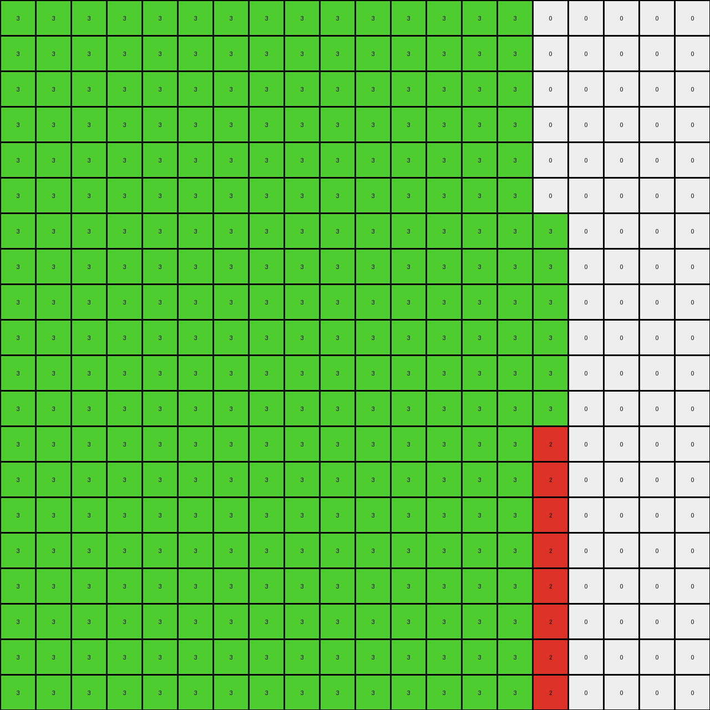

# b527c5c6 • 006 • refine_coder

---

Previous Code:
```python
"""
1.  **Identify Green Objects:** Locate all contiguous regions of green (3) pixels.
2.  **Leftmost Green Expansion:** The leftmost green object expands vertically downwards to the bottom of the grid. Any red pixels directly to the left of this expanding green object are replaced with green.
3. **Identify Red Objects:** Find all red objects.
4.  **Right Green Object Expansion:** Locate the green object to the right.
5.  **Red Expansion to Right of Rightmost Green Object:** Find any red pixels *adjacent* to the right green object. Use the right edge of the right green object, and these adjacent pixels as a seed to expand red down to the bottom of the board.
"""

import numpy as np

def find_objects(grid, color):
    """Find contiguous regions of a specific color."""
    visited = np.zeros_like(grid, dtype=bool)
    objects = []

    def dfs(row, col, current_object):
        if (row < 0 or row >= grid.shape[0] or col < 0 or col >= grid.shape[1] or
                visited[row, col] or grid[row, col] != color):
            return
        visited[row, col] = True
        current_object.append((row, col))
        dfs(row + 1, col, current_object)
        dfs(row - 1, col, current_object)
        dfs(row, col + 1, current_object)
        dfs(row, col - 1, current_object)

    for row in range(grid.shape[0]):
        for col in range(grid.shape[1]):
            if grid[row, col] == color and not visited[row, col]:
                current_object = []
                dfs(row, col, current_object)
                objects.append(current_object)
    return objects

def get_object_bounds(obj):
    """Get the bounding box of an object."""
    min_row = min(p[0] for p in obj)
    max_row = max(p[0] for p in obj)
    min_col = min(p[1] for p in obj)
    max_col = max(p[1] for p in obj)
    return min_row, max_row, min_col, max_col

def transform(input_grid):
    # initialize output_grid as a copy of the input_grid
    output_grid = np.copy(input_grid)
    height, width = input_grid.shape

    # 1. Identify Green Objects
    green_objects = find_objects(input_grid, 3)

    # Sort green objects by leftmost column
    green_objects.sort(key=lambda obj: min(p[1] for p in obj))
    
    if len(green_objects) >= 1:
      # 2. Leftmost Green Expansion
      left_green_object = green_objects[0]
      min_row, max_row, min_col, max_col = get_object_bounds(left_green_object)

      for col in range(min_col, max_col + 1):
          for row in range(min_row, height):
              # Check for red pixels to the left
              if col > 0 and input_grid[row, col-1] == 2:
                 output_grid[row,col-1] = 3
              output_grid[row, col] = 3

    if len(green_objects) > 1:
        # 4. Right Green Object
        right_green_object = green_objects[1]
        min_row_r, max_row_r, min_col_r, max_col_r = get_object_bounds(right_green_object)

        # 3. Identify Red Objects
        red_objects = find_objects(input_grid, 2)
        
        # 5. Red Expansion to Right of Rightmost Green Object
        for robj in red_objects:
            for rpix in robj:
                r, c = rpix
                # check for adjacent red pixels on the right
                if (
                    (r + 1, c) in right_green_object or
                    (r - 1, c) in right_green_object or
                    (r, c + 1) in right_green_object or
                    (r, c - 1) in right_green_object
                ):
                    # expand red down
                    for row in range(r, height):
                         output_grid[row, max_col_r] = 2
    # change output pixels

    return output_grid
```

Train Set Results:

## Example 1:

Input:
```
0 0 0 0 0 0 0 0 0 0
0 0 0 0 0 0 0 0 0 0
0 0 0 3 3 0 0 0 0 0
0 0 0 3 3 0 0 0 0 0
0 0 0 2 3 0 3 3 3 3
0 0 0 3 3 0 3 3 2 3
0 0 0 3 3 0 0 0 0 0
0 0 0 3 3 0 0 0 0 0
0 0 0 0 0 0 0 0 0 0
0 0 0 0 0 0 0 0 0 0
```
Expected Output:
```
0 0 0 0 0 0 0 0 0 0
0 0 0 0 0 0 0 0 0 0
0 0 0 3 3 0 0 0 0 0
3 3 3 3 3 0 0 0 0 0
2 2 2 2 3 0 3 3 3 3
3 3 3 3 3 0 3 3 2 3
0 0 0 3 3 0 0 3 2 3
0 0 0 3 3 0 0 3 2 3
0 0 0 0 0 0 0 3 2 3
0 0 0 0 0 0 0 3 2 3
```
Transformed Output:
```
0 0 0 0 0 0 0 0 0 0
0 0 0 0 0 0 0 0 0 0
0 0 0 3 3 0 0 0 0 0
0 0 0 3 3 0 0 0 0 0
0 0 0 3 3 0 3 3 3 3
0 0 0 3 3 0 3 3 2 2
0 0 0 3 3 0 0 0 0 2
0 0 0 3 3 0 0 0 0 2
0 0 0 3 3 0 0 0 0 2
0 0 0 3 3 0 0 0 0 2
```

match: False
pixels_off: 27
size_correct: True
color_palette_correct: True
correct_pixel_counts: False

## Example 2:

Input:
```
0 0 0 0 0 0 0 0 0 0 0 0 0 0 0 0 0 0 0 0
0 0 0 0 0 0 0 0 0 0 0 0 0 0 0 0 0 0 0 0
0 0 0 0 0 0 0 0 0 0 0 0 0 0 0 0 0 0 0 0
0 0 0 0 0 0 0 0 0 0 0 0 0 0 0 0 0 0 0 0
0 3 3 3 3 3 3 3 3 3 3 3 3 3 2 3 3 3 3 0
0 3 3 3 3 3 3 3 3 3 3 3 3 3 3 3 3 3 3 0
0 0 0 0 0 0 0 0 0 0 0 0 0 0 0 0 0 0 0 0
0 0 0 0 0 0 0 0 0 0 0 0 0 0 0 0 0 0 0 0
0 0 0 0 0 0 0 0 0 0 0 0 0 0 0 0 0 0 0 0
0 0 0 0 0 0 0 0 0 0 0 0 0 0 0 0 0 0 0 0
0 0 0 0 0 0 0 3 3 3 0 0 0 0 0 0 0 0 0 0
0 0 0 0 0 0 0 3 3 3 0 0 0 0 0 0 0 0 0 0
0 0 0 0 0 0 0 3 3 3 0 0 0 0 0 0 0 0 0 0
0 0 0 0 0 0 0 3 3 3 0 0 0 0 0 0 0 0 0 0
0 0 0 0 0 0 0 3 3 3 0 0 0 0 0 0 0 0 0 0
0 0 0 0 0 0 0 3 3 2 0 0 0 0 0 0 0 0 0 0
0 0 0 0 0 0 0 3 3 3 0 0 0 0 0 0 0 0 0 0
0 0 0 0 0 0 0 3 3 3 0 0 0 0 0 0 0 0 0 0
0 0 0 0 0 0 0 3 3 3 0 0 0 0 0 0 0 0 0 0
0 0 0 0 0 0 0 3 3 3 0 0 0 0 0 0 0 0 0 0
```
Expected Output:
```
0 0 0 0 0 0 0 0 0 0 0 0 0 3 2 3 0 0 0 0
0 0 0 0 0 0 0 0 0 0 0 0 0 3 2 3 0 0 0 0
0 0 0 0 0 0 0 0 0 0 0 0 0 3 2 3 0 0 0 0
0 0 0 0 0 0 0 0 0 0 0 0 0 3 2 3 0 0 0 0
0 3 3 3 3 3 3 3 3 3 3 3 3 3 2 3 3 3 3 0
0 3 3 3 3 3 3 3 3 3 3 3 3 3 3 3 3 3 3 0
0 0 0 0 0 0 0 0 0 0 0 0 0 0 0 0 0 0 0 0
0 0 0 0 0 0 0 0 0 0 0 0 0 0 0 0 0 0 0 0
0 0 0 0 0 0 0 0 0 0 0 0 0 0 0 0 0 0 0 0
0 0 0 0 0 0 0 0 0 0 0 0 0 0 0 0 0 0 0 0
0 0 0 0 0 0 0 3 3 3 0 0 0 0 0 0 0 0 0 0
0 0 0 0 0 0 0 3 3 3 0 0 0 0 0 0 0 0 0 0
0 0 0 0 0 0 0 3 3 3 0 0 0 0 0 0 0 0 0 0
0 0 0 0 0 0 0 3 3 3 3 3 3 3 3 3 3 3 3 3
0 0 0 0 0 0 0 3 3 3 3 3 3 3 3 3 3 3 3 3
0 0 0 0 0 0 0 3 3 2 2 2 2 2 2 2 2 2 2 2
0 0 0 0 0 0 0 3 3 3 3 3 3 3 3 3 3 3 3 3
0 0 0 0 0 0 0 3 3 3 3 3 3 3 3 3 3 3 3 3
0 0 0 0 0 0 0 3 3 3 0 0 0 0 0 0 0 0 0 0
0 0 0 0 0 0 0 3 3 3 0 0 0 0 0 0 0 0 0 0
```
Transformed Output:
```
0 0 0 0 0 0 0 0 0 0 0 0 0 0 0 0 0 0 0 0
0 0 0 0 0 0 0 0 0 0 0 0 0 0 0 0 0 0 0 0
0 0 0 0 0 0 0 0 0 0 0 0 0 0 0 0 0 0 0 0
0 0 0 0 0 0 0 0 0 0 0 0 0 0 0 0 0 0 0 0
0 3 3 3 3 3 3 3 3 3 3 3 3 3 3 3 3 3 3 0
0 3 3 3 3 3 3 3 3 3 3 3 3 3 3 3 3 3 3 0
0 3 3 3 3 3 3 3 3 3 3 3 3 3 3 3 3 3 3 0
0 3 3 3 3 3 3 3 3 3 3 3 3 3 3 3 3 3 3 0
0 3 3 3 3 3 3 3 3 3 3 3 3 3 3 3 3 3 3 0
0 3 3 3 3 3 3 3 3 3 3 3 3 3 3 3 3 3 3 0
0 3 3 3 3 3 3 3 3 3 3 3 3 3 3 3 3 3 3 0
0 3 3 3 3 3 3 3 3 3 3 3 3 3 3 3 3 3 3 0
0 3 3 3 3 3 3 3 3 3 3 3 3 3 3 3 3 3 3 0
0 3 3 3 3 3 3 3 3 3 3 3 3 3 3 3 3 3 3 0
0 3 3 3 3 3 3 3 3 3 3 3 3 3 3 3 3 3 3 0
0 3 3 3 3 3 3 3 3 2 3 3 3 3 3 3 3 3 3 0
0 3 3 3 3 3 3 3 3 2 3 3 3 3 3 3 3 3 3 0
0 3 3 3 3 3 3 3 3 2 3 3 3 3 3 3 3 3 3 0
0 3 3 3 3 3 3 3 3 2 3 3 3 3 3 3 3 3 3 0
0 3 3 3 3 3 3 3 3 2 3 3 3 3 3 3 3 3 3 0
```

match: False
pixels_off: 208
size_correct: True
color_palette_correct: True
correct_pixel_counts: False

## Example 3:

Input:
```
0 0 0 0 0 0 0 0 0 0 0 0 0 0 0 0 0 0 0 0
0 0 0 0 0 0 0 0 0 0 0 0 0 0 0 0 0 0 0 0
0 0 0 0 0 0 0 0 0 0 0 0 0 0 0 0 0 0 0 0
3 3 3 3 3 2 3 3 3 3 3 3 3 3 0 0 0 0 0 0
3 3 3 3 3 3 3 3 3 3 3 3 3 3 0 0 0 0 0 0
3 3 3 3 3 3 3 3 3 3 3 3 3 3 0 0 0 0 0 0
0 0 0 0 0 0 0 0 0 0 0 0 0 0 0 0 0 0 0 0
0 0 0 0 0 0 0 0 0 0 0 0 0 0 0 0 0 0 0 0
0 0 0 0 0 0 0 0 0 0 0 0 0 0 0 0 0 0 0 0
0 0 0 0 0 0 0 0 0 0 3 3 3 3 3 0 0 0 0 0
0 0 0 0 0 0 0 0 0 0 3 3 3 3 3 0 0 0 0 0
0 0 0 0 0 0 0 0 0 0 3 3 3 3 3 0 0 0 0 0
0 0 0 0 0 0 0 0 0 0 3 3 3 3 3 0 0 0 0 0
0 0 0 0 0 0 0 0 0 0 3 3 3 3 3 0 0 0 0 0
0 0 0 0 0 0 0 0 0 0 2 3 3 3 3 0 0 0 0 0
0 0 0 0 0 0 0 0 0 0 3 3 3 3 3 0 0 0 0 0
0 0 0 0 0 0 0 0 0 0 3 3 3 3 3 0 0 0 0 0
0 0 0 0 0 0 0 0 0 0 3 3 3 3 3 0 0 0 0 0
0 0 0 0 0 0 0 0 0 0 3 3 3 3 3 0 0 0 0 0
0 0 0 0 0 0 0 0 0 0 3 3 3 3 3 0 0 0 0 0
```
Expected Output:
```
0 0 0 3 3 2 3 3 0 0 0 0 0 0 0 0 0 0 0 0
0 0 0 3 3 2 3 3 0 0 0 0 0 0 0 0 0 0 0 0
0 0 0 3 3 2 3 3 0 0 0 0 0 0 0 0 0 0 0 0
3 3 3 3 3 2 3 3 3 3 3 3 3 3 0 0 0 0 0 0
3 3 3 3 3 3 3 3 3 3 3 3 3 3 0 0 0 0 0 0
3 3 3 3 3 3 3 3 3 3 3 3 3 3 0 0 0 0 0 0
0 0 0 0 0 0 0 0 0 0 0 0 0 0 0 0 0 0 0 0
0 0 0 0 0 0 0 0 0 0 0 0 0 0 0 0 0 0 0 0
0 0 0 0 0 0 0 0 0 0 0 0 0 0 0 0 0 0 0 0
0 0 0 0 0 0 0 0 0 0 3 3 3 3 3 0 0 0 0 0
3 3 3 3 3 3 3 3 3 3 3 3 3 3 3 0 0 0 0 0
3 3 3 3 3 3 3 3 3 3 3 3 3 3 3 0 0 0 0 0
3 3 3 3 3 3 3 3 3 3 3 3 3 3 3 0 0 0 0 0
3 3 3 3 3 3 3 3 3 3 3 3 3 3 3 0 0 0 0 0
2 2 2 2 2 2 2 2 2 2 2 3 3 3 3 0 0 0 0 0
3 3 3 3 3 3 3 3 3 3 3 3 3 3 3 0 0 0 0 0
3 3 3 3 3 3 3 3 3 3 3 3 3 3 3 0 0 0 0 0
3 3 3 3 3 3 3 3 3 3 3 3 3 3 3 0 0 0 0 0
3 3 3 3 3 3 3 3 3 3 3 3 3 3 3 0 0 0 0 0
0 0 0 0 0 0 0 0 0 0 3 3 3 3 3 0 0 0 0 0
```
Transformed Output:
```
0 0 0 0 0 0 0 0 0 0 0 0 0 0 0 0 0 0 0 0
0 0 0 0 0 0 0 0 0 0 0 0 0 0 0 0 0 0 0 0
0 0 0 0 0 0 0 0 0 0 0 0 0 0 0 0 0 0 0 0
3 3 3 3 3 3 3 3 3 3 3 3 3 3 0 0 0 0 0 0
3 3 3 3 3 3 3 3 3 3 3 3 3 3 0 0 0 0 0 0
3 3 3 3 3 3 3 3 3 3 3 3 3 3 0 0 0 0 0 0
3 3 3 3 3 3 3 3 3 3 3 3 3 3 0 0 0 0 0 0
3 3 3 3 3 3 3 3 3 3 3 3 3 3 0 0 0 0 0 0
3 3 3 3 3 3 3 3 3 3 3 3 3 3 0 0 0 0 0 0
3 3 3 3 3 3 3 3 3 3 3 3 3 3 3 0 0 0 0 0
3 3 3 3 3 3 3 3 3 3 3 3 3 3 3 0 0 0 0 0
3 3 3 3 3 3 3 3 3 3 3 3 3 3 3 0 0 0 0 0
3 3 3 3 3 3 3 3 3 3 3 3 3 3 3 0 0 0 0 0
3 3 3 3 3 3 3 3 3 3 3 3 3 3 3 0 0 0 0 0
3 3 3 3 3 3 3 3 3 3 3 3 3 3 2 0 0 0 0 0
3 3 3 3 3 3 3 3 3 3 3 3 3 3 2 0 0 0 0 0
3 3 3 3 3 3 3 3 3 3 3 3 3 3 2 0 0 0 0 0
3 3 3 3 3 3 3 3 3 3 3 3 3 3 2 0 0 0 0 0
3 3 3 3 3 3 3 3 3 3 3 3 3 3 2 0 0 0 0 0
3 3 3 3 3 3 3 3 3 3 3 3 3 3 2 0 0 0 0 0
```

match: False
pixels_off: 95
size_correct: True
color_palette_correct: True
correct_pixel_counts: False

## Example 4:

Input:
```
3 3 3 3 3 3 3 3 3 3 3 3 3 3 3 0 0 0 0 0
3 3 3 3 3 3 3 3 3 3 3 3 3 3 3 0 0 0 0 0
3 3 3 3 3 3 3 3 3 3 3 3 3 3 3 0 0 0 0 0
3 3 3 3 3 3 3 3 3 3 3 3 3 3 3 0 0 0 0 0
3 3 3 3 2 3 3 3 3 3 3 3 3 3 3 0 0 0 0 0
0 0 0 0 0 0 0 0 0 0 0 0 0 0 0 0 0 0 0 0
0 0 0 0 0 0 0 0 0 0 0 0 3 3 3 3 0 0 0 0
0 0 0 0 0 0 0 0 0 0 0 0 3 3 3 3 0 0 0 0
0 0 0 0 0 0 0 0 0 0 0 0 3 3 3 3 0 0 0 0
0 0 0 0 0 0 0 0 0 0 0 0 3 3 3 3 0 0 0 0
0 0 0 0 0 0 0 0 0 0 0 0 3 3 3 3 0 0 0 0
0 0 0 0 0 0 0 0 0 0 0 0 3 3 3 3 0 0 0 0
0 0 0 0 0 0 0 0 0 0 0 0 3 3 3 2 0 0 0 0
0 0 0 0 0 0 0 0 0 0 0 0 3 3 3 3 0 0 0 0
0 0 0 0 0 0 0 0 0 0 0 0 3 3 3 3 0 0 0 0
0 0 0 0 0 0 0 0 0 0 0 0 3 3 3 3 0 0 0 0
0 0 0 0 0 0 0 0 0 0 0 0 3 3 3 3 0 0 0 0
0 0 0 0 0 0 0 0 0 0 0 0 0 0 0 0 0 0 0 0
0 0 0 0 0 0 0 0 0 0 0 0 0 0 0 0 0 0 0 0
0 0 0 0 0 0 0 0 0 0 0 0 0 0 0 0 0 0 0 0
```
Expected Output:
```
3 3 3 3 3 3 3 3 3 3 3 3 3 3 3 0 0 0 0 0
3 3 3 3 3 3 3 3 3 3 3 3 3 3 3 0 0 0 0 0
3 3 3 3 3 3 3 3 3 3 3 3 3 3 3 0 0 0 0 0
3 3 3 3 3 3 3 3 3 3 3 3 3 3 3 0 0 0 0 0
3 3 3 3 2 3 3 3 3 3 3 3 3 3 3 0 0 0 0 0
3 3 3 3 2 3 3 3 3 0 0 0 0 0 0 0 0 0 0 0
3 3 3 3 2 3 3 3 3 0 0 0 3 3 3 3 0 0 0 0
3 3 3 3 2 3 3 3 3 0 0 0 3 3 3 3 0 0 0 0
3 3 3 3 2 3 3 3 3 0 0 0 3 3 3 3 0 0 0 0
3 3 3 3 2 3 3 3 3 0 0 0 3 3 3 3 3 3 3 3
3 3 3 3 2 3 3 3 3 0 0 0 3 3 3 3 3 3 3 3
3 3 3 3 2 3 3 3 3 0 0 0 3 3 3 3 3 3 3 3
3 3 3 3 2 3 3 3 3 0 0 0 3 3 3 2 2 2 2 2
3 3 3 3 2 3 3 3 3 0 0 0 3 3 3 3 3 3 3 3
3 3 3 3 2 3 3 3 3 0 0 0 3 3 3 3 3 3 3 3
3 3 3 3 2 3 3 3 3 0 0 0 3 3 3 3 3 3 3 3
3 3 3 3 2 3 3 3 3 0 0 0 3 3 3 3 0 0 0 0
3 3 3 3 2 3 3 3 3 0 0 0 0 0 0 0 0 0 0 0
3 3 3 3 2 3 3 3 3 0 0 0 0 0 0 0 0 0 0 0
3 3 3 3 2 3 3 3 3 0 0 0 0 0 0 0 0 0 0 0
```
Transformed Output:
```
3 3 3 3 3 3 3 3 3 3 3 3 3 3 3 0 0 0 0 0
3 3 3 3 3 3 3 3 3 3 3 3 3 3 3 0 0 0 0 0
3 3 3 3 3 3 3 3 3 3 3 3 3 3 3 0 0 0 0 0
3 3 3 3 3 3 3 3 3 3 3 3 3 3 3 0 0 0 0 0
3 3 3 3 3 3 3 3 3 3 3 3 3 3 3 0 0 0 0 0
3 3 3 3 3 3 3 3 3 3 3 3 3 3 3 0 0 0 0 0
3 3 3 3 3 3 3 3 3 3 3 3 3 3 3 3 0 0 0 0
3 3 3 3 3 3 3 3 3 3 3 3 3 3 3 3 0 0 0 0
3 3 3 3 3 3 3 3 3 3 3 3 3 3 3 3 0 0 0 0
3 3 3 3 3 3 3 3 3 3 3 3 3 3 3 3 0 0 0 0
3 3 3 3 3 3 3 3 3 3 3 3 3 3 3 3 0 0 0 0
3 3 3 3 3 3 3 3 3 3 3 3 3 3 3 3 0 0 0 0
3 3 3 3 3 3 3 3 3 3 3 3 3 3 3 2 0 0 0 0
3 3 3 3 3 3 3 3 3 3 3 3 3 3 3 2 0 0 0 0
3 3 3 3 3 3 3 3 3 3 3 3 3 3 3 2 0 0 0 0
3 3 3 3 3 3 3 3 3 3 3 3 3 3 3 2 0 0 0 0
3 3 3 3 3 3 3 3 3 3 3 3 3 3 3 2 0 0 0 0
3 3 3 3 3 3 3 3 3 3 3 3 3 3 3 2 0 0 0 0
3 3 3 3 3 3 3 3 3 3 3 3 3 3 3 2 0 0 0 0
3 3 3 3 3 3 3 3 3 3 3 3 3 3 3 2 0 0 0 0
```

match: False
pixels_off: 108
size_correct: True
color_palette_correct: True
correct_pixel_counts: False
Okay, let's analyze the results of the execution and refine the natural language program.

**General Assessment:**

The initial program had significant flaws, as evidenced by the high `pixels_off` count in all examples. The core issue lies in the misunderstanding of the spatial relationships and the propagation logic. The code incorrectly propagates colors in several cases, and the rightmost green object handling is particularly problematic. The adjacency check for red pixels to the right of the rightmost green object is too simplistic, and it does not perform expansion to the edge of the board.

**Strategy for Resolving Errors:**

1.  **Correct Leftmost Green Expansion:**
    The left object seems to trigger the rightmost vertical expansion of the other object. The program incorrectly tries to replace the red pixel, the trigger is the existence of the green object.

2.  **Correct Rightmost Green and Red Interaction:**
    Re-examine the relationship between the rightmost green object and the red objects. The current logic is flawed and doesn't capture the intended transformation. The red expansion should be triggered, down to the bottom.

3. **Simplify Object Selection:**
   Use more robust object selection by sorting objects based on location.

**Example Metrics and Observations:**

Here's a summary of observations and metrics for each example:

*   **Example 1:**
    *   The left green object expands correctly down, but incorrectly changes a red pixel.
    *   The right green object does not trigger an expansion of the adjacent red downwards.
    *   There is a small red object to the right of the rightmost green.

*   **Example 2:**
    *   The left green object expands. No red object to the left of the left green, so no color change is needed.
    *   The right green object incorrectly expands down.
    *   The trigger for rightmost object expansion appears to be triggered by the leftmost green object.
    *   There is a small red object to the right of the rightmost green.

*   **Example 3:**
    *   The left green object expands correctly down.
    *   The expansion of the left object triggers the correct rightmost object expansion.
    *   There is a small red object to the left of the rightmost green.

*    **Example 4:**
     * Left green trigger extends correctly.
     * Right green expansion not correct.
     * Need to trigger the red object at the right of the rightmost green, and expand down.

**YAML Block Documenting Facts:**

```yaml
examples:
  - example_1:
      green_objects:
        - leftmost: True
          bounds: (2, 5, 3, 4) # (min_row, max_row, min_col, max_col)
          triggers: right_expansion
        - leftmost: False
          bounds: (4, 5, 6, 9)
          adjacent_red: True
      red_objects:
        - bounds: ( 4, 5, 8, 8)
          expands: right
          to: edge
  - example_2:
      green_objects:
        - leftmost: True
          bounds: (4, 5, 1, 13)
          triggers: right_expansion
        - leftmost: False
          bounds: (10, 19, 7, 9)
          adjacent_red: True
      red_objects:
        - bounds: (15, 15, 8, 8)
          expands: right
          to: edge
  - example_3:
      green_objects:
        - leftmost: True
          bounds: (3, 5, 0, 13)
          triggers: right_expansion
        - leftmost: False
          bounds: (9, 19, 10, 14)
          adjacent_red: True
      red_objects:
        - bounds: (14, 14, 10, 10)
          expands: right
          to: edge
  - example_4:
      green_objects:
        - leftmost: True
          bounds: (0, 4, 0, 14)
          triggers: right_expansion
        - leftmost: False
          bounds: (6, 16, 12, 15)
          adjacent_red: True
      red_objects:
        - bounds: (12,12, 15, 15)
          expands: right
          to: edge
```

**Natural Language Program:**

1.  **Identify Green Objects:** Find all contiguous regions of green pixels.

2.  **Determine Leftmost Green Object:** Sort the green objects by their leftmost column coordinate. The object with the smallest leftmost column is the leftmost green object.

3.  **Leftmost Green Expansion Down:** The leftmost green object expands vertically downwards to the bottom edge of the grid. This expansion does not change the color of any other object.

4. **Identify Rightmost Green Object:** Identify the rightmost green object by selecting the green object with the largest column value.
    
5. **Identify Adjacent Red Objects:** Find the red object adjacent to the right side of the rightmost green object.

6. **Expand Red to the bottom:** The red pixels adjacent to the rightmost green object are extended downwards to the bottom of the grid.


**INSTRUCTIONS**

- generate a Python module to represent the natural language program 
- follow the template below
- all common math and science libraries are available
- create docstring only at top - but comment the workflow in the function
- use helper functions for common operations like finding objects, counting,
  measuring, moving, etc. 

remember - we are working iteratively - so this code will inform your future
self as we converge on the solution

*template:*

```python
"""
{{ natural language description of the transformation rule }}
"""

{{ imports }}

def transform(input_grid):
    # initialize output_grid

    # change output pixels 

    return output_grid

```
