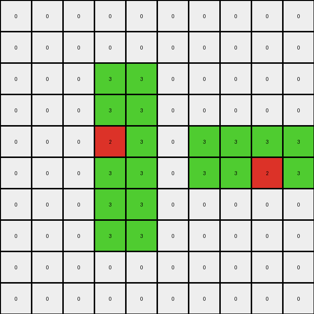
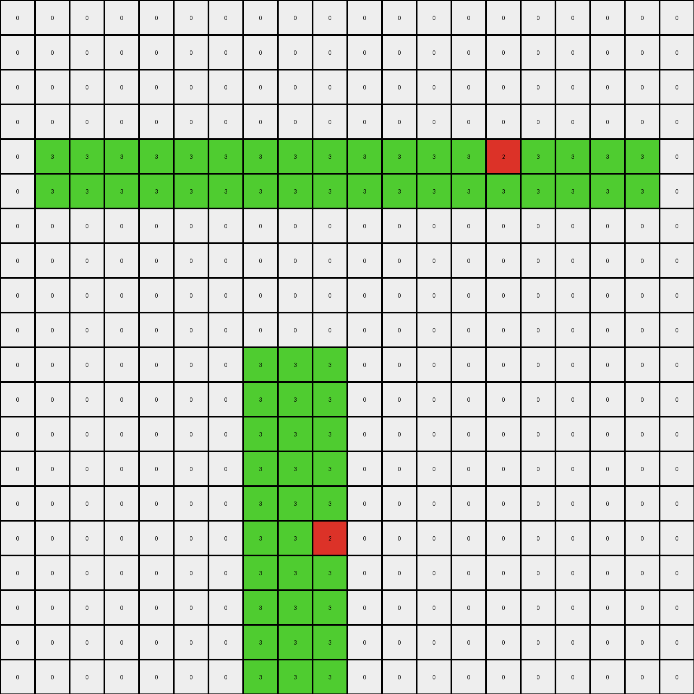

# b527c5c6 • 015 • refine_dreamer

---

Previous Code:
```python
"""
1.  **Top-Left Object Modification:** Identify the green (3) rectangular object in the top-left quadrant of the input grid. Within this object, locate the single red (2) pixel. For the top three rows of this green object, if the x index is less than 9, change all green (3) pixels to white (0).

2.  **Bottom-Right Object Extension:** Identify the green (3) rectangular object at the lower part of the input grid. Add a column of red (2) pixels adjacent to the left edge of this bottom-right object, aligning it with the top row of the original bottom-right object. The red pixels mirror the shape of the adjacent border of the green object.
"""

import numpy as np

def find_objects(grid, color):
    # Find objects of a specific color in the grid.
    objects = []
    visited = np.zeros_like(grid, dtype=bool)

    def dfs(row, col, current_object):
        if (
            row < 0
            or row >= grid.shape[0]
            or col < 0
            or col >= grid.shape[1]
            or visited[row, col]
            or grid[row, col] != color
        ):
            return
        visited[row, col] = True
        current_object.append((row, col))
        dfs(row + 1, col, current_object)
        dfs(row - 1, col, current_object)
        dfs(row, col + 1, current_object)
        dfs(row, col - 1, current_object)

    for row in range(grid.shape[0]):
        for col in range(grid.shape[1]):
            if grid[row, col] == color and not visited[row, col]:
                current_object = []
                dfs(row, col, current_object)
                objects.append(current_object)
    return objects

def get_object_bounds(obj):
    # Get the bounding box of an object.
    rows, cols = zip(*obj)
    min_row, max_row = min(rows), max(rows)
    min_col, max_col = min(cols), max(cols)
    return min_row, max_row, min_col, max_col
    

def transform(input_grid):
    # initialize output_grid
    output_grid = np.copy(input_grid)

    # Find green objects
    green_objects = find_objects(input_grid, 3)
    
    # Find red pixels within green objects to identify top-left and bottom-right
    top_left_object = None
    bottom_right_object = None

    for obj in green_objects:
      for r, c in obj:
        if input_grid[r,c] == 3:
          red_pixels = find_objects(input_grid, 2)
          for red_pixel in red_pixels:
            red_row, red_col = red_pixel[0] #only one element
            if (red_row, red_col) in obj:
              min_row, max_row, min_col, max_col = get_object_bounds(obj)
              if red_row < input_grid.shape[0] / 2: # Check if in top half
                top_left_object = obj
              else:
                bottom_right_object = obj
              break

    # 1. Top-Left Object Modification
    if top_left_object:
        min_row, max_row, min_col, max_col = get_object_bounds(top_left_object)
        for row in range(min_row, min_row + 3):
            for col in range(min_col, max_col + 1):  # Iterate through columns within the object
                if col < 9 and (row, col) in top_left_object:
                    if output_grid[row, col] == 3:
                        output_grid[row, col] = 0

    # 2. Bottom-Right Object Extension
    if bottom_right_object:
        min_row, max_row, min_col, max_col = get_object_bounds(bottom_right_object)
        
        # create new red object
        for row in range(min_row, max_row+1):
            output_grid[row, min_col -1] = 2

    return output_grid
```

Train Set Results:

## Example 1:

Input:
```
0 0 0 0 0 0 0 0 0 0
0 0 0 0 0 0 0 0 0 0
0 0 0 3 3 0 0 0 0 0
0 0 0 3 3 0 0 0 0 0
0 0 0 2 3 0 3 3 3 3
0 0 0 3 3 0 3 3 2 3
0 0 0 3 3 0 0 0 0 0
0 0 0 3 3 0 0 0 0 0
0 0 0 0 0 0 0 0 0 0
0 0 0 0 0 0 0 0 0 0
```
Expected Output:
```
0 0 0 0 0 0 0 0 0 0
0 0 0 0 0 0 0 0 0 0
0 0 0 3 3 0 0 0 0 0
3 3 3 3 3 0 0 0 0 0
2 2 2 2 3 0 3 3 3 3
3 3 3 3 3 0 3 3 2 3
0 0 0 3 3 0 0 3 2 3
0 0 0 3 3 0 0 3 2 3
0 0 0 0 0 0 0 3 2 3
0 0 0 0 0 0 0 3 2 3
```
Transformed Output:
```
0 0 0 0 0 0 0 0 0 0
0 0 0 0 0 0 0 0 0 0
0 0 0 3 3 0 0 0 0 0
0 0 0 3 3 0 0 0 0 0
0 0 0 2 3 0 3 3 3 3
0 0 0 3 3 0 3 3 2 3
0 0 0 3 3 0 0 0 0 0
0 0 0 3 3 0 0 0 0 0
0 0 0 0 0 0 0 0 0 0
0 0 0 0 0 0 0 0 0 0
```

match: False
pixels_off: 21
size_correct: True
color_palette_correct: True
correct_pixel_counts: False

## Example 2:

Input:
```
0 0 0 0 0 0 0 0 0 0 0 0 0 0 0 0 0 0 0 0
0 0 0 0 0 0 0 0 0 0 0 0 0 0 0 0 0 0 0 0
0 0 0 0 0 0 0 0 0 0 0 0 0 0 0 0 0 0 0 0
0 0 0 0 0 0 0 0 0 0 0 0 0 0 0 0 0 0 0 0
0 3 3 3 3 3 3 3 3 3 3 3 3 3 2 3 3 3 3 0
0 3 3 3 3 3 3 3 3 3 3 3 3 3 3 3 3 3 3 0
0 0 0 0 0 0 0 0 0 0 0 0 0 0 0 0 0 0 0 0
0 0 0 0 0 0 0 0 0 0 0 0 0 0 0 0 0 0 0 0
0 0 0 0 0 0 0 0 0 0 0 0 0 0 0 0 0 0 0 0
0 0 0 0 0 0 0 0 0 0 0 0 0 0 0 0 0 0 0 0
0 0 0 0 0 0 0 3 3 3 0 0 0 0 0 0 0 0 0 0
0 0 0 0 0 0 0 3 3 3 0 0 0 0 0 0 0 0 0 0
0 0 0 0 0 0 0 3 3 3 0 0 0 0 0 0 0 0 0 0
0 0 0 0 0 0 0 3 3 3 0 0 0 0 0 0 0 0 0 0
0 0 0 0 0 0 0 3 3 3 0 0 0 0 0 0 0 0 0 0
0 0 0 0 0 0 0 3 3 2 0 0 0 0 0 0 0 0 0 0
0 0 0 0 0 0 0 3 3 3 0 0 0 0 0 0 0 0 0 0
0 0 0 0 0 0 0 3 3 3 0 0 0 0 0 0 0 0 0 0
0 0 0 0 0 0 0 3 3 3 0 0 0 0 0 0 0 0 0 0
0 0 0 0 0 0 0 3 3 3 0 0 0 0 0 0 0 0 0 0
```
Expected Output:
```
0 0 0 0 0 0 0 0 0 0 0 0 0 3 2 3 0 0 0 0
0 0 0 0 0 0 0 0 0 0 0 0 0 3 2 3 0 0 0 0
0 0 0 0 0 0 0 0 0 0 0 0 0 3 2 3 0 0 0 0
0 0 0 0 0 0 0 0 0 0 0 0 0 3 2 3 0 0 0 0
0 3 3 3 3 3 3 3 3 3 3 3 3 3 2 3 3 3 3 0
0 3 3 3 3 3 3 3 3 3 3 3 3 3 3 3 3 3 3 0
0 0 0 0 0 0 0 0 0 0 0 0 0 0 0 0 0 0 0 0
0 0 0 0 0 0 0 0 0 0 0 0 0 0 0 0 0 0 0 0
0 0 0 0 0 0 0 0 0 0 0 0 0 0 0 0 0 0 0 0
0 0 0 0 0 0 0 0 0 0 0 0 0 0 0 0 0 0 0 0
0 0 0 0 0 0 0 3 3 3 0 0 0 0 0 0 0 0 0 0
0 0 0 0 0 0 0 3 3 3 0 0 0 0 0 0 0 0 0 0
0 0 0 0 0 0 0 3 3 3 0 0 0 0 0 0 0 0 0 0
0 0 0 0 0 0 0 3 3 3 3 3 3 3 3 3 3 3 3 3
0 0 0 0 0 0 0 3 3 3 3 3 3 3 3 3 3 3 3 3
0 0 0 0 0 0 0 3 3 2 2 2 2 2 2 2 2 2 2 2
0 0 0 0 0 0 0 3 3 3 3 3 3 3 3 3 3 3 3 3
0 0 0 0 0 0 0 3 3 3 3 3 3 3 3 3 3 3 3 3
0 0 0 0 0 0 0 3 3 3 0 0 0 0 0 0 0 0 0 0
0 0 0 0 0 0 0 3 3 3 0 0 0 0 0 0 0 0 0 0
```
Transformed Output:
```
0 0 0 0 0 0 0 0 0 0 0 0 0 0 0 0 0 0 0 0
0 0 0 0 0 0 0 0 0 0 0 0 0 0 0 0 0 0 0 0
0 0 0 0 0 0 0 0 0 0 0 0 0 0 0 0 0 0 0 0
0 0 0 0 0 0 0 0 0 0 0 0 0 0 0 0 0 0 0 0
0 3 3 3 3 3 3 3 3 3 3 3 3 3 2 3 3 3 3 0
0 3 3 3 3 3 3 3 3 3 3 3 3 3 3 3 3 3 3 0
0 0 0 0 0 0 0 0 0 0 0 0 0 0 0 0 0 0 0 0
0 0 0 0 0 0 0 0 0 0 0 0 0 0 0 0 0 0 0 0
0 0 0 0 0 0 0 0 0 0 0 0 0 0 0 0 0 0 0 0
0 0 0 0 0 0 0 0 0 0 0 0 0 0 0 0 0 0 0 0
0 0 0 0 0 0 0 3 3 3 0 0 0 0 0 0 0 0 0 0
0 0 0 0 0 0 0 3 3 3 0 0 0 0 0 0 0 0 0 0
0 0 0 0 0 0 0 3 3 3 0 0 0 0 0 0 0 0 0 0
0 0 0 0 0 0 0 3 3 3 0 0 0 0 0 0 0 0 0 0
0 0 0 0 0 0 0 3 3 3 0 0 0 0 0 0 0 0 0 0
0 0 0 0 0 0 0 3 3 2 0 0 0 0 0 0 0 0 0 0
0 0 0 0 0 0 0 3 3 3 0 0 0 0 0 0 0 0 0 0
0 0 0 0 0 0 0 3 3 3 0 0 0 0 0 0 0 0 0 0
0 0 0 0 0 0 0 3 3 3 0 0 0 0 0 0 0 0 0 0
0 0 0 0 0 0 0 3 3 3 0 0 0 0 0 0 0 0 0 0
```

match: False
pixels_off: 62
size_correct: True
color_palette_correct: True
correct_pixel_counts: False

## Example 3:

Input:
```
0 0 0 0 0 0 0 0 0 0 0 0 0 0 0 0 0 0 0 0
0 0 0 0 0 0 0 0 0 0 0 0 0 0 0 0 0 0 0 0
0 0 0 0 0 0 0 0 0 0 0 0 0 0 0 0 0 0 0 0
3 3 3 3 3 2 3 3 3 3 3 3 3 3 0 0 0 0 0 0
3 3 3 3 3 3 3 3 3 3 3 3 3 3 0 0 0 0 0 0
3 3 3 3 3 3 3 3 3 3 3 3 3 3 0 0 0 0 0 0
0 0 0 0 0 0 0 0 0 0 0 0 0 0 0 0 0 0 0 0
0 0 0 0 0 0 0 0 0 0 0 0 0 0 0 0 0 0 0 0
0 0 0 0 0 0 0 0 0 0 0 0 0 0 0 0 0 0 0 0
0 0 0 0 0 0 0 0 0 0 3 3 3 3 3 0 0 0 0 0
0 0 0 0 0 0 0 0 0 0 3 3 3 3 3 0 0 0 0 0
0 0 0 0 0 0 0 0 0 0 3 3 3 3 3 0 0 0 0 0
0 0 0 0 0 0 0 0 0 0 3 3 3 3 3 0 0 0 0 0
0 0 0 0 0 0 0 0 0 0 3 3 3 3 3 0 0 0 0 0
0 0 0 0 0 0 0 0 0 0 2 3 3 3 3 0 0 0 0 0
0 0 0 0 0 0 0 0 0 0 3 3 3 3 3 0 0 0 0 0
0 0 0 0 0 0 0 0 0 0 3 3 3 3 3 0 0 0 0 0
0 0 0 0 0 0 0 0 0 0 3 3 3 3 3 0 0 0 0 0
0 0 0 0 0 0 0 0 0 0 3 3 3 3 3 0 0 0 0 0
0 0 0 0 0 0 0 0 0 0 3 3 3 3 3 0 0 0 0 0
```
Expected Output:
```
0 0 0 3 3 2 3 3 0 0 0 0 0 0 0 0 0 0 0 0
0 0 0 3 3 2 3 3 0 0 0 0 0 0 0 0 0 0 0 0
0 0 0 3 3 2 3 3 0 0 0 0 0 0 0 0 0 0 0 0
3 3 3 3 3 2 3 3 3 3 3 3 3 3 0 0 0 0 0 0
3 3 3 3 3 3 3 3 3 3 3 3 3 3 0 0 0 0 0 0
3 3 3 3 3 3 3 3 3 3 3 3 3 3 0 0 0 0 0 0
0 0 0 0 0 0 0 0 0 0 0 0 0 0 0 0 0 0 0 0
0 0 0 0 0 0 0 0 0 0 0 0 0 0 0 0 0 0 0 0
0 0 0 0 0 0 0 0 0 0 0 0 0 0 0 0 0 0 0 0
0 0 0 0 0 0 0 0 0 0 3 3 3 3 3 0 0 0 0 0
3 3 3 3 3 3 3 3 3 3 3 3 3 3 3 0 0 0 0 0
3 3 3 3 3 3 3 3 3 3 3 3 3 3 3 0 0 0 0 0
3 3 3 3 3 3 3 3 3 3 3 3 3 3 3 0 0 0 0 0
3 3 3 3 3 3 3 3 3 3 3 3 3 3 3 0 0 0 0 0
2 2 2 2 2 2 2 2 2 2 2 3 3 3 3 0 0 0 0 0
3 3 3 3 3 3 3 3 3 3 3 3 3 3 3 0 0 0 0 0
3 3 3 3 3 3 3 3 3 3 3 3 3 3 3 0 0 0 0 0
3 3 3 3 3 3 3 3 3 3 3 3 3 3 3 0 0 0 0 0
3 3 3 3 3 3 3 3 3 3 3 3 3 3 3 0 0 0 0 0
0 0 0 0 0 0 0 0 0 0 3 3 3 3 3 0 0 0 0 0
```
Transformed Output:
```
0 0 0 0 0 0 0 0 0 0 0 0 0 0 0 0 0 0 0 0
0 0 0 0 0 0 0 0 0 0 0 0 0 0 0 0 0 0 0 0
0 0 0 0 0 0 0 0 0 0 0 0 0 0 0 0 0 0 0 0
3 3 3 3 3 2 3 3 3 3 3 3 3 3 0 0 0 0 0 0
3 3 3 3 3 3 3 3 3 3 3 3 3 3 0 0 0 0 0 0
3 3 3 3 3 3 3 3 3 3 3 3 3 3 0 0 0 0 0 0
0 0 0 0 0 0 0 0 0 0 0 0 0 0 0 0 0 0 0 0
0 0 0 0 0 0 0 0 0 0 0 0 0 0 0 0 0 0 0 0
0 0 0 0 0 0 0 0 0 0 0 0 0 0 0 0 0 0 0 0
0 0 0 0 0 0 0 0 0 0 3 3 3 3 3 0 0 0 0 0
0 0 0 0 0 0 0 0 0 0 3 3 3 3 3 0 0 0 0 0
0 0 0 0 0 0 0 0 0 0 3 3 3 3 3 0 0 0 0 0
0 0 0 0 0 0 0 0 0 0 3 3 3 3 3 0 0 0 0 0
0 0 0 0 0 0 0 0 0 0 3 3 3 3 3 0 0 0 0 0
0 0 0 0 0 0 0 0 0 0 2 3 3 3 3 0 0 0 0 0
0 0 0 0 0 0 0 0 0 0 3 3 3 3 3 0 0 0 0 0
0 0 0 0 0 0 0 0 0 0 3 3 3 3 3 0 0 0 0 0
0 0 0 0 0 0 0 0 0 0 3 3 3 3 3 0 0 0 0 0
0 0 0 0 0 0 0 0 0 0 3 3 3 3 3 0 0 0 0 0
0 0 0 0 0 0 0 0 0 0 3 3 3 3 3 0 0 0 0 0
```

match: False
pixels_off: 105
size_correct: True
color_palette_correct: True
correct_pixel_counts: False

## Example 4:

Input:
```
3 3 3 3 3 3 3 3 3 3 3 3 3 3 3 0 0 0 0 0
3 3 3 3 3 3 3 3 3 3 3 3 3 3 3 0 0 0 0 0
3 3 3 3 3 3 3 3 3 3 3 3 3 3 3 0 0 0 0 0
3 3 3 3 3 3 3 3 3 3 3 3 3 3 3 0 0 0 0 0
3 3 3 3 2 3 3 3 3 3 3 3 3 3 3 0 0 0 0 0
0 0 0 0 0 0 0 0 0 0 0 0 0 0 0 0 0 0 0 0
0 0 0 0 0 0 0 0 0 0 0 0 3 3 3 3 0 0 0 0
0 0 0 0 0 0 0 0 0 0 0 0 3 3 3 3 0 0 0 0
0 0 0 0 0 0 0 0 0 0 0 0 3 3 3 3 0 0 0 0
0 0 0 0 0 0 0 0 0 0 0 0 3 3 3 3 0 0 0 0
0 0 0 0 0 0 0 0 0 0 0 0 3 3 3 3 0 0 0 0
0 0 0 0 0 0 0 0 0 0 0 0 3 3 3 3 0 0 0 0
0 0 0 0 0 0 0 0 0 0 0 0 3 3 3 2 0 0 0 0
0 0 0 0 0 0 0 0 0 0 0 0 3 3 3 3 0 0 0 0
0 0 0 0 0 0 0 0 0 0 0 0 3 3 3 3 0 0 0 0
0 0 0 0 0 0 0 0 0 0 0 0 3 3 3 3 0 0 0 0
0 0 0 0 0 0 0 0 0 0 0 0 3 3 3 3 0 0 0 0
0 0 0 0 0 0 0 0 0 0 0 0 0 0 0 0 0 0 0 0
0 0 0 0 0 0 0 0 0 0 0 0 0 0 0 0 0 0 0 0
0 0 0 0 0 0 0 0 0 0 0 0 0 0 0 0 0 0 0 0
```
Expected Output:
```
3 3 3 3 3 3 3 3 3 3 3 3 3 3 3 0 0 0 0 0
3 3 3 3 3 3 3 3 3 3 3 3 3 3 3 0 0 0 0 0
3 3 3 3 3 3 3 3 3 3 3 3 3 3 3 0 0 0 0 0
3 3 3 3 3 3 3 3 3 3 3 3 3 3 3 0 0 0 0 0
3 3 3 3 2 3 3 3 3 3 3 3 3 3 3 0 0 0 0 0
3 3 3 3 2 3 3 3 3 0 0 0 0 0 0 0 0 0 0 0
3 3 3 3 2 3 3 3 3 0 0 0 3 3 3 3 0 0 0 0
3 3 3 3 2 3 3 3 3 0 0 0 3 3 3 3 0 0 0 0
3 3 3 3 2 3 3 3 3 0 0 0 3 3 3 3 0 0 0 0
3 3 3 3 2 3 3 3 3 0 0 0 3 3 3 3 3 3 3 3
3 3 3 3 2 3 3 3 3 0 0 0 3 3 3 3 3 3 3 3
3 3 3 3 2 3 3 3 3 0 0 0 3 3 3 3 3 3 3 3
3 3 3 3 2 3 3 3 3 0 0 0 3 3 3 2 2 2 2 2
3 3 3 3 2 3 3 3 3 0 0 0 3 3 3 3 3 3 3 3
3 3 3 3 2 3 3 3 3 0 0 0 3 3 3 3 3 3 3 3
3 3 3 3 2 3 3 3 3 0 0 0 3 3 3 3 3 3 3 3
3 3 3 3 2 3 3 3 3 0 0 0 3 3 3 3 0 0 0 0
3 3 3 3 2 3 3 3 3 0 0 0 0 0 0 0 0 0 0 0
3 3 3 3 2 3 3 3 3 0 0 0 0 0 0 0 0 0 0 0
3 3 3 3 2 3 3 3 3 0 0 0 0 0 0 0 0 0 0 0
```
Transformed Output:
```
3 3 3 3 3 3 3 3 3 3 3 3 3 3 3 0 0 0 0 0
3 3 3 3 3 3 3 3 3 3 3 3 3 3 3 0 0 0 0 0
3 3 3 3 3 3 3 3 3 3 3 3 3 3 3 0 0 0 0 0
3 3 3 3 3 3 3 3 3 3 3 3 3 3 3 0 0 0 0 0
3 3 3 3 2 3 3 3 3 3 3 3 3 3 3 0 0 0 0 0
0 0 0 0 0 0 0 0 0 0 0 0 0 0 0 0 0 0 0 0
0 0 0 0 0 0 0 0 0 0 0 0 3 3 3 3 0 0 0 0
0 0 0 0 0 0 0 0 0 0 0 0 3 3 3 3 0 0 0 0
0 0 0 0 0 0 0 0 0 0 0 0 3 3 3 3 0 0 0 0
0 0 0 0 0 0 0 0 0 0 0 0 3 3 3 3 0 0 0 0
0 0 0 0 0 0 0 0 0 0 0 0 3 3 3 3 0 0 0 0
0 0 0 0 0 0 0 0 0 0 0 0 3 3 3 3 0 0 0 0
0 0 0 0 0 0 0 0 0 0 0 0 3 3 3 2 0 0 0 0
0 0 0 0 0 0 0 0 0 0 0 0 3 3 3 3 0 0 0 0
0 0 0 0 0 0 0 0 0 0 0 0 3 3 3 3 0 0 0 0
0 0 0 0 0 0 0 0 0 0 0 0 3 3 3 3 0 0 0 0
0 0 0 0 0 0 0 0 0 0 0 0 3 3 3 3 0 0 0 0
0 0 0 0 0 0 0 0 0 0 0 0 0 0 0 0 0 0 0 0
0 0 0 0 0 0 0 0 0 0 0 0 0 0 0 0 0 0 0 0
0 0 0 0 0 0 0 0 0 0 0 0 0 0 0 0 0 0 0 0
```

match: False
pixels_off: 163
size_correct: True
color_palette_correct: True
correct_pixel_counts: False
**INSTRUCTIONS**

The code above was generated based on observations from the first training
example

we have tested the transform function on each of the task example inputs and
compared with the expected output

review each of the examples provided and the results and consider how the
natural language program should be updated to accommodate this new knowledge

respond with the following deliverables:

- general assessment of the information provided and strategy for resolving the
  errors
- gather metrics about each of the examples and results - use code_execution to
  develop accurate reports on your assumptions
- a YAML block documenting facts - Focus on identifying objects, their properties, and the actions performed on them.
- a natural language program - Be as clear and concise as possible, providing a complete description of the transformation rule.


your responses should be considered as information in a report - not a
conversation
