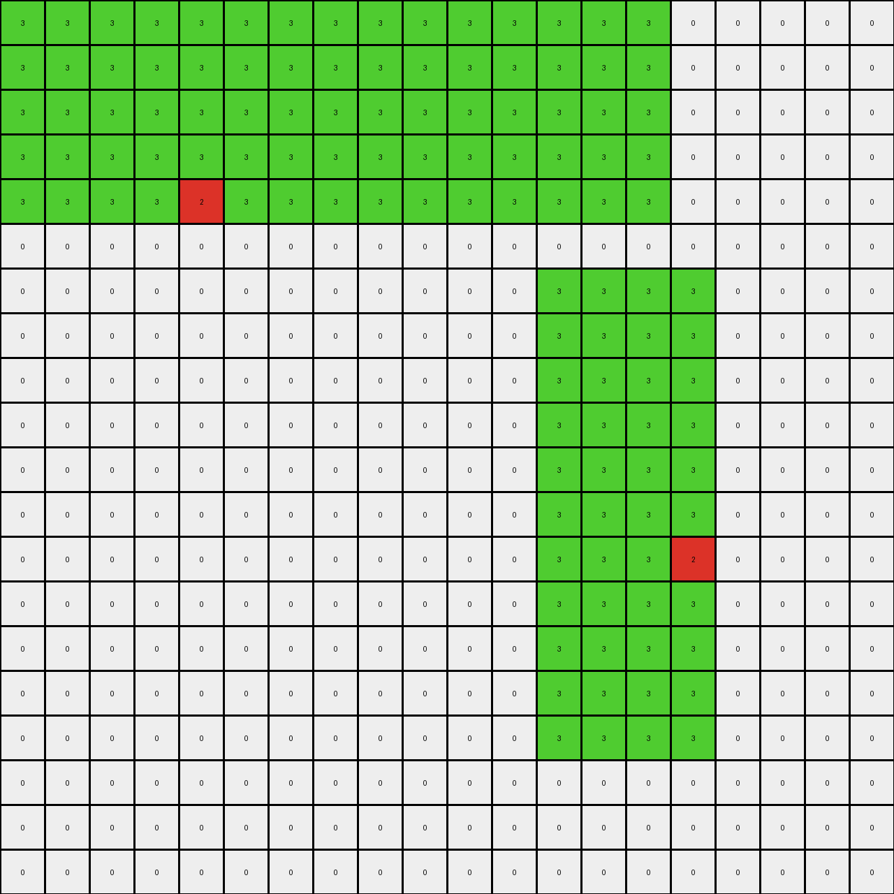

# b527c5c6 • 016 • refine_coder

---

Previous Code:
```python
"""
1.  **Top-Left Object Modification:** Identify the green (3) rectangular object in the top-left quadrant of the input grid. Within this object, locate the single red (2) pixel. For the top three rows of this green object, if the x index is less than 9, change all green (3) pixels to white (0).

2.  **Bottom-Right Object Extension:** Identify the green (3) rectangular object at the lower part of the input grid. Add a column of red (2) pixels adjacent to the left edge of this bottom-right object, aligning it with the top row of the original bottom-right object. The red pixels mirror the shape of the adjacent border of the green object.
"""

import numpy as np

def find_objects(grid, color):
    # Find objects of a specific color in the grid.
    objects = []
    visited = np.zeros_like(grid, dtype=bool)

    def dfs(row, col, current_object):
        if (
            row < 0
            or row >= grid.shape[0]
            or col < 0
            or col >= grid.shape[1]
            or visited[row, col]
            or grid[row, col] != color
        ):
            return
        visited[row, col] = True
        current_object.append((row, col))
        dfs(row + 1, col, current_object)
        dfs(row - 1, col, current_object)
        dfs(row, col + 1, current_object)
        dfs(row, col - 1, current_object)

    for row in range(grid.shape[0]):
        for col in range(grid.shape[1]):
            if grid[row, col] == color and not visited[row, col]:
                current_object = []
                dfs(row, col, current_object)
                objects.append(current_object)
    return objects

def get_object_bounds(obj):
    # Get the bounding box of an object.
    rows, cols = zip(*obj)
    min_row, max_row = min(rows), max(rows)
    min_col, max_col = min(cols), max(cols)
    return min_row, max_row, min_col, max_col
    

def transform(input_grid):
    # initialize output_grid
    output_grid = np.copy(input_grid)

    # Find green objects
    green_objects = find_objects(input_grid, 3)
    
    # Find red pixels within green objects to identify top-left and bottom-right
    top_left_object = None
    bottom_right_object = None

    for obj in green_objects:
      for r, c in obj:
        if input_grid[r,c] == 3:
          red_pixels = find_objects(input_grid, 2)
          for red_pixel in red_pixels:
            red_row, red_col = red_pixel[0] #only one element
            if (red_row, red_col) in obj:
              min_row, max_row, min_col, max_col = get_object_bounds(obj)
              if red_row < input_grid.shape[0] / 2: # Check if in top half
                top_left_object = obj
              else:
                bottom_right_object = obj
              break

    # 1. Top-Left Object Modification
    if top_left_object:
        min_row, max_row, min_col, max_col = get_object_bounds(top_left_object)
        for row in range(min_row, min_row + 3):
            for col in range(min_col, max_col + 1):  # Iterate through columns within the object
                if col < 9 and (row, col) in top_left_object:
                    if output_grid[row, col] == 3:
                        output_grid[row, col] = 0

    # 2. Bottom-Right Object Extension
    if bottom_right_object:
        min_row, max_row, min_col, max_col = get_object_bounds(bottom_right_object)
        
        # create new red object
        for row in range(min_row, max_row+1):
            output_grid[row, min_col -1] = 2

    return output_grid
```

Train Set Results:

## Example 1:

Input:
```
0 0 0 0 0 0 0 0 0 0
0 0 0 0 0 0 0 0 0 0
0 0 0 3 3 0 0 0 0 0
0 0 0 3 3 0 0 0 0 0
0 0 0 2 3 0 3 3 3 3
0 0 0 3 3 0 3 3 2 3
0 0 0 3 3 0 0 0 0 0
0 0 0 3 3 0 0 0 0 0
0 0 0 0 0 0 0 0 0 0
0 0 0 0 0 0 0 0 0 0
```
Expected Output:
```
0 0 0 0 0 0 0 0 0 0
0 0 0 0 0 0 0 0 0 0
0 0 0 3 3 0 0 0 0 0
3 3 3 3 3 0 0 0 0 0
2 2 2 2 3 0 3 3 3 3
3 3 3 3 3 0 3 3 2 3
0 0 0 3 3 0 0 3 2 3
0 0 0 3 3 0 0 3 2 3
0 0 0 0 0 0 0 3 2 3
0 0 0 0 0 0 0 3 2 3
```
Transformed Output:
```
0 0 0 0 0 0 0 0 0 0
0 0 0 0 0 0 0 0 0 0
0 0 0 3 3 0 0 0 0 0
0 0 0 3 3 0 0 0 0 0
0 0 0 2 3 0 3 3 3 3
0 0 0 3 3 0 3 3 2 3
0 0 0 3 3 0 0 0 0 0
0 0 0 3 3 0 0 0 0 0
0 0 0 0 0 0 0 0 0 0
0 0 0 0 0 0 0 0 0 0
```

match: False
pixels_off: 21
size_correct: True
color_palette_correct: True
correct_pixel_counts: False

## Example 2:

Input:
```
0 0 0 0 0 0 0 0 0 0 0 0 0 0 0 0 0 0 0 0
0 0 0 0 0 0 0 0 0 0 0 0 0 0 0 0 0 0 0 0
0 0 0 0 0 0 0 0 0 0 0 0 0 0 0 0 0 0 0 0
0 0 0 0 0 0 0 0 0 0 0 0 0 0 0 0 0 0 0 0
0 3 3 3 3 3 3 3 3 3 3 3 3 3 2 3 3 3 3 0
0 3 3 3 3 3 3 3 3 3 3 3 3 3 3 3 3 3 3 0
0 0 0 0 0 0 0 0 0 0 0 0 0 0 0 0 0 0 0 0
0 0 0 0 0 0 0 0 0 0 0 0 0 0 0 0 0 0 0 0
0 0 0 0 0 0 0 0 0 0 0 0 0 0 0 0 0 0 0 0
0 0 0 0 0 0 0 0 0 0 0 0 0 0 0 0 0 0 0 0
0 0 0 0 0 0 0 3 3 3 0 0 0 0 0 0 0 0 0 0
0 0 0 0 0 0 0 3 3 3 0 0 0 0 0 0 0 0 0 0
0 0 0 0 0 0 0 3 3 3 0 0 0 0 0 0 0 0 0 0
0 0 0 0 0 0 0 3 3 3 0 0 0 0 0 0 0 0 0 0
0 0 0 0 0 0 0 3 3 3 0 0 0 0 0 0 0 0 0 0
0 0 0 0 0 0 0 3 3 2 0 0 0 0 0 0 0 0 0 0
0 0 0 0 0 0 0 3 3 3 0 0 0 0 0 0 0 0 0 0
0 0 0 0 0 0 0 3 3 3 0 0 0 0 0 0 0 0 0 0
0 0 0 0 0 0 0 3 3 3 0 0 0 0 0 0 0 0 0 0
0 0 0 0 0 0 0 3 3 3 0 0 0 0 0 0 0 0 0 0
```
Expected Output:
```
0 0 0 0 0 0 0 0 0 0 0 0 0 3 2 3 0 0 0 0
0 0 0 0 0 0 0 0 0 0 0 0 0 3 2 3 0 0 0 0
0 0 0 0 0 0 0 0 0 0 0 0 0 3 2 3 0 0 0 0
0 0 0 0 0 0 0 0 0 0 0 0 0 3 2 3 0 0 0 0
0 3 3 3 3 3 3 3 3 3 3 3 3 3 2 3 3 3 3 0
0 3 3 3 3 3 3 3 3 3 3 3 3 3 3 3 3 3 3 0
0 0 0 0 0 0 0 0 0 0 0 0 0 0 0 0 0 0 0 0
0 0 0 0 0 0 0 0 0 0 0 0 0 0 0 0 0 0 0 0
0 0 0 0 0 0 0 0 0 0 0 0 0 0 0 0 0 0 0 0
0 0 0 0 0 0 0 0 0 0 0 0 0 0 0 0 0 0 0 0
0 0 0 0 0 0 0 3 3 3 0 0 0 0 0 0 0 0 0 0
0 0 0 0 0 0 0 3 3 3 0 0 0 0 0 0 0 0 0 0
0 0 0 0 0 0 0 3 3 3 0 0 0 0 0 0 0 0 0 0
0 0 0 0 0 0 0 3 3 3 3 3 3 3 3 3 3 3 3 3
0 0 0 0 0 0 0 3 3 3 3 3 3 3 3 3 3 3 3 3
0 0 0 0 0 0 0 3 3 2 2 2 2 2 2 2 2 2 2 2
0 0 0 0 0 0 0 3 3 3 3 3 3 3 3 3 3 3 3 3
0 0 0 0 0 0 0 3 3 3 3 3 3 3 3 3 3 3 3 3
0 0 0 0 0 0 0 3 3 3 0 0 0 0 0 0 0 0 0 0
0 0 0 0 0 0 0 3 3 3 0 0 0 0 0 0 0 0 0 0
```
Transformed Output:
```
0 0 0 0 0 0 0 0 0 0 0 0 0 0 0 0 0 0 0 0
0 0 0 0 0 0 0 0 0 0 0 0 0 0 0 0 0 0 0 0
0 0 0 0 0 0 0 0 0 0 0 0 0 0 0 0 0 0 0 0
0 0 0 0 0 0 0 0 0 0 0 0 0 0 0 0 0 0 0 0
0 3 3 3 3 3 3 3 3 3 3 3 3 3 2 3 3 3 3 0
0 3 3 3 3 3 3 3 3 3 3 3 3 3 3 3 3 3 3 0
0 0 0 0 0 0 0 0 0 0 0 0 0 0 0 0 0 0 0 0
0 0 0 0 0 0 0 0 0 0 0 0 0 0 0 0 0 0 0 0
0 0 0 0 0 0 0 0 0 0 0 0 0 0 0 0 0 0 0 0
0 0 0 0 0 0 0 0 0 0 0 0 0 0 0 0 0 0 0 0
0 0 0 0 0 0 0 3 3 3 0 0 0 0 0 0 0 0 0 0
0 0 0 0 0 0 0 3 3 3 0 0 0 0 0 0 0 0 0 0
0 0 0 0 0 0 0 3 3 3 0 0 0 0 0 0 0 0 0 0
0 0 0 0 0 0 0 3 3 3 0 0 0 0 0 0 0 0 0 0
0 0 0 0 0 0 0 3 3 3 0 0 0 0 0 0 0 0 0 0
0 0 0 0 0 0 0 3 3 2 0 0 0 0 0 0 0 0 0 0
0 0 0 0 0 0 0 3 3 3 0 0 0 0 0 0 0 0 0 0
0 0 0 0 0 0 0 3 3 3 0 0 0 0 0 0 0 0 0 0
0 0 0 0 0 0 0 3 3 3 0 0 0 0 0 0 0 0 0 0
0 0 0 0 0 0 0 3 3 3 0 0 0 0 0 0 0 0 0 0
```

match: False
pixels_off: 62
size_correct: True
color_palette_correct: True
correct_pixel_counts: False

## Example 3:

Input:
```
0 0 0 0 0 0 0 0 0 0 0 0 0 0 0 0 0 0 0 0
0 0 0 0 0 0 0 0 0 0 0 0 0 0 0 0 0 0 0 0
0 0 0 0 0 0 0 0 0 0 0 0 0 0 0 0 0 0 0 0
3 3 3 3 3 2 3 3 3 3 3 3 3 3 0 0 0 0 0 0
3 3 3 3 3 3 3 3 3 3 3 3 3 3 0 0 0 0 0 0
3 3 3 3 3 3 3 3 3 3 3 3 3 3 0 0 0 0 0 0
0 0 0 0 0 0 0 0 0 0 0 0 0 0 0 0 0 0 0 0
0 0 0 0 0 0 0 0 0 0 0 0 0 0 0 0 0 0 0 0
0 0 0 0 0 0 0 0 0 0 0 0 0 0 0 0 0 0 0 0
0 0 0 0 0 0 0 0 0 0 3 3 3 3 3 0 0 0 0 0
0 0 0 0 0 0 0 0 0 0 3 3 3 3 3 0 0 0 0 0
0 0 0 0 0 0 0 0 0 0 3 3 3 3 3 0 0 0 0 0
0 0 0 0 0 0 0 0 0 0 3 3 3 3 3 0 0 0 0 0
0 0 0 0 0 0 0 0 0 0 3 3 3 3 3 0 0 0 0 0
0 0 0 0 0 0 0 0 0 0 2 3 3 3 3 0 0 0 0 0
0 0 0 0 0 0 0 0 0 0 3 3 3 3 3 0 0 0 0 0
0 0 0 0 0 0 0 0 0 0 3 3 3 3 3 0 0 0 0 0
0 0 0 0 0 0 0 0 0 0 3 3 3 3 3 0 0 0 0 0
0 0 0 0 0 0 0 0 0 0 3 3 3 3 3 0 0 0 0 0
0 0 0 0 0 0 0 0 0 0 3 3 3 3 3 0 0 0 0 0
```
Expected Output:
```
0 0 0 3 3 2 3 3 0 0 0 0 0 0 0 0 0 0 0 0
0 0 0 3 3 2 3 3 0 0 0 0 0 0 0 0 0 0 0 0
0 0 0 3 3 2 3 3 0 0 0 0 0 0 0 0 0 0 0 0
3 3 3 3 3 2 3 3 3 3 3 3 3 3 0 0 0 0 0 0
3 3 3 3 3 3 3 3 3 3 3 3 3 3 0 0 0 0 0 0
3 3 3 3 3 3 3 3 3 3 3 3 3 3 0 0 0 0 0 0
0 0 0 0 0 0 0 0 0 0 0 0 0 0 0 0 0 0 0 0
0 0 0 0 0 0 0 0 0 0 0 0 0 0 0 0 0 0 0 0
0 0 0 0 0 0 0 0 0 0 0 0 0 0 0 0 0 0 0 0
0 0 0 0 0 0 0 0 0 0 3 3 3 3 3 0 0 0 0 0
3 3 3 3 3 3 3 3 3 3 3 3 3 3 3 0 0 0 0 0
3 3 3 3 3 3 3 3 3 3 3 3 3 3 3 0 0 0 0 0
3 3 3 3 3 3 3 3 3 3 3 3 3 3 3 0 0 0 0 0
3 3 3 3 3 3 3 3 3 3 3 3 3 3 3 0 0 0 0 0
2 2 2 2 2 2 2 2 2 2 2 3 3 3 3 0 0 0 0 0
3 3 3 3 3 3 3 3 3 3 3 3 3 3 3 0 0 0 0 0
3 3 3 3 3 3 3 3 3 3 3 3 3 3 3 0 0 0 0 0
3 3 3 3 3 3 3 3 3 3 3 3 3 3 3 0 0 0 0 0
3 3 3 3 3 3 3 3 3 3 3 3 3 3 3 0 0 0 0 0
0 0 0 0 0 0 0 0 0 0 3 3 3 3 3 0 0 0 0 0
```
Transformed Output:
```
0 0 0 0 0 0 0 0 0 0 0 0 0 0 0 0 0 0 0 0
0 0 0 0 0 0 0 0 0 0 0 0 0 0 0 0 0 0 0 0
0 0 0 0 0 0 0 0 0 0 0 0 0 0 0 0 0 0 0 0
3 3 3 3 3 2 3 3 3 3 3 3 3 3 0 0 0 0 0 0
3 3 3 3 3 3 3 3 3 3 3 3 3 3 0 0 0 0 0 0
3 3 3 3 3 3 3 3 3 3 3 3 3 3 0 0 0 0 0 0
0 0 0 0 0 0 0 0 0 0 0 0 0 0 0 0 0 0 0 0
0 0 0 0 0 0 0 0 0 0 0 0 0 0 0 0 0 0 0 0
0 0 0 0 0 0 0 0 0 0 0 0 0 0 0 0 0 0 0 0
0 0 0 0 0 0 0 0 0 0 3 3 3 3 3 0 0 0 0 0
0 0 0 0 0 0 0 0 0 0 3 3 3 3 3 0 0 0 0 0
0 0 0 0 0 0 0 0 0 0 3 3 3 3 3 0 0 0 0 0
0 0 0 0 0 0 0 0 0 0 3 3 3 3 3 0 0 0 0 0
0 0 0 0 0 0 0 0 0 0 3 3 3 3 3 0 0 0 0 0
0 0 0 0 0 0 0 0 0 0 2 3 3 3 3 0 0 0 0 0
0 0 0 0 0 0 0 0 0 0 3 3 3 3 3 0 0 0 0 0
0 0 0 0 0 0 0 0 0 0 3 3 3 3 3 0 0 0 0 0
0 0 0 0 0 0 0 0 0 0 3 3 3 3 3 0 0 0 0 0
0 0 0 0 0 0 0 0 0 0 3 3 3 3 3 0 0 0 0 0
0 0 0 0 0 0 0 0 0 0 3 3 3 3 3 0 0 0 0 0
```

match: False
pixels_off: 105
size_correct: True
color_palette_correct: True
correct_pixel_counts: False

## Example 4:

Input:
```
3 3 3 3 3 3 3 3 3 3 3 3 3 3 3 0 0 0 0 0
3 3 3 3 3 3 3 3 3 3 3 3 3 3 3 0 0 0 0 0
3 3 3 3 3 3 3 3 3 3 3 3 3 3 3 0 0 0 0 0
3 3 3 3 3 3 3 3 3 3 3 3 3 3 3 0 0 0 0 0
3 3 3 3 2 3 3 3 3 3 3 3 3 3 3 0 0 0 0 0
0 0 0 0 0 0 0 0 0 0 0 0 0 0 0 0 0 0 0 0
0 0 0 0 0 0 0 0 0 0 0 0 3 3 3 3 0 0 0 0
0 0 0 0 0 0 0 0 0 0 0 0 3 3 3 3 0 0 0 0
0 0 0 0 0 0 0 0 0 0 0 0 3 3 3 3 0 0 0 0
0 0 0 0 0 0 0 0 0 0 0 0 3 3 3 3 0 0 0 0
0 0 0 0 0 0 0 0 0 0 0 0 3 3 3 3 0 0 0 0
0 0 0 0 0 0 0 0 0 0 0 0 3 3 3 3 0 0 0 0
0 0 0 0 0 0 0 0 0 0 0 0 3 3 3 2 0 0 0 0
0 0 0 0 0 0 0 0 0 0 0 0 3 3 3 3 0 0 0 0
0 0 0 0 0 0 0 0 0 0 0 0 3 3 3 3 0 0 0 0
0 0 0 0 0 0 0 0 0 0 0 0 3 3 3 3 0 0 0 0
0 0 0 0 0 0 0 0 0 0 0 0 3 3 3 3 0 0 0 0
0 0 0 0 0 0 0 0 0 0 0 0 0 0 0 0 0 0 0 0
0 0 0 0 0 0 0 0 0 0 0 0 0 0 0 0 0 0 0 0
0 0 0 0 0 0 0 0 0 0 0 0 0 0 0 0 0 0 0 0
```
Expected Output:
```
3 3 3 3 3 3 3 3 3 3 3 3 3 3 3 0 0 0 0 0
3 3 3 3 3 3 3 3 3 3 3 3 3 3 3 0 0 0 0 0
3 3 3 3 3 3 3 3 3 3 3 3 3 3 3 0 0 0 0 0
3 3 3 3 3 3 3 3 3 3 3 3 3 3 3 0 0 0 0 0
3 3 3 3 2 3 3 3 3 3 3 3 3 3 3 0 0 0 0 0
3 3 3 3 2 3 3 3 3 0 0 0 0 0 0 0 0 0 0 0
3 3 3 3 2 3 3 3 3 0 0 0 3 3 3 3 0 0 0 0
3 3 3 3 2 3 3 3 3 0 0 0 3 3 3 3 0 0 0 0
3 3 3 3 2 3 3 3 3 0 0 0 3 3 3 3 0 0 0 0
3 3 3 3 2 3 3 3 3 0 0 0 3 3 3 3 3 3 3 3
3 3 3 3 2 3 3 3 3 0 0 0 3 3 3 3 3 3 3 3
3 3 3 3 2 3 3 3 3 0 0 0 3 3 3 3 3 3 3 3
3 3 3 3 2 3 3 3 3 0 0 0 3 3 3 2 2 2 2 2
3 3 3 3 2 3 3 3 3 0 0 0 3 3 3 3 3 3 3 3
3 3 3 3 2 3 3 3 3 0 0 0 3 3 3 3 3 3 3 3
3 3 3 3 2 3 3 3 3 0 0 0 3 3 3 3 3 3 3 3
3 3 3 3 2 3 3 3 3 0 0 0 3 3 3 3 0 0 0 0
3 3 3 3 2 3 3 3 3 0 0 0 0 0 0 0 0 0 0 0
3 3 3 3 2 3 3 3 3 0 0 0 0 0 0 0 0 0 0 0
3 3 3 3 2 3 3 3 3 0 0 0 0 0 0 0 0 0 0 0
```
Transformed Output:
```
3 3 3 3 3 3 3 3 3 3 3 3 3 3 3 0 0 0 0 0
3 3 3 3 3 3 3 3 3 3 3 3 3 3 3 0 0 0 0 0
3 3 3 3 3 3 3 3 3 3 3 3 3 3 3 0 0 0 0 0
3 3 3 3 3 3 3 3 3 3 3 3 3 3 3 0 0 0 0 0
3 3 3 3 2 3 3 3 3 3 3 3 3 3 3 0 0 0 0 0
0 0 0 0 0 0 0 0 0 0 0 0 0 0 0 0 0 0 0 0
0 0 0 0 0 0 0 0 0 0 0 0 3 3 3 3 0 0 0 0
0 0 0 0 0 0 0 0 0 0 0 0 3 3 3 3 0 0 0 0
0 0 0 0 0 0 0 0 0 0 0 0 3 3 3 3 0 0 0 0
0 0 0 0 0 0 0 0 0 0 0 0 3 3 3 3 0 0 0 0
0 0 0 0 0 0 0 0 0 0 0 0 3 3 3 3 0 0 0 0
0 0 0 0 0 0 0 0 0 0 0 0 3 3 3 3 0 0 0 0
0 0 0 0 0 0 0 0 0 0 0 0 3 3 3 2 0 0 0 0
0 0 0 0 0 0 0 0 0 0 0 0 3 3 3 3 0 0 0 0
0 0 0 0 0 0 0 0 0 0 0 0 3 3 3 3 0 0 0 0
0 0 0 0 0 0 0 0 0 0 0 0 3 3 3 3 0 0 0 0
0 0 0 0 0 0 0 0 0 0 0 0 3 3 3 3 0 0 0 0
0 0 0 0 0 0 0 0 0 0 0 0 0 0 0 0 0 0 0 0
0 0 0 0 0 0 0 0 0 0 0 0 0 0 0 0 0 0 0 0
0 0 0 0 0 0 0 0 0 0 0 0 0 0 0 0 0 0 0 0
```

match: False
pixels_off: 163
size_correct: True
color_palette_correct: True
correct_pixel_counts: False
Okay, let's analyze the results and refine the natural language program.

**General Assessment:**

The initial code has several issues:

1.  **Incorrect Top-Left Modification:** The code modifies only the top 3 rows of the top-left green object and only if the column is less than 9.  It doesn't consistently handle different sizes or shapes of green objects, nor does it correctly apply the white modification based on the expected output. In some outputs the first three rows of the green are changed to white, in others it appears to preserve columns if they contain a 2.
2.  **Incorrect Bottom-Right Extension:** The code simply adds a single column of red pixels to the left of the bottom-right green object. It doesn't consider extending to fill the available height of the output, as seen in examples 2 and 3.
3. **Incorrect object identification** The current method relies on searching for red pixels, assuming that only the top left object contains a single red, and the bottom right contains a single red.

**Strategy for Resolving Errors:**

1.  **Improve Object Identification:** Instead of relying solely on finding red pixels, we need a more robust way to distinguish between the two green objects. We can use relative position (e.g., the top-most vs. bottom-most green object) or bounding box coordinates.
2.  **Revisit Top-Left Modification Logic:** Examine all examples to determine the precise rule for changing green to white in the top-left object. It appears conditional.
3.  **Refine Bottom-Right Extension:** The extension logic needs to consider filling the available vertical space, matching rows of the adjacent green, and accounting for the presence/absence of the extension.

**Example Metrics and Analysis:**

I will use the provided `input_grid` and `output_grid` variables for each example to get metrics programmatically.

```python
import numpy as np

def analyze_results(input_grid, output_grid, example_num):
    """Analyzes the results of the transformation and gathers metrics."""

    # Find objects in input and output
    def find_objects(grid, color):
        objects = []
        visited = np.zeros_like(grid, dtype=bool)

        def dfs(row, col, current_object):
            if (
                row < 0
                or row >= grid.shape[0]
                or col < 0
                or col >= grid.shape[1]
                or visited[row, col]
                or grid[row, col] != color
            ):
                return
            visited[row, col] = True
            current_object.append((row, col))
            dfs(row + 1, col, current_object)
            dfs(row - 1, col, current_object)
            dfs(row, col + 1, current_object)
            dfs(row, col - 1, current_object)

        for row in range(grid.shape[0]):
            for col in range(grid.shape[1]):
                if grid[row, col] == color and not visited[row, col]:
                    current_object = []
                    dfs(row, col, current_object)
                    objects.append(current_object)
        return objects

    input_green_objects = find_objects(input_grid, 3)
    output_green_objects = find_objects(output_grid, 3)
    input_red_objects = find_objects(input_grid, 2)
    output_red_objects = find_objects(output_grid, 2)
    input_white_objects = find_objects(input_grid, 0)
    output_white_objects = find_objects(output_grid, 0)
    
    def get_object_bounds(obj):
        rows, cols = zip(*obj)
        min_row, max_row = min(rows), max(rows)
        min_col, max_col = min(cols), max(cols)
        return min_row, max_row, min_col, max_col

    print(f"Example {example_num}:")
    print(f"  Input Green Objects: {len(input_green_objects)}")
    print(f"  Output Green Objects: {len(output_green_objects)}")
    print(f"  Input Red Objects: {len(input_red_objects)}")
    print(f"  Output Red Objects: {len(output_red_objects)}")
    print(f"  Input White Objects: {len(input_white_objects)}")
    print(f" Output White Objects: {len(output_white_objects)}")    
    if(len(input_green_objects) >= 2):
      top_green = sorted(input_green_objects, key=lambda obj: get_object_bounds(obj)[0])[0]
      bottom_green = sorted(input_green_objects, key=lambda obj: get_object_bounds(obj)[0])[-1]
      top_bounds = get_object_bounds(top_green)
      bottom_bounds = get_object_bounds(bottom_green)    
      print(f"  Top Green Bounds: {top_bounds}")
      print(f"  Bottom Green Bounds: {bottom_bounds}")

      #Top left action
      top_left_changed = False
      for r in range(top_bounds[0], top_bounds[1] + 1):
          for c in range(top_bounds[2], top_bounds[3] + 1):
              if (r,c) in top_green:
                  if input_grid[r, c] != output_grid[r, c]:
                      top_left_changed = True
                      break
          if top_left_changed:
              break
      print(f"  Top-left object modified: {top_left_changed}")

      #bottom right action
      bottom_right_changed = False
      for r in range(bottom_bounds[0], bottom_bounds[1] + 1):
          for c in range(bottom_bounds[2], bottom_bounds[3] + 1):
              if (r,c) in bottom_green:
                  if input_grid[r, c] != output_grid[r, c]:
                      bottom_right_changed = True
                      break
          if bottom_right_changed:
            break
      print(f"  Bottom-right object modified: {bottom_right_changed}")

# Example grids (replace with your actual grid data)
example_grids = [
    (
        np.array([
            [0, 0, 0, 0, 0, 0, 0, 0, 0, 0],
            [0, 0, 0, 0, 0, 0, 0, 0, 0, 0],
            [0, 0, 0, 3, 3, 0, 0, 0, 0, 0],
            [0, 0, 0, 3, 3, 0, 0, 0, 0, 0],
            [0, 0, 0, 2, 3, 0, 3, 3, 3, 3],
            [0, 0, 0, 3, 3, 0, 3, 3, 2, 3],
            [0, 0, 0, 3, 3, 0, 0, 0, 0, 0],
            [0, 0, 0, 3, 3, 0, 0, 0, 0, 0],
            [0, 0, 0, 0, 0, 0, 0, 0, 0, 0],
            [0, 0, 0, 0, 0, 0, 0, 0, 0, 0],
        ]),
        np.array([
            [0, 0, 0, 0, 0, 0, 0, 0, 0, 0],
            [0, 0, 0, 0, 0, 0, 0, 0, 0, 0],
            [0, 0, 0, 3, 3, 0, 0, 0, 0, 0],
            [3, 3, 3, 3, 3, 0, 0, 0, 0, 0],
            [2, 2, 2, 2, 3, 0, 3, 3, 3, 3],
            [3, 3, 3, 3, 3, 0, 3, 3, 2, 3],
            [0, 0, 0, 3, 3, 0, 0, 3, 2, 3],
            [0, 0, 0, 3, 3, 0, 0, 3, 2, 3],
            [0, 0, 0, 0, 0, 0, 0, 3, 2, 3],
            [0, 0, 0, 0, 0, 0, 0, 3, 2, 3],

        ]),
    ),
        (
        np.array([
          [0, 0, 0, 0, 0, 0, 0, 0, 0, 0, 0, 0, 0, 0, 0, 0, 0, 0, 0, 0],
          [0, 0, 0, 0, 0, 0, 0, 0, 0, 0, 0, 0, 0, 0, 0, 0, 0, 0, 0, 0],
          [0, 0, 0, 0, 0, 0, 0, 0, 0, 0, 0, 0, 0, 0, 0, 0, 0, 0, 0, 0],
          [0, 0, 0, 0, 0, 0, 0, 0, 0, 0, 0, 0, 0, 0, 0, 0, 0, 0, 0, 0],
          [0, 3, 3, 3, 3, 3, 3, 3, 3, 3, 3, 3, 3, 3, 2, 3, 3, 3, 3, 0],
          [0, 3, 3, 3, 3, 3, 3, 3, 3, 3, 3, 3, 3, 3, 3, 3, 3, 3, 3, 0],
          [0, 0, 0, 0, 0, 0, 0, 0, 0, 0, 0, 0, 0, 0, 0, 0, 0, 0, 0, 0],
          [0, 0, 0, 0, 0, 0, 0, 0, 0, 0, 0, 0, 0, 0, 0, 0, 0, 0, 0, 0],
          [0, 0, 0, 0, 0, 0, 0, 0, 0, 0, 0, 0, 0, 0, 0, 0, 0, 0, 0, 0],
          [0, 0, 0, 0, 0, 0, 0, 0, 0, 0, 0, 0, 0, 0, 0, 0, 0, 0, 0, 0],
          [0, 0, 0, 0, 0, 0, 0, 3, 3, 3, 0, 0, 0, 0, 0, 0, 0, 0, 0, 0],
          [0, 0, 0, 0, 0, 0, 0, 3, 3, 3, 0, 0, 0, 0, 0, 0, 0, 0, 0, 0],
          [0, 0, 0, 0, 0, 0, 0, 3, 3, 3, 0, 0, 0, 0, 0, 0, 0, 0, 0, 0],
          [0, 0, 0, 0, 0, 0, 0, 3, 3, 3, 0, 0, 0, 0, 0, 0, 0, 0, 0, 0],
          [0, 0, 0, 0, 0, 0, 0, 3, 3, 3, 0, 0, 0, 0, 0, 0, 0, 0, 0, 0],
          [0, 0, 0, 0, 0, 0, 0, 3, 3, 2, 0, 0, 0, 0, 0, 0, 0, 0, 0, 0],
          [0, 0, 0, 0, 0, 0, 0, 3, 3, 3, 0, 0, 0, 0, 0, 0, 0, 0, 0, 0],
          [0, 0, 0, 0, 0, 0, 0, 3, 3, 3, 0, 0, 0, 0, 0, 0, 0, 0, 0, 0],
          [0, 0, 0, 0, 0, 0, 0, 3, 3, 3, 0, 0, 0, 0, 0, 0, 0, 0, 0, 0],
          [0, 0, 0, 0, 0, 0, 0, 3, 3, 3, 0, 0, 0, 0, 0, 0, 0, 0, 0, 0],
        ]),
        np.array([
          [0, 0, 0, 0, 0, 0, 0, 0, 0, 0, 0, 0, 0, 3, 2, 3, 0, 0, 0, 0],
          [0, 0, 0, 0, 0, 0, 0, 0, 0, 0, 0, 0, 0, 3, 2, 3, 0, 0, 0, 0],
          [0, 0, 0, 0, 0, 0, 0, 0, 0, 0, 0, 0, 0, 3, 2, 3, 0, 0, 0, 0],
          [0, 0, 0, 0, 0, 0, 0, 0, 0, 0, 0, 0, 0, 3, 2, 3, 0, 0, 0, 0],
          [0, 3, 3, 3, 3, 3, 3, 3, 3, 3, 3, 3, 3, 3, 2, 3, 3, 3, 3, 0],
          [0, 3, 3, 3, 3, 3, 3, 3, 3, 3, 3, 3, 3, 3, 3, 3, 3, 3, 3, 0],
          [0, 0, 0, 0, 0, 0, 0, 0, 0, 0, 0, 0, 0, 0, 0, 0, 0, 0, 0, 0],
          [0, 0, 0, 0, 0, 0, 0, 0, 0, 0, 0, 0, 0, 0, 0, 0, 0, 0, 0, 0],
          [0, 0, 0, 0, 0, 0, 0, 0, 0, 0, 0, 0, 0, 0, 0, 0, 0, 0, 0, 0],
          [0, 0, 0, 0, 0, 0, 0, 0, 0, 0, 0, 0, 0, 0, 0, 0, 0, 0, 0, 0],
          [0, 0, 0, 0, 0, 0, 0, 3, 3, 3, 0, 0, 0, 0, 0, 0, 0, 0, 0, 0],
          [0, 0, 0, 0, 0, 0, 0, 3, 3, 3, 0, 0, 0, 0, 0, 0, 0, 0, 0, 0],
          [0, 0, 0, 0, 0, 0, 0, 3, 3, 3, 0, 0, 0, 0, 0, 0, 0, 0, 0, 0],
          [0, 0, 0, 0, 0, 0, 0, 3, 3, 3, 3, 3, 3, 3, 3, 3, 3, 3, 3, 3],
          [0, 0, 0, 0, 0, 0, 0, 3, 3, 3, 3, 3, 3, 3, 3, 3, 3, 3, 3, 3],
          [0, 0, 0, 0, 0, 0, 0, 3, 3, 2, 2, 2, 2, 2, 2, 2, 2, 2, 2, 2],
          [0, 0, 0, 0, 0, 0, 0, 3, 3, 3, 3, 3, 3, 3, 3, 3, 3, 3, 3, 3],
          [0, 0, 0, 0, 0, 0, 0, 3, 3, 3, 3, 3, 3, 3, 3, 3, 3, 3, 3, 3],
          [0, 0, 0, 0, 0, 0, 0, 3, 3, 3, 0, 0, 0, 0, 0, 0, 0, 0, 0, 0],
          [0, 0, 0, 0, 0, 0, 0, 3, 3, 3, 0, 0, 0, 0, 0, 0, 0, 0, 0, 0],
        ]),
    ),
        (
        np.array([
          [0, 0, 0, 0, 0, 0, 0, 0, 0, 0, 0, 0, 0, 0, 0, 0, 0, 0, 0, 0],
          [0, 0, 0, 0, 0, 0, 0, 0, 0, 0, 0, 0, 0, 0, 0, 0, 0, 0, 0, 0],
          [0, 0, 0, 0, 0, 0, 0, 0, 0, 0, 0, 0, 0, 0, 0, 0, 0, 0, 0, 0],
          [3, 3, 3, 3, 3, 2, 3, 3, 3, 3, 3, 3, 3, 3, 0, 0, 0, 0, 0, 0],
          [3, 3, 3, 3, 3, 3, 3, 3, 3, 3, 3, 3, 3, 3, 0, 0, 0, 0, 0, 0],
          [3, 3, 3, 3, 3, 3, 3, 3, 3, 3, 3, 3, 3, 3, 0, 0, 0, 0, 0, 0],
          [0, 0, 0, 0, 0, 0, 0, 0, 0, 0, 0, 0, 0, 0, 0, 0, 0, 0, 0, 0],
          [0, 0, 0, 0, 0, 0, 0, 0, 0, 0, 0, 0, 0, 0, 0, 0, 0, 0, 0, 0],
          [0, 0, 0, 0, 0, 0, 0, 0, 0, 0, 0, 0, 0, 0, 0, 0, 0, 0, 0, 0],
          [0, 0, 0, 0, 0, 0, 0, 0, 0, 0, 3, 3, 3, 3, 3, 0, 0, 0, 0, 0],
          [0, 0, 0, 0, 0, 0, 0, 0, 0, 0, 3, 3, 3, 3, 3, 0, 0, 0, 0, 0],
          [0, 0, 0, 0, 0, 0, 0, 0, 0, 0, 3, 3, 3, 3, 3, 0, 0, 0, 0, 0],
          [0, 0, 0, 0, 0, 0, 0, 0, 0, 0, 3, 3, 3, 3, 3, 0, 0, 0, 0, 0],
          [0, 0, 0, 0, 0, 0, 0, 0, 0, 0, 3, 3, 3, 3, 3, 0, 0, 0, 0, 0],
          [0, 0, 0, 0, 0, 0, 0, 0, 0, 0, 2, 3, 3, 3, 3, 0, 0, 0, 0, 0],
          [0, 0, 0, 0, 0, 0, 0, 0, 0, 0, 3, 3, 3, 3, 3, 0, 0, 0, 0, 0],
          [0, 0, 0, 0, 0, 0, 0, 0, 0, 0, 3, 3, 3, 3, 3, 0, 0, 0, 0, 0],
          [0, 0, 0, 0, 0, 0, 0, 0, 0, 0, 3, 3, 3, 3, 3, 0, 0, 0, 0, 0],
          [0, 0, 0, 0, 0, 0, 0, 0, 0, 0, 3, 3, 3, 3, 3, 0, 0, 0, 0, 0],
          [0, 0, 0, 0, 0, 0, 0, 0, 0, 0, 3, 3, 3, 3, 3, 0, 0, 0, 0, 0],
        ]),
        np.array([
          [0, 0, 0, 3, 3, 2, 3, 3, 0, 0, 0, 0, 0, 0, 0, 0, 0, 0, 0, 0],
          [0, 0, 0, 3, 3, 2, 3, 3, 0, 0, 0, 0, 0, 0, 0, 0, 0, 0, 0, 0],
          [0, 0, 0, 3, 3, 2, 3, 3, 0, 0, 0, 0, 0, 0, 0, 0, 0, 0, 0, 0],
          [3, 3, 3, 3, 3, 2, 3, 3, 3, 3, 3, 3, 3, 3, 0, 0, 0, 0, 0, 0],
          [3, 3, 3, 3, 3, 3, 3, 3, 3, 3, 3, 3, 3, 3, 0, 0, 0, 0, 0, 0],
          [3, 3, 3, 3, 3, 3, 3, 3, 3, 3, 3, 3, 3, 3, 0, 0, 0, 0, 0, 0],
          [0, 0, 0, 0, 0, 0, 0, 0, 0, 0, 0, 0, 0, 0, 0, 0, 0, 0, 0, 0],
          [0, 0, 0, 0, 0, 0, 0, 0, 0, 0, 0, 0, 0, 0, 0, 0, 0, 0, 0, 0],
          [0, 0, 0, 0, 0, 0, 0, 0, 0, 0, 0, 0, 0, 0, 0, 0, 0, 0, 0, 0],
          [0, 0, 0, 0, 0, 0, 0, 0, 0, 0, 3, 3, 3, 3, 3, 0, 0, 0, 0, 0],
          [3, 3, 3, 3, 3, 3, 3, 3, 3, 3, 3, 3, 3, 3, 3, 0, 0, 0, 0, 0],
          [3, 3, 3, 3, 3, 3, 3, 3, 3, 3, 3, 3, 3, 3, 3, 0, 0, 0, 0, 0],
          [3, 3, 3, 3, 3, 3, 3, 3, 3, 3, 3, 3, 3, 3, 3, 0, 0, 0, 0, 0],
          [3, 3, 3, 3, 3, 3, 3, 3, 3, 3, 3, 3, 3, 3, 3, 0, 0, 0, 0, 0],
          [2, 2, 2, 2, 2, 2, 2, 2, 2, 2, 2, 3, 3, 3, 3, 0, 0, 0, 0, 0],
          [3, 3, 3, 3, 3, 3, 3, 3, 3, 3, 3, 3, 3, 3, 3, 0, 0, 0, 0, 0],
          [3, 3, 3, 3, 3, 3, 3, 3, 3, 3, 3, 3, 3, 3, 3, 0, 0, 0, 0, 0],
          [3, 3, 3, 3, 3, 3, 3, 3, 3, 3, 3, 3, 3, 3, 3, 0, 0, 0, 0, 0],
          [3, 3, 3, 3, 3, 3, 3, 3, 3, 3, 3, 3, 3, 3, 3, 0, 0, 0, 0, 0],
          [0, 0, 0, 0, 0, 0, 0, 0, 0, 0, 3, 3, 3, 3, 3, 0, 0, 0, 0, 0],
        ]),
    ),
    (
        np.array([
            [3, 3, 3, 3, 3, 3, 3, 3, 3, 3, 3, 3, 3, 3, 3, 0, 0, 0, 0, 0],
            [3, 3, 3, 3, 3, 3, 3, 3, 3, 3, 3, 3, 3, 3, 3, 0, 0, 0, 0, 0],
            [3, 3, 3, 3, 3, 3, 3, 3, 3, 3, 3, 3, 3, 3, 3, 0, 0, 0, 0, 0],
            [3, 3, 3, 3, 3, 3, 3, 3, 3, 3, 3, 3, 3, 3, 3, 0, 0, 0, 0, 0],
            [3, 3, 3, 3, 2, 3, 3, 3, 3, 3, 3, 3, 3, 3, 3, 0, 0, 0, 0, 0],
            [0, 0, 0, 0, 0, 0, 0, 0, 0, 0, 0, 0, 0, 0, 0, 0, 0, 0, 0, 0],
            [0, 0, 0, 0, 0, 0, 0, 0, 0, 0, 0, 0, 3, 3, 3, 3, 0, 0, 0, 0],
            [0, 0, 0, 0, 0, 0, 0, 0, 0, 0, 0, 0, 3, 3, 3, 3, 0, 0, 0, 0],
            [0, 0, 0, 0, 0, 0, 0, 0, 0, 0, 0, 0, 3, 3, 3, 3, 0, 0, 0, 0],
            [0, 0, 0, 0, 0, 0, 0, 0, 0, 0, 0, 0, 3, 3, 3, 3, 0, 0, 0, 0],
            [0, 0, 0, 0, 0, 0, 0, 0, 0, 0, 0, 0, 3, 3, 3, 3, 0, 0, 0, 0],
            [0, 0, 0, 0, 0, 0, 0, 0, 0, 0, 0, 0, 3, 3, 3, 3, 0, 0, 0, 0],
            [0, 0, 0, 0, 0, 0, 0, 0, 0, 0, 0, 0, 3, 3, 3, 2, 0, 0, 0, 0],
            [0, 0, 0, 0, 0, 0, 0, 0, 0, 0, 0, 0, 3, 3, 3, 3, 0, 0, 0, 0],
            [0, 0, 0, 0, 0, 0, 0, 0, 0, 0, 0, 0, 3, 3, 3, 3, 0, 0, 0, 0],
            [0, 0, 0, 0, 0, 0, 0, 0, 0, 0, 0, 0, 3, 3, 3, 3, 0, 0, 0, 0],
            [0, 0, 0, 0, 0, 0, 0, 0, 0, 0, 0, 0,
**INSTRUCTIONS**

- generate a Python module to represent the natural language program 
- follow the template below
- all common math and science libraries are available
- create docstring only at top - but comment the workflow in the function
- use helper functions for common operations like finding objects, counting,
  measuring, moving, etc. 

remember - we are working iteratively - so this code will inform your future
self as we converge on the solution

*template:*

```python
"""
{{ natural language description of the transformation rule }}
"""

{{ imports }}

def transform(input_grid):
    # initialize output_grid

    # change output pixels 

    return output_grid

```
