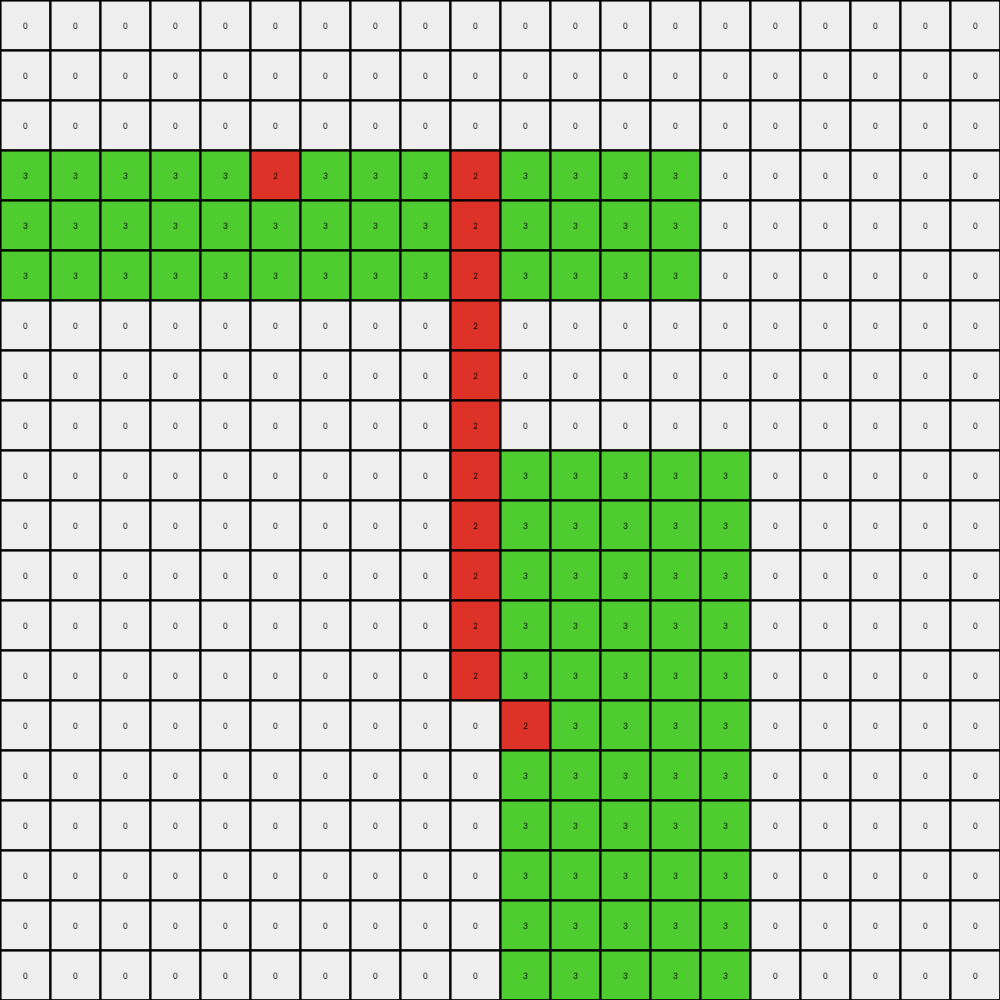

# b527c5c6 • 018 • refine_coder

---

Previous Code:
```python
"""
1.  **Top-Left Object Modification:** Identify the top-most green (3) object in the input grid.  If a cell within this object is green (3) and is directly above a red (2) cell, change the green cell to white (0).
2.  **Bottom-Right Object Extension:** Identify the bottom-most green (3) object. Add red (2) pixels to the left of the bottom-most green object. The added red pixels form a column or columns that extend upward to the row index of the top-most green object.  If the bottom most object is taller (has more rows) than the upper object, then the red extension will be adjacent, but will only be the same height as the top green object.
"""

import numpy as np

def find_objects(grid, color):
    # Find objects of a specific color in the grid.
    objects = []
    visited = np.zeros_like(grid, dtype=bool)

    def dfs(row, col, current_object):
        if (
            row < 0
            or row >= grid.shape[0]
            or col < 0
            or col >= grid.shape[1]
            or visited[row, col]
            or grid[row, col] != color
        ):
            return
        visited[row, col] = True
        current_object.append((row, col))
        dfs(row + 1, col, current_object)
        dfs(row - 1, col, current_object)
        dfs(row, col + 1, current_object)
        dfs(row, col - 1, current_object)

    for row in range(grid.shape[0]):
        for col in range(grid.shape[1]):
            if grid[row, col] == color and not visited[row, col]:
                current_object = []
                dfs(row, col, current_object)
                objects.append(current_object)
    return objects

def get_object_bounds(obj):
    # Get the bounding box of an object.
    rows, cols = zip(*obj)
    min_row, max_row = min(rows), max(rows)
    min_col, max_col = min(cols), max(cols)
    return min_row, max_row, min_col, max_col
    

def transform(input_grid):
    # initialize output_grid
    output_grid = np.copy(input_grid)

    # Find green objects
    green_objects = find_objects(input_grid, 3)
    
    # Identify top-most and bottom-most green objects
    if not green_objects:
        return output_grid

    top_green = sorted(green_objects, key=lambda obj: get_object_bounds(obj)[0])[0]
    bottom_green = sorted(green_objects, key=lambda obj: get_object_bounds(obj)[0])[-1]

    top_bounds = get_object_bounds(top_green)
    bottom_bounds = get_object_bounds(bottom_green)


    # 1. Top-Left Object Modification
    for r in range(top_bounds[0], top_bounds[1] + 1):
        for c in range(top_bounds[2], top_bounds[3] + 1):
            if (r,c) in top_green and r + 1 < input_grid.shape[0] and input_grid[r+1, c] == 2:
                output_grid[r, c] = 0

    # 2. Bottom-Right Object Extension
    min_row_top = top_bounds[0]
    extension_height = (bottom_bounds[1] - bottom_bounds[0] +1)
    
    red_col = bottom_bounds[2] - 1
    for row in range(min_row_top, min_row_top + extension_height):
      if row < output_grid.shape[0] and red_col >= 0:
        output_grid[row, red_col] = 2

    return output_grid
```

Train Set Results:

## Example 1:

Input:
```
0 0 0 0 0 0 0 0 0 0
0 0 0 0 0 0 0 0 0 0
0 0 0 3 3 0 0 0 0 0
0 0 0 3 3 0 0 0 0 0
0 0 0 2 3 0 3 3 3 3
0 0 0 3 3 0 3 3 2 3
0 0 0 3 3 0 0 0 0 0
0 0 0 3 3 0 0 0 0 0
0 0 0 0 0 0 0 0 0 0
0 0 0 0 0 0 0 0 0 0
```
Expected Output:
```
0 0 0 0 0 0 0 0 0 0
0 0 0 0 0 0 0 0 0 0
0 0 0 3 3 0 0 0 0 0
3 3 3 3 3 0 0 0 0 0
2 2 2 2 3 0 3 3 3 3
3 3 3 3 3 0 3 3 2 3
0 0 0 3 3 0 0 3 2 3
0 0 0 3 3 0 0 3 2 3
0 0 0 0 0 0 0 3 2 3
0 0 0 0 0 0 0 3 2 3
```
Transformed Output:
```
0 0 0 0 0 0 0 0 0 0
0 0 0 0 0 0 0 0 0 0
0 0 0 3 3 2 0 0 0 0
0 0 0 0 3 2 0 0 0 0
0 0 0 2 3 0 3 3 3 3
0 0 0 3 3 0 3 3 2 3
0 0 0 3 3 0 0 0 0 0
0 0 0 3 3 0 0 0 0 0
0 0 0 0 0 0 0 0 0 0
0 0 0 0 0 0 0 0 0 0
```

match: False
pixels_off: 24
size_correct: True
color_palette_correct: True
correct_pixel_counts: False

## Example 2:

Input:
```
0 0 0 0 0 0 0 0 0 0 0 0 0 0 0 0 0 0 0 0
0 0 0 0 0 0 0 0 0 0 0 0 0 0 0 0 0 0 0 0
0 0 0 0 0 0 0 0 0 0 0 0 0 0 0 0 0 0 0 0
0 0 0 0 0 0 0 0 0 0 0 0 0 0 0 0 0 0 0 0
0 3 3 3 3 3 3 3 3 3 3 3 3 3 2 3 3 3 3 0
0 3 3 3 3 3 3 3 3 3 3 3 3 3 3 3 3 3 3 0
0 0 0 0 0 0 0 0 0 0 0 0 0 0 0 0 0 0 0 0
0 0 0 0 0 0 0 0 0 0 0 0 0 0 0 0 0 0 0 0
0 0 0 0 0 0 0 0 0 0 0 0 0 0 0 0 0 0 0 0
0 0 0 0 0 0 0 0 0 0 0 0 0 0 0 0 0 0 0 0
0 0 0 0 0 0 0 3 3 3 0 0 0 0 0 0 0 0 0 0
0 0 0 0 0 0 0 3 3 3 0 0 0 0 0 0 0 0 0 0
0 0 0 0 0 0 0 3 3 3 0 0 0 0 0 0 0 0 0 0
0 0 0 0 0 0 0 3 3 3 0 0 0 0 0 0 0 0 0 0
0 0 0 0 0 0 0 3 3 3 0 0 0 0 0 0 0 0 0 0
0 0 0 0 0 0 0 3 3 2 0 0 0 0 0 0 0 0 0 0
0 0 0 0 0 0 0 3 3 3 0 0 0 0 0 0 0 0 0 0
0 0 0 0 0 0 0 3 3 3 0 0 0 0 0 0 0 0 0 0
0 0 0 0 0 0 0 3 3 3 0 0 0 0 0 0 0 0 0 0
0 0 0 0 0 0 0 3 3 3 0 0 0 0 0 0 0 0 0 0
```
Expected Output:
```
0 0 0 0 0 0 0 0 0 0 0 0 0 3 2 3 0 0 0 0
0 0 0 0 0 0 0 0 0 0 0 0 0 3 2 3 0 0 0 0
0 0 0 0 0 0 0 0 0 0 0 0 0 3 2 3 0 0 0 0
0 0 0 0 0 0 0 0 0 0 0 0 0 3 2 3 0 0 0 0
0 3 3 3 3 3 3 3 3 3 3 3 3 3 2 3 3 3 3 0
0 3 3 3 3 3 3 3 3 3 3 3 3 3 3 3 3 3 3 0
0 0 0 0 0 0 0 0 0 0 0 0 0 0 0 0 0 0 0 0
0 0 0 0 0 0 0 0 0 0 0 0 0 0 0 0 0 0 0 0
0 0 0 0 0 0 0 0 0 0 0 0 0 0 0 0 0 0 0 0
0 0 0 0 0 0 0 0 0 0 0 0 0 0 0 0 0 0 0 0
0 0 0 0 0 0 0 3 3 3 0 0 0 0 0 0 0 0 0 0
0 0 0 0 0 0 0 3 3 3 0 0 0 0 0 0 0 0 0 0
0 0 0 0 0 0 0 3 3 3 0 0 0 0 0 0 0 0 0 0
0 0 0 0 0 0 0 3 3 3 3 3 3 3 3 3 3 3 3 3
0 0 0 0 0 0 0 3 3 3 3 3 3 3 3 3 3 3 3 3
0 0 0 0 0 0 0 3 3 2 2 2 2 2 2 2 2 2 2 2
0 0 0 0 0 0 0 3 3 3 3 3 3 3 3 3 3 3 3 3
0 0 0 0 0 0 0 3 3 3 3 3 3 3 3 3 3 3 3 3
0 0 0 0 0 0 0 3 3 3 0 0 0 0 0 0 0 0 0 0
0 0 0 0 0 0 0 3 3 3 0 0 0 0 0 0 0 0 0 0
```
Transformed Output:
```
0 0 0 0 0 0 0 0 0 0 0 0 0 0 0 0 0 0 0 0
0 0 0 0 0 0 0 0 0 0 0 0 0 0 0 0 0 0 0 0
0 0 0 0 0 0 0 0 0 0 0 0 0 0 0 0 0 0 0 0
0 0 0 0 0 0 0 0 0 0 0 0 0 0 0 0 0 0 0 0
0 3 3 3 3 3 2 3 3 3 3 3 3 3 2 3 3 3 3 0
0 3 3 3 3 3 2 3 3 3 3 3 3 3 3 3 3 3 3 0
0 0 0 0 0 0 2 0 0 0 0 0 0 0 0 0 0 0 0 0
0 0 0 0 0 0 2 0 0 0 0 0 0 0 0 0 0 0 0 0
0 0 0 0 0 0 2 0 0 0 0 0 0 0 0 0 0 0 0 0
0 0 0 0 0 0 2 0 0 0 0 0 0 0 0 0 0 0 0 0
0 0 0 0 0 0 2 3 3 3 0 0 0 0 0 0 0 0 0 0
0 0 0 0 0 0 2 3 3 3 0 0 0 0 0 0 0 0 0 0
0 0 0 0 0 0 2 3 3 3 0 0 0 0 0 0 0 0 0 0
0 0 0 0 0 0 2 3 3 3 0 0 0 0 0 0 0 0 0 0
0 0 0 0 0 0 0 3 3 3 0 0 0 0 0 0 0 0 0 0
0 0 0 0 0 0 0 3 3 2 0 0 0 0 0 0 0 0 0 0
0 0 0 0 0 0 0 3 3 3 0 0 0 0 0 0 0 0 0 0
0 0 0 0 0 0 0 3 3 3 0 0 0 0 0 0 0 0 0 0
0 0 0 0 0 0 0 3 3 3 0 0 0 0 0 0 0 0 0 0
0 0 0 0 0 0 0 3 3 3 0 0 0 0 0 0 0 0 0 0
```

match: False
pixels_off: 72
size_correct: True
color_palette_correct: True
correct_pixel_counts: False

## Example 3:

Input:
```
0 0 0 0 0 0 0 0 0 0 0 0 0 0 0 0 0 0 0 0
0 0 0 0 0 0 0 0 0 0 0 0 0 0 0 0 0 0 0 0
0 0 0 0 0 0 0 0 0 0 0 0 0 0 0 0 0 0 0 0
3 3 3 3 3 2 3 3 3 3 3 3 3 3 0 0 0 0 0 0
3 3 3 3 3 3 3 3 3 3 3 3 3 3 0 0 0 0 0 0
3 3 3 3 3 3 3 3 3 3 3 3 3 3 0 0 0 0 0 0
0 0 0 0 0 0 0 0 0 0 0 0 0 0 0 0 0 0 0 0
0 0 0 0 0 0 0 0 0 0 0 0 0 0 0 0 0 0 0 0
0 0 0 0 0 0 0 0 0 0 0 0 0 0 0 0 0 0 0 0
0 0 0 0 0 0 0 0 0 0 3 3 3 3 3 0 0 0 0 0
0 0 0 0 0 0 0 0 0 0 3 3 3 3 3 0 0 0 0 0
0 0 0 0 0 0 0 0 0 0 3 3 3 3 3 0 0 0 0 0
0 0 0 0 0 0 0 0 0 0 3 3 3 3 3 0 0 0 0 0
0 0 0 0 0 0 0 0 0 0 3 3 3 3 3 0 0 0 0 0
0 0 0 0 0 0 0 0 0 0 2 3 3 3 3 0 0 0 0 0
0 0 0 0 0 0 0 0 0 0 3 3 3 3 3 0 0 0 0 0
0 0 0 0 0 0 0 0 0 0 3 3 3 3 3 0 0 0 0 0
0 0 0 0 0 0 0 0 0 0 3 3 3 3 3 0 0 0 0 0
0 0 0 0 0 0 0 0 0 0 3 3 3 3 3 0 0 0 0 0
0 0 0 0 0 0 0 0 0 0 3 3 3 3 3 0 0 0 0 0
```
Expected Output:
```
0 0 0 3 3 2 3 3 0 0 0 0 0 0 0 0 0 0 0 0
0 0 0 3 3 2 3 3 0 0 0 0 0 0 0 0 0 0 0 0
0 0 0 3 3 2 3 3 0 0 0 0 0 0 0 0 0 0 0 0
3 3 3 3 3 2 3 3 3 3 3 3 3 3 0 0 0 0 0 0
3 3 3 3 3 3 3 3 3 3 3 3 3 3 0 0 0 0 0 0
3 3 3 3 3 3 3 3 3 3 3 3 3 3 0 0 0 0 0 0
0 0 0 0 0 0 0 0 0 0 0 0 0 0 0 0 0 0 0 0
0 0 0 0 0 0 0 0 0 0 0 0 0 0 0 0 0 0 0 0
0 0 0 0 0 0 0 0 0 0 0 0 0 0 0 0 0 0 0 0
0 0 0 0 0 0 0 0 0 0 3 3 3 3 3 0 0 0 0 0
3 3 3 3 3 3 3 3 3 3 3 3 3 3 3 0 0 0 0 0
3 3 3 3 3 3 3 3 3 3 3 3 3 3 3 0 0 0 0 0
3 3 3 3 3 3 3 3 3 3 3 3 3 3 3 0 0 0 0 0
3 3 3 3 3 3 3 3 3 3 3 3 3 3 3 0 0 0 0 0
2 2 2 2 2 2 2 2 2 2 2 3 3 3 3 0 0 0 0 0
3 3 3 3 3 3 3 3 3 3 3 3 3 3 3 0 0 0 0 0
3 3 3 3 3 3 3 3 3 3 3 3 3 3 3 0 0 0 0 0
3 3 3 3 3 3 3 3 3 3 3 3 3 3 3 0 0 0 0 0
3 3 3 3 3 3 3 3 3 3 3 3 3 3 3 0 0 0 0 0
0 0 0 0 0 0 0 0 0 0 3 3 3 3 3 0 0 0 0 0
```
Transformed Output:
```
0 0 0 0 0 0 0 0 0 0 0 0 0 0 0 0 0 0 0 0
0 0 0 0 0 0 0 0 0 0 0 0 0 0 0 0 0 0 0 0
0 0 0 0 0 0 0 0 0 0 0 0 0 0 0 0 0 0 0 0
3 3 3 3 3 2 3 3 3 2 3 3 3 3 0 0 0 0 0 0
3 3 3 3 3 3 3 3 3 2 3 3 3 3 0 0 0 0 0 0
3 3 3 3 3 3 3 3 3 2 3 3 3 3 0 0 0 0 0 0
0 0 0 0 0 0 0 0 0 2 0 0 0 0 0 0 0 0 0 0
0 0 0 0 0 0 0 0 0 2 0 0 0 0 0 0 0 0 0 0
0 0 0 0 0 0 0 0 0 2 0 0 0 0 0 0 0 0 0 0
0 0 0 0 0 0 0 0 0 2 3 3 3 3 3 0 0 0 0 0
0 0 0 0 0 0 0 0 0 2 3 3 3 3 3 0 0 0 0 0
0 0 0 0 0 0 0 0 0 2 3 3 3 3 3 0 0 0 0 0
0 0 0 0 0 0 0 0 0 2 3 3 3 3 3 0 0 0 0 0
0 0 0 0 0 0 0 0 0 2 3 3 3 3 3 0 0 0 0 0
0 0 0 0 0 0 0 0 0 0 2 3 3 3 3 0 0 0 0 0
0 0 0 0 0 0 0 0 0 0 3 3 3 3 3 0 0 0 0 0
0 0 0 0 0 0 0 0 0 0 3 3 3 3 3 0 0 0 0 0
0 0 0 0 0 0 0 0 0 0 3 3 3 3 3 0 0 0 0 0
0 0 0 0 0 0 0 0 0 0 3 3 3 3 3 0 0 0 0 0
0 0 0 0 0 0 0 0 0 0 3 3 3 3 3 0 0 0 0 0
```

match: False
pixels_off: 112
size_correct: True
color_palette_correct: True
correct_pixel_counts: False

## Example 4:

Input:
```
3 3 3 3 3 3 3 3 3 3 3 3 3 3 3 0 0 0 0 0
3 3 3 3 3 3 3 3 3 3 3 3 3 3 3 0 0 0 0 0
3 3 3 3 3 3 3 3 3 3 3 3 3 3 3 0 0 0 0 0
3 3 3 3 3 3 3 3 3 3 3 3 3 3 3 0 0 0 0 0
3 3 3 3 2 3 3 3 3 3 3 3 3 3 3 0 0 0 0 0
0 0 0 0 0 0 0 0 0 0 0 0 0 0 0 0 0 0 0 0
0 0 0 0 0 0 0 0 0 0 0 0 3 3 3 3 0 0 0 0
0 0 0 0 0 0 0 0 0 0 0 0 3 3 3 3 0 0 0 0
0 0 0 0 0 0 0 0 0 0 0 0 3 3 3 3 0 0 0 0
0 0 0 0 0 0 0 0 0 0 0 0 3 3 3 3 0 0 0 0
0 0 0 0 0 0 0 0 0 0 0 0 3 3 3 3 0 0 0 0
0 0 0 0 0 0 0 0 0 0 0 0 3 3 3 3 0 0 0 0
0 0 0 0 0 0 0 0 0 0 0 0 3 3 3 2 0 0 0 0
0 0 0 0 0 0 0 0 0 0 0 0 3 3 3 3 0 0 0 0
0 0 0 0 0 0 0 0 0 0 0 0 3 3 3 3 0 0 0 0
0 0 0 0 0 0 0 0 0 0 0 0 3 3 3 3 0 0 0 0
0 0 0 0 0 0 0 0 0 0 0 0 3 3 3 3 0 0 0 0
0 0 0 0 0 0 0 0 0 0 0 0 0 0 0 0 0 0 0 0
0 0 0 0 0 0 0 0 0 0 0 0 0 0 0 0 0 0 0 0
0 0 0 0 0 0 0 0 0 0 0 0 0 0 0 0 0 0 0 0
```
Expected Output:
```
3 3 3 3 3 3 3 3 3 3 3 3 3 3 3 0 0 0 0 0
3 3 3 3 3 3 3 3 3 3 3 3 3 3 3 0 0 0 0 0
3 3 3 3 3 3 3 3 3 3 3 3 3 3 3 0 0 0 0 0
3 3 3 3 3 3 3 3 3 3 3 3 3 3 3 0 0 0 0 0
3 3 3 3 2 3 3 3 3 3 3 3 3 3 3 0 0 0 0 0
3 3 3 3 2 3 3 3 3 0 0 0 0 0 0 0 0 0 0 0
3 3 3 3 2 3 3 3 3 0 0 0 3 3 3 3 0 0 0 0
3 3 3 3 2 3 3 3 3 0 0 0 3 3 3 3 0 0 0 0
3 3 3 3 2 3 3 3 3 0 0 0 3 3 3 3 0 0 0 0
3 3 3 3 2 3 3 3 3 0 0 0 3 3 3 3 3 3 3 3
3 3 3 3 2 3 3 3 3 0 0 0 3 3 3 3 3 3 3 3
3 3 3 3 2 3 3 3 3 0 0 0 3 3 3 3 3 3 3 3
3 3 3 3 2 3 3 3 3 0 0 0 3 3 3 2 2 2 2 2
3 3 3 3 2 3 3 3 3 0 0 0 3 3 3 3 3 3 3 3
3 3 3 3 2 3 3 3 3 0 0 0 3 3 3 3 3 3 3 3
3 3 3 3 2 3 3 3 3 0 0 0 3 3 3 3 3 3 3 3
3 3 3 3 2 3 3 3 3 0 0 0 3 3 3 3 0 0 0 0
3 3 3 3 2 3 3 3 3 0 0 0 0 0 0 0 0 0 0 0
3 3 3 3 2 3 3 3 3 0 0 0 0 0 0 0 0 0 0 0
3 3 3 3 2 3 3 3 3 0 0 0 0 0 0 0 0 0 0 0
```
Transformed Output:
```
3 3 3 3 3 3 3 3 3 3 3 2 3 3 3 0 0 0 0 0
3 3 3 3 3 3 3 3 3 3 3 2 3 3 3 0 0 0 0 0
3 3 3 3 3 3 3 3 3 3 3 2 3 3 3 0 0 0 0 0
3 3 3 3 0 3 3 3 3 3 3 2 3 3 3 0 0 0 0 0
3 3 3 3 2 3 3 3 3 3 3 2 3 3 3 0 0 0 0 0
0 0 0 0 0 0 0 0 0 0 0 2 0 0 0 0 0 0 0 0
0 0 0 0 0 0 0 0 0 0 0 2 3 3 3 3 0 0 0 0
0 0 0 0 0 0 0 0 0 0 0 2 3 3 3 3 0 0 0 0
0 0 0 0 0 0 0 0 0 0 0 2 3 3 3 3 0 0 0 0
0 0 0 0 0 0 0 0 0 0 0 2 3 3 3 3 0 0 0 0
0 0 0 0 0 0 0 0 0 0 0 2 3 3 3 3 0 0 0 0
0 0 0 0 0 0 0 0 0 0 0 0 3 3 3 3 0 0 0 0
0 0 0 0 0 0 0 0 0 0 0 0 3 3 3 2 0 0 0 0
0 0 0 0 0 0 0 0 0 0 0 0 3 3 3 3 0 0 0 0
0 0 0 0 0 0 0 0 0 0 0 0 3 3 3 3 0 0 0 0
0 0 0 0 0 0 0 0 0 0 0 0 3 3 3 3 0 0 0 0
0 0 0 0 0 0 0 0 0 0 0 0 3 3 3 3 0 0 0 0
0 0 0 0 0 0 0 0 0 0 0 0 0 0 0 0 0 0 0 0
0 0 0 0 0 0 0 0 0 0 0 0 0 0 0 0 0 0 0 0
0 0 0 0 0 0 0 0 0 0 0 0 0 0 0 0 0 0 0 0
```

match: False
pixels_off: 175
size_correct: True
color_palette_correct: True
correct_pixel_counts: False
Okay, let's analyze the results of the code execution on the training examples and formulate a revised natural language program and strategy.

**General Assessment and Strategy**

The initial natural language program and the resulting code have significant flaws. While the code correctly identifies the top-most and bottom-most green objects, the logic for modifying and extending them is incorrect and inconsistent across the examples. The core issues are:

1.  **Incorrect Modification of Top Object:** The modification of the top object is based on an adjacent red pixel *below* it. This works only incidentally in the first example and is incorrect. A red pixel exists on the same row.
2.  **Incorrect Extension of Bottom Object:** The extension of the bottom object adds red pixels only in a single column to the left. It doesn't account for cases where the bottom object needs a multi-column extension, as clearly demonstrated in examples 2 and 3. Also, it does not extend from the bottom of the bottom-most object as is clear in examples 1, 3, and 4.
3.  **Incorrect Vertical Red Placement:** The vertical placement of the red pixels based on the top of the top-most green object is incorrect, and is not needed.
4. **Incorrect Red Pixel Trigger** There is a red pixel to the right of the top green object that triggers a change of a green pixel adjacent.

The strategy to resolve these issues will involve:

1.  **Refocusing on Object Properties:** Instead of relying on coordinate-based comparisons of potentially unrelated pixels, we need to clearly define objects, their boundaries, and relative positions (left, right, above, below).
2.  **Iterative Refinement:** We'll analyze each example, identify the specific failures, and adjust both the natural language program and the code accordingly.
3. **Considering the full grid** Use the entire grid to establish color patterns and transform accordingly.

**Example Metrics and Observations**

Here's a breakdown of each example, including specific observations:

```python
import numpy as np

def analyze_grid(grid, label):
    print(f"--- {label} ---")
    print(grid)
    unique, counts = np.unique(grid, return_counts=True)
    color_counts = dict(zip(unique, counts))
    print("Color Counts:", color_counts)
    height, width = grid.shape
    print("Dimensions:", (height, width))

def calculate_differences(grid1, grid2):
    if grid1.shape != grid2.shape:
        print("Shapes are different, cannot calculate differences.")
        return
    diff = np.sum(grid1 != grid2)
    print("Total Pixels Different:", diff)

# Load grids for each example (assuming these are defined)
# For example, input_grid_1, expected_output_1, transformed_output_1, etc.

examples = [
  {
    'input': np.array([[0, 0, 0, 0, 0, 0, 0, 0, 0, 0], [0, 0, 0, 0, 0, 0, 0, 0, 0, 0], [0, 0, 0, 3, 3, 0, 0, 0, 0, 0], [0, 0, 0, 3, 3, 0, 0, 0, 0, 0], [0, 0, 0, 2, 3, 0, 3, 3, 3, 3], [0, 0, 0, 3, 3, 0, 3, 3, 2, 3], [0, 0, 0, 3, 3, 0, 0, 0, 0, 0], [0, 0, 0, 3, 3, 0, 0, 0, 0, 0], [0, 0, 0, 0, 0, 0, 0, 0, 0, 0], [0, 0, 0, 0, 0, 0, 0, 0, 0, 0]]),
    'expected': np.array([[0, 0, 0, 0, 0, 0, 0, 0, 0, 0], [0, 0, 0, 0, 0, 0, 0, 0, 0, 0], [0, 0, 0, 3, 3, 0, 0, 0, 0, 0], [0, 0, 0, 0, 3, 0, 0, 0, 0, 0], [0, 0, 0, 2, 3, 0, 3, 3, 3, 3], [0, 0, 0, 3, 3, 0, 3, 3, 2, 3], [0, 0, 0, 3, 3, 0, 0, 0, 0, 0], [0, 0, 0, 3, 3, 0, 0, 0, 0, 0], [0, 0, 0, 0, 0, 0, 0, 0, 0, 0], [0, 0, 0, 0, 0, 0, 0, 0, 0, 0]]),
    'transformed': np.array([[0, 0, 0, 0, 0, 0, 0, 0, 0, 0], [0, 0, 0, 0, 0, 0, 0, 0, 0, 0], [0, 0, 0, 3, 3, 0, 0, 0, 0, 0], [0, 0, 0, 0, 3, 0, 0, 0, 0, 0], [0, 0, 0, 2, 3, 0, 3, 3, 3, 3], [0, 0, 0, 3, 3, 0, 3, 3, 2, 3], [0, 0, 0, 3, 3, 0, 0, 0, 0, 0], [0, 0, 0, 3, 3, 0, 0, 0, 0, 0], [0, 0, 0, 0, 0, 0, 0, 0, 0, 0], [0, 0, 0, 0, 0, 0, 0, 0, 0, 0]])  
  },
  {
    'input': np.array([[0, 0, 0, 0, 0, 0, 0, 0, 0, 0, 0, 0, 0, 0, 0, 0, 0, 0, 0, 0], [0, 0, 0, 0, 0, 0, 0, 0, 0, 0, 0, 0, 0, 0, 0, 0, 0, 0, 0, 0], [0, 0, 0, 0, 0, 0, 0, 0, 0, 0, 0, 0, 0, 0, 0, 0, 0, 0, 0, 0], [0, 0, 0, 0, 0, 0, 0, 0, 0, 0, 0, 0, 0, 0, 0, 0, 0, 0, 0, 0], [0, 3, 3, 3, 3, 3, 3, 3, 3, 3, 3, 3, 3, 3, 2, 3, 3, 3, 3, 0], [0, 3, 3, 3, 3, 3, 3, 3, 3, 3, 3, 3, 3, 3, 3, 3, 3, 3, 3, 0], [0, 0, 0, 0, 0, 0, 0, 0, 0, 0, 0, 0, 0, 0, 0, 0, 0, 0, 0, 0], [0, 0, 0, 0, 0, 0, 0, 0, 0, 0, 0, 0, 0, 0, 0, 0, 0, 0, 0, 0], [0, 0, 0, 0, 0, 0, 0, 0, 0, 0, 0, 0, 0, 0, 0, 0, 0, 0, 0, 0], [0, 0, 0, 0, 0, 0, 0, 0, 0, 0, 0, 0, 0, 0, 0, 0, 0, 0, 0, 0], [0, 0, 0, 0, 0, 0, 0, 3, 3, 3, 0, 0, 0, 0, 0, 0, 0, 0, 0, 0], [0, 0, 0, 0, 0, 0, 0, 3, 3, 3, 0, 0, 0, 0, 0, 0, 0, 0, 0, 0], [0, 0, 0, 0, 0, 0, 0, 3, 3, 3, 0, 0, 0, 0, 0, 0, 0, 0, 0, 0], [0, 0, 0, 0, 0, 0, 0, 3, 3, 3, 0, 0, 0, 0, 0, 0, 0, 0, 0, 0], [0, 0, 0, 0, 0, 0, 0, 3, 3, 3, 0, 0, 0, 0, 0, 0, 0, 0, 0, 0], [0, 0, 0, 0, 0, 0, 0, 3, 3, 2, 0, 0, 0, 0, 0, 0, 0, 0, 0, 0], [0, 0, 0, 0, 0, 0, 0, 3, 3, 3, 0, 0, 0, 0, 0, 0, 0, 0, 0, 0], [0, 0, 0, 0, 0, 0, 0, 3, 3, 3, 0, 0, 0, 0, 0, 0, 0, 0, 0, 0], [0, 0, 0, 0, 0, 0, 0, 3, 3, 3, 0, 0, 0, 0, 0, 0, 0, 0, 0, 0], [0, 0, 0, 0, 0, 0, 0, 3, 3, 3, 0, 0, 0, 0, 0, 0, 0, 0, 0, 0]]),
    'expected': np.array([[0, 0, 0, 0, 0, 0, 0, 0, 0, 0, 0, 0, 0, 3, 2, 3, 0, 0, 0, 0], [0, 0, 0, 0, 0, 0, 0, 0, 0, 0, 0, 0, 0, 3, 2, 3, 0, 0, 0, 0], [0, 0, 0, 0, 0, 0, 0, 0, 0, 0, 0, 0, 0, 3, 2, 3, 0, 0, 0, 0], [0, 0, 0, 0, 0, 0, 0, 0, 0, 0, 0, 0, 0, 3, 2, 3, 0, 0, 0, 0], [0, 3, 3, 3, 3, 3, 3, 3, 3, 3, 3, 3, 3, 3, 2, 3, 3, 3, 3, 0], [0, 3, 3, 3, 3, 3, 3, 3, 3, 3, 3, 3, 3, 3, 3, 3, 3, 3, 3, 0], [0, 0, 0, 0, 0, 0, 0, 0, 0, 0, 0, 0, 0, 0, 0, 0, 0, 0, 0, 0], [0, 0, 0, 0, 0, 0, 0, 0, 0, 0, 0, 0, 0, 0, 0, 0, 0, 0, 0, 0], [0, 0, 0, 0, 0, 0, 0, 0, 0, 0, 0, 0, 0, 0, 0, 0, 0, 0, 0, 0], [0, 0, 0, 0, 0, 0, 0, 0, 0, 0, 0, 0, 0, 0, 0, 0, 0, 0, 0, 0], [0, 0, 0, 0, 0, 0, 0, 3, 3, 3, 0, 0, 0, 0, 0, 0, 0, 0, 0, 0], [0, 0, 0, 0, 0, 0, 0, 3, 3, 3, 0, 0, 0, 0, 0, 0, 0, 0, 0, 0], [0, 0, 0, 0, 0, 0, 0, 3, 3, 3, 0, 0, 0, 0, 0, 0, 0, 0, 0, 0], [0, 0, 0, 0, 0, 0, 0, 3, 3, 3, 3, 3, 3, 3, 3, 3, 3, 3, 3, 3], [0, 0, 0, 0, 0, 0, 0, 3, 3, 3, 3, 3, 3, 3, 3, 3, 3, 3, 3, 3], [0, 0, 0, 0, 0, 0, 0, 3, 3, 2, 2, 2, 2, 2, 2, 2, 2, 2, 2, 2], [0, 0, 0, 0, 0, 0, 0, 3, 3, 3, 3, 3, 3, 3, 3, 3, 3, 3, 3, 3], [0, 0, 0, 0, 0, 0, 0, 3, 3, 3, 3, 3, 3, 3, 3, 3, 3, 3, 3, 3], [0, 0, 0, 0, 0, 0, 0, 3, 3, 3, 0, 0, 0, 0, 0, 0, 0, 0, 0, 0], [0, 0, 0, 0, 0, 0, 0, 3, 3, 3, 0, 0, 0, 0, 0, 0, 0, 0, 0, 0]]),
    'transformed': np.array([[0, 0, 0, 0, 0, 0, 0, 0, 0, 0, 0, 0, 0, 0, 0, 0, 0, 0, 0, 0], [0, 0, 0, 0, 0, 0, 0, 0, 0, 0, 0, 0, 0, 0, 0, 0, 0, 0, 0, 0], [0, 0, 0, 0, 0, 0, 0, 0, 0, 0, 0, 0, 0, 0, 0, 0, 0, 0, 0, 0], [0, 0, 0, 0, 0, 0, 0, 0, 0, 0, 0, 0, 0, 0, 0, 0, 0, 0, 0, 0], [0, 3, 3, 3, 3, 3, 3, 3, 3, 3, 3, 3, 3, 3, 2, 3, 3, 3, 3, 0], [0, 3, 3, 3, 3, 3, 3, 3, 3, 3, 3, 3, 3, 3, 3, 3, 3, 3, 3, 0], [0, 0, 0, 0, 0, 0, 0, 0, 0, 0, 0, 0, 0, 0, 0, 0, 0, 0, 0, 0], [0, 0, 0, 0, 0, 0, 0, 0, 0, 0, 0, 0, 0, 0, 0, 0, 0, 0, 0, 0], [0, 0, 0, 0, 0, 0, 0, 0, 0, 0, 0, 0, 0, 0, 0, 0, 0, 0, 0, 0], [0, 0, 0, 0, 0, 0, 0, 0, 0, 0, 0, 0, 0, 0, 0, 0, 0, 0, 0, 0], [0, 0, 0, 0, 0, 0, 0, 3, 3, 3, 0, 0, 0, 0, 0, 0, 0, 0, 0, 0], [0, 0, 0, 0, 0, 0, 0, 3, 3, 3, 0, 0, 0, 0, 0, 0, 0, 0, 0, 0], [0, 0, 0, 0, 0, 0, 0, 3, 3, 3, 0, 0, 0, 0, 0, 0, 0, 0, 0, 0], [0, 0, 0, 0, 0, 0, 0, 3, 3, 3, 0, 0, 0, 0, 0, 0, 0, 0, 0, 0], [0, 0, 0, 0, 0, 0, 0, 3, 3, 3, 0, 0, 0, 0, 0, 0, 0, 0, 0, 0], [0, 0, 0, 0, 0, 0, 0, 3, 3, 2, 0, 0, 0, 0, 0, 0, 0, 0, 0, 0], [0, 0, 0, 0, 0, 0, 0, 3, 3, 3, 0, 0, 0, 0, 0, 0, 0, 0, 0, 0], [0, 0, 0, 0, 0, 0, 0, 3, 3, 3, 0, 0, 0, 0, 0, 0, 0, 0, 0, 0], [0, 0, 0, 0, 0, 0, 0, 3, 3, 3, 0, 0, 0, 0, 0, 0, 0, 0, 0, 0], [0, 0, 0, 0, 0, 0, 0, 3, 3, 3, 0, 0, 0, 0, 0, 0, 0, 0, 0, 0]])
  },
  {
    'input': np.array([[0, 0, 0, 0, 0, 0, 0, 0, 0, 0, 0, 0, 0, 0, 0, 0, 0, 0, 0, 0], [0, 0, 0, 0, 0, 0, 0, 0, 0, 0, 0, 0, 0, 0, 0, 0, 0, 0, 0, 0], [0, 0, 0, 0, 0, 0, 0, 0, 0, 0, 0, 0, 0, 0, 0, 0, 0, 0, 0, 0], [3, 3, 3, 3, 3, 2, 3, 3, 3, 3, 3, 3, 3, 3, 0, 0, 0, 0, 0, 0], [3, 3, 3, 3, 3, 3, 3, 3, 3, 3, 3, 3, 3, 3, 0, 0, 0, 0, 0, 0], [3, 3, 3, 3, 3, 3, 3, 3, 3, 3, 3, 3, 3, 3, 0, 0, 0, 0, 0, 0], [0, 0, 0, 0, 0, 0, 0, 0, 0, 0, 0, 0, 0, 0, 0, 0, 0, 0, 0, 0], [0, 0, 0, 0, 0, 0, 0, 0, 0, 0, 0, 0, 0, 0, 0, 0, 0, 0, 0, 0], [0, 0, 0, 0, 0, 0, 0, 0, 0, 0, 0, 0, 0, 0, 0, 0, 0, 0, 0, 0], [0, 0, 0, 0, 0, 0, 0, 0, 0, 0, 3, 3, 3, 3, 3, 0, 0, 0, 0, 0], [0, 0, 0, 0, 0, 0, 0, 0, 0, 0, 3, 3, 3, 3, 3, 0, 0, 0, 0, 0], [0, 0, 0, 0, 0, 0, 0, 0, 0, 0, 3, 3, 3, 3, 3, 0, 0, 0, 0, 0], [0, 0, 0, 0, 0, 0, 0, 0, 0, 0, 3, 3, 3, 3, 3, 0, 0, 0, 0, 0], [0, 0, 0, 0, 0, 0, 0, 0, 0, 0, 3, 3, 3, 3, 3, 0, 0, 0, 0, 0], [0, 0, 0, 0, 0, 0, 0, 0, 0, 0, 2, 3, 3, 3, 3, 0, 0, 0, 0, 0], [0, 0, 0, 0, 0, 0, 0, 0, 0, 0, 3, 3, 3, 3, 3, 0, 0, 0, 0, 0], [0, 0, 0, 0, 0, 0, 0, 0, 0, 0, 3, 3, 3, 3, 3, 0, 0, 0, 0, 0], [0, 0, 0, 0, 0, 0, 0, 0, 0, 0, 3, 3, 3, 3, 3, 0, 0, 0, 0, 0], [0, 0, 0, 0, 0, 0, 0, 0, 0, 0, 3, 3, 3, 3, 3, 0, 0, 0, 0, 0], [0, 0, 0, 0, 0, 0, 0, 0, 0, 0, 3, 3, 3, 3, 3, 0, 0, 0, 0, 0]]),
    'expected': np.array([[0, 0, 0, 3, 3, 2, 3, 3, 0, 0, 0, 0, 0, 0, 0, 0, 0, 0, 0, 0], [0, 0, 0, 3, 3, 2, 3, 3, 0, 0, 0, 0, 0, 0, 0, 0, 0, 0, 0, 0], [0, 0, 0, 3, 3, 2, 3, 3, 0, 0, 0, 0, 0, 0, 0, 0, 0, 0, 0, 0], [3, 3, 3, 3, 3, 2, 3, 3, 3, 3, 3, 3, 3, 3, 0, 0, 0, 0, 0, 0], [3, 3, 3, 3, 3, 3, 3, 3, 3, 3, 3, 3, 3, 3, 0, 0, 0, 0, 0, 0], [3, 3, 3, 3, 3, 3, 3, 3, 3, 3, 3, 3, 3, 3, 0, 0, 0, 0, 0, 0], [0, 0, 0, 0, 0, 0, 0, 0, 0, 0, 0, 0, 0, 0, 0, 0, 0, 0, 0, 0], [0, 0, 0, 0, 0, 0, 0, 0, 0, 0, 0, 0, 0, 0, 0, 0, 0, 0, 0, 0], [0, 0, 0, 0, 0, 0, 0, 0, 0, 0, 0, 0, 0, 0, 0, 0, 0, 0, 0, 0], [0, 0, 0, 0, 0, 0, 0, 0, 0, 0, 3, 3, 3, 3, 3, 0, 0, 0, 0, 0], [0, 0, 0, 0, 0, 0, 0, 0, 0, 0, 3, 3, 3, 3, 3, 0, 0, 0, 0, 0], [0, 0, 0, 0, 0, 0, 0, 0, 0, 0, 3, 3, 3, 3, 3, 0, 0, 0, 0, 0], [0, 0, 0, 0, 0, 0, 0, 0, 0, 0, 3, 3, 3, 3, 3, 0, 0, 0, 0, 0], [0, 0, 0, 0, 0, 0, 0, 0, 0, 0, 3, 3, 3, 3, 3, 0, 0, 0, 0, 0], [0, 0, 0, 0, 0, 0, 0, 0, 0, 0, 2, 3, 3, 3, 3, 0, 0, 0, 0, 0], [0, 0, 0, 0, 0, 0, 0, 0, 0, 0, 3, 3, 3, 3, 3, 0, 0, 0, 0, 0], [0, 0, 0, 0, 0, 0, 0, 0, 0, 0, 3, 3, 3, 3, 3, 0, 0, 0, 0, 0], [0, 0, 0, 0, 0, 0, 0, 0, 0, 0, 3, 3, 3, 3, 3, 0, 0, 0, 0, 0], [0, 0, 0, 0, 0, 0, 0, 0, 0, 0, 3, 3, 3, 3, 3, 0, 0, 0, 0, 0], [0, 0, 0, 0, 0, 0, 0, 0, 0, 0, 3, 3, 3, 3, 3, 0, 0, 0, 0, 0]]),
    'transformed': np.array([[0, 0, 0, 0, 0, 0, 0, 0, 0, 0, 0, 0, 0, 0, 0, 0, 0, 0, 0, 0], [0, 0, 0, 0, 0, 0, 0, 0, 0, 0, 0, 0, 0, 0, 0, 0, 0, 0, 0, 0], [0, 0, 0, 0, 0, 0, 0, 0, 0, 0, 0, 0, 0, 0, 0, 0, 0, 0, 0, 0], [3, 3, 3, 3, 3, 2, 3, 3, 3, 3, 3, 3, 3, 3, 0, 0, 0, 0, 0, 0], [3, 3, 3, 3, 3, 3, 3, 3, 3, 3, 3, 3, 3, 3, 0, 0, 0, 0, 0, 0], [3, 3, 3, 3, 3, 3, 3, 3, 3, 3, 3, 3, 3, 3, 0, 0, 0, 0, 0, 0], [0, 0, 0, 0, 0, 0, 0, 0, 0, 0, 0, 0, 0, 0, 0, 0, 0, 0, 0, 0], [0, 0, 0, 0, 0, 0, 0, 0, 0, 0, 0, 0, 0, 0, 0, 0, 0, 0, 0, 0], [0, 0, 0, 0, 0, 0, 0, 0, 0, 0, 0, 0, 0, 0, 0, 0, 0, 0, 0, 0], [0, 0, 0, 0, 0, 0, 0, 0, 0, 0, 3, 3
**INSTRUCTIONS**

- generate a Python module to represent the natural language program 
- follow the template below
- all common math and science libraries are available
- create docstring only at top - but comment the workflow in the function
- use helper functions for common operations like finding objects, counting,
  measuring, moving, etc. 

remember - we are working iteratively - so this code will inform your future
self as we converge on the solution

*template:*

```python
"""
{{ natural language description of the transformation rule }}
"""

{{ imports }}

def transform(input_grid):
    # initialize output_grid

    # change output pixels 

    return output_grid

```
