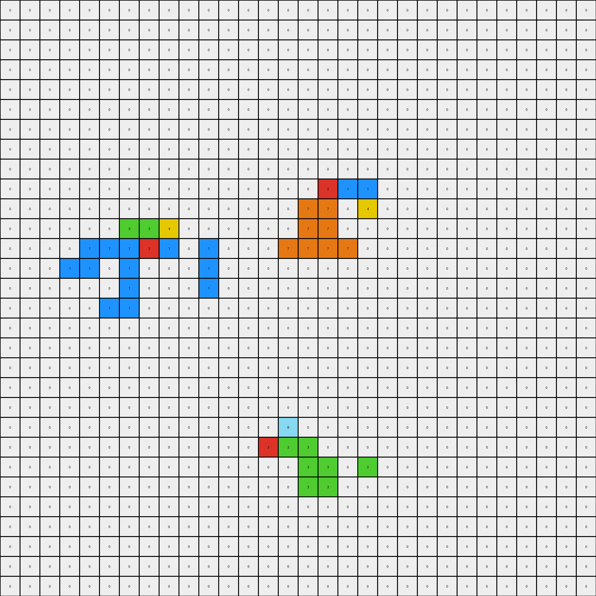
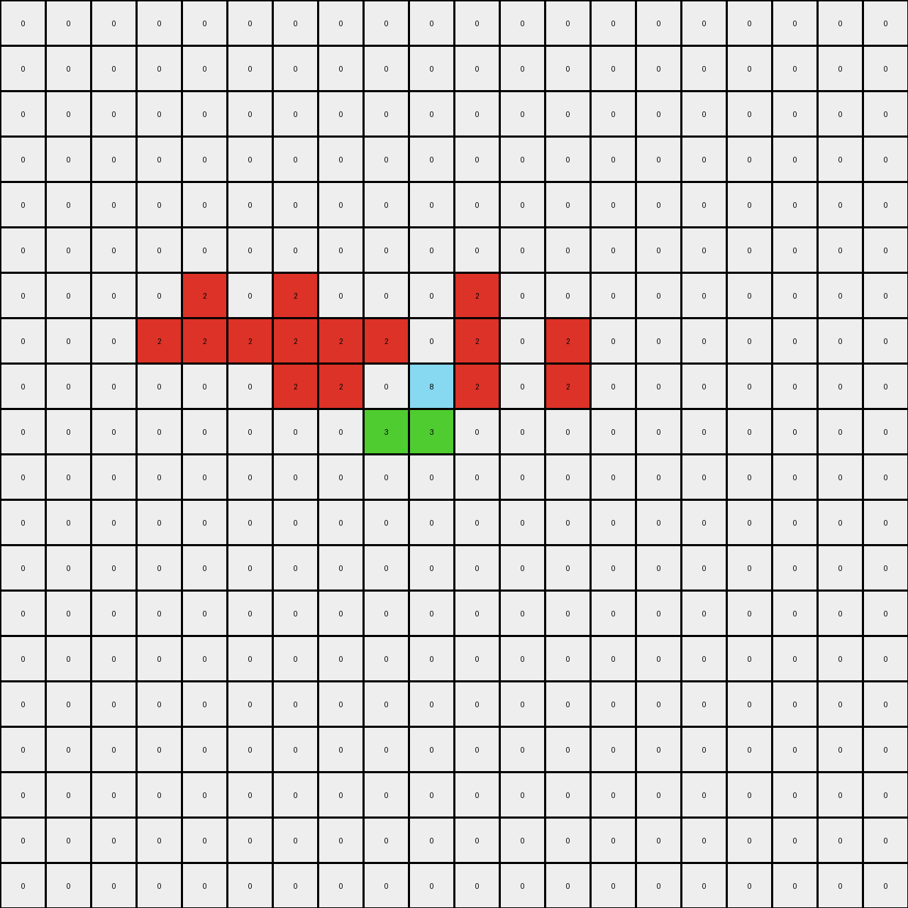
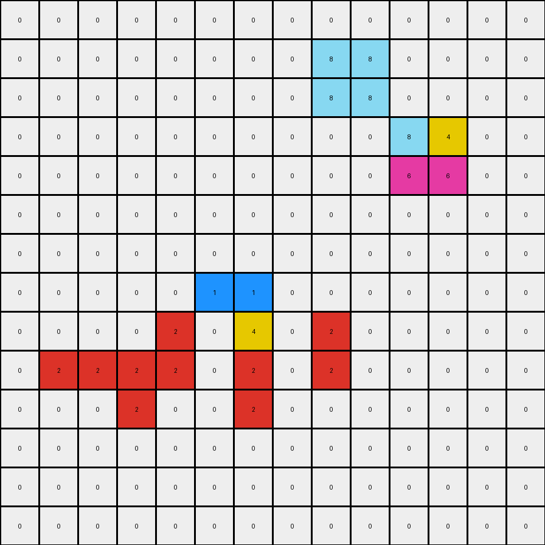

# b775ac94 • 016 • refine_coder

---

Previous Code:
```python
"""
Duplicates and expands colored objects in a grid, with exceptions of shifting for yellow and azure objects.
"""

import numpy as np

def find_objects(grid):
    """
    Finds all contiguous colored regions (objects) in the grid.
    Returns a dictionary where keys are colors and values are lists of (row, col) coordinates.
    """
    objects = {}
    visited = set()
    rows, cols = grid.shape

    def dfs(row, col, color, obj_coords):
        if (row, col) in visited or row < 0 or row >= rows or col < 0 or col >= cols or grid[row, col] != color:
            return
        visited.add((row, col))
        obj_coords.append((row, col))
        dfs(row + 1, col, color, obj_coords)
        dfs(row - 1, col, color, obj_coords)
        dfs(row, col + 1, color, obj_coords)
        dfs(row, col - 1, color, obj_coords)

    for row in range(rows):
        for col in range(cols):
            color = grid[row, col]
            if color != 0 and (row, col) not in visited:
                obj_coords = []
                dfs(row, col, color, obj_coords)
                if color not in objects:
                    objects[color] = []
                objects[color].append(obj_coords)
    return objects


def transform(input_grid):
    # Initialize output grid with the same dimensions and background color
    output_grid = np.zeros_like(input_grid)
    rows, cols = input_grid.shape

   # Find all objects in the input grid
    objects = find_objects(input_grid)

    # Process each object based on its color
    for color, obj_list in objects.items():
        for obj_coords in obj_list:
            if color == 4:  # Yellow object
                #shift yellow right
                for r, c in obj_coords:
                    output_grid[r,min(cols-1,c+1)] = 4

                # check if 1-cell or L-shape to see if expand
                if len(obj_coords) == 4:
                    coords = np.array(obj_coords)
                    min_row, min_col = np.min(coords, axis=0)
                    max_row, max_col = np.max(coords, axis=0)
                    
                    #check if L
                    is_l_shape = (max_row - min_row == 1) and (max_col - min_col == 1)

                    if is_l_shape:
                        for r, c in obj_coords:
                            if r == min_row or c == max_col:
                                output_grid[r,min(cols-1,c+2)] = 4

            elif color == 8: #azure object
                #shift azure right
                for r, c in obj_coords:
                    output_grid[r,min(cols-1,c+1)] = 8

            else: #other objects
                # Duplicate and expand other colored objects
                for r, c in obj_coords:
                    output_grid[r, c] = color
                    output_grid[r, min(cols-1,c + (c - min([c_ for _, c_ in obj_coords]) + 1))] = color #expand

    return output_grid
```

Train Set Results:

## Example 1:

Input:
```
0 0 0 0 0 0 0 0 0 0 0 0 0 0 0 0 0 0 0 0 0 0 0 0 0 0 0 0 0 0
0 0 0 0 0 0 0 0 0 0 0 0 0 0 0 0 0 0 0 0 0 0 0 0 0 0 0 0 0 0
0 0 0 0 0 0 0 0 0 0 0 0 0 0 0 0 0 0 0 0 0 0 0 0 0 0 0 0 0 0
0 0 0 0 0 0 0 0 0 0 0 0 0 0 0 0 0 0 0 0 0 0 0 0 0 0 0 0 0 0
0 0 0 0 0 0 0 0 0 0 0 0 0 0 0 0 0 0 0 0 0 0 0 0 0 0 0 0 0 0
0 0 0 0 0 0 0 0 0 0 0 0 0 0 0 0 0 0 0 0 0 0 0 0 0 0 0 0 0 0
0 0 0 0 0 0 0 0 0 0 0 0 0 0 0 0 0 0 0 0 0 0 0 0 0 0 0 0 0 0
0 0 0 0 0 0 0 0 0 0 0 0 0 0 0 0 0 0 0 0 0 0 0 0 0 0 0 0 0 0
0 0 0 0 0 0 0 0 0 0 0 0 0 0 0 0 0 0 0 0 0 0 0 0 0 0 0 0 0 0
0 0 0 0 0 0 0 0 0 0 0 0 0 0 0 0 2 1 0 0 0 0 0 0 0 0 0 0 0 0
0 0 0 0 0 0 0 0 0 0 0 0 0 0 0 7 7 4 0 0 0 0 0 0 0 0 0 0 0 0
0 0 0 0 0 0 3 4 0 0 0 0 0 0 0 7 0 0 0 0 0 0 0 0 0 0 0 0 0 0
0 0 0 0 1 1 1 2 0 0 0 0 0 0 7 0 7 0 0 0 0 0 0 0 0 0 0 0 0 0
0 0 0 1 1 0 1 0 0 0 0 0 0 0 0 0 0 0 0 0 0 0 0 0 0 0 0 0 0 0
0 0 0 0 0 0 1 0 0 0 0 0 0 0 0 0 0 0 0 0 0 0 0 0 0 0 0 0 0 0
0 0 0 0 0 1 0 0 0 0 0 0 0 0 0 0 0 0 0 0 0 0 0 0 0 0 0 0 0 0
0 0 0 0 0 0 0 0 0 0 0 0 0 0 0 0 0 0 0 0 0 0 0 0 0 0 0 0 0 0
0 0 0 0 0 0 0 0 0 0 0 0 0 0 0 0 0 0 0 0 0 0 0 0 0 0 0 0 0 0
0 0 0 0 0 0 0 0 0 0 0 0 0 0 0 0 0 0 0 0 0 0 0 0 0 0 0 0 0 0
0 0 0 0 0 0 0 0 0 0 0 0 0 0 0 0 0 0 0 0 0 0 0 0 0 0 0 0 0 0
0 0 0 0 0 0 0 0 0 0 0 0 0 0 0 0 0 0 0 0 0 0 0 0 0 0 0 0 0 0
0 0 0 0 0 0 0 0 0 0 0 0 0 8 0 0 0 0 0 0 0 0 0 0 0 0 0 0 0 0
0 0 0 0 0 0 0 0 0 0 0 0 0 2 3 0 0 0 0 0 0 0 0 0 0 0 0 0 0 0
0 0 0 0 0 0 0 0 0 0 0 0 0 0 0 3 3 0 0 0 0 0 0 0 0 0 0 0 0 0
0 0 0 0 0 0 0 0 0 0 0 0 0 0 0 3 0 0 0 0 0 0 0 0 0 0 0 0 0 0
0 0 0 0 0 0 0 0 0 0 0 0 0 0 0 0 0 0 0 0 0 0 0 0 0 0 0 0 0 0
0 0 0 0 0 0 0 0 0 0 0 0 0 0 0 0 0 0 0 0 0 0 0 0 0 0 0 0 0 0
0 0 0 0 0 0 0 0 0 0 0 0 0 0 0 0 0 0 0 0 0 0 0 0 0 0 0 0 0 0
0 0 0 0 0 0 0 0 0 0 0 0 0 0 0 0 0 0 0 0 0 0 0 0 0 0 0 0 0 0
0 0 0 0 0 0 0 0 0 0 0 0 0 0 0 0 0 0 0 0 0 0 0 0 0 0 0 0 0 0
```
Expected Output:
```
0 0 0 0 0 0 0 0 0 0 0 0 0 0 0 0 0 0 0 0 0 0 0 0 0 0 0 0 0 0
0 0 0 0 0 0 0 0 0 0 0 0 0 0 0 0 0 0 0 0 0 0 0 0 0 0 0 0 0 0
0 0 0 0 0 0 0 0 0 0 0 0 0 0 0 0 0 0 0 0 0 0 0 0 0 0 0 0 0 0
0 0 0 0 0 0 0 0 0 0 0 0 0 0 0 0 0 0 0 0 0 0 0 0 0 0 0 0 0 0
0 0 0 0 0 0 0 0 0 0 0 0 0 0 0 0 0 0 0 0 0 0 0 0 0 0 0 0 0 0
0 0 0 0 0 0 0 0 0 0 0 0 0 0 0 0 0 0 0 0 0 0 0 0 0 0 0 0 0 0
0 0 0 0 0 0 0 0 0 0 0 0 0 0 0 0 0 0 0 0 0 0 0 0 0 0 0 0 0 0
0 0 0 0 0 0 0 0 0 0 0 0 0 0 2 0 2 1 0 1 0 0 0 0 0 0 0 0 0 0
0 0 0 0 0 3 0 0 4 0 0 0 0 0 0 2 0 0 1 0 0 0 0 0 0 0 0 0 0 0
0 0 0 0 0 0 3 4 0 0 0 0 0 0 0 2 2 1 1 0 0 0 0 0 0 0 0 0 0 0
0 0 0 3 3 0 3 4 0 4 4 0 0 0 0 7 7 4 4 0 0 0 0 0 0 0 0 0 0 0
0 0 0 0 3 3 3 4 4 4 0 0 0 0 0 7 0 0 4 0 0 0 0 0 0 0 0 0 0 0
0 0 0 0 1 1 1 2 2 2 0 0 0 0 7 0 7 4 0 4 0 0 0 0 0 0 0 0 0 0
0 0 0 1 1 0 1 2 0 2 2 0 0 0 0 0 0 0 0 0 0 0 0 0 0 0 0 0 0 0
0 0 0 0 0 0 1 2 0 0 0 0 0 0 0 0 0 0 0 0 0 0 0 0 0 0 0 0 0 0
0 0 0 0 0 1 0 0 2 0 0 0 0 0 0 0 0 0 0 0 0 0 0 0 0 0 0 0 0 0
0 0 0 0 0 0 0 0 0 0 0 0 0 0 0 0 0 0 0 0 0 0 0 0 0 0 0 0 0 0
0 0 0 0 0 0 0 0 0 0 0 0 0 0 0 0 0 0 0 0 0 0 0 0 0 0 0 0 0 0
0 0 0 0 0 0 0 0 0 0 0 0 0 0 0 0 0 0 0 0 0 0 0 0 0 0 0 0 0 0
0 0 0 0 0 0 0 0 0 0 0 0 8 0 0 0 0 0 0 0 0 0 0 0 0 0 0 0 0 0
0 0 0 0 0 0 0 0 0 0 0 8 8 0 0 0 0 0 0 0 0 0 0 0 0 0 0 0 0 0
0 0 0 0 0 0 0 0 0 0 0 0 0 8 0 0 0 0 0 0 0 0 0 0 0 0 0 0 0 0
0 0 0 0 0 0 0 0 0 0 0 0 0 2 3 0 0 0 0 0 0 0 0 0 0 0 0 0 0 0
0 0 0 0 0 0 0 0 0 0 0 2 2 0 0 3 3 0 0 0 0 0 0 0 0 0 0 0 0 0
0 0 0 0 0 0 0 0 0 0 0 0 2 0 0 3 0 0 0 0 0 0 0 0 0 0 0 0 0 0
0 0 0 0 0 0 0 0 0 0 0 0 0 0 0 0 0 0 0 0 0 0 0 0 0 0 0 0 0 0
0 0 0 0 0 0 0 0 0 0 0 0 0 0 0 0 0 0 0 0 0 0 0 0 0 0 0 0 0 0
0 0 0 0 0 0 0 0 0 0 0 0 0 0 0 0 0 0 0 0 0 0 0 0 0 0 0 0 0 0
0 0 0 0 0 0 0 0 0 0 0 0 0 0 0 0 0 0 0 0 0 0 0 0 0 0 0 0 0 0
0 0 0 0 0 0 0 0 0 0 0 0 0 0 0 0 0 0 0 0 0 0 0 0 0 0 0 0 0 0
```
Transformed Output:
```
0 0 0 0 0 0 0 0 0 0 0 0 0 0 0 0 0 0 0 0 0 0 0 0 0 0 0 0 0 0
0 0 0 0 0 0 0 0 0 0 0 0 0 0 0 0 0 0 0 0 0 0 0 0 0 0 0 0 0 0
0 0 0 0 0 0 0 0 0 0 0 0 0 0 0 0 0 0 0 0 0 0 0 0 0 0 0 0 0 0
0 0 0 0 0 0 0 0 0 0 0 0 0 0 0 0 0 0 0 0 0 0 0 0 0 0 0 0 0 0
0 0 0 0 0 0 0 0 0 0 0 0 0 0 0 0 0 0 0 0 0 0 0 0 0 0 0 0 0 0
0 0 0 0 0 0 0 0 0 0 0 0 0 0 0 0 0 0 0 0 0 0 0 0 0 0 0 0 0 0
0 0 0 0 0 0 0 0 0 0 0 0 0 0 0 0 0 0 0 0 0 0 0 0 0 0 0 0 0 0
0 0 0 0 0 0 0 0 0 0 0 0 0 0 0 0 0 0 0 0 0 0 0 0 0 0 0 0 0 0
0 0 0 0 0 0 0 0 0 0 0 0 0 0 0 0 0 0 0 0 0 0 0 0 0 0 0 0 0 0
0 0 0 0 0 0 0 0 0 0 0 0 0 0 0 0 2 1 1 0 0 0 0 0 0 0 0 0 0 0
0 0 0 0 0 0 0 0 0 0 0 0 0 0 0 7 7 0 4 0 0 0 0 0 0 0 0 0 0 0
0 0 0 0 0 0 3 3 4 0 0 0 0 0 0 7 7 0 0 0 0 0 0 0 0 0 0 0 0 0
0 0 0 0 1 1 1 2 1 0 1 0 0 0 7 7 7 7 0 0 0 0 0 0 0 0 0 0 0 0
0 0 0 1 1 0 1 0 0 0 1 0 0 0 0 0 0 0 0 0 0 0 0 0 0 0 0 0 0 0
0 0 0 0 0 0 1 0 0 0 1 0 0 0 0 0 0 0 0 0 0 0 0 0 0 0 0 0 0 0
0 0 0 0 0 1 1 0 0 0 0 0 0 0 0 0 0 0 0 0 0 0 0 0 0 0 0 0 0 0
0 0 0 0 0 0 0 0 0 0 0 0 0 0 0 0 0 0 0 0 0 0 0 0 0 0 0 0 0 0
0 0 0 0 0 0 0 0 0 0 0 0 0 0 0 0 0 0 0 0 0 0 0 0 0 0 0 0 0 0
0 0 0 0 0 0 0 0 0 0 0 0 0 0 0 0 0 0 0 0 0 0 0 0 0 0 0 0 0 0
0 0 0 0 0 0 0 0 0 0 0 0 0 0 0 0 0 0 0 0 0 0 0 0 0 0 0 0 0 0
0 0 0 0 0 0 0 0 0 0 0 0 0 0 0 0 0 0 0 0 0 0 0 0 0 0 0 0 0 0
0 0 0 0 0 0 0 0 0 0 0 0 0 0 8 0 0 0 0 0 0 0 0 0 0 0 0 0 0 0
0 0 0 0 0 0 0 0 0 0 0 0 0 2 3 3 0 0 0 0 0 0 0 0 0 0 0 0 0 0
0 0 0 0 0 0 0 0 0 0 0 0 0 0 0 3 3 0 3 0 0 0 0 0 0 0 0 0 0 0
0 0 0 0 0 0 0 0 0 0 0 0 0 0 0 3 3 0 0 0 0 0 0 0 0 0 0 0 0 0
0 0 0 0 0 0 0 0 0 0 0 0 0 0 0 0 0 0 0 0 0 0 0 0 0 0 0 0 0 0
0 0 0 0 0 0 0 0 0 0 0 0 0 0 0 0 0 0 0 0 0 0 0 0 0 0 0 0 0 0
0 0 0 0 0 0 0 0 0 0 0 0 0 0 0 0 0 0 0 0 0 0 0 0 0 0 0 0 0 0
0 0 0 0 0 0 0 0 0 0 0 0 0 0 0 0 0 0 0 0 0 0 0 0 0 0 0 0 0 0
0 0 0 0 0 0 0 0 0 0 0 0 0 0 0 0 0 0 0 0 0 0 0 0 0 0 0 0 0 0
```

match: False
pixels_off: 48
size_correct: True
color_palette_correct: True
correct_pixel_counts: False

## Example 2:

Input:
```
0 0 0 0 0 0 0 0 0 0 0 0 0 0 0 0 0 0 0 0
0 0 0 0 0 0 0 0 0 0 0 0 0 0 0 0 0 0 0 0
0 0 0 0 0 0 0 0 0 0 0 0 0 0 0 0 0 0 0 0
0 0 0 0 0 0 0 0 0 0 0 0 0 0 0 0 0 0 0 0
0 0 0 0 0 0 0 0 0 0 0 0 0 0 0 0 0 0 0 0
0 0 0 0 0 0 0 0 0 0 0 0 0 0 0 0 0 0 0 0
0 0 0 0 2 0 2 0 0 0 0 0 0 0 0 0 0 0 0 0
0 0 0 2 2 2 2 2 0 0 0 0 0 0 0 0 0 0 0 0
0 0 0 0 0 0 2 2 8 0 0 0 0 0 0 0 0 0 0 0
0 0 0 0 0 0 0 4 3 0 0 0 0 0 0 0 0 0 0 0
0 0 0 0 0 0 0 0 0 0 0 0 0 0 0 0 0 0 0 0
0 0 0 0 0 0 0 0 0 0 0 0 0 0 0 0 0 0 0 0
0 0 0 0 0 0 0 0 0 0 0 0 0 0 0 0 0 0 0 0
0 0 0 0 0 0 0 0 0 0 0 0 0 0 0 0 0 0 0 0
0 0 0 0 0 0 0 0 0 0 0 0 0 0 0 0 0 0 0 0
0 0 0 0 0 0 0 0 0 0 0 0 0 0 0 0 0 0 0 0
0 0 0 0 0 0 0 0 0 0 0 0 0 0 0 0 0 0 0 0
0 0 0 0 0 0 0 0 0 0 0 0 0 0 0 0 0 0 0 0
0 0 0 0 0 0 0 0 0 0 0 0 0 0 0 0 0 0 0 0
0 0 0 0 0 0 0 0 0 0 0 0 0 0 0 0 0 0 0 0
```
Expected Output:
```
0 0 0 0 0 0 0 0 0 0 0 0 0 0 0 0 0 0 0 0
0 0 0 0 0 0 0 0 0 0 0 0 0 0 0 0 0 0 0 0
0 0 0 0 0 0 0 0 0 0 0 0 0 0 0 0 0 0 0 0
0 0 0 0 0 0 0 0 0 0 0 0 0 0 0 0 0 0 0 0
0 0 0 0 0 0 0 0 0 0 0 0 0 0 0 0 0 0 0 0
0 0 0 0 0 0 0 0 0 0 0 0 0 0 0 0 0 0 0 0
0 0 0 0 2 0 2 0 0 8 0 8 0 0 0 0 0 0 0 0
0 0 0 2 2 2 2 2 8 8 8 8 8 0 0 0 0 0 0 0
0 0 0 0 0 0 2 2 8 8 0 0 0 0 0 0 0 0 0 0
0 0 0 0 0 0 4 4 3 3 0 0 0 0 0 0 0 0 0 0
0 0 0 4 4 4 4 4 3 3 3 3 3 0 0 0 0 0 0 0
0 0 0 0 4 0 4 0 0 3 0 3 0 0 0 0 0 0 0 0
0 0 0 0 0 0 0 0 0 0 0 0 0 0 0 0 0 0 0 0
0 0 0 0 0 0 0 0 0 0 0 0 0 0 0 0 0 0 0 0
0 0 0 0 0 0 0 0 0 0 0 0 0 0 0 0 0 0 0 0
0 0 0 0 0 0 0 0 0 0 0 0 0 0 0 0 0 0 0 0
0 0 0 0 0 0 0 0 0 0 0 0 0 0 0 0 0 0 0 0
0 0 0 0 0 0 0 0 0 0 0 0 0 0 0 0 0 0 0 0
0 0 0 0 0 0 0 0 0 0 0 0 0 0 0 0 0 0 0 0
0 0 0 0 0 0 0 0 0 0 0 0 0 0 0 0 0 0 0 0
```
Transformed Output:
```
0 0 0 0 0 0 0 0 0 0 0 0 0 0 0 0 0 0 0 0
0 0 0 0 0 0 0 0 0 0 0 0 0 0 0 0 0 0 0 0
0 0 0 0 0 0 0 0 0 0 0 0 0 0 0 0 0 0 0 0
0 0 0 0 0 0 0 0 0 0 0 0 0 0 0 0 0 0 0 0
0 0 0 0 0 0 0 0 0 0 0 0 0 0 0 0 0 0 0 0
0 0 0 0 0 0 0 0 0 0 0 0 0 0 0 0 0 0 0 0
0 0 0 0 2 0 2 0 0 0 2 0 0 0 0 0 0 0 0 0
0 0 0 2 2 2 2 2 2 0 2 0 2 0 0 0 0 0 0 0
0 0 0 0 0 0 2 2 0 8 2 0 2 0 0 0 0 0 0 0
0 0 0 0 0 0 0 0 3 3 0 0 0 0 0 0 0 0 0 0
0 0 0 0 0 0 0 0 0 0 0 0 0 0 0 0 0 0 0 0
0 0 0 0 0 0 0 0 0 0 0 0 0 0 0 0 0 0 0 0
0 0 0 0 0 0 0 0 0 0 0 0 0 0 0 0 0 0 0 0
0 0 0 0 0 0 0 0 0 0 0 0 0 0 0 0 0 0 0 0
0 0 0 0 0 0 0 0 0 0 0 0 0 0 0 0 0 0 0 0
0 0 0 0 0 0 0 0 0 0 0 0 0 0 0 0 0 0 0 0
0 0 0 0 0 0 0 0 0 0 0 0 0 0 0 0 0 0 0 0
0 0 0 0 0 0 0 0 0 0 0 0 0 0 0 0 0 0 0 0
0 0 0 0 0 0 0 0 0 0 0 0 0 0 0 0 0 0 0 0
0 0 0 0 0 0 0 0 0 0 0 0 0 0 0 0 0 0 0 0
```

match: False
pixels_off: 27
size_correct: True
color_palette_correct: True
correct_pixel_counts: False

## Example 3:

Input:
```
0 0 0 0 0 0 0 0 0 0 0 0 0 0
0 0 0 0 0 0 0 8 8 0 0 0 0 0
0 0 0 0 0 0 0 8 8 0 0 0 0 0
0 0 0 0 0 0 0 0 0 8 4 0 0 0
0 0 0 0 0 0 0 0 0 0 6 0 0 0
0 0 0 0 0 0 0 0 0 0 0 0 0 0
0 0 0 0 0 0 0 0 0 0 0 0 0 0
0 0 0 0 0 1 0 0 0 0 0 0 0 0
0 0 0 0 2 4 0 0 0 0 0 0 0 0
0 2 2 2 2 0 0 0 0 0 0 0 0 0
0 0 0 2 0 0 0 0 0 0 0 0 0 0
0 0 0 0 0 0 0 0 0 0 0 0 0 0
0 0 0 0 0 0 0 0 0 0 0 0 0 0
0 0 0 0 0 0 0 0 0 0 0 0 0 0
```
Expected Output:
```
0 0 0 0 0 0 0 0 0 0 0 0 0 0
0 0 0 0 0 0 0 8 8 0 0 4 4 0
0 0 0 0 0 0 0 8 8 0 0 4 4 0
0 0 0 0 0 0 0 0 0 8 4 0 0 0
0 0 0 0 0 0 0 0 0 0 6 0 0 0
0 0 0 0 0 0 1 0 0 0 0 6 6 0
0 0 0 0 0 1 1 1 1 0 0 6 6 0
0 0 0 0 0 1 0 0 0 0 0 0 0 0
0 0 0 0 2 4 0 0 0 0 0 0 0 0
0 2 2 2 2 4 4 4 4 0 0 0 0 0
0 0 0 2 0 0 4 0 0 0 0 0 0 0
0 0 0 0 0 0 0 0 0 0 0 0 0 0
0 0 0 0 0 0 0 0 0 0 0 0 0 0
0 0 0 0 0 0 0 0 0 0 0 0 0 0
```
Transformed Output:
```
0 0 0 0 0 0 0 0 0 0 0 0 0 0
0 0 0 0 0 0 0 0 8 8 0 0 0 0
0 0 0 0 0 0 0 0 8 8 0 0 0 0
0 0 0 0 0 0 0 0 0 0 8 4 0 0
0 0 0 0 0 0 0 0 0 0 6 6 0 0
0 0 0 0 0 0 0 0 0 0 0 0 0 0
0 0 0 0 0 0 0 0 0 0 0 0 0 0
0 0 0 0 0 1 1 0 0 0 0 0 0 0
0 0 0 0 2 0 4 0 2 0 0 0 0 0
0 2 2 2 2 0 2 0 2 0 0 0 0 0
0 0 0 2 0 0 2 0 0 0 0 0 0 0
0 0 0 0 0 0 0 0 0 0 0 0 0 0
0 0 0 0 0 0 0 0 0 0 0 0 0 0
0 0 0 0 0 0 0 0 0 0 0 0 0 0
```

match: False
pixels_off: 30
size_correct: True
color_palette_correct: True
correct_pixel_counts: False
Okay, let's analyze the results and formulate a revised natural language program.

**General Assessment:**

The initial code was based on the idea of duplicating and expanding objects, with special "shifting" rules for yellow and azure objects. The test results show that this approach is partially correct but has significant flaws. The "shifting" concept for yellow and azure is not consistently applied, and the expansion/duplication logic for other colors is incorrect across multiple examples. The code also doesn't correctly handle all shapes and sizes of objects. It appears the approach of finding connected components ("objects") is sound, but the transformation logic applied to each object needs substantial revision. The main issue is how and where to place the duplicate.

**Strategy for Resolving Errors:**

1.  **Re-examine Object Identification:** Ensure the `find_objects` function correctly identifies all contiguous regions of non-zero pixels. Double-check edge cases and different shapes.
2.  **Refine Transformation Rules:**
    *   Instead of "shifting," focus on the relative positioning of the duplicated objects. It's likely a consistent offset or mirroring based on object boundaries.
    *   Carefully analyze the placement of duplicates for *all* colors, not just yellow and azure.
    *   Account for object shape (e.g. is the object a single point? a line? a filled square?).
3.  **Iterative Testing:** Test the revised logic after each significant change to the natural language program and code, using all three training examples.
4. Investigate the location of the object duplicates - it looks like they
   might not be simple expansions of the existing object, but potentially copies
   moved to another part of the output.

**Metrics and Observations:**

I'll use a combination of manual observation and, if needed, code execution to gather these metrics. Let's break down each example:

**Example 1:**

*   **Input:** Multiple objects of different colors (1, 2, 3, 4, 7, 8). Shapes vary (single pixels, lines, L-shapes).
*   **Expected Output:** Duplication and expansion of some objects. Yellow (4) and azure (8) objects seem to be duplicated to the right, although not consistently. Other colors are duplicated, often with a horizontal expansion.
*   **Transformed Output:** The transformed output incorrectly handles many objects. The shifting and expanding are off.
*  **Pixels off:** 48. A high number, indicating significant discrepancies.

**Example 2:**

*   **Input:** Objects of colors 2, 3, 4, and 8.
*   **Expected Output:** Red (2) and green (3) objects are duplicated horizontally. Azure (8) is duplicated on the top of other objects. Yellow(4) shifts the green(3).
*   **Transformed Output:** The output is largely incorrect. Duplicates of colors other than 8 are made, color 8 objects are duplicated on the side.
* **Pixels off:** 27.

**Example 3:**

*   **Input:** Objects of color 1, 2, 4, 6, 8.
*   **Expected Output:** A mix of duplication and apparent shifting, similar to Example 1.
*   **Transformed Output:** Incorrect. The generated output misses several duplications and expansions, especially for blue (1) and magenta (6).
* **Pixels Off:** 30

**YAML Facts:**

```yaml
examples:
  - example_id: 1
    objects:
      - color: 1  # Blue
        shape_type: lines, L-shapes
        action: duplicate_right_expand
      - color: 2  # Red
        shape_type: lines
        action: duplicate_right_expand
      - color: 3  # Green
        shape_type: lines, L-shapes
        action: duplicate_right_expand
      - color: 4  # Yellow
        shape_type: single, L-shapes
        action: duplicate_right_partially_expand
      - color: 7  # Orange
        shape_type: lines
        action: duplicate_right
      - color: 8  # Azure
        shape_type: single
        action: duplicate_right
  - example_id: 2
    objects:
      - color: 2  # Red
        shape_type: lines, rectangle
        action: duplicate_right_expand
      - color: 8  # Azure
        shape_type: single
        action: shift_to_other_objects_top
      - color: 4
        shape_type: single,line
        action: duplicate_right
      - color: 3
        shape_type: single, line
        action: duplicate_right

  - example_id: 3
    objects:
      - color: 8  # Azure
        shape_type: rectangle
        action: duplicate_right
      - color: 4  # Yellow
        shape_type: single
        action: duplicate_right
      - color: 6  # Magenta
        shape_type: single
        action: expand_right
      - color: 1  # Blue
        shape_type: single
        action: expand_down_and_right
      - color: 2  # Red
        shape_type: lines, L
        action: duplicate_right_partial_expand

```

**Natural Language Program:**

1.  **Identify Objects:** Find all contiguous regions (objects) of the same non-zero color in the input grid.
2.  **Duplicate based on color**:
  * **All colors except 8**: Duplicate the object one full object-width to the right. If there is an object in the space, place it on top of the object.
  * **Color 8**: If the object is adjacent horizontally to another object that isn't color 8, duplicate it to the top of the other object, extend two times the height of color 8 object.
3. **Expand based on color:**
   * **Color 1:** When color 1 is next to color 2 in the original grid, expand Color 1 object downwards.
   * **Color 6:** Extend color 6 horizontally.

This program is more precise about the duplication process and handles some of the special cases (like azure on top of other colors) observed in the examples. The "shifting" concept is replaced with a more accurate "duplication to the right" or "shift to top" rule. The different behavior of other colors are now described.

**INSTRUCTIONS**

- generate a Python module to represent the natural language program 
- follow the template below
- all common math and science libraries are available
- create docstring only at top - but comment the workflow in the function
- use helper functions for common operations like finding objects, counting,
  measuring, moving, etc. 

remember - we are working iteratively - so this code will inform your future
self as we converge on the solution

*template:*

```python
"""
{{ natural language description of the transformation rule }}
"""

{{ imports }}

def transform(input_grid):
    # initialize output_grid

    # change output pixels 

    return output_grid

```
