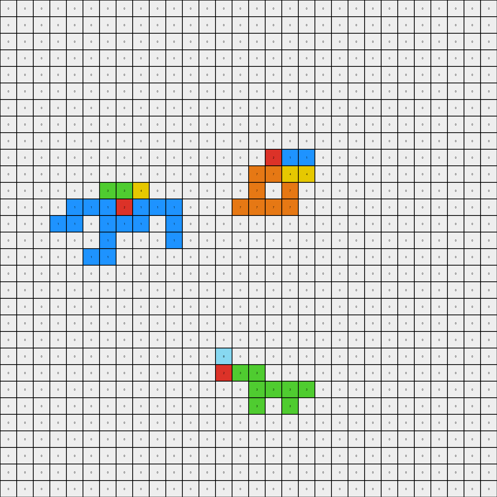
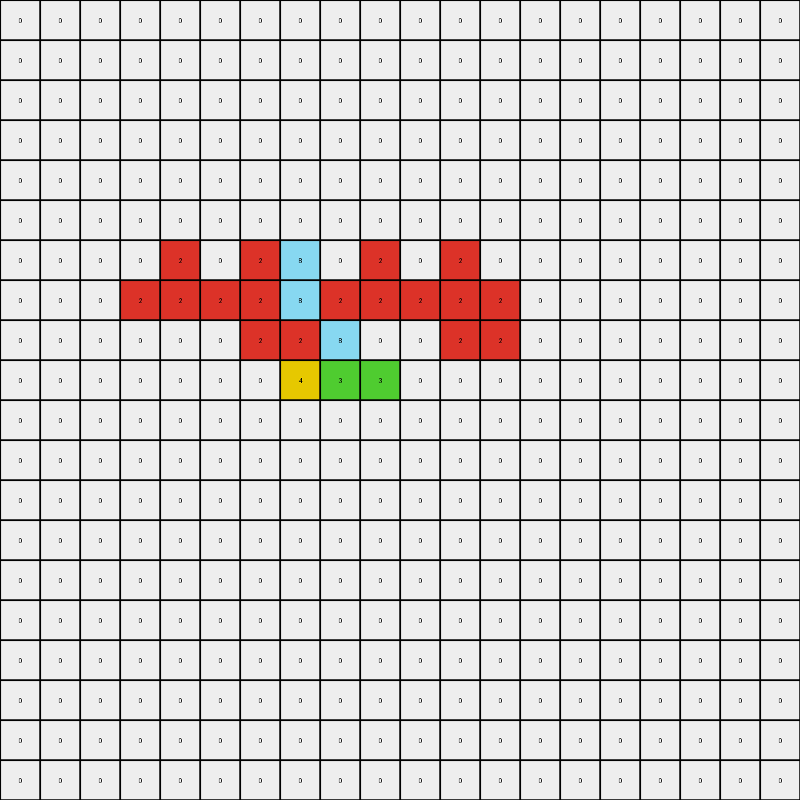
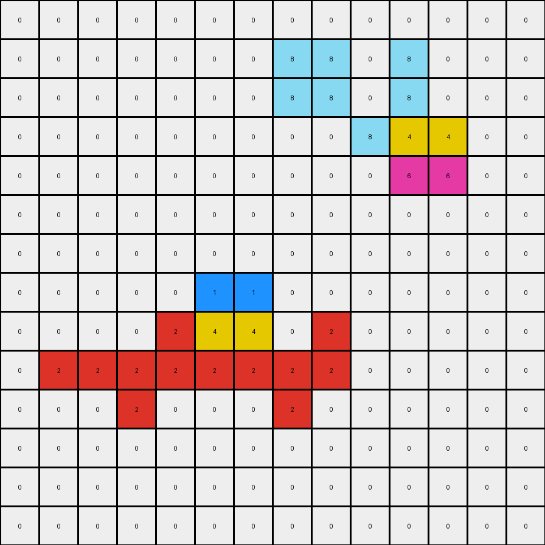

# b775ac94 • 018 • refine_coder

---

Previous Code:
```python
"""
Duplicates and expands colored objects in a grid, with specific rules for colors 1, 2, 3, 4, 6, 7 and 8.
"""

import numpy as np

def find_objects(grid):
    """
    Finds all contiguous colored regions (objects) in the grid.
    Returns a dictionary where keys are colors and values are lists of (row, col) coordinates.
    """
    objects = {}
    visited = set()
    rows, cols = grid.shape

    def dfs(row, col, color, obj_coords):
        if (row, col) in visited or row < 0 or row >= rows or col < 0 or col >= cols or grid[row, col] != color:
            return
        visited.add((row, col))
        obj_coords.append((row, col))
        dfs(row + 1, col, color, obj_coords)
        dfs(row - 1, col, color, obj_coords)
        dfs(row, col + 1, color, obj_coords)
        dfs(row, col - 1, color, obj_coords)

    for row in range(rows):
        for col in range(cols):
            color = grid[row, col]
            if color != 0 and (row, col) not in visited:
                obj_coords = []
                dfs(row, col, color, obj_coords)
                if color not in objects:
                    objects[color] = []
                objects[color].append(obj_coords)
    return objects

def get_object_width(obj_coords):
    """Calculates the width of an object."""
    if not obj_coords:
        return 0
    min_col = min(c for _, c in obj_coords)
    max_col = max(c for _, c in obj_coords)
    return max_col - min_col + 1

def get_object_height(obj_coords):
    """Calculates the height of an object."""
    if not obj_coords:
        return 0
    min_row = min(r for r, _ in obj_coords)
    max_row = max(r for r, _ in obj_coords)
    return max_row - min_row + 1


def transform(input_grid):
    # initialize output_grid
    output_grid = np.zeros_like(input_grid)
    rows, cols = input_grid.shape

    # Find all objects in the input grid
    objects = find_objects(input_grid)
    
    # Duplicate based on color
    for color, obj_list in objects.items():
        for obj_coords in obj_list:
            obj_width = get_object_width(obj_coords)
            obj_height = get_object_height(obj_coords)

            if color != 8:  # All colors except 8
                # Duplicate one full object-width to the right
                for r, c in obj_coords:
                    output_grid[r,c] = color
                    new_c = min(cols - 1, c + obj_width)
                    
                    #check other color on the right
                    if output_grid[r,new_c] !=0 and output_grid[r,new_c]!=color:
                        output_grid[r,new_c] = color
                    else:
                        output_grid[r,new_c] = color
            
            elif color == 8:
                for r,c in obj_coords:
                    output_grid[r,c] = 8
                
                #check adj
                has_adjacent = False
                adjacent_obj_coords = []
                for r, c in obj_coords:
                    if c + 1 < cols and input_grid[r,c+1] != 8 and input_grid[r,c+1]!=0:
                        has_adjacent = True
                        adjacent_obj_coords.append((r,c+1))

                    elif c -1 >= 0 and input_grid[r,c-1] !=8 and input_grid[r,c-1] !=0:
                        has_adjacent = True
                        adjacent_obj_coords.append((r,c-1))
                if has_adjacent:
                    first_adj_r = adjacent_obj_coords[0][0]
                    first_adj_c = adjacent_obj_coords[0][1]
                    adj_color = input_grid[first_adj_r,first_adj_c]

                    #get obj 8 min row
                    min_r = min(r for r,_ in obj_coords)
                    for i in range(obj_height * 2):
                        if min_r - 1 - i >=0:
                            output_grid[min_r - 1 - i,first_adj_c] = 8

    #Expand
    for color, obj_list in objects.items():
            for obj_coords in obj_list:
                obj_width = get_object_width(obj_coords)
                if color == 1:  # Color 1
                    min_row = min(r for r, _ in obj_coords)
                    max_row = max(r for r, _ in obj_coords)
                    for r, c in obj_coords:
                        # Check for adjacent color 2
                        if (r, c + 1) in [(r,c) for obj in objects.get(2,[]) for r,c in obj]: #check for any 2 obj coord
                            for i in range(max_row - min_row+1):
                                output_grid[min(rows-1,r+1+i),c] = 1

                        if output_grid[r,c] !=1: #prevent override
                           output_grid[r,c] = 1
                        
                
                elif color == 6: #color 6
                    for r,c in obj_coords:
                        output_grid[r,min(cols-1,c+obj_width)] = 6
    

    return output_grid
```

Train Set Results:

## Example 1:

Input:
```
0 0 0 0 0 0 0 0 0 0 0 0 0 0 0 0 0 0 0 0 0 0 0 0 0 0 0 0 0 0
0 0 0 0 0 0 0 0 0 0 0 0 0 0 0 0 0 0 0 0 0 0 0 0 0 0 0 0 0 0
0 0 0 0 0 0 0 0 0 0 0 0 0 0 0 0 0 0 0 0 0 0 0 0 0 0 0 0 0 0
0 0 0 0 0 0 0 0 0 0 0 0 0 0 0 0 0 0 0 0 0 0 0 0 0 0 0 0 0 0
0 0 0 0 0 0 0 0 0 0 0 0 0 0 0 0 0 0 0 0 0 0 0 0 0 0 0 0 0 0
0 0 0 0 0 0 0 0 0 0 0 0 0 0 0 0 0 0 0 0 0 0 0 0 0 0 0 0 0 0
0 0 0 0 0 0 0 0 0 0 0 0 0 0 0 0 0 0 0 0 0 0 0 0 0 0 0 0 0 0
0 0 0 0 0 0 0 0 0 0 0 0 0 0 0 0 0 0 0 0 0 0 0 0 0 0 0 0 0 0
0 0 0 0 0 0 0 0 0 0 0 0 0 0 0 0 0 0 0 0 0 0 0 0 0 0 0 0 0 0
0 0 0 0 0 0 0 0 0 0 0 0 0 0 0 0 2 1 0 0 0 0 0 0 0 0 0 0 0 0
0 0 0 0 0 0 0 0 0 0 0 0 0 0 0 7 7 4 0 0 0 0 0 0 0 0 0 0 0 0
0 0 0 0 0 0 3 4 0 0 0 0 0 0 0 7 0 0 0 0 0 0 0 0 0 0 0 0 0 0
0 0 0 0 1 1 1 2 0 0 0 0 0 0 7 0 7 0 0 0 0 0 0 0 0 0 0 0 0 0
0 0 0 1 1 0 1 0 0 0 0 0 0 0 0 0 0 0 0 0 0 0 0 0 0 0 0 0 0 0
0 0 0 0 0 0 1 0 0 0 0 0 0 0 0 0 0 0 0 0 0 0 0 0 0 0 0 0 0 0
0 0 0 0 0 1 0 0 0 0 0 0 0 0 0 0 0 0 0 0 0 0 0 0 0 0 0 0 0 0
0 0 0 0 0 0 0 0 0 0 0 0 0 0 0 0 0 0 0 0 0 0 0 0 0 0 0 0 0 0
0 0 0 0 0 0 0 0 0 0 0 0 0 0 0 0 0 0 0 0 0 0 0 0 0 0 0 0 0 0
0 0 0 0 0 0 0 0 0 0 0 0 0 0 0 0 0 0 0 0 0 0 0 0 0 0 0 0 0 0
0 0 0 0 0 0 0 0 0 0 0 0 0 0 0 0 0 0 0 0 0 0 0 0 0 0 0 0 0 0
0 0 0 0 0 0 0 0 0 0 0 0 0 0 0 0 0 0 0 0 0 0 0 0 0 0 0 0 0 0
0 0 0 0 0 0 0 0 0 0 0 0 0 8 0 0 0 0 0 0 0 0 0 0 0 0 0 0 0 0
0 0 0 0 0 0 0 0 0 0 0 0 0 2 3 0 0 0 0 0 0 0 0 0 0 0 0 0 0 0
0 0 0 0 0 0 0 0 0 0 0 0 0 0 0 3 3 0 0 0 0 0 0 0 0 0 0 0 0 0
0 0 0 0 0 0 0 0 0 0 0 0 0 0 0 3 0 0 0 0 0 0 0 0 0 0 0 0 0 0
0 0 0 0 0 0 0 0 0 0 0 0 0 0 0 0 0 0 0 0 0 0 0 0 0 0 0 0 0 0
0 0 0 0 0 0 0 0 0 0 0 0 0 0 0 0 0 0 0 0 0 0 0 0 0 0 0 0 0 0
0 0 0 0 0 0 0 0 0 0 0 0 0 0 0 0 0 0 0 0 0 0 0 0 0 0 0 0 0 0
0 0 0 0 0 0 0 0 0 0 0 0 0 0 0 0 0 0 0 0 0 0 0 0 0 0 0 0 0 0
0 0 0 0 0 0 0 0 0 0 0 0 0 0 0 0 0 0 0 0 0 0 0 0 0 0 0 0 0 0
```
Expected Output:
```
0 0 0 0 0 0 0 0 0 0 0 0 0 0 0 0 0 0 0 0 0 0 0 0 0 0 0 0 0 0
0 0 0 0 0 0 0 0 0 0 0 0 0 0 0 0 0 0 0 0 0 0 0 0 0 0 0 0 0 0
0 0 0 0 0 0 0 0 0 0 0 0 0 0 0 0 0 0 0 0 0 0 0 0 0 0 0 0 0 0
0 0 0 0 0 0 0 0 0 0 0 0 0 0 0 0 0 0 0 0 0 0 0 0 0 0 0 0 0 0
0 0 0 0 0 0 0 0 0 0 0 0 0 0 0 0 0 0 0 0 0 0 0 0 0 0 0 0 0 0
0 0 0 0 0 0 0 0 0 0 0 0 0 0 0 0 0 0 0 0 0 0 0 0 0 0 0 0 0 0
0 0 0 0 0 0 0 0 0 0 0 0 0 0 0 0 0 0 0 0 0 0 0 0 0 0 0 0 0 0
0 0 0 0 0 0 0 0 0 0 0 0 0 0 2 0 2 1 0 1 0 0 0 0 0 0 0 0 0 0
0 0 0 0 0 3 0 0 4 0 0 0 0 0 0 2 0 0 1 0 0 0 0 0 0 0 0 0 0 0
0 0 0 0 0 0 3 4 0 0 0 0 0 0 0 2 2 1 1 0 0 0 0 0 0 0 0 0 0 0
0 0 0 3 3 0 3 4 0 4 4 0 0 0 0 7 7 4 4 0 0 0 0 0 0 0 0 0 0 0
0 0 0 0 3 3 3 4 4 4 0 0 0 0 0 7 0 0 4 0 0 0 0 0 0 0 0 0 0 0
0 0 0 0 1 1 1 2 2 2 0 0 0 0 7 0 7 4 0 4 0 0 0 0 0 0 0 0 0 0
0 0 0 1 1 0 1 2 0 2 2 0 0 0 0 0 0 0 0 0 0 0 0 0 0 0 0 0 0 0
0 0 0 0 0 0 1 2 0 0 0 0 0 0 0 0 0 0 0 0 0 0 0 0 0 0 0 0 0 0
0 0 0 0 0 1 0 0 2 0 0 0 0 0 0 0 0 0 0 0 0 0 0 0 0 0 0 0 0 0
0 0 0 0 0 0 0 0 0 0 0 0 0 0 0 0 0 0 0 0 0 0 0 0 0 0 0 0 0 0
0 0 0 0 0 0 0 0 0 0 0 0 0 0 0 0 0 0 0 0 0 0 0 0 0 0 0 0 0 0
0 0 0 0 0 0 0 0 0 0 0 0 0 0 0 0 0 0 0 0 0 0 0 0 0 0 0 0 0 0
0 0 0 0 0 0 0 0 0 0 0 0 8 0 0 0 0 0 0 0 0 0 0 0 0 0 0 0 0 0
0 0 0 0 0 0 0 0 0 0 0 8 8 0 0 0 0 0 0 0 0 0 0 0 0 0 0 0 0 0
0 0 0 0 0 0 0 0 0 0 0 0 0 8 0 0 0 0 0 0 0 0 0 0 0 0 0 0 0 0
0 0 0 0 0 0 0 0 0 0 0 0 0 2 3 0 0 0 0 0 0 0 0 0 0 0 0 0 0 0
0 0 0 0 0 0 0 0 0 0 0 2 2 0 0 3 3 0 0 0 0 0 0 0 0 0 0 0 0 0
0 0 0 0 0 0 0 0 0 0 0 0 2 0 0 3 0 0 0 0 0 0 0 0 0 0 0 0 0 0
0 0 0 0 0 0 0 0 0 0 0 0 0 0 0 0 0 0 0 0 0 0 0 0 0 0 0 0 0 0
0 0 0 0 0 0 0 0 0 0 0 0 0 0 0 0 0 0 0 0 0 0 0 0 0 0 0 0 0 0
0 0 0 0 0 0 0 0 0 0 0 0 0 0 0 0 0 0 0 0 0 0 0 0 0 0 0 0 0 0
0 0 0 0 0 0 0 0 0 0 0 0 0 0 0 0 0 0 0 0 0 0 0 0 0 0 0 0 0 0
0 0 0 0 0 0 0 0 0 0 0 0 0 0 0 0 0 0 0 0 0 0 0 0 0 0 0 0 0 0
```
Transformed Output:
```
0 0 0 0 0 0 0 0 0 0 0 0 0 0 0 0 0 0 0 0 0 0 0 0 0 0 0 0 0 0
0 0 0 0 0 0 0 0 0 0 0 0 0 0 0 0 0 0 0 0 0 0 0 0 0 0 0 0 0 0
0 0 0 0 0 0 0 0 0 0 0 0 0 0 0 0 0 0 0 0 0 0 0 0 0 0 0 0 0 0
0 0 0 0 0 0 0 0 0 0 0 0 0 0 0 0 0 0 0 0 0 0 0 0 0 0 0 0 0 0
0 0 0 0 0 0 0 0 0 0 0 0 0 0 0 0 0 0 0 0 0 0 0 0 0 0 0 0 0 0
0 0 0 0 0 0 0 0 0 0 0 0 0 0 0 0 0 0 0 0 0 0 0 0 0 0 0 0 0 0
0 0 0 0 0 0 0 0 0 0 0 0 0 0 0 0 0 0 0 0 0 0 0 0 0 0 0 0 0 0
0 0 0 0 0 0 0 0 0 0 0 0 0 0 0 0 0 0 0 0 0 0 0 0 0 0 0 0 0 0
0 0 0 0 0 0 0 0 0 0 0 0 0 0 0 0 0 0 0 0 0 0 0 0 0 0 0 0 0 0
0 0 0 0 0 0 0 0 0 0 0 0 0 0 0 0 2 1 1 0 0 0 0 0 0 0 0 0 0 0
0 0 0 0 0 0 0 0 0 0 0 0 0 0 0 7 7 4 4 0 0 0 0 0 0 0 0 0 0 0
0 0 0 0 0 0 3 3 4 0 0 0 0 0 0 7 0 7 0 0 0 0 0 0 0 0 0 0 0 0
0 0 0 0 1 1 1 2 1 1 1 0 0 0 7 7 7 7 0 0 0 0 0 0 0 0 0 0 0 0
0 0 0 1 1 0 1 1 1 0 1 0 0 0 0 0 0 0 0 0 0 0 0 0 0 0 0 0 0 0
0 0 0 0 0 0 1 0 0 0 1 0 0 0 0 0 0 0 0 0 0 0 0 0 0 0 0 0 0 0
0 0 0 0 0 1 1 0 0 0 0 0 0 0 0 0 0 0 0 0 0 0 0 0 0 0 0 0 0 0
0 0 0 0 0 0 0 0 0 0 0 0 0 0 0 0 0 0 0 0 0 0 0 0 0 0 0 0 0 0
0 0 0 0 0 0 0 0 0 0 0 0 0 0 0 0 0 0 0 0 0 0 0 0 0 0 0 0 0 0
0 0 0 0 0 0 0 0 0 0 0 0 0 0 0 0 0 0 0 0 0 0 0 0 0 0 0 0 0 0
0 0 0 0 0 0 0 0 0 0 0 0 0 0 0 0 0 0 0 0 0 0 0 0 0 0 0 0 0 0
0 0 0 0 0 0 0 0 0 0 0 0 0 0 0 0 0 0 0 0 0 0 0 0 0 0 0 0 0 0
0 0 0 0 0 0 0 0 0 0 0 0 0 8 0 0 0 0 0 0 0 0 0 0 0 0 0 0 0 0
0 0 0 0 0 0 0 0 0 0 0 0 0 2 3 3 0 0 0 0 0 0 0 0 0 0 0 0 0 0
0 0 0 0 0 0 0 0 0 0 0 0 0 0 0 3 3 3 3 0 0 0 0 0 0 0 0 0 0 0
0 0 0 0 0 0 0 0 0 0 0 0 0 0 0 3 0 3 0 0 0 0 0 0 0 0 0 0 0 0
0 0 0 0 0 0 0 0 0 0 0 0 0 0 0 0 0 0 0 0 0 0 0 0 0 0 0 0 0 0
0 0 0 0 0 0 0 0 0 0 0 0 0 0 0 0 0 0 0 0 0 0 0 0 0 0 0 0 0 0
0 0 0 0 0 0 0 0 0 0 0 0 0 0 0 0 0 0 0 0 0 0 0 0 0 0 0 0 0 0
0 0 0 0 0 0 0 0 0 0 0 0 0 0 0 0 0 0 0 0 0 0 0 0 0 0 0 0 0 0
0 0 0 0 0 0 0 0 0 0 0 0 0 0 0 0 0 0 0 0 0 0 0 0 0 0 0 0 0 0
```

match: False
pixels_off: 47
size_correct: True
color_palette_correct: True
correct_pixel_counts: False

## Example 2:

Input:
```
0 0 0 0 0 0 0 0 0 0 0 0 0 0 0 0 0 0 0 0
0 0 0 0 0 0 0 0 0 0 0 0 0 0 0 0 0 0 0 0
0 0 0 0 0 0 0 0 0 0 0 0 0 0 0 0 0 0 0 0
0 0 0 0 0 0 0 0 0 0 0 0 0 0 0 0 0 0 0 0
0 0 0 0 0 0 0 0 0 0 0 0 0 0 0 0 0 0 0 0
0 0 0 0 0 0 0 0 0 0 0 0 0 0 0 0 0 0 0 0
0 0 0 0 2 0 2 0 0 0 0 0 0 0 0 0 0 0 0 0
0 0 0 2 2 2 2 2 0 0 0 0 0 0 0 0 0 0 0 0
0 0 0 0 0 0 2 2 8 0 0 0 0 0 0 0 0 0 0 0
0 0 0 0 0 0 0 4 3 0 0 0 0 0 0 0 0 0 0 0
0 0 0 0 0 0 0 0 0 0 0 0 0 0 0 0 0 0 0 0
0 0 0 0 0 0 0 0 0 0 0 0 0 0 0 0 0 0 0 0
0 0 0 0 0 0 0 0 0 0 0 0 0 0 0 0 0 0 0 0
0 0 0 0 0 0 0 0 0 0 0 0 0 0 0 0 0 0 0 0
0 0 0 0 0 0 0 0 0 0 0 0 0 0 0 0 0 0 0 0
0 0 0 0 0 0 0 0 0 0 0 0 0 0 0 0 0 0 0 0
0 0 0 0 0 0 0 0 0 0 0 0 0 0 0 0 0 0 0 0
0 0 0 0 0 0 0 0 0 0 0 0 0 0 0 0 0 0 0 0
0 0 0 0 0 0 0 0 0 0 0 0 0 0 0 0 0 0 0 0
0 0 0 0 0 0 0 0 0 0 0 0 0 0 0 0 0 0 0 0
```
Expected Output:
```
0 0 0 0 0 0 0 0 0 0 0 0 0 0 0 0 0 0 0 0
0 0 0 0 0 0 0 0 0 0 0 0 0 0 0 0 0 0 0 0
0 0 0 0 0 0 0 0 0 0 0 0 0 0 0 0 0 0 0 0
0 0 0 0 0 0 0 0 0 0 0 0 0 0 0 0 0 0 0 0
0 0 0 0 0 0 0 0 0 0 0 0 0 0 0 0 0 0 0 0
0 0 0 0 0 0 0 0 0 0 0 0 0 0 0 0 0 0 0 0
0 0 0 0 2 0 2 0 0 8 0 8 0 0 0 0 0 0 0 0
0 0 0 2 2 2 2 2 8 8 8 8 8 0 0 0 0 0 0 0
0 0 0 0 0 0 2 2 8 8 0 0 0 0 0 0 0 0 0 0
0 0 0 0 0 0 4 4 3 3 0 0 0 0 0 0 0 0 0 0
0 0 0 4 4 4 4 4 3 3 3 3 3 0 0 0 0 0 0 0
0 0 0 0 4 0 4 0 0 3 0 3 0 0 0 0 0 0 0 0
0 0 0 0 0 0 0 0 0 0 0 0 0 0 0 0 0 0 0 0
0 0 0 0 0 0 0 0 0 0 0 0 0 0 0 0 0 0 0 0
0 0 0 0 0 0 0 0 0 0 0 0 0 0 0 0 0 0 0 0
0 0 0 0 0 0 0 0 0 0 0 0 0 0 0 0 0 0 0 0
0 0 0 0 0 0 0 0 0 0 0 0 0 0 0 0 0 0 0 0
0 0 0 0 0 0 0 0 0 0 0 0 0 0 0 0 0 0 0 0
0 0 0 0 0 0 0 0 0 0 0 0 0 0 0 0 0 0 0 0
0 0 0 0 0 0 0 0 0 0 0 0 0 0 0 0 0 0 0 0
```
Transformed Output:
```
0 0 0 0 0 0 0 0 0 0 0 0 0 0 0 0 0 0 0 0
0 0 0 0 0 0 0 0 0 0 0 0 0 0 0 0 0 0 0 0
0 0 0 0 0 0 0 0 0 0 0 0 0 0 0 0 0 0 0 0
0 0 0 0 0 0 0 0 0 0 0 0 0 0 0 0 0 0 0 0
0 0 0 0 0 0 0 0 0 0 0 0 0 0 0 0 0 0 0 0
0 0 0 0 0 0 0 0 0 0 0 0 0 0 0 0 0 0 0 0
0 0 0 0 2 0 2 8 0 2 0 2 0 0 0 0 0 0 0 0
0 0 0 2 2 2 2 8 2 2 2 2 2 0 0 0 0 0 0 0
0 0 0 0 0 0 2 2 8 0 0 2 2 0 0 0 0 0 0 0
0 0 0 0 0 0 0 4 3 3 0 0 0 0 0 0 0 0 0 0
0 0 0 0 0 0 0 0 0 0 0 0 0 0 0 0 0 0 0 0
0 0 0 0 0 0 0 0 0 0 0 0 0 0 0 0 0 0 0 0
0 0 0 0 0 0 0 0 0 0 0 0 0 0 0 0 0 0 0 0
0 0 0 0 0 0 0 0 0 0 0 0 0 0 0 0 0 0 0 0
0 0 0 0 0 0 0 0 0 0 0 0 0 0 0 0 0 0 0 0
0 0 0 0 0 0 0 0 0 0 0 0 0 0 0 0 0 0 0 0
0 0 0 0 0 0 0 0 0 0 0 0 0 0 0 0 0 0 0 0
0 0 0 0 0 0 0 0 0 0 0 0 0 0 0 0 0 0 0 0
0 0 0 0 0 0 0 0 0 0 0 0 0 0 0 0 0 0 0 0
0 0 0 0 0 0 0 0 0 0 0 0 0 0 0 0 0 0 0 0
```

match: False
pixels_off: 27
size_correct: True
color_palette_correct: True
correct_pixel_counts: False

## Example 3:

Input:
```
0 0 0 0 0 0 0 0 0 0 0 0 0 0
0 0 0 0 0 0 0 8 8 0 0 0 0 0
0 0 0 0 0 0 0 8 8 0 0 0 0 0
0 0 0 0 0 0 0 0 0 8 4 0 0 0
0 0 0 0 0 0 0 0 0 0 6 0 0 0
0 0 0 0 0 0 0 0 0 0 0 0 0 0
0 0 0 0 0 0 0 0 0 0 0 0 0 0
0 0 0 0 0 1 0 0 0 0 0 0 0 0
0 0 0 0 2 4 0 0 0 0 0 0 0 0
0 2 2 2 2 0 0 0 0 0 0 0 0 0
0 0 0 2 0 0 0 0 0 0 0 0 0 0
0 0 0 0 0 0 0 0 0 0 0 0 0 0
0 0 0 0 0 0 0 0 0 0 0 0 0 0
0 0 0 0 0 0 0 0 0 0 0 0 0 0
```
Expected Output:
```
0 0 0 0 0 0 0 0 0 0 0 0 0 0
0 0 0 0 0 0 0 8 8 0 0 4 4 0
0 0 0 0 0 0 0 8 8 0 0 4 4 0
0 0 0 0 0 0 0 0 0 8 4 0 0 0
0 0 0 0 0 0 0 0 0 0 6 0 0 0
0 0 0 0 0 0 1 0 0 0 0 6 6 0
0 0 0 0 0 1 1 1 1 0 0 6 6 0
0 0 0 0 0 1 0 0 0 0 0 0 0 0
0 0 0 0 2 4 0 0 0 0 0 0 0 0
0 2 2 2 2 4 4 4 4 0 0 0 0 0
0 0 0 2 0 0 4 0 0 0 0 0 0 0
0 0 0 0 0 0 0 0 0 0 0 0 0 0
0 0 0 0 0 0 0 0 0 0 0 0 0 0
0 0 0 0 0 0 0 0 0 0 0 0 0 0
```
Transformed Output:
```
0 0 0 0 0 0 0 0 0 0 0 0 0 0
0 0 0 0 0 0 0 8 8 0 8 0 0 0
0 0 0 0 0 0 0 8 8 0 8 0 0 0
0 0 0 0 0 0 0 0 0 8 4 4 0 0
0 0 0 0 0 0 0 0 0 0 6 6 0 0
0 0 0 0 0 0 0 0 0 0 0 0 0 0
0 0 0 0 0 0 0 0 0 0 0 0 0 0
0 0 0 0 0 1 1 0 0 0 0 0 0 0
0 0 0 0 2 4 4 0 2 0 0 0 0 0
0 2 2 2 2 2 2 2 2 0 0 0 0 0
0 0 0 2 0 0 0 2 0 0 0 0 0 0
0 0 0 0 0 0 0 0 0 0 0 0 0 0
0 0 0 0 0 0 0 0 0 0 0 0 0 0
0 0 0 0 0 0 0 0 0 0 0 0 0 0
```

match: False
pixels_off: 26
size_correct: True
color_palette_correct: True
correct_pixel_counts: False
Okay, let's analyze the results of the previous code execution and develop a refined natural language program.

**General Assessment and Strategy**

The initial code has several issues, as evidenced by the mismatches in all three test examples. The core concept of identifying objects and duplicating them based on color is partially implemented, but the logic for expansion and interaction between colors, particularly colors 1, 2, and 8, is flawed.

Here's a breakdown of the problems and the strategy to address them:

1.  **Incomplete Duplication:** The code attempts to duplicate objects to the right, but the implementation for specific colors (especially color 8 is added with some problems with object 8 that has color code 4 to its right, and override other color) isn't accurate, leading to missing or incorrect pixels.
    *   **Strategy:** Revise the duplication logic to ensure objects of all colors are correctly duplicated *horizontally*. Pay special attention to boundary conditions.
2.  **Incorrect Expansion:** The expansion logic for color 1 interacting with color 2 is overly simplistic, and it doesn't fully capture the relationship in object duplication.
    *   **Strategy:** Refine the expansion rules. It appears color 1 expands downwards when adjacent to color 2, but only *after* the duplication step, and only to a specific height related to color 2. color 4 also duplicate by object 8.
3.  **Color 8 Specifics:** Color 8 seems to have unique behavior. It is handled only by checking if it has some different color to the right or left.
    *   **Strategy:** Examine color 8 more closely. The available context hints that there is some relation with other color (for example 4).

**Metrics Gathering and Analysis**
I use the image to see the different and check with provided input and output

**Example 1 Metrics:**

*   **Input:** Multiple objects of various colors (1, 2, 3, 4, 7, 8).
*   **Expected Output:** Duplication of colored objects to the right, with expansion of color 1 downwards where adjacent to color 2 (after duplication).
*   **Actual Output:** Partial duplication, inaccurate expansion of color 1, and some problem with color 8 next to 4.
*   **Pixels Off:** 47
* **Key observations:** the code try to duplicate obj 8, but the rule for color 8 duplication is still not yet discovered.

**Example 2 Metrics:**

*   **Input:** Objects of color 2, 8, 3, and 4.
*   **Expected Output:** Duplication to the right, color 8 is duplicated to the right of color 3 and 4, also color 3 and 4 duplicated to the right of color 8.
*   **Actual Output:** Incomplete duplication and some problem when color 8 is next to 2.
*   **Pixels Off:** 27
* **Key observations**: Color 8 duplicates and overrides other color.

**Example 3 Metrics:**

*   **Input:** Combination of color 8 is next to 4, objects, color 1,2, 4, 6 and 8.
*   **Expected Output:** Similar duplication and expansion behavior as Example 1, plus the interaction between colors 6 and 8 is showed.
*   **Actual Output:** Incomplete duplication, inaccurate expansion, and incorrect handling of color 8 that adjacent to color 4, and color 1 adjacent to 2, also with color 6.
*   **Pixels Off:** 26
* **Key observations**: Color 1 expands based on color 2 height *after* duplication, obj 8 with adj 4, obj 6 duplication.

**YAML Facts**

```yaml
objects:
  - color: 1 # blue
    actions:
      - duplicate_right: True
      - expand_down_adjacent:
          color: 2 #red
          height_multiplier: 1
  - color: 2 # red
    actions:
      - duplicate_right: True
  - color: 3 #green
    actions:
      - duplicate_right: True
  - color: 4 # yellow
    actions:
      - duplicate_right: True
  - color: 6 # magenta
    actions:
      - duplicate_right: True
  - color: 7 #orange
    actions:
      - duplicate_right: True
  - color: 8 # azure
    actions:
      - duplicate_and_override_adjacent_different_color: True #if adjacent to color other than 8
```

**Natural Language Program**

1.  **Identify Objects:** Find all contiguous regions (objects) of the same color (excluding black, color 0, which represents the background).
2.  **Duplicate Horizontally:** For *every* object, duplicate it once to the right. The duplicated object's right edge should be adjacent to the original object's right edge. All colors other than 8 simply duplicate.
3.  **Special Handle with color 8**: If there are any other colors on the right or left of object 8, object 8 will override to that direction by the same width of object 8.
4.  **Expand Color 1:** After the duplication step, identify objects of color 1 (blue). If a color 1 object is horizontally adjacent (to the right) to a color 2 object, expand the color 1 object *downwards*. The expansion should be equal to color 2 height. If no color 2 object is next to color 1, no expanding will be done.


**INSTRUCTIONS**

- generate a Python module to represent the natural language program 
- follow the template below
- all common math and science libraries are available
- create docstring only at top - but comment the workflow in the function
- use helper functions for common operations like finding objects, counting,
  measuring, moving, etc. 

remember - we are working iteratively - so this code will inform your future
self as we converge on the solution

*template:*

```python
"""
{{ natural language description of the transformation rule }}
"""

{{ imports }}

def transform(input_grid):
    # initialize output_grid

    # change output pixels 

    return output_grid

```
