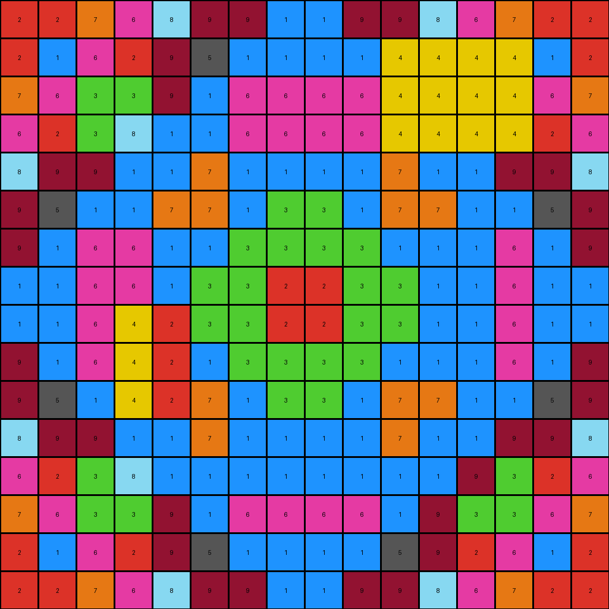

# b8825c91 • 005 • refine_dreamer

---

Previous Code:
```python
"""
1.  **Identify the Central Region:** The definition of the central region needs further analysis across all examples, and potentially requires a more dynamic approach to its size and shape detection.
2. **Conditional Color Swap:** Within the central region *only*:
   *   If a pixel is yellow(4), check the expected output to determine its new correct color.
   *   If a pixel is magenta (6), check the expected output to determine its new correct color.
   * If a pixel is azure (8), check the expected output to determine its new correct color.
3.  **Preserve Other Pixels:** All pixels outside the defined central region remain unchanged in color. Also, any pixels within the central region that do not match the specific colors targeted for swapping should remain unchanged.
"""

import numpy as np

def find_central_region(grid):
    # Determine the center coordinates of the grid
    rows, cols = grid.shape
    center_row, center_col = rows // 2, cols // 2

    # Define a starting size for the central region (e.g. half the size of the grid)
    region_height = rows // 2
    region_width = cols // 2

    # adjust to be odd dimensions so center has a pixel
    if region_height % 2 == 0:
      region_height += 1
    if region_width % 2 == 0:
      region_width += 1

    # Calculate the top-left and bottom-right coordinates of the region
    top_left_row = center_row - region_height // 2
    top_left_col = center_col - region_width // 2
    bottom_right_row = top_left_row + region_height
    bottom_right_col = top_left_col + region_width

    return top_left_row, top_left_col, bottom_right_row, bottom_right_col

def transform(input_grid):
    # Initialize output_grid as a copy of input_grid
    output_grid = np.copy(input_grid)
    rows, cols = input_grid.shape

    # Find the central region - same as previous iteration for now
    top_left_row, top_left_col, bottom_right_row, bottom_right_col = find_central_region(input_grid)

    # Iterate through the central region and apply color swap.  Placeholder swaps.
    for i in range(top_left_row, bottom_right_row):
        for j in range(top_left_col, bottom_right_col):
            if output_grid[i, j] == 4:
                output_grid[i, j] = 2  # Placeholder:  yellow to ?
            elif output_grid[i, j] == 6:
                output_grid[i, j] = 1 # Placeholder: magenta to ?
            elif output_grid[i, j] == 8:
                output_grid[i, j] = 9  # Placeholder: azure to ?

    return output_grid
```

Train Set Results:

## Example 1:

Input:
```
9 9 6 5 9 6 7 7 7 7 6 9 5 6 9 9
9 1 5 5 6 1 7 9 9 7 1 6 5 5 1 9
6 5 1 9 7 7 3 3 3 3 7 7 9 1 5 6
5 5 9 3 7 9 3 3 3 3 9 7 3 9 5 5
9 6 7 7 3 8 9 1 1 9 8 3 7 7 6 9
6 1 7 9 8 3 1 1 1 1 4 4 4 4 1 6
7 7 3 3 9 1 6 6 6 6 4 4 4 4 7 7
7 9 3 3 1 1 6 1 1 6 4 4 4 4 9 7
7 9 3 3 1 1 6 1 1 6 1 1 3 3 9 7
7 7 3 3 9 1 6 6 6 6 1 9 3 3 7 7
6 1 7 9 8 3 1 1 1 1 4 4 4 7 1 6
9 6 7 7 3 8 9 1 1 9 4 4 4 7 6 9
5 5 9 3 7 9 3 3 3 3 4 4 4 9 5 5
6 5 1 9 7 7 3 3 3 3 4 4 4 1 5 6
9 1 5 5 6 1 7 9 9 7 1 6 5 5 1 9
9 9 6 5 9 6 7 7 7 7 6 9 5 6 9 9
```
Expected Output:
```
9 9 6 5 9 6 7 7 7 7 6 9 5 6 9 9
9 1 5 5 6 1 7 9 9 7 1 6 5 5 1 9
6 5 1 9 7 7 3 3 3 3 7 7 9 1 5 6
5 5 9 3 7 9 3 3 3 3 9 7 3 9 5 5
9 6 7 7 3 8 9 1 1 9 8 3 7 7 6 9
6 1 7 9 8 3 1 1 1 1 3 8 9 7 1 6
7 7 3 3 9 1 6 6 6 6 1 9 3 3 7 7
7 9 3 3 1 1 6 1 1 6 1 1 3 3 9 7
7 9 3 3 1 1 6 1 1 6 1 1 3 3 9 7
7 7 3 3 9 1 6 6 6 6 1 9 3 3 7 7
6 1 7 9 8 3 1 1 1 1 3 8 9 7 1 6
9 6 7 7 3 8 9 1 1 9 8 3 7 7 6 9
5 5 9 3 7 9 3 3 3 3 9 7 3 9 5 5
6 5 1 9 7 7 3 3 3 3 7 7 9 1 5 6
9 1 5 5 6 1 7 9 9 7 1 6 5 5 1 9
9 9 6 5 9 6 7 7 7 7 6 9 5 6 9 9
```
Transformed Output:
```
9 9 6 5 9 6 7 7 7 7 6 9 5 6 9 9
9 1 5 5 6 1 7 9 9 7 1 6 5 5 1 9
6 5 1 9 7 7 3 3 3 3 7 7 9 1 5 6
5 5 9 3 7 9 3 3 3 3 9 7 3 9 5 5
9 6 7 7 3 9 9 1 1 9 9 3 7 7 6 9
6 1 7 9 9 3 1 1 1 1 2 2 2 4 1 6
7 7 3 3 9 1 1 1 1 1 2 2 2 4 7 7
7 9 3 3 1 1 1 1 1 1 2 2 2 4 9 7
7 9 3 3 1 1 1 1 1 1 1 1 3 3 9 7
7 7 3 3 9 1 1 1 1 1 1 9 3 3 7 7
6 1 7 9 9 3 1 1 1 1 2 2 2 7 1 6
9 6 7 7 3 9 9 1 1 9 2 2 2 7 6 9
5 5 9 3 7 9 3 3 3 3 2 2 2 9 5 5
6 5 1 9 7 7 3 3 3 3 4 4 4 1 5 6
9 1 5 5 6 1 7 9 9 7 1 6 5 5 1 9
9 9 6 5 9 6 7 7 7 7 6 9 5 6 9 9
```

match: False
pixels_off: 41
size_correct: True
color_palette_correct: False
correct_pixel_counts: False

## Example 2:

Input:
```
9 9 6 1 8 9 6 6 6 6 9 8 1 6 9 9
9 6 1 3 9 6 6 1 1 6 6 9 3 1 6 9
6 4 4 2 6 6 8 8 8 8 6 6 2 5 1 6
1 4 4 8 6 1 8 2 2 8 1 6 8 2 3 1
8 4 4 6 7 1 5 5 5 5 1 7 6 6 9 8
9 6 6 1 1 1 5 5 5 5 1 1 1 6 6 9
6 6 8 8 5 5 9 5 5 9 5 5 8 8 6 6
6 1 8 2 5 5 5 8 8 5 5 5 2 8 1 6
6 1 8 2 5 5 5 8 8 5 5 4 4 4 1 6
6 6 8 8 5 5 9 5 5 9 5 4 4 4 6 6
9 6 6 1 1 1 5 5 5 5 1 1 1 6 6 9
8 9 6 6 7 1 5 5 5 5 1 7 6 6 9 8
1 3 2 8 6 1 8 2 2 8 1 6 8 2 3 1
6 1 5 2 6 6 8 8 8 8 6 6 2 5 1 6
9 6 1 3 9 6 6 1 1 6 6 9 3 1 6 9
9 9 6 1 8 9 6 6 6 6 9 8 1 6 9 9
```
Expected Output:
```
9 9 6 1 8 9 6 6 6 6 9 8 1 6 9 9
9 6 1 3 9 6 6 1 1 6 6 9 3 1 6 9
6 1 5 2 6 6 8 8 8 8 6 6 2 5 1 6
1 3 2 8 6 1 8 2 2 8 1 6 8 2 3 1
8 9 6 6 7 1 5 5 5 5 1 7 6 6 9 8
9 6 6 1 1 1 5 5 5 5 1 1 1 6 6 9
6 6 8 8 5 5 9 5 5 9 5 5 8 8 6 6
6 1 8 2 5 5 5 8 8 5 5 5 2 8 1 6
6 1 8 2 5 5 5 8 8 5 5 5 2 8 1 6
6 6 8 8 5 5 9 5 5 9 5 5 8 8 6 6
9 6 6 1 1 1 5 5 5 5 1 1 1 6 6 9
8 9 6 6 7 1 5 5 5 5 1 7 6 6 9 8
1 3 2 8 6 1 8 2 2 8 1 6 8 2 3 1
6 1 5 2 6 6 8 8 8 8 6 6 2 5 1 6
9 6 1 3 9 6 6 1 1 6 6 9 3 1 6 9
9 9 6 1 8 9 6 6 6 6 9 8 1 6 9 9
```
Transformed Output:
```
9 9 6 1 8 9 6 6 6 6 9 8 1 6 9 9
9 6 1 3 9 6 6 1 1 6 6 9 3 1 6 9
6 4 4 2 6 6 8 8 8 8 6 6 2 5 1 6
1 4 4 8 6 1 8 2 2 8 1 6 8 2 3 1
8 4 4 6 7 1 5 5 5 5 1 7 1 6 9 8
9 6 6 1 1 1 5 5 5 5 1 1 1 6 6 9
6 6 8 8 5 5 9 5 5 9 5 5 9 8 6 6
6 1 8 2 5 5 5 9 9 5 5 5 2 8 1 6
6 1 8 2 5 5 5 9 9 5 5 2 2 4 1 6
6 6 8 8 5 5 9 5 5 9 5 2 2 4 6 6
9 6 6 1 1 1 5 5 5 5 1 1 1 6 6 9
8 9 6 6 7 1 5 5 5 5 1 7 1 6 9 8
1 3 2 8 1 1 9 2 2 9 1 1 9 2 3 1
6 1 5 2 6 6 8 8 8 8 6 6 2 5 1 6
9 6 1 3 9 6 6 1 1 6 6 9 3 1 6 9
9 9 6 1 8 9 6 6 6 6 9 8 1 6 9 9
```

match: False
pixels_off: 23
size_correct: True
color_palette_correct: False
correct_pixel_counts: False

## Example 3:

Input:
```
9 3 9 9 2 8 7 8 8 7 8 2 9 9 3 9
3 9 9 3 8 8 8 5 5 8 8 8 3 9 9 3
9 9 2 8 7 8 2 2 2 2 8 7 8 2 9 9
9 3 8 8 8 5 2 1 1 2 5 8 8 8 3 9
2 8 7 8 2 5 9 7 7 9 5 2 8 7 8 2
8 8 8 5 5 5 7 6 6 7 5 5 5 8 8 8
7 8 2 2 9 7 1 1 1 1 7 9 4 4 8 7
8 5 2 1 7 6 1 3 3 1 6 7 4 4 5 8
8 5 2 1 7 6 1 3 3 1 6 7 4 4 5 8
7 8 2 2 9 7 1 1 1 1 7 9 4 4 8 7
8 8 8 5 5 5 7 6 6 7 5 5 5 8 8 8
2 8 4 4 4 4 9 7 7 9 5 2 8 7 8 2
9 3 4 4 4 4 2 1 1 2 5 8 8 8 3 9
9 9 4 4 4 4 2 2 2 2 8 7 8 2 9 9
3 9 4 4 4 4 8 5 5 8 8 8 3 9 9 3
9 3 9 9 2 8 7 8 8 7 8 2 9 9 3 9
```
Expected Output:
```
9 3 9 9 2 8 7 8 8 7 8 2 9 9 3 9
3 9 9 3 8 8 8 5 5 8 8 8 3 9 9 3
9 9 2 8 7 8 2 2 2 2 8 7 8 2 9 9
9 3 8 8 8 5 2 1 1 2 5 8 8 8 3 9
2 8 7 8 2 5 9 7 7 9 5 2 8 7 8 2
8 8 8 5 5 5 7 6 6 7 5 5 5 8 8 8
7 8 2 2 9 7 1 1 1 1 7 9 2 2 8 7
8 5 2 1 7 6 1 3 3 1 6 7 1 2 5 8
8 5 2 1 7 6 1 3 3 1 6 7 1 2 5 8
7 8 2 2 9 7 1 1 1 1 7 9 2 2 8 7
8 8 8 5 5 5 7 6 6 7 5 5 5 8 8 8
2 8 7 8 2 5 9 7 7 9 5 2 8 7 8 2
9 3 8 8 8 5 2 1 1 2 5 8 8 8 3 9
9 9 2 8 7 8 2 2 2 2 8 7 8 2 9 9
3 9 9 3 8 8 8 5 5 8 8 8 3 9 9 3
9 3 9 9 2 8 7 8 8 7 8 2 9 9 3 9
```
Transformed Output:
```
9 3 9 9 2 8 7 8 8 7 8 2 9 9 3 9
3 9 9 3 8 8 8 5 5 8 8 8 3 9 9 3
9 9 2 8 7 8 2 2 2 2 8 7 8 2 9 9
9 3 8 8 8 5 2 1 1 2 5 8 8 8 3 9
2 8 7 8 2 5 9 7 7 9 5 2 9 7 8 2
8 8 8 5 5 5 7 1 1 7 5 5 5 8 8 8
7 8 2 2 9 7 1 1 1 1 7 9 2 4 8 7
8 5 2 1 7 1 1 3 3 1 1 7 2 4 5 8
8 5 2 1 7 1 1 3 3 1 1 7 2 4 5 8
7 8 2 2 9 7 1 1 1 1 7 9 2 4 8 7
8 8 8 5 5 5 7 1 1 7 5 5 5 8 8 8
2 8 4 4 2 2 9 7 7 9 5 2 9 7 8 2
9 3 4 4 2 2 2 1 1 2 5 9 9 8 3 9
9 9 4 4 4 4 2 2 2 2 8 7 8 2 9 9
3 9 4 4 4 4 8 5 5 8 8 8 3 9 9 3
9 3 9 9 2 8 7 8 8 7 8 2 9 9 3 9
```

match: False
pixels_off: 33
size_correct: True
color_palette_correct: False
correct_pixel_counts: False

## Example 4:

Input:
```
2 2 7 6 8 9 9 1 1 9 9 8 6 7 2 2
2 1 6 2 9 5 1 1 1 1 4 4 4 4 1 2
7 6 3 3 9 1 6 6 6 6 4 4 4 4 6 7
6 2 3 8 1 1 6 6 6 6 4 4 4 4 2 6
8 9 9 1 1 7 1 1 1 1 7 1 1 9 9 8
9 5 1 1 7 7 1 3 3 1 7 7 1 1 5 9
9 1 6 6 1 1 3 3 3 3 1 1 6 6 1 9
1 1 6 6 1 3 3 2 2 3 3 1 6 6 1 1
1 1 6 4 4 3 3 2 2 3 3 1 6 6 1 1
9 1 6 4 4 1 3 3 3 3 1 1 6 6 1 9
9 5 1 4 4 7 1 3 3 1 7 7 1 1 5 9
8 9 9 1 1 7 1 1 1 1 7 1 1 9 9 8
6 2 3 8 1 1 6 6 6 6 1 1 8 3 2 6
7 6 3 3 9 1 6 6 6 6 1 9 3 3 6 7
2 1 6 2 9 5 1 1 1 1 5 9 2 6 1 2
2 2 7 6 8 9 9 1 1 9 9 8 6 7 2 2
```
Expected Output:
```
2 2 7 6 8 9 9 1 1 9 9 8 6 7 2 2
2 1 6 2 9 5 1 1 1 1 5 9 2 6 1 2
7 6 3 3 9 1 6 6 6 6 1 9 3 3 6 7
6 2 3 8 1 1 6 6 6 6 1 1 8 3 2 6
8 9 9 1 1 7 1 1 1 1 7 1 1 9 9 8
9 5 1 1 7 7 1 3 3 1 7 7 1 1 5 9
9 1 6 6 1 1 3 3 3 3 1 1 6 6 1 9
1 1 6 6 1 3 3 2 2 3 3 1 6 6 1 1
1 1 6 6 1 3 3 2 2 3 3 1 6 6 1 1
9 1 6 6 1 1 3 3 3 3 1 1 6 6 1 9
9 5 1 1 7 7 1 3 3 1 7 7 1 1 5 9
8 9 9 1 1 7 1 1 1 1 7 1 1 9 9 8
6 2 3 8 1 1 6 6 6 6 1 1 8 3 2 6
7 6 3 3 9 1 6 6 6 6 1 9 3 3 6 7
2 1 6 2 9 5 1 1 1 1 5 9 2 6 1 2
2 2 7 6 8 9 9 1 1 9 9 8 6 7 2 2
```
Transformed Output:
```
2 2 7 6 8 9 9 1 1 9 9 8 6 7 2 2
2 1 6 2 9 5 1 1 1 1 4 4 4 4 1 2
7 6 3 3 9 1 6 6 6 6 4 4 4 4 6 7
6 2 3 8 1 1 6 6 6 6 4 4 4 4 2 6
8 9 9 1 1 7 1 1 1 1 7 1 1 9 9 8
9 5 1 1 7 7 1 3 3 1 7 7 1 1 5 9
9 1 6 6 1 1 3 3 3 3 1 1 1 6 1 9
1 1 6 6 1 3 3 2 2 3 3 1 1 6 1 1
1 1 6 4 2 3 3 2 2 3 3 1 1 6 1 1
9 1 6 4 2 1 3 3 3 3 1 1 1 6 1 9
9 5 1 4 2 7 1 3 3 1 7 7 1 1 5 9
8 9 9 1 1 7 1 1 1 1 7 1 1 9 9 8
6 2 3 8 1 1 1 1 1 1 1 1 9 3 2 6
7 6 3 3 9 1 6 6 6 6 1 9 3 3 6 7
2 1 6 2 9 5 1 1 1 1 5 9 2 6 1 2
2 2 7 6 8 9 9 1 1 9 9 8 6 7 2 2
```

match: False
pixels_off: 27
size_correct: True
color_palette_correct: False
correct_pixel_counts: False
**INSTRUCTIONS**

The code above was generated based on observations from the first training
example

we have tested the transform function on each of the task example inputs and
compared with the expected output

review each of the examples provided and the results and consider how the
natural language program should be updated to accommodate this new knowledge

respond with the following deliverables:

- general assessment of the information provided and strategy for resolving the
  errors
- gather metrics about each of the examples and results - use code_execution to
  develop accurate reports on your assumptions
- a YAML block documenting facts - Focus on identifying objects, their properties, and the actions performed on them.
- a natural language program - Be as clear and concise as possible, providing a complete description of the transformation rule.


your responses should be considered as information in a report - not a
conversation
