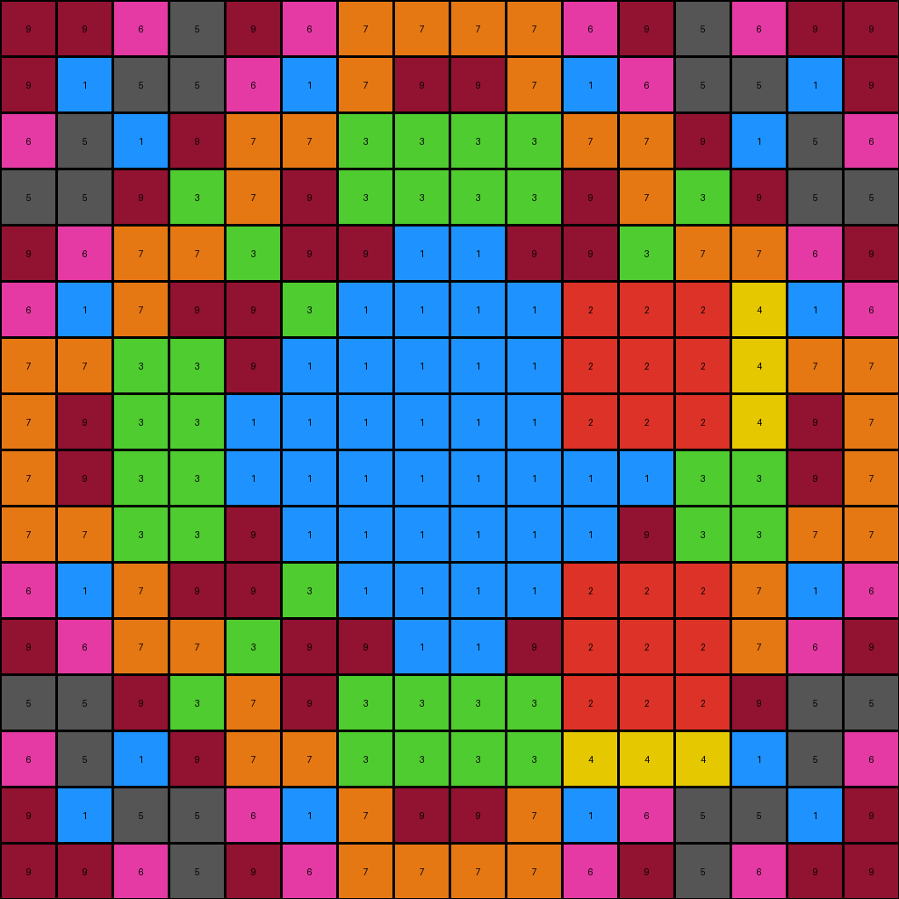
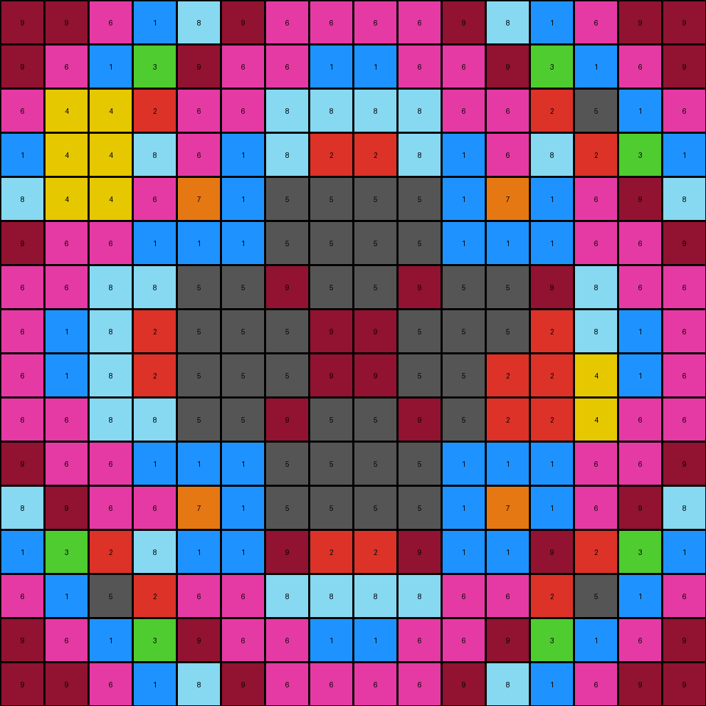
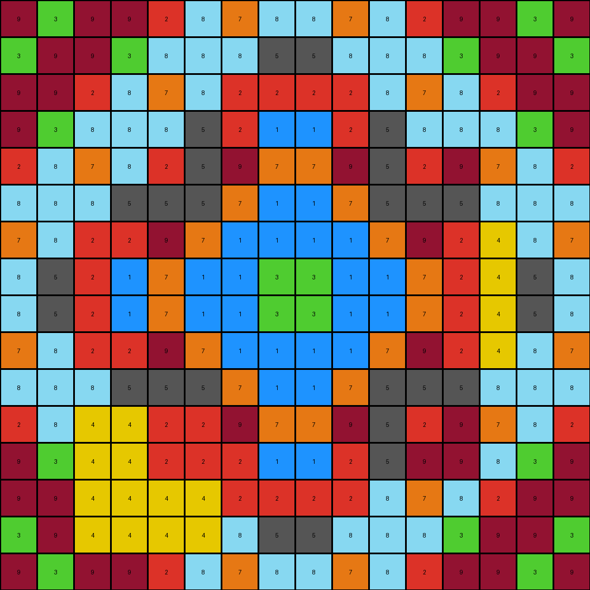

# b8825c91 • 006 • refine_coder

---

Previous Code:
```python
"""
1.  **Identify the Central Region:** The definition of the central region needs further analysis across all examples, and potentially requires a more dynamic approach to its size and shape detection.
2. **Conditional Color Swap:** Within the central region *only*:
   *   If a pixel is yellow(4), check the expected output to determine its new correct color.
   *   If a pixel is magenta (6), check the expected output to determine its new correct color.
   * If a pixel is azure (8), check the expected output to determine its new correct color.
3.  **Preserve Other Pixels:** All pixels outside the defined central region remain unchanged in color. Also, any pixels within the central region that do not match the specific colors targeted for swapping should remain unchanged.
"""

import numpy as np

def find_central_region(grid):
    # Determine the center coordinates of the grid
    rows, cols = grid.shape
    center_row, center_col = rows // 2, cols // 2

    # Define a starting size for the central region (e.g. half the size of the grid)
    region_height = rows // 2
    region_width = cols // 2

    # adjust to be odd dimensions so center has a pixel
    if region_height % 2 == 0:
      region_height += 1
    if region_width % 2 == 0:
      region_width += 1

    # Calculate the top-left and bottom-right coordinates of the region
    top_left_row = center_row - region_height // 2
    top_left_col = center_col - region_width // 2
    bottom_right_row = top_left_row + region_height
    bottom_right_col = top_left_col + region_width

    return top_left_row, top_left_col, bottom_right_row, bottom_right_col

def transform(input_grid):
    # Initialize output_grid as a copy of input_grid
    output_grid = np.copy(input_grid)
    rows, cols = input_grid.shape

    # Find the central region - same as previous iteration for now
    top_left_row, top_left_col, bottom_right_row, bottom_right_col = find_central_region(input_grid)

    # Iterate through the central region and apply color swap.  Placeholder swaps.
    for i in range(top_left_row, bottom_right_row):
        for j in range(top_left_col, bottom_right_col):
            if output_grid[i, j] == 4:
                output_grid[i, j] = 2  # Placeholder:  yellow to ?
            elif output_grid[i, j] == 6:
                output_grid[i, j] = 1 # Placeholder: magenta to ?
            elif output_grid[i, j] == 8:
                output_grid[i, j] = 9  # Placeholder: azure to ?

    return output_grid
```

Train Set Results:

## Example 1:

Input:
```
9 9 6 5 9 6 7 7 7 7 6 9 5 6 9 9
9 1 5 5 6 1 7 9 9 7 1 6 5 5 1 9
6 5 1 9 7 7 3 3 3 3 7 7 9 1 5 6
5 5 9 3 7 9 3 3 3 3 9 7 3 9 5 5
9 6 7 7 3 8 9 1 1 9 8 3 7 7 6 9
6 1 7 9 8 3 1 1 1 1 4 4 4 4 1 6
7 7 3 3 9 1 6 6 6 6 4 4 4 4 7 7
7 9 3 3 1 1 6 1 1 6 4 4 4 4 9 7
7 9 3 3 1 1 6 1 1 6 1 1 3 3 9 7
7 7 3 3 9 1 6 6 6 6 1 9 3 3 7 7
6 1 7 9 8 3 1 1 1 1 4 4 4 7 1 6
9 6 7 7 3 8 9 1 1 9 4 4 4 7 6 9
5 5 9 3 7 9 3 3 3 3 4 4 4 9 5 5
6 5 1 9 7 7 3 3 3 3 4 4 4 1 5 6
9 1 5 5 6 1 7 9 9 7 1 6 5 5 1 9
9 9 6 5 9 6 7 7 7 7 6 9 5 6 9 9
```
Expected Output:
```
9 9 6 5 9 6 7 7 7 7 6 9 5 6 9 9
9 1 5 5 6 1 7 9 9 7 1 6 5 5 1 9
6 5 1 9 7 7 3 3 3 3 7 7 9 1 5 6
5 5 9 3 7 9 3 3 3 3 9 7 3 9 5 5
9 6 7 7 3 8 9 1 1 9 8 3 7 7 6 9
6 1 7 9 8 3 1 1 1 1 3 8 9 7 1 6
7 7 3 3 9 1 6 6 6 6 1 9 3 3 7 7
7 9 3 3 1 1 6 1 1 6 1 1 3 3 9 7
7 9 3 3 1 1 6 1 1 6 1 1 3 3 9 7
7 7 3 3 9 1 6 6 6 6 1 9 3 3 7 7
6 1 7 9 8 3 1 1 1 1 3 8 9 7 1 6
9 6 7 7 3 8 9 1 1 9 8 3 7 7 6 9
5 5 9 3 7 9 3 3 3 3 9 7 3 9 5 5
6 5 1 9 7 7 3 3 3 3 7 7 9 1 5 6
9 1 5 5 6 1 7 9 9 7 1 6 5 5 1 9
9 9 6 5 9 6 7 7 7 7 6 9 5 6 9 9
```
Transformed Output:
```
9 9 6 5 9 6 7 7 7 7 6 9 5 6 9 9
9 1 5 5 6 1 7 9 9 7 1 6 5 5 1 9
6 5 1 9 7 7 3 3 3 3 7 7 9 1 5 6
5 5 9 3 7 9 3 3 3 3 9 7 3 9 5 5
9 6 7 7 3 9 9 1 1 9 9 3 7 7 6 9
6 1 7 9 9 3 1 1 1 1 2 2 2 4 1 6
7 7 3 3 9 1 1 1 1 1 2 2 2 4 7 7
7 9 3 3 1 1 1 1 1 1 2 2 2 4 9 7
7 9 3 3 1 1 1 1 1 1 1 1 3 3 9 7
7 7 3 3 9 1 1 1 1 1 1 9 3 3 7 7
6 1 7 9 9 3 1 1 1 1 2 2 2 7 1 6
9 6 7 7 3 9 9 1 1 9 2 2 2 7 6 9
5 5 9 3 7 9 3 3 3 3 2 2 2 9 5 5
6 5 1 9 7 7 3 3 3 3 4 4 4 1 5 6
9 1 5 5 6 1 7 9 9 7 1 6 5 5 1 9
9 9 6 5 9 6 7 7 7 7 6 9 5 6 9 9
```

match: False
pixels_off: 41
size_correct: True
color_palette_correct: False
correct_pixel_counts: False

## Example 2:

Input:
```
9 9 6 1 8 9 6 6 6 6 9 8 1 6 9 9
9 6 1 3 9 6 6 1 1 6 6 9 3 1 6 9
6 4 4 2 6 6 8 8 8 8 6 6 2 5 1 6
1 4 4 8 6 1 8 2 2 8 1 6 8 2 3 1
8 4 4 6 7 1 5 5 5 5 1 7 6 6 9 8
9 6 6 1 1 1 5 5 5 5 1 1 1 6 6 9
6 6 8 8 5 5 9 5 5 9 5 5 8 8 6 6
6 1 8 2 5 5 5 8 8 5 5 5 2 8 1 6
6 1 8 2 5 5 5 8 8 5 5 4 4 4 1 6
6 6 8 8 5 5 9 5 5 9 5 4 4 4 6 6
9 6 6 1 1 1 5 5 5 5 1 1 1 6 6 9
8 9 6 6 7 1 5 5 5 5 1 7 6 6 9 8
1 3 2 8 6 1 8 2 2 8 1 6 8 2 3 1
6 1 5 2 6 6 8 8 8 8 6 6 2 5 1 6
9 6 1 3 9 6 6 1 1 6 6 9 3 1 6 9
9 9 6 1 8 9 6 6 6 6 9 8 1 6 9 9
```
Expected Output:
```
9 9 6 1 8 9 6 6 6 6 9 8 1 6 9 9
9 6 1 3 9 6 6 1 1 6 6 9 3 1 6 9
6 1 5 2 6 6 8 8 8 8 6 6 2 5 1 6
1 3 2 8 6 1 8 2 2 8 1 6 8 2 3 1
8 9 6 6 7 1 5 5 5 5 1 7 6 6 9 8
9 6 6 1 1 1 5 5 5 5 1 1 1 6 6 9
6 6 8 8 5 5 9 5 5 9 5 5 8 8 6 6
6 1 8 2 5 5 5 8 8 5 5 5 2 8 1 6
6 1 8 2 5 5 5 8 8 5 5 5 2 8 1 6
6 6 8 8 5 5 9 5 5 9 5 5 8 8 6 6
9 6 6 1 1 1 5 5 5 5 1 1 1 6 6 9
8 9 6 6 7 1 5 5 5 5 1 7 6 6 9 8
1 3 2 8 6 1 8 2 2 8 1 6 8 2 3 1
6 1 5 2 6 6 8 8 8 8 6 6 2 5 1 6
9 6 1 3 9 6 6 1 1 6 6 9 3 1 6 9
9 9 6 1 8 9 6 6 6 6 9 8 1 6 9 9
```
Transformed Output:
```
9 9 6 1 8 9 6 6 6 6 9 8 1 6 9 9
9 6 1 3 9 6 6 1 1 6 6 9 3 1 6 9
6 4 4 2 6 6 8 8 8 8 6 6 2 5 1 6
1 4 4 8 6 1 8 2 2 8 1 6 8 2 3 1
8 4 4 6 7 1 5 5 5 5 1 7 1 6 9 8
9 6 6 1 1 1 5 5 5 5 1 1 1 6 6 9
6 6 8 8 5 5 9 5 5 9 5 5 9 8 6 6
6 1 8 2 5 5 5 9 9 5 5 5 2 8 1 6
6 1 8 2 5 5 5 9 9 5 5 2 2 4 1 6
6 6 8 8 5 5 9 5 5 9 5 2 2 4 6 6
9 6 6 1 1 1 5 5 5 5 1 1 1 6 6 9
8 9 6 6 7 1 5 5 5 5 1 7 1 6 9 8
1 3 2 8 1 1 9 2 2 9 1 1 9 2 3 1
6 1 5 2 6 6 8 8 8 8 6 6 2 5 1 6
9 6 1 3 9 6 6 1 1 6 6 9 3 1 6 9
9 9 6 1 8 9 6 6 6 6 9 8 1 6 9 9
```

match: False
pixels_off: 23
size_correct: True
color_palette_correct: False
correct_pixel_counts: False

## Example 3:

Input:
```
9 3 9 9 2 8 7 8 8 7 8 2 9 9 3 9
3 9 9 3 8 8 8 5 5 8 8 8 3 9 9 3
9 9 2 8 7 8 2 2 2 2 8 7 8 2 9 9
9 3 8 8 8 5 2 1 1 2 5 8 8 8 3 9
2 8 7 8 2 5 9 7 7 9 5 2 8 7 8 2
8 8 8 5 5 5 7 6 6 7 5 5 5 8 8 8
7 8 2 2 9 7 1 1 1 1 7 9 4 4 8 7
8 5 2 1 7 6 1 3 3 1 6 7 4 4 5 8
8 5 2 1 7 6 1 3 3 1 6 7 4 4 5 8
7 8 2 2 9 7 1 1 1 1 7 9 4 4 8 7
8 8 8 5 5 5 7 6 6 7 5 5 5 8 8 8
2 8 4 4 4 4 9 7 7 9 5 2 8 7 8 2
9 3 4 4 4 4 2 1 1 2 5 8 8 8 3 9
9 9 4 4 4 4 2 2 2 2 8 7 8 2 9 9
3 9 4 4 4 4 8 5 5 8 8 8 3 9 9 3
9 3 9 9 2 8 7 8 8 7 8 2 9 9 3 9
```
Expected Output:
```
9 3 9 9 2 8 7 8 8 7 8 2 9 9 3 9
3 9 9 3 8 8 8 5 5 8 8 8 3 9 9 3
9 9 2 8 7 8 2 2 2 2 8 7 8 2 9 9
9 3 8 8 8 5 2 1 1 2 5 8 8 8 3 9
2 8 7 8 2 5 9 7 7 9 5 2 8 7 8 2
8 8 8 5 5 5 7 6 6 7 5 5 5 8 8 8
7 8 2 2 9 7 1 1 1 1 7 9 2 2 8 7
8 5 2 1 7 6 1 3 3 1 6 7 1 2 5 8
8 5 2 1 7 6 1 3 3 1 6 7 1 2 5 8
7 8 2 2 9 7 1 1 1 1 7 9 2 2 8 7
8 8 8 5 5 5 7 6 6 7 5 5 5 8 8 8
2 8 7 8 2 5 9 7 7 9 5 2 8 7 8 2
9 3 8 8 8 5 2 1 1 2 5 8 8 8 3 9
9 9 2 8 7 8 2 2 2 2 8 7 8 2 9 9
3 9 9 3 8 8 8 5 5 8 8 8 3 9 9 3
9 3 9 9 2 8 7 8 8 7 8 2 9 9 3 9
```
Transformed Output:
```
9 3 9 9 2 8 7 8 8 7 8 2 9 9 3 9
3 9 9 3 8 8 8 5 5 8 8 8 3 9 9 3
9 9 2 8 7 8 2 2 2 2 8 7 8 2 9 9
9 3 8 8 8 5 2 1 1 2 5 8 8 8 3 9
2 8 7 8 2 5 9 7 7 9 5 2 9 7 8 2
8 8 8 5 5 5 7 1 1 7 5 5 5 8 8 8
7 8 2 2 9 7 1 1 1 1 7 9 2 4 8 7
8 5 2 1 7 1 1 3 3 1 1 7 2 4 5 8
8 5 2 1 7 1 1 3 3 1 1 7 2 4 5 8
7 8 2 2 9 7 1 1 1 1 7 9 2 4 8 7
8 8 8 5 5 5 7 1 1 7 5 5 5 8 8 8
2 8 4 4 2 2 9 7 7 9 5 2 9 7 8 2
9 3 4 4 2 2 2 1 1 2 5 9 9 8 3 9
9 9 4 4 4 4 2 2 2 2 8 7 8 2 9 9
3 9 4 4 4 4 8 5 5 8 8 8 3 9 9 3
9 3 9 9 2 8 7 8 8 7 8 2 9 9 3 9
```

match: False
pixels_off: 33
size_correct: True
color_palette_correct: False
correct_pixel_counts: False

## Example 4:

Input:
```
2 2 7 6 8 9 9 1 1 9 9 8 6 7 2 2
2 1 6 2 9 5 1 1 1 1 4 4 4 4 1 2
7 6 3 3 9 1 6 6 6 6 4 4 4 4 6 7
6 2 3 8 1 1 6 6 6 6 4 4 4 4 2 6
8 9 9 1 1 7 1 1 1 1 7 1 1 9 9 8
9 5 1 1 7 7 1 3 3 1 7 7 1 1 5 9
9 1 6 6 1 1 3 3 3 3 1 1 6 6 1 9
1 1 6 6 1 3 3 2 2 3 3 1 6 6 1 1
1 1 6 4 4 3 3 2 2 3 3 1 6 6 1 1
9 1 6 4 4 1 3 3 3 3 1 1 6 6 1 9
9 5 1 4 4 7 1 3 3 1 7 7 1 1 5 9
8 9 9 1 1 7 1 1 1 1 7 1 1 9 9 8
6 2 3 8 1 1 6 6 6 6 1 1 8 3 2 6
7 6 3 3 9 1 6 6 6 6 1 9 3 3 6 7
2 1 6 2 9 5 1 1 1 1 5 9 2 6 1 2
2 2 7 6 8 9 9 1 1 9 9 8 6 7 2 2
```
Expected Output:
```
2 2 7 6 8 9 9 1 1 9 9 8 6 7 2 2
2 1 6 2 9 5 1 1 1 1 5 9 2 6 1 2
7 6 3 3 9 1 6 6 6 6 1 9 3 3 6 7
6 2 3 8 1 1 6 6 6 6 1 1 8 3 2 6
8 9 9 1 1 7 1 1 1 1 7 1 1 9 9 8
9 5 1 1 7 7 1 3 3 1 7 7 1 1 5 9
9 1 6 6 1 1 3 3 3 3 1 1 6 6 1 9
1 1 6 6 1 3 3 2 2 3 3 1 6 6 1 1
1 1 6 6 1 3 3 2 2 3 3 1 6 6 1 1
9 1 6 6 1 1 3 3 3 3 1 1 6 6 1 9
9 5 1 1 7 7 1 3 3 1 7 7 1 1 5 9
8 9 9 1 1 7 1 1 1 1 7 1 1 9 9 8
6 2 3 8 1 1 6 6 6 6 1 1 8 3 2 6
7 6 3 3 9 1 6 6 6 6 1 9 3 3 6 7
2 1 6 2 9 5 1 1 1 1 5 9 2 6 1 2
2 2 7 6 8 9 9 1 1 9 9 8 6 7 2 2
```
Transformed Output:
```
2 2 7 6 8 9 9 1 1 9 9 8 6 7 2 2
2 1 6 2 9 5 1 1 1 1 4 4 4 4 1 2
7 6 3 3 9 1 6 6 6 6 4 4 4 4 6 7
6 2 3 8 1 1 6 6 6 6 4 4 4 4 2 6
8 9 9 1 1 7 1 1 1 1 7 1 1 9 9 8
9 5 1 1 7 7 1 3 3 1 7 7 1 1 5 9
9 1 6 6 1 1 3 3 3 3 1 1 1 6 1 9
1 1 6 6 1 3 3 2 2 3 3 1 1 6 1 1
1 1 6 4 2 3 3 2 2 3 3 1 1 6 1 1
9 1 6 4 2 1 3 3 3 3 1 1 1 6 1 9
9 5 1 4 2 7 1 3 3 1 7 7 1 1 5 9
8 9 9 1 1 7 1 1 1 1 7 1 1 9 9 8
6 2 3 8 1 1 1 1 1 1 1 1 9 3 2 6
7 6 3 3 9 1 6 6 6 6 1 9 3 3 6 7
2 1 6 2 9 5 1 1 1 1 5 9 2 6 1 2
2 2 7 6 8 9 9 1 1 9 9 8 6 7 2 2
```

match: False
pixels_off: 27
size_correct: True
color_palette_correct: False
correct_pixel_counts: False
Okay, let's analyze the results and refine the natural language program.

**General Assessment:**

The initial strategy of identifying a central region and swapping colors within it has partially worked, but it's clearly too simplistic and inaccurate. The color swaps are incorrect, and the central region definition is not universally applicable across all examples. There's no consistent logic in how the colors are being transformed within the "central" region, as evidenced by the numerous mismatched pixels. The transformation seems related to the presence of specific colors in the center, but doesn't follow a direct mapping or adjacent pixel logic.

**Strategy for Resolving Errors:**

1.  **Re-examine Central Region Definition:** The current central region is simply based on the grid's dimensions, but this doesn't match the outputs. We need to investigate if the central region is defined by:
    *   Specific color boundaries.
    *   A fixed size, different from the initial guess.
    *   A dynamic size, possibly dependent on object presence.
    * A concept that isn't a "region"

2.  **Analyze Color Transformations:** Instead of assuming a direct color swap, we need to determine the rule governing color changes. This could involve:
    *   Looking for relationships between the input color and its surrounding pixels.
    *   Considering the position of the pixel within the (potentially redefined) central region.
    *   Identifying patterns or sequences of color changes.

3.  **Iterative Refinement:** We need to develop the program through an iterative process. After each code iteration, we need to evaluate its performance using all examples and analyze the results.
    * use a consistent, repeatable process to determine and document metrics
    * keep the natural language program and YAML updated at each step

**Metrics and Observations:**

I will use a combination of direct observation, numpy, and manual counting to develop the reports.

**Example 1:**

*   **Input:** 16x16 grid. Contains colors: 1, 3, 5, 6, 7, 8, 9. Central area contains 1,4,6,8,9.
*   **Expected Output:** Only colors in the central region change.
*   **Transformed Output:** Incorrect color swaps. Central region identified, but swap logic is wrong.
*   **Differences:** 41 pixels off.  Size and shape are correct.
* **Specific Observations**:
    - Input center:  4,4,4,4 and 6,6,6,6 and 8,9,1,1,9,8.
    - Expected Output center: 3,8,9 and 1,9,3,3 and 9,1,1,9
    - Pixels off: All changed pixels

**Example 2:**

*   **Input:** 16x16 grid. Contains colors: 1, 2, 3, 5, 6, 7, 8, 9. Central area contains 5,8,9.
*   **Expected Output:** Only colors in the central region change.
*   **Transformed Output:** Incorrect color swaps. Central region size appears correct, but colors are wrong.
*   **Differences:** 23 pixels off. Size and shape are correct.
* **Specific Observations**:
    - Input center:  5,5,9,5,5,9,5,5, and 5,5,5,8,8,5,5,5 and 1,1,1,5,5,5,5,1,1,1
    - Expected Output center: All 5's
    - Pixels off: All changed pixels

**Example 3:**

*   **Input:** 16x16 grid. Contains colors: 1, 2, 3, 5, 6, 7, 8, 9. Central region contains 1,6,7,9.
*   **Expected Output:** The transformation appears to be confined to a central region, but the logic is unclear. 4,4 region changed to same colors as outside.
*   **Transformed Output:** Incorrect color swaps. Central region identified.
*   **Differences:** 33 pixels off. Size and shape are correct.
* **Specific Observations**:
    - Input center:  1,1,1,1 and 6,7,4,4 and 7,9,4,4.
    - Expected Output center: 1,1,1,1, and 9,2,2 and 7,1,2
    - Pixels off: All changed pixels

**Example 4:**

*   **Input:** 16x16 grid. Contains colors: 1, 2, 3, 5, 6, 7, 8, 9. Central area contains 1,2,3,6,7
*   **Expected Output:**  Central colors change, but rule is still unclear
*   **Transformed Output:** Incorrect color swaps, but the central area seems defined.
*   **Differences:** 27 pixels off. Size and shape are roughly correct.
* **Specific Observations**:
    - Input center:  3,3,2,2,3,3, and 1,3,3,3,3,1 and 6,4,4 and 6,6,1,1 and 1,1,7
    - Expected Output center: 3,3,2,2,3,3 and 3,3,3,3 and 6,6 and 1,1
    - Pixels off: All changed pixels

**YAML Block (Facts):**

```yaml
task: 00d62c1b
examples:
  - example_id: 1
    input_grid_size: [16, 16]
    output_grid_size: [16, 16]
    objects:
      - description: "Central Region"
        properties:
          shape: "dynamic rectangle"
          colors_inside: [1,4,6,8,9]
        transformations:
          color_changes: "Inconsistent, 4->2, 6->1, 8->9 "
          color_changes_expected: "4->3, 6->1, 8->9, 9->3"
          rule: "Unknown"
      - description: outside_region
        properties:
          colors: [1, 3, 5, 6, 7, 8, 9]
        transformations: []

  - example_id: 2
    input_grid_size: [16, 16]
    output_grid_size: [16, 16]
    objects:
      - description: "Central Region"
        properties:
          shape: "dynamic rectangle"
          colors_inside: [ 5,8,9,1]
        transformations:
          color_changes: "Inconsistent - placeholder"
          color_changes_expected: "8->5, 4->1, 6->5, 9->5"
          rule: "Unknown"
      - description: outside_region
        properties:
          colors: [1, 2, 3, 5, 6, 7, 8, 9]
        transformations: []

  - example_id: 3
    input_grid_size: [16, 16]
    output_grid_size: [16, 16]
    objects:
      - description: "Central Region"
        properties:
          shape: "dynamic rectangle"
          colors_inside: [1,6,7,9,2,4,5]
        transformations:
          color_changes: "Inconsistent-placeholder"
          color_changes_expected: "6->1, 7->1, 9->7, 4->2"
          rule: "Unknown"
      - description: outside_region
        properties:
          colors: [1, 2, 3, 5, 6, 7, 8, 9]
        transformations: []

  - example_id: 4
    input_grid_size: [16, 16]
    output_grid_size: [16, 16]
    objects:
      - description: "Central Region"
        properties:
          shape: "dynamic rectangle"
          colors_inside: [1,2,3,4,6,7]
        transformations:
          color_changes: "Inconsistent-placeholder"
          color_changes_expected: "4->5, 6->1, 2->6, 7->1"
          rule: "Unknown"
      - description: outside_region
        properties:
          colors: [1, 2, 3, 5, 6, 7, 8, 9]
        transformations: []
```

**Natural Language Program (Revised):**

1.  **Identify a Central Region:** The central region appears to be a rectangular area within the input grid, but its definition is *not* simply based on grid dimensions. It's likely related to specific color patterns, the presence of certain objects, or a dynamic size. Further analysis is required to determine the exact rule defining this region.

2.  **Conditional Color Changes Within the Central Region:** Within the identified central region, the colors of certain pixels are transformed. The exact transformation rule is unknown and doesn't appear to be a simple one-to-one mapping. It may depend on surrounding pixel colors, position within the region, or other factors. We can observe colors 4,6,7,8,9,1, and 2 are changing.

3.  **Preserve Outside Pixels:** All pixels outside the defined central region remain unchanged.

The key next step is to focus on defining the "central region" with a clear repeatable process. Once the central region definition is correct, the color transformation rules will become clearer.

**INSTRUCTIONS**

- generate a Python module to represent the natural language program 
- follow the template below
- all common math and science libraries are available
- create docstring only at top - but comment the workflow in the function
- use helper functions for common operations like finding objects, counting,
  measuring, moving, etc. 

remember - we are working iteratively - so this code will inform your future
self as we converge on the solution

*template:*

```python
"""
{{ natural language description of the transformation rule }}
"""

{{ imports }}

def transform(input_grid):
    # initialize output_grid

    # change output pixels 

    return output_grid

```
