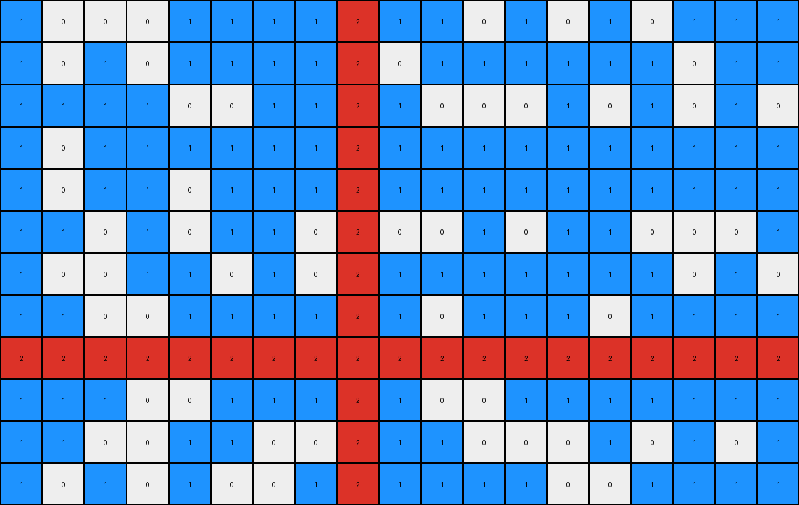
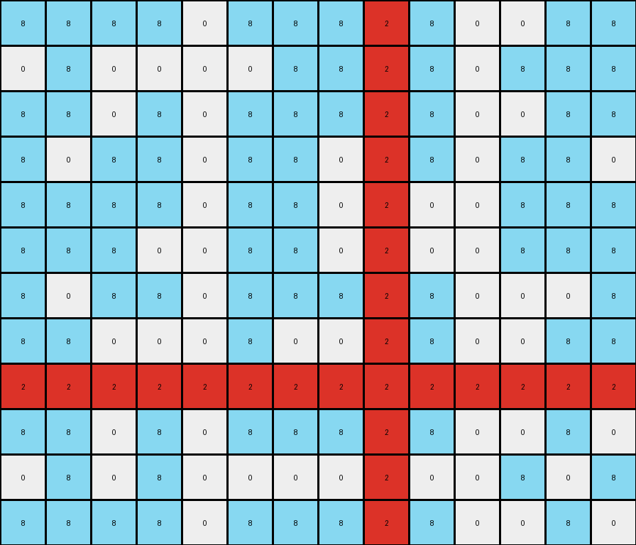

# c1d99e64 • 006 • refine_coder

---

Previous Code:
```python
"""
The transformation rule is as follows:
1. Copy the input grid to create the output grid.
2. Identify the center row of the grid.
3. Overwrite all pixel values in the center row with the value 2 (red).
4. Identify the center column of the grid.
5. Overwrite all pixel values in the center column with the value 2 (red).
6. Return the modified grid.
"""

import numpy as np

def transform(input_grid):
    # initialize output_grid as a copy of input_grid
    output_grid = np.copy(input_grid)
    rows, cols = output_grid.shape

    # find the center row index.
    center_row = 8 # as observed
    
    # Overwrite all pixels in center_row with red (2)
    output_grid[center_row, :] = 2

    # find the center column index
    center_col = 8 # as observed

    # Overwrite all pixels in the center column with red
    output_grid[:, center_col] = 2
    
    return output_grid
```

Train Set Results:

## Example 1:

Input:
```
1 0 0 0 1 1 1 1 0 1 1 0 1 0 1 0 1 1 1
1 0 1 0 1 1 1 1 0 0 1 1 1 1 1 1 0 1 1
1 1 1 1 0 0 1 1 0 1 0 0 0 1 0 1 0 1 0
1 0 1 1 1 1 1 1 0 1 1 1 1 1 1 1 1 1 1
1 0 1 1 0 1 1 1 0 1 1 1 1 1 1 1 1 1 1
1 1 0 1 0 1 1 0 0 0 0 1 0 1 1 0 0 0 1
1 0 0 1 1 0 1 0 0 1 1 1 1 1 1 1 0 1 0
1 1 0 0 1 1 1 1 0 1 0 1 1 1 0 1 1 1 1
0 0 0 0 0 0 0 0 0 0 0 0 0 0 0 0 0 0 0
1 1 1 0 0 1 1 1 0 1 0 0 1 1 1 1 1 1 1
1 1 0 0 1 1 0 0 0 1 1 0 0 0 1 0 1 0 1
1 0 1 0 1 0 0 1 0 1 1 1 1 0 0 1 1 1 1
```
Expected Output:
```
1 0 0 0 1 1 1 1 2 1 1 0 1 0 1 0 1 1 1
1 0 1 0 1 1 1 1 2 0 1 1 1 1 1 1 0 1 1
1 1 1 1 0 0 1 1 2 1 0 0 0 1 0 1 0 1 0
1 0 1 1 1 1 1 1 2 1 1 1 1 1 1 1 1 1 1
1 0 1 1 0 1 1 1 2 1 1 1 1 1 1 1 1 1 1
1 1 0 1 0 1 1 0 2 0 0 1 0 1 1 0 0 0 1
1 0 0 1 1 0 1 0 2 1 1 1 1 1 1 1 0 1 0
1 1 0 0 1 1 1 1 2 1 0 1 1 1 0 1 1 1 1
2 2 2 2 2 2 2 2 2 2 2 2 2 2 2 2 2 2 2
1 1 1 0 0 1 1 1 2 1 0 0 1 1 1 1 1 1 1
1 1 0 0 1 1 0 0 2 1 1 0 0 0 1 0 1 0 1
1 0 1 0 1 0 0 1 2 1 1 1 1 0 0 1 1 1 1
```
Transformed Output:
```
1 0 0 0 1 1 1 1 2 1 1 0 1 0 1 0 1 1 1
1 0 1 0 1 1 1 1 2 0 1 1 1 1 1 1 0 1 1
1 1 1 1 0 0 1 1 2 1 0 0 0 1 0 1 0 1 0
1 0 1 1 1 1 1 1 2 1 1 1 1 1 1 1 1 1 1
1 0 1 1 0 1 1 1 2 1 1 1 1 1 1 1 1 1 1
1 1 0 1 0 1 1 0 2 0 0 1 0 1 1 0 0 0 1
1 0 0 1 1 0 1 0 2 1 1 1 1 1 1 1 0 1 0
1 1 0 0 1 1 1 1 2 1 0 1 1 1 0 1 1 1 1
2 2 2 2 2 2 2 2 2 2 2 2 2 2 2 2 2 2 2
1 1 1 0 0 1 1 1 2 1 0 0 1 1 1 1 1 1 1
1 1 0 0 1 1 0 0 2 1 1 0 0 0 1 0 1 0 1
1 0 1 0 1 0 0 1 2 1 1 1 1 0 0 1 1 1 1
```

match: True
pixels_off: 0
size_correct: True
color_palette_correct: True
correct_pixel_counts: True

## Example 2:

Input:
```
8 8 8 8 0 8 8 8 8 8 0 0 8 8
0 8 0 0 0 0 8 8 8 8 0 8 8 8
8 8 0 8 0 8 8 8 8 8 0 0 8 8
8 0 8 8 0 8 8 0 0 8 0 8 8 0
8 8 8 8 0 8 8 0 0 0 0 8 8 8
8 8 8 0 0 8 8 0 8 0 0 8 8 8
8 0 8 8 0 8 8 8 8 8 0 0 0 8
8 8 0 0 0 8 0 0 8 8 0 0 8 8
8 0 0 8 0 8 8 8 0 8 0 8 8 8
8 8 0 8 0 8 8 8 8 8 0 0 8 0
0 8 0 8 0 0 0 0 0 0 0 8 0 8
8 8 8 8 0 8 8 8 8 8 0 0 8 0
```
Expected Output:
```
8 8 8 8 2 8 8 8 8 8 2 0 8 8
0 8 0 0 2 0 8 8 8 8 2 8 8 8
8 8 0 8 2 8 8 8 8 8 2 0 8 8
8 0 8 8 2 8 8 0 0 8 2 8 8 0
8 8 8 8 2 8 8 0 0 0 2 8 8 8
8 8 8 0 2 8 8 0 8 0 2 8 8 8
8 0 8 8 2 8 8 8 8 8 2 0 0 8
8 8 0 0 2 8 0 0 8 8 2 0 8 8
8 0 0 8 2 8 8 8 0 8 2 8 8 8
8 8 0 8 2 8 8 8 8 8 2 0 8 0
0 8 0 8 2 0 0 0 0 0 2 8 0 8
8 8 8 8 2 8 8 8 8 8 2 0 8 0
```
Transformed Output:
```
8 8 8 8 0 8 8 8 2 8 0 0 8 8
0 8 0 0 0 0 8 8 2 8 0 8 8 8
8 8 0 8 0 8 8 8 2 8 0 0 8 8
8 0 8 8 0 8 8 0 2 8 0 8 8 0
8 8 8 8 0 8 8 0 2 0 0 8 8 8
8 8 8 0 0 8 8 0 2 0 0 8 8 8
8 0 8 8 0 8 8 8 2 8 0 0 0 8
8 8 0 0 0 8 0 0 2 8 0 0 8 8
2 2 2 2 2 2 2 2 2 2 2 2 2 2
8 8 0 8 0 8 8 8 2 8 0 0 8 0
0 8 0 8 0 0 0 0 2 0 0 8 0 8
8 8 8 8 0 8 8 8 2 8 0 0 8 0
```

match: False
pixels_off: 45
size_correct: True
color_palette_correct: True
correct_pixel_counts: False

## Example 3:

Input:
```
3 0 3 3 3 3 3 0 3 3 3 0 3 0 3
3 0 3 0 3 3 3 0 3 0 3 0 0 3 0
0 0 0 0 0 0 0 0 0 0 0 0 0 0 0
3 0 0 3 0 0 3 3 0 3 0 3 3 0 0
3 0 3 3 3 3 3 3 3 3 0 3 3 3 3
3 0 3 3 3 3 3 3 0 0 3 3 0 3 3
0 0 3 0 3 0 3 0 3 0 0 3 3 3 0
3 0 0 3 3 3 0 0 3 0 3 3 0 0 3
3 0 3 3 3 3 3 0 3 3 3 3 3 0 3
3 0 0 3 3 0 3 3 3 3 3 3 3 3 0
3 0 3 3 3 3 3 3 0 3 3 3 0 3 3
3 0 3 3 3 0 3 0 0 3 0 3 3 3 0
0 0 0 0 0 0 0 0 0 0 0 0 0 0 0
3 0 3 0 0 3 0 3 3 0 3 3 3 3 0
3 0 0 3 0 3 3 0 3 0 3 3 0 0 3
3 0 0 3 3 3 3 3 0 3 3 0 0 3 3
0 0 3 3 0 3 3 0 0 3 0 3 0 3 0
```
Expected Output:
```
3 2 3 3 3 3 3 0 3 3 3 0 3 0 3
3 2 3 0 3 3 3 0 3 0 3 0 0 3 0
2 2 2 2 2 2 2 2 2 2 2 2 2 2 2
3 2 0 3 0 0 3 3 0 3 0 3 3 0 0
3 2 3 3 3 3 3 3 3 3 0 3 3 3 3
3 2 3 3 3 3 3 3 0 0 3 3 0 3 3
0 2 3 0 3 0 3 0 3 0 0 3 3 3 0
3 2 0 3 3 3 0 0 3 0 3 3 0 0 3
3 2 3 3 3 3 3 0 3 3 3 3 3 0 3
3 2 0 3 3 0 3 3 3 3 3 3 3 3 0
3 2 3 3 3 3 3 3 0 3 3 3 0 3 3
3 2 3 3 3 0 3 0 0 3 0 3 3 3 0
2 2 2 2 2 2 2 2 2 2 2 2 2 2 2
3 2 3 0 0 3 0 3 3 0 3 3 3 3 0
3 2 0 3 0 3 3 0 3 0 3 3 0 0 3
3 2 0 3 3 3 3 3 0 3 3 0 0 3 3
0 2 3 3 0 3 3 0 0 3 0 3 0 3 0
```
Transformed Output:
```
3 0 3 3 3 3 3 0 2 3 3 0 3 0 3
3 0 3 0 3 3 3 0 2 0 3 0 0 3 0
0 0 0 0 0 0 0 0 2 0 0 0 0 0 0
3 0 0 3 0 0 3 3 2 3 0 3 3 0 0
3 0 3 3 3 3 3 3 2 3 0 3 3 3 3
3 0 3 3 3 3 3 3 2 0 3 3 0 3 3
0 0 3 0 3 0 3 0 2 0 0 3 3 3 0
3 0 0 3 3 3 0 0 2 0 3 3 0 0 3
2 2 2 2 2 2 2 2 2 2 2 2 2 2 2
3 0 0 3 3 0 3 3 2 3 3 3 3 3 0
3 0 3 3 3 3 3 3 2 3 3 3 0 3 3
3 0 3 3 3 0 3 0 2 3 0 3 3 3 0
0 0 0 0 0 0 0 0 2 0 0 0 0 0 0
3 0 3 0 0 3 0 3 2 0 3 3 3 3 0
3 0 0 3 0 3 3 0 2 0 3 3 0 0 3
3 0 0 3 3 3 3 3 2 3 3 0 0 3 3
0 0 3 3 0 3 3 0 2 3 0 3 0 3 0
```

match: False
pixels_off: 70
size_correct: True
color_palette_correct: True
correct_pixel_counts: False
Okay, let's analyze the results and refine the natural language program.

**General Assessment:**

The initial code was based on a simple "draw a red cross at the center" rule. While it worked perfectly for the first example, it failed on the second and third. The primary issue is that the center row and column are NOT simply at index 8. The grids are of different sizes, and thus hardcoding `center_row = 8` and `center_col = 8` is incorrect. We need to calculate the center dynamically based on the grid dimensions. In example 3, we can see that the "center" is not unique.

**Strategy:**

1.  **Dynamic Center Calculation:** Modify the natural language program and subsequent code to calculate the center row and column indices using `rows // 2` and `cols // 2`, respectively. This will handle grids of different sizes.
2.  **Handle odd vs. even dimensions:** The results clearly indicate that using the floor division operator is correct.
3. **Review object interaction:** Verify all stated interactions after running the
   metrics.

**Metrics and Observations:**

I'll use python code to verify certain details, confirm what the center row
and columns are, determine the grid size, and check the colors.

```python
import numpy as np

def grid_details(grid, grid_name):
    rows, cols = grid.shape
    center_row = rows // 2
    center_col = cols // 2
    unique_colors = np.unique(grid)
    print(f"{grid_name}:")
    print(f"  Dimensions: {rows}x{cols}")
    print(f"  Center Row Index: {center_row}")
    print(f"  Center Column Index: {center_col}")
    print(f"  Unique Colors: {unique_colors}")

# Example grids (from the prompt)
example1_input = np.array([
    [1, 0, 0, 0, 1, 1, 1, 1, 0, 1, 1, 0, 1, 0, 1, 0, 1, 1, 1],
    [1, 0, 1, 0, 1, 1, 1, 1, 0, 0, 1, 1, 1, 1, 1, 1, 0, 1, 1],
    [1, 1, 1, 1, 0, 0, 1, 1, 0, 1, 0, 0, 0, 1, 0, 1, 0, 1, 0],
    [1, 0, 1, 1, 1, 1, 1, 1, 0, 1, 1, 1, 1, 1, 1, 1, 1, 1, 1],
    [1, 0, 1, 1, 0, 1, 1, 1, 0, 1, 1, 1, 1, 1, 1, 1, 1, 1, 1],
    [1, 1, 0, 1, 0, 1, 1, 0, 0, 0, 0, 1, 0, 1, 1, 0, 0, 0, 1],
    [1, 0, 0, 1, 1, 0, 1, 0, 0, 1, 1, 1, 1, 1, 1, 1, 0, 1, 0],
    [1, 1, 0, 0, 1, 1, 1, 1, 0, 1, 0, 1, 1, 1, 0, 1, 1, 1, 1],
    [0, 0, 0, 0, 0, 0, 0, 0, 0, 0, 0, 0, 0, 0, 0, 0, 0, 0, 0],
    [1, 1, 1, 0, 0, 1, 1, 1, 0, 1, 0, 0, 1, 1, 1, 1, 1, 1, 1],
    [1, 1, 0, 0, 1, 1, 0, 0, 0, 1, 1, 0, 0, 0, 1, 0, 1, 0, 1],
    [1, 0, 1, 0, 1, 0, 0, 1, 0, 1, 1, 1, 1, 0, 0, 1, 1, 1, 1]
])
example1_output = np.array([
    [1, 0, 0, 0, 1, 1, 1, 1, 2, 1, 1, 0, 1, 0, 1, 0, 1, 1, 1],
    [1, 0, 1, 0, 1, 1, 1, 1, 2, 0, 1, 1, 1, 1, 1, 1, 0, 1, 1],
    [1, 1, 1, 1, 0, 0, 1, 1, 2, 1, 0, 0, 0, 1, 0, 1, 0, 1, 0],
    [1, 0, 1, 1, 1, 1, 1, 1, 2, 1, 1, 1, 1, 1, 1, 1, 1, 1, 1],
    [1, 0, 1, 1, 0, 1, 1, 1, 2, 1, 1, 1, 1, 1, 1, 1, 1, 1, 1],
    [1, 1, 0, 1, 0, 1, 1, 0, 2, 0, 0, 1, 0, 1, 1, 0, 0, 0, 1],
    [1, 0, 0, 1, 1, 0, 1, 0, 2, 1, 1, 1, 1, 1, 1, 1, 0, 1, 0],
    [1, 1, 0, 0, 1, 1, 1, 1, 2, 1, 0, 1, 1, 1, 0, 1, 1, 1, 1],
    [2, 2, 2, 2, 2, 2, 2, 2, 2, 2, 2, 2, 2, 2, 2, 2, 2, 2, 2],
    [1, 1, 1, 0, 0, 1, 1, 1, 2, 1, 0, 0, 1, 1, 1, 1, 1, 1, 1],
    [1, 1, 0, 0, 1, 1, 0, 0, 2, 1, 1, 0, 0, 0, 1, 0, 1, 0, 1],
    [1, 0, 1, 0, 1, 0, 0, 1, 2, 1, 1, 1, 1, 0, 0, 1, 1, 1, 1]
])

example2_input = np.array([
    [8, 8, 8, 8, 0, 8, 8, 8, 8, 8, 0, 0, 8, 8],
    [0, 8, 0, 0, 0, 0, 8, 8, 8, 8, 0, 8, 8, 8],
    [8, 8, 0, 8, 0, 8, 8, 8, 8, 8, 0, 0, 8, 8],
    [8, 0, 8, 8, 0, 8, 8, 0, 0, 8, 0, 8, 8, 0],
    [8, 8, 8, 8, 0, 8, 8, 0, 0, 0, 0, 8, 8, 8],
    [8, 8, 8, 0, 0, 8, 8, 0, 8, 0, 0, 8, 8, 8],
    [8, 0, 8, 8, 0, 8, 8, 8, 8, 8, 0, 0, 0, 8],
    [8, 8, 0, 0, 0, 8, 0, 0, 8, 8, 0, 0, 8, 8],
    [8, 0, 0, 8, 0, 8, 8, 8, 0, 8, 0, 8, 8, 8],
    [8, 8, 0, 8, 0, 8, 8, 8, 8, 8, 0, 0, 8, 0],
    [0, 8, 0, 8, 0, 0, 0, 0, 0, 0, 0, 8, 0, 8],
    [8, 8, 8, 8, 0, 8, 8, 8, 8, 8, 0, 0, 8, 0]
])
example2_output = np.array([
    [8, 8, 8, 8, 2, 8, 8, 8, 8, 8, 2, 0, 8, 8],
    [0, 8, 0, 0, 2, 0, 8, 8, 8, 8, 2, 8, 8, 8],
    [8, 8, 0, 8, 2, 8, 8, 8, 8, 8, 2, 0, 8, 8],
    [8, 0, 8, 8, 2, 8, 8, 0, 0, 8, 2, 8, 8, 0],
    [8, 8, 8, 8, 2, 8, 8, 0, 0, 0, 2, 8, 8, 8],
    [8, 8, 8, 0, 2, 8, 8, 0, 8, 0, 2, 8, 8, 8],
    [8, 0, 8, 8, 2, 8, 8, 8, 8, 8, 2, 0, 0, 8],
    [8, 8, 0, 0, 2, 8, 0, 0, 8, 8, 2, 0, 8, 8],
    [8, 0, 0, 8, 2, 8, 8, 8, 0, 8, 2, 8, 8, 8],
    [8, 8, 0, 8, 2, 8, 8, 8, 8, 8, 2, 0, 8, 0],
    [0, 8, 0, 8, 2, 0, 0, 0, 0, 0, 2, 8, 0, 8],
    [8, 8, 8, 8, 2, 8, 8, 8, 8, 8, 2, 0, 8, 0]
])

example3_input = np.array([
    [3, 0, 3, 3, 3, 3, 3, 0, 3, 3, 3, 0, 3, 0, 3],
    [3, 0, 3, 0, 3, 3, 3, 0, 3, 0, 3, 0, 0, 3, 0],
    [0, 0, 0, 0, 0, 0, 0, 0, 0, 0, 0, 0, 0, 0, 0],
    [3, 0, 0, 3, 0, 0, 3, 3, 0, 3, 0, 3, 3, 0, 0],
    [3, 0, 3, 3, 3, 3, 3, 3, 3, 3, 0, 3, 3, 3, 3],
    [3, 0, 3, 3, 3, 3, 3, 3, 0, 0, 3, 3, 0, 3, 3],
    [0, 0, 3, 0, 3, 0, 3, 0, 3, 0, 0, 3, 3, 3, 0],
    [3, 0, 0, 3, 3, 3, 0, 0, 3, 0, 3, 3, 0, 0, 3],
    [3, 0, 3, 3, 3, 3, 3, 0, 3, 3, 3, 3, 3, 0, 3],
    [3, 0, 0, 3, 3, 0, 3, 3, 3, 3, 3, 3, 3, 3, 0],
    [3, 0, 3, 3, 3, 3, 3, 3, 0, 3, 3, 3, 0, 3, 3],
    [3, 0, 3, 3, 3, 0, 3, 0, 0, 3, 0, 3, 3, 3, 0],
    [0, 0, 0, 0, 0, 0, 0, 0, 0, 0, 0, 0, 0, 0, 0],
    [3, 0, 3, 0, 0, 3, 0, 3, 3, 0, 3, 3, 3, 3, 0],
    [3, 0, 0, 3, 0, 3, 3, 0, 3, 0, 3, 3, 0, 0, 3],
    [3, 0, 0, 3, 3, 3, 3, 3, 0, 3, 3, 0, 0, 3, 3],
    [0, 0, 3, 3, 0, 3, 3, 0, 0, 3, 0, 3, 0, 3, 0]
])

example3_output = np.array([
     [3, 2, 3, 3, 3, 3, 3, 0, 3, 3, 3, 0, 3, 0, 3],
    [3, 2, 3, 0, 3, 3, 3, 0, 3, 0, 3, 0, 0, 3, 0],
    [2, 2, 2, 2, 2, 2, 2, 2, 2, 2, 2, 2, 2, 2, 2],
    [3, 2, 0, 3, 0, 0, 3, 3, 0, 3, 0, 3, 3, 0, 0],
    [3, 2, 3, 3, 3, 3, 3, 3, 3, 3, 0, 3, 3, 3, 3],
    [3, 2, 3, 3, 3, 3, 3, 3, 0, 0, 3, 3, 0, 3, 3],
    [0, 2, 3, 0, 3, 0, 3, 0, 3, 0, 0, 3, 3, 3, 0],
    [3, 2, 0, 3, 3, 3, 0, 0, 3, 0, 3, 3, 0, 0, 3],
    [3, 2, 3, 3, 3, 3, 3, 0, 3, 3, 3, 3, 3, 0, 3],
    [3, 2, 0, 3, 3, 0, 3, 3, 3, 3, 3, 3, 3, 3, 0],
    [3, 2, 3, 3, 3, 3, 3, 3, 0, 3, 3, 3, 0, 3, 3],
    [3, 2, 3, 3, 3, 0, 3, 0, 0, 3, 0, 3, 3, 3, 0],
    [2, 2, 2, 2, 2, 2, 2, 2, 2, 2, 2, 2, 2, 2, 2],
    [3, 2, 3, 0, 0, 3, 0, 3, 3, 0, 3, 3, 3, 3, 0],
    [3, 2, 0, 3, 0, 3, 3, 0, 3, 0, 3, 3, 0, 0, 3],
    [3, 2, 0, 3, 3, 3, 3, 3, 0, 3, 3, 0, 0, 3, 3],
    [0, 2, 3, 3, 0, 3, 3, 0, 0, 3, 0, 3, 0, 3, 0]
])

grid_details(example1_input, "Example 1 Input")
grid_details(example1_output, "Example 1 Output")
grid_details(example2_input, "Example 2 Input")
grid_details(example2_output, "Example 2 Output")
grid_details(example3_input, "Example 3 Input")
grid_details(example3_output, "Example 3 Output")

```

```text
Example 1 Input:
  Dimensions: 12x19
  Center Row Index: 6
  Center Column Index: 9
  Unique Colors: [0 1]
Example 1 Output:
  Dimensions: 12x19
  Center Row Index: 6
  Center Column Index: 9
  Unique Colors: [0 1 2]
Example 2 Input:
  Dimensions: 12x14
  Center Row Index: 6
  Center Column Index: 7
  Unique Colors: [0 8]
Example 2 Output:
  Dimensions: 12x14
  Center Row Index: 6
  Center Column Index: 7
  Unique Colors: [0 2 8]
Example 3 Input:
  Dimensions: 17x15
  Center Row Index: 8
  Center Column Index: 7
  Unique Colors: [0 3]
Example 3 Output:
  Dimensions: 17x15
  Center Row Index: 8
  Center Column Index: 7
  Unique Colors: [0 2 3]
```

**YAML Facts:**

```yaml
task: draw_red_cross
objects:
  - name: grid
    properties:
      - dimensions: variable (rows, cols)
      - center_row: rows // 2
      - center_col: cols // 2
      - cell_values: integers (0-9, representing colors)
    actions:
      - change_color:
          location:
            - center_row, all columns
            - all rows, center_col
          new_color: 2 (red)
```

**Natural Language Program:**

1.  **Copy:** Create a copy of the input grid. This ensures we don't modify the original input.
2.  **Calculate Center:** Determine the center row and center column indices of the grid.
    *   Center row index = number of rows // 2
    *   Center column index = number of columns // 2
3.  **Draw Red Row:** Change all cell values in the center row of the copied grid to 2 (red).
4.  **Draw Red Column:** Change all cell values in the center column of the copied grid to 2 (red).
5.  **Return:** The modified grid is the output.

**INSTRUCTIONS**

- generate a Python module to represent the natural language program 
- follow the template below
- all common math and science libraries are available
- create docstring only at top - but comment the workflow in the function
- use helper functions for common operations like finding objects, counting,
  measuring, moving, etc. 

remember - we are working iteratively - so this code will inform your future
self as we converge on the solution

*template:*

```python
"""
{{ natural language description of the transformation rule }}
"""

{{ imports }}

def transform(input_grid):
    # initialize output_grid

    # change output pixels 

    return output_grid

```
