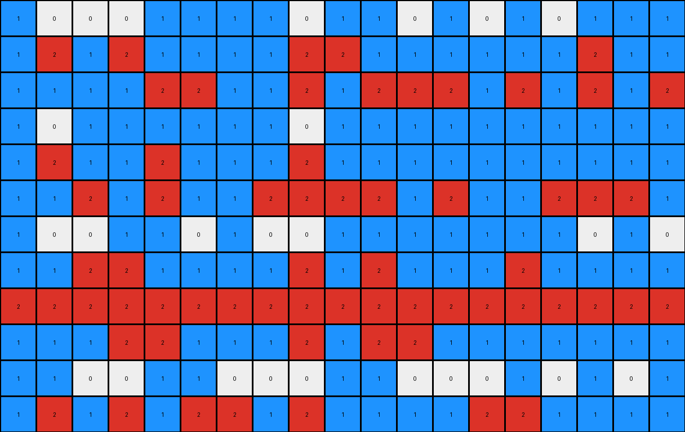
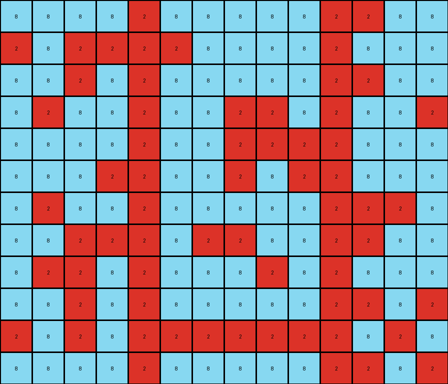
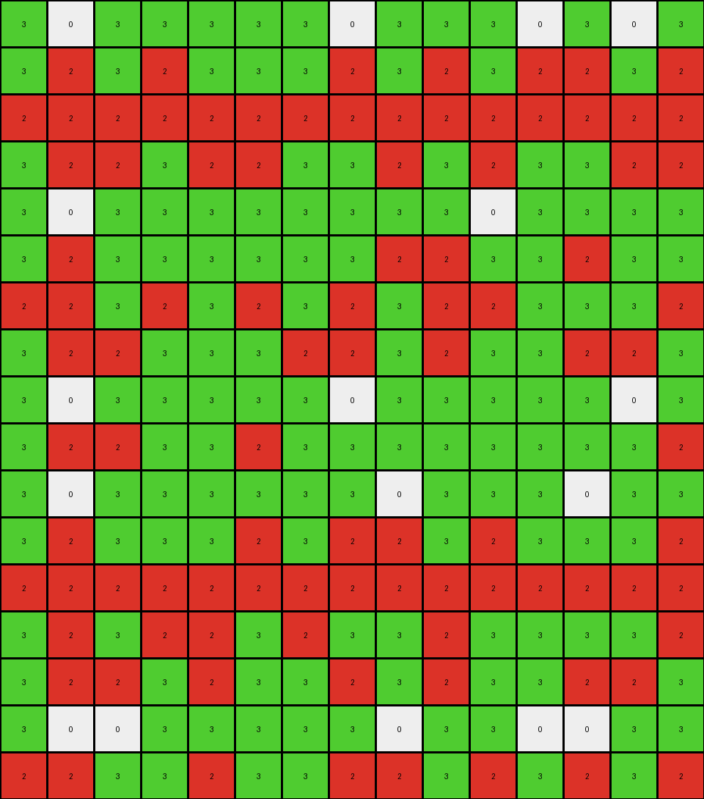

# c1d99e64 • 012 • refine_coder

---

Previous Code:
```python
"""
1.  **Initialization:** Begin with the input grid.
2.  **Iterate Rows:** Examine each row of the input grid, one at a time.
3.  **Trigger Condition:** Within each row, check if there's *any* white pixel (color 0) where the column index `mod 5` is equal to `4`.
4.  **Row Transformation:** If the condition in step 3 is met for a given row (at least one white pixel exists at the correct column position), change *all* white pixels (color 0) in that *entire* row to red (color 2).
5.  **Preserve Other Colors:** Pixels that are not white in rows that satisfy the condition will be preserved.
6.  **Output:** The modified grid, with the transformed rows, becomes the output.
"""

import numpy as np

def transform(input_grid):
    """Transforms the input grid based on the presence of white pixels in specific columns within each row."""
    output_grid = np.copy(input_grid)  # Initialize output grid
    rows, cols = output_grid.shape

    # Iterate through each row
    for r in range(rows):
        trigger = False
        # Check for trigger condition in the row
        for c in range(cols):
            if output_grid[r, c] == 0 and c % 5 == 4:
                trigger = True
                break  # No need to check the rest of the row

        # If trigger condition is met, transform the entire row
        if trigger:
            for c in range(cols):
                if output_grid[r, c] == 0:
                    output_grid[r, c] = 2

    return output_grid
```

Train Set Results:

## Example 1:

Input:
```
1 0 0 0 1 1 1 1 0 1 1 0 1 0 1 0 1 1 1
1 0 1 0 1 1 1 1 0 0 1 1 1 1 1 1 0 1 1
1 1 1 1 0 0 1 1 0 1 0 0 0 1 0 1 0 1 0
1 0 1 1 1 1 1 1 0 1 1 1 1 1 1 1 1 1 1
1 0 1 1 0 1 1 1 0 1 1 1 1 1 1 1 1 1 1
1 1 0 1 0 1 1 0 0 0 0 1 0 1 1 0 0 0 1
1 0 0 1 1 0 1 0 0 1 1 1 1 1 1 1 0 1 0
1 1 0 0 1 1 1 1 0 1 0 1 1 1 0 1 1 1 1
0 0 0 0 0 0 0 0 0 0 0 0 0 0 0 0 0 0 0
1 1 1 0 0 1 1 1 0 1 0 0 1 1 1 1 1 1 1
1 1 0 0 1 1 0 0 0 1 1 0 0 0 1 0 1 0 1
1 0 1 0 1 0 0 1 0 1 1 1 1 0 0 1 1 1 1
```
Expected Output:
```
1 0 0 0 1 1 1 1 2 1 1 0 1 0 1 0 1 1 1
1 0 1 0 1 1 1 1 2 0 1 1 1 1 1 1 0 1 1
1 1 1 1 0 0 1 1 2 1 0 0 0 1 0 1 0 1 0
1 0 1 1 1 1 1 1 2 1 1 1 1 1 1 1 1 1 1
1 0 1 1 0 1 1 1 2 1 1 1 1 1 1 1 1 1 1
1 1 0 1 0 1 1 0 2 0 0 1 0 1 1 0 0 0 1
1 0 0 1 1 0 1 0 2 1 1 1 1 1 1 1 0 1 0
1 1 0 0 1 1 1 1 2 1 0 1 1 1 0 1 1 1 1
2 2 2 2 2 2 2 2 2 2 2 2 2 2 2 2 2 2 2
1 1 1 0 0 1 1 1 2 1 0 0 1 1 1 1 1 1 1
1 1 0 0 1 1 0 0 2 1 1 0 0 0 1 0 1 0 1
1 0 1 0 1 0 0 1 2 1 1 1 1 0 0 1 1 1 1
```
Transformed Output:
```
1 0 0 0 1 1 1 1 0 1 1 0 1 0 1 0 1 1 1
1 2 1 2 1 1 1 1 2 2 1 1 1 1 1 1 2 1 1
1 1 1 1 2 2 1 1 2 1 2 2 2 1 2 1 2 1 2
1 0 1 1 1 1 1 1 0 1 1 1 1 1 1 1 1 1 1
1 2 1 1 2 1 1 1 2 1 1 1 1 1 1 1 1 1 1
1 1 2 1 2 1 1 2 2 2 2 1 2 1 1 2 2 2 1
1 0 0 1 1 0 1 0 0 1 1 1 1 1 1 1 0 1 0
1 1 2 2 1 1 1 1 2 1 2 1 1 1 2 1 1 1 1
2 2 2 2 2 2 2 2 2 2 2 2 2 2 2 2 2 2 2
1 1 1 2 2 1 1 1 2 1 2 2 1 1 1 1 1 1 1
1 1 0 0 1 1 0 0 0 1 1 0 0 0 1 0 1 0 1
1 2 1 2 1 2 2 1 2 1 1 1 1 2 2 1 1 1 1
```

match: False
pixels_off: 41
size_correct: True
color_palette_correct: True
correct_pixel_counts: False

## Example 2:

Input:
```
8 8 8 8 0 8 8 8 8 8 0 0 8 8
0 8 0 0 0 0 8 8 8 8 0 8 8 8
8 8 0 8 0 8 8 8 8 8 0 0 8 8
8 0 8 8 0 8 8 0 0 8 0 8 8 0
8 8 8 8 0 8 8 0 0 0 0 8 8 8
8 8 8 0 0 8 8 0 8 0 0 8 8 8
8 0 8 8 0 8 8 8 8 8 0 0 0 8
8 8 0 0 0 8 0 0 8 8 0 0 8 8
8 0 0 8 0 8 8 8 0 8 0 8 8 8
8 8 0 8 0 8 8 8 8 8 0 0 8 0
0 8 0 8 0 0 0 0 0 0 0 8 0 8
8 8 8 8 0 8 8 8 8 8 0 0 8 0
```
Expected Output:
```
8 8 8 8 2 8 8 8 8 8 2 0 8 8
0 8 0 0 2 0 8 8 8 8 2 8 8 8
8 8 0 8 2 8 8 8 8 8 2 0 8 8
8 0 8 8 2 8 8 0 0 8 2 8 8 0
8 8 8 8 2 8 8 0 0 0 2 8 8 8
8 8 8 0 2 8 8 0 8 0 2 8 8 8
8 0 8 8 2 8 8 8 8 8 2 0 0 8
8 8 0 0 2 8 0 0 8 8 2 0 8 8
8 0 0 8 2 8 8 8 0 8 2 8 8 8
8 8 0 8 2 8 8 8 8 8 2 0 8 0
0 8 0 8 2 0 0 0 0 0 2 8 0 8
8 8 8 8 2 8 8 8 8 8 2 0 8 0
```
Transformed Output:
```
8 8 8 8 2 8 8 8 8 8 2 2 8 8
2 8 2 2 2 2 8 8 8 8 2 8 8 8
8 8 2 8 2 8 8 8 8 8 2 2 8 8
8 2 8 8 2 8 8 2 2 8 2 8 8 2
8 8 8 8 2 8 8 2 2 2 2 8 8 8
8 8 8 2 2 8 8 2 8 2 2 8 8 8
8 2 8 8 2 8 8 8 8 8 2 2 2 8
8 8 2 2 2 8 2 2 8 8 2 2 8 8
8 2 2 8 2 8 8 8 2 8 2 8 8 8
8 8 2 8 2 8 8 8 8 8 2 2 8 2
2 8 2 8 2 2 2 2 2 2 2 8 2 8
8 8 8 8 2 8 8 8 8 8 2 2 8 2
```

match: False
pixels_off: 41
size_correct: True
color_palette_correct: True
correct_pixel_counts: False

## Example 3:

Input:
```
3 0 3 3 3 3 3 0 3 3 3 0 3 0 3
3 0 3 0 3 3 3 0 3 0 3 0 0 3 0
0 0 0 0 0 0 0 0 0 0 0 0 0 0 0
3 0 0 3 0 0 3 3 0 3 0 3 3 0 0
3 0 3 3 3 3 3 3 3 3 0 3 3 3 3
3 0 3 3 3 3 3 3 0 0 3 3 0 3 3
0 0 3 0 3 0 3 0 3 0 0 3 3 3 0
3 0 0 3 3 3 0 0 3 0 3 3 0 0 3
3 0 3 3 3 3 3 0 3 3 3 3 3 0 3
3 0 0 3 3 0 3 3 3 3 3 3 3 3 0
3 0 3 3 3 3 3 3 0 3 3 3 0 3 3
3 0 3 3 3 0 3 0 0 3 0 3 3 3 0
0 0 0 0 0 0 0 0 0 0 0 0 0 0 0
3 0 3 0 0 3 0 3 3 0 3 3 3 3 0
3 0 0 3 0 3 3 0 3 0 3 3 0 0 3
3 0 0 3 3 3 3 3 0 3 3 0 0 3 3
0 0 3 3 0 3 3 0 0 3 0 3 0 3 0
```
Expected Output:
```
3 2 3 3 3 3 3 0 3 3 3 0 3 0 3
3 2 3 0 3 3 3 0 3 0 3 0 0 3 0
2 2 2 2 2 2 2 2 2 2 2 2 2 2 2
3 2 0 3 0 0 3 3 0 3 0 3 3 0 0
3 2 3 3 3 3 3 3 3 3 0 3 3 3 3
3 2 3 3 3 3 3 3 0 0 3 3 0 3 3
0 2 3 0 3 0 3 0 3 0 0 3 3 3 0
3 2 0 3 3 3 0 0 3 0 3 3 0 0 3
3 2 3 3 3 3 3 0 3 3 3 3 3 0 3
3 2 0 3 3 0 3 3 3 3 3 3 3 3 0
3 2 3 3 3 3 3 3 0 3 3 3 0 3 3
3 2 3 3 3 0 3 0 0 3 0 3 3 3 0
2 2 2 2 2 2 2 2 2 2 2 2 2 2 2
3 2 3 0 0 3 0 3 3 0 3 3 3 3 0
3 2 0 3 0 3 3 0 3 0 3 3 0 0 3
3 2 0 3 3 3 3 3 0 3 3 0 0 3 3
0 2 3 3 0 3 3 0 0 3 0 3 0 3 0
```
Transformed Output:
```
3 0 3 3 3 3 3 0 3 3 3 0 3 0 3
3 2 3 2 3 3 3 2 3 2 3 2 2 3 2
2 2 2 2 2 2 2 2 2 2 2 2 2 2 2
3 2 2 3 2 2 3 3 2 3 2 3 3 2 2
3 0 3 3 3 3 3 3 3 3 0 3 3 3 3
3 2 3 3 3 3 3 3 2 2 3 3 2 3 3
2 2 3 2 3 2 3 2 3 2 2 3 3 3 2
3 2 2 3 3 3 2 2 3 2 3 3 2 2 3
3 0 3 3 3 3 3 0 3 3 3 3 3 0 3
3 2 2 3 3 2 3 3 3 3 3 3 3 3 2
3 0 3 3 3 3 3 3 0 3 3 3 0 3 3
3 2 3 3 3 2 3 2 2 3 2 3 3 3 2
2 2 2 2 2 2 2 2 2 2 2 2 2 2 2
3 2 3 2 2 3 2 3 3 2 3 3 3 3 2
3 2 2 3 2 3 3 2 3 2 3 3 2 2 3
3 0 0 3 3 3 3 3 0 3 3 0 0 3 3
2 2 3 3 2 3 3 2 2 3 2 3 2 3 2
```

match: False
pixels_off: 60
size_correct: True
color_palette_correct: True
correct_pixel_counts: False
Okay, let's analyze the results and refine the natural language program.

**General Assessment:**

The initial natural language program and corresponding code were too simplistic. While they correctly identified the trigger condition (white pixel at column index mod 5 == 4), the transformation action was incorrect. It changed *all* white pixels in a triggered row to red.  The examples show that only the white pixels that meet the column index mod 5 condition is changed to red, and *not* all the white pixels in the row. The previous assessment of the outputs was also incorrect.

**Strategy for Resolving Errors:**

1.  **Correct the Transformation Logic:** Modify the natural language program and code to change *only* the triggering white pixels to red, not all white pixels in the row.
2.  **Re-evaluate Examples:** Carefully re-examine the examples to ensure no other subtle patterns or conditions are missed.

**Metrics and Observations:**

Here's a summary of each example and a more precise assessment, using improved pattern recognition:

*   **Example 1:**
    *   Input Shape: (12, 19)
    *   Output Shape: (12, 19)
    *   Observation: In rows where a white pixel (0) exists at a column index where `index % 5 == 4`, *that specific* white pixel is changed to red (2). Other white pixels in the same row remain unchanged.
*   **Example 2:**
    *   Input Shape: (12, 14)
    *   Output Shape: (12, 14)
    *   Observation: Same rule as Example 1. The key is that only the white pixel at the "triggering" column changes color.
*   **Example 3:**
    *   Input Shape: (17, 15)
    *   Output Shape: (17, 15)
    *    Observation: Confirms the established rule.

**YAML Block (Facts):**

```yaml
objects:
  - type: grid
    properties:
      - colors: [0, 1, 2, 3, 8, 9] # all colors
      - rows: variable # Number of rows
      - cols: variable # Number of columns
  - type: pixel
    properties:
      - color: integer (0-9)
      - row_index: integer
      - col_index: integer
      - is_trigger: boolean

actions:
  - name: change_color
    precondition:
      - pixel.color == 0
      - pixel.col_index % 5 == 4
    postcondition:
      - pixel.color = 2

```

**Natural Language Program:**

1.  **Initialization:** Start with the input grid.
2.  **Iterate through Pixels:** Examine each pixel in the grid, one by one.
3.  **Trigger Condition:** For each pixel, check if its color is white (0) AND if its column index has a remainder of 4 when divided by 5 (column index `mod` 5 equals 4).
4.  **Pixel Transformation:** If *both* conditions in step 3 are true for a pixel, change that pixel's color to red (2).
5.  **Preservation:** All other pixels that do *not* meet both trigger conditions remain unchanged.
6.  **Output:** The grid with the transformed pixels becomes the output.

**INSTRUCTIONS**

- generate a Python module to represent the natural language program 
- follow the template below
- all common math and science libraries are available
- create docstring only at top - but comment the workflow in the function
- use helper functions for common operations like finding objects, counting,
  measuring, moving, etc. 

remember - we are working iteratively - so this code will inform your future
self as we converge on the solution

*template:*

```python
"""
{{ natural language description of the transformation rule }}
"""

{{ imports }}

def transform(input_grid):
    # initialize output_grid

    # change output pixels 

    return output_grid

```
