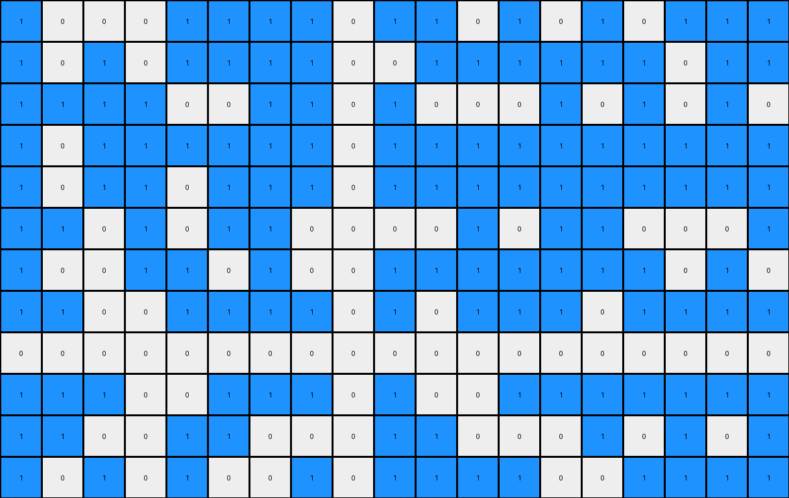
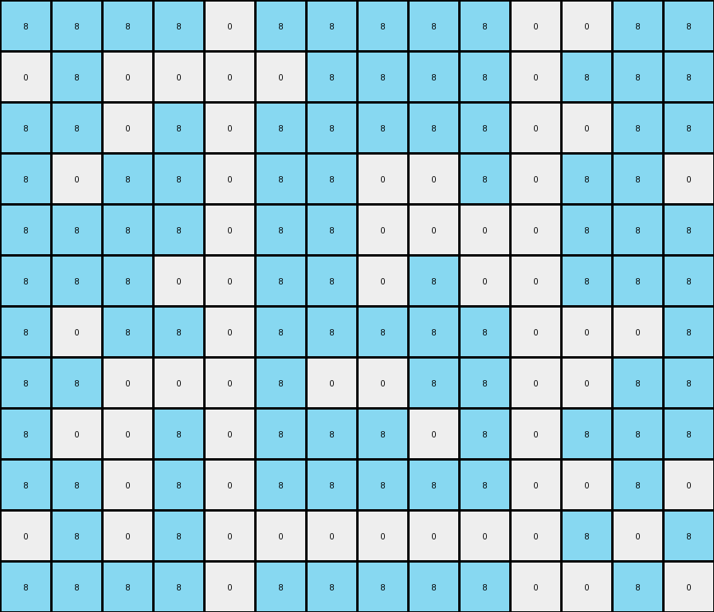
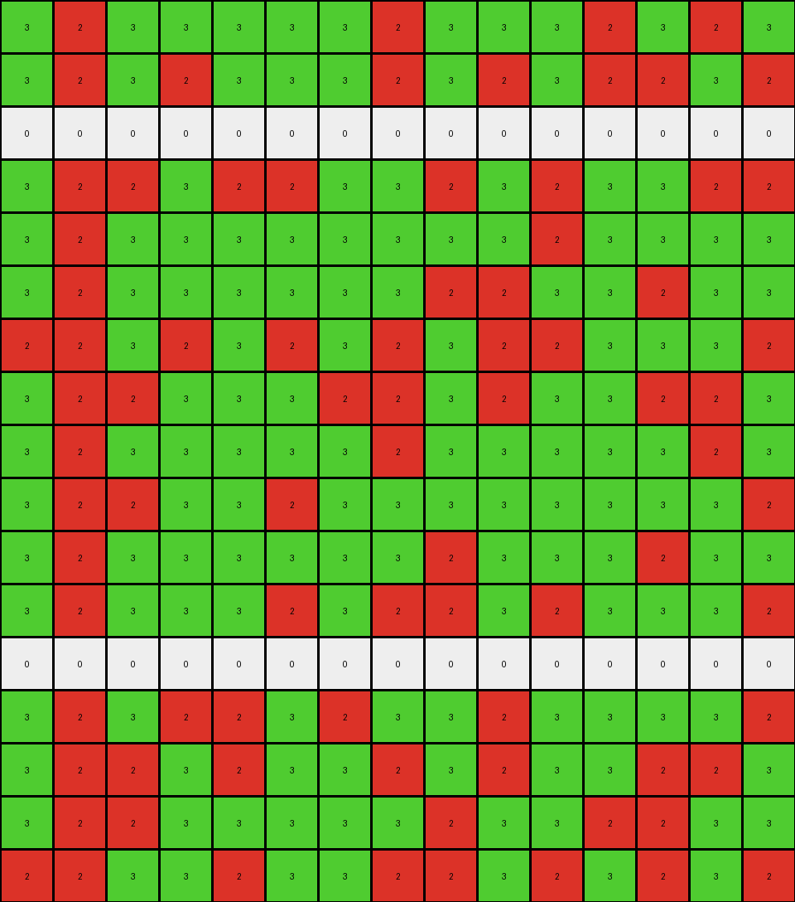

# c1d99e64 • 015 • refine_dreamer

---


Previous Code:
```python
"""
1.  **Identify Starting Points:** Locate all white (0) pixels that are directly adjacent (above, below, left, or right) to a green (3) pixel.
2. **Horizontal Replacement - Row by row:**
      - Every row which contain the green color, change every 0 to 2 in the same row starting from the top.
3.  **Leave Other Pixels Unchanged:** All green (3) pixels, and any white(0) that do not satisfy conditions from horizontal replacement, remain the same.
"""

import numpy as np

def get_neighbors(grid, row, col):
    """
    Finds the valid neighbors of cell.
    """
    rows, cols = grid.shape
    neighbors = []
    
    # Define possible neighbor coordinates
    possible_neighbors = [
        (row - 1, col),  # Above
        (row + 1, col),  # Below
        (row, col - 1),  # Left
        (row, col + 1)   # Right
    ]
    
    # Check validity
    for r, c in possible_neighbors:
      if 0 <= r < rows and 0 <= c < cols:
        neighbors.append((r,c))

    return neighbors
        

def transform(input_grid):
    # Initialize output_grid as a copy of the input_grid
    output_grid = np.copy(input_grid)
    rows, cols = output_grid.shape

    # Iterate through the grid
    for row in range(rows):
        has_green = False  # Flag to check for the presence of green in each row
        for col in range(cols):
            if output_grid[row, col] == 3:  # Found green pixel
               has_green = True
               break # We only need to check green pixel on each row.

        if (has_green):
            # Replace the 0 to 2 in the same row.
            for col_2 in range(cols):
                if output_grid[row,col_2] == 0:
                    output_grid[row,col_2] = 2
    return output_grid
```

Train Set Results:

## Example 1:

Input:
```
1 0 0 0 1 1 1 1 0 1 1 0 1 0 1 0 1 1 1
1 0 1 0 1 1 1 1 0 0 1 1 1 1 1 1 0 1 1
1 1 1 1 0 0 1 1 0 1 0 0 0 1 0 1 0 1 0
1 0 1 1 1 1 1 1 0 1 1 1 1 1 1 1 1 1 1
1 0 1 1 0 1 1 1 0 1 1 1 1 1 1 1 1 1 1
1 1 0 1 0 1 1 0 0 0 0 1 0 1 1 0 0 0 1
1 0 0 1 1 0 1 0 0 1 1 1 1 1 1 1 0 1 0
1 1 0 0 1 1 1 1 0 1 0 1 1 1 0 1 1 1 1
0 0 0 0 0 0 0 0 0 0 0 0 0 0 0 0 0 0 0
1 1 1 0 0 1 1 1 0 1 0 0 1 1 1 1 1 1 1
1 1 0 0 1 1 0 0 0 1 1 0 0 0 1 0 1 0 1
1 0 1 0 1 0 0 1 0 1 1 1 1 0 0 1 1 1 1
```
Expected Output:
```
1 0 0 0 1 1 1 1 2 1 1 0 1 0 1 0 1 1 1
1 0 1 0 1 1 1 1 2 0 1 1 1 1 1 1 0 1 1
1 1 1 1 0 0 1 1 2 1 0 0 0 1 0 1 0 1 0
1 0 1 1 1 1 1 1 2 1 1 1 1 1 1 1 1 1 1
1 0 1 1 0 1 1 1 2 1 1 1 1 1 1 1 1 1 1
1 1 0 1 0 1 1 0 2 0 0 1 0 1 1 0 0 0 1
1 0 0 1 1 0 1 0 2 1 1 1 1 1 1 1 0 1 0
1 1 0 0 1 1 1 1 2 1 0 1 1 1 0 1 1 1 1
2 2 2 2 2 2 2 2 2 2 2 2 2 2 2 2 2 2 2
1 1 1 0 0 1 1 1 2 1 0 0 1 1 1 1 1 1 1
1 1 0 0 1 1 0 0 2 1 1 0 0 0 1 0 1 0 1
1 0 1 0 1 0 0 1 2 1 1 1 1 0 0 1 1 1 1
```
Transformed Output:
```
1 0 0 0 1 1 1 1 0 1 1 0 1 0 1 0 1 1 1
1 0 1 0 1 1 1 1 0 0 1 1 1 1 1 1 0 1 1
1 1 1 1 0 0 1 1 0 1 0 0 0 1 0 1 0 1 0
1 0 1 1 1 1 1 1 0 1 1 1 1 1 1 1 1 1 1
1 0 1 1 0 1 1 1 0 1 1 1 1 1 1 1 1 1 1
1 1 0 1 0 1 1 0 0 0 0 1 0 1 1 0 0 0 1
1 0 0 1 1 0 1 0 0 1 1 1 1 1 1 1 0 1 0
1 1 0 0 1 1 1 1 0 1 0 1 1 1 0 1 1 1 1
0 0 0 0 0 0 0 0 0 0 0 0 0 0 0 0 0 0 0
1 1 1 0 0 1 1 1 0 1 0 0 1 1 1 1 1 1 1
1 1 0 0 1 1 0 0 0 1 1 0 0 0 1 0 1 0 1
1 0 1 0 1 0 0 1 0 1 1 1 1 0 0 1 1 1 1
```

match: False
pixels_off: 30
size_correct: True
color_palette_correct: True
correct_pixel_counts: False

## Example 2:

Input:
```
8 8 8 8 0 8 8 8 8 8 0 0 8 8
0 8 0 0 0 0 8 8 8 8 0 8 8 8
8 8 0 8 0 8 8 8 8 8 0 0 8 8
8 0 8 8 0 8 8 0 0 8 0 8 8 0
8 8 8 8 0 8 8 0 0 0 0 8 8 8
8 8 8 0 0 8 8 0 8 0 0 8 8 8
8 0 8 8 0 8 8 8 8 8 0 0 0 8
8 8 0 0 0 8 0 0 8 8 0 0 8 8
8 0 0 8 0 8 8 8 0 8 0 8 8 8
8 8 0 8 0 8 8 8 8 8 0 0 8 0
0 8 0 8 0 0 0 0 0 0 0 8 0 8
8 8 8 8 0 8 8 8 8 8 0 0 8 0
```
Expected Output:
```
8 8 8 8 2 8 8 8 8 8 2 0 8 8
0 8 0 0 2 0 8 8 8 8 2 8 8 8
8 8 0 8 2 8 8 8 8 8 2 0 8 8
8 0 8 8 2 8 8 0 0 8 2 8 8 0
8 8 8 8 2 8 8 0 0 0 2 8 8 8
8 8 8 0 2 8 8 0 8 0 2 8 8 8
8 0 8 8 2 8 8 8 8 8 2 0 0 8
8 8 0 0 2 8 0 0 8 8 2 0 8 8
8 0 0 8 2 8 8 8 0 8 2 8 8 8
8 8 0 8 2 8 8 8 8 8 2 0 8 0
0 8 0 8 2 0 0 0 0 0 2 8 0 8
8 8 8 8 2 8 8 8 8 8 2 0 8 0
```
Transformed Output:
```
8 8 8 8 0 8 8 8 8 8 0 0 8 8
0 8 0 0 0 0 8 8 8 8 0 8 8 8
8 8 0 8 0 8 8 8 8 8 0 0 8 8
8 0 8 8 0 8 8 0 0 8 0 8 8 0
8 8 8 8 0 8 8 0 0 0 0 8 8 8
8 8 8 0 0 8 8 0 8 0 0 8 8 8
8 0 8 8 0 8 8 8 8 8 0 0 0 8
8 8 0 0 0 8 0 0 8 8 0 0 8 8
8 0 0 8 0 8 8 8 0 8 0 8 8 8
8 8 0 8 0 8 8 8 8 8 0 0 8 0
0 8 0 8 0 0 0 0 0 0 0 8 0 8
8 8 8 8 0 8 8 8 8 8 0 0 8 0
```

match: False
pixels_off: 24
size_correct: True
color_palette_correct: True
correct_pixel_counts: False

## Example 3:

Input:
```
3 0 3 3 3 3 3 0 3 3 3 0 3 0 3
3 0 3 0 3 3 3 0 3 0 3 0 0 3 0
0 0 0 0 0 0 0 0 0 0 0 0 0 0 0
3 0 0 3 0 0 3 3 0 3 0 3 3 0 0
3 0 3 3 3 3 3 3 3 3 0 3 3 3 3
3 0 3 3 3 3 3 3 0 0 3 3 0 3 3
0 0 3 0 3 0 3 0 3 0 0 3 3 3 0
3 0 0 3 3 3 0 0 3 0 3 3 0 0 3
3 0 3 3 3 3 3 0 3 3 3 3 3 0 3
3 0 0 3 3 0 3 3 3 3 3 3 3 3 0
3 0 3 3 3 3 3 3 0 3 3 3 0 3 3
3 0 3 3 3 0 3 0 0 3 0 3 3 3 0
0 0 0 0 0 0 0 0 0 0 0 0 0 0 0
3 0 3 0 0 3 0 3 3 0 3 3 3 3 0
3 0 0 3 0 3 3 0 3 0 3 3 0 0 3
3 0 0 3 3 3 3 3 0 3 3 0 0 3 3
0 0 3 3 0 3 3 0 0 3 0 3 0 3 0
```
Expected Output:
```
3 2 3 3 3 3 3 0 3 3 3 0 3 0 3
3 2 3 0 3 3 3 0 3 0 3 0 0 3 0
2 2 2 2 2 2 2 2 2 2 2 2 2 2 2
3 2 0 3 0 0 3 3 0 3 0 3 3 0 0
3 2 3 3 3 3 3 3 3 3 0 3 3 3 3
3 2 3 3 3 3 3 3 0 0 3 3 0 3 3
0 2 3 0 3 0 3 0 3 0 0 3 3 3 0
3 2 0 3 3 3 0 0 3 0 3 3 0 0 3
3 2 3 3 3 3 3 0 3 3 3 3 3 0 3
3 2 0 3 3 0 3 3 3 3 3 3 3 3 0
3 2 3 3 3 3 3 3 0 3 3 3 0 3 3
3 2 3 3 3 0 3 0 0 3 0 3 3 3 0
2 2 2 2 2 2 2 2 2 2 2 2 2 2 2
3 2 3 0 0 3 0 3 3 0 3 3 3 3 0
3 2 0 3 0 3 3 0 3 0 3 3 0 0 3
3 2 0 3 3 3 3 3 0 3 3 0 0 3 3
0 2 3 3 0 3 3 0 0 3 0 3 0 3 0
```
Transformed Output:
```
3 2 3 3 3 3 3 2 3 3 3 2 3 2 3
3 2 3 2 3 3 3 2 3 2 3 2 2 3 2
0 0 0 0 0 0 0 0 0 0 0 0 0 0 0
3 2 2 3 2 2 3 3 2 3 2 3 3 2 2
3 2 3 3 3 3 3 3 3 3 2 3 3 3 3
3 2 3 3 3 3 3 3 2 2 3 3 2 3 3
2 2 3 2 3 2 3 2 3 2 2 3 3 3 2
3 2 2 3 3 3 2 2 3 2 3 3 2 2 3
3 2 3 3 3 3 3 2 3 3 3 3 3 2 3
3 2 2 3 3 2 3 3 3 3 3 3 3 3 2
3 2 3 3 3 3 3 3 2 3 3 3 2 3 3
3 2 3 3 3 2 3 2 2 3 2 3 3 3 2
0 0 0 0 0 0 0 0 0 0 0 0 0 0 0
3 2 3 2 2 3 2 3 3 2 3 3 3 3 2
3 2 2 3 2 3 3 2 3 2 3 3 2 2 3
3 2 2 3 3 3 3 3 2 3 3 2 2 3 3
2 2 3 3 2 3 3 2 2 3 2 3 2 3 2
```

match: False
pixels_off: 97
size_correct: True
color_palette_correct: True
correct_pixel_counts: False

**INSTRUCTIONS**

The code above was generated based on observations from the first training
example

we have tested the transform function on each of the task example inputs and
compared with the expected output

review each of the examples provided and the results and consider how the
natural language program should be updated to accommodate this new knowledge

respond with the following deliverables:

- general assessment of the information provided and strategy for resolving the
  errors
- gather metrics about each of the examples and results - use code_execution to
  develop accurate reports on your assumptions
- a YAML block documenting facts - Focus on identifying objects, their properties, and the actions performed on them.
- a natural language program - Be as clear and concise as possible, providing a complete description of the transformation rule.


your responses should be considered as information in a report - not a
conversation
