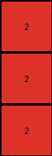
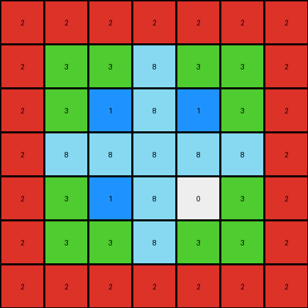

# c909285e • 009 • refine_dreamer

---

Previous Code:
```python
"""
1.  **Identify the Target Region:** Locate the largest rectangular region within the input grid that is completely enclosed by a continuous border of pixels with the value '2' (red).

2.  **Extract Sub-grid:** Extract this framed region from the input grid.

3. **Return extracted sub-grid**: The output is exactly equal to the extracted sub-grid, with no changes to colors, dimensions, or values.
"""

import numpy as np

def find_framed_region(grid, frame_color=2):
    """Finds the largest rectangular region enclosed by a frame of the specified color."""
    rows, cols = grid.shape
    top_left = None
    bottom_right = None

    # Find top-left corner of frame
    for r in range(rows):
        for c in range(cols):
            if grid[r, c] == frame_color:
                # Check if this is a valid top-left corner
                if (c + 1 < cols and grid[r, c+1] == frame_color) or (r + 1 < rows and grid[r+1,c] == frame_color):
                    top_left = (r, c)
                    break
        if top_left:
            break
    
    if not top_left:
        return None, None

    # Find bottom-right corner
    r = top_left[0]
    c = top_left[1]
    
    # get width
    while c < cols and grid[r,c] == frame_color:
      c += 1
    width = c - top_left[1]

    #get height
    c = top_left[1]
    while r < rows and grid[r, c] == frame_color:
        r += 1
    height = r - top_left[0]  
    
    bottom_right = (top_left[0] + height -1, top_left[1] + width -1 )

    #check full frame is valid
    for i in range(top_left[1], bottom_right[1] + 1):
        if not (grid[top_left[0], i] == frame_color and grid[bottom_right[0],i] == frame_color):
            return None, None
    for i in range(top_left[0], bottom_right[0] + 1):
      if not (grid[i, top_left[1]] == frame_color and grid[i, bottom_right[1]] == frame_color ):
          return None, None
    
    return top_left, (bottom_right[0], bottom_right[1] )


def transform(input_grid):
    """Extracts the rectangular region enclosed by a red (2) frame."""
    # Convert to numpy array
    grid = np.array(input_grid)

    # Find the framed region
    top_left, bottom_right = find_framed_region(grid)

    # Extract the sub-grid
    if top_left and bottom_right:
        output_grid = grid[top_left[0]:bottom_right[0]+1, top_left[1]:bottom_right[1]+1].tolist()
    else:
        output_grid = []  # Return an empty grid if no framed region is found

    return output_grid
```

Train Set Results:

## Example 1:

Input:
```
0 0 2 4 8 5 0 4 2 8 0 5 0 0 2 4 0 5 0 4 2 0 0 5
0 0 2 4 8 5 0 4 2 8 0 5 0 0 2 4 0 5 0 4 2 0 0 5
2 2 2 4 2 5 2 4 2 2 2 5 2 2 2 4 2 5 2 4 2 2 2 5
4 4 4 4 4 5 4 4 4 4 4 5 4 4 4 4 4 5 4 4 4 4 4 5
8 8 2 4 8 5 8 4 2 8 8 5 8 8 2 4 8 5 8 4 2 8 8 5
5 5 5 5 5 3 3 3 3 3 3 3 5 5 5 5 5 5 5 5 5 5 5 5
0 0 2 4 8 3 0 4 2 8 0 3 0 0 2 4 0 5 0 4 2 0 0 5
4 4 4 4 4 3 4 4 4 4 4 3 4 4 4 4 4 5 4 4 4 4 4 5
2 2 2 4 2 3 2 4 2 2 2 3 2 2 2 4 2 5 2 4 2 2 2 5
8 8 2 4 8 3 8 4 2 8 8 3 8 8 2 4 8 5 8 4 2 8 8 5
0 0 2 4 8 3 0 4 2 8 0 3 0 0 2 4 0 5 0 4 2 0 0 5
5 5 5 5 5 3 3 3 3 3 3 3 5 5 5 5 5 5 5 5 5 5 5 5
0 0 2 4 8 5 0 4 2 8 0 5 0 0 2 4 0 5 0 4 2 0 0 5
0 0 2 4 8 5 0 4 2 8 0 5 0 0 2 4 0 5 0 4 2 0 0 5
2 2 2 4 2 5 2 4 2 2 2 5 2 2 2 4 2 5 2 4 2 2 2 5
4 4 4 4 4 5 4 4 4 4 4 5 4 4 4 4 4 5 4 4 4 4 4 5
0 0 2 4 8 5 0 4 2 8 0 5 0 0 2 4 0 5 0 4 2 0 0 5
5 5 5 5 5 5 5 5 5 5 5 5 5 5 5 5 5 5 5 5 5 5 5 5
0 0 2 4 8 5 0 4 2 8 0 5 0 0 2 4 0 5 0 4 2 0 0 5
4 4 4 4 4 5 4 4 4 4 4 5 4 4 4 4 4 5 4 4 4 4 4 5
2 2 2 4 2 5 2 4 2 2 2 5 2 2 2 4 2 5 2 4 2 2 2 5
0 0 2 4 8 5 0 4 2 8 0 5 0 0 2 4 0 5 0 4 2 0 0 5
0 0 2 4 8 5 0 4 2 8 0 5 0 0 2 4 0 5 0 4 2 0 0 5
5 5 5 5 5 5 5 5 5 5 5 5 5 5 5 5 5 5 5 5 5 5 5 5
```
Expected Output:
```
3 3 3 3 3 3 3
3 0 4 2 8 0 3
3 4 4 4 4 4 3
3 2 4 2 2 2 3
3 8 4 2 8 8 3
3 0 4 2 8 0 3
3 3 3 3 3 3 3
```
Transformed Output:
```
2
2
2
```

match: False
pixels_off: None
size_correct: False
color_palette_correct: True
correct_pixel_counts: False

## Example 2:

Input:
```
0 0 8 3 1 8 0 3 8 1 0 8 0 0 8 3 0 8 0 3 8 0 0 8 1 0
0 0 8 3 1 8 0 3 8 1 0 8 0 0 8 3 0 8 0 3 8 0 0 8 1 0
8 8 2 2 2 2 2 2 2 8 8 8 8 8 8 8 8 8 8 8 8 8 8 8 8 8
3 3 2 3 3 8 3 3 2 3 3 8 3 3 8 3 3 8 3 3 8 3 3 8 3 3
1 1 2 3 1 8 1 3 2 1 1 8 1 1 8 3 1 8 1 3 8 1 1 8 1 1
8 8 2 8 8 8 8 8 2 8 8 8 8 8 8 8 8 8 8 8 8 8 8 8 8 8
0 0 2 3 1 8 0 3 2 1 0 8 0 0 8 3 0 8 0 3 8 0 0 8 1 0
3 3 2 3 3 8 3 3 2 3 3 8 3 3 8 3 3 8 3 3 8 3 3 8 3 3
8 8 2 2 2 2 2 2 2 8 8 8 8 8 8 8 8 8 8 8 8 8 8 8 8 8
1 1 8 3 1 8 1 3 8 1 1 8 1 1 8 3 1 8 1 3 8 1 1 8 1 1
0 0 8 3 1 8 0 3 8 1 0 8 0 0 8 3 0 8 0 3 8 0 0 8 1 0
8 8 8 8 8 8 8 8 8 8 8 8 8 8 8 8 8 8 8 8 8 8 8 8 8 8
0 0 8 3 1 8 0 3 8 1 0 8 0 0 8 3 0 8 0 3 8 0 0 8 1 0
0 0 8 3 1 8 0 3 8 1 0 8 0 0 8 3 0 8 0 3 8 0 0 8 1 0
8 8 8 8 8 8 8 8 8 8 8 8 8 8 8 8 8 8 8 8 8 8 8 8 8 8
3 3 8 3 3 8 3 3 8 3 3 8 3 3 8 3 3 8 3 3 8 3 3 8 3 3
0 0 8 3 1 8 0 3 8 1 0 8 0 0 8 3 0 8 0 3 8 0 0 8 1 0
8 8 8 8 8 8 8 8 8 8 8 8 8 8 8 8 8 8 8 8 8 8 8 8 8 8
0 0 8 3 1 8 0 3 8 1 0 8 0 0 8 3 0 8 0 3 8 0 0 8 1 0
3 3 8 3 3 8 3 3 8 3 3 8 3 3 8 3 3 8 3 3 8 3 3 8 3 3
8 8 8 8 8 8 8 8 8 8 8 8 8 8 8 8 8 8 8 8 8 8 8 8 8 8
0 0 8 3 1 8 0 3 8 1 0 8 0 0 8 3 0 8 0 3 8 0 0 8 1 0
0 0 8 3 1 8 0 3 8 1 0 8 0 0 8 3 0 8 0 3 8 0 0 8 1 0
8 8 8 8 8 8 8 8 8 8 8 8 8 8 8 8 8 8 8 8 8 8 8 8 8 8
1 1 8 3 1 8 1 3 8 1 1 8 1 1 8 3 1 8 1 3 8 1 1 8 1 1
0 0 8 3 1 8 0 3 8 1 0 8 0 0 8 3 0 8 0 3 8 0 0 8 1 0
```
Expected Output:
```
2 2 2 2 2 2 2
2 3 3 8 3 3 2
2 3 1 8 1 3 2
2 8 8 8 8 8 2
2 3 1 8 0 3 2
2 3 3 8 3 3 2
2 2 2 2 2 2 2
```
Transformed Output:
```
2 2 2 2 2 2 2
2 3 3 8 3 3 2
2 3 1 8 1 3 2
2 8 8 8 8 8 2
2 3 1 8 0 3 2
2 3 3 8 3 3 2
2 2 2 2 2 2 2
```

match: True
pixels_off: 0
size_correct: True
color_palette_correct: True
correct_pixel_counts: True

## Example 3:

Input:
```
0 0 3 1 8 5 0 1 3 8 0 5 0 0 3 1 0 5 0 8 3 0 0 5 8 0 3 1
0 0 3 1 8 5 0 1 3 8 0 5 0 0 3 1 0 5 0 8 3 0 0 5 8 0 3 1
3 3 3 3 3 5 3 3 3 3 3 5 3 3 3 3 3 5 3 3 3 3 3 5 3 3 3 3
1 1 3 1 8 5 1 1 3 8 1 5 1 1 3 1 1 5 1 8 3 1 1 5 8 1 3 1
8 8 3 8 8 5 8 8 3 8 8 5 8 8 3 8 8 5 8 8 3 8 8 5 8 8 3 8
5 5 5 5 5 5 5 5 5 5 5 5 5 5 5 5 5 5 5 5 5 5 5 5 5 5 5 5
0 0 3 1 8 5 0 1 3 8 0 5 0 0 3 1 0 5 0 8 3 0 0 5 8 0 3 1
1 1 3 1 8 5 1 1 3 8 1 5 1 1 3 1 1 5 1 8 3 1 1 5 8 1 3 1
3 3 3 3 3 5 3 3 3 3 3 5 3 3 3 3 3 5 3 3 3 3 3 5 3 3 3 3
8 8 3 8 8 5 8 8 3 8 8 5 8 8 3 8 8 5 8 8 3 8 8 5 8 8 3 8
0 0 3 1 8 5 0 1 3 8 0 5 0 0 3 1 0 5 0 8 3 0 0 5 8 0 3 1
5 5 5 5 5 5 5 5 5 5 5 5 5 5 5 5 5 5 5 5 5 5 5 5 5 5 5 5
0 0 3 1 8 5 0 1 3 8 0 5 0 0 3 1 0 5 0 8 3 0 0 5 8 0 3 1
0 0 3 1 8 5 0 1 3 8 0 5 0 0 3 1 0 5 0 8 3 0 0 5 8 0 3 1
3 3 3 3 3 5 3 3 3 3 3 5 3 3 3 3 3 5 3 3 3 3 3 5 3 3 3 3
1 1 3 1 8 5 1 1 3 8 1 5 1 1 3 1 1 5 1 8 3 1 1 5 8 1 3 1
0 0 3 1 8 5 0 1 3 8 0 5 0 0 3 1 0 5 0 8 3 0 0 5 8 0 3 1
5 5 5 5 5 6 6 6 6 6 6 6 5 5 5 5 5 5 5 5 5 5 5 5 5 5 5 5
0 0 3 1 8 6 0 1 3 8 0 6 0 0 3 1 0 5 0 8 3 0 0 5 8 0 3 1
8 8 3 8 8 6 8 8 3 8 8 6 8 8 3 8 8 5 8 8 3 8 8 5 8 8 3 8
3 3 3 3 3 6 3 3 3 3 3 6 3 3 3 3 3 5 3 3 3 3 3 5 3 3 3 3
0 0 3 1 8 6 0 1 3 8 0 6 0 0 3 1 0 5 0 8 3 0 0 5 8 0 3 1
0 0 3 1 8 6 0 1 3 8 0 6 0 0 3 1 0 5 0 8 3 0 0 5 8 0 3 1
5 5 5 5 5 6 6 6 6 6 6 6 5 5 5 5 5 5 5 5 5 5 5 5 5 5 5 5
8 8 3 8 8 5 8 8 3 8 8 5 8 8 3 8 8 5 8 8 3 8 8 5 8 8 3 8
0 0 3 1 8 5 0 1 3 8 0 5 0 0 3 1 0 5 0 8 3 0 0 5 8 0 3 1
3 3 3 3 3 5 3 3 3 3 3 5 3 3 3 3 3 5 3 3 3 3 3 5 3 3 3 3
1 1 3 1 8 5 1 1 3 8 1 5 1 1 3 1 1 5 1 8 3 1 1 5 8 1 3 1
```
Expected Output:
```
6 6 6 6 6 6 6
6 0 1 3 8 0 6
6 8 8 3 8 8 6
6 3 3 3 3 3 6
6 0 1 3 8 0 6
6 0 1 3 8 0 6
6 6 6 6 6 6 6
```
Transformed Output:
```

```

match: False
pixels_off: None
size_correct: False
color_palette_correct: True
correct_pixel_counts: False
**INSTRUCTIONS**

The code above was generated based on observations from the first training
example

we have tested the transform function on each of the task example inputs and
compared with the expected output

review each of the examples provided and the results and consider how the
natural language program should be updated to accommodate this new knowledge

respond with the following deliverables:

- general assessment of the information provided and strategy for resolving the
  errors
- gather metrics about each of the examples and results - use code_execution to
  develop accurate reports on your assumptions
- a YAML block documenting facts - Focus on identifying objects, their properties, and the actions performed on them.
- a natural language program - Be as clear and concise as possible, providing a complete description of the transformation rule.


your responses should be considered as information in a report - not a
conversation
