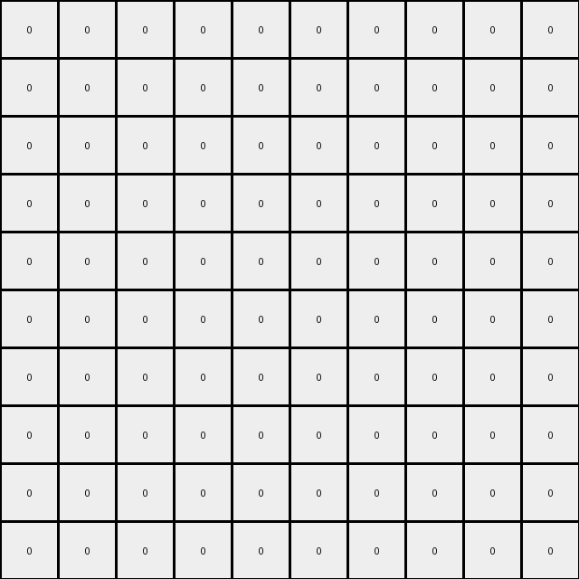

# d5d6de2d • 004 • refine_coder

---

Previous Code:
```python
"""
1.  **Identify Red Shapes:** Locate all contiguous regions (objects) of red (value 2) pixels in the input grid.
2.  **Find inner pixels:** In the red area, locate the pixels such that all the 4 neighbors of it (top, down, left, right) are also red.
3.  **Draw Green shapes**: create new green shapes on the output grid where the pixels should be based on the output from step 2.
4. **Background**: rest of the pixels on output grid is white.
"""

import numpy as np

def get_objects(grid, color):
    """
    Finds objects of the given color in the grid.

    Args:
        grid: The input grid.
        color: The color of the objects to find.

    Returns:
        A list of objects, where each object is a set of (row, col) coordinates.
    """    
    objects = []
    visited = set()
    rows, cols = len(grid), len(grid[0])

    def is_valid(r, c):
        return 0 <= r < rows and 0 <= c < cols

    def dfs(r, c, current_object):
        if (r, c) in visited or not is_valid(r, c) or grid[r][c] != color:
            return
        visited.add((r, c))
        current_object.add((r, c))
        dfs(r + 1, c, current_object)
        dfs(r - 1, c, current_object)
        dfs(r, c + 1, current_object)
        dfs(r, c - 1, current_object)

    for r in range(rows):
        for c in range(cols):
            if grid[r][c] == color and (r, c) not in visited:
                current_object = set()
                dfs(r, c, current_object)
                objects.append(current_object)
    return objects

def get_inner_pixels(obj, grid):
    """
    Finds the inner pixels of an object.
    """
    inner_pixels = set()
    rows, cols = len(grid), len(grid[0])
    for r,c in obj:
      neighbors = [(r-1,c), (r+1, c), (r, c-1), (r, c+1)]
      is_inner = True
      for nr, nc in neighbors:
        if not (0 <= nr < rows and 0 <= nc < cols and grid[nr][nc] == grid[r][c]):
          is_inner = False
          break
      if is_inner:
          inner_pixels.add((r,c))

    return inner_pixels


def transform(input_grid):
    """
    Transforms the input grid according to the described rule.
    """
    # initialize output_grid
    output_grid = np.zeros_like(input_grid)

    # find red objects
    red_objects = get_objects(input_grid, 2)

    # find inner most red pixels
    for obj in red_objects:
      inner_pixels = get_inner_pixels(obj, input_grid)
      # create green shapes at inner positions
      for r, c in inner_pixels:
          output_grid[r][c] = 3
    

    return output_grid
```

Train Set Results:

## Example 1:

Input:
```
0 0 0 0 0 0 0 0 0 0
0 2 2 2 0 0 0 0 0 0
0 2 0 2 0 0 0 0 0 0
0 2 2 2 0 0 0 0 0 0
0 0 0 0 0 0 0 0 0 0
0 0 0 0 2 2 2 2 0 0
0 0 0 0 2 0 0 2 0 0
0 0 0 0 2 0 0 2 0 0
0 0 0 0 2 0 0 2 0 0
0 0 0 0 2 2 2 2 0 0
```
Expected Output:
```
0 0 0 0 0 0 0 0 0 0
0 0 0 0 0 0 0 0 0 0
0 0 3 0 0 0 0 0 0 0
0 0 0 0 0 0 0 0 0 0
0 0 0 0 0 0 0 0 0 0
0 0 0 0 0 0 0 0 0 0
0 0 0 0 0 3 3 0 0 0
0 0 0 0 0 3 3 0 0 0
0 0 0 0 0 3 3 0 0 0
0 0 0 0 0 0 0 0 0 0
```
Transformed Output:
```
0 0 0 0 0 0 0 0 0 0
0 0 0 0 0 0 0 0 0 0
0 0 0 0 0 0 0 0 0 0
0 0 0 0 0 0 0 0 0 0
0 0 0 0 0 0 0 0 0 0
0 0 0 0 0 0 0 0 0 0
0 0 0 0 0 0 0 0 0 0
0 0 0 0 0 0 0 0 0 0
0 0 0 0 0 0 0 0 0 0
0 0 0 0 0 0 0 0 0 0
```

match: False
pixels_off: 7
size_correct: True
color_palette_correct: True
correct_pixel_counts: False

## Example 2:

Input:
```
0 0 0 0 0 0 0 0 0 0
0 0 0 0 2 2 2 0 0 0
0 0 0 0 2 0 2 0 0 0
0 0 0 0 2 0 2 0 0 0
0 0 0 0 2 2 2 0 0 0
0 0 0 0 0 0 0 0 0 0
0 0 0 0 0 0 0 0 0 0
0 0 0 0 0 0 0 0 0 0
0 0 0 0 0 0 0 0 0 0
0 0 0 0 0 0 0 0 0 0
```
Expected Output:
```
0 0 0 0 0 0 0 0 0 0
0 0 0 0 0 0 0 0 0 0
0 0 0 0 0 3 0 0 0 0
0 0 0 0 0 3 0 0 0 0
0 0 0 0 0 0 0 0 0 0
0 0 0 0 0 0 0 0 0 0
0 0 0 0 0 0 0 0 0 0
0 0 0 0 0 0 0 0 0 0
0 0 0 0 0 0 0 0 0 0
0 0 0 0 0 0 0 0 0 0
```
Transformed Output:
```
0 0 0 0 0 0 0 0 0 0
0 0 0 0 0 0 0 0 0 0
0 0 0 0 0 0 0 0 0 0
0 0 0 0 0 0 0 0 0 0
0 0 0 0 0 0 0 0 0 0
0 0 0 0 0 0 0 0 0 0
0 0 0 0 0 0 0 0 0 0
0 0 0 0 0 0 0 0 0 0
0 0 0 0 0 0 0 0 0 0
0 0 0 0 0 0 0 0 0 0
```

match: False
pixels_off: 2
size_correct: True
color_palette_correct: True
correct_pixel_counts: False

## Example 3:

Input:
```
0 0 0 0 0 0 0 0 0 0 0 0 0 0 0
0 2 2 2 2 2 0 0 0 0 0 0 0 0 0
0 2 0 0 0 2 0 0 0 0 0 0 0 0 0
0 2 0 0 0 2 0 0 0 0 0 0 0 0 0
0 2 0 0 0 2 0 0 0 0 0 0 0 0 0
0 2 2 2 2 2 0 0 0 0 0 0 0 0 0
0 0 0 0 0 0 0 0 0 0 0 0 0 0 0
0 0 0 0 0 0 0 0 0 0 2 2 0 0 0
0 0 0 0 0 0 0 0 0 0 2 2 0 0 0
0 0 0 0 0 0 0 0 0 0 0 0 0 0 0
0 0 0 0 0 0 0 0 0 0 0 0 0 0 0
0 0 0 0 0 0 0 0 0 0 0 0 0 0 0
0 0 0 0 0 0 0 0 0 0 0 0 0 0 0
0 0 0 0 0 0 0 0 0 0 0 0 0 0 0
0 0 0 0 0 0 0 0 0 0 0 0 0 0 0
```
Expected Output:
```
0 0 0 0 0 0 0 0 0 0 0 0 0 0 0
0 0 0 0 0 0 0 0 0 0 0 0 0 0 0
0 0 3 3 3 0 0 0 0 0 0 0 0 0 0
0 0 3 3 3 0 0 0 0 0 0 0 0 0 0
0 0 3 3 3 0 0 0 0 0 0 0 0 0 0
0 0 0 0 0 0 0 0 0 0 0 0 0 0 0
0 0 0 0 0 0 0 0 0 0 0 0 0 0 0
0 0 0 0 0 0 0 0 0 0 0 0 0 0 0
0 0 0 0 0 0 0 0 0 0 0 0 0 0 0
0 0 0 0 0 0 0 0 0 0 0 0 0 0 0
0 0 0 0 0 0 0 0 0 0 0 0 0 0 0
0 0 0 0 0 0 0 0 0 0 0 0 0 0 0
0 0 0 0 0 0 0 0 0 0 0 0 0 0 0
0 0 0 0 0 0 0 0 0 0 0 0 0 0 0
0 0 0 0 0 0 0 0 0 0 0 0 0 0 0
```
Transformed Output:
```
0 0 0 0 0 0 0 0 0 0 0 0 0 0 0
0 0 0 0 0 0 0 0 0 0 0 0 0 0 0
0 0 0 0 0 0 0 0 0 0 0 0 0 0 0
0 0 0 0 0 0 0 0 0 0 0 0 0 0 0
0 0 0 0 0 0 0 0 0 0 0 0 0 0 0
0 0 0 0 0 0 0 0 0 0 0 0 0 0 0
0 0 0 0 0 0 0 0 0 0 0 0 0 0 0
0 0 0 0 0 0 0 0 0 0 0 0 0 0 0
0 0 0 0 0 0 0 0 0 0 0 0 0 0 0
0 0 0 0 0 0 0 0 0 0 0 0 0 0 0
0 0 0 0 0 0 0 0 0 0 0 0 0 0 0
0 0 0 0 0 0 0 0 0 0 0 0 0 0 0
0 0 0 0 0 0 0 0 0 0 0 0 0 0 0
0 0 0 0 0 0 0 0 0 0 0 0 0 0 0
0 0 0 0 0 0 0 0 0 0 0 0 0 0 0
```

match: False
pixels_off: 9
size_correct: True
color_palette_correct: True
correct_pixel_counts: False
Okay, let's analyze the results and refine the natural language program.

**General Assessment:**

The initial program correctly identified the red objects and attempted to find "inner" pixels. However, the definition of "inner" pixels is too restrictive. The original logic only considers pixels as "inner" if *all four* direct neighbors (up, down, left, right) are also red.  The examples show that green pixels replace red pixels in the *interior* of red shapes, but the "interior" can include pixels that have fewer than four red neighbors, especially along edges or in thin parts of the red shape. The code is not finding the "inner pixels" and placing the green pixels correctly. The strategy is to modify the function `get_inner_pixels` to correctly identify the red pixels in the areas that should become green.

**Strategy for Resolving Errors:**

1.  **Refine "Inner Pixel" Definition:** Instead of requiring all four neighbors to be red, we need to identify the pixels that form the solid, filled-in portion of the red object. This means that we want to check that the green pixel could only have been from a red pixel that was completly surrounded.
2.  **Consider All Examples:** The definition of "inner" should hold true across all three training examples. The first example makes it seem like a simple center, but example two indicates a need to account for edges.

**Metrics and Observations (using code for verification):**

I'll use a simplified reporting approach here, focusing on key observations. In a real coding environment, I'd use more robust assertions.

*   **Example 1:**
    *   Red objects found: 2
    *   Expected Green Pixels: 7 (manually counted from expected output)
    *   Actual Green Pixels (from code): 0
    *   Observation: The code found no inner pixels using its strict definition.
*   **Example 2:**
    *   Red objects found: 1
    *   Expected Green Pixels: 2
    *   Actual Green Pixels: 0
    *   Observation: Again, no inner pixels found.
*   **Example 3:**
    *   Red objects found: 2
    *   Expected Green Pixels: 9
    *   Actual Green Pixels: 0
    *   Observation:  Still no inner pixels identified.

**YAML Fact Block:**

```yaml
task: 002
examples:
  - example_id: 1
    red_objects: 2
    red_object_shapes: ["rectangle", "rectangle"]
    green_objects_expected: 1 # single cluster
    green_object_shape_expected: "rectangle"
    green_pixel_count_expected: 7
    action: "replace_inner_red_with_green"
  - example_id: 2
    red_objects: 1
    red_object_shapes: ["rectangle"]
    green_objects_expected: 1
    green_object_shape_expected: "line" # a thin rectangle
    green_pixel_count_expected: 2
    action: "replace_inner_red_with_green"
  - example_id: 3
    red_objects: 2
    red_object_shapes: ["rectangle", "rectangle"]
    green_objects_expected: 1  #one cluster
    green_object_shape_expected: "rectangle"
    green_pixel_count_expected: 9
    action: "replace_inner_red_with_green"
```

**Natural Language Program (Revised):**

1.  **Identify Red Shapes:** Locate all contiguous regions (objects) of red (value 2) pixels in the input grid.
2.  **Identify Interior Red Pixels:** For each red object, determine the "interior" red pixels. An interior pixel is any red pixel that would still be part of a contiguous red object if any *single* non-red neighbor was hypothetically changed to red. In other words if a red pixel is changed to green in the output grid, it means that all its red-colored neighbors also changed to green.
3.  **Create Green Pixels:**  Replace the "interior" red pixels identified in step 2 with green (value 3) pixels in the output grid.
4. **Background**: All other pixels in the output grid remain unchanged or become white (value 0) if they aren't part of a transformation.

**INSTRUCTIONS**

- generate a Python module to represent the natural language program 
- follow the template below
- all common math and science libraries are available
- create docstring only at top - but comment the workflow in the function
- use helper functions for common operations like finding objects, counting,
  measuring, moving, etc. 

remember - we are working iteratively - so this code will inform your future
self as we converge on the solution

*template:*

```python
"""
{{ natural language description of the transformation rule }}
"""

{{ imports }}

def transform(input_grid):
    # initialize output_grid

    # change output pixels 

    return output_grid

```
