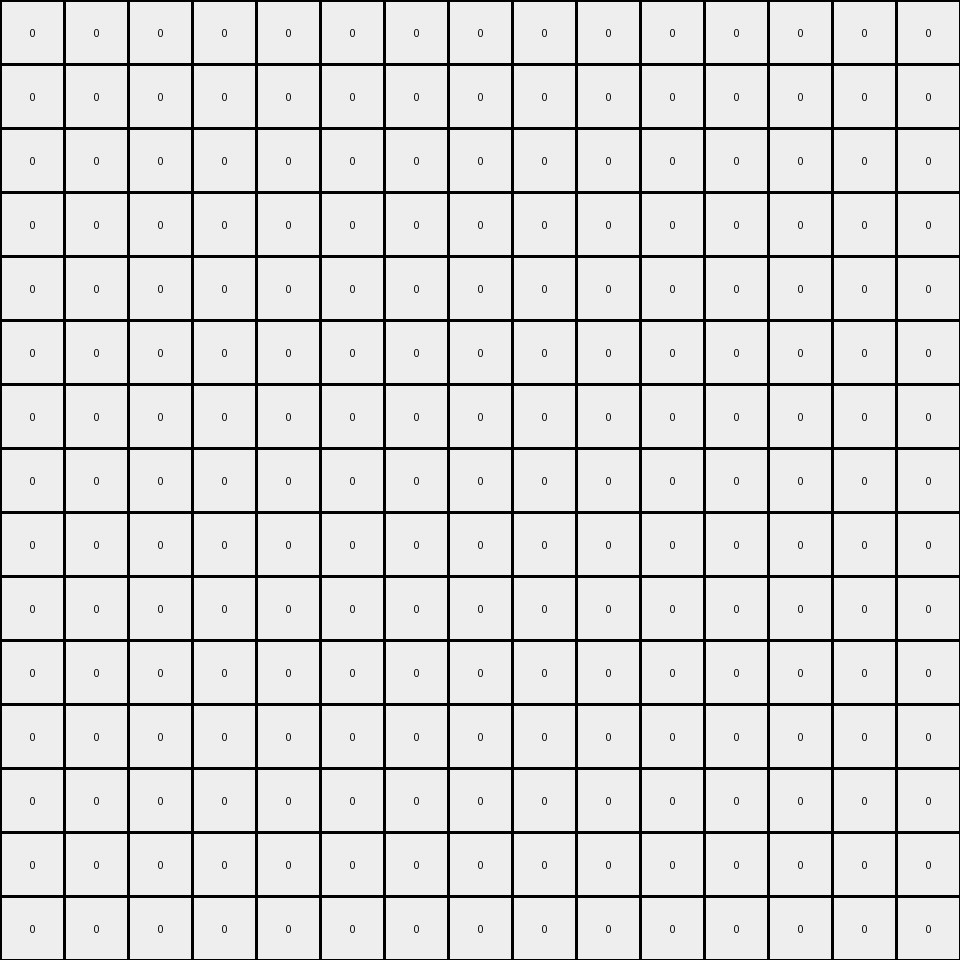

# d5d6de2d • 005 • refine_dreamer

---


Previous Code:
```python
"""
1.  **Identify Red Shapes:** Locate all contiguous regions (objects) of red (value 2) pixels in the input grid.
2.  **Identify Interior Red Pixels:** For each red object, determine the "interior" red pixels. An interior pixel is any red pixel that would still be part of a contiguous red object if any *single* non-red neighbor was hypothetically changed to red. In other words if a red pixel is changed to green in the output grid, it means that all its red-colored neighbors also changed to green.
3.  **Create Green Pixels:**  Replace the "interior" red pixels identified in step 2 with green (value 3) pixels in the output grid.
4. **Background**: All other pixels in the output grid remain unchanged or become white (value 0) if they aren't part of a transformation.
"""

import numpy as np

def get_objects(grid, color):
    """
    Finds objects of the given color in the grid.

    Args:
        grid: The input grid.
        color: The color of the objects to find.

    Returns:
        A list of objects, where each object is a set of (row, col) coordinates.
    """    
    objects = []
    visited = set()
    rows, cols = len(grid), len(grid[0])

    def is_valid(r, c):
        return 0 <= r < rows and 0 <= c < cols

    def dfs(r, c, current_object):
        if (r, c) in visited or not is_valid(r, c) or grid[r][c] != color:
            return
        visited.add((r, c))
        current_object.add((r, c))
        dfs(r + 1, c, current_object)
        dfs(r - 1, c, current_object)
        dfs(r, c + 1, current_object)
        dfs(r, c - 1, current_object)

    for r in range(rows):
        for c in range(cols):
            if grid[r][c] == color and (r, c) not in visited:
                current_object = set()
                dfs(r, c, current_object)
                objects.append(current_object)
    return objects

def get_interior_pixels(obj, grid):
    """
    Finds the interior pixels of an object based on the revised definition.
    """
    interior_pixels = set()
    rows, cols = len(grid), len(grid[0])

    for r, c in obj:
        is_interior = True
        neighbors = [(r - 1, c), (r + 1, c), (r, c - 1), (r, c + 1)]
        red_neighbors = []

        for nr, nc in neighbors:
            if 0 <= nr < rows and 0 <= nc < cols and grid[nr][nc] == 2:
                red_neighbors.append((nr, nc))
        
        # check that all the red colored neighbor should also change to green
        for nr, nc in red_neighbors:
          red_n_neighbors = [(nr - 1, nc), (nr + 1, nc), (nr, nc - 1), (nr, nc + 1)]
          for nnr, nnc in red_n_neighbors:
            if (nnr, nnc) in obj and (nnr,nnc) not in red_neighbors:
              # there exists a red neighbor's red neighbor that should not turn green
              is_interior = False
              break
          if not is_interior:
            break

        if is_interior:
            interior_pixels.add((r, c))
    return interior_pixels

def transform(input_grid):
    """
    Transforms the input grid according to the described rule.
    """
    # initialize output_grid
    output_grid = np.zeros_like(input_grid)

    # find red objects
    red_objects = get_objects(input_grid, 2)

    # find inner most red pixels
    for obj in red_objects:
      inner_pixels = get_interior_pixels(obj, input_grid)
      # create green shapes at inner positions
      for r, c in inner_pixels:
          output_grid[r][c] = 3
    

    return output_grid
```

Train Set Results:

## Example 1:

Input:
```
0 0 0 0 0 0 0 0 0 0
0 2 2 2 0 0 0 0 0 0
0 2 0 2 0 0 0 0 0 0
0 2 2 2 0 0 0 0 0 0
0 0 0 0 0 0 0 0 0 0
0 0 0 0 2 2 2 2 0 0
0 0 0 0 2 0 0 2 0 0
0 0 0 0 2 0 0 2 0 0
0 0 0 0 2 0 0 2 0 0
0 0 0 0 2 2 2 2 0 0
```
Expected Output:
```
0 0 0 0 0 0 0 0 0 0
0 0 0 0 0 0 0 0 0 0
0 0 3 0 0 0 0 0 0 0
0 0 0 0 0 0 0 0 0 0
0 0 0 0 0 0 0 0 0 0
0 0 0 0 0 0 0 0 0 0
0 0 0 0 0 3 3 0 0 0
0 0 0 0 0 3 3 0 0 0
0 0 0 0 0 3 3 0 0 0
0 0 0 0 0 0 0 0 0 0
```
Transformed Output:
```
0 0 0 0 0 0 0 0 0 0
0 0 0 0 0 0 0 0 0 0
0 0 0 0 0 0 0 0 0 0
0 0 0 0 0 0 0 0 0 0
0 0 0 0 0 0 0 0 0 0
0 0 0 0 0 0 0 0 0 0
0 0 0 0 0 0 0 0 0 0
0 0 0 0 0 0 0 0 0 0
0 0 0 0 0 0 0 0 0 0
0 0 0 0 0 0 0 0 0 0
```

match: False
pixels_off: 7
size_correct: True
color_palette_correct: True
correct_pixel_counts: False

## Example 2:

Input:
```
0 0 0 0 0 0 0 0 0 0
0 0 0 0 2 2 2 0 0 0
0 0 0 0 2 0 2 0 0 0
0 0 0 0 2 0 2 0 0 0
0 0 0 0 2 2 2 0 0 0
0 0 0 0 0 0 0 0 0 0
0 0 0 0 0 0 0 0 0 0
0 0 0 0 0 0 0 0 0 0
0 0 0 0 0 0 0 0 0 0
0 0 0 0 0 0 0 0 0 0
```
Expected Output:
```
0 0 0 0 0 0 0 0 0 0
0 0 0 0 0 0 0 0 0 0
0 0 0 0 0 3 0 0 0 0
0 0 0 0 0 3 0 0 0 0
0 0 0 0 0 0 0 0 0 0
0 0 0 0 0 0 0 0 0 0
0 0 0 0 0 0 0 0 0 0
0 0 0 0 0 0 0 0 0 0
0 0 0 0 0 0 0 0 0 0
0 0 0 0 0 0 0 0 0 0
```
Transformed Output:
```
0 0 0 0 0 0 0 0 0 0
0 0 0 0 0 0 0 0 0 0
0 0 0 0 0 0 0 0 0 0
0 0 0 0 0 0 0 0 0 0
0 0 0 0 0 0 0 0 0 0
0 0 0 0 0 0 0 0 0 0
0 0 0 0 0 0 0 0 0 0
0 0 0 0 0 0 0 0 0 0
0 0 0 0 0 0 0 0 0 0
0 0 0 0 0 0 0 0 0 0
```

match: False
pixels_off: 2
size_correct: True
color_palette_correct: True
correct_pixel_counts: False

## Example 3:

Input:
```
0 0 0 0 0 0 0 0 0 0 0 0 0 0 0
0 2 2 2 2 2 0 0 0 0 0 0 0 0 0
0 2 0 0 0 2 0 0 0 0 0 0 0 0 0
0 2 0 0 0 2 0 0 0 0 0 0 0 0 0
0 2 0 0 0 2 0 0 0 0 0 0 0 0 0
0 2 2 2 2 2 0 0 0 0 0 0 0 0 0
0 0 0 0 0 0 0 0 0 0 0 0 0 0 0
0 0 0 0 0 0 0 0 0 0 2 2 0 0 0
0 0 0 0 0 0 0 0 0 0 2 2 0 0 0
0 0 0 0 0 0 0 0 0 0 0 0 0 0 0
0 0 0 0 0 0 0 0 0 0 0 0 0 0 0
0 0 0 0 0 0 0 0 0 0 0 0 0 0 0
0 0 0 0 0 0 0 0 0 0 0 0 0 0 0
0 0 0 0 0 0 0 0 0 0 0 0 0 0 0
0 0 0 0 0 0 0 0 0 0 0 0 0 0 0
```
Expected Output:
```
0 0 0 0 0 0 0 0 0 0 0 0 0 0 0
0 0 0 0 0 0 0 0 0 0 0 0 0 0 0
0 0 3 3 3 0 0 0 0 0 0 0 0 0 0
0 0 3 3 3 0 0 0 0 0 0 0 0 0 0
0 0 3 3 3 0 0 0 0 0 0 0 0 0 0
0 0 0 0 0 0 0 0 0 0 0 0 0 0 0
0 0 0 0 0 0 0 0 0 0 0 0 0 0 0
0 0 0 0 0 0 0 0 0 0 0 0 0 0 0
0 0 0 0 0 0 0 0 0 0 0 0 0 0 0
0 0 0 0 0 0 0 0 0 0 0 0 0 0 0
0 0 0 0 0 0 0 0 0 0 0 0 0 0 0
0 0 0 0 0 0 0 0 0 0 0 0 0 0 0
0 0 0 0 0 0 0 0 0 0 0 0 0 0 0
0 0 0 0 0 0 0 0 0 0 0 0 0 0 0
0 0 0 0 0 0 0 0 0 0 0 0 0 0 0
```
Transformed Output:
```
0 0 0 0 0 0 0 0 0 0 0 0 0 0 0
0 0 0 0 0 0 0 0 0 0 0 0 0 0 0
0 0 0 0 0 0 0 0 0 0 0 0 0 0 0
0 0 0 0 0 0 0 0 0 0 0 0 0 0 0
0 0 0 0 0 0 0 0 0 0 0 0 0 0 0
0 0 0 0 0 0 0 0 0 0 0 0 0 0 0
0 0 0 0 0 0 0 0 0 0 0 0 0 0 0
0 0 0 0 0 0 0 0 0 0 0 0 0 0 0
0 0 0 0 0 0 0 0 0 0 0 0 0 0 0
0 0 0 0 0 0 0 0 0 0 0 0 0 0 0
0 0 0 0 0 0 0 0 0 0 0 0 0 0 0
0 0 0 0 0 0 0 0 0 0 0 0 0 0 0
0 0 0 0 0 0 0 0 0 0 0 0 0 0 0
0 0 0 0 0 0 0 0 0 0 0 0 0 0 0
0 0 0 0 0 0 0 0 0 0 0 0 0 0 0
```

match: False
pixels_off: 9
size_correct: True
color_palette_correct: True
correct_pixel_counts: False

**INSTRUCTIONS**

The code above was generated based on observations from the first training
example

we have tested the transform function on each of the task example inputs and
compared with the expected output

review each of the examples provided and the results and consider how the
natural language program should be updated to accommodate this new knowledge

respond with the following deliverables:

- general assessment of the information provided and strategy for resolving the
  errors
- gather metrics about each of the examples and results - use code_execution to
  develop accurate reports on your assumptions
- a YAML block documenting facts - Focus on identifying objects, their properties, and the actions performed on them.
- a natural language program - Be as clear and concise as possible, providing a complete description of the transformation rule.


your responses should be considered as information in a report - not a
conversation
