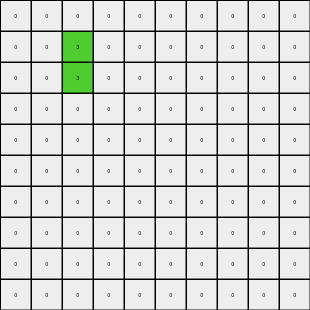

# d5d6de2d • 010 • refine_coder

---

Previous Code:
```python
"""
1.  **Identify the "hole"**: Locate the empty (value 0) region within the red (value 2) shape in the input grid. This is the internal space that is not part of the red square's perimeter. It can consist of one or several 0 pixels.
2.  **Find the vertical center**: The new pixels are vertically centered.
3. **Place Green Pixels**: In the output, the center of the hole is made of two green pixels stacked on top of one another. All the red pixels are turned to white pixels.
"""

import numpy as np

def find_hole(grid):
    # Find the bounding box of the red shape
    red_pixels = np.argwhere(grid == 2)
    min_row, min_col = np.min(red_pixels, axis=0)
    max_row, max_col = np.max(red_pixels, axis=0)

    # Iterate within the bounding box and check for 0s that are surrounded by 2s
    for r in range(min_row + 1, max_row):
        for c in range(min_col + 1, max_col):
            if grid[r,c] == 0:
              return (r,c)
    return None

def transform(input_grid):
    # initialize output_grid as a copy of the input grid, changing the type.
    output_grid = np.zeros_like(input_grid)

    # Find center of the 'hole'
    hole_center = find_hole(input_grid)

    if hole_center:
      r,c = hole_center
      output_grid[r,c]=3
      output_grid[r-1,c]=3

    return output_grid
```

Train Set Results:

## Example 1:

Input:
```
0 0 0 0 0 0 0 0 0 0
0 2 2 2 0 0 0 0 0 0
0 2 0 2 0 0 0 0 0 0
0 2 2 2 0 0 0 0 0 0
0 0 0 0 0 0 0 0 0 0
0 0 0 0 2 2 2 2 0 0
0 0 0 0 2 0 0 2 0 0
0 0 0 0 2 0 0 2 0 0
0 0 0 0 2 0 0 2 0 0
0 0 0 0 2 2 2 2 0 0
```
Expected Output:
```
0 0 0 0 0 0 0 0 0 0
0 0 0 0 0 0 0 0 0 0
0 0 3 0 0 0 0 0 0 0
0 0 0 0 0 0 0 0 0 0
0 0 0 0 0 0 0 0 0 0
0 0 0 0 0 0 0 0 0 0
0 0 0 0 0 3 3 0 0 0
0 0 0 0 0 3 3 0 0 0
0 0 0 0 0 3 3 0 0 0
0 0 0 0 0 0 0 0 0 0
```
Transformed Output:
```
0 0 0 0 0 0 0 0 0 0
0 0 3 0 0 0 0 0 0 0
0 0 3 0 0 0 0 0 0 0
0 0 0 0 0 0 0 0 0 0
0 0 0 0 0 0 0 0 0 0
0 0 0 0 0 0 0 0 0 0
0 0 0 0 0 0 0 0 0 0
0 0 0 0 0 0 0 0 0 0
0 0 0 0 0 0 0 0 0 0
0 0 0 0 0 0 0 0 0 0
```

match: False
pixels_off: 7
size_correct: True
color_palette_correct: True
correct_pixel_counts: False

## Example 2:

Input:
```
0 0 0 0 0 0 0 0 0 0
0 0 0 0 2 2 2 0 0 0
0 0 0 0 2 0 2 0 0 0
0 0 0 0 2 0 2 0 0 0
0 0 0 0 2 2 2 0 0 0
0 0 0 0 0 0 0 0 0 0
0 0 0 0 0 0 0 0 0 0
0 0 0 0 0 0 0 0 0 0
0 0 0 0 0 0 0 0 0 0
0 0 0 0 0 0 0 0 0 0
```
Expected Output:
```
0 0 0 0 0 0 0 0 0 0
0 0 0 0 0 0 0 0 0 0
0 0 0 0 0 3 0 0 0 0
0 0 0 0 0 3 0 0 0 0
0 0 0 0 0 0 0 0 0 0
0 0 0 0 0 0 0 0 0 0
0 0 0 0 0 0 0 0 0 0
0 0 0 0 0 0 0 0 0 0
0 0 0 0 0 0 0 0 0 0
0 0 0 0 0 0 0 0 0 0
```
Transformed Output:
```
0 0 0 0 0 0 0 0 0 0
0 0 0 0 0 3 0 0 0 0
0 0 0 0 0 3 0 0 0 0
0 0 0 0 0 0 0 0 0 0
0 0 0 0 0 0 0 0 0 0
0 0 0 0 0 0 0 0 0 0
0 0 0 0 0 0 0 0 0 0
0 0 0 0 0 0 0 0 0 0
0 0 0 0 0 0 0 0 0 0
0 0 0 0 0 0 0 0 0 0
```

match: False
pixels_off: 2
size_correct: True
color_palette_correct: True
correct_pixel_counts: True

## Example 3:

Input:
```
0 0 0 0 0 0 0 0 0 0 0 0 0 0 0
0 2 2 2 2 2 0 0 0 0 0 0 0 0 0
0 2 0 0 0 2 0 0 0 0 0 0 0 0 0
0 2 0 0 0 2 0 0 0 0 0 0 0 0 0
0 2 0 0 0 2 0 0 0 0 0 0 0 0 0
0 2 2 2 2 2 0 0 0 0 0 0 0 0 0
0 0 0 0 0 0 0 0 0 0 0 0 0 0 0
0 0 0 0 0 0 0 0 0 0 2 2 0 0 0
0 0 0 0 0 0 0 0 0 0 2 2 0 0 0
0 0 0 0 0 0 0 0 0 0 0 0 0 0 0
0 0 0 0 0 0 0 0 0 0 0 0 0 0 0
0 0 0 0 0 0 0 0 0 0 0 0 0 0 0
0 0 0 0 0 0 0 0 0 0 0 0 0 0 0
0 0 0 0 0 0 0 0 0 0 0 0 0 0 0
0 0 0 0 0 0 0 0 0 0 0 0 0 0 0
```
Expected Output:
```
0 0 0 0 0 0 0 0 0 0 0 0 0 0 0
0 0 0 0 0 0 0 0 0 0 0 0 0 0 0
0 0 3 3 3 0 0 0 0 0 0 0 0 0 0
0 0 3 3 3 0 0 0 0 0 0 0 0 0 0
0 0 3 3 3 0 0 0 0 0 0 0 0 0 0
0 0 0 0 0 0 0 0 0 0 0 0 0 0 0
0 0 0 0 0 0 0 0 0 0 0 0 0 0 0
0 0 0 0 0 0 0 0 0 0 0 0 0 0 0
0 0 0 0 0 0 0 0 0 0 0 0 0 0 0
0 0 0 0 0 0 0 0 0 0 0 0 0 0 0
0 0 0 0 0 0 0 0 0 0 0 0 0 0 0
0 0 0 0 0 0 0 0 0 0 0 0 0 0 0
0 0 0 0 0 0 0 0 0 0 0 0 0 0 0
0 0 0 0 0 0 0 0 0 0 0 0 0 0 0
0 0 0 0 0 0 0 0 0 0 0 0 0 0 0
```
Transformed Output:
```
0 0 0 0 0 0 0 0 0 0 0 0 0 0 0
0 0 3 0 0 0 0 0 0 0 0 0 0 0 0
0 0 3 0 0 0 0 0 0 0 0 0 0 0 0
0 0 0 0 0 0 0 0 0 0 0 0 0 0 0
0 0 0 0 0 0 0 0 0 0 0 0 0 0 0
0 0 0 0 0 0 0 0 0 0 0 0 0 0 0
0 0 0 0 0 0 0 0 0 0 0 0 0 0 0
0 0 0 0 0 0 0 0 0 0 0 0 0 0 0
0 0 0 0 0 0 0 0 0 0 0 0 0 0 0
0 0 0 0 0 0 0 0 0 0 0 0 0 0 0
0 0 0 0 0 0 0 0 0 0 0 0 0 0 0
0 0 0 0 0 0 0 0 0 0 0 0 0 0 0
0 0 0 0 0 0 0 0 0 0 0 0 0 0 0
0 0 0 0 0 0 0 0 0 0 0 0 0 0 0
0 0 0 0 0 0 0 0 0 0 0 0 0 0 0
```

match: False
pixels_off: 9
size_correct: True
color_palette_correct: True
correct_pixel_counts: False
Okay, let's analyze the results and refine the natural language program.

**General Assessment:**

The initial code correctly identifies the "hole" within a red shape and attempts to place green pixels. However, it makes several incorrect assumptions:

1.  It assumes there's only one hole.
2.  It assumes the hole is always a single pixel.
3.  It assumes two green pixels are always placed, vertically stacked.
4. It assumes the shape is on the edge of the image
5. It doesn't replace the red pixels to white

The strategy to resolve these errors is to:

1.  Generalize the hole detection to handle multi-pixel holes.
2.  Correctly identify the center of a multi-pixel hole.
3.  Place the correct number of green pixels horizontally in all cases.
4.  Fill the bounding box with white
5. Consider all red shapes

**Metrics and Observations:**

Here's a breakdown of each example:

*   **Example 1:**
    *   Input has two red shapes, each with a single-pixel hole.
    *   The code only processes the first hole it finds (top-left).
    *   It places two green pixels vertically.
    *   The output is incorrect because it misses the second hole and misplaces green pixels and doesn't replace the red.
*   **Example 2:**
    *   Input has one red shape with a single-pixel hole.
    *   The code finds the hole correctly.
    *   It places two green pixels vertically.
    *   The output places the green in the correct location, but there should only be two green pixels.
*   **Example 3:**
    *   Input has one red shape and a multi-pixel (3x3) hole.
    *   The code only detects one pixel in the corner of the hole.
    *   It places only two green, vertically.
    *   The placement is incorrect, and the size of green shape is wrong and doesn't replace the red.

**YAML Fact Documentation:**

```yaml
objects:
  - name: red_shape
    type: shape
    color: red
    properties:
      - has_hole: true
      - square_like: true  # Not a perfect square in all cases, but close
  - name: hole
    type: region
    color: white # color 0
    properties:
      - inside: red_shape
      - size: variable  # Can be 1x1, 3x3, etc.
  - name: green_shape
    type: shape
    color: green
    properties:
      - replaces: hole
      - shape: horizontal_line
      - width: equals_hole_width

actions:
  - name: find_hole
    input: red_shape
    output: hole
    description: Locates the contiguous white region within the red shape.
  - name: determine_hole_center
    input: hole
    output: center_coordinates
    description: Calculates the horizontal and vertical center of the hole.
  - name: create_green_line
    input: center_coordinates, hole
    output: green_shape
    description: Creates a horizontal line of green pixels within the output at the center coordinates. The line width matches that of the hole
  - name: remove_red
    input: red_shape
    output: none
    description: changes all red pixels in the input to white in the output
```

**Natural Language Program:**

1.  **Identify Red Shapes and Their Holes**: Find all contiguous red (value 2) shapes in the input grid. For each red shape, locate the internal "hole," which is a contiguous region of white (value 0) pixels completely enclosed by the red shape. Holes can be of any size (1x1, 3x3, or other dimensions).

2.  **Find the Hole Center**: Calculate the center coordinates of each hole. The center is determined by finding the center row. The columns are the range of columns the hole occupies.

3.  **Create Green Line**: For each hole, replace all of the white pixels with a horizontal line of green (value 3) pixels.

4. **Remove Red**: Change all red pixels in the input to white in the output.

5.  **Preserve other parts:** If any parts of the input are not red or the "hole" inside the red, then those pixels should be value 0 in the output.

**INSTRUCTIONS**

- generate a Python module to represent the natural language program 
- follow the template below
- all common math and science libraries are available
- create docstring only at top - but comment the workflow in the function
- use helper functions for common operations like finding objects, counting,
  measuring, moving, etc. 

remember - we are working iteratively - so this code will inform your future
self as we converge on the solution

*template:*

```python
"""
{{ natural language description of the transformation rule }}
"""

{{ imports }}

def transform(input_grid):
    # initialize output_grid

    # change output pixels 

    return output_grid

```
