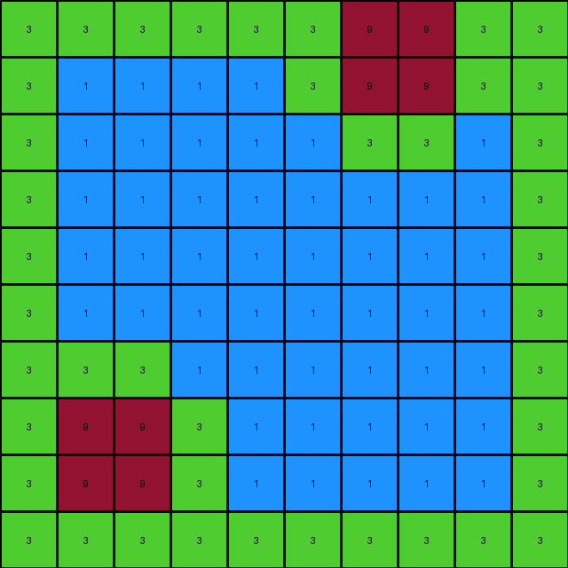
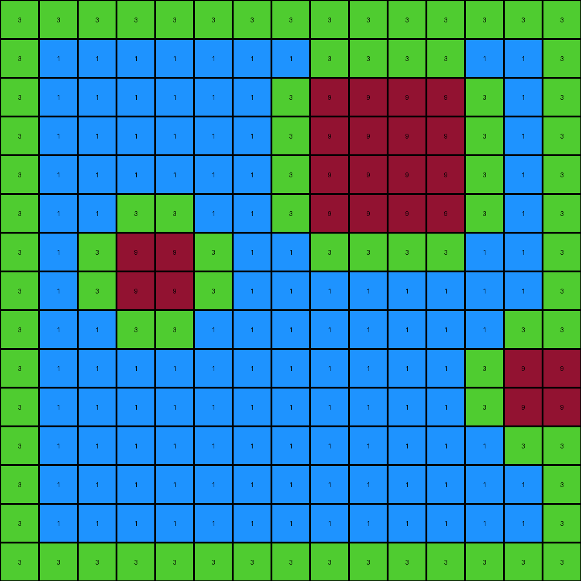
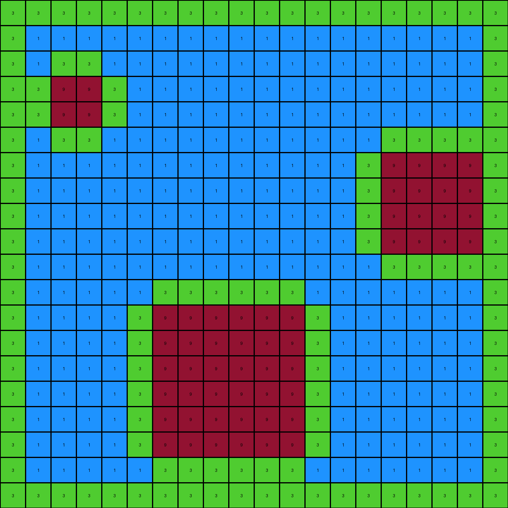
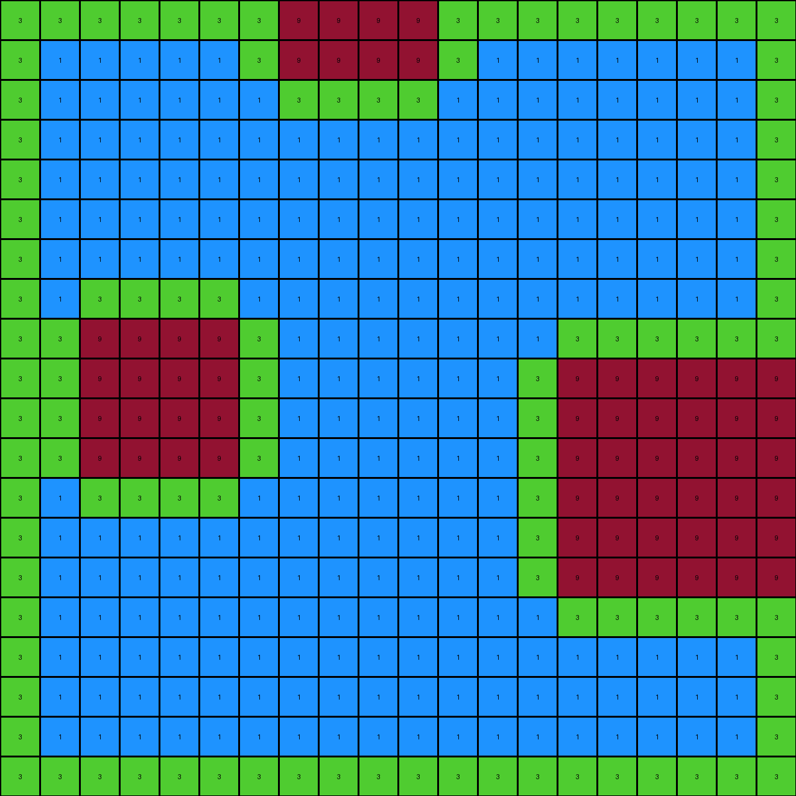

# db93a21d • 005 • refine_dreamer

---

Previous Code:
```python
"""
1. Preserve Maroon: Copy all maroon (9) pixels from the input to the output grid.
2. Green Outline:
    *   Any white (0) pixel that is adjacent (up, down, left, or right) to a maroon (9) pixel is changed to green (3) in the output.
    *   Any white pixel that is adjacent to the edge of the grid is changed to green (3) in the output
3.  Blue Object: Identify the spaces created enclosed by a green outline. Fill this shape with blue (1) pixels.
"""

import numpy as np

def get_neighbors(grid, row, col):
    """Gets the valid neighbors of a cell (up, down, left, right)."""
    rows, cols = grid.shape
    neighbors = []
    if row > 0:
        neighbors.append((row - 1, col))  # Up
    if row < rows - 1:
        neighbors.append((row + 1, col))  # Down
    if col > 0:
        neighbors.append((row, col - 1))  # Left
    if col < cols - 1:
        neighbors.append((row, col + 1))  # Right
    return neighbors

def transform(input_grid):
    """Transforms the input grid according to the defined rules."""
    output_grid = np.copy(input_grid)
    rows, cols = input_grid.shape

    # Preserve Maroon
    # (No change needed here - already correct)

   # Green Outline (including edge)
    for row in range(rows):
        for col in range(cols):
            if input_grid[row, col] == 9:  #Maroon
                for r, c in get_neighbors(input_grid, row, col):
                    if input_grid[r,c] == 0:
                        output_grid[r,c] = 3
            elif input_grid[row,col] == 0:
                is_edge = row == 0 or row == rows -1 or col == 0 or col == cols - 1
                if is_edge:
                    output_grid[row,col] = 3

    # Flood fill for blue objects
    for row in range(rows):
        for col in range(cols):
            if output_grid[row, col] == 0:
                output_grid[row,col] = 1

    return output_grid
```

Train Set Results:

## Example 1:

Input:
```
0 0 0 0 0 0 9 9 0 0
0 0 0 0 0 0 9 9 0 0
0 0 0 0 0 0 0 0 0 0
0 0 0 0 0 0 0 0 0 0
0 0 0 0 0 0 0 0 0 0
0 0 0 0 0 0 0 0 0 0
0 0 0 0 0 0 0 0 0 0
0 9 9 0 0 0 0 0 0 0
0 9 9 0 0 0 0 0 0 0
0 0 0 0 0 0 0 0 0 0
```
Expected Output:
```
0 0 0 0 0 3 9 9 3 0
0 0 0 0 0 3 9 9 3 0
0 0 0 0 0 3 3 3 3 0
0 0 0 0 0 0 1 1 0 0
0 0 0 0 0 0 1 1 0 0
0 0 0 0 0 0 1 1 0 0
3 3 3 3 0 0 1 1 0 0
3 9 9 3 0 0 1 1 0 0
3 9 9 3 0 0 1 1 0 0
3 3 3 3 0 0 1 1 0 0
```
Transformed Output:
```
3 3 3 3 3 3 9 9 3 3
3 1 1 1 1 3 9 9 3 3
3 1 1 1 1 1 3 3 1 3
3 1 1 1 1 1 1 1 1 3
3 1 1 1 1 1 1 1 1 3
3 1 1 1 1 1 1 1 1 3
3 3 3 1 1 1 1 1 1 3
3 9 9 3 1 1 1 1 1 3
3 9 9 3 1 1 1 1 1 3
3 3 3 3 3 3 3 3 3 3
```

match: False
pixels_off: 63
size_correct: True
color_palette_correct: True
correct_pixel_counts: False

## Example 2:

Input:
```
0 0 0 0 0 0 0 0 0 0 0 0 0 0 0
0 0 0 0 0 0 0 0 0 0 0 0 0 0 0
0 0 0 0 0 0 0 0 9 9 9 9 0 0 0
0 0 0 0 0 0 0 0 9 9 9 9 0 0 0
0 0 0 0 0 0 0 0 9 9 9 9 0 0 0
0 0 0 0 0 0 0 0 9 9 9 9 0 0 0
0 0 0 9 9 0 0 0 0 0 0 0 0 0 0
0 0 0 9 9 0 0 0 0 0 0 0 0 0 0
0 0 0 0 0 0 0 0 0 0 0 0 0 0 0
0 0 0 0 0 0 0 0 0 0 0 0 0 9 9
0 0 0 0 0 0 0 0 0 0 0 0 0 9 9
0 0 0 0 0 0 0 0 0 0 0 0 0 0 0
0 0 0 0 0 0 0 0 0 0 0 0 0 0 0
0 0 0 0 0 0 0 0 0 0 0 0 0 0 0
0 0 0 0 0 0 0 0 0 0 0 0 0 0 0
```
Expected Output:
```
0 0 0 0 0 0 3 3 3 3 3 3 3 3 0
0 0 0 0 0 0 3 3 3 3 3 3 3 3 0
0 0 0 0 0 0 3 3 9 9 9 9 3 3 0
0 0 0 0 0 0 3 3 9 9 9 9 3 3 0
0 0 0 0 0 0 3 3 9 9 9 9 3 3 0
0 0 3 3 3 3 3 3 9 9 9 9 3 3 0
0 0 3 9 9 3 3 3 3 3 3 3 3 3 0
0 0 3 9 9 3 3 3 3 3 3 3 3 3 0
0 0 3 3 3 3 0 0 1 1 1 1 3 3 3
0 0 0 1 1 0 0 0 1 1 1 1 3 9 9
0 0 0 1 1 0 0 0 1 1 1 1 3 9 9
0 0 0 1 1 0 0 0 1 1 1 1 3 3 3
0 0 0 1 1 0 0 0 1 1 1 1 0 1 1
0 0 0 1 1 0 0 0 1 1 1 1 0 1 1
0 0 0 1 1 0 0 0 1 1 1 1 0 1 1
```
Transformed Output:
```
3 3 3 3 3 3 3 3 3 3 3 3 3 3 3
3 1 1 1 1 1 1 1 3 3 3 3 1 1 3
3 1 1 1 1 1 1 3 9 9 9 9 3 1 3
3 1 1 1 1 1 1 3 9 9 9 9 3 1 3
3 1 1 1 1 1 1 3 9 9 9 9 3 1 3
3 1 1 3 3 1 1 3 9 9 9 9 3 1 3
3 1 3 9 9 3 1 1 3 3 3 3 1 1 3
3 1 3 9 9 3 1 1 1 1 1 1 1 1 3
3 1 1 3 3 1 1 1 1 1 1 1 1 3 3
3 1 1 1 1 1 1 1 1 1 1 1 3 9 9
3 1 1 1 1 1 1 1 1 1 1 1 3 9 9
3 1 1 1 1 1 1 1 1 1 1 1 1 3 3
3 1 1 1 1 1 1 1 1 1 1 1 1 1 3
3 1 1 1 1 1 1 1 1 1 1 1 1 1 3
3 3 3 3 3 3 3 3 3 3 3 3 3 3 3
```

match: False
pixels_off: 127
size_correct: True
color_palette_correct: True
correct_pixel_counts: False

## Example 3:

Input:
```
0 0 0 0 0 0 0 0 0 0 0 0 0 0 0 0 0 0 0 0
0 0 0 0 0 0 0 0 0 0 0 0 0 0 0 0 0 0 0 0
0 0 0 0 0 0 0 0 0 0 0 0 0 0 0 0 0 0 0 0
0 0 9 9 0 0 0 0 0 0 0 0 0 0 0 0 0 0 0 0
0 0 9 9 0 0 0 0 0 0 0 0 0 0 0 0 0 0 0 0
0 0 0 0 0 0 0 0 0 0 0 0 0 0 0 0 0 0 0 0
0 0 0 0 0 0 0 0 0 0 0 0 0 0 0 9 9 9 9 0
0 0 0 0 0 0 0 0 0 0 0 0 0 0 0 9 9 9 9 0
0 0 0 0 0 0 0 0 0 0 0 0 0 0 0 9 9 9 9 0
0 0 0 0 0 0 0 0 0 0 0 0 0 0 0 9 9 9 9 0
0 0 0 0 0 0 0 0 0 0 0 0 0 0 0 0 0 0 0 0
0 0 0 0 0 0 0 0 0 0 0 0 0 0 0 0 0 0 0 0
0 0 0 0 0 0 9 9 9 9 9 9 0 0 0 0 0 0 0 0
0 0 0 0 0 0 9 9 9 9 9 9 0 0 0 0 0 0 0 0
0 0 0 0 0 0 9 9 9 9 9 9 0 0 0 0 0 0 0 0
0 0 0 0 0 0 9 9 9 9 9 9 0 0 0 0 0 0 0 0
0 0 0 0 0 0 9 9 9 9 9 9 0 0 0 0 0 0 0 0
0 0 0 0 0 0 9 9 9 9 9 9 0 0 0 0 0 0 0 0
0 0 0 0 0 0 0 0 0 0 0 0 0 0 0 0 0 0 0 0
0 0 0 0 0 0 0 0 0 0 0 0 0 0 0 0 0 0 0 0
```
Expected Output:
```
0 0 0 0 0 0 0 0 0 0 0 0 0 0 0 0 0 0 0 0
0 0 0 0 0 0 0 0 0 0 0 0 0 0 0 0 0 0 0 0
0 3 3 3 3 0 0 0 0 0 0 0 0 0 0 0 0 0 0 0
0 3 9 9 3 0 0 0 0 0 0 0 0 0 0 0 0 0 0 0
0 3 9 9 3 0 0 0 0 0 0 0 0 3 3 3 3 3 3 3
0 3 3 3 3 0 0 0 0 0 0 0 0 3 3 3 3 3 3 3
0 0 1 1 0 0 0 0 0 0 0 0 0 3 3 9 9 9 9 3
0 0 1 1 0 0 0 0 0 0 0 0 0 3 3 9 9 9 9 3
0 0 1 1 0 0 0 0 0 0 0 0 0 3 3 9 9 9 9 3
0 0 1 3 3 3 3 3 3 3 3 3 3 3 3 9 9 9 9 3
0 0 1 3 3 3 3 3 3 3 3 3 3 3 3 3 3 3 3 3
0 0 1 3 3 3 3 3 3 3 3 3 3 3 3 3 3 3 3 3
0 0 1 3 3 3 9 9 9 9 9 9 3 3 3 1 1 1 1 0
0 0 1 3 3 3 9 9 9 9 9 9 3 3 3 1 1 1 1 0
0 0 1 3 3 3 9 9 9 9 9 9 3 3 3 1 1 1 1 0
0 0 1 3 3 3 9 9 9 9 9 9 3 3 3 1 1 1 1 0
0 0 1 3 3 3 9 9 9 9 9 9 3 3 3 1 1 1 1 0
0 0 1 3 3 3 9 9 9 9 9 9 3 3 3 1 1 1 1 0
0 0 1 3 3 3 3 3 3 3 3 3 3 3 3 1 1 1 1 0
0 0 1 3 3 3 3 3 3 3 3 3 3 3 3 1 1 1 1 0
```
Transformed Output:
```
3 3 3 3 3 3 3 3 3 3 3 3 3 3 3 3 3 3 3 3
3 1 1 1 1 1 1 1 1 1 1 1 1 1 1 1 1 1 1 3
3 1 3 3 1 1 1 1 1 1 1 1 1 1 1 1 1 1 1 3
3 3 9 9 3 1 1 1 1 1 1 1 1 1 1 1 1 1 1 3
3 3 9 9 3 1 1 1 1 1 1 1 1 1 1 1 1 1 1 3
3 1 3 3 1 1 1 1 1 1 1 1 1 1 1 3 3 3 3 3
3 1 1 1 1 1 1 1 1 1 1 1 1 1 3 9 9 9 9 3
3 1 1 1 1 1 1 1 1 1 1 1 1 1 3 9 9 9 9 3
3 1 1 1 1 1 1 1 1 1 1 1 1 1 3 9 9 9 9 3
3 1 1 1 1 1 1 1 1 1 1 1 1 1 3 9 9 9 9 3
3 1 1 1 1 1 1 1 1 1 1 1 1 1 1 3 3 3 3 3
3 1 1 1 1 1 3 3 3 3 3 3 1 1 1 1 1 1 1 3
3 1 1 1 1 3 9 9 9 9 9 9 3 1 1 1 1 1 1 3
3 1 1 1 1 3 9 9 9 9 9 9 3 1 1 1 1 1 1 3
3 1 1 1 1 3 9 9 9 9 9 9 3 1 1 1 1 1 1 3
3 1 1 1 1 3 9 9 9 9 9 9 3 1 1 1 1 1 1 3
3 1 1 1 1 3 9 9 9 9 9 9 3 1 1 1 1 1 1 3
3 1 1 1 1 3 9 9 9 9 9 9 3 1 1 1 1 1 1 3
3 1 1 1 1 1 3 3 3 3 3 3 1 1 1 1 1 1 1 3
3 3 3 3 3 3 3 3 3 3 3 3 3 3 3 3 3 3 3 3
```

match: False
pixels_off: 236
size_correct: True
color_palette_correct: True
correct_pixel_counts: False

## Example 4:

Input:
```
0 0 0 0 0 0 0 9 9 9 9 0 0 0 0 0 0 0 0 0
0 0 0 0 0 0 0 9 9 9 9 0 0 0 0 0 0 0 0 0
0 0 0 0 0 0 0 0 0 0 0 0 0 0 0 0 0 0 0 0
0 0 0 0 0 0 0 0 0 0 0 0 0 0 0 0 0 0 0 0
0 0 0 0 0 0 0 0 0 0 0 0 0 0 0 0 0 0 0 0
0 0 0 0 0 0 0 0 0 0 0 0 0 0 0 0 0 0 0 0
0 0 0 0 0 0 0 0 0 0 0 0 0 0 0 0 0 0 0 0
0 0 0 0 0 0 0 0 0 0 0 0 0 0 0 0 0 0 0 0
0 0 9 9 9 9 0 0 0 0 0 0 0 0 0 0 0 0 0 0
0 0 9 9 9 9 0 0 0 0 0 0 0 0 9 9 9 9 9 9
0 0 9 9 9 9 0 0 0 0 0 0 0 0 9 9 9 9 9 9
0 0 9 9 9 9 0 0 0 0 0 0 0 0 9 9 9 9 9 9
0 0 0 0 0 0 0 0 0 0 0 0 0 0 9 9 9 9 9 9
0 0 0 0 0 0 0 0 0 0 0 0 0 0 9 9 9 9 9 9
0 0 0 0 0 0 0 0 0 0 0 0 0 0 9 9 9 9 9 9
0 0 0 0 0 0 0 0 0 0 0 0 0 0 0 0 0 0 0 0
0 0 0 0 0 0 0 0 0 0 0 0 0 0 0 0 0 0 0 0
0 0 0 0 0 0 0 0 0 0 0 0 0 0 0 0 0 0 0 0
0 0 0 0 0 0 0 0 0 0 0 0 0 0 0 0 0 0 0 0
0 0 0 0 0 0 0 0 0 0 0 0 0 0 0 0 0 0 0 0
```
Expected Output:
```
0 0 0 0 0 3 3 9 9 9 9 3 3 0 0 0 0 0 0 0
0 0 0 0 0 3 3 9 9 9 9 3 3 0 0 0 0 0 0 0
0 0 0 0 0 3 3 3 3 3 3 3 3 0 0 0 0 0 0 0
0 0 0 0 0 3 3 3 3 3 3 3 3 0 0 0 0 0 0 0
0 0 0 0 0 0 0 1 1 1 1 0 0 0 0 0 0 0 0 0
0 0 0 0 0 0 0 1 1 1 1 0 0 0 0 0 0 0 0 0
3 3 3 3 3 3 3 3 1 1 1 3 3 3 3 3 3 3 3 3
3 3 3 3 3 3 3 3 1 1 1 3 3 3 3 3 3 3 3 3
3 3 9 9 9 9 3 3 1 1 1 3 3 3 3 3 3 3 3 3
3 3 9 9 9 9 3 3 1 1 1 3 3 3 9 9 9 9 9 9
3 3 9 9 9 9 3 3 1 1 1 3 3 3 9 9 9 9 9 9
3 3 9 9 9 9 3 3 1 1 1 3 3 3 9 9 9 9 9 9
3 3 3 3 3 3 3 3 1 1 1 3 3 3 9 9 9 9 9 9
3 3 3 3 3 3 3 3 1 1 1 3 3 3 9 9 9 9 9 9
0 0 1 1 1 1 0 1 1 1 1 3 3 3 9 9 9 9 9 9
0 0 1 1 1 1 0 1 1 1 1 3 3 3 3 3 3 3 3 3
0 0 1 1 1 1 0 1 1 1 1 3 3 3 3 3 3 3 3 3
0 0 1 1 1 1 0 1 1 1 1 3 3 3 3 3 3 3 3 3
0 0 1 1 1 1 0 1 1 1 1 0 0 0 1 1 1 1 1 1
0 0 1 1 1 1 0 1 1 1 1 0 0 0 1 1 1 1 1 1
```
Transformed Output:
```
3 3 3 3 3 3 3 9 9 9 9 3 3 3 3 3 3 3 3 3
3 1 1 1 1 1 3 9 9 9 9 3 1 1 1 1 1 1 1 3
3 1 1 1 1 1 1 3 3 3 3 1 1 1 1 1 1 1 1 3
3 1 1 1 1 1 1 1 1 1 1 1 1 1 1 1 1 1 1 3
3 1 1 1 1 1 1 1 1 1 1 1 1 1 1 1 1 1 1 3
3 1 1 1 1 1 1 1 1 1 1 1 1 1 1 1 1 1 1 3
3 1 1 1 1 1 1 1 1 1 1 1 1 1 1 1 1 1 1 3
3 1 3 3 3 3 1 1 1 1 1 1 1 1 1 1 1 1 1 3
3 3 9 9 9 9 3 1 1 1 1 1 1 1 3 3 3 3 3 3
3 3 9 9 9 9 3 1 1 1 1 1 1 3 9 9 9 9 9 9
3 3 9 9 9 9 3 1 1 1 1 1 1 3 9 9 9 9 9 9
3 3 9 9 9 9 3 1 1 1 1 1 1 3 9 9 9 9 9 9
3 1 3 3 3 3 1 1 1 1 1 1 1 3 9 9 9 9 9 9
3 1 1 1 1 1 1 1 1 1 1 1 1 3 9 9 9 9 9 9
3 1 1 1 1 1 1 1 1 1 1 1 1 3 9 9 9 9 9 9
3 1 1 1 1 1 1 1 1 1 1 1 1 1 3 3 3 3 3 3
3 1 1 1 1 1 1 1 1 1 1 1 1 1 1 1 1 1 1 3
3 1 1 1 1 1 1 1 1 1 1 1 1 1 1 1 1 1 1 3
3 1 1 1 1 1 1 1 1 1 1 1 1 1 1 1 1 1 1 3
3 3 3 3 3 3 3 3 3 3 3 3 3 3 3 3 3 3 3 3
```

match: False
pixels_off: 207
size_correct: True
color_palette_correct: True
correct_pixel_counts: False
**INSTRUCTIONS**

The code above was generated based on observations from the first training
example

we have tested the transform function on each of the task example inputs and
compared with the expected output

review each of the examples provided and the results and consider how the
natural language program should be updated to accommodate this new knowledge

respond with the following deliverables:

- general assessment of the information provided and strategy for resolving the
  errors
- gather metrics about each of the examples and results - use code_execution to
  develop accurate reports on your assumptions
- a YAML block documenting facts - Focus on identifying objects, their properties, and the actions performed on them.
- a natural language program - Be as clear and concise as possible, providing a complete description of the transformation rule.


your responses should be considered as information in a report - not a
conversation
