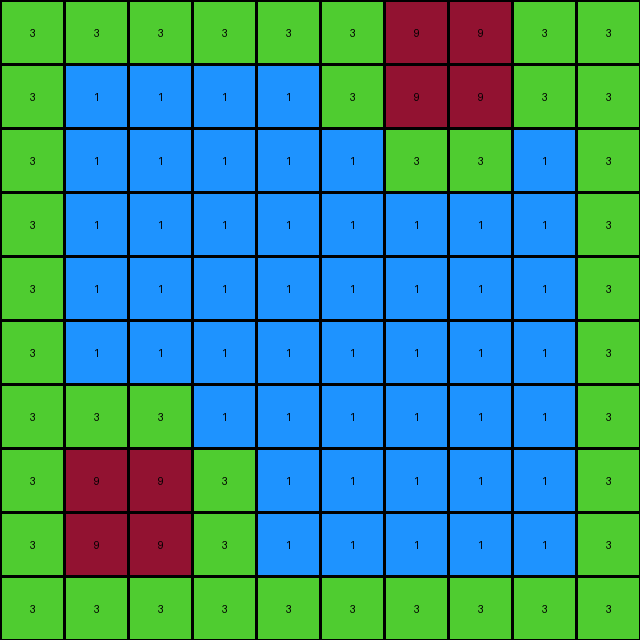
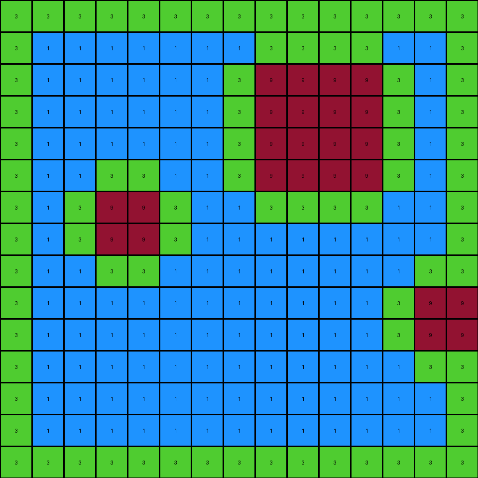
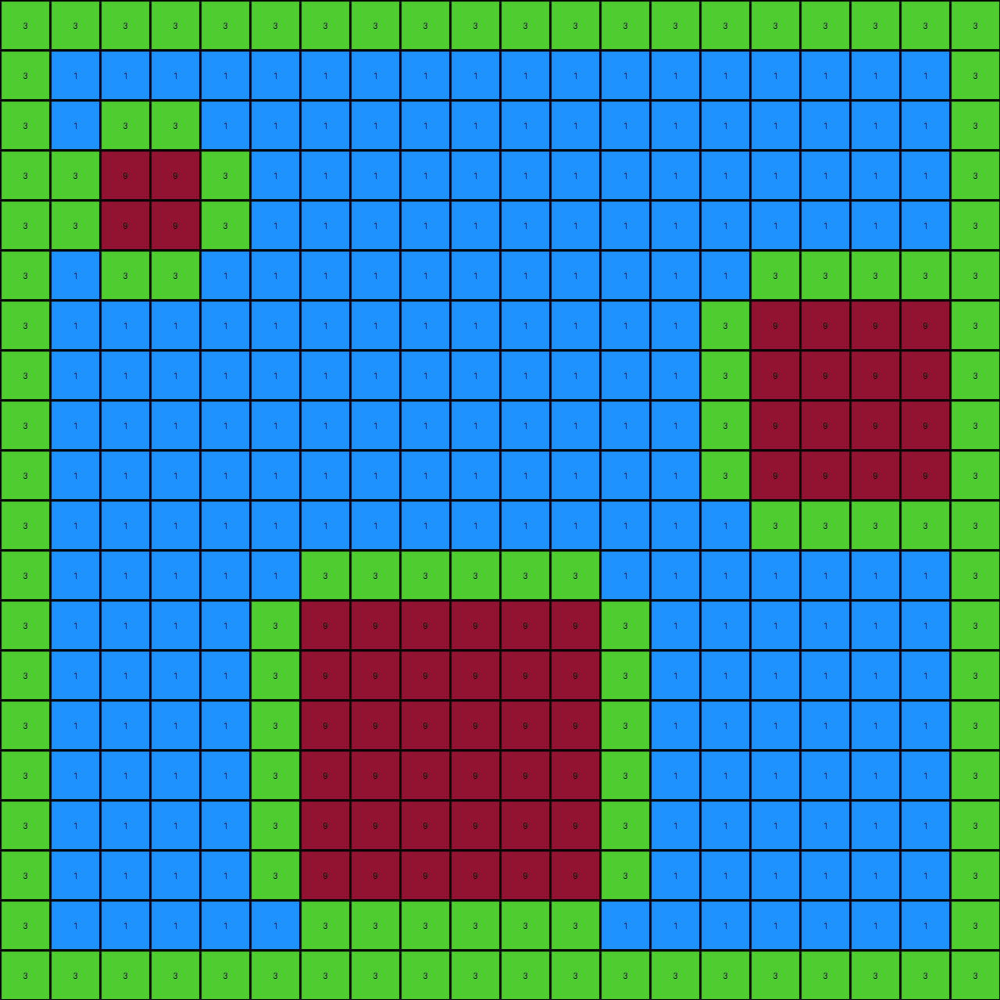
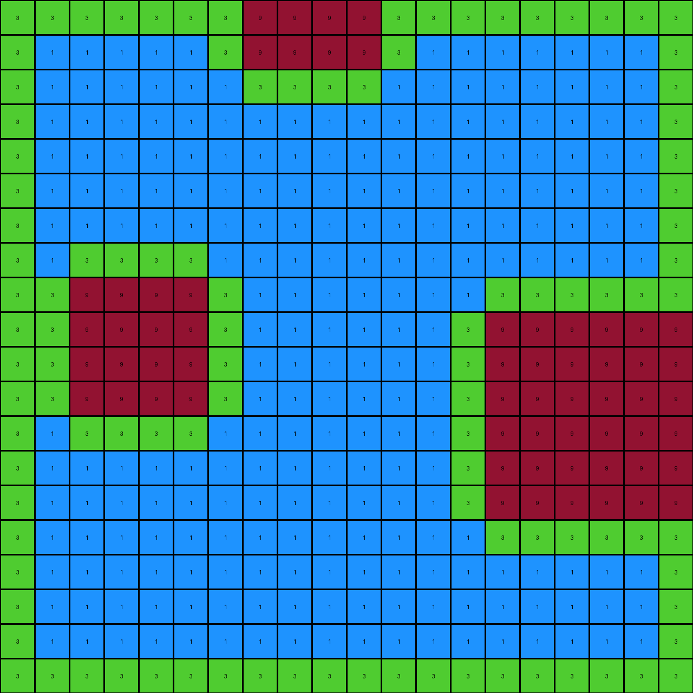

# db93a21d • 006 • refine_coder

---

Previous Code:
```python
"""
1. Preserve Maroon: Copy all maroon (9) pixels from the input to the output grid.
2. Green Outline:
    *   Any white (0) pixel that is adjacent (up, down, left, or right) to a maroon (9) pixel is changed to green (3) in the output.
    *   Any white pixel that is adjacent to the edge of the grid is changed to green (3) in the output
3.  Blue Object: Identify the spaces created enclosed by a green outline. Fill this shape with blue (1) pixels.
"""

import numpy as np

def get_neighbors(grid, row, col):
    """Gets the valid neighbors of a cell (up, down, left, right)."""
    rows, cols = grid.shape
    neighbors = []
    if row > 0:
        neighbors.append((row - 1, col))  # Up
    if row < rows - 1:
        neighbors.append((row + 1, col))  # Down
    if col > 0:
        neighbors.append((row, col - 1))  # Left
    if col < cols - 1:
        neighbors.append((row, col + 1))  # Right
    return neighbors

def transform(input_grid):
    """Transforms the input grid according to the defined rules."""
    output_grid = np.copy(input_grid)
    rows, cols = input_grid.shape

    # Preserve Maroon
    # (No change needed here - already correct)

   # Green Outline (including edge)
    for row in range(rows):
        for col in range(cols):
            if input_grid[row, col] == 9:  #Maroon
                for r, c in get_neighbors(input_grid, row, col):
                    if input_grid[r,c] == 0:
                        output_grid[r,c] = 3
            elif input_grid[row,col] == 0:
                is_edge = row == 0 or row == rows -1 or col == 0 or col == cols - 1
                if is_edge:
                    output_grid[row,col] = 3

    # Flood fill for blue objects
    for row in range(rows):
        for col in range(cols):
            if output_grid[row, col] == 0:
                output_grid[row,col] = 1

    return output_grid
```

Train Set Results:

## Example 1:

Input:
```
0 0 0 0 0 0 9 9 0 0
0 0 0 0 0 0 9 9 0 0
0 0 0 0 0 0 0 0 0 0
0 0 0 0 0 0 0 0 0 0
0 0 0 0 0 0 0 0 0 0
0 0 0 0 0 0 0 0 0 0
0 0 0 0 0 0 0 0 0 0
0 9 9 0 0 0 0 0 0 0
0 9 9 0 0 0 0 0 0 0
0 0 0 0 0 0 0 0 0 0
```
Expected Output:
```
0 0 0 0 0 3 9 9 3 0
0 0 0 0 0 3 9 9 3 0
0 0 0 0 0 3 3 3 3 0
0 0 0 0 0 0 1 1 0 0
0 0 0 0 0 0 1 1 0 0
0 0 0 0 0 0 1 1 0 0
3 3 3 3 0 0 1 1 0 0
3 9 9 3 0 0 1 1 0 0
3 9 9 3 0 0 1 1 0 0
3 3 3 3 0 0 1 1 0 0
```
Transformed Output:
```
3 3 3 3 3 3 9 9 3 3
3 1 1 1 1 3 9 9 3 3
3 1 1 1 1 1 3 3 1 3
3 1 1 1 1 1 1 1 1 3
3 1 1 1 1 1 1 1 1 3
3 1 1 1 1 1 1 1 1 3
3 3 3 1 1 1 1 1 1 3
3 9 9 3 1 1 1 1 1 3
3 9 9 3 1 1 1 1 1 3
3 3 3 3 3 3 3 3 3 3
```

match: False
pixels_off: 63
size_correct: True
color_palette_correct: True
correct_pixel_counts: False

## Example 2:

Input:
```
0 0 0 0 0 0 0 0 0 0 0 0 0 0 0
0 0 0 0 0 0 0 0 0 0 0 0 0 0 0
0 0 0 0 0 0 0 0 9 9 9 9 0 0 0
0 0 0 0 0 0 0 0 9 9 9 9 0 0 0
0 0 0 0 0 0 0 0 9 9 9 9 0 0 0
0 0 0 0 0 0 0 0 9 9 9 9 0 0 0
0 0 0 9 9 0 0 0 0 0 0 0 0 0 0
0 0 0 9 9 0 0 0 0 0 0 0 0 0 0
0 0 0 0 0 0 0 0 0 0 0 0 0 0 0
0 0 0 0 0 0 0 0 0 0 0 0 0 9 9
0 0 0 0 0 0 0 0 0 0 0 0 0 9 9
0 0 0 0 0 0 0 0 0 0 0 0 0 0 0
0 0 0 0 0 0 0 0 0 0 0 0 0 0 0
0 0 0 0 0 0 0 0 0 0 0 0 0 0 0
0 0 0 0 0 0 0 0 0 0 0 0 0 0 0
```
Expected Output:
```
0 0 0 0 0 0 3 3 3 3 3 3 3 3 0
0 0 0 0 0 0 3 3 3 3 3 3 3 3 0
0 0 0 0 0 0 3 3 9 9 9 9 3 3 0
0 0 0 0 0 0 3 3 9 9 9 9 3 3 0
0 0 0 0 0 0 3 3 9 9 9 9 3 3 0
0 0 3 3 3 3 3 3 9 9 9 9 3 3 0
0 0 3 9 9 3 3 3 3 3 3 3 3 3 0
0 0 3 9 9 3 3 3 3 3 3 3 3 3 0
0 0 3 3 3 3 0 0 1 1 1 1 3 3 3
0 0 0 1 1 0 0 0 1 1 1 1 3 9 9
0 0 0 1 1 0 0 0 1 1 1 1 3 9 9
0 0 0 1 1 0 0 0 1 1 1 1 3 3 3
0 0 0 1 1 0 0 0 1 1 1 1 0 1 1
0 0 0 1 1 0 0 0 1 1 1 1 0 1 1
0 0 0 1 1 0 0 0 1 1 1 1 0 1 1
```
Transformed Output:
```
3 3 3 3 3 3 3 3 3 3 3 3 3 3 3
3 1 1 1 1 1 1 1 3 3 3 3 1 1 3
3 1 1 1 1 1 1 3 9 9 9 9 3 1 3
3 1 1 1 1 1 1 3 9 9 9 9 3 1 3
3 1 1 1 1 1 1 3 9 9 9 9 3 1 3
3 1 1 3 3 1 1 3 9 9 9 9 3 1 3
3 1 3 9 9 3 1 1 3 3 3 3 1 1 3
3 1 3 9 9 3 1 1 1 1 1 1 1 1 3
3 1 1 3 3 1 1 1 1 1 1 1 1 3 3
3 1 1 1 1 1 1 1 1 1 1 1 3 9 9
3 1 1 1 1 1 1 1 1 1 1 1 3 9 9
3 1 1 1 1 1 1 1 1 1 1 1 1 3 3
3 1 1 1 1 1 1 1 1 1 1 1 1 1 3
3 1 1 1 1 1 1 1 1 1 1 1 1 1 3
3 3 3 3 3 3 3 3 3 3 3 3 3 3 3
```

match: False
pixels_off: 127
size_correct: True
color_palette_correct: True
correct_pixel_counts: False

## Example 3:

Input:
```
0 0 0 0 0 0 0 0 0 0 0 0 0 0 0 0 0 0 0 0
0 0 0 0 0 0 0 0 0 0 0 0 0 0 0 0 0 0 0 0
0 0 0 0 0 0 0 0 0 0 0 0 0 0 0 0 0 0 0 0
0 0 9 9 0 0 0 0 0 0 0 0 0 0 0 0 0 0 0 0
0 0 9 9 0 0 0 0 0 0 0 0 0 0 0 0 0 0 0 0
0 0 0 0 0 0 0 0 0 0 0 0 0 0 0 0 0 0 0 0
0 0 0 0 0 0 0 0 0 0 0 0 0 0 0 9 9 9 9 0
0 0 0 0 0 0 0 0 0 0 0 0 0 0 0 9 9 9 9 0
0 0 0 0 0 0 0 0 0 0 0 0 0 0 0 9 9 9 9 0
0 0 0 0 0 0 0 0 0 0 0 0 0 0 0 9 9 9 9 0
0 0 0 0 0 0 0 0 0 0 0 0 0 0 0 0 0 0 0 0
0 0 0 0 0 0 0 0 0 0 0 0 0 0 0 0 0 0 0 0
0 0 0 0 0 0 9 9 9 9 9 9 0 0 0 0 0 0 0 0
0 0 0 0 0 0 9 9 9 9 9 9 0 0 0 0 0 0 0 0
0 0 0 0 0 0 9 9 9 9 9 9 0 0 0 0 0 0 0 0
0 0 0 0 0 0 9 9 9 9 9 9 0 0 0 0 0 0 0 0
0 0 0 0 0 0 9 9 9 9 9 9 0 0 0 0 0 0 0 0
0 0 0 0 0 0 9 9 9 9 9 9 0 0 0 0 0 0 0 0
0 0 0 0 0 0 0 0 0 0 0 0 0 0 0 0 0 0 0 0
0 0 0 0 0 0 0 0 0 0 0 0 0 0 0 0 0 0 0 0
```
Expected Output:
```
0 0 0 0 0 0 0 0 0 0 0 0 0 0 0 0 0 0 0 0
0 0 0 0 0 0 0 0 0 0 0 0 0 0 0 0 0 0 0 0
0 3 3 3 3 0 0 0 0 0 0 0 0 0 0 0 0 0 0 0
0 3 9 9 3 0 0 0 0 0 0 0 0 0 0 0 0 0 0 0
0 3 9 9 3 0 0 0 0 0 0 0 0 3 3 3 3 3 3 3
0 3 3 3 3 0 0 0 0 0 0 0 0 3 3 3 3 3 3 3
0 0 1 1 0 0 0 0 0 0 0 0 0 3 3 9 9 9 9 3
0 0 1 1 0 0 0 0 0 0 0 0 0 3 3 9 9 9 9 3
0 0 1 1 0 0 0 0 0 0 0 0 0 3 3 9 9 9 9 3
0 0 1 3 3 3 3 3 3 3 3 3 3 3 3 9 9 9 9 3
0 0 1 3 3 3 3 3 3 3 3 3 3 3 3 3 3 3 3 3
0 0 1 3 3 3 3 3 3 3 3 3 3 3 3 3 3 3 3 3
0 0 1 3 3 3 9 9 9 9 9 9 3 3 3 1 1 1 1 0
0 0 1 3 3 3 9 9 9 9 9 9 3 3 3 1 1 1 1 0
0 0 1 3 3 3 9 9 9 9 9 9 3 3 3 1 1 1 1 0
0 0 1 3 3 3 9 9 9 9 9 9 3 3 3 1 1 1 1 0
0 0 1 3 3 3 9 9 9 9 9 9 3 3 3 1 1 1 1 0
0 0 1 3 3 3 9 9 9 9 9 9 3 3 3 1 1 1 1 0
0 0 1 3 3 3 3 3 3 3 3 3 3 3 3 1 1 1 1 0
0 0 1 3 3 3 3 3 3 3 3 3 3 3 3 1 1 1 1 0
```
Transformed Output:
```
3 3 3 3 3 3 3 3 3 3 3 3 3 3 3 3 3 3 3 3
3 1 1 1 1 1 1 1 1 1 1 1 1 1 1 1 1 1 1 3
3 1 3 3 1 1 1 1 1 1 1 1 1 1 1 1 1 1 1 3
3 3 9 9 3 1 1 1 1 1 1 1 1 1 1 1 1 1 1 3
3 3 9 9 3 1 1 1 1 1 1 1 1 1 1 1 1 1 1 3
3 1 3 3 1 1 1 1 1 1 1 1 1 1 1 3 3 3 3 3
3 1 1 1 1 1 1 1 1 1 1 1 1 1 3 9 9 9 9 3
3 1 1 1 1 1 1 1 1 1 1 1 1 1 3 9 9 9 9 3
3 1 1 1 1 1 1 1 1 1 1 1 1 1 3 9 9 9 9 3
3 1 1 1 1 1 1 1 1 1 1 1 1 1 3 9 9 9 9 3
3 1 1 1 1 1 1 1 1 1 1 1 1 1 1 3 3 3 3 3
3 1 1 1 1 1 3 3 3 3 3 3 1 1 1 1 1 1 1 3
3 1 1 1 1 3 9 9 9 9 9 9 3 1 1 1 1 1 1 3
3 1 1 1 1 3 9 9 9 9 9 9 3 1 1 1 1 1 1 3
3 1 1 1 1 3 9 9 9 9 9 9 3 1 1 1 1 1 1 3
3 1 1 1 1 3 9 9 9 9 9 9 3 1 1 1 1 1 1 3
3 1 1 1 1 3 9 9 9 9 9 9 3 1 1 1 1 1 1 3
3 1 1 1 1 3 9 9 9 9 9 9 3 1 1 1 1 1 1 3
3 1 1 1 1 1 3 3 3 3 3 3 1 1 1 1 1 1 1 3
3 3 3 3 3 3 3 3 3 3 3 3 3 3 3 3 3 3 3 3
```

match: False
pixels_off: 236
size_correct: True
color_palette_correct: True
correct_pixel_counts: False

## Example 4:

Input:
```
0 0 0 0 0 0 0 9 9 9 9 0 0 0 0 0 0 0 0 0
0 0 0 0 0 0 0 9 9 9 9 0 0 0 0 0 0 0 0 0
0 0 0 0 0 0 0 0 0 0 0 0 0 0 0 0 0 0 0 0
0 0 0 0 0 0 0 0 0 0 0 0 0 0 0 0 0 0 0 0
0 0 0 0 0 0 0 0 0 0 0 0 0 0 0 0 0 0 0 0
0 0 0 0 0 0 0 0 0 0 0 0 0 0 0 0 0 0 0 0
0 0 0 0 0 0 0 0 0 0 0 0 0 0 0 0 0 0 0 0
0 0 0 0 0 0 0 0 0 0 0 0 0 0 0 0 0 0 0 0
0 0 9 9 9 9 0 0 0 0 0 0 0 0 0 0 0 0 0 0
0 0 9 9 9 9 0 0 0 0 0 0 0 0 9 9 9 9 9 9
0 0 9 9 9 9 0 0 0 0 0 0 0 0 9 9 9 9 9 9
0 0 9 9 9 9 0 0 0 0 0 0 0 0 9 9 9 9 9 9
0 0 0 0 0 0 0 0 0 0 0 0 0 0 9 9 9 9 9 9
0 0 0 0 0 0 0 0 0 0 0 0 0 0 9 9 9 9 9 9
0 0 0 0 0 0 0 0 0 0 0 0 0 0 9 9 9 9 9 9
0 0 0 0 0 0 0 0 0 0 0 0 0 0 0 0 0 0 0 0
0 0 0 0 0 0 0 0 0 0 0 0 0 0 0 0 0 0 0 0
0 0 0 0 0 0 0 0 0 0 0 0 0 0 0 0 0 0 0 0
0 0 0 0 0 0 0 0 0 0 0 0 0 0 0 0 0 0 0 0
0 0 0 0 0 0 0 0 0 0 0 0 0 0 0 0 0 0 0 0
```
Expected Output:
```
0 0 0 0 0 3 3 9 9 9 9 3 3 0 0 0 0 0 0 0
0 0 0 0 0 3 3 9 9 9 9 3 3 0 0 0 0 0 0 0
0 0 0 0 0 3 3 3 3 3 3 3 3 0 0 0 0 0 0 0
0 0 0 0 0 3 3 3 3 3 3 3 3 0 0 0 0 0 0 0
0 0 0 0 0 0 0 1 1 1 1 0 0 0 0 0 0 0 0 0
0 0 0 0 0 0 0 1 1 1 1 0 0 0 0 0 0 0 0 0
3 3 3 3 3 3 3 3 1 1 1 3 3 3 3 3 3 3 3 3
3 3 3 3 3 3 3 3 1 1 1 3 3 3 3 3 3 3 3 3
3 3 9 9 9 9 3 3 1 1 1 3 3 3 3 3 3 3 3 3
3 3 9 9 9 9 3 3 1 1 1 3 3 3 9 9 9 9 9 9
3 3 9 9 9 9 3 3 1 1 1 3 3 3 9 9 9 9 9 9
3 3 9 9 9 9 3 3 1 1 1 3 3 3 9 9 9 9 9 9
3 3 3 3 3 3 3 3 1 1 1 3 3 3 9 9 9 9 9 9
3 3 3 3 3 3 3 3 1 1 1 3 3 3 9 9 9 9 9 9
0 0 1 1 1 1 0 1 1 1 1 3 3 3 9 9 9 9 9 9
0 0 1 1 1 1 0 1 1 1 1 3 3 3 3 3 3 3 3 3
0 0 1 1 1 1 0 1 1 1 1 3 3 3 3 3 3 3 3 3
0 0 1 1 1 1 0 1 1 1 1 3 3 3 3 3 3 3 3 3
0 0 1 1 1 1 0 1 1 1 1 0 0 0 1 1 1 1 1 1
0 0 1 1 1 1 0 1 1 1 1 0 0 0 1 1 1 1 1 1
```
Transformed Output:
```
3 3 3 3 3 3 3 9 9 9 9 3 3 3 3 3 3 3 3 3
3 1 1 1 1 1 3 9 9 9 9 3 1 1 1 1 1 1 1 3
3 1 1 1 1 1 1 3 3 3 3 1 1 1 1 1 1 1 1 3
3 1 1 1 1 1 1 1 1 1 1 1 1 1 1 1 1 1 1 3
3 1 1 1 1 1 1 1 1 1 1 1 1 1 1 1 1 1 1 3
3 1 1 1 1 1 1 1 1 1 1 1 1 1 1 1 1 1 1 3
3 1 1 1 1 1 1 1 1 1 1 1 1 1 1 1 1 1 1 3
3 1 3 3 3 3 1 1 1 1 1 1 1 1 1 1 1 1 1 3
3 3 9 9 9 9 3 1 1 1 1 1 1 1 3 3 3 3 3 3
3 3 9 9 9 9 3 1 1 1 1 1 1 3 9 9 9 9 9 9
3 3 9 9 9 9 3 1 1 1 1 1 1 3 9 9 9 9 9 9
3 3 9 9 9 9 3 1 1 1 1 1 1 3 9 9 9 9 9 9
3 1 3 3 3 3 1 1 1 1 1 1 1 3 9 9 9 9 9 9
3 1 1 1 1 1 1 1 1 1 1 1 1 3 9 9 9 9 9 9
3 1 1 1 1 1 1 1 1 1 1 1 1 3 9 9 9 9 9 9
3 1 1 1 1 1 1 1 1 1 1 1 1 1 3 3 3 3 3 3
3 1 1 1 1 1 1 1 1 1 1 1 1 1 1 1 1 1 1 3
3 1 1 1 1 1 1 1 1 1 1 1 1 1 1 1 1 1 1 3
3 1 1 1 1 1 1 1 1 1 1 1 1 1 1 1 1 1 1 3
3 3 3 3 3 3 3 3 3 3 3 3 3 3 3 3 3 3 3 3
```

match: False
pixels_off: 207
size_correct: True
color_palette_correct: True
correct_pixel_counts: False
Okay, let's analyze the results and refine the natural language program and approach.

**General Assessment:**

The initial program and code correctly identified the maroon (9) objects and attempted to create a green (3) outline around them and the edge of the grid. It also attempted to fill enclosed regions with blue (1). However, the flood fill (filling white with blue) is incorrect and appears to be filling almost the entire grid, not just enclosed areas which causes an issue with the green outline. The results highlights that the flood fill needs substantial adjustment to be constrained within the correct boundaries.

**Strategy for Resolving Errors:**

1.  **Fix the Flood Fill:** The primary issue is the unrestricted flood fill. We need a way to constrain it to areas enclosed by the green outline. Instead of simply changing all white pixels to blue, we should identify connected regions of white pixels and only fill those that are *not* connected to the edge of the grid.
2.  **Review Edge Handling:** Confirm that the edge handling for green pixels is working as expected and not interacting unexpectedly.

**Metrics and Example Analysis (using observations - I will include any relevant code execution, if needed, in the coder phase):**

*   **Example 1:**
    *   Maroon objects are correctly identified.
    *   Green outline around maroon and grid edge is mostly correct, but is overwritten by the flood fill.
    *   Flood fill incorrectly fills almost the entire grid.
*   **Example 2:**
    *   Maroon objects are correctly identified.
    *   Green outline is partially correct but overwhelmed by the flood fill.
    *   Flood fill issue is even more pronounced.
*   **Example 3:**
    *   Similar issues as Examples 1 and 2.
*   **Example 4:**
    *   Similar issues.

**YAML Block (Facts):**

```yaml
objects:
  - color: 9  # Maroon
    description: Primary objects, preserved in output.
    shape: variable  # Can be any shape
  - color: 3  # Green
    description: Outline object, surrounds maroon objects and grid edge.
    shape: outline
  - color: 1  # Blue
    description: Fill object, fills space inside the green outline
    shape: variable # determined by the green object

actions:
  - name: preserve_maroon
    description: Copy maroon pixels to the output.
  - name: create_green_outline
    description:  Create a green outline around maroon objects, and along the edge of the image.
  - name: fill_enclosed_area
    description: Fill white areas fully enclosed by green with blue.

```

**Natural Language Program:**

1.  **Preserve Maroon:** Copy all maroon (9) pixels from the input grid to the output grid.

2.  **Green Outline:**
    *   Create a green (3) outline around any maroon (9) pixels, changing all adjacent (up, down, left, right) white (0) pixels to green.
    *   Create a green (3) outline on all edges of the grid, by changing any white (0) pixels that are on the border of the grid to green.

3.  **Fill Enclosed Regions:**
    *   Identify regions of contiguous white (0) pixels.
    *   For each region, determine if any pixel in the region touches the edge of the grid.
    *   If a region *does not* touch the edge, fill the entire region with blue (1) pixels.
    *   If it does touch the edge, leave as white (0).

The key improvement in the natural language program is the more precise description of the fill operation, emphasizing the need to check for connectivity to the edge before filling. This addresses the core issue observed in the test results.

**INSTRUCTIONS**

- generate a Python module to represent the natural language program 
- follow the template below
- all common math and science libraries are available
- create docstring only at top - but comment the workflow in the function
- use helper functions for common operations like finding objects, counting,
  measuring, moving, etc. 

remember - we are working iteratively - so this code will inform your future
self as we converge on the solution

*template:*

```python
"""
{{ natural language description of the transformation rule }}
"""

{{ imports }}

def transform(input_grid):
    # initialize output_grid

    # change output pixels 

    return output_grid

```
