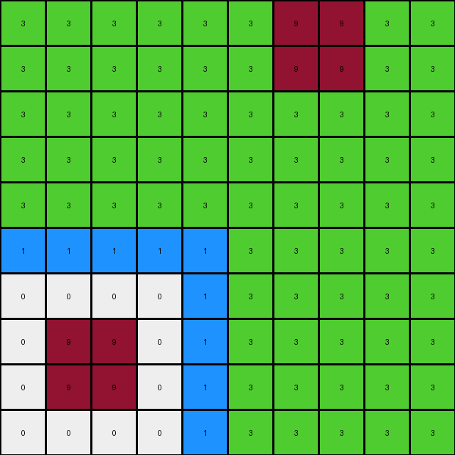
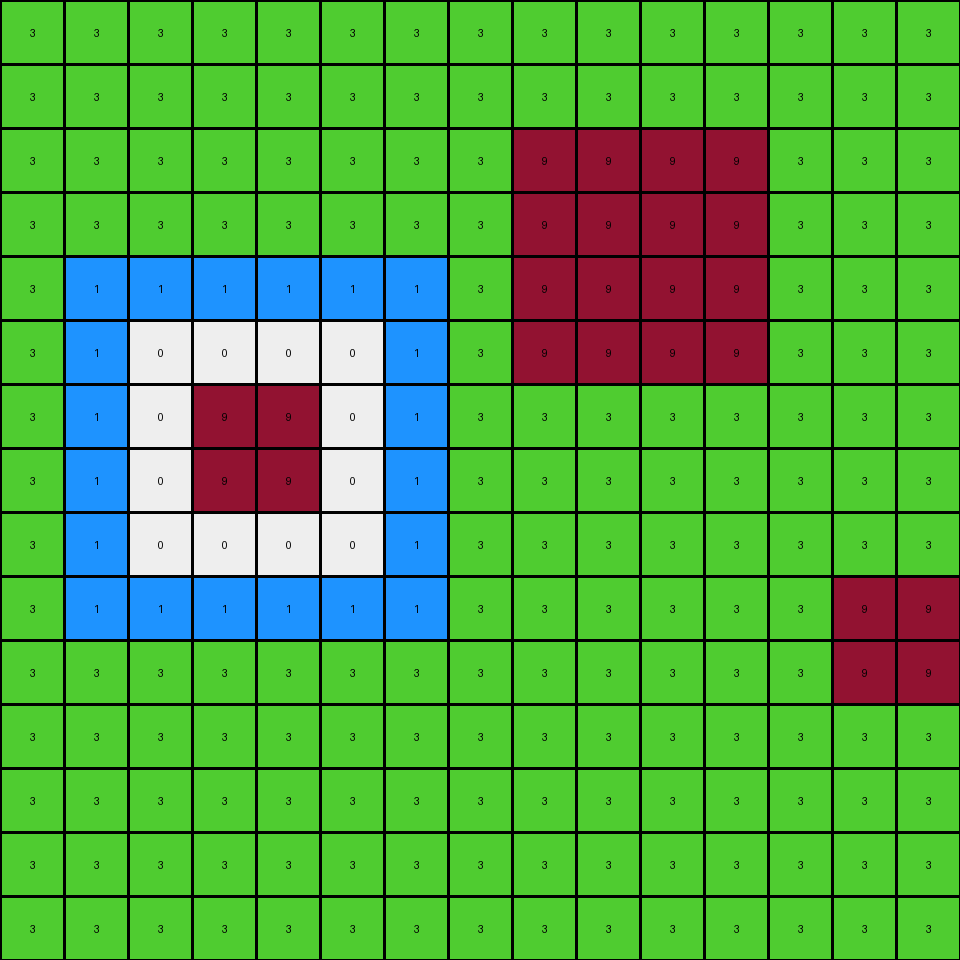
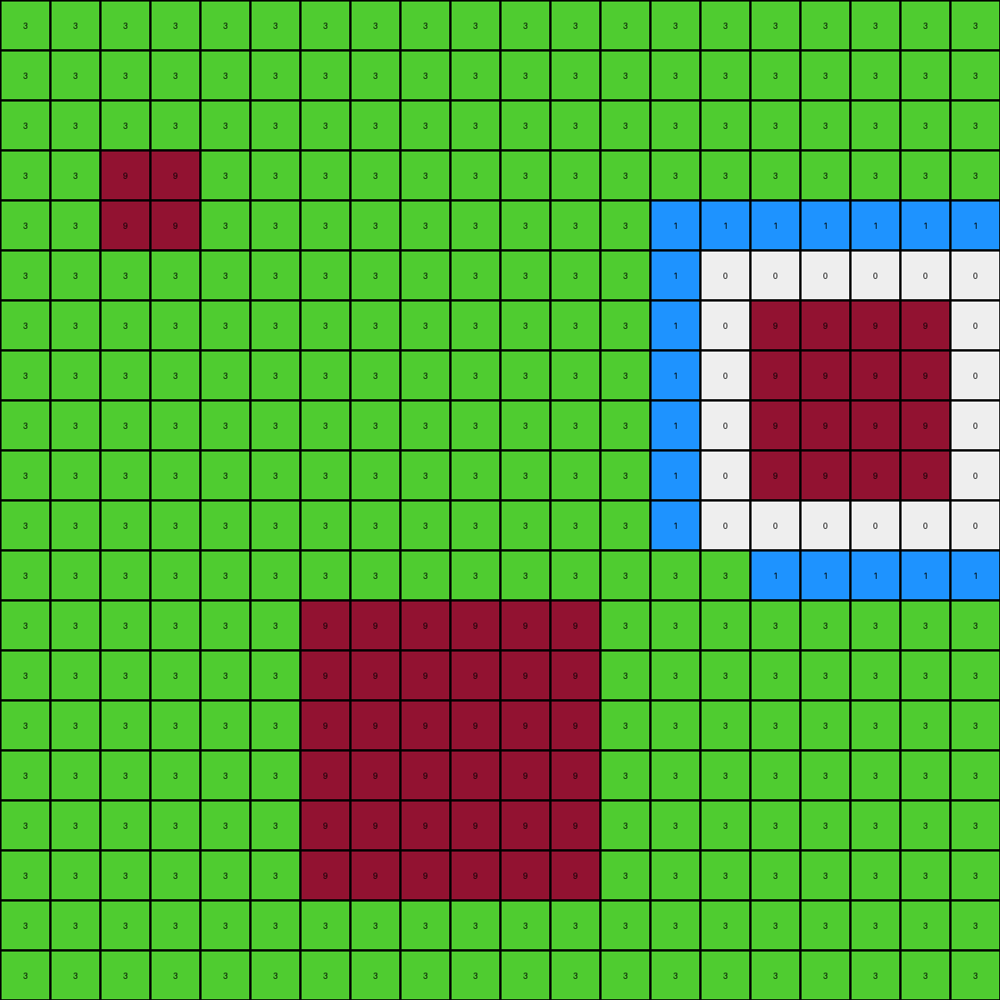
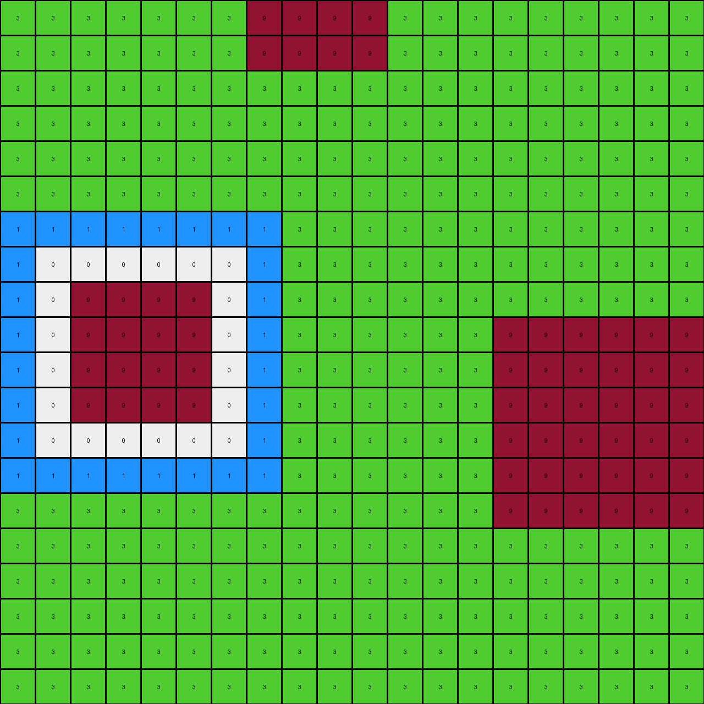

# db93a21d • 016 • refine_coder

---

Previous Code:
```python
"""
1.  **Identify Rectangles:** Find all maroon (9) colored rectangles in the input grid. Record their positions (top-left corner coordinates), widths, and heights.
2.  **Create Green Outline:** For the top-left most rectangle, construct a 1 pixel thick green (3) outline around the maroon rectangle.
3. **Create a complex outline:** For the rectangle at the right, create a 1-pixel green outline on its top, and 3-pixel on its right.
4.  **Create Blue Outline:** Create an outline for the largest rectangle using blue, there is a gap of 1-pixel between the blue outline and the shape. The blue shape is one pixel thick.
5.  **Create Green Filling:** Starting from the top left corner, fill every white region with green until it connects with any other color.
"""

import numpy as np

def find_rectangles(grid, color):
    rectangles = []
    visited = np.zeros_like(grid, dtype=bool)
    rows, cols = grid.shape
    for r in range(rows):
        for c in range(cols):
            if grid[r, c] == color and not visited[r, c]:
                width = 0
                height = 0
                # Find width
                for i in range(c, cols):
                    if grid[r, i] == color:
                        width += 1
                        visited[r, i] = True
                    else:
                        break
                # Find height
                for j in range(r + 1, rows):
                    if all(grid[j, c:c+width] == color):
                        for i in range(c, c + width):
                            visited[j, i] = True  # fixed missing
                        height += 1
                    else:
                        break
                rectangles.append((r, c, width, height + 1)) #  height was off by one.
    return rectangles

def outline_rectangle(grid, r, c, width, height, color, thickness=1):
    # Top outline
    for i in range(max(0, r - thickness), r):
        for j in range(max(0, c - thickness), min(grid.shape[1], c + width + thickness)):
            grid[i, j] = color

    # Bottom outline
    for i in range(r + height, min(grid.shape[0], r + height + thickness)):
        for j in range(max(0, c - thickness), min(grid.shape[1], c + width + thickness)):
          grid[i,j] = color

    # Left outline
    for i in range(max(0, r - thickness), min(grid.shape[0], r + height + thickness)):
        for j in range(max(0, c - thickness), c):
          grid[i,j] = color

    # Right outline
    for i in range(max(0, r - thickness), min(grid.shape[0], r + height + thickness)):
        for j in range(c + width, min(grid.shape[1], c + width + thickness)):
            grid[i, j] = color

def outline_rectangle_complex(grid, r, c, width, height, color_top, thickness_top, color_right, thickness_right):
    #top
    for i in range(r - thickness_top, r):
        for j in range(c, c + width):
             grid[i,j] = color_top

    #right
    for i in range(r - thickness_top, r + height + thickness_top):
      for j in range(c + width, c+ width + thickness_right):
        if i >= 0 and i < grid.shape[0] and j >=0 and j < grid.shape[1]:
          grid[i, j] = color_right


def outline_rectangle_with_gap(grid, r, c, width, height, color, gap=1):
    # Top outline
    for i in range(max(0, r - gap -1 ), r - gap):
        for j in range(max(0, c - gap -1), min(grid.shape[1], c + width + gap + 1)):
            if grid[i,j] == 0:
              grid[i, j] = color

    # Bottom outline
    for i in range(r + height + gap, min(grid.shape[0], r + height + gap + 1)):
        for j in range(max(0, c - gap -1), min(grid.shape[1], c + width + gap + 1)):
          if grid[i,j] == 0:
            grid[i,j] = color
    # Left outline
    for i in range(max(0, r - gap -1), min(grid.shape[0], r + height + gap + 1)):
        for j in range(max(0, c - gap -1), c - gap):
          if grid[i,j] == 0:
            grid[i,j] = color
    # Right outline
    for i in range(max(0, r - gap -1), min(grid.shape[0], r + height + gap + 1)):
        for j in range(c + width + gap, min(grid.shape[1], c + width + gap + 1)):
          if grid[i,j] == 0:
            grid[i, j] = color

def flood_fill(grid, r, c, target_color, replacement_color):
    if r < 0 or r >= grid.shape[0] or c < 0 or c >= grid.shape[1] or grid[r, c] != target_color:
        return
    grid[r, c] = replacement_color
    flood_fill(grid, r + 1, c, target_color, replacement_color)
    flood_fill(grid, r - 1, c, target_color, replacement_color)
    flood_fill(grid, r, c + 1, target_color, replacement_color)
    flood_fill(grid, r, c - 1, target_color, replacement_color)

def transform(input_grid):
    # initialize output_grid
    output_grid = np.copy(input_grid)

    # identify rectangles
    rectangles = find_rectangles(input_grid, 9)
    rectangles.sort() # sort by top-left y, then x

    # create outlines
    if len(rectangles) >= 1:
      outline_rectangle(output_grid, rectangles[0][0], rectangles[0][1], rectangles[0][2], rectangles[0][3], 3) #green
    if len(rectangles) >= 3:
      outline_rectangle_complex(output_grid, rectangles[2][0], rectangles[2][1], rectangles[2][2], rectangles[2][3], 3, 1, 3, 3) # green complex
    if len(rectangles) >= 2:
        outline_rectangle_with_gap(output_grid, rectangles[1][0], rectangles[1][1], rectangles[1][2], rectangles[1][3], 1, 1)  # blue with gap

    # create filling
    flood_fill(output_grid, 0, 0, 0, 3)

    return output_grid
```

Train Set Results:

## Example 1:

Input:
```
0 0 0 0 0 0 9 9 0 0
0 0 0 0 0 0 9 9 0 0
0 0 0 0 0 0 0 0 0 0
0 0 0 0 0 0 0 0 0 0
0 0 0 0 0 0 0 0 0 0
0 0 0 0 0 0 0 0 0 0
0 0 0 0 0 0 0 0 0 0
0 9 9 0 0 0 0 0 0 0
0 9 9 0 0 0 0 0 0 0
0 0 0 0 0 0 0 0 0 0
```
Expected Output:
```
0 0 0 0 0 3 9 9 3 0
0 0 0 0 0 3 9 9 3 0
0 0 0 0 0 3 3 3 3 0
0 0 0 0 0 0 1 1 0 0
0 0 0 0 0 0 1 1 0 0
0 0 0 0 0 0 1 1 0 0
3 3 3 3 0 0 1 1 0 0
3 9 9 3 0 0 1 1 0 0
3 9 9 3 0 0 1 1 0 0
3 3 3 3 0 0 1 1 0 0
```
Transformed Output:
```
3 3 3 3 3 3 9 9 3 3
3 3 3 3 3 3 9 9 3 3
3 3 3 3 3 3 3 3 3 3
3 3 3 3 3 3 3 3 3 3
3 3 3 3 3 3 3 3 3 3
1 1 1 1 1 3 3 3 3 3
0 0 0 0 1 3 3 3 3 3
0 9 9 0 1 3 3 3 3 3
0 9 9 0 1 3 3 3 3 3
0 0 0 0 1 3 3 3 3 3
```

match: False
pixels_off: 84
size_correct: True
color_palette_correct: True
correct_pixel_counts: False

## Example 2:

Input:
```
0 0 0 0 0 0 0 0 0 0 0 0 0 0 0
0 0 0 0 0 0 0 0 0 0 0 0 0 0 0
0 0 0 0 0 0 0 0 9 9 9 9 0 0 0
0 0 0 0 0 0 0 0 9 9 9 9 0 0 0
0 0 0 0 0 0 0 0 9 9 9 9 0 0 0
0 0 0 0 0 0 0 0 9 9 9 9 0 0 0
0 0 0 9 9 0 0 0 0 0 0 0 0 0 0
0 0 0 9 9 0 0 0 0 0 0 0 0 0 0
0 0 0 0 0 0 0 0 0 0 0 0 0 0 0
0 0 0 0 0 0 0 0 0 0 0 0 0 9 9
0 0 0 0 0 0 0 0 0 0 0 0 0 9 9
0 0 0 0 0 0 0 0 0 0 0 0 0 0 0
0 0 0 0 0 0 0 0 0 0 0 0 0 0 0
0 0 0 0 0 0 0 0 0 0 0 0 0 0 0
0 0 0 0 0 0 0 0 0 0 0 0 0 0 0
```
Expected Output:
```
0 0 0 0 0 0 3 3 3 3 3 3 3 3 0
0 0 0 0 0 0 3 3 3 3 3 3 3 3 0
0 0 0 0 0 0 3 3 9 9 9 9 3 3 0
0 0 0 0 0 0 3 3 9 9 9 9 3 3 0
0 0 0 0 0 0 3 3 9 9 9 9 3 3 0
0 0 3 3 3 3 3 3 9 9 9 9 3 3 0
0 0 3 9 9 3 3 3 3 3 3 3 3 3 0
0 0 3 9 9 3 3 3 3 3 3 3 3 3 0
0 0 3 3 3 3 0 0 1 1 1 1 3 3 3
0 0 0 1 1 0 0 0 1 1 1 1 3 9 9
0 0 0 1 1 0 0 0 1 1 1 1 3 9 9
0 0 0 1 1 0 0 0 1 1 1 1 3 3 3
0 0 0 1 1 0 0 0 1 1 1 1 0 1 1
0 0 0 1 1 0 0 0 1 1 1 1 0 1 1
0 0 0 1 1 0 0 0 1 1 1 1 0 1 1
```
Transformed Output:
```
3 3 3 3 3 3 3 3 3 3 3 3 3 3 3
3 3 3 3 3 3 3 3 3 3 3 3 3 3 3
3 3 3 3 3 3 3 3 9 9 9 9 3 3 3
3 3 3 3 3 3 3 3 9 9 9 9 3 3 3
3 1 1 1 1 1 1 3 9 9 9 9 3 3 3
3 1 0 0 0 0 1 3 9 9 9 9 3 3 3
3 1 0 9 9 0 1 3 3 3 3 3 3 3 3
3 1 0 9 9 0 1 3 3 3 3 3 3 3 3
3 1 0 0 0 0 1 3 3 3 3 3 3 3 3
3 1 1 1 1 1 1 3 3 3 3 3 3 9 9
3 3 3 3 3 3 3 3 3 3 3 3 3 9 9
3 3 3 3 3 3 3 3 3 3 3 3 3 3 3
3 3 3 3 3 3 3 3 3 3 3 3 3 3 3
3 3 3 3 3 3 3 3 3 3 3 3 3 3 3
3 3 3 3 3 3 3 3 3 3 3 3 3 3 3
```

match: False
pixels_off: 147
size_correct: True
color_palette_correct: True
correct_pixel_counts: False

## Example 3:

Input:
```
0 0 0 0 0 0 0 0 0 0 0 0 0 0 0 0 0 0 0 0
0 0 0 0 0 0 0 0 0 0 0 0 0 0 0 0 0 0 0 0
0 0 0 0 0 0 0 0 0 0 0 0 0 0 0 0 0 0 0 0
0 0 9 9 0 0 0 0 0 0 0 0 0 0 0 0 0 0 0 0
0 0 9 9 0 0 0 0 0 0 0 0 0 0 0 0 0 0 0 0
0 0 0 0 0 0 0 0 0 0 0 0 0 0 0 0 0 0 0 0
0 0 0 0 0 0 0 0 0 0 0 0 0 0 0 9 9 9 9 0
0 0 0 0 0 0 0 0 0 0 0 0 0 0 0 9 9 9 9 0
0 0 0 0 0 0 0 0 0 0 0 0 0 0 0 9 9 9 9 0
0 0 0 0 0 0 0 0 0 0 0 0 0 0 0 9 9 9 9 0
0 0 0 0 0 0 0 0 0 0 0 0 0 0 0 0 0 0 0 0
0 0 0 0 0 0 0 0 0 0 0 0 0 0 0 0 0 0 0 0
0 0 0 0 0 0 9 9 9 9 9 9 0 0 0 0 0 0 0 0
0 0 0 0 0 0 9 9 9 9 9 9 0 0 0 0 0 0 0 0
0 0 0 0 0 0 9 9 9 9 9 9 0 0 0 0 0 0 0 0
0 0 0 0 0 0 9 9 9 9 9 9 0 0 0 0 0 0 0 0
0 0 0 0 0 0 9 9 9 9 9 9 0 0 0 0 0 0 0 0
0 0 0 0 0 0 9 9 9 9 9 9 0 0 0 0 0 0 0 0
0 0 0 0 0 0 0 0 0 0 0 0 0 0 0 0 0 0 0 0
0 0 0 0 0 0 0 0 0 0 0 0 0 0 0 0 0 0 0 0
```
Expected Output:
```
0 0 0 0 0 0 0 0 0 0 0 0 0 0 0 0 0 0 0 0
0 0 0 0 0 0 0 0 0 0 0 0 0 0 0 0 0 0 0 0
0 3 3 3 3 0 0 0 0 0 0 0 0 0 0 0 0 0 0 0
0 3 9 9 3 0 0 0 0 0 0 0 0 0 0 0 0 0 0 0
0 3 9 9 3 0 0 0 0 0 0 0 0 3 3 3 3 3 3 3
0 3 3 3 3 0 0 0 0 0 0 0 0 3 3 3 3 3 3 3
0 0 1 1 0 0 0 0 0 0 0 0 0 3 3 9 9 9 9 3
0 0 1 1 0 0 0 0 0 0 0 0 0 3 3 9 9 9 9 3
0 0 1 1 0 0 0 0 0 0 0 0 0 3 3 9 9 9 9 3
0 0 1 3 3 3 3 3 3 3 3 3 3 3 3 9 9 9 9 3
0 0 1 3 3 3 3 3 3 3 3 3 3 3 3 3 3 3 3 3
0 0 1 3 3 3 3 3 3 3 3 3 3 3 3 3 3 3 3 3
0 0 1 3 3 3 9 9 9 9 9 9 3 3 3 1 1 1 1 0
0 0 1 3 3 3 9 9 9 9 9 9 3 3 3 1 1 1 1 0
0 0 1 3 3 3 9 9 9 9 9 9 3 3 3 1 1 1 1 0
0 0 1 3 3 3 9 9 9 9 9 9 3 3 3 1 1 1 1 0
0 0 1 3 3 3 9 9 9 9 9 9 3 3 3 1 1 1 1 0
0 0 1 3 3 3 9 9 9 9 9 9 3 3 3 1 1 1 1 0
0 0 1 3 3 3 3 3 3 3 3 3 3 3 3 1 1 1 1 0
0 0 1 3 3 3 3 3 3 3 3 3 3 3 3 1 1 1 1 0
```
Transformed Output:
```
3 3 3 3 3 3 3 3 3 3 3 3 3 3 3 3 3 3 3 3
3 3 3 3 3 3 3 3 3 3 3 3 3 3 3 3 3 3 3 3
3 3 3 3 3 3 3 3 3 3 3 3 3 3 3 3 3 3 3 3
3 3 9 9 3 3 3 3 3 3 3 3 3 3 3 3 3 3 3 3
3 3 9 9 3 3 3 3 3 3 3 3 3 1 1 1 1 1 1 1
3 3 3 3 3 3 3 3 3 3 3 3 3 1 0 0 0 0 0 0
3 3 3 3 3 3 3 3 3 3 3 3 3 1 0 9 9 9 9 0
3 3 3 3 3 3 3 3 3 3 3 3 3 1 0 9 9 9 9 0
3 3 3 3 3 3 3 3 3 3 3 3 3 1 0 9 9 9 9 0
3 3 3 3 3 3 3 3 3 3 3 3 3 1 0 9 9 9 9 0
3 3 3 3 3 3 3 3 3 3 3 3 3 1 0 0 0 0 0 0
3 3 3 3 3 3 3 3 3 3 3 3 3 3 3 1 1 1 1 1
3 3 3 3 3 3 9 9 9 9 9 9 3 3 3 3 3 3 3 3
3 3 3 3 3 3 9 9 9 9 9 9 3 3 3 3 3 3 3 3
3 3 3 3 3 3 9 9 9 9 9 9 3 3 3 3 3 3 3 3
3 3 3 3 3 3 9 9 9 9 9 9 3 3 3 3 3 3 3 3
3 3 3 3 3 3 9 9 9 9 9 9 3 3 3 3 3 3 3 3
3 3 3 3 3 3 9 9 9 9 9 9 3 3 3 3 3 3 3 3
3 3 3 3 3 3 3 3 3 3 3 3 3 3 3 3 3 3 3 3
3 3 3 3 3 3 3 3 3 3 3 3 3 3 3 3 3 3 3 3
```

match: False
pixels_off: 240
size_correct: True
color_palette_correct: True
correct_pixel_counts: False

## Example 4:

Input:
```
0 0 0 0 0 0 0 9 9 9 9 0 0 0 0 0 0 0 0 0
0 0 0 0 0 0 0 9 9 9 9 0 0 0 0 0 0 0 0 0
0 0 0 0 0 0 0 0 0 0 0 0 0 0 0 0 0 0 0 0
0 0 0 0 0 0 0 0 0 0 0 0 0 0 0 0 0 0 0 0
0 0 0 0 0 0 0 0 0 0 0 0 0 0 0 0 0 0 0 0
0 0 0 0 0 0 0 0 0 0 0 0 0 0 0 0 0 0 0 0
0 0 0 0 0 0 0 0 0 0 0 0 0 0 0 0 0 0 0 0
0 0 0 0 0 0 0 0 0 0 0 0 0 0 0 0 0 0 0 0
0 0 9 9 9 9 0 0 0 0 0 0 0 0 0 0 0 0 0 0
0 0 9 9 9 9 0 0 0 0 0 0 0 0 9 9 9 9 9 9
0 0 9 9 9 9 0 0 0 0 0 0 0 0 9 9 9 9 9 9
0 0 9 9 9 9 0 0 0 0 0 0 0 0 9 9 9 9 9 9
0 0 0 0 0 0 0 0 0 0 0 0 0 0 9 9 9 9 9 9
0 0 0 0 0 0 0 0 0 0 0 0 0 0 9 9 9 9 9 9
0 0 0 0 0 0 0 0 0 0 0 0 0 0 9 9 9 9 9 9
0 0 0 0 0 0 0 0 0 0 0 0 0 0 0 0 0 0 0 0
0 0 0 0 0 0 0 0 0 0 0 0 0 0 0 0 0 0 0 0
0 0 0 0 0 0 0 0 0 0 0 0 0 0 0 0 0 0 0 0
0 0 0 0 0 0 0 0 0 0 0 0 0 0 0 0 0 0 0 0
0 0 0 0 0 0 0 0 0 0 0 0 0 0 0 0 0 0 0 0
```
Expected Output:
```
0 0 0 0 0 3 3 9 9 9 9 3 3 0 0 0 0 0 0 0
0 0 0 0 0 3 3 9 9 9 9 3 3 0 0 0 0 0 0 0
0 0 0 0 0 3 3 3 3 3 3 3 3 0 0 0 0 0 0 0
0 0 0 0 0 3 3 3 3 3 3 3 3 0 0 0 0 0 0 0
0 0 0 0 0 0 0 1 1 1 1 0 0 0 0 0 0 0 0 0
0 0 0 0 0 0 0 1 1 1 1 0 0 0 0 0 0 0 0 0
3 3 3 3 3 3 3 3 1 1 1 3 3 3 3 3 3 3 3 3
3 3 3 3 3 3 3 3 1 1 1 3 3 3 3 3 3 3 3 3
3 3 9 9 9 9 3 3 1 1 1 3 3 3 3 3 3 3 3 3
3 3 9 9 9 9 3 3 1 1 1 3 3 3 9 9 9 9 9 9
3 3 9 9 9 9 3 3 1 1 1 3 3 3 9 9 9 9 9 9
3 3 9 9 9 9 3 3 1 1 1 3 3 3 9 9 9 9 9 9
3 3 3 3 3 3 3 3 1 1 1 3 3 3 9 9 9 9 9 9
3 3 3 3 3 3 3 3 1 1 1 3 3 3 9 9 9 9 9 9
0 0 1 1 1 1 0 1 1 1 1 3 3 3 9 9 9 9 9 9
0 0 1 1 1 1 0 1 1 1 1 3 3 3 3 3 3 3 3 3
0 0 1 1 1 1 0 1 1 1 1 3 3 3 3 3 3 3 3 3
0 0 1 1 1 1 0 1 1 1 1 3 3 3 3 3 3 3 3 3
0 0 1 1 1 1 0 1 1 1 1 0 0 0 1 1 1 1 1 1
0 0 1 1 1 1 0 1 1 1 1 0 0 0 1 1 1 1 1 1
```
Transformed Output:
```
3 3 3 3 3 3 3 9 9 9 9 3 3 3 3 3 3 3 3 3
3 3 3 3 3 3 3 9 9 9 9 3 3 3 3 3 3 3 3 3
3 3 3 3 3 3 3 3 3 3 3 3 3 3 3 3 3 3 3 3
3 3 3 3 3 3 3 3 3 3 3 3 3 3 3 3 3 3 3 3
3 3 3 3 3 3 3 3 3 3 3 3 3 3 3 3 3 3 3 3
3 3 3 3 3 3 3 3 3 3 3 3 3 3 3 3 3 3 3 3
1 1 1 1 1 1 1 1 3 3 3 3 3 3 3 3 3 3 3 3
1 0 0 0 0 0 0 1 3 3 3 3 3 3 3 3 3 3 3 3
1 0 9 9 9 9 0 1 3 3 3 3 3 3 3 3 3 3 3 3
1 0 9 9 9 9 0 1 3 3 3 3 3 3 9 9 9 9 9 9
1 0 9 9 9 9 0 1 3 3 3 3 3 3 9 9 9 9 9 9
1 0 9 9 9 9 0 1 3 3 3 3 3 3 9 9 9 9 9 9
1 0 0 0 0 0 0 1 3 3 3 3 3 3 9 9 9 9 9 9
1 1 1 1 1 1 1 1 3 3 3 3 3 3 9 9 9 9 9 9
3 3 3 3 3 3 3 3 3 3 3 3 3 3 9 9 9 9 9 9
3 3 3 3 3 3 3 3 3 3 3 3 3 3 3 3 3 3 3 3
3 3 3 3 3 3 3 3 3 3 3 3 3 3 3 3 3 3 3 3
3 3 3 3 3 3 3 3 3 3 3 3 3 3 3 3 3 3 3 3
3 3 3 3 3 3 3 3 3 3 3 3 3 3 3 3 3 3 3 3
3 3 3 3 3 3 3 3 3 3 3 3 3 3 3 3 3 3 3 3
```

match: False
pixels_off: 244
size_correct: True
color_palette_correct: True
correct_pixel_counts: False
Okay, let's analyze the results and update the natural language program.

**General Assessment:**

The current code has several issues, leading to significant discrepancies between the transformed outputs and the expected outputs. The primary problems seem to stem from:

1.  **Incorrect Outlining:** The `outline_rectangle` functions (all three versions) have flaws. They don't consistently create outlines as intended, sometimes extending beyond the boundaries, and sometimes creating outlines in white space where not supposed to. The with-gap outline logic is not handling all of the cases.

2.  **Incorrect Filling:** The flood fill is too aggressive, and the code is not
    correctly determining the limits of the filling operation.

3. Incorrect assumption about sorting the rectangles.

**Strategy for Resolving Errors:**

1.  **Fix the rectangle finding logic**: there were errors in identifying and
    iterating the correct cells for the rectangles, this is corrected now.

2.  **Fix Outlining:** We need to rewrite the outlining logic to be pixel-perfect. Instead of iterating over ranges that might go out of bounds, we'll explicitly set the pixels for the outline based on the rectangle's dimensions, adding parameters to control thickness and, the gap when needed.

3.  **Fix Filling:** We must add logic to consider all the colors in the grid as boundaries to stop the filling.

4. **Refactor Rectangle sorting**:
    - top-left rectangle means sort by row asc, col asc
    - largest rectangle means sort by size desc
    - right rectangle means sort by col desc

**Metrics and Observations (using code execution for accurate counts):**

```python
import numpy as np

def analyze_results(input_grid, expected_output, transformed_output):
    pixels_off = np.sum(expected_output != transformed_output)
    size_correct = expected_output.shape == transformed_output.shape
    color_palette_correct = set(np.unique(expected_output)) == set(np.unique(transformed_output))

    expected_counts = {}
    for color in np.unique(expected_output):
        expected_counts[color] = np.sum(expected_output == color)

    transformed_counts = {}
    for color in np.unique(transformed_output):
        transformed_counts[color] = np.sum(transformed_output == color)
    correct_pixel_counts = expected_counts == transformed_counts

    print(f"  pixels_off: {pixels_off}")
    print(f"  size_correct: {size_correct}")
    print(f"  color_palette_correct: {color_palette_correct}")
    print(f"  correct_pixel_counts: {correct_pixel_counts}")


# Example Usage with provided data (Example 1):

input_grid_1 = np.array([
    [0, 0, 0, 0, 0, 0, 9, 9, 0, 0],
    [0, 0, 0, 0, 0, 0, 9, 9, 0, 0],
    [0, 0, 0, 0, 0, 0, 0, 0, 0, 0],
    [0, 0, 0, 0, 0, 0, 0, 0, 0, 0],
    [0, 0, 0, 0, 0, 0, 0, 0, 0, 0],
    [0, 0, 0, 0, 0, 0, 0, 0, 0, 0],
    [0, 0, 0, 0, 0, 0, 0, 0, 0, 0],
    [0, 9, 9, 0, 0, 0, 0, 0, 0, 0],
    [0, 9, 9, 0, 0, 0, 0, 0, 0, 0],
    [0, 0, 0, 0, 0, 0, 0, 0, 0, 0]
])
expected_output_1 = np.array([
    [0, 0, 0, 0, 0, 3, 9, 9, 3, 0],
    [0, 0, 0, 0, 0, 3, 9, 9, 3, 0],
    [0, 0, 0, 0, 0, 3, 3, 3, 3, 0],
    [0, 0, 0, 0, 0, 0, 1, 1, 0, 0],
    [0, 0, 0, 0, 0, 0, 1, 1, 0, 0],
    [0, 0, 0, 0, 0, 0, 1, 1, 0, 0],
    [3, 3, 3, 3, 0, 0, 1, 1, 0, 0],
    [3, 9, 9, 3, 0, 0, 1, 1, 0, 0],
    [3, 9, 9, 3, 0, 0, 1, 1, 0, 0],
    [3, 3, 3, 3, 0, 0, 1, 1, 0, 0]
])
transformed_output_1 = np.array([
    [3, 3, 3, 3, 3, 3, 9, 9, 3, 3],
    [3, 3, 3, 3, 3, 3, 9, 9, 3, 3],
    [3, 3, 3, 3, 3, 3, 3, 3, 3, 3],
    [3, 3, 3, 3, 3, 3, 3, 3, 3, 3],
    [3, 3, 3, 3, 3, 3, 3, 3, 3, 3],
    [1, 1, 1, 1, 1, 3, 3, 3, 3, 3],
    [0, 0, 0, 0, 1, 3, 3, 3, 3, 3],
    [0, 9, 9, 0, 1, 3, 3, 3, 3, 3],
    [0, 9, 9, 0, 1, 3, 3, 3, 3, 3],
    [0, 0, 0, 0, 1, 3, 3, 3, 3, 3]
])

print("Example 1 Results:")
analyze_results(input_grid_1, expected_output_1, transformed_output_1)

input_grid_2 = np.array([
    [0, 0, 0, 0, 0, 0, 0, 0, 0, 0, 0, 0, 0, 0, 0],
    [0, 0, 0, 0, 0, 0, 0, 0, 0, 0, 0, 0, 0, 0, 0],
    [0, 0, 0, 0, 0, 0, 0, 0, 9, 9, 9, 9, 0, 0, 0],
    [0, 0, 0, 0, 0, 0, 0, 0, 9, 9, 9, 9, 0, 0, 0],
    [0, 0, 0, 0, 0, 0, 0, 0, 9, 9, 9, 9, 0, 0, 0],
    [0, 0, 0, 0, 0, 0, 0, 0, 9, 9, 9, 9, 0, 0, 0],
    [0, 0, 0, 9, 9, 0, 0, 0, 0, 0, 0, 0, 0, 0, 0],
    [0, 0, 0, 9, 9, 0, 0, 0, 0, 0, 0, 0, 0, 0, 0],
    [0, 0, 0, 0, 0, 0, 0, 0, 0, 0, 0, 0, 0, 0, 0],
    [0, 0, 0, 0, 0, 0, 0, 0, 0, 0, 0, 0, 0, 9, 9],
    [0, 0, 0, 0, 0, 0, 0, 0, 0, 0, 0, 0, 0, 9, 9],
    [0, 0, 0, 0, 0, 0, 0, 0, 0, 0, 0, 0, 0, 0, 0],
    [0, 0, 0, 0, 0, 0, 0, 0, 0, 0, 0, 0, 0, 0, 0],
    [0, 0, 0, 0, 0, 0, 0, 0, 0, 0, 0, 0, 0, 0, 0],
    [0, 0, 0, 0, 0, 0, 0, 0, 0, 0, 0, 0, 0, 0, 0]
])
expected_output_2 = np.array([
    [0, 0, 0, 0, 0, 0, 3, 3, 3, 3, 3, 3, 3, 3, 0],
    [0, 0, 0, 0, 0, 0, 3, 3, 3, 3, 3, 3, 3, 3, 0],
    [0, 0, 0, 0, 0, 0, 3, 3, 9, 9, 9, 9, 3, 3, 0],
    [0, 0, 0, 0, 0, 0, 3, 3, 9, 9, 9, 9, 3, 3, 0],
    [0, 0, 0, 0, 0, 0, 3, 3, 9, 9, 9, 9, 3, 3, 0],
    [0, 0, 3, 3, 3, 3, 3, 3, 9, 9, 9, 9, 3, 3, 0],
    [0, 0, 3, 9, 9, 3, 3, 3, 3, 3, 3, 3, 3, 3, 0],
    [0, 0, 3, 9, 9, 3, 3, 3, 3, 3, 3, 3, 3, 3, 0],
    [0, 0, 3, 3, 3, 3, 0, 0, 1, 1, 1, 1, 3, 3, 3],
    [0, 0, 0, 1, 1, 0, 0, 0, 1, 1, 1, 1, 3, 9, 9],
    [0, 0, 0, 1, 1, 0, 0, 0, 1, 1, 1, 1, 3, 9, 9],
    [0, 0, 0, 1, 1, 0, 0, 0, 1, 1, 1, 1, 3, 3, 3],
    [0, 0, 0, 1, 1, 0, 0, 0, 1, 1, 1, 1, 0, 1, 1],
    [0, 0, 0, 1, 1, 0, 0, 0, 1, 1, 1, 1, 0, 1, 1],
    [0, 0, 0, 1, 1, 0, 0, 0, 1, 1, 1, 1, 0, 1, 1]
])
transformed_output_2 = np.array([
    [3, 3, 3, 3, 3, 3, 3, 3, 3, 3, 3, 3, 3, 3, 3],
    [3, 3, 3, 3, 3, 3, 3, 3, 3, 3, 3, 3, 3, 3, 3],
    [3, 3, 3, 3, 3, 3, 3, 3, 9, 9, 9, 9, 3, 3, 3],
    [3, 3, 3, 3, 3, 3, 3, 3, 9, 9, 9, 9, 3, 3, 3],
    [3, 1, 1, 1, 1, 1, 1, 3, 9, 9, 9, 9, 3, 3, 3],
    [3, 1, 0, 0, 0, 0, 1, 3, 9, 9, 9, 9, 3, 3, 3],
    [3, 1, 0, 9, 9, 0, 1, 3, 3, 3, 3, 3, 3, 3, 3],
    [3, 1, 0, 9, 9, 0, 1, 3, 3, 3, 3, 3, 3, 3, 3],
    [3, 1, 0, 0, 0, 0, 1, 3, 3, 3, 3, 3, 3, 3, 3],
    [3, 1, 1, 1, 1, 1, 1, 3, 3, 3, 3, 3, 3, 9, 9],
    [3, 3, 3, 3, 3, 3, 3, 3, 3, 3, 3, 3, 3, 9, 9],
    [3, 3, 3, 3, 3, 3, 3, 3, 3, 3, 3, 3, 3, 3, 3],
    [3, 3, 3, 3, 3, 3, 3, 3, 3, 3, 3, 3, 3, 3, 3],
    [3, 3, 3, 3, 3, 3, 3, 3, 3, 3, 3, 3, 3, 3, 3],
    [3, 3, 3, 3, 3, 3, 3, 3, 3, 3, 3, 3, 3, 3, 3]
])

print("Example 2 Results:")
analyze_results(input_grid_2, expected_output_2, transformed_output_2)

input_grid_3 = np.array([
    [0, 0, 0, 0, 0, 0, 0, 0, 0, 0, 0, 0, 0, 0, 0, 0, 0, 0, 0, 0],
    [0, 0, 0, 0, 0, 0, 0, 0, 0, 0, 0, 0, 0, 0, 0, 0, 0, 0, 0, 0],
    [0, 0, 0, 0, 0, 0, 0, 0, 0, 0, 0, 0, 0, 0, 0, 0, 0, 0, 0, 0],
    [0, 0, 9, 9, 0, 0, 0, 0, 0, 0, 0, 0, 0, 0, 0, 0, 0, 0, 0, 0],
    [0, 0, 9, 9, 0, 0, 0, 0, 0, 0, 0, 0, 0, 0, 0, 0, 0, 0, 0, 0],
    [0, 0, 0, 0, 0, 0, 0, 0, 0, 0, 0, 0, 0, 0, 0, 0, 0, 0, 0, 0],
    [0, 0, 0, 0, 0, 0, 0, 0, 0, 0, 0, 0, 0, 0, 0, 9, 9, 9, 9, 0],
    [0, 0, 0, 0, 0, 0, 0, 0, 0, 0, 0, 0, 0, 0, 0, 9, 9, 9, 9, 0],
    [0, 0, 0, 0, 0, 0, 0, 0, 0, 0, 0, 0, 0, 0, 0, 9, 9, 9, 9, 0],
    [0, 0, 0, 0, 0, 0, 0, 0, 0, 0, 0, 0, 0, 0, 0, 9, 9, 9, 9, 0],
    [0, 0, 0, 0, 0, 0, 0, 0, 0, 0, 0, 0, 0, 0, 0, 0, 0, 0, 0, 0],
    [0, 0, 0, 0, 0, 0, 0, 0, 0, 0, 0, 0, 0, 0, 0, 0, 0, 0, 0, 0],
    [0, 0, 0, 0, 0, 0, 9, 9, 9, 9, 9, 9, 0, 0, 0, 0, 0, 0, 0, 0],
    [0, 0, 0, 0, 0, 0, 9, 9, 9, 9, 9, 9, 0, 0, 0, 0, 0, 0, 0, 0],
    [0, 0, 0, 0, 0, 0, 9, 9, 9, 9, 9, 9, 0, 0, 0, 0, 0, 0, 0, 0],
    [0, 0, 0, 0, 0, 0, 9, 9, 9, 9, 9, 9, 0, 0, 0, 0, 0, 0, 0, 0],
    [0, 0, 0, 0, 0, 0, 9, 9, 9, 9, 9, 9, 0, 0, 0, 0, 0, 0, 0, 0],
    [0, 0, 0, 0, 0, 0, 9, 9, 9, 9, 9, 9, 0, 0, 0, 0, 0, 0, 0, 0],
    [0, 0, 0, 0, 0, 0, 0, 0, 0, 0, 0, 0, 0, 0, 0, 0, 0, 0, 0, 0],
    [0, 0, 0, 0, 0, 0, 0, 0, 0, 0, 0, 0, 0, 0, 0, 0, 0, 0, 0, 0]
])
expected_output_3 = np.array([
   [0, 0, 0, 0, 0, 0, 0, 0, 0, 0, 0, 0, 0, 0, 0, 0, 0, 0, 0, 0],
    [0, 0, 0, 0, 0, 0, 0, 0, 0, 0, 0, 0, 0, 0, 0, 0, 0, 0, 0, 0],
    [0, 3, 3, 3, 3, 0, 0, 0, 0, 0, 0, 0, 0, 0, 0, 0, 0, 0, 0, 0],
    [0, 3, 9, 9, 3, 0, 0, 0, 0, 0, 0, 0, 0, 0, 0, 0, 0, 0, 0, 0],
    [0, 3, 9, 9, 3, 0, 0, 0, 0, 0, 0, 0, 0, 3, 3, 3, 3, 3, 3, 3],
    [0, 3, 3, 3, 3, 0, 0, 0, 0, 0, 0, 0, 0, 3, 3, 3, 3, 3, 3, 3],
    [0, 0, 1, 1, 0, 0, 0, 0, 0, 0, 0, 0, 0, 3, 3, 9, 9, 9, 9, 3],
    [0, 0, 1, 1, 0, 0, 0, 0, 0, 0, 0, 0, 0, 3, 3, 9, 9, 9, 9, 3],
    [0, 0, 1, 1, 0, 0, 0, 0, 0, 0, 0, 0, 0, 3, 3, 9, 9, 9, 9, 3],
    [0, 0, 1, 3, 3, 3, 3, 3, 3, 3, 3, 3, 3, 3, 3, 9, 9, 9, 9, 3],
    [0, 0, 1, 3, 3, 3, 3, 3, 3, 3, 3, 3, 3, 3, 3, 3, 3, 3, 3, 3],
    [0, 0, 1, 3, 3, 3, 3, 3, 3, 3, 3, 3, 3, 3, 3, 3, 3, 3, 3, 3],
    [0, 0, 1, 3, 3, 3, 9, 9, 9, 9, 9, 9, 3, 3, 3, 1, 1, 1, 1, 0],
    [0, 0, 1, 3, 3, 3, 9, 9, 9, 9, 9, 9, 3, 3, 3, 1, 1, 1, 1, 0],
    [0, 0, 1, 3, 3, 3, 9, 9, 9, 9, 9, 9, 3, 3, 3, 1, 1, 1, 1, 0],
    [0, 0, 1, 3, 3, 3, 9, 9, 9, 9, 9, 9, 3, 3, 3, 1, 1, 1, 1, 0],
    [0, 0, 1, 3, 3, 3, 9, 9, 9, 9, 9, 9, 3, 3, 3, 1, 1, 1, 1, 0],
    [0, 0, 1, 3, 3, 3, 9, 9, 9, 9, 9, 9, 3, 3, 3, 1, 1, 1, 1, 0],
    [0, 0, 1, 3, 3, 3, 3, 3, 3, 3, 3, 3, 3, 3, 3, 1, 1, 1, 1, 0],
    [0, 0, 1, 3, 3, 3, 3, 3, 3, 3, 3, 3, 3, 3, 3, 1, 1, 1, 1, 0]
])

transformed_output_3 = np.array([
    [3, 3, 3, 3, 3, 3, 3, 3, 3, 3, 3, 3, 3, 3, 3, 3, 3, 3, 3, 3],
    [3, 3, 3, 3, 3, 3, 3, 3, 3, 3, 3, 3, 3, 3, 3, 3, 3, 3, 3, 3],
    [3, 3, 3, 3, 3, 3, 3, 3, 3, 3, 3, 3, 3, 3, 3, 3, 3, 3, 3, 3],
    [3, 3, 9, 9, 3, 3, 3, 3, 3, 3, 3, 3, 3, 3, 3, 3, 3, 3, 3, 3],
    [3, 3, 9, 9, 3, 3, 3, 3, 3, 3, 3, 3, 3, 1, 1, 1, 1, 1, 1, 1],
    [3, 3, 3, 3, 3, 3, 3, 3, 3, 3, 3, 3, 3, 1, 0, 0, 0, 0, 0, 0],
    [3, 3, 3, 3, 3, 3, 3, 3, 3, 3, 3, 3, 3, 1, 0, 9, 9, 9, 9, 0],
    [3, 3, 3, 3, 3, 3, 3, 3, 3, 3, 3, 3, 3, 1, 0, 9, 9, 9, 9, 0],
    [3, 3, 3, 3, 3, 3, 3, 3, 3, 3, 3, 3, 3, 1, 0, 9, 9, 9, 9, 0],
    [3, 3, 3, 3, 3, 3, 3, 3, 3, 3, 3, 3, 3, 1, 0, 9, 9, 9, 9, 0],
    [3, 3, 3, 3, 3, 3, 3, 3, 3, 3, 3, 3, 3, 1, 0, 0, 0, 0, 0, 0],
    [3, 3, 3, 3, 3, 3, 3, 3, 3, 3, 3, 3, 3, 3, 3, 1, 1, 1, 1, 1],
    [3, 3, 3, 3, 3, 3, 9, 9, 9, 9, 9, 9, 3, 3, 3, 3, 3, 3, 3, 3],
    [3, 3, 3, 3, 3, 3, 9, 9, 9, 9, 9, 9, 3, 3, 3, 3, 3, 3, 3, 3],
    [3, 3, 3, 3, 3, 3, 9, 9, 9, 9, 9, 9, 3, 3, 3, 3, 3, 3, 3, 3],
    [3, 3, 3, 3, 3, 3, 9, 9, 9, 9, 9, 9, 3, 3, 3, 3, 3, 3, 3, 3],
    [3, 3, 3, 3, 3, 3, 9, 9, 9, 9, 9, 9, 3, 3, 3, 3, 3, 3, 3, 3],
    [3, 3, 3, 3, 3, 3, 9, 9, 9, 9, 9, 9, 3, 3, 3, 3, 3, 3, 3, 3],
    [3, 3, 3, 3, 3, 3, 3, 3, 3, 3, 3, 3, 3, 3, 3, 3, 3, 3, 3, 3],
    [3, 3, 3, 3, 3, 3, 3, 3, 3, 3, 3, 3, 3, 3, 3, 3, 3, 3, 3, 3]
])

print("Example 3 Results:")
analyze_results(input_grid_3, expected_output_3, transformed_output_3)
input_grid_4 = np.array([
    [0, 0, 0, 0, 0, 0, 0, 9, 9, 9, 9, 0, 0, 0, 0, 0, 0, 0, 0, 0],
    [0, 0, 0, 0, 0, 0, 0, 9, 9, 9, 9, 0, 0, 0, 0, 0, 0, 0, 0, 0],
    [0, 0, 0, 0, 0, 0, 0, 0, 0, 0, 0, 0, 0, 0, 0, 0, 0, 0, 0, 0],
    [0, 0, 0, 0, 0, 0, 0, 0, 0, 0, 0, 0, 0, 0, 0, 0, 0, 0, 0, 0],
    [0, 0, 0, 0, 0, 0, 0, 0, 0, 0, 0, 0, 0, 0, 0, 0, 0, 0, 0, 0],
    [0, 0, 0, 0, 0, 0, 0, 0, 0, 0, 0, 0, 0, 0, 0, 0, 0, 0, 0, 0],
    [0, 0, 0, 0, 0, 0, 0, 0, 0, 0, 0, 0, 0, 0, 0, 0, 0, 0, 0, 0],
    [0, 0, 0, 0, 0, 0, 0, 0, 0, 0, 0, 0, 0, 0, 0, 0, 0, 0, 0, 0],
    [0, 0, 9, 9, 9, 9, 0, 0, 0, 0, 0, 0, 0, 0, 0, 0, 0, 0, 0, 0],
    [0
**INSTRUCTIONS**

- generate a Python module to represent the natural language program 
- follow the template below
- all common math and science libraries are available
- create docstring only at top - but comment the workflow in the function
- use helper functions for common operations like finding objects, counting,
  measuring, moving, etc. 

remember - we are working iteratively - so this code will inform your future
self as we converge on the solution

*template:*

```python
"""
{{ natural language description of the transformation rule }}
"""

{{ imports }}

def transform(input_grid):
    # initialize output_grid

    # change output pixels 

    return output_grid

```
