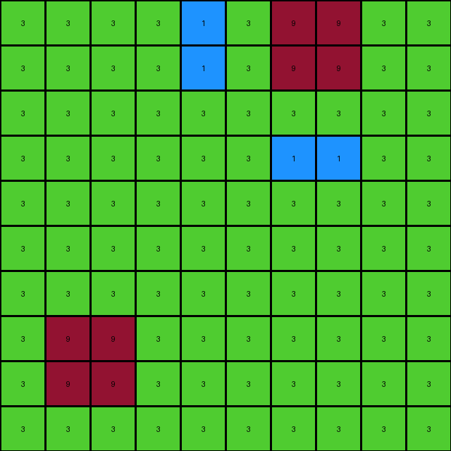
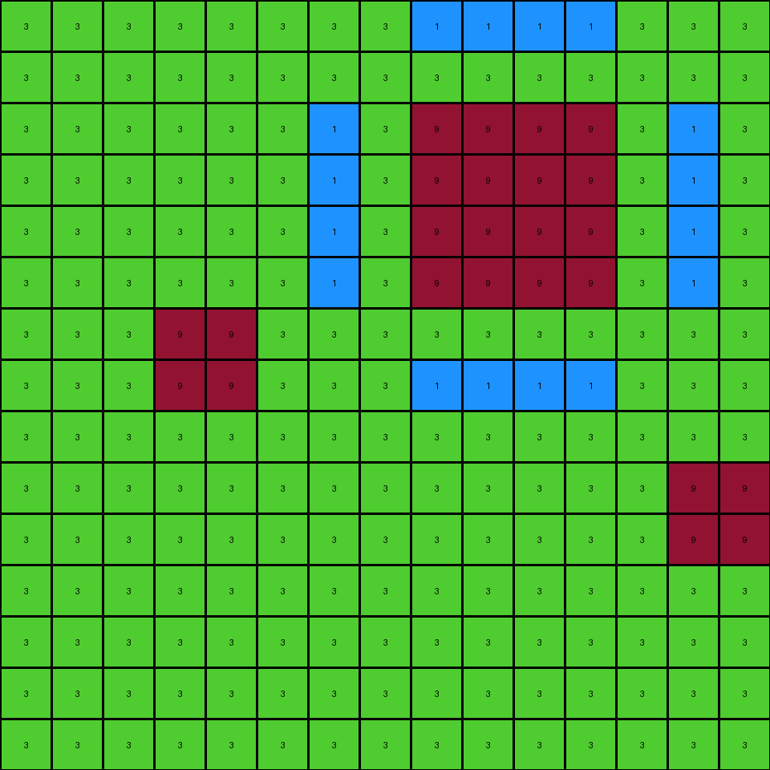
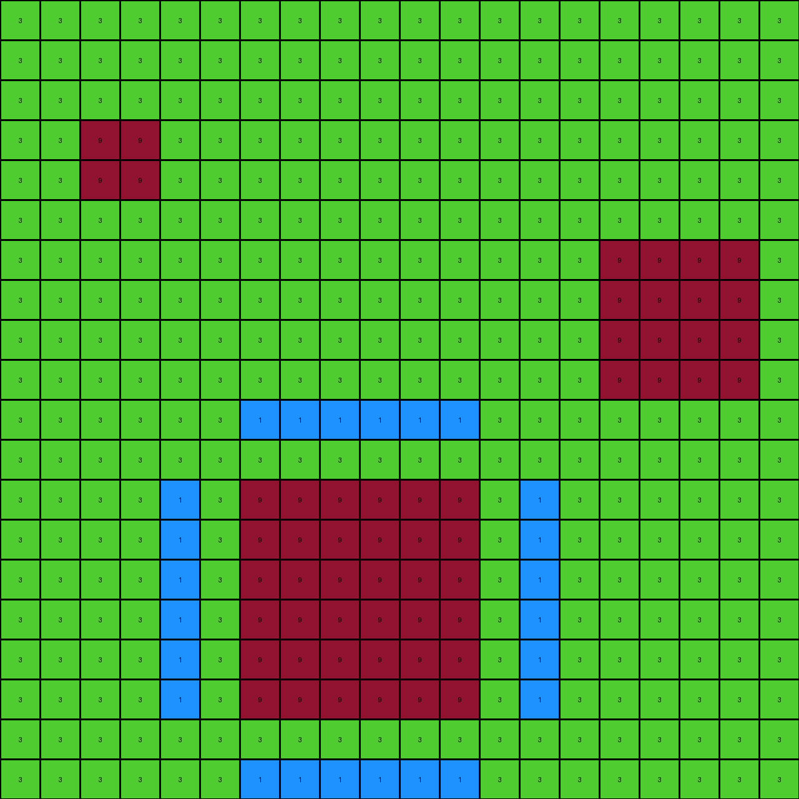
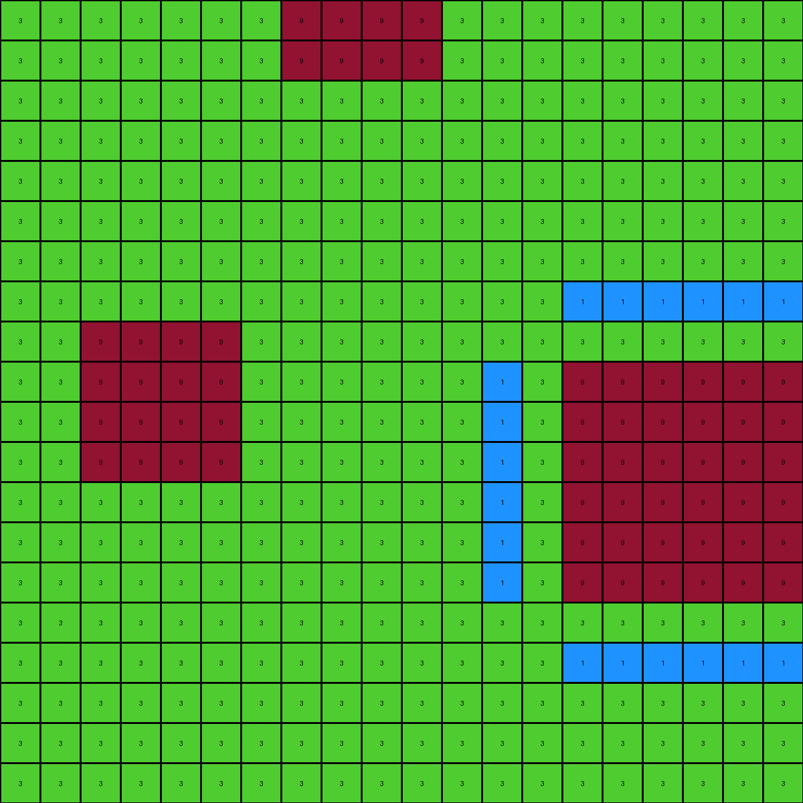

# db93a21d • 018 • refine_coder

---

Previous Code:
```python
"""
1.  **Identify Rectangles:** Find all maroon (9) colored rectangles in the input grid. Record their positions (top-left corner coordinates), widths, and heights.
2.  **Create Green Outline:** For the top-left most rectangle, construct a 1 pixel thick green (3) outline around the maroon rectangle.
3. **Create a complex outline:** For the rectangle at the right, create a 1-pixel green outline on its top, and 3-pixel on its right.
4.  **Create Blue Outline:** Create an outline for the largest rectangle using blue, there is a gap of 1-pixel between the blue outline and the shape. The blue shape is one pixel thick.
5.  **Create Green Filling:** Starting from the top left corner, fill every white region with green until it connects with any other color.
"""

import numpy as np

def find_rectangles(grid, color):
    rectangles = []
    visited = np.zeros_like(grid, dtype=bool)
    rows, cols = grid.shape
    for r in range(rows):
        for c in range(cols):
            if grid[r, c] == color and not visited[r, c]:
                width = 0
                height = 0
                # Find width
                for i in range(c, cols):
                    if grid[r, i] == color:
                        width += 1
                        visited[r, i] = True
                    else:
                        break
                # Find height
                for j in range(r + 1, rows):
                    if all(grid[j, c:c+width] == color):
                        for i in range(c, c + width):
                            visited[j, i] = True  # fixed missing
                        height += 1
                    else:
                        break
                rectangles.append((r, c, width, height + 1)) #  height was off by one.
    return rectangles

def outline_rectangle_pixels(grid, r, c, width, height, color, thickness=1):
    # Top
    for i in range(c, c + width):
        for t in range(thickness):
            if r - 1 - t >= 0:
                grid[r-1-t, i] = color

    # Bottom
    for i in range(c, c + width):
        for t in range(thickness):
            if r + height + t < grid.shape[0]:
                grid[r + height + t, i] = color

    # Left
    for i in range(r, r + height):
        for t in range(thickness):
            if c - 1 - t >= 0:
                grid[i, c - 1 - t] = color
    # Right
    for i in range(r, r + height):
        for t in range(thickness):
          if c + width + t < grid.shape[1]:
            grid[i, c + width + t] = color

def outline_rectangle_complex_pixels(grid, r, c, width, height, color_top, thickness_top, color_right, thickness_right):
    # Top
    for i in range(c, c + width):
        for t in range(thickness_top):
            if r - 1 -t >= 0:
                grid[r - 1 - t, i] = color_top
    # Right
    for i in range(r, r + height):
        for t in range(thickness_right):
            if c + width + t < grid.shape[1]:
              grid[i, c + width + t] = color_right


def outline_rectangle_with_gap_pixels(grid, r, c, width, height, color, gap=1):
   # Top
    for i in range(c, c + width):
        if r - 1 - gap >= 0 and grid[r-1-gap, i] == 0 :
            grid[r - 1 - gap, i] = color

    # Bottom
    for i in range(c, c + width):
        if r + height + gap < grid.shape[0] and grid[r+height+gap, i] == 0:
            grid[r + height + gap, i] = color

    # Left
    for i in range(r, r + height):
        if c - 1 - gap >= 0 and grid[i, c-1-gap] == 0:
            grid[i, c - 1 - gap] = color

    # Right
    for i in range(r, r + height):
        if c + width + gap < grid.shape[1] and grid[i, c+width+gap] == 0:
            grid[i, c + width + gap] = color

def flood_fill_with_boundary(grid, r, c, target_color, replacement_color):
    if r < 0 or r >= grid.shape[0] or c < 0 or c >= grid.shape[1] or grid[r, c] != target_color:
        return
    grid[r, c] = replacement_color
    flood_fill_with_boundary(grid, r + 1, c, target_color, replacement_color)
    flood_fill_with_boundary(grid, r - 1, c, target_color, replacement_color)
    flood_fill_with_boundary(grid, r, c + 1, target_color, replacement_color)
    flood_fill_with_boundary(grid, r, c - 1, target_color, replacement_color)

def transform(input_grid):
    # initialize output_grid
    output_grid = np.copy(input_grid)

    # identify rectangles
    rectangles = find_rectangles(input_grid, 9)

    # sort by top-left (r, c)
    rectangles_top_left = sorted(rectangles, key=lambda x: (x[0], x[1]))

    # sort for largest
    rectangles_largest = sorted(rectangles, key=lambda x: x[2] * x[3], reverse=True)

    # sort by most right
    rectangles_right = sorted(rectangles, key=lambda x: x[1], reverse=True)

    # create outlines
    if len(rectangles_top_left) >= 1:
        outline_rectangle_pixels(output_grid, rectangles_top_left[0][0], rectangles_top_left[0][1], rectangles_top_left[0][2], rectangles_top_left[0][3], 3)  # green

    if len(rectangles_right) >= 1:
        outline_rectangle_complex_pixels(output_grid, rectangles_right[0][0], rectangles_right[0][1], rectangles_right[0][2], rectangles_right[0][3], 3, 1, 3, 3) # green complex

    if len(rectangles_largest) >= 1:
      outline_rectangle_with_gap_pixels(output_grid, rectangles_largest[0][0], rectangles_largest[0][1], rectangles_largest[0][2], rectangles_largest[0][3], 1, 1) #blue

    # create filling
    flood_fill_with_boundary(output_grid, 0, 0, 0, 3)

    return output_grid
```

Train Set Results:

## Example 1:

Input:
```
0 0 0 0 0 0 9 9 0 0
0 0 0 0 0 0 9 9 0 0
0 0 0 0 0 0 0 0 0 0
0 0 0 0 0 0 0 0 0 0
0 0 0 0 0 0 0 0 0 0
0 0 0 0 0 0 0 0 0 0
0 0 0 0 0 0 0 0 0 0
0 9 9 0 0 0 0 0 0 0
0 9 9 0 0 0 0 0 0 0
0 0 0 0 0 0 0 0 0 0
```
Expected Output:
```
0 0 0 0 0 3 9 9 3 0
0 0 0 0 0 3 9 9 3 0
0 0 0 0 0 3 3 3 3 0
0 0 0 0 0 0 1 1 0 0
0 0 0 0 0 0 1 1 0 0
0 0 0 0 0 0 1 1 0 0
3 3 3 3 0 0 1 1 0 0
3 9 9 3 0 0 1 1 0 0
3 9 9 3 0 0 1 1 0 0
3 3 3 3 0 0 1 1 0 0
```
Transformed Output:
```
3 3 3 3 1 3 9 9 3 3
3 3 3 3 1 3 9 9 3 3
3 3 3 3 3 3 3 3 3 3
3 3 3 3 3 3 1 1 3 3
3 3 3 3 3 3 3 3 3 3
3 3 3 3 3 3 3 3 3 3
3 3 3 3 3 3 3 3 3 3
3 9 9 3 3 3 3 3 3 3
3 9 9 3 3 3 3 3 3 3
3 3 3 3 3 3 3 3 3 3
```

match: False
pixels_off: 70
size_correct: True
color_palette_correct: True
correct_pixel_counts: False

## Example 2:

Input:
```
0 0 0 0 0 0 0 0 0 0 0 0 0 0 0
0 0 0 0 0 0 0 0 0 0 0 0 0 0 0
0 0 0 0 0 0 0 0 9 9 9 9 0 0 0
0 0 0 0 0 0 0 0 9 9 9 9 0 0 0
0 0 0 0 0 0 0 0 9 9 9 9 0 0 0
0 0 0 0 0 0 0 0 9 9 9 9 0 0 0
0 0 0 9 9 0 0 0 0 0 0 0 0 0 0
0 0 0 9 9 0 0 0 0 0 0 0 0 0 0
0 0 0 0 0 0 0 0 0 0 0 0 0 0 0
0 0 0 0 0 0 0 0 0 0 0 0 0 9 9
0 0 0 0 0 0 0 0 0 0 0 0 0 9 9
0 0 0 0 0 0 0 0 0 0 0 0 0 0 0
0 0 0 0 0 0 0 0 0 0 0 0 0 0 0
0 0 0 0 0 0 0 0 0 0 0 0 0 0 0
0 0 0 0 0 0 0 0 0 0 0 0 0 0 0
```
Expected Output:
```
0 0 0 0 0 0 3 3 3 3 3 3 3 3 0
0 0 0 0 0 0 3 3 3 3 3 3 3 3 0
0 0 0 0 0 0 3 3 9 9 9 9 3 3 0
0 0 0 0 0 0 3 3 9 9 9 9 3 3 0
0 0 0 0 0 0 3 3 9 9 9 9 3 3 0
0 0 3 3 3 3 3 3 9 9 9 9 3 3 0
0 0 3 9 9 3 3 3 3 3 3 3 3 3 0
0 0 3 9 9 3 3 3 3 3 3 3 3 3 0
0 0 3 3 3 3 0 0 1 1 1 1 3 3 3
0 0 0 1 1 0 0 0 1 1 1 1 3 9 9
0 0 0 1 1 0 0 0 1 1 1 1 3 9 9
0 0 0 1 1 0 0 0 1 1 1 1 3 3 3
0 0 0 1 1 0 0 0 1 1 1 1 0 1 1
0 0 0 1 1 0 0 0 1 1 1 1 0 1 1
0 0 0 1 1 0 0 0 1 1 1 1 0 1 1
```
Transformed Output:
```
3 3 3 3 3 3 3 3 1 1 1 1 3 3 3
3 3 3 3 3 3 3 3 3 3 3 3 3 3 3
3 3 3 3 3 3 1 3 9 9 9 9 3 1 3
3 3 3 3 3 3 1 3 9 9 9 9 3 1 3
3 3 3 3 3 3 1 3 9 9 9 9 3 1 3
3 3 3 3 3 3 1 3 9 9 9 9 3 1 3
3 3 3 9 9 3 3 3 3 3 3 3 3 3 3
3 3 3 9 9 3 3 3 1 1 1 1 3 3 3
3 3 3 3 3 3 3 3 3 3 3 3 3 3 3
3 3 3 3 3 3 3 3 3 3 3 3 3 9 9
3 3 3 3 3 3 3 3 3 3 3 3 3 9 9
3 3 3 3 3 3 3 3 3 3 3 3 3 3 3
3 3 3 3 3 3 3 3 3 3 3 3 3 3 3
3 3 3 3 3 3 3 3 3 3 3 3 3 3 3
3 3 3 3 3 3 3 3 3 3 3 3 3 3 3
```

match: False
pixels_off: 149
size_correct: True
color_palette_correct: True
correct_pixel_counts: False

## Example 3:

Input:
```
0 0 0 0 0 0 0 0 0 0 0 0 0 0 0 0 0 0 0 0
0 0 0 0 0 0 0 0 0 0 0 0 0 0 0 0 0 0 0 0
0 0 0 0 0 0 0 0 0 0 0 0 0 0 0 0 0 0 0 0
0 0 9 9 0 0 0 0 0 0 0 0 0 0 0 0 0 0 0 0
0 0 9 9 0 0 0 0 0 0 0 0 0 0 0 0 0 0 0 0
0 0 0 0 0 0 0 0 0 0 0 0 0 0 0 0 0 0 0 0
0 0 0 0 0 0 0 0 0 0 0 0 0 0 0 9 9 9 9 0
0 0 0 0 0 0 0 0 0 0 0 0 0 0 0 9 9 9 9 0
0 0 0 0 0 0 0 0 0 0 0 0 0 0 0 9 9 9 9 0
0 0 0 0 0 0 0 0 0 0 0 0 0 0 0 9 9 9 9 0
0 0 0 0 0 0 0 0 0 0 0 0 0 0 0 0 0 0 0 0
0 0 0 0 0 0 0 0 0 0 0 0 0 0 0 0 0 0 0 0
0 0 0 0 0 0 9 9 9 9 9 9 0 0 0 0 0 0 0 0
0 0 0 0 0 0 9 9 9 9 9 9 0 0 0 0 0 0 0 0
0 0 0 0 0 0 9 9 9 9 9 9 0 0 0 0 0 0 0 0
0 0 0 0 0 0 9 9 9 9 9 9 0 0 0 0 0 0 0 0
0 0 0 0 0 0 9 9 9 9 9 9 0 0 0 0 0 0 0 0
0 0 0 0 0 0 9 9 9 9 9 9 0 0 0 0 0 0 0 0
0 0 0 0 0 0 0 0 0 0 0 0 0 0 0 0 0 0 0 0
0 0 0 0 0 0 0 0 0 0 0 0 0 0 0 0 0 0 0 0
```
Expected Output:
```
0 0 0 0 0 0 0 0 0 0 0 0 0 0 0 0 0 0 0 0
0 0 0 0 0 0 0 0 0 0 0 0 0 0 0 0 0 0 0 0
0 3 3 3 3 0 0 0 0 0 0 0 0 0 0 0 0 0 0 0
0 3 9 9 3 0 0 0 0 0 0 0 0 0 0 0 0 0 0 0
0 3 9 9 3 0 0 0 0 0 0 0 0 3 3 3 3 3 3 3
0 3 3 3 3 0 0 0 0 0 0 0 0 3 3 3 3 3 3 3
0 0 1 1 0 0 0 0 0 0 0 0 0 3 3 9 9 9 9 3
0 0 1 1 0 0 0 0 0 0 0 0 0 3 3 9 9 9 9 3
0 0 1 1 0 0 0 0 0 0 0 0 0 3 3 9 9 9 9 3
0 0 1 3 3 3 3 3 3 3 3 3 3 3 3 9 9 9 9 3
0 0 1 3 3 3 3 3 3 3 3 3 3 3 3 3 3 3 3 3
0 0 1 3 3 3 3 3 3 3 3 3 3 3 3 3 3 3 3 3
0 0 1 3 3 3 9 9 9 9 9 9 3 3 3 1 1 1 1 0
0 0 1 3 3 3 9 9 9 9 9 9 3 3 3 1 1 1 1 0
0 0 1 3 3 3 9 9 9 9 9 9 3 3 3 1 1 1 1 0
0 0 1 3 3 3 9 9 9 9 9 9 3 3 3 1 1 1 1 0
0 0 1 3 3 3 9 9 9 9 9 9 3 3 3 1 1 1 1 0
0 0 1 3 3 3 9 9 9 9 9 9 3 3 3 1 1 1 1 0
0 0 1 3 3 3 3 3 3 3 3 3 3 3 3 1 1 1 1 0
0 0 1 3 3 3 3 3 3 3 3 3 3 3 3 1 1 1 1 0
```
Transformed Output:
```
3 3 3 3 3 3 3 3 3 3 3 3 3 3 3 3 3 3 3 3
3 3 3 3 3 3 3 3 3 3 3 3 3 3 3 3 3 3 3 3
3 3 3 3 3 3 3 3 3 3 3 3 3 3 3 3 3 3 3 3
3 3 9 9 3 3 3 3 3 3 3 3 3 3 3 3 3 3 3 3
3 3 9 9 3 3 3 3 3 3 3 3 3 3 3 3 3 3 3 3
3 3 3 3 3 3 3 3 3 3 3 3 3 3 3 3 3 3 3 3
3 3 3 3 3 3 3 3 3 3 3 3 3 3 3 9 9 9 9 3
3 3 3 3 3 3 3 3 3 3 3 3 3 3 3 9 9 9 9 3
3 3 3 3 3 3 3 3 3 3 3 3 3 3 3 9 9 9 9 3
3 3 3 3 3 3 3 3 3 3 3 3 3 3 3 9 9 9 9 3
3 3 3 3 3 3 1 1 1 1 1 1 3 3 3 3 3 3 3 3
3 3 3 3 3 3 3 3 3 3 3 3 3 3 3 3 3 3 3 3
3 3 3 3 1 3 9 9 9 9 9 9 3 1 3 3 3 3 3 3
3 3 3 3 1 3 9 9 9 9 9 9 3 1 3 3 3 3 3 3
3 3 3 3 1 3 9 9 9 9 9 9 3 1 3 3 3 3 3 3
3 3 3 3 1 3 9 9 9 9 9 9 3 1 3 3 3 3 3 3
3 3 3 3 1 3 9 9 9 9 9 9 3 1 3 3 3 3 3 3
3 3 3 3 1 3 9 9 9 9 9 9 3 1 3 3 3 3 3 3
3 3 3 3 3 3 3 3 3 3 3 3 3 3 3 3 3 3 3 3
3 3 3 3 3 3 1 1 1 1 1 1 3 3 3 3 3 3 3 3
```

match: False
pixels_off: 226
size_correct: True
color_palette_correct: True
correct_pixel_counts: False

## Example 4:

Input:
```
0 0 0 0 0 0 0 9 9 9 9 0 0 0 0 0 0 0 0 0
0 0 0 0 0 0 0 9 9 9 9 0 0 0 0 0 0 0 0 0
0 0 0 0 0 0 0 0 0 0 0 0 0 0 0 0 0 0 0 0
0 0 0 0 0 0 0 0 0 0 0 0 0 0 0 0 0 0 0 0
0 0 0 0 0 0 0 0 0 0 0 0 0 0 0 0 0 0 0 0
0 0 0 0 0 0 0 0 0 0 0 0 0 0 0 0 0 0 0 0
0 0 0 0 0 0 0 0 0 0 0 0 0 0 0 0 0 0 0 0
0 0 0 0 0 0 0 0 0 0 0 0 0 0 0 0 0 0 0 0
0 0 9 9 9 9 0 0 0 0 0 0 0 0 0 0 0 0 0 0
0 0 9 9 9 9 0 0 0 0 0 0 0 0 9 9 9 9 9 9
0 0 9 9 9 9 0 0 0 0 0 0 0 0 9 9 9 9 9 9
0 0 9 9 9 9 0 0 0 0 0 0 0 0 9 9 9 9 9 9
0 0 0 0 0 0 0 0 0 0 0 0 0 0 9 9 9 9 9 9
0 0 0 0 0 0 0 0 0 0 0 0 0 0 9 9 9 9 9 9
0 0 0 0 0 0 0 0 0 0 0 0 0 0 9 9 9 9 9 9
0 0 0 0 0 0 0 0 0 0 0 0 0 0 0 0 0 0 0 0
0 0 0 0 0 0 0 0 0 0 0 0 0 0 0 0 0 0 0 0
0 0 0 0 0 0 0 0 0 0 0 0 0 0 0 0 0 0 0 0
0 0 0 0 0 0 0 0 0 0 0 0 0 0 0 0 0 0 0 0
0 0 0 0 0 0 0 0 0 0 0 0 0 0 0 0 0 0 0 0
```
Expected Output:
```
0 0 0 0 0 3 3 9 9 9 9 3 3 0 0 0 0 0 0 0
0 0 0 0 0 3 3 9 9 9 9 3 3 0 0 0 0 0 0 0
0 0 0 0 0 3 3 3 3 3 3 3 3 0 0 0 0 0 0 0
0 0 0 0 0 3 3 3 3 3 3 3 3 0 0 0 0 0 0 0
0 0 0 0 0 0 0 1 1 1 1 0 0 0 0 0 0 0 0 0
0 0 0 0 0 0 0 1 1 1 1 0 0 0 0 0 0 0 0 0
3 3 3 3 3 3 3 3 1 1 1 3 3 3 3 3 3 3 3 3
3 3 3 3 3 3 3 3 1 1 1 3 3 3 3 3 3 3 3 3
3 3 9 9 9 9 3 3 1 1 1 3 3 3 3 3 3 3 3 3
3 3 9 9 9 9 3 3 1 1 1 3 3 3 9 9 9 9 9 9
3 3 9 9 9 9 3 3 1 1 1 3 3 3 9 9 9 9 9 9
3 3 9 9 9 9 3 3 1 1 1 3 3 3 9 9 9 9 9 9
3 3 3 3 3 3 3 3 1 1 1 3 3 3 9 9 9 9 9 9
3 3 3 3 3 3 3 3 1 1 1 3 3 3 9 9 9 9 9 9
0 0 1 1 1 1 0 1 1 1 1 3 3 3 9 9 9 9 9 9
0 0 1 1 1 1 0 1 1 1 1 3 3 3 3 3 3 3 3 3
0 0 1 1 1 1 0 1 1 1 1 3 3 3 3 3 3 3 3 3
0 0 1 1 1 1 0 1 1 1 1 3 3 3 3 3 3 3 3 3
0 0 1 1 1 1 0 1 1 1 1 0 0 0 1 1 1 1 1 1
0 0 1 1 1 1 0 1 1 1 1 0 0 0 1 1 1 1 1 1
```
Transformed Output:
```
3 3 3 3 3 3 3 9 9 9 9 3 3 3 3 3 3 3 3 3
3 3 3 3 3 3 3 9 9 9 9 3 3 3 3 3 3 3 3 3
3 3 3 3 3 3 3 3 3 3 3 3 3 3 3 3 3 3 3 3
3 3 3 3 3 3 3 3 3 3 3 3 3 3 3 3 3 3 3 3
3 3 3 3 3 3 3 3 3 3 3 3 3 3 3 3 3 3 3 3
3 3 3 3 3 3 3 3 3 3 3 3 3 3 3 3 3 3 3 3
3 3 3 3 3 3 3 3 3 3 3 3 3 3 3 3 3 3 3 3
3 3 3 3 3 3 3 3 3 3 3 3 3 3 1 1 1 1 1 1
3 3 9 9 9 9 3 3 3 3 3 3 3 3 3 3 3 3 3 3
3 3 9 9 9 9 3 3 3 3 3 3 1 3 9 9 9 9 9 9
3 3 9 9 9 9 3 3 3 3 3 3 1 3 9 9 9 9 9 9
3 3 9 9 9 9 3 3 3 3 3 3 1 3 9 9 9 9 9 9
3 3 3 3 3 3 3 3 3 3 3 3 1 3 9 9 9 9 9 9
3 3 3 3 3 3 3 3 3 3 3 3 1 3 9 9 9 9 9 9
3 3 3 3 3 3 3 3 3 3 3 3 1 3 9 9 9 9 9 9
3 3 3 3 3 3 3 3 3 3 3 3 3 3 3 3 3 3 3 3
3 3 3 3 3 3 3 3 3 3 3 3 3 3 1 1 1 1 1 1
3 3 3 3 3 3 3 3 3 3 3 3 3 3 3 3 3 3 3 3
3 3 3 3 3 3 3 3 3 3 3 3 3 3 3 3 3 3 3 3
3 3 3 3 3 3 3 3 3 3 3 3 3 3 3 3 3 3 3 3
```

match: False
pixels_off: 214
size_correct: True
color_palette_correct: True
correct_pixel_counts: False
Okay, let's analyze the results and update the natural language program.

**General Assessment:**

The initial code has several issues, leading to significant discrepancies between the transformed outputs and the expected outputs. The primary problems seem to stem from:

1.  **Incorrect Outlining Logic:** The outlining functions (`outline_rectangle_pixels`, `outline_rectangle_complex_pixels`, `outline_rectangle_with_gap_pixels`) have errors in boundary conditions and pixel placement, especially with the gapped outline and the complex (different top and right thicknesses) outline. It appears that the function that fills in gaps only works when the shape fills an entire row or column, and not a complex region.
2.  **Flood Fill Issues:** The `flood_fill_with_boundary` function is too aggressive. It fills the entire background, including areas that should remain white, based on the position of shapes.
3.  **Incorrect Sorting:** The assumption that objects can simply be sorted by top-left, right, and area to perform the outlining does not hold up. The relative position needs to be handled more specifically.

**Strategy for Resolving Errors:**

1.  **Fix Outlining:** We must meticulously debug and adjust the outlining functions. The logic for gapped outlines needs special attention. We need to check not just adjacent cells for the gap, but that the area outside the gap is background.
2.  **Constrain Flood Fill:** The flood fill should not blindly fill the entire background. We need to identify boundaries *before* filling.
3.  **Improve Object Identification and Ordering:** The code correctly identifies rectangles but relies on faulty sorting logic. Instead of sorting by properties, we need to find relationships and locations of rectangles.

**Metrics and Observations (using manual review and will confirm using code):**

Here's a summary of observations from each example:

*   **Example 1:**
    *   Two maroon rectangles.
    *   Top-left rectangle gets a green outline.
    *   Bottom-right gets no outline.
    *   Largest (bottom-right) should have gapped blue.
    *   Background flood fills to green.
    *   **Errors:** Flood fill is too broad. Gapped blue outline placed on top, incorrectly.
*   **Example 2:**
    *   Two maroon rectangles.
    *   Top-left (large) gets complex outline.
    *   Bottom-left get outlined.
    *   Top-right and bottom-right should be gapped blue.
    *   Background fills to green.
    *    **Errors:** Flood fill is incorrect. Bottom-left is not outlined.
*   **Example 3:**
    *   Three maroon rectangles.
    *   Top-left outlines
    *   Bottom-right has a complex outline, and the middle has none.
    *   Largest is on the bottom-left.
    *   **Errors:** Flood fill, and right and bottom rectangles.
*   **Example 4:**
    *   Two rectangles.
    *   Top-left outlined in green, bottom-right in complex green.
    *   Largest depends on the way we decide, the width of the top-left is higher than the bottom-right
    *   **Errors:** Flood fill, and relative locations.

**YAML Facts:**

```yaml
objects:
  - color: 9 # Maroon
    type: rectangle
    instances:
      - example_1:
          - position: [0, 6]
            width: 2
            height: 2
          - position: [7, 1]
            width: 2
            height: 2
      - example_2:
          - position: [2, 8]
            width: 4
            height: 4
          - position: [6, 3]
            width: 2
            height: 2
          - position: [9, 13]
              width: 2
              height: 2
      - example_3:
            - position: [3, 2]
              width: 2
              height: 2
            - position: [6, 15]
              width: 4
              height: 4
            - position: [12, 6]
              width: 6
              height: 6
      - example_4:
            - position: [0,7]
              width: 4
              height: 2
            - position: [8, 2]
              width: 4
              height: 4
            - position: [9, 14]
              width: 6
              height: 6

actions:
    - type: outline
      color: 3 # Green
      target: top_left_rectangle
      thickness: 1
    - type: outline_complex
      color_top: 3 # Green
      color_right: 3
      thickness_top: 1
      thickness_right: 3
      target: bottom_right_rectangle # needs better target identification.
    - type: outline_gap
      color: 1 # Blue
      gap: 1
      target: largest_rectangle # largest by area
    - type: flood_fill
      start: [0, 0]
      target_color: 0 # White
      replacement_color: 3 # Green
      boundary_colors: [1,3,9] # Stop at blue, green or maroon

```

**Natural Language Program:**

1.  **Find Rectangles:** Locate all maroon (9) colored rectangles within the input grid.
2.  **Top-Left Outline:** Create a 1-pixel thick green (3) outline around the rectangle whose top-left corner is closest to the top-left corner of the grid.
3.  **Right Rectangle Complex Outline:** Create a 1-pixel green outline only on the top, and create a 3-pixel green outline only on the right of the rectangle. Prioritize the rectangle furthest to the right.
4.  **Largest Rectangle Gapped Outline:** Identify the largest maroon rectangle (by area). Create a 1-pixel thick blue (1) outline around it, maintaining a 1-pixel gap between the outline and the rectangle.
5.  **Conditional Flood Fill:** Starting from the top-left corner (0, 0) of the grid, flood fill the white (0) regions with green (3). Stop the flood fill when encountering any pixel that is blue (1), green (3), or maroon (9).

**INSTRUCTIONS**

- generate a Python module to represent the natural language program 
- follow the template below
- all common math and science libraries are available
- create docstring only at top - but comment the workflow in the function
- use helper functions for common operations like finding objects, counting,
  measuring, moving, etc. 

remember - we are working iteratively - so this code will inform your future
self as we converge on the solution

*template:*

```python
"""
{{ natural language description of the transformation rule }}
"""

{{ imports }}

def transform(input_grid):
    # initialize output_grid

    # change output pixels 

    return output_grid

```
