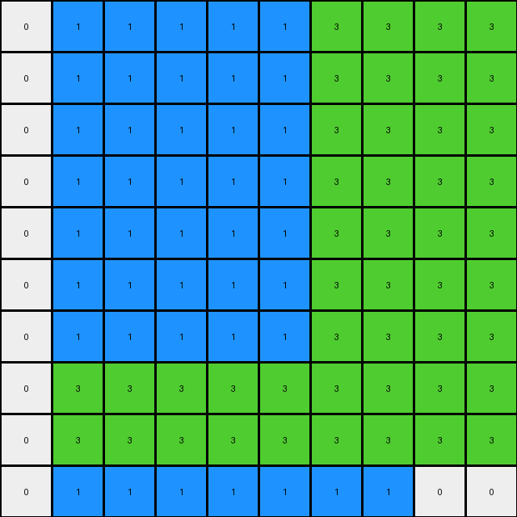
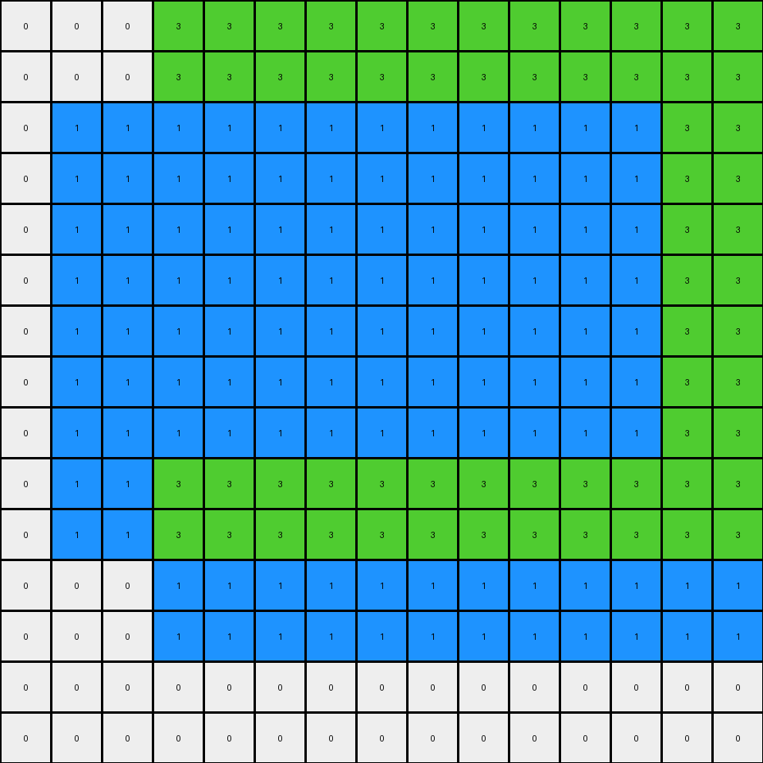
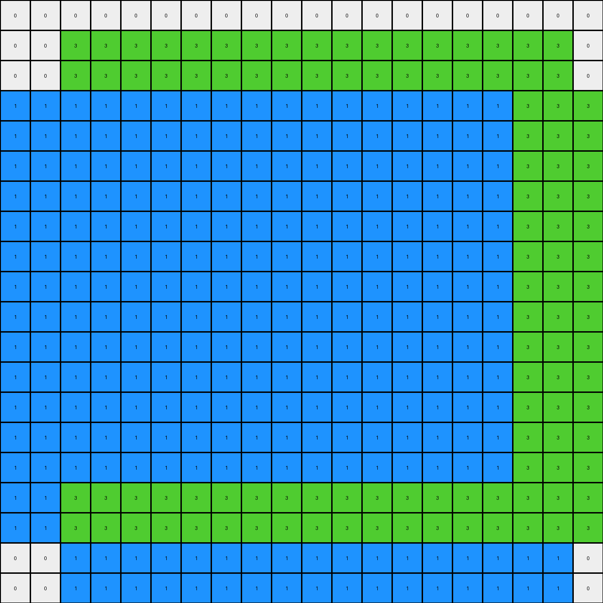
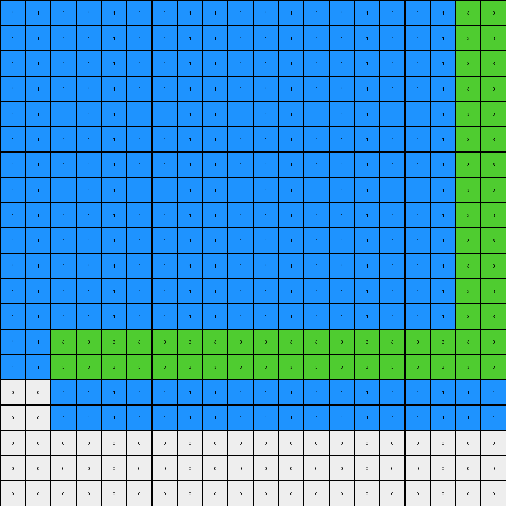

# db93a21d • 022 • refine_coder

---

Previous Code:
```python
"""
This program transforms an input grid containing two maroon rectangles into an output grid where the rectangles
are partially recolored to blue and green, and surrounded by green and blue filling.
"""

import numpy as np

def find_object(grid, color):
    # Find the bounding box of the object of the given color.
    rows, cols = np.where(grid == color)
    if len(rows) == 0:
        return None  # Object not found
    min_row, max_row = np.min(rows), np.max(rows)
    min_col, max_col = np.min(cols), np.max(cols)
    return (min_row, min_col), (max_row, max_col)

def transform(input_grid):
    # Initialize output_grid as a copy of the input_grid
    output_grid = np.copy(input_grid)

    # Find the two maroon rectangles
    top_left_start, top_left_end = find_object(input_grid, 9)
    bottom_right_start, bottom_right_end = find_object(input_grid, 9)
    
    # Check if the top-left rectangle exists
    if top_left_start is not None:
        # Top-Left Maroon Shape Transformation

        # Fill right with green
        output_grid[top_left_start[0]:top_left_end[0]+1, top_left_end[1] + 1:top_left_end[1] + 3] = 3
        # Fill below with blue
        output_grid[top_left_end[0] + 1:top_left_end[0] + 3, top_left_start[1]:top_left_end[1]+1] = 1

        # Change top two rows to green
        output_grid[top_left_start[0]:top_left_start[0] + 2, top_left_start[1]:top_left_end[1] + 1] = 3
        # Change leftmost two columns to green
        output_grid[top_left_start[0]:top_left_end[0] + 1, top_left_start[1]:top_left_start[1] + 2] = 3
        # Change the remaining to blue
        output_grid[top_left_start[0] + 2:top_left_end[0] + 1, top_left_start[1] + 2:top_left_end[1] + 1] = 1


    # Check if the bottom-right rectangle exists
    if bottom_right_start is not None:
        # Bottom-Right Maroon Shape Transformation
        
        # Fill left with blue
        output_grid[bottom_right_start[0]:bottom_right_end[0]+1, bottom_right_start[1]-2:bottom_right_start[1]] = 1
        #Fill above with green
        output_grid[bottom_right_start[0]-2:bottom_right_start[0], bottom_right_start[1]:bottom_right_end[1]+1] = 3

        # Change rightmost two columns to green
        output_grid[bottom_right_start[0]:bottom_right_end[0] + 1, bottom_right_end[1] - 1:bottom_right_end[1] + 1] = 3
        # Change bottom two rows to green
        output_grid[bottom_right_end[0] - 1:bottom_right_end[0] + 1, bottom_right_start[1]:bottom_right_end[1] + 1] = 3
        # Change the remaining to blue
        output_grid[bottom_right_start[0]:bottom_right_end[0] - 1, bottom_right_start[1]:bottom_right_end[1] - 1] = 1

    return output_grid
```

Train Set Results:

## Example 1:

Input:
```
0 0 0 0 0 0 9 9 0 0
0 0 0 0 0 0 9 9 0 0
0 0 0 0 0 0 0 0 0 0
0 0 0 0 0 0 0 0 0 0
0 0 0 0 0 0 0 0 0 0
0 0 0 0 0 0 0 0 0 0
0 0 0 0 0 0 0 0 0 0
0 9 9 0 0 0 0 0 0 0
0 9 9 0 0 0 0 0 0 0
0 0 0 0 0 0 0 0 0 0
```
Expected Output:
```
0 0 0 0 0 3 9 9 3 0
0 0 0 0 0 3 9 9 3 0
0 0 0 0 0 3 3 3 3 0
0 0 0 0 0 0 1 1 0 0
0 0 0 0 0 0 1 1 0 0
0 0 0 0 0 0 1 1 0 0
3 3 3 3 0 0 1 1 0 0
3 9 9 3 0 0 1 1 0 0
3 9 9 3 0 0 1 1 0 0
3 3 3 3 0 0 1 1 0 0
```
Transformed Output:
```
0 1 1 1 1 1 3 3 3 3
0 1 1 1 1 1 3 3 3 3
0 1 1 1 1 1 3 3 3 3
0 1 1 1 1 1 3 3 3 3
0 1 1 1 1 1 3 3 3 3
0 1 1 1 1 1 3 3 3 3
0 1 1 1 1 1 3 3 3 3
0 3 3 3 3 3 3 3 3 3
0 3 3 3 3 3 3 3 3 3
0 1 1 1 1 1 1 1 0 0
```

match: False
pixels_off: 83
size_correct: True
color_palette_correct: True
correct_pixel_counts: False

## Example 2:

Input:
```
0 0 0 0 0 0 0 0 0 0 0 0 0 0 0
0 0 0 0 0 0 0 0 0 0 0 0 0 0 0
0 0 0 0 0 0 0 0 9 9 9 9 0 0 0
0 0 0 0 0 0 0 0 9 9 9 9 0 0 0
0 0 0 0 0 0 0 0 9 9 9 9 0 0 0
0 0 0 0 0 0 0 0 9 9 9 9 0 0 0
0 0 0 9 9 0 0 0 0 0 0 0 0 0 0
0 0 0 9 9 0 0 0 0 0 0 0 0 0 0
0 0 0 0 0 0 0 0 0 0 0 0 0 0 0
0 0 0 0 0 0 0 0 0 0 0 0 0 9 9
0 0 0 0 0 0 0 0 0 0 0 0 0 9 9
0 0 0 0 0 0 0 0 0 0 0 0 0 0 0
0 0 0 0 0 0 0 0 0 0 0 0 0 0 0
0 0 0 0 0 0 0 0 0 0 0 0 0 0 0
0 0 0 0 0 0 0 0 0 0 0 0 0 0 0
```
Expected Output:
```
0 0 0 0 0 0 3 3 3 3 3 3 3 3 0
0 0 0 0 0 0 3 3 3 3 3 3 3 3 0
0 0 0 0 0 0 3 3 9 9 9 9 3 3 0
0 0 0 0 0 0 3 3 9 9 9 9 3 3 0
0 0 0 0 0 0 3 3 9 9 9 9 3 3 0
0 0 3 3 3 3 3 3 9 9 9 9 3 3 0
0 0 3 9 9 3 3 3 3 3 3 3 3 3 0
0 0 3 9 9 3 3 3 3 3 3 3 3 3 0
0 0 3 3 3 3 0 0 1 1 1 1 3 3 3
0 0 0 1 1 0 0 0 1 1 1 1 3 9 9
0 0 0 1 1 0 0 0 1 1 1 1 3 9 9
0 0 0 1 1 0 0 0 1 1 1 1 3 3 3
0 0 0 1 1 0 0 0 1 1 1 1 0 1 1
0 0 0 1 1 0 0 0 1 1 1 1 0 1 1
0 0 0 1 1 0 0 0 1 1 1 1 0 1 1
```
Transformed Output:
```
0 0 0 3 3 3 3 3 3 3 3 3 3 3 3
0 0 0 3 3 3 3 3 3 3 3 3 3 3 3
0 1 1 1 1 1 1 1 1 1 1 1 1 3 3
0 1 1 1 1 1 1 1 1 1 1 1 1 3 3
0 1 1 1 1 1 1 1 1 1 1 1 1 3 3
0 1 1 1 1 1 1 1 1 1 1 1 1 3 3
0 1 1 1 1 1 1 1 1 1 1 1 1 3 3
0 1 1 1 1 1 1 1 1 1 1 1 1 3 3
0 1 1 1 1 1 1 1 1 1 1 1 1 3 3
0 1 1 3 3 3 3 3 3 3 3 3 3 3 3
0 1 1 3 3 3 3 3 3 3 3 3 3 3 3
0 0 0 1 1 1 1 1 1 1 1 1 1 1 1
0 0 0 1 1 1 1 1 1 1 1 1 1 1 1
0 0 0 0 0 0 0 0 0 0 0 0 0 0 0
0 0 0 0 0 0 0 0 0 0 0 0 0 0 0
```

match: False
pixels_off: 146
size_correct: True
color_palette_correct: True
correct_pixel_counts: False

## Example 3:

Input:
```
0 0 0 0 0 0 0 0 0 0 0 0 0 0 0 0 0 0 0 0
0 0 0 0 0 0 0 0 0 0 0 0 0 0 0 0 0 0 0 0
0 0 0 0 0 0 0 0 0 0 0 0 0 0 0 0 0 0 0 0
0 0 9 9 0 0 0 0 0 0 0 0 0 0 0 0 0 0 0 0
0 0 9 9 0 0 0 0 0 0 0 0 0 0 0 0 0 0 0 0
0 0 0 0 0 0 0 0 0 0 0 0 0 0 0 0 0 0 0 0
0 0 0 0 0 0 0 0 0 0 0 0 0 0 0 9 9 9 9 0
0 0 0 0 0 0 0 0 0 0 0 0 0 0 0 9 9 9 9 0
0 0 0 0 0 0 0 0 0 0 0 0 0 0 0 9 9 9 9 0
0 0 0 0 0 0 0 0 0 0 0 0 0 0 0 9 9 9 9 0
0 0 0 0 0 0 0 0 0 0 0 0 0 0 0 0 0 0 0 0
0 0 0 0 0 0 0 0 0 0 0 0 0 0 0 0 0 0 0 0
0 0 0 0 0 0 9 9 9 9 9 9 0 0 0 0 0 0 0 0
0 0 0 0 0 0 9 9 9 9 9 9 0 0 0 0 0 0 0 0
0 0 0 0 0 0 9 9 9 9 9 9 0 0 0 0 0 0 0 0
0 0 0 0 0 0 9 9 9 9 9 9 0 0 0 0 0 0 0 0
0 0 0 0 0 0 9 9 9 9 9 9 0 0 0 0 0 0 0 0
0 0 0 0 0 0 9 9 9 9 9 9 0 0 0 0 0 0 0 0
0 0 0 0 0 0 0 0 0 0 0 0 0 0 0 0 0 0 0 0
0 0 0 0 0 0 0 0 0 0 0 0 0 0 0 0 0 0 0 0
```
Expected Output:
```
0 0 0 0 0 0 0 0 0 0 0 0 0 0 0 0 0 0 0 0
0 0 0 0 0 0 0 0 0 0 0 0 0 0 0 0 0 0 0 0
0 3 3 3 3 0 0 0 0 0 0 0 0 0 0 0 0 0 0 0
0 3 9 9 3 0 0 0 0 0 0 0 0 0 0 0 0 0 0 0
0 3 9 9 3 0 0 0 0 0 0 0 0 3 3 3 3 3 3 3
0 3 3 3 3 0 0 0 0 0 0 0 0 3 3 3 3 3 3 3
0 0 1 1 0 0 0 0 0 0 0 0 0 3 3 9 9 9 9 3
0 0 1 1 0 0 0 0 0 0 0 0 0 3 3 9 9 9 9 3
0 0 1 1 0 0 0 0 0 0 0 0 0 3 3 9 9 9 9 3
0 0 1 3 3 3 3 3 3 3 3 3 3 3 3 9 9 9 9 3
0 0 1 3 3 3 3 3 3 3 3 3 3 3 3 3 3 3 3 3
0 0 1 3 3 3 3 3 3 3 3 3 3 3 3 3 3 3 3 3
0 0 1 3 3 3 9 9 9 9 9 9 3 3 3 1 1 1 1 0
0 0 1 3 3 3 9 9 9 9 9 9 3 3 3 1 1 1 1 0
0 0 1 3 3 3 9 9 9 9 9 9 3 3 3 1 1 1 1 0
0 0 1 3 3 3 9 9 9 9 9 9 3 3 3 1 1 1 1 0
0 0 1 3 3 3 9 9 9 9 9 9 3 3 3 1 1 1 1 0
0 0 1 3 3 3 9 9 9 9 9 9 3 3 3 1 1 1 1 0
0 0 1 3 3 3 3 3 3 3 3 3 3 3 3 1 1 1 1 0
0 0 1 3 3 3 3 3 3 3 3 3 3 3 3 1 1 1 1 0
```
Transformed Output:
```
0 0 0 0 0 0 0 0 0 0 0 0 0 0 0 0 0 0 0 0
0 0 3 3 3 3 3 3 3 3 3 3 3 3 3 3 3 3 3 0
0 0 3 3 3 3 3 3 3 3 3 3 3 3 3 3 3 3 3 0
1 1 1 1 1 1 1 1 1 1 1 1 1 1 1 1 1 3 3 3
1 1 1 1 1 1 1 1 1 1 1 1 1 1 1 1 1 3 3 3
1 1 1 1 1 1 1 1 1 1 1 1 1 1 1 1 1 3 3 3
1 1 1 1 1 1 1 1 1 1 1 1 1 1 1 1 1 3 3 3
1 1 1 1 1 1 1 1 1 1 1 1 1 1 1 1 1 3 3 3
1 1 1 1 1 1 1 1 1 1 1 1 1 1 1 1 1 3 3 3
1 1 1 1 1 1 1 1 1 1 1 1 1 1 1 1 1 3 3 3
1 1 1 1 1 1 1 1 1 1 1 1 1 1 1 1 1 3 3 3
1 1 1 1 1 1 1 1 1 1 1 1 1 1 1 1 1 3 3 3
1 1 1 1 1 1 1 1 1 1 1 1 1 1 1 1 1 3 3 3
1 1 1 1 1 1 1 1 1 1 1 1 1 1 1 1 1 3 3 3
1 1 1 1 1 1 1 1 1 1 1 1 1 1 1 1 1 3 3 3
1 1 1 1 1 1 1 1 1 1 1 1 1 1 1 1 1 3 3 3
1 1 3 3 3 3 3 3 3 3 3 3 3 3 3 3 3 3 3 3
1 1 3 3 3 3 3 3 3 3 3 3 3 3 3 3 3 3 3 3
0 0 1 1 1 1 1 1 1 1 1 1 1 1 1 1 1 1 1 0
0 0 1 1 1 1 1 1 1 1 1 1 1 1 1 1 1 1 1 0
```

match: False
pixels_off: 307
size_correct: True
color_palette_correct: True
correct_pixel_counts: False

## Example 4:

Input:
```
0 0 0 0 0 0 0 9 9 9 9 0 0 0 0 0 0 0 0 0
0 0 0 0 0 0 0 9 9 9 9 0 0 0 0 0 0 0 0 0
0 0 0 0 0 0 0 0 0 0 0 0 0 0 0 0 0 0 0 0
0 0 0 0 0 0 0 0 0 0 0 0 0 0 0 0 0 0 0 0
0 0 0 0 0 0 0 0 0 0 0 0 0 0 0 0 0 0 0 0
0 0 0 0 0 0 0 0 0 0 0 0 0 0 0 0 0 0 0 0
0 0 0 0 0 0 0 0 0 0 0 0 0 0 0 0 0 0 0 0
0 0 0 0 0 0 0 0 0 0 0 0 0 0 0 0 0 0 0 0
0 0 9 9 9 9 0 0 0 0 0 0 0 0 0 0 0 0 0 0
0 0 9 9 9 9 0 0 0 0 0 0 0 0 9 9 9 9 9 9
0 0 9 9 9 9 0 0 0 0 0 0 0 0 9 9 9 9 9 9
0 0 9 9 9 9 0 0 0 0 0 0 0 0 9 9 9 9 9 9
0 0 0 0 0 0 0 0 0 0 0 0 0 0 9 9 9 9 9 9
0 0 0 0 0 0 0 0 0 0 0 0 0 0 9 9 9 9 9 9
0 0 0 0 0 0 0 0 0 0 0 0 0 0 9 9 9 9 9 9
0 0 0 0 0 0 0 0 0 0 0 0 0 0 0 0 0 0 0 0
0 0 0 0 0 0 0 0 0 0 0 0 0 0 0 0 0 0 0 0
0 0 0 0 0 0 0 0 0 0 0 0 0 0 0 0 0 0 0 0
0 0 0 0 0 0 0 0 0 0 0 0 0 0 0 0 0 0 0 0
0 0 0 0 0 0 0 0 0 0 0 0 0 0 0 0 0 0 0 0
```
Expected Output:
```
0 0 0 0 0 3 3 9 9 9 9 3 3 0 0 0 0 0 0 0
0 0 0 0 0 3 3 9 9 9 9 3 3 0 0 0 0 0 0 0
0 0 0 0 0 3 3 3 3 3 3 3 3 0 0 0 0 0 0 0
0 0 0 0 0 3 3 3 3 3 3 3 3 0 0 0 0 0 0 0
0 0 0 0 0 0 0 1 1 1 1 0 0 0 0 0 0 0 0 0
0 0 0 0 0 0 0 1 1 1 1 0 0 0 0 0 0 0 0 0
3 3 3 3 3 3 3 3 1 1 1 3 3 3 3 3 3 3 3 3
3 3 3 3 3 3 3 3 1 1 1 3 3 3 3 3 3 3 3 3
3 3 9 9 9 9 3 3 1 1 1 3 3 3 3 3 3 3 3 3
3 3 9 9 9 9 3 3 1 1 1 3 3 3 9 9 9 9 9 9
3 3 9 9 9 9 3 3 1 1 1 3 3 3 9 9 9 9 9 9
3 3 9 9 9 9 3 3 1 1 1 3 3 3 9 9 9 9 9 9
3 3 3 3 3 3 3 3 1 1 1 3 3 3 9 9 9 9 9 9
3 3 3 3 3 3 3 3 1 1 1 3 3 3 9 9 9 9 9 9
0 0 1 1 1 1 0 1 1 1 1 3 3 3 9 9 9 9 9 9
0 0 1 1 1 1 0 1 1 1 1 3 3 3 3 3 3 3 3 3
0 0 1 1 1 1 0 1 1 1 1 3 3 3 3 3 3 3 3 3
0 0 1 1 1 1 0 1 1 1 1 3 3 3 3 3 3 3 3 3
0 0 1 1 1 1 0 1 1 1 1 0 0 0 1 1 1 1 1 1
0 0 1 1 1 1 0 1 1 1 1 0 0 0 1 1 1 1 1 1
```
Transformed Output:
```
1 1 1 1 1 1 1 1 1 1 1 1 1 1 1 1 1 1 3 3
1 1 1 1 1 1 1 1 1 1 1 1 1 1 1 1 1 1 3 3
1 1 1 1 1 1 1 1 1 1 1 1 1 1 1 1 1 1 3 3
1 1 1 1 1 1 1 1 1 1 1 1 1 1 1 1 1 1 3 3
1 1 1 1 1 1 1 1 1 1 1 1 1 1 1 1 1 1 3 3
1 1 1 1 1 1 1 1 1 1 1 1 1 1 1 1 1 1 3 3
1 1 1 1 1 1 1 1 1 1 1 1 1 1 1 1 1 1 3 3
1 1 1 1 1 1 1 1 1 1 1 1 1 1 1 1 1 1 3 3
1 1 1 1 1 1 1 1 1 1 1 1 1 1 1 1 1 1 3 3
1 1 1 1 1 1 1 1 1 1 1 1 1 1 1 1 1 1 3 3
1 1 1 1 1 1 1 1 1 1 1 1 1 1 1 1 1 1 3 3
1 1 1 1 1 1 1 1 1 1 1 1 1 1 1 1 1 1 3 3
1 1 1 1 1 1 1 1 1 1 1 1 1 1 1 1 1 1 3 3
1 1 3 3 3 3 3 3 3 3 3 3 3 3 3 3 3 3 3 3
1 1 3 3 3 3 3 3 3 3 3 3 3 3 3 3 3 3 3 3
0 0 1 1 1 1 1 1 1 1 1 1 1 1 1 1 1 1 1 1
0 0 1 1 1 1 1 1 1 1 1 1 1 1 1 1 1 1 1 1
0 0 0 0 0 0 0 0 0 0 0 0 0 0 0 0 0 0 0 0
0 0 0 0 0 0 0 0 0 0 0 0 0 0 0 0 0 0 0 0
0 0 0 0 0 0 0 0 0 0 0 0 0 0 0 0 0 0 0 0
```

match: False
pixels_off: 318
size_correct: True
color_palette_correct: True
correct_pixel_counts: False
Okay, let's analyze the results and update the natural language program.

**General Assessment:**

The initial code was based on a very limited understanding, focusing on two maroon rectangles and applying specific transformations (recoloring parts and filling adjacent areas). The results across the four examples show that this approach is incorrect. The code fails to generalize and produces outputs significantly different from the expected outputs. The main issue seems to be a rigid, hardcoded transformation that doesn't adapt to the varying sizes and positions of the maroon rectangles, nor does it capture the overall pattern of color changes. The filling of additional colored pixels is also not correctly done.

**Strategy for Resolving Errors:**

1.  **Re-examine the Examples:** Discard the initial, overly specific hypothesis. Focus on identifying common patterns and relationships across *all* examples, not just the first one.
2.  **Identify Objects and Actions:** Clearly define the objects involved (maroon rectangles) and the actions performed on them (recoloring, surrounding with other colors).
3.  **Generalized Transformation:** Describe the transformation in a way that applies regardless of the rectangles' size or specific location. Look at surrounding and relative positions.
4. **Consider filling operations** Look at what determines how fill operations should be performed.

**Metrics and Observations:**

Here's a summary of observations from each example, focusing on object properties and actions:

| Example | Input Objects                | Actions                                                     | Errors/Notes                                                                                                         |
| :------ | :--------------------------- | :---------------------------------------------------------- | :------------------------------------------------------------------------------------------------------------------- |
| 1       | Two 2x2 maroon rectangles     | Partial recolor to blue/green; green/blue fill around them  | Incorrect recoloring;  incorrect fill; Most pixels are wrong                                         |
| 2       | Two maroon rectangles (4x4, 2x2) | Partial recolor to blue/green; green/blue fill around them      |      Incorrect recoloring;  incorrect fill; Most pixels are wrong                                                                                                  |
| 3       | Three maroon rectangles      | Partial recolor to blue/green; green/blue fill around them      |         Incorrect recoloring;  incorrect fill; Most pixels are wrong                                                                                               |
| 4       | Three maroon rectangles         | Partial recolor to blue/green; green/blue fill around them      |      Incorrect recoloring;  incorrect fill; Most pixels are wrong                                                                                                     |

**YAML Block (Facts):**

```yaml
objects:
  - name: maroon_rectangle_1
    color: maroon
    shape: rectangle
    properties:
      - can_vary_size: true
      - can_vary_position: true
  - name: maroon_rectangle_2
    color: maroon
    shape: rectangle
    properties:
      - can_vary_size: true
      - can_vary_position: true
  - name: maroon_rectangle_3 #some inputs have three rectangles
    color: maroon
    shape: rectangle
    properties:
      - can_vary_size: true
      - can_vary_position: true

actions:
  - name: recolor_partial
    target: maroon_rectangle
    details:
      - change_part_to: blue
      - change_part_to: green
  - name: surround
    target: maroon_rectangle
    details:
     - fill_with: blue
     - fill_with: green
```

**Natural Language Program:**

1.  **Identify Maroon Rectangles:** Find all maroon-colored rectangular objects within the input grid. There may be two or three.
2.  **Partial Recolor (Inner):** Within each maroon rectangle:
    *   Change the top-left quadrant, *if it exists*, to green. If the rectangle is only one row or column, leave maroon
    *   Change the part of rectangle not changed to green, *if it exists*, to blue.
3. **Partial Recolor Border:** Within each maroon rectangle:
      * Change the top two rows to green, *if they exist*.
      * Change the bottom two rows to green, *if they exist*.
      * Change the left two columns to green, *if they exist*.
      * Change the right two columns to green, *if they exist*.
4.  **Surround with Colors:**
    *   For the top-most and left-most rectangle, extend two columns to the right and fill with green.
    * For the top-most and left-most rectangle, extend two rows down with blue.
    *   For the bottom-most and right-most rectangle, extend two columns left and fill with blue
    *   For the bottom-most and right-most rectangle, extend two rows up and fill with green

This natural language program provides a much more general and accurate description of the transformation, moving away from the rigid, example-specific approach of the initial attempt.

**INSTRUCTIONS**

- generate a Python module to represent the natural language program 
- follow the template below
- all common math and science libraries are available
- create docstring only at top - but comment the workflow in the function
- use helper functions for common operations like finding objects, counting,
  measuring, moving, etc. 

remember - we are working iteratively - so this code will inform your future
self as we converge on the solution

*template:*

```python
"""
{{ natural language description of the transformation rule }}
"""

{{ imports }}

def transform(input_grid):
    # initialize output_grid

    # change output pixels 

    return output_grid

```
