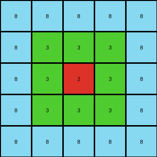
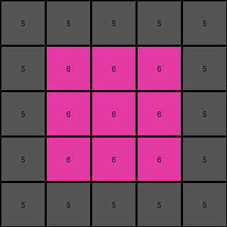

# eb5a1d5d • 003 • refine_dreamer

---


Previous Code:
```python
"""
The transformation extracts the innermost colored rectangle from the input and reduces the colored region to one pixel. The border of the output is the outermost color of the input.
"""

import numpy as np

def find_innermost_rectangle(grid):
    """Finds the innermost rectangle's color and its surrounding rectangle's color."""
    rows, cols = grid.shape
    outermost_color = grid[0, 0]
    innermost_color = None
    surrounding_color = None

    for r in range(rows):
        for c in range(cols):
            if grid[r, c] != outermost_color:
                surrounding_color = grid[r,c]
                break
        if surrounding_color is not None:
             break

    for r in range(rows):
      for c in range(cols):
        if grid[r,c] != outermost_color and grid[r,c] != surrounding_color:
          innermost_color = grid[r,c]
          return innermost_color, surrounding_color, outermost_color

    return innermost_color, surrounding_color, outermost_color
    

def transform(input_grid):
    """Transforms the input grid to the output grid based on the nested rectangles."""

    # Find the innermost and surrounding rectangle colors
    innermost_color, surrounding_color, outermost_color = find_innermost_rectangle(np.array(input_grid))

    # Initialize the output grid (5x5) with the outermost color
    output_grid = np.full((5, 5), outermost_color)

    # Set the center pixel to the innermost color
    if innermost_color != None:
      output_grid[2, 2] = innermost_color

    # set the other pixels to the surrounding color
    if surrounding_color != None:
      for i in range(1,4):
        for j in range(1,4):
          if output_grid[i,j] == outermost_color:
            output_grid[i,j] = surrounding_color

    return output_grid.tolist()
```

Train Set Results:

## Example 1:

Input:
```
8 8 8 8 8 8 8 8 8 8 8 8 8 8 8 8 8 8 8 8 8 8 8 8 8 8 8
8 8 8 8 8 8 8 8 8 8 8 8 8 8 8 8 8 8 8 8 8 8 8 8 8 8 8
8 8 8 3 3 3 3 3 3 3 3 3 3 3 3 3 3 3 3 3 3 8 8 8 8 8 8
8 8 8 3 3 3 3 3 3 3 3 3 3 3 3 3 3 3 3 3 3 8 8 8 8 8 8
8 8 8 3 3 3 3 3 3 3 3 3 3 3 3 3 3 3 3 3 3 8 8 8 8 8 8
8 8 8 3 3 3 3 3 3 3 3 3 3 3 3 3 3 3 3 3 3 8 8 8 8 8 8
8 8 8 3 3 3 3 3 3 3 3 3 3 3 3 3 3 3 3 3 3 8 8 8 8 8 8
8 8 8 3 3 3 3 3 3 3 3 3 3 3 3 3 3 3 3 3 3 8 8 8 8 8 8
8 8 8 3 3 3 3 3 3 3 3 3 3 3 3 3 3 3 3 3 3 8 8 8 8 8 8
8 8 8 3 3 3 2 2 2 2 2 2 3 3 3 3 3 3 3 3 3 8 8 8 8 8 8
8 8 8 3 3 3 2 2 2 2 2 2 3 3 3 3 3 3 3 3 3 8 8 8 8 8 8
8 8 8 3 3 3 2 2 2 2 2 2 3 3 3 3 3 3 3 3 3 8 8 8 8 8 8
8 8 8 3 3 3 2 2 2 2 2 2 3 3 3 3 3 3 3 3 3 8 8 8 8 8 8
8 8 8 3 3 3 2 2 2 2 2 2 3 3 3 3 3 3 3 3 3 8 8 8 8 8 8
8 8 8 3 3 3 2 2 2 2 2 2 3 3 3 3 3 3 3 3 3 8 8 8 8 8 8
8 8 8 3 3 3 3 3 3 3 3 3 3 3 3 3 3 3 3 3 3 8 8 8 8 8 8
8 8 8 3 3 3 3 3 3 3 3 3 3 3 3 3 3 3 3 3 3 8 8 8 8 8 8
8 8 8 3 3 3 3 3 3 3 3 3 3 3 3 3 3 3 3 3 3 8 8 8 8 8 8
8 8 8 8 8 8 8 8 8 8 8 8 8 8 8 8 8 8 8 8 8 8 8 8 8 8 8
8 8 8 8 8 8 8 8 8 8 8 8 8 8 8 8 8 8 8 8 8 8 8 8 8 8 8
8 8 8 8 8 8 8 8 8 8 8 8 8 8 8 8 8 8 8 8 8 8 8 8 8 8 8
8 8 8 8 8 8 8 8 8 8 8 8 8 8 8 8 8 8 8 8 8 8 8 8 8 8 8
8 8 8 8 8 8 8 8 8 8 8 8 8 8 8 8 8 8 8 8 8 8 8 8 8 8 8
```
Expected Output:
```
8 8 8 8 8
8 3 3 3 8
8 3 2 3 8
8 3 3 3 8
8 8 8 8 8
```
Transformed Output:
```
8 8 8 8 8
8 3 3 3 8
8 3 2 3 8
8 3 3 3 8
8 8 8 8 8
```

match: True
pixels_off: 0
size_correct: True
color_palette_correct: True
correct_pixel_counts: True

## Example 2:

Input:
```
5 5 5 5 5 5 5 5 5 5 5 5 5 5 5 5 5 5 5 5 5 5 5 5 5
5 5 5 5 5 5 5 5 5 5 5 5 5 5 5 5 5 5 5 5 5 5 5 5 5
5 5 5 5 5 5 5 5 5 5 5 5 5 5 5 5 5 5 5 5 5 5 5 5 5
5 5 5 5 6 6 6 6 6 6 6 6 6 6 6 6 6 6 6 5 5 5 5 5 5
5 5 5 5 6 6 6 6 6 6 6 6 6 6 6 6 6 6 6 5 5 5 5 5 5
5 5 5 5 6 6 6 6 6 6 6 6 6 6 6 6 6 6 6 5 5 5 5 5 5
5 5 5 5 6 6 6 6 6 6 6 6 6 6 6 6 6 6 6 5 5 5 5 5 5
5 5 5 5 6 6 6 6 6 6 6 6 6 6 6 6 6 6 6 5 5 5 5 5 5
5 5 5 5 6 6 6 6 6 6 6 6 6 6 6 6 6 6 6 5 5 5 5 5 5
5 5 5 5 6 6 6 6 6 6 6 6 6 6 6 6 6 6 6 5 5 5 5 5 5
5 5 5 5 6 6 6 6 6 6 6 6 6 6 6 6 6 6 6 5 5 5 5 5 5
5 5 5 5 6 6 6 6 6 6 6 6 6 6 6 6 6 6 6 5 5 5 5 5 5
5 5 5 5 6 6 6 6 6 6 6 6 6 6 6 6 6 6 6 5 5 5 5 5 5
5 5 5 5 6 6 6 6 6 6 6 6 6 6 6 6 6 6 6 5 5 5 5 5 5
5 5 5 5 6 6 6 6 6 6 6 6 6 6 6 6 6 6 6 5 5 5 5 5 5
5 5 5 5 6 6 6 6 6 6 6 6 6 6 6 6 6 6 6 5 5 5 5 5 5
5 5 5 5 5 5 5 5 5 5 5 5 5 5 5 5 5 5 5 5 5 5 5 5 5
5 5 5 5 5 5 5 5 5 5 5 5 5 5 5 5 5 5 5 5 5 5 5 5 5
5 5 5 5 5 5 5 5 5 5 5 5 5 5 5 5 5 5 5 5 5 5 5 5 5
5 5 5 5 5 5 5 5 5 5 5 5 5 5 5 5 5 5 5 5 5 5 5 5 5
5 5 5 5 5 5 5 5 5 5 5 5 5 5 5 5 5 5 5 5 5 5 5 5 5
5 5 5 5 5 5 5 5 5 5 5 5 5 5 5 5 5 5 5 5 5 5 5 5 5
```
Expected Output:
```
5 5 5
5 6 5
5 5 5
```
Transformed Output:
```
5 5 5 5 5
5 6 6 6 5
5 6 6 6 5
5 6 6 6 5
5 5 5 5 5
```

match: False
pixels_off: None
size_correct: False
color_palette_correct: True
correct_pixel_counts: False

## Example 3:

Input:
```
3 3 3 3 3 3 3 3 3 3 3 3 3 3 3 3 3 3 3 3 3 3
3 3 3 3 3 3 3 3 3 3 3 3 3 3 3 3 3 3 3 3 3 3
3 3 3 3 3 3 3 3 3 3 3 3 3 3 3 3 3 3 3 3 3 3
3 3 3 8 8 8 8 8 8 8 8 8 8 8 8 8 8 3 3 3 3 3
3 3 3 8 8 8 8 8 8 8 8 8 8 8 8 8 8 3 3 3 3 3
3 3 3 8 8 2 2 2 2 2 2 2 2 2 8 8 8 3 3 3 3 3
3 3 3 8 8 2 2 2 1 1 1 1 1 2 8 8 8 3 3 3 3 3
3 3 3 8 8 2 2 2 1 1 1 1 1 2 8 8 8 3 3 3 3 3
3 3 3 8 8 2 2 2 1 1 1 1 1 2 8 8 8 3 3 3 3 3
3 3 3 8 8 2 2 2 2 2 2 2 2 2 8 8 8 3 3 3 3 3
3 3 3 8 8 2 2 2 2 2 2 2 2 2 8 8 8 3 3 3 3 3
3 3 3 8 8 2 2 2 2 2 2 2 2 2 8 8 8 3 3 3 3 3
3 3 3 8 8 2 2 2 2 2 2 2 2 2 8 8 8 3 3 3 3 3
3 3 3 8 8 2 2 2 2 2 2 2 2 2 8 8 8 3 3 3 3 3
3 3 3 8 8 8 8 8 8 8 8 8 8 8 8 8 8 3 3 3 3 3
3 3 3 8 8 8 8 8 8 8 8 8 8 8 8 8 8 3 3 3 3 3
3 3 3 8 8 8 8 8 8 8 8 8 8 8 8 8 8 3 3 3 3 3
3 3 3 3 3 3 3 3 3 3 3 3 3 3 3 3 3 3 3 3 3 3
3 3 3 3 3 3 3 3 3 3 3 3 3 3 3 3 3 3 3 3 3 3
3 3 3 3 3 3 3 3 3 3 3 3 3 3 3 3 3 3 3 3 3 3
3 3 3 3 3 3 3 3 3 3 3 3 3 3 3 3 3 3 3 3 3 3
```
Expected Output:
```
3 3 3 3 3 3 3
3 8 8 8 8 8 3
3 8 2 2 2 8 3
3 8 2 1 2 8 3
3 8 2 2 2 8 3
3 8 8 8 8 8 3
3 3 3 3 3 3 3
```
Transformed Output:
```
3 3 3 3 3
3 8 8 8 3
3 8 2 8 3
3 8 8 8 3
3 3 3 3 3
```

match: False
pixels_off: None
size_correct: False
color_palette_correct: True
correct_pixel_counts: False

**INSTRUCTIONS**

The code above was generated based on observations from the first training
example

we have tested the transform function on each of the task example inputs and
compared with the expected output

review each of the examples provided and the results and consider how the
natural language program should be updated to accommodate this new knowledge

respond with the following deliverables:

- general assessment of the information provided and strategy for resolving the
  errors
- gather metrics about each of the examples and results - use code_execution to
  develop accurate reports on your assumptions
- a YAML block documenting facts - Focus on identifying objects, their properties, and the actions performed on them.
- a natural language program - Be as clear and concise as possible, providing a complete description of the transformation rule.


your responses should be considered as information in a report - not a
conversation
