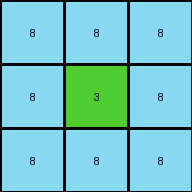
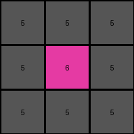
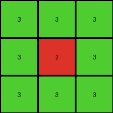

# eb5a1d5d • 009 • refine_dreamer

---

Previous Code:
```python
"""
Reduces a large grid to a 3x3 representation. The center pixel of the output represents the color of the inner, centered region of the input, and the output border has the same color as the input border.
"""

import numpy as np

def get_border_color(grid):
    # Return color of the top-left pixel.  Assumes a filled rectangle.
    return grid[0, 0]

def get_center_color(grid):
    # find the center of the grid
    center_y = grid.shape[0] // 2
    center_x = grid.shape[1] // 2

    # start from the center and search outward for first different color

    color = grid[center_y, center_x]
    
    return color

def transform(input_grid):
    # Get the border color.
    border_color = get_border_color(input_grid)

    # Get the center color.
    center_color = get_center_color(input_grid)

    # Create a 3x3 output grid filled with the border color.
    output_grid = np.full((3, 3), border_color, dtype=int)

    # Set the center pixel of the output grid to the center color.
    output_grid[1, 1] = center_color

    return output_grid
```

Train Set Results:

## Example 1:

Input:
```
8 8 8 8 8 8 8 8 8 8 8 8 8 8 8 8 8 8 8 8 8 8 8 8 8 8 8
8 8 8 8 8 8 8 8 8 8 8 8 8 8 8 8 8 8 8 8 8 8 8 8 8 8 8
8 8 8 3 3 3 3 3 3 3 3 3 3 3 3 3 3 3 3 3 3 8 8 8 8 8 8
8 8 8 3 3 3 3 3 3 3 3 3 3 3 3 3 3 3 3 3 3 8 8 8 8 8 8
8 8 8 3 3 3 3 3 3 3 3 3 3 3 3 3 3 3 3 3 3 8 8 8 8 8 8
8 8 8 3 3 3 3 3 3 3 3 3 3 3 3 3 3 3 3 3 3 8 8 8 8 8 8
8 8 8 3 3 3 3 3 3 3 3 3 3 3 3 3 3 3 3 3 3 8 8 8 8 8 8
8 8 8 3 3 3 3 3 3 3 3 3 3 3 3 3 3 3 3 3 3 8 8 8 8 8 8
8 8 8 3 3 3 3 3 3 3 3 3 3 3 3 3 3 3 3 3 3 8 8 8 8 8 8
8 8 8 3 3 3 2 2 2 2 2 2 3 3 3 3 3 3 3 3 3 8 8 8 8 8 8
8 8 8 3 3 3 2 2 2 2 2 2 3 3 3 3 3 3 3 3 3 8 8 8 8 8 8
8 8 8 3 3 3 2 2 2 2 2 2 3 3 3 3 3 3 3 3 3 8 8 8 8 8 8
8 8 8 3 3 3 2 2 2 2 2 2 3 3 3 3 3 3 3 3 3 8 8 8 8 8 8
8 8 8 3 3 3 2 2 2 2 2 2 3 3 3 3 3 3 3 3 3 8 8 8 8 8 8
8 8 8 3 3 3 2 2 2 2 2 2 3 3 3 3 3 3 3 3 3 8 8 8 8 8 8
8 8 8 3 3 3 3 3 3 3 3 3 3 3 3 3 3 3 3 3 3 8 8 8 8 8 8
8 8 8 3 3 3 3 3 3 3 3 3 3 3 3 3 3 3 3 3 3 8 8 8 8 8 8
8 8 8 3 3 3 3 3 3 3 3 3 3 3 3 3 3 3 3 3 3 8 8 8 8 8 8
8 8 8 8 8 8 8 8 8 8 8 8 8 8 8 8 8 8 8 8 8 8 8 8 8 8 8
8 8 8 8 8 8 8 8 8 8 8 8 8 8 8 8 8 8 8 8 8 8 8 8 8 8 8
8 8 8 8 8 8 8 8 8 8 8 8 8 8 8 8 8 8 8 8 8 8 8 8 8 8 8
8 8 8 8 8 8 8 8 8 8 8 8 8 8 8 8 8 8 8 8 8 8 8 8 8 8 8
8 8 8 8 8 8 8 8 8 8 8 8 8 8 8 8 8 8 8 8 8 8 8 8 8 8 8
```
Expected Output:
```
8 8 8 8 8
8 3 3 3 8
8 3 2 3 8
8 3 3 3 8
8 8 8 8 8
```
Transformed Output:
```
8 8 8
8 3 8
8 8 8
```

match: False
pixels_off: None
size_correct: False
color_palette_correct: True
correct_pixel_counts: False

## Example 2:

Input:
```
5 5 5 5 5 5 5 5 5 5 5 5 5 5 5 5 5 5 5 5 5 5 5 5 5
5 5 5 5 5 5 5 5 5 5 5 5 5 5 5 5 5 5 5 5 5 5 5 5 5
5 5 5 5 5 5 5 5 5 5 5 5 5 5 5 5 5 5 5 5 5 5 5 5 5
5 5 5 5 6 6 6 6 6 6 6 6 6 6 6 6 6 6 6 5 5 5 5 5 5
5 5 5 5 6 6 6 6 6 6 6 6 6 6 6 6 6 6 6 5 5 5 5 5 5
5 5 5 5 6 6 6 6 6 6 6 6 6 6 6 6 6 6 6 5 5 5 5 5 5
5 5 5 5 6 6 6 6 6 6 6 6 6 6 6 6 6 6 6 5 5 5 5 5 5
5 5 5 5 6 6 6 6 6 6 6 6 6 6 6 6 6 6 6 5 5 5 5 5 5
5 5 5 5 6 6 6 6 6 6 6 6 6 6 6 6 6 6 6 5 5 5 5 5 5
5 5 5 5 6 6 6 6 6 6 6 6 6 6 6 6 6 6 6 5 5 5 5 5 5
5 5 5 5 6 6 6 6 6 6 6 6 6 6 6 6 6 6 6 5 5 5 5 5 5
5 5 5 5 6 6 6 6 6 6 6 6 6 6 6 6 6 6 6 5 5 5 5 5 5
5 5 5 5 6 6 6 6 6 6 6 6 6 6 6 6 6 6 6 5 5 5 5 5 5
5 5 5 5 6 6 6 6 6 6 6 6 6 6 6 6 6 6 6 5 5 5 5 5 5
5 5 5 5 6 6 6 6 6 6 6 6 6 6 6 6 6 6 6 5 5 5 5 5 5
5 5 5 5 6 6 6 6 6 6 6 6 6 6 6 6 6 6 6 5 5 5 5 5 5
5 5 5 5 5 5 5 5 5 5 5 5 5 5 5 5 5 5 5 5 5 5 5 5 5
5 5 5 5 5 5 5 5 5 5 5 5 5 5 5 5 5 5 5 5 5 5 5 5 5
5 5 5 5 5 5 5 5 5 5 5 5 5 5 5 5 5 5 5 5 5 5 5 5 5
5 5 5 5 5 5 5 5 5 5 5 5 5 5 5 5 5 5 5 5 5 5 5 5 5
5 5 5 5 5 5 5 5 5 5 5 5 5 5 5 5 5 5 5 5 5 5 5 5 5
5 5 5 5 5 5 5 5 5 5 5 5 5 5 5 5 5 5 5 5 5 5 5 5 5
```
Expected Output:
```
5 5 5
5 6 5
5 5 5
```
Transformed Output:
```
5 5 5
5 6 5
5 5 5
```

match: True
pixels_off: 0
size_correct: True
color_palette_correct: True
correct_pixel_counts: True

## Example 3:

Input:
```
3 3 3 3 3 3 3 3 3 3 3 3 3 3 3 3 3 3 3 3 3 3
3 3 3 3 3 3 3 3 3 3 3 3 3 3 3 3 3 3 3 3 3 3
3 3 3 3 3 3 3 3 3 3 3 3 3 3 3 3 3 3 3 3 3 3
3 3 3 8 8 8 8 8 8 8 8 8 8 8 8 8 8 3 3 3 3 3
3 3 3 8 8 8 8 8 8 8 8 8 8 8 8 8 8 3 3 3 3 3
3 3 3 8 8 2 2 2 2 2 2 2 2 2 8 8 8 3 3 3 3 3
3 3 3 8 8 2 2 2 1 1 1 1 1 2 8 8 8 3 3 3 3 3
3 3 3 8 8 2 2 2 1 1 1 1 1 2 8 8 8 3 3 3 3 3
3 3 3 8 8 2 2 2 1 1 1 1 1 2 8 8 8 3 3 3 3 3
3 3 3 8 8 2 2 2 2 2 2 2 2 2 8 8 8 3 3 3 3 3
3 3 3 8 8 2 2 2 2 2 2 2 2 2 8 8 8 3 3 3 3 3
3 3 3 8 8 2 2 2 2 2 2 2 2 2 8 8 8 3 3 3 3 3
3 3 3 8 8 2 2 2 2 2 2 2 2 2 8 8 8 3 3 3 3 3
3 3 3 8 8 2 2 2 2 2 2 2 2 2 8 8 8 3 3 3 3 3
3 3 3 8 8 8 8 8 8 8 8 8 8 8 8 8 8 3 3 3 3 3
3 3 3 8 8 8 8 8 8 8 8 8 8 8 8 8 8 3 3 3 3 3
3 3 3 8 8 8 8 8 8 8 8 8 8 8 8 8 8 3 3 3 3 3
3 3 3 3 3 3 3 3 3 3 3 3 3 3 3 3 3 3 3 3 3 3
3 3 3 3 3 3 3 3 3 3 3 3 3 3 3 3 3 3 3 3 3 3
3 3 3 3 3 3 3 3 3 3 3 3 3 3 3 3 3 3 3 3 3 3
3 3 3 3 3 3 3 3 3 3 3 3 3 3 3 3 3 3 3 3 3 3
```
Expected Output:
```
3 3 3 3 3 3 3
3 8 8 8 8 8 3
3 8 2 2 2 8 3
3 8 2 1 2 8 3
3 8 2 2 2 8 3
3 8 8 8 8 8 3
3 3 3 3 3 3 3
```
Transformed Output:
```
3 3 3
3 2 3
3 3 3
```

match: False
pixels_off: None
size_correct: False
color_palette_correct: True
correct_pixel_counts: False
**INSTRUCTIONS**

The code above was generated based on observations from the first training
example

we have tested the transform function on each of the task example inputs and
compared with the expected output

review each of the examples provided and the results and consider how the
natural language program should be updated to accommodate this new knowledge

respond with the following deliverables:

- general assessment of the information provided and strategy for resolving the
  errors
- gather metrics about each of the examples and results - use code_execution to
  develop accurate reports on your assumptions
- a YAML block documenting facts - Focus on identifying objects, their properties, and the actions performed on them.
- a natural language program - Be as clear and concise as possible, providing a complete description of the transformation rule.


your responses should be considered as information in a report - not a
conversation
