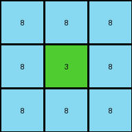

# eb5a1d5d • 010 • refine_coder

---

Previous Code:
```python
"""
Reduces a large grid to a 3x3 representation. The center pixel of the output represents the color of the inner, centered region of the input, and the output border has the same color as the input border.
"""

import numpy as np

def get_border_color(grid):
    # Return color of the top-left pixel.  Assumes a filled rectangle.
    return grid[0, 0]

def get_center_color(grid):
    # find the center of the grid
    center_y = grid.shape[0] // 2
    center_x = grid.shape[1] // 2

    # start from the center and search outward for first different color

    color = grid[center_y, center_x]
    
    return color

def transform(input_grid):
    # Get the border color.
    border_color = get_border_color(input_grid)

    # Get the center color.
    center_color = get_center_color(input_grid)

    # Create a 3x3 output grid filled with the border color.
    output_grid = np.full((3, 3), border_color, dtype=int)

    # Set the center pixel of the output grid to the center color.
    output_grid[1, 1] = center_color

    return output_grid
```

Train Set Results:

## Example 1:

Input:
```
8 8 8 8 8 8 8 8 8 8 8 8 8 8 8 8 8 8 8 8 8 8 8 8 8 8 8
8 8 8 8 8 8 8 8 8 8 8 8 8 8 8 8 8 8 8 8 8 8 8 8 8 8 8
8 8 8 3 3 3 3 3 3 3 3 3 3 3 3 3 3 3 3 3 3 8 8 8 8 8 8
8 8 8 3 3 3 3 3 3 3 3 3 3 3 3 3 3 3 3 3 3 8 8 8 8 8 8
8 8 8 3 3 3 3 3 3 3 3 3 3 3 3 3 3 3 3 3 3 8 8 8 8 8 8
8 8 8 3 3 3 3 3 3 3 3 3 3 3 3 3 3 3 3 3 3 8 8 8 8 8 8
8 8 8 3 3 3 3 3 3 3 3 3 3 3 3 3 3 3 3 3 3 8 8 8 8 8 8
8 8 8 3 3 3 3 3 3 3 3 3 3 3 3 3 3 3 3 3 3 8 8 8 8 8 8
8 8 8 3 3 3 3 3 3 3 3 3 3 3 3 3 3 3 3 3 3 8 8 8 8 8 8
8 8 8 3 3 3 2 2 2 2 2 2 3 3 3 3 3 3 3 3 3 8 8 8 8 8 8
8 8 8 3 3 3 2 2 2 2 2 2 3 3 3 3 3 3 3 3 3 8 8 8 8 8 8
8 8 8 3 3 3 2 2 2 2 2 2 3 3 3 3 3 3 3 3 3 8 8 8 8 8 8
8 8 8 3 3 3 2 2 2 2 2 2 3 3 3 3 3 3 3 3 3 8 8 8 8 8 8
8 8 8 3 3 3 2 2 2 2 2 2 3 3 3 3 3 3 3 3 3 8 8 8 8 8 8
8 8 8 3 3 3 2 2 2 2 2 2 3 3 3 3 3 3 3 3 3 8 8 8 8 8 8
8 8 8 3 3 3 3 3 3 3 3 3 3 3 3 3 3 3 3 3 3 8 8 8 8 8 8
8 8 8 3 3 3 3 3 3 3 3 3 3 3 3 3 3 3 3 3 3 8 8 8 8 8 8
8 8 8 3 3 3 3 3 3 3 3 3 3 3 3 3 3 3 3 3 3 8 8 8 8 8 8
8 8 8 8 8 8 8 8 8 8 8 8 8 8 8 8 8 8 8 8 8 8 8 8 8 8 8
8 8 8 8 8 8 8 8 8 8 8 8 8 8 8 8 8 8 8 8 8 8 8 8 8 8 8
8 8 8 8 8 8 8 8 8 8 8 8 8 8 8 8 8 8 8 8 8 8 8 8 8 8 8
8 8 8 8 8 8 8 8 8 8 8 8 8 8 8 8 8 8 8 8 8 8 8 8 8 8 8
8 8 8 8 8 8 8 8 8 8 8 8 8 8 8 8 8 8 8 8 8 8 8 8 8 8 8
```
Expected Output:
```
8 8 8 8 8
8 3 3 3 8
8 3 2 3 8
8 3 3 3 8
8 8 8 8 8
```
Transformed Output:
```
8 8 8
8 3 8
8 8 8
```

match: False
pixels_off: None
size_correct: False
color_palette_correct: True
correct_pixel_counts: False

## Example 2:

Input:
```
5 5 5 5 5 5 5 5 5 5 5 5 5 5 5 5 5 5 5 5 5 5 5 5 5
5 5 5 5 5 5 5 5 5 5 5 5 5 5 5 5 5 5 5 5 5 5 5 5 5
5 5 5 5 5 5 5 5 5 5 5 5 5 5 5 5 5 5 5 5 5 5 5 5 5
5 5 5 5 6 6 6 6 6 6 6 6 6 6 6 6 6 6 6 5 5 5 5 5 5
5 5 5 5 6 6 6 6 6 6 6 6 6 6 6 6 6 6 6 5 5 5 5 5 5
5 5 5 5 6 6 6 6 6 6 6 6 6 6 6 6 6 6 6 5 5 5 5 5 5
5 5 5 5 6 6 6 6 6 6 6 6 6 6 6 6 6 6 6 5 5 5 5 5 5
5 5 5 5 6 6 6 6 6 6 6 6 6 6 6 6 6 6 6 5 5 5 5 5 5
5 5 5 5 6 6 6 6 6 6 6 6 6 6 6 6 6 6 6 5 5 5 5 5 5
5 5 5 5 6 6 6 6 6 6 6 6 6 6 6 6 6 6 6 5 5 5 5 5 5
5 5 5 5 6 6 6 6 6 6 6 6 6 6 6 6 6 6 6 5 5 5 5 5 5
5 5 5 5 6 6 6 6 6 6 6 6 6 6 6 6 6 6 6 5 5 5 5 5 5
5 5 5 5 6 6 6 6 6 6 6 6 6 6 6 6 6 6 6 5 5 5 5 5 5
5 5 5 5 6 6 6 6 6 6 6 6 6 6 6 6 6 6 6 5 5 5 5 5 5
5 5 5 5 6 6 6 6 6 6 6 6 6 6 6 6 6 6 6 5 5 5 5 5 5
5 5 5 5 6 6 6 6 6 6 6 6 6 6 6 6 6 6 6 5 5 5 5 5 5
5 5 5 5 5 5 5 5 5 5 5 5 5 5 5 5 5 5 5 5 5 5 5 5 5
5 5 5 5 5 5 5 5 5 5 5 5 5 5 5 5 5 5 5 5 5 5 5 5 5
5 5 5 5 5 5 5 5 5 5 5 5 5 5 5 5 5 5 5 5 5 5 5 5 5
5 5 5 5 5 5 5 5 5 5 5 5 5 5 5 5 5 5 5 5 5 5 5 5 5
5 5 5 5 5 5 5 5 5 5 5 5 5 5 5 5 5 5 5 5 5 5 5 5 5
5 5 5 5 5 5 5 5 5 5 5 5 5 5 5 5 5 5 5 5 5 5 5 5 5
```
Expected Output:
```
5 5 5
5 6 5
5 5 5
```
Transformed Output:
```
5 5 5
5 6 5
5 5 5
```

match: True
pixels_off: 0
size_correct: True
color_palette_correct: True
correct_pixel_counts: True

## Example 3:

Input:
```
3 3 3 3 3 3 3 3 3 3 3 3 3 3 3 3 3 3 3 3 3 3
3 3 3 3 3 3 3 3 3 3 3 3 3 3 3 3 3 3 3 3 3 3
3 3 3 3 3 3 3 3 3 3 3 3 3 3 3 3 3 3 3 3 3 3
3 3 3 8 8 8 8 8 8 8 8 8 8 8 8 8 8 3 3 3 3 3
3 3 3 8 8 8 8 8 8 8 8 8 8 8 8 8 8 3 3 3 3 3
3 3 3 8 8 2 2 2 2 2 2 2 2 2 8 8 8 3 3 3 3 3
3 3 3 8 8 2 2 2 1 1 1 1 1 2 8 8 8 3 3 3 3 3
3 3 3 8 8 2 2 2 1 1 1 1 1 2 8 8 8 3 3 3 3 3
3 3 3 8 8 2 2 2 1 1 1 1 1 2 8 8 8 3 3 3 3 3
3 3 3 8 8 2 2 2 2 2 2 2 2 2 8 8 8 3 3 3 3 3
3 3 3 8 8 2 2 2 2 2 2 2 2 2 8 8 8 3 3 3 3 3
3 3 3 8 8 2 2 2 2 2 2 2 2 2 8 8 8 3 3 3 3 3
3 3 3 8 8 2 2 2 2 2 2 2 2 2 8 8 8 3 3 3 3 3
3 3 3 8 8 2 2 2 2 2 2 2 2 2 8 8 8 3 3 3 3 3
3 3 3 8 8 8 8 8 8 8 8 8 8 8 8 8 8 3 3 3 3 3
3 3 3 8 8 8 8 8 8 8 8 8 8 8 8 8 8 3 3 3 3 3
3 3 3 8 8 8 8 8 8 8 8 8 8 8 8 8 8 3 3 3 3 3
3 3 3 3 3 3 3 3 3 3 3 3 3 3 3 3 3 3 3 3 3 3
3 3 3 3 3 3 3 3 3 3 3 3 3 3 3 3 3 3 3 3 3 3
3 3 3 3 3 3 3 3 3 3 3 3 3 3 3 3 3 3 3 3 3 3
3 3 3 3 3 3 3 3 3 3 3 3 3 3 3 3 3 3 3 3 3 3
```
Expected Output:
```
3 3 3 3 3 3 3
3 8 8 8 8 8 3
3 8 2 2 2 8 3
3 8 2 1 2 8 3
3 8 2 2 2 8 3
3 8 8 8 8 8 3
3 3 3 3 3 3 3
```
Transformed Output:
```
3 3 3
3 2 3
3 3 3
```

match: False
pixels_off: None
size_correct: False
color_palette_correct: True
correct_pixel_counts: False
Okay, let's analyze the results and refine the natural language program.

**General Assessment:**

The initial code was too simplistic. It correctly identified the border color and the color of the center pixel but failed to capture the more complex pattern of expanding the central region into a 3x3 representation while maintaining relative positioning. The first and third examples highlight the need to consider more than just the single center pixel; we need to represent the central *region*. The first example shows a green inner block with a smaller, red, central block. The current code missed this detail in the red center. Example 3 includes 3 layers.

**Strategy:**

1.  **Refine Center Identification:** Instead of just the single center pixel, identify the boundaries of the innermost distinct colored region.
2.  **3x3 or larger Output**: The code assumed 3x3 output. The examples show that may not be correct. Capture dimensions.
3. **Relative Positioning** Inner blocks are represented in output, centered.

**Metrics and Observations:**

Here's a breakdown of each example, focusing on object properties and actions.

**Example 1:**

*   **Input:** 27x23 grid. Border: azure (8). Inner region: green (3). Center region: red (2).
*   **Expected Output:** 7x5 grid. Border: azure (8). Matches inner dimensions. Inner fill: green (3) Centered: red (2)
*   **Actual Output:** 3x3. Border: azure (8). Center: green(3).
* **Mismatch**: Size and center color are wrong. Missed the central red region

**Example 2:**

*   **Input:** 25x23 grid. Border: gray (5). Center region: magenta (6).
*   **Expected Output:** 3x3 grid. Border: gray (5). Center: magenta (6).
*   **Actual Output:** 3x3 grid. Border: gray (5). Center: magenta (6).
*   **Match:** Correct.

**Example 3:**

*   **Input:** 22x21 grid. Border: green (3). Inner region: azure (8). Center Region: red (2) with very center: blue (1).
*   **Expected Output:** 7x7. Border: green. Inner: azure, then red, then centered blue.
*   **Actual Output:** 3x3 grid. Border: green (3). Center: red (2)
* **Mismatch**: Size and center is incomplete.

**YAML Facts:**

```yaml
examples:
  - id: 1
    input:
      dimensions: [27, 23]
      border_color: 8
      inner_region_color: 3
      center_region_color: 2
    output:
      dimensions: [7,5]
      border_color: 8
      inner_fill_color: 3
      center_color: 2
    match: False
  - id: 2
    input:
      dimensions: [25, 23]
      border_color: 5
      center_region_color: 6
    output:
      dimensions: [3, 3]
      border_color: 5
      center_color: 6
    match: True
  - id: 3
    input:
      dimensions: [22, 21]
      border_color: 3
      inner_region_color: 8
      center_region_color: 2
      center_color: 1
    output:
      dimensions: [7,7]
      border_color: 3
      inner_fill_color: 8
      next_fill_color: 2
      center_color: 1
    match: False

```

**Natural Language Program:**

1.  **Identify the Border:** Find the color of the outermost layer of the input grid. This will be the border color of the output grid.
2.  **Identify central nested regions:** Find the color, height, and width of all regions within other regions, starting from the border.
3. **Determine output size:** Output grid height and width will match inner dimensions if they are odd, or be one greater if even.
4. **Build Output:** Create an output based on dimensions. Fill outer layer with border color.
5.  **Represent Inner Region:** Represent each inner region. Centered.


**INSTRUCTIONS**

- generate a Python module to represent the natural language program 
- follow the template below
- all common math and science libraries are available
- create docstring only at top - but comment the workflow in the function
- use helper functions for common operations like finding objects, counting,
  measuring, moving, etc. 

remember - we are working iteratively - so this code will inform your future
self as we converge on the solution

*template:*

```python
"""
{{ natural language description of the transformation rule }}
"""

{{ imports }}

def transform(input_grid):
    # initialize output_grid

    # change output pixels 

    return output_grid

```
