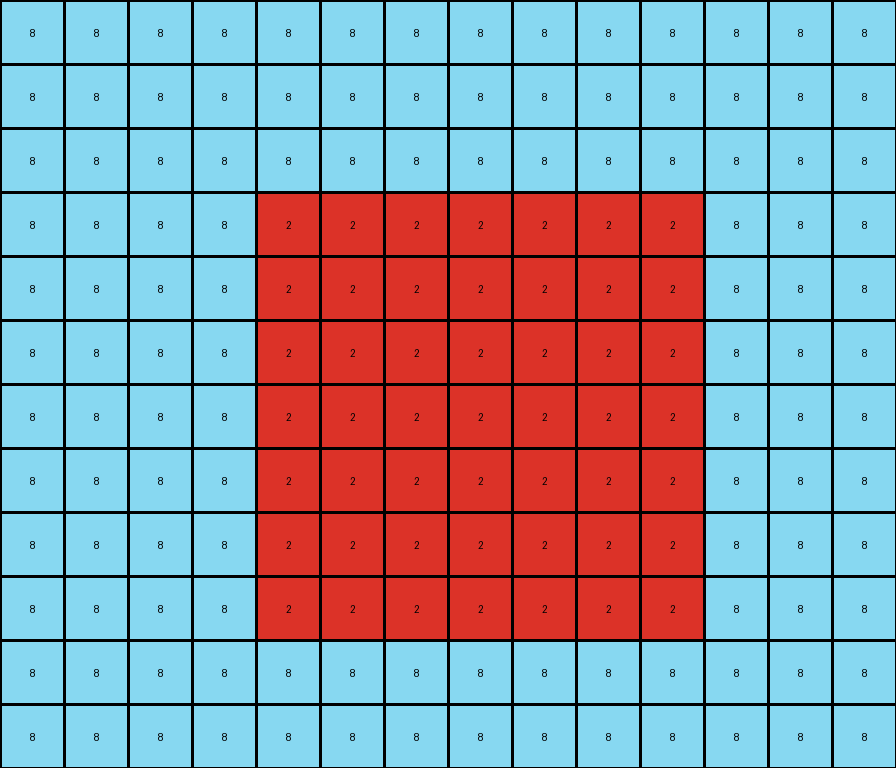

# eb5a1d5d • 011 • refine_dreamer

---

Previous Code:
```python
"""
Reduces a large grid to a smaller representation. The output represents the colors of the nested regions of the input, maintaining their relative positioning and centered.
"""

import numpy as np

def get_border_color(grid):
    # Return color of the top-left pixel.  Assumes a filled rectangle.
    return grid[0, 0]

def find_nested_regions(grid):
    """
    Finds the nested regions within the grid, starting from the border.
    Returns a list of dictionaries, each containing the color, height, and width of a region.
    """
    regions = []
    current_grid = grid
    while True:
        border_color = get_border_color(current_grid)
        height, width = current_grid.shape
        regions.append({'color': border_color, 'height': height, 'width': width})

        # Find the inner region by checking for a different color
        inner_grid = None
        for i in range(1, height - 1):
            for j in range(1, width - 1):
                if current_grid[i, j] != border_color:
                    # Extract the inner grid
                    inner_grid = current_grid[i:, j:]

                    #find end of different colors
                    end_i = 0
                    while i + end_i < height and inner_grid[end_i,0] == inner_grid[0,0]:
                        end_i += 1
                    end_j = 0
                    while j + end_j < width and inner_grid[0,end_j] == inner_grid[0,0]:
                        end_j += 1                   
                    inner_grid = inner_grid[:end_i, :end_j]
                    break
            if inner_grid is not None:
                break
        
        if inner_grid is None:
          break
        else:
            current_grid = inner_grid


    return regions

def transform(input_grid):
    # Identify nested regions.
    regions = find_nested_regions(input_grid)

    # Determine output size.
    outer_region = regions[0]
    output_height = outer_region['height']
    output_width = outer_region['width']
    if output_height % 2 == 0:
        output_height = output_height // 2 + (output_height // 2) % 2 + 1 # make odd and scale
    else:
        output_height = output_height // 2 + 1
    
    if output_width % 2 == 0:
      output_width = output_width // 2 + (output_width // 2) % 2 + 1 # make odd and scale
    else:
        output_width = output_width // 2 + 1
    
    # if len(regions) > 1:
    #     inner_region = regions[1]
    #     output_height = inner_region['height'] if inner_region['height'] %2 != 0 else inner_region['height'] + 1
    #     output_width = inner_region['width'] if inner_region['width'] % 2 != 0 else inner_region['width'] + 1
    # else: # single region
    #     output_height = 1
    #     output_width = 1

    # Create an output grid filled with the border color.
    output_grid = np.full((output_height, output_width), outer_region['color'], dtype=int)

    # fill in layers from center outward
    center_y = output_height // 2
    center_x = output_width // 2

    for i in range(len(regions) -1, -1, -1):
        region = regions[i]
        region_h = region['height']
        if region_h % 2 == 0:
            region_h +=1
        region_w = region['width']
        if region_w % 2 == 0:
            region_w += 1
        
        start_y = center_y - region_h // 2
        start_x = center_x - region_w // 2

        end_y = start_y + min(region_h, output_height) # prevent out of bounds
        end_x = start_x + min(region_w, output_width)

        output_grid[start_y:end_y, start_x:end_x] = region['color']


    return output_grid
```

Train Set Results:

## Example 1:

Input:
```
8 8 8 8 8 8 8 8 8 8 8 8 8 8 8 8 8 8 8 8 8 8 8 8 8 8 8
8 8 8 8 8 8 8 8 8 8 8 8 8 8 8 8 8 8 8 8 8 8 8 8 8 8 8
8 8 8 3 3 3 3 3 3 3 3 3 3 3 3 3 3 3 3 3 3 8 8 8 8 8 8
8 8 8 3 3 3 3 3 3 3 3 3 3 3 3 3 3 3 3 3 3 8 8 8 8 8 8
8 8 8 3 3 3 3 3 3 3 3 3 3 3 3 3 3 3 3 3 3 8 8 8 8 8 8
8 8 8 3 3 3 3 3 3 3 3 3 3 3 3 3 3 3 3 3 3 8 8 8 8 8 8
8 8 8 3 3 3 3 3 3 3 3 3 3 3 3 3 3 3 3 3 3 8 8 8 8 8 8
8 8 8 3 3 3 3 3 3 3 3 3 3 3 3 3 3 3 3 3 3 8 8 8 8 8 8
8 8 8 3 3 3 3 3 3 3 3 3 3 3 3 3 3 3 3 3 3 8 8 8 8 8 8
8 8 8 3 3 3 2 2 2 2 2 2 3 3 3 3 3 3 3 3 3 8 8 8 8 8 8
8 8 8 3 3 3 2 2 2 2 2 2 3 3 3 3 3 3 3 3 3 8 8 8 8 8 8
8 8 8 3 3 3 2 2 2 2 2 2 3 3 3 3 3 3 3 3 3 8 8 8 8 8 8
8 8 8 3 3 3 2 2 2 2 2 2 3 3 3 3 3 3 3 3 3 8 8 8 8 8 8
8 8 8 3 3 3 2 2 2 2 2 2 3 3 3 3 3 3 3 3 3 8 8 8 8 8 8
8 8 8 3 3 3 2 2 2 2 2 2 3 3 3 3 3 3 3 3 3 8 8 8 8 8 8
8 8 8 3 3 3 3 3 3 3 3 3 3 3 3 3 3 3 3 3 3 8 8 8 8 8 8
8 8 8 3 3 3 3 3 3 3 3 3 3 3 3 3 3 3 3 3 3 8 8 8 8 8 8
8 8 8 3 3 3 3 3 3 3 3 3 3 3 3 3 3 3 3 3 3 8 8 8 8 8 8
8 8 8 8 8 8 8 8 8 8 8 8 8 8 8 8 8 8 8 8 8 8 8 8 8 8 8
8 8 8 8 8 8 8 8 8 8 8 8 8 8 8 8 8 8 8 8 8 8 8 8 8 8 8
8 8 8 8 8 8 8 8 8 8 8 8 8 8 8 8 8 8 8 8 8 8 8 8 8 8 8
8 8 8 8 8 8 8 8 8 8 8 8 8 8 8 8 8 8 8 8 8 8 8 8 8 8 8
8 8 8 8 8 8 8 8 8 8 8 8 8 8 8 8 8 8 8 8 8 8 8 8 8 8 8
```
Expected Output:
```
8 8 8 8 8
8 3 3 3 8
8 3 2 3 8
8 3 3 3 8
8 8 8 8 8
```
Transformed Output:
```
8 8 8 8 8 8 8 8 8 8 8 8 8 8
8 8 8 8 8 8 8 8 8 8 8 8 8 8
8 8 8 8 8 8 8 8 8 8 8 8 8 8
8 8 8 8 2 2 2 2 2 2 2 8 8 8
8 8 8 8 2 2 2 2 2 2 2 8 8 8
8 8 8 8 2 2 2 2 2 2 2 8 8 8
8 8 8 8 2 2 2 2 2 2 2 8 8 8
8 8 8 8 2 2 2 2 2 2 2 8 8 8
8 8 8 8 2 2 2 2 2 2 2 8 8 8
8 8 8 8 2 2 2 2 2 2 2 8 8 8
8 8 8 8 8 8 8 8 8 8 8 8 8 8
8 8 8 8 8 8 8 8 8 8 8 8 8 8
```

match: False
pixels_off: None
size_correct: False
color_palette_correct: True
correct_pixel_counts: False

## Example 2:

Input:
```
5 5 5 5 5 5 5 5 5 5 5 5 5 5 5 5 5 5 5 5 5 5 5 5 5
5 5 5 5 5 5 5 5 5 5 5 5 5 5 5 5 5 5 5 5 5 5 5 5 5
5 5 5 5 5 5 5 5 5 5 5 5 5 5 5 5 5 5 5 5 5 5 5 5 5
5 5 5 5 6 6 6 6 6 6 6 6 6 6 6 6 6 6 6 5 5 5 5 5 5
5 5 5 5 6 6 6 6 6 6 6 6 6 6 6 6 6 6 6 5 5 5 5 5 5
5 5 5 5 6 6 6 6 6 6 6 6 6 6 6 6 6 6 6 5 5 5 5 5 5
5 5 5 5 6 6 6 6 6 6 6 6 6 6 6 6 6 6 6 5 5 5 5 5 5
5 5 5 5 6 6 6 6 6 6 6 6 6 6 6 6 6 6 6 5 5 5 5 5 5
5 5 5 5 6 6 6 6 6 6 6 6 6 6 6 6 6 6 6 5 5 5 5 5 5
5 5 5 5 6 6 6 6 6 6 6 6 6 6 6 6 6 6 6 5 5 5 5 5 5
5 5 5 5 6 6 6 6 6 6 6 6 6 6 6 6 6 6 6 5 5 5 5 5 5
5 5 5 5 6 6 6 6 6 6 6 6 6 6 6 6 6 6 6 5 5 5 5 5 5
5 5 5 5 6 6 6 6 6 6 6 6 6 6 6 6 6 6 6 5 5 5 5 5 5
5 5 5 5 6 6 6 6 6 6 6 6 6 6 6 6 6 6 6 5 5 5 5 5 5
5 5 5 5 6 6 6 6 6 6 6 6 6 6 6 6 6 6 6 5 5 5 5 5 5
5 5 5 5 6 6 6 6 6 6 6 6 6 6 6 6 6 6 6 5 5 5 5 5 5
5 5 5 5 5 5 5 5 5 5 5 5 5 5 5 5 5 5 5 5 5 5 5 5 5
5 5 5 5 5 5 5 5 5 5 5 5 5 5 5 5 5 5 5 5 5 5 5 5 5
5 5 5 5 5 5 5 5 5 5 5 5 5 5 5 5 5 5 5 5 5 5 5 5 5
5 5 5 5 5 5 5 5 5 5 5 5 5 5 5 5 5 5 5 5 5 5 5 5 5
5 5 5 5 5 5 5 5 5 5 5 5 5 5 5 5 5 5 5 5 5 5 5 5 5
5 5 5 5 5 5 5 5 5 5 5 5 5 5 5 5 5 5 5 5 5 5 5 5 5
```
Expected Output:
```
5 5 5
5 6 5
5 5 5
```
Transformed Output:
```
5 5 5 5 5 5 5 5 5 5 5 5 5
5 5 5 5 5 5 5 5 5 5 5 5 5
5 5 5 5 5 5 5 5 5 5 5 5 5
5 5 5 5 5 5 5 5 5 5 5 5 5
5 5 5 5 5 5 5 5 5 5 5 5 5
5 5 5 5 5 5 5 5 5 5 5 5 5
5 5 5 5 5 5 5 5 5 5 5 5 5
5 5 5 5 5 5 5 5 5 5 5 5 5
5 5 5 5 5 5 5 5 5 5 5 5 5
5 5 5 5 5 5 5 5 5 5 5 5 5
5 5 5 5 5 5 5 5 5 5 5 5 5
5 5 5 5 5 5 5 5 5 5 5 5 5
5 5 5 5 5 5 5 5 5 5 5 5 5
```

match: False
pixels_off: None
size_correct: False
color_palette_correct: True
correct_pixel_counts: False

## Example 3:

Input:
```
3 3 3 3 3 3 3 3 3 3 3 3 3 3 3 3 3 3 3 3 3 3
3 3 3 3 3 3 3 3 3 3 3 3 3 3 3 3 3 3 3 3 3 3
3 3 3 3 3 3 3 3 3 3 3 3 3 3 3 3 3 3 3 3 3 3
3 3 3 8 8 8 8 8 8 8 8 8 8 8 8 8 8 3 3 3 3 3
3 3 3 8 8 8 8 8 8 8 8 8 8 8 8 8 8 3 3 3 3 3
3 3 3 8 8 2 2 2 2 2 2 2 2 2 8 8 8 3 3 3 3 3
3 3 3 8 8 2 2 2 1 1 1 1 1 2 8 8 8 3 3 3 3 3
3 3 3 8 8 2 2 2 1 1 1 1 1 2 8 8 8 3 3 3 3 3
3 3 3 8 8 2 2 2 1 1 1 1 1 2 8 8 8 3 3 3 3 3
3 3 3 8 8 2 2 2 2 2 2 2 2 2 8 8 8 3 3 3 3 3
3 3 3 8 8 2 2 2 2 2 2 2 2 2 8 8 8 3 3 3 3 3
3 3 3 8 8 2 2 2 2 2 2 2 2 2 8 8 8 3 3 3 3 3
3 3 3 8 8 2 2 2 2 2 2 2 2 2 8 8 8 3 3 3 3 3
3 3 3 8 8 2 2 2 2 2 2 2 2 2 8 8 8 3 3 3 3 3
3 3 3 8 8 8 8 8 8 8 8 8 8 8 8 8 8 3 3 3 3 3
3 3 3 8 8 8 8 8 8 8 8 8 8 8 8 8 8 3 3 3 3 3
3 3 3 8 8 8 8 8 8 8 8 8 8 8 8 8 8 3 3 3 3 3
3 3 3 3 3 3 3 3 3 3 3 3 3 3 3 3 3 3 3 3 3 3
3 3 3 3 3 3 3 3 3 3 3 3 3 3 3 3 3 3 3 3 3 3
3 3 3 3 3 3 3 3 3 3 3 3 3 3 3 3 3 3 3 3 3 3
3 3 3 3 3 3 3 3 3 3 3 3 3 3 3 3 3 3 3 3 3 3
```
Expected Output:
```
3 3 3 3 3 3 3
3 8 8 8 8 8 3
3 8 2 2 2 8 3
3 8 2 1 2 8 3
3 8 2 2 2 8 3
3 8 8 8 8 8 3
3 3 3 3 3 3 3
```
Transformed Output:
```
3 3 3 3 3 3 3 3 3 3 3 3 3
3 3 2 2 2 2 2 2 2 2 2 3 3
3 3 2 2 2 2 2 2 2 2 2 3 3
3 3 2 2 2 2 2 2 2 2 2 3 3
3 3 2 2 2 2 2 2 2 2 2 3 3
3 3 2 2 2 2 2 2 2 2 2 3 3
3 3 2 2 2 2 2 2 2 2 2 3 3
3 3 2 2 2 2 2 2 2 2 2 3 3
3 3 2 2 2 2 2 2 2 2 2 3 3
3 3 2 2 2 2 2 2 2 2 2 3 3
3 3 3 3 3 3 3 3 3 3 3 3 3
```

match: False
pixels_off: None
size_correct: False
color_palette_correct: True
correct_pixel_counts: False
**INSTRUCTIONS**

The code above was generated based on observations from the first training
example

we have tested the transform function on each of the task example inputs and
compared with the expected output

review each of the examples provided and the results and consider how the
natural language program should be updated to accommodate this new knowledge

respond with the following deliverables:

- general assessment of the information provided and strategy for resolving the
  errors
- gather metrics about each of the examples and results - use code_execution to
  develop accurate reports on your assumptions
- a YAML block documenting facts - Focus on identifying objects, their properties, and the actions performed on them.
- a natural language program - Be as clear and concise as possible, providing a complete description of the transformation rule.


your responses should be considered as information in a report - not a
conversation
