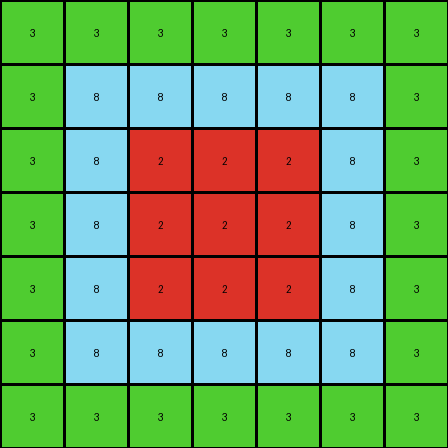
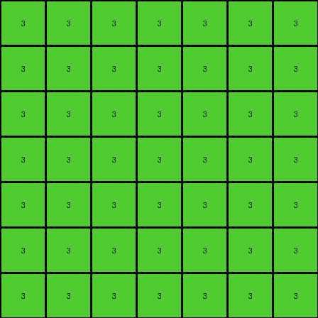
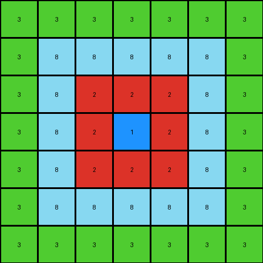

# eb5a1d5d • 015 • refine_dreamer

---


Previous Code:
```python
"""
The transformation extracts the nested rectangles from the input grid and represents them in a compressed form in the output grid. The output grid has a green border representing the outermost green rectangle, an azure border representing the second rectangle, a red border for the third, and a single blue pixel in the center for the innermost shape.
"""

import numpy as np

def get_object_bounds(grid, color):
    # Find the min and max row and col indices for a given color
    rows, cols = np.where(grid == color)
    if len(rows) == 0:
        return None  # Color not found
    min_row, max_row = np.min(rows), np.max(rows)
    min_col, max_col = np.min(cols), np.max(cols)
    return min_row, max_row, min_col, max_col

def transform(input_grid):
    # Initialize output_grid as all green (3)
    output_grid = np.full((7, 7), 3)

    # Get bounds for azure (8) rectangle
    azure_bounds = get_object_bounds(input_grid, 8)
    if azure_bounds:
        min_row, max_row, min_col, max_col = azure_bounds
        # Represent azure rectangle with a border inside the green
        output_grid[1:6, 1:6] = 8

    # Get bounds for red (2) rectangle
    red_bounds = get_object_bounds(input_grid, 2)
    if red_bounds:
        min_row, max_row, min_col, max_col = red_bounds
        #Represent red rectangle with border within the azure.
        output_grid[2:5, 2:5] = 2

    # get bounds for blue (1) object
    blue_bounds = get_object_bounds(input_grid, 1)
    if blue_bounds:
        # Represent center as single blue pixel
        output_grid[3, 3] = 1


    return output_grid
```

Train Set Results:

## Example 1:

Input:
```
8 8 8 8 8 8 8 8 8 8 8 8 8 8 8 8 8 8 8 8 8 8 8 8 8 8 8
8 8 8 8 8 8 8 8 8 8 8 8 8 8 8 8 8 8 8 8 8 8 8 8 8 8 8
8 8 8 3 3 3 3 3 3 3 3 3 3 3 3 3 3 3 3 3 3 8 8 8 8 8 8
8 8 8 3 3 3 3 3 3 3 3 3 3 3 3 3 3 3 3 3 3 8 8 8 8 8 8
8 8 8 3 3 3 3 3 3 3 3 3 3 3 3 3 3 3 3 3 3 8 8 8 8 8 8
8 8 8 3 3 3 3 3 3 3 3 3 3 3 3 3 3 3 3 3 3 8 8 8 8 8 8
8 8 8 3 3 3 3 3 3 3 3 3 3 3 3 3 3 3 3 3 3 8 8 8 8 8 8
8 8 8 3 3 3 3 3 3 3 3 3 3 3 3 3 3 3 3 3 3 8 8 8 8 8 8
8 8 8 3 3 3 3 3 3 3 3 3 3 3 3 3 3 3 3 3 3 8 8 8 8 8 8
8 8 8 3 3 3 2 2 2 2 2 2 3 3 3 3 3 3 3 3 3 8 8 8 8 8 8
8 8 8 3 3 3 2 2 2 2 2 2 3 3 3 3 3 3 3 3 3 8 8 8 8 8 8
8 8 8 3 3 3 2 2 2 2 2 2 3 3 3 3 3 3 3 3 3 8 8 8 8 8 8
8 8 8 3 3 3 2 2 2 2 2 2 3 3 3 3 3 3 3 3 3 8 8 8 8 8 8
8 8 8 3 3 3 2 2 2 2 2 2 3 3 3 3 3 3 3 3 3 8 8 8 8 8 8
8 8 8 3 3 3 2 2 2 2 2 2 3 3 3 3 3 3 3 3 3 8 8 8 8 8 8
8 8 8 3 3 3 3 3 3 3 3 3 3 3 3 3 3 3 3 3 3 8 8 8 8 8 8
8 8 8 3 3 3 3 3 3 3 3 3 3 3 3 3 3 3 3 3 3 8 8 8 8 8 8
8 8 8 3 3 3 3 3 3 3 3 3 3 3 3 3 3 3 3 3 3 8 8 8 8 8 8
8 8 8 8 8 8 8 8 8 8 8 8 8 8 8 8 8 8 8 8 8 8 8 8 8 8 8
8 8 8 8 8 8 8 8 8 8 8 8 8 8 8 8 8 8 8 8 8 8 8 8 8 8 8
8 8 8 8 8 8 8 8 8 8 8 8 8 8 8 8 8 8 8 8 8 8 8 8 8 8 8
8 8 8 8 8 8 8 8 8 8 8 8 8 8 8 8 8 8 8 8 8 8 8 8 8 8 8
8 8 8 8 8 8 8 8 8 8 8 8 8 8 8 8 8 8 8 8 8 8 8 8 8 8 8
```
Expected Output:
```
8 8 8 8 8
8 3 3 3 8
8 3 2 3 8
8 3 3 3 8
8 8 8 8 8
```
Transformed Output:
```
3 3 3 3 3 3 3
3 8 8 8 8 8 3
3 8 2 2 2 8 3
3 8 2 2 2 8 3
3 8 2 2 2 8 3
3 8 8 8 8 8 3
3 3 3 3 3 3 3
```

match: False
pixels_off: None
size_correct: False
color_palette_correct: True
correct_pixel_counts: False

## Example 2:

Input:
```
5 5 5 5 5 5 5 5 5 5 5 5 5 5 5 5 5 5 5 5 5 5 5 5 5
5 5 5 5 5 5 5 5 5 5 5 5 5 5 5 5 5 5 5 5 5 5 5 5 5
5 5 5 5 5 5 5 5 5 5 5 5 5 5 5 5 5 5 5 5 5 5 5 5 5
5 5 5 5 6 6 6 6 6 6 6 6 6 6 6 6 6 6 6 5 5 5 5 5 5
5 5 5 5 6 6 6 6 6 6 6 6 6 6 6 6 6 6 6 5 5 5 5 5 5
5 5 5 5 6 6 6 6 6 6 6 6 6 6 6 6 6 6 6 5 5 5 5 5 5
5 5 5 5 6 6 6 6 6 6 6 6 6 6 6 6 6 6 6 5 5 5 5 5 5
5 5 5 5 6 6 6 6 6 6 6 6 6 6 6 6 6 6 6 5 5 5 5 5 5
5 5 5 5 6 6 6 6 6 6 6 6 6 6 6 6 6 6 6 5 5 5 5 5 5
5 5 5 5 6 6 6 6 6 6 6 6 6 6 6 6 6 6 6 5 5 5 5 5 5
5 5 5 5 6 6 6 6 6 6 6 6 6 6 6 6 6 6 6 5 5 5 5 5 5
5 5 5 5 6 6 6 6 6 6 6 6 6 6 6 6 6 6 6 5 5 5 5 5 5
5 5 5 5 6 6 6 6 6 6 6 6 6 6 6 6 6 6 6 5 5 5 5 5 5
5 5 5 5 6 6 6 6 6 6 6 6 6 6 6 6 6 6 6 5 5 5 5 5 5
5 5 5 5 6 6 6 6 6 6 6 6 6 6 6 6 6 6 6 5 5 5 5 5 5
5 5 5 5 6 6 6 6 6 6 6 6 6 6 6 6 6 6 6 5 5 5 5 5 5
5 5 5 5 5 5 5 5 5 5 5 5 5 5 5 5 5 5 5 5 5 5 5 5 5
5 5 5 5 5 5 5 5 5 5 5 5 5 5 5 5 5 5 5 5 5 5 5 5 5
5 5 5 5 5 5 5 5 5 5 5 5 5 5 5 5 5 5 5 5 5 5 5 5 5
5 5 5 5 5 5 5 5 5 5 5 5 5 5 5 5 5 5 5 5 5 5 5 5 5
5 5 5 5 5 5 5 5 5 5 5 5 5 5 5 5 5 5 5 5 5 5 5 5 5
5 5 5 5 5 5 5 5 5 5 5 5 5 5 5 5 5 5 5 5 5 5 5 5 5
```
Expected Output:
```
5 5 5
5 6 5
5 5 5
```
Transformed Output:
```
3 3 3 3 3 3 3
3 3 3 3 3 3 3
3 3 3 3 3 3 3
3 3 3 3 3 3 3
3 3 3 3 3 3 3
3 3 3 3 3 3 3
3 3 3 3 3 3 3
```

match: False
pixels_off: None
size_correct: False
color_palette_correct: False
correct_pixel_counts: False

## Example 3:

Input:
```
3 3 3 3 3 3 3 3 3 3 3 3 3 3 3 3 3 3 3 3 3 3
3 3 3 3 3 3 3 3 3 3 3 3 3 3 3 3 3 3 3 3 3 3
3 3 3 3 3 3 3 3 3 3 3 3 3 3 3 3 3 3 3 3 3 3
3 3 3 8 8 8 8 8 8 8 8 8 8 8 8 8 8 3 3 3 3 3
3 3 3 8 8 8 8 8 8 8 8 8 8 8 8 8 8 3 3 3 3 3
3 3 3 8 8 2 2 2 2 2 2 2 2 2 8 8 8 3 3 3 3 3
3 3 3 8 8 2 2 2 1 1 1 1 1 2 8 8 8 3 3 3 3 3
3 3 3 8 8 2 2 2 1 1 1 1 1 2 8 8 8 3 3 3 3 3
3 3 3 8 8 2 2 2 1 1 1 1 1 2 8 8 8 3 3 3 3 3
3 3 3 8 8 2 2 2 2 2 2 2 2 2 8 8 8 3 3 3 3 3
3 3 3 8 8 2 2 2 2 2 2 2 2 2 8 8 8 3 3 3 3 3
3 3 3 8 8 2 2 2 2 2 2 2 2 2 8 8 8 3 3 3 3 3
3 3 3 8 8 2 2 2 2 2 2 2 2 2 8 8 8 3 3 3 3 3
3 3 3 8 8 2 2 2 2 2 2 2 2 2 8 8 8 3 3 3 3 3
3 3 3 8 8 8 8 8 8 8 8 8 8 8 8 8 8 3 3 3 3 3
3 3 3 8 8 8 8 8 8 8 8 8 8 8 8 8 8 3 3 3 3 3
3 3 3 8 8 8 8 8 8 8 8 8 8 8 8 8 8 3 3 3 3 3
3 3 3 3 3 3 3 3 3 3 3 3 3 3 3 3 3 3 3 3 3 3
3 3 3 3 3 3 3 3 3 3 3 3 3 3 3 3 3 3 3 3 3 3
3 3 3 3 3 3 3 3 3 3 3 3 3 3 3 3 3 3 3 3 3 3
3 3 3 3 3 3 3 3 3 3 3 3 3 3 3 3 3 3 3 3 3 3
```
Expected Output:
```
3 3 3 3 3 3 3
3 8 8 8 8 8 3
3 8 2 2 2 8 3
3 8 2 1 2 8 3
3 8 2 2 2 8 3
3 8 8 8 8 8 3
3 3 3 3 3 3 3
```
Transformed Output:
```
3 3 3 3 3 3 3
3 8 8 8 8 8 3
3 8 2 2 2 8 3
3 8 2 1 2 8 3
3 8 2 2 2 8 3
3 8 8 8 8 8 3
3 3 3 3 3 3 3
```

match: True
pixels_off: 0
size_correct: True
color_palette_correct: True
correct_pixel_counts: True

**INSTRUCTIONS**

The code above was generated based on observations from the first training
example

we have tested the transform function on each of the task example inputs and
compared with the expected output

review each of the examples provided and the results and consider how the
natural language program should be updated to accommodate this new knowledge

respond with the following deliverables:

- general assessment of the information provided and strategy for resolving the
  errors
- gather metrics about each of the examples and results - use code_execution to
  develop accurate reports on your assumptions
- a YAML block documenting facts - Focus on identifying objects, their properties, and the actions performed on them.
- a natural language program - Be as clear and concise as possible, providing a complete description of the transformation rule.


your responses should be considered as information in a report - not a
conversation
