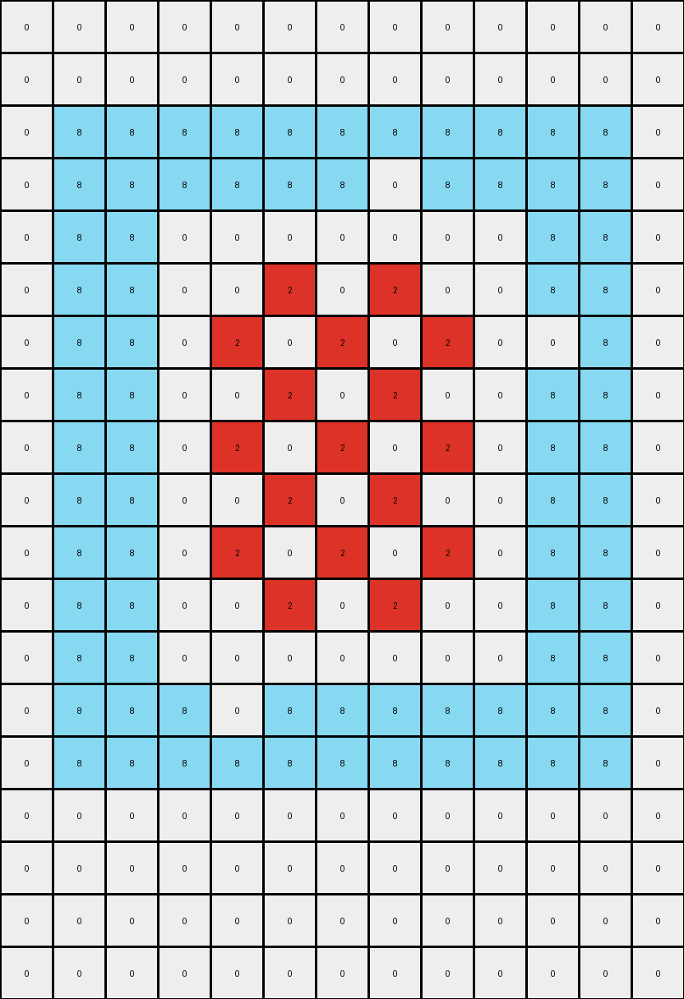
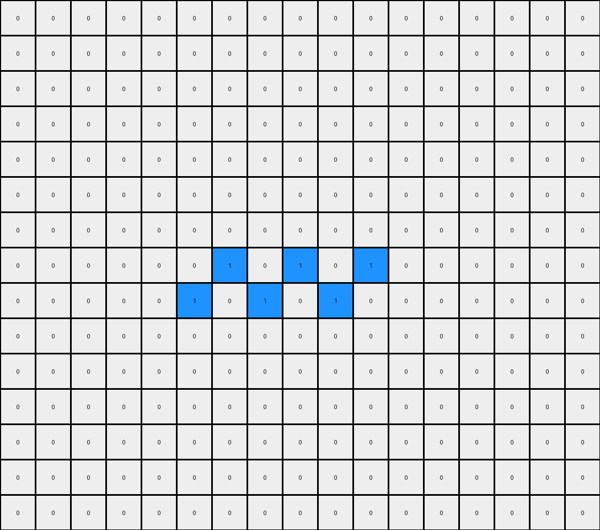
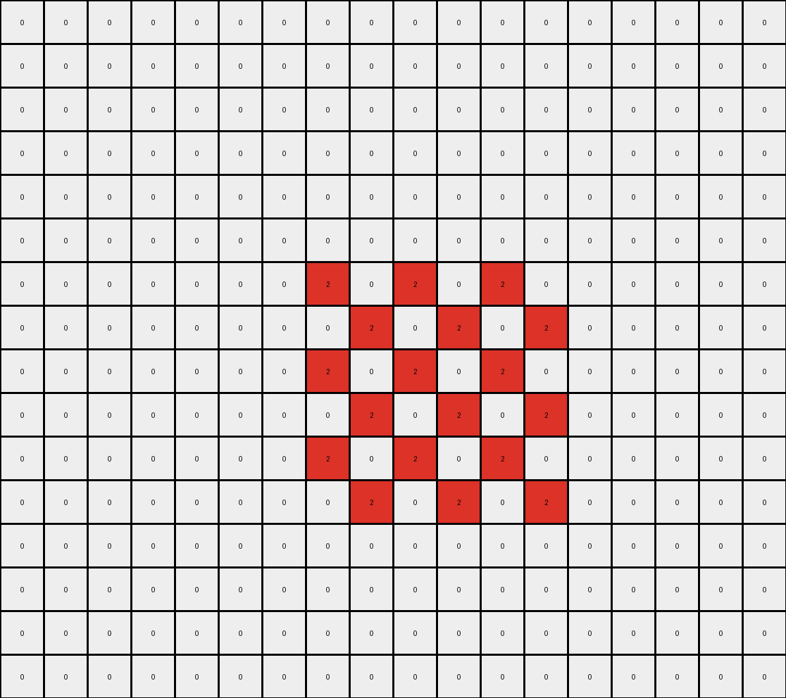

# f1cefba8 • 006 • refine_coder

---

Previous Code:
```python
"""
Preserve azure (8) pixels and selectively modify other color regions based on an alternating pattern and border detection.
"""

import numpy as np

def get_objects(grid):
    """
    Find contiguous regions of the same color, excluding white (0).
    Returns a dictionary of objects keyed by color.
    """
    objects = {}
    visited = set()
    rows, cols = grid.shape

    def dfs(r, c, color, obj_coords):
        if (r, c) in visited or r < 0 or r >= rows or c < 0 or c >= cols or grid[r, c] != color:
            return
        visited.add((r, c))
        obj_coords.append((r, c))
        dfs(r + 1, c, color, obj_coords)
        dfs(r - 1, c, color, obj_coords)
        dfs(r, c + 1, color, obj_coords)
        dfs(r, c - 1, color, obj_coords)
        dfs(r + 1, c+1, color, obj_coords)
        dfs(r + 1, c-1, color, obj_coords)
        dfs(r - 1, c+1, color, obj_coords)
        dfs(r - 1, c-1, color, obj_coords)


    for r in range(rows):
        for c in range(cols):
            color = grid[r, c]
            if color != 0 and (r, c) not in visited:
                obj_coords = []
                dfs(r, c, color, obj_coords)
                if color not in objects:
                    objects[color] = []
                objects[color].append(obj_coords)
    return objects

def get_borders(grid, objects):
    """
    Identifies border pixels for each object.
    """
    rows, cols = grid.shape
    borders = {}

    for color, obj_list in objects.items():
        for obj_coords in obj_list:
            obj_borders = []
            for r, c in obj_coords:
                is_border = False
                for dr in [-1, 0, 1]:
                    for dc in [-1, 0, 1]:
                        if dr == 0 and dc == 0:
                            continue
                        nr, nc = r + dr, c + dc
                        if 0 <= nr < rows and 0 <= nc < cols:
                            if grid[nr, nc] != color:
                                is_border = True
                                break  # optimization
                    if is_border:
                        break  # optimization
                if is_border:
                    obj_borders.append((r,c))
            if color not in borders:
                borders[color] = []

            borders[color].extend(obj_borders)

    return borders

def transform(input_grid):
    """
    Transforms the input grid according to the observed rule.
    """
    output_grid = np.copy(input_grid)
    rows, cols = input_grid.shape

    # 1. Identify Objects
    objects = get_objects(input_grid)

    # 2. Find Borders
    borders = get_borders(input_grid, objects)
    # print(borders)

    # 3. Preserve Azure (8)
    #  - Already handled by copying the input grid

    # 4. Alternate and Transform
    for color, obj_list in objects.items():
        if color != 8: # Not azure
              for obj in obj_list:
                for r, c in obj:
                    output_grid[r,c] = 0
              border_color = None

              for obj in obj_list:
                min_r = min(r for r, c in obj)
                max_r = max(r for r, c in obj)
                min_c = min(c for r, c in obj)
                max_c = max(c for r, c in obj)

                for r, c in obj:
                    if border_color is None:
                        for dr in [-1,0,1]:
                            for dc in [-1,0,1]:
                                if (dr != 0 or dc !=0):
                                    new_r = r + dr
                                    new_c = c + dc
                                    if new_r >= 0 and new_r < rows and new_c >= 0 and new_c < cols:
                                        if (new_r, new_c) not in obj:
                                          neighbor_color = input_grid[new_r, new_c]
                                          if neighbor_color != 0 and neighbor_color != 8:
                                            border_color = neighbor_color

                    if (r-min_r) % 2 == 0 and (c - min_c) %2 == 0:
                        output_grid[r,c] = color if border_color is None else border_color
                    elif (r-min_r) % 2 == 1 and (c - min_c) %2 == 1:
                        output_grid[r,c] = color if border_color is None else border_color
                    elif (r-min_r) % 2 == 1 and (c - min_c) %2 == 0:
                        if color in [2,3]:
                          output_grid[r,c] = 0

                    elif (r-min_r) % 2 == 0 and (c - min_c) %2 == 1:
                        if color in [2,3]:
                          output_grid[r,c] = 0


    for color, border_coords in borders.items():
      if color != 8:
          for r,c in border_coords:
              output_grid[r,c] = 0

    return output_grid
```

Train Set Results:

## Example 1:

Input:
```
0 0 0 0 0 0 0 0 0 0 0 0 0
0 0 0 0 0 0 0 0 0 0 0 0 0
0 8 8 8 8 8 8 8 8 8 8 8 0
0 8 8 8 8 8 8 2 8 8 8 8 0
0 8 8 2 2 2 2 2 2 2 8 8 0
0 8 8 2 2 2 2 2 2 2 8 8 0
0 8 8 2 2 2 2 2 2 2 2 8 0
0 8 8 2 2 2 2 2 2 2 8 8 0
0 8 8 2 2 2 2 2 2 2 8 8 0
0 8 8 2 2 2 2 2 2 2 8 8 0
0 8 8 2 2 2 2 2 2 2 8 8 0
0 8 8 2 2 2 2 2 2 2 8 8 0
0 8 8 2 2 2 2 2 2 2 8 8 0
0 8 8 8 2 8 8 8 8 8 8 8 0
0 8 8 8 8 8 8 8 8 8 8 8 0
0 0 0 0 0 0 0 0 0 0 0 0 0
0 0 0 0 0 0 0 0 0 0 0 0 0
0 0 0 0 0 0 0 0 0 0 0 0 0
0 0 0 0 0 0 0 0 0 0 0 0 0
```
Expected Output:
```
0 0 0 0 2 0 0 2 0 0 0 0 0
0 0 0 0 2 0 0 2 0 0 0 0 0
0 8 8 8 8 8 8 8 8 8 8 8 0
0 8 8 8 8 8 8 8 8 8 8 8 0
0 8 8 2 8 2 2 8 2 2 8 8 0
0 8 8 2 8 2 2 8 2 2 8 8 0
2 8 8 8 8 8 8 8 8 8 8 8 2
0 8 8 2 8 2 2 8 2 2 8 8 0
0 8 8 2 8 2 2 8 2 2 8 8 0
0 8 8 2 8 2 2 8 2 2 8 8 0
0 8 8 2 8 2 2 8 2 2 8 8 0
0 8 8 2 8 2 2 8 2 2 8 8 0
0 8 8 2 8 2 2 8 2 2 8 8 0
0 8 8 8 8 8 8 8 8 8 8 8 0
0 8 8 8 8 8 8 8 8 8 8 8 0
0 0 0 0 2 0 0 2 0 0 0 0 0
0 0 0 0 2 0 0 2 0 0 0 0 0
0 0 0 0 2 0 0 2 0 0 0 0 0
0 0 0 0 2 0 0 2 0 0 0 0 0
```
Transformed Output:
```
0 0 0 0 0 0 0 0 0 0 0 0 0
0 0 0 0 0 0 0 0 0 0 0 0 0
0 8 8 8 8 8 8 8 8 8 8 8 0
0 8 8 8 8 8 8 0 8 8 8 8 0
0 8 8 0 0 0 0 0 0 0 8 8 0
0 8 8 0 0 2 0 2 0 0 8 8 0
0 8 8 0 2 0 2 0 2 0 0 8 0
0 8 8 0 0 2 0 2 0 0 8 8 0
0 8 8 0 2 0 2 0 2 0 8 8 0
0 8 8 0 0 2 0 2 0 0 8 8 0
0 8 8 0 2 0 2 0 2 0 8 8 0
0 8 8 0 0 2 0 2 0 0 8 8 0
0 8 8 0 0 0 0 0 0 0 8 8 0
0 8 8 8 0 8 8 8 8 8 8 8 0
0 8 8 8 8 8 8 8 8 8 8 8 0
0 0 0 0 0 0 0 0 0 0 0 0 0
0 0 0 0 0 0 0 0 0 0 0 0 0
0 0 0 0 0 0 0 0 0 0 0 0 0
0 0 0 0 0 0 0 0 0 0 0 0 0
```

match: False
pixels_off: 72
size_correct: True
color_palette_correct: True
correct_pixel_counts: False

## Example 2:

Input:
```
0 0 0 0 0 0 0 0 0 0 0 0 0 0 0 0 0
0 0 0 0 0 0 0 0 0 0 0 0 0 0 0 0 0
0 0 0 0 0 0 0 0 0 0 0 0 0 0 0 0 0
0 0 0 0 0 0 0 0 0 0 0 0 0 0 0 0 0
0 0 1 1 1 1 1 1 1 1 1 1 1 1 0 0 0
0 0 1 1 1 1 4 1 1 1 1 1 1 1 0 0 0
0 0 1 1 4 4 4 4 4 4 4 4 1 1 0 0 0
0 0 1 1 4 4 4 4 4 4 4 4 4 1 0 0 0
0 0 1 1 4 4 4 4 4 4 4 4 1 1 0 0 0
0 0 1 1 4 4 4 4 4 4 4 4 1 1 0 0 0
0 0 1 1 1 1 1 1 4 1 1 1 1 1 0 0 0
0 0 1 1 1 1 1 1 1 1 1 1 1 1 0 0 0
0 0 0 0 0 0 0 0 0 0 0 0 0 0 0 0 0
0 0 0 0 0 0 0 0 0 0 0 0 0 0 0 0 0
0 0 0 0 0 0 0 0 0 0 0 0 0 0 0 0 0
```
Expected Output:
```
0 0 0 0 0 0 4 0 4 0 0 0 0 0 0 0 0
0 0 0 0 0 0 4 0 4 0 0 0 0 0 0 0 0
0 0 0 0 0 0 4 0 4 0 0 0 0 0 0 0 0
0 0 0 0 0 0 4 0 4 0 0 0 0 0 0 0 0
0 0 1 1 1 1 1 1 1 1 1 1 1 1 0 0 0
0 0 1 1 1 1 1 1 1 1 1 1 1 1 0 0 0
0 0 1 1 4 4 1 4 1 4 4 4 1 1 0 0 0
4 4 1 1 1 1 1 1 1 1 1 1 1 1 4 4 4
0 0 1 1 4 4 1 4 1 4 4 4 1 1 0 0 0
0 0 1 1 4 4 1 4 1 4 4 4 1 1 0 0 0
0 0 1 1 1 1 1 1 1 1 1 1 1 1 0 0 0
0 0 1 1 1 1 1 1 1 1 1 1 1 1 0 0 0
0 0 0 0 0 0 4 0 4 0 0 0 0 0 0 0 0
0 0 0 0 0 0 4 0 4 0 0 0 0 0 0 0 0
0 0 0 0 0 0 4 0 4 0 0 0 0 0 0 0 0
```
Transformed Output:
```
0 0 0 0 0 0 0 0 0 0 0 0 0 0 0 0 0
0 0 0 0 0 0 0 0 0 0 0 0 0 0 0 0 0
0 0 0 0 0 0 0 0 0 0 0 0 0 0 0 0 0
0 0 0 0 0 0 0 0 0 0 0 0 0 0 0 0 0
0 0 0 0 0 0 0 0 0 0 0 0 0 0 0 0 0
0 0 0 0 0 0 0 0 0 0 0 0 0 0 0 0 0
0 0 0 0 0 0 0 0 0 0 0 0 0 0 0 0 0
0 0 0 0 0 0 1 0 1 0 1 0 0 0 0 0 0
0 0 0 0 0 1 0 1 0 1 0 0 0 0 0 0 0
0 0 0 0 0 0 0 0 0 0 0 0 0 0 0 0 0
0 0 0 0 0 0 0 0 0 0 0 0 0 0 0 0 0
0 0 0 0 0 0 0 0 0 0 0 0 0 0 0 0 0
0 0 0 0 0 0 0 0 0 0 0 0 0 0 0 0 0
0 0 0 0 0 0 0 0 0 0 0 0 0 0 0 0 0
0 0 0 0 0 0 0 0 0 0 0 0 0 0 0 0 0
```

match: False
pixels_off: 112
size_correct: True
color_palette_correct: True
correct_pixel_counts: False

## Example 3:

Input:
```
0 0 0 0 0 0 0 0 0 0 0 0 0 0 0 0 0 0
0 0 0 0 0 0 0 0 0 0 0 0 0 0 0 0 0 0
0 0 0 0 0 0 0 0 0 0 0 0 0 0 0 0 0 0
0 0 0 0 2 2 2 2 2 2 2 2 2 2 2 2 0 0
0 0 0 0 2 2 2 2 2 2 2 3 2 2 2 2 0 0
0 0 0 0 2 2 3 3 3 3 3 3 3 3 2 2 0 0
0 0 0 0 2 2 3 3 3 3 3 3 3 3 2 2 0 0
0 0 0 0 2 2 3 3 3 3 3 3 3 3 2 2 0 0
0 0 0 0 2 3 3 3 3 3 3 3 3 3 2 2 0 0
0 0 0 0 2 2 3 3 3 3 3 3 3 3 2 2 0 0
0 0 0 0 2 2 3 3 3 3 3 3 3 3 2 2 0 0
0 0 0 0 2 2 3 3 3 3 3 3 3 3 2 2 0 0
0 0 0 0 2 2 3 3 3 3 3 3 3 3 2 2 0 0
0 0 0 0 2 2 2 2 2 2 2 2 2 2 2 2 0 0
0 0 0 0 2 2 2 2 2 2 2 2 2 2 2 2 0 0
0 0 0 0 0 0 0 0 0 0 0 0 0 0 0 0 0 0
```
Expected Output:
```
0 0 0 0 0 0 0 0 0 0 0 3 0 0 0 0 0 0
0 0 0 0 0 0 0 0 0 0 0 3 0 0 0 0 0 0
0 0 0 0 0 0 0 0 0 0 0 3 0 0 0 0 0 0
0 0 0 0 2 2 2 2 2 2 2 2 2 2 2 2 0 0
0 0 0 0 2 2 2 2 2 2 2 2 2 2 2 2 0 0
0 0 0 0 2 2 3 3 3 3 3 2 3 3 2 2 0 0
0 0 0 0 2 2 3 3 3 3 3 2 3 3 2 2 0 0
0 0 0 0 2 2 3 3 3 3 3 2 3 3 2 2 0 0
3 3 3 3 2 2 2 2 2 2 2 2 2 2 2 2 3 3
0 0 0 0 2 2 3 3 3 3 3 2 3 3 2 2 0 0
0 0 0 0 2 2 3 3 3 3 3 2 3 3 2 2 0 0
0 0 0 0 2 2 3 3 3 3 3 2 3 3 2 2 0 0
0 0 0 0 2 2 3 3 3 3 3 2 3 3 2 2 0 0
0 0 0 0 2 2 2 2 2 2 2 2 2 2 2 2 0 0
0 0 0 0 2 2 2 2 2 2 2 2 2 2 2 2 0 0
0 0 0 0 0 0 0 0 0 0 0 3 0 0 0 0 0 0
```
Transformed Output:
```
0 0 0 0 0 0 0 0 0 0 0 0 0 0 0 0 0 0
0 0 0 0 0 0 0 0 0 0 0 0 0 0 0 0 0 0
0 0 0 0 0 0 0 0 0 0 0 0 0 0 0 0 0 0
0 0 0 0 0 0 0 0 0 0 0 0 0 0 0 0 0 0
0 0 0 0 0 0 0 0 0 0 0 0 0 0 0 0 0 0
0 0 0 0 0 0 0 0 0 0 0 0 0 0 0 0 0 0
0 0 0 0 0 0 0 2 0 2 0 2 0 0 0 0 0 0
0 0 0 0 0 0 0 0 2 0 2 0 2 0 0 0 0 0
0 0 0 0 0 0 0 2 0 2 0 2 0 0 0 0 0 0
0 0 0 0 0 0 0 0 2 0 2 0 2 0 0 0 0 0
0 0 0 0 0 0 0 2 0 2 0 2 0 0 0 0 0 0
0 0 0 0 0 0 0 0 2 0 2 0 2 0 0 0 0 0
0 0 0 0 0 0 0 0 0 0 0 0 0 0 0 0 0 0
0 0 0 0 0 0 0 0 0 0 0 0 0 0 0 0 0 0
0 0 0 0 0 0 0 0 0 0 0 0 0 0 0 0 0 0
0 0 0 0 0 0 0 0 0 0 0 0 0 0 0 0 0 0
```

match: False
pixels_off: 149
size_correct: True
color_palette_correct: True
correct_pixel_counts: False
Okay, here's a breakdown of the situation, the results, and a plan to refine the natural language program and the code.

**General Assessment and Strategy**

The initial code, while capturing some aspects of the transformation (like identifying objects and preserving azure pixels), fails to correctly implement the core logic of alternating color replacement and border handling. The errors are significant, with a large number of mismatched pixels in each test case.  The strategy will involve:

1.  **Re-examining the Core Rule:**  The alternating pattern and its relation to different colored objects and their neighbors is not correctly understood. We need to revisit the examples and derive a more precise rule description. The concept of "border" needs clarification.
2.  **Simplifying Object Handling:** The current object handling and border detection seem overly complex, making debugging and modification difficult.
3.  **Focusing on Relative Positioning:** The correct outputs show a clear dependence on the relative position of pixels *within* each object and in relation to neighboring objects.  The current code doesn't effectively capture this.
4. **Improving border color handling:** The logic on which color should be at the border is not working, it should copy the adjacent neighbor color, unless no neighbor.

**Metrics and Observations**

Here's a summary of what we can derive from provided results, using the images as support.

*   **Example 1:**
    *   Input: A large azure (8) rectangle surrounding a smaller red (2) rectangle.
    *   Expected Output: The red rectangle alternates colors internally between red and white, with a red border. The azure rectangle is preserved.
    *   Actual Output: Incorrect alternating pattern and border inside of the red rectangle.
    *   Key Observation: The alternating pattern seems to be based on a checkerboard-like grid *within* the object, and border should copy the color of the adjacent object.

*   **Example 2:**
    *   Input: Two overlapping rectangles: blue (1) and yellow (4).
    *   Expected Output: The overlapping area forms a complex pattern, parts of the yellow section become a checkerboard, some of the blue becomes a checkerboard. There is a line of yellow and 4's along the line separating the regions.
    *   Actual Output: Almost entirely wrong, very few pixels are correct.
    *   Key Observation: The overlapping area and adjacent color handling is critical and completely missed.

*   **Example 3:**
    *   Input: Two adjacent, irregular shapes of red (2) and green (3).
    *   Expected Output: A complex interaction, with the green object affecting the red, and vice-versa, with an alternating pattern.
    *   Actual Output: Incorrect, only applies checkerboard, misses the influence on neighbors.
    *   Key Observation: Adjacency of *different* colors is crucial, and the transformation depends on this adjacency.

**YAML Block - Facts and Properties**

```yaml
objects:
  - color: 8  # Azure
    behavior: preserve
    instances:
      - shape: rectangle
        coords: [(2,1) -> (14,12)] # Example 1, approximate
  - color: 2  # Red
    behavior: alternating_pattern, affected_by_neighbors
    instances:
      - shape: rectangle
        coords: [(4,3) -> (12,10)] # Example 1, approximate
  - color: 1  # Blue
    behavior: alternating_pattern, affected_by_neighbors
    instances:
       - shape: rectangle
         coords: [(4,2) -> (11,13)] # Example 2
  - color: 4  # Yellow
    behavior: alternating_pattern, affected_by_neighbors
    instances:
      - shape: rectangle
        coords: [(5,4) -> (10, 11)] # Example 2
  - color: 3 # Green
    behavior: alternating_pattern, affected_by_neighbors
    instances:
      - shape: irregular
        coords: [(4, 5) -> (12,13)] # Example 3
actions:
  - type: preserve
    target:
      color: 8
  - type: alternating_color
    target:
      colors: [1, 2, 3, 4]
    rules:
      - condition: adjacent_to_different_color
        result: border_takes_neighbor_color
      - condition: inside_object
        result: checkerboard_pattern
      - condition: no_neighbor
        result: checkerboard_pattern

```

**Natural Language Program**

1.  **Identify Objects:** Find all contiguous regions (objects) of the same color, excluding white (0).

2.  **Preserve Azure:**  Leave all azure (8) pixels unchanged.

3.  **Process Other Colors:** For all other colors (1, 2, 3, 4, etc.):
    *   **Border Handling:**
        *   If a pixel of the object is adjacent (including diagonals) to a pixel of a *different* color, change the pixel to the adjacent color, unless that color is 0 or 8, in which case set to 0.
    *   **Interior Alternating Pattern (Checkerboard):**
        *   For pixels *not* on the border, apply an alternating pattern based on their row and column indices *relative to the top-left corner of the object's bounding box*. The pattern follows a "checkerboard" style:
        *   If (row + col) is even: Keep the original color.
        *   If (row + col) is odd: change to white (0)

4. **Border Priority:** Border handling takes precedence. The checkerboard pattern is applied *only* to internal object pixels after borders are determined.

**Next Steps**
The provided assessment, YAML block, and the natural language program, will serve as documentation to develop a new version of the python function.

**INSTRUCTIONS**

- generate a Python module to represent the natural language program 
- follow the template below
- all common math and science libraries are available
- create docstring only at top - but comment the workflow in the function
- use helper functions for common operations like finding objects, counting,
  measuring, moving, etc. 

remember - we are working iteratively - so this code will inform your future
self as we converge on the solution

*template:*

```python
"""
{{ natural language description of the transformation rule }}
"""

{{ imports }}

def transform(input_grid):
    # initialize output_grid

    # change output pixels 

    return output_grid

```
