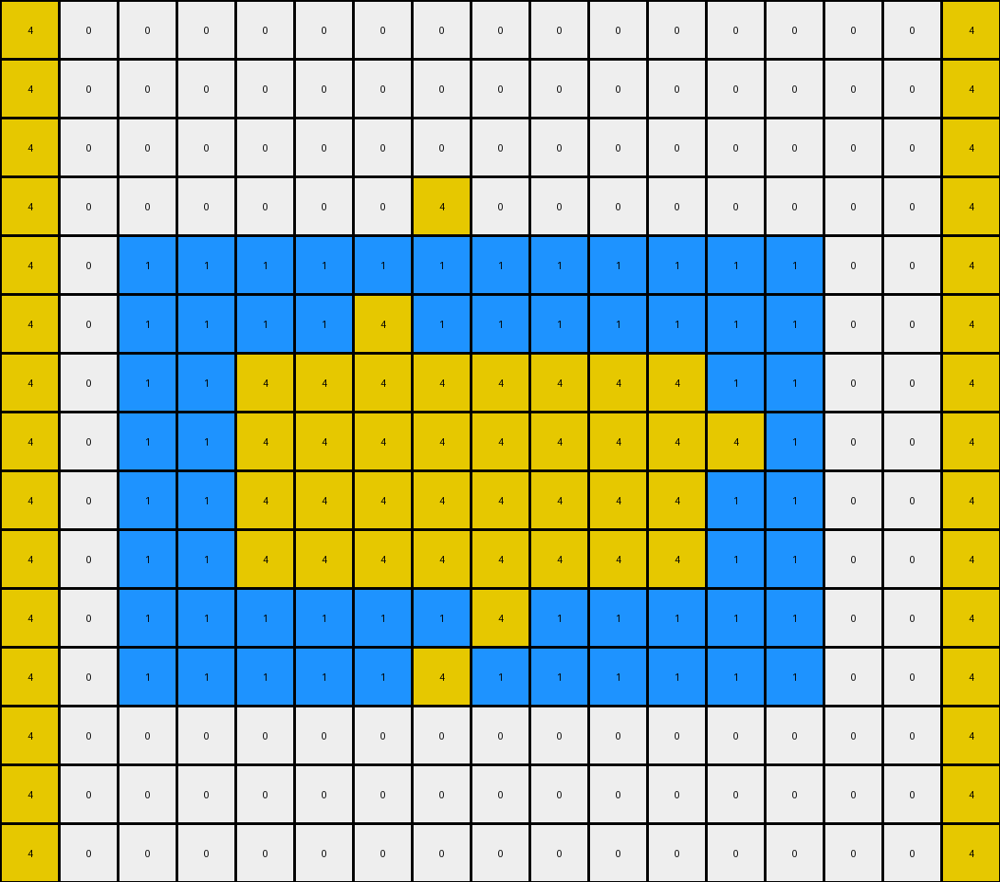

# f1cefba8 • 010 • refine_coder

---

Previous Code:
```python
"""
Transforms an input grid containing a central shape of blue and yellow pixels. 
The blue pixels are preserved. Some yellow pixels are changed to another color.
Yellow vertical lines are added and also elements colored yellow are added 
to the left and right borders where white columns existed.
"""

import numpy as np

def find_object(grid, colors):
    rows, cols = grid.shape
    object_pixels = []
    for r in range(rows):
        for c in range(cols):
            if grid[r, c] in colors:
                object_pixels.append((r, c))
    return object_pixels

def transform(input_grid):
    # Initialize output_grid as a copy of the input_grid
    output_grid = np.copy(input_grid)
    rows, cols = input_grid.shape

    # Find the central object (blue and yellow pixels)
    object_pixels = find_object(input_grid, [1, 4])

    # keep blue pixels
    for r, c in object_pixels:
      if input_grid[r,c] == 1:
        output_grid[r, c] = 1

    # keep yellow lines
    for r, c in object_pixels:
      if input_grid[r,c] == 4 and (r == 6 or r == 8):
           output_grid[r,c] = 4
    
    # yellow vertical lines
    for r in [3, 7, 11]:
        output_grid[r,7] = 4

    # yellow borders
    for r in range(rows):
      if output_grid[r, 0] == 0:
        output_grid[r,0] = 4
      if output_grid[r, cols - 1] == 0:
        output_grid[r, cols-1] = 4
        

    return output_grid
```

Train Set Results:

## Example 1:

Input:
```
0 0 0 0 0 0 0 0 0 0 0 0 0
0 0 0 0 0 0 0 0 0 0 0 0 0
0 8 8 8 8 8 8 8 8 8 8 8 0
0 8 8 8 8 8 8 2 8 8 8 8 0
0 8 8 2 2 2 2 2 2 2 8 8 0
0 8 8 2 2 2 2 2 2 2 8 8 0
0 8 8 2 2 2 2 2 2 2 2 8 0
0 8 8 2 2 2 2 2 2 2 8 8 0
0 8 8 2 2 2 2 2 2 2 8 8 0
0 8 8 2 2 2 2 2 2 2 8 8 0
0 8 8 2 2 2 2 2 2 2 8 8 0
0 8 8 2 2 2 2 2 2 2 8 8 0
0 8 8 2 2 2 2 2 2 2 8 8 0
0 8 8 8 2 8 8 8 8 8 8 8 0
0 8 8 8 8 8 8 8 8 8 8 8 0
0 0 0 0 0 0 0 0 0 0 0 0 0
0 0 0 0 0 0 0 0 0 0 0 0 0
0 0 0 0 0 0 0 0 0 0 0 0 0
0 0 0 0 0 0 0 0 0 0 0 0 0
```
Expected Output:
```
0 0 0 0 2 0 0 2 0 0 0 0 0
0 0 0 0 2 0 0 2 0 0 0 0 0
0 8 8 8 8 8 8 8 8 8 8 8 0
0 8 8 8 8 8 8 8 8 8 8 8 0
0 8 8 2 8 2 2 8 2 2 8 8 0
0 8 8 2 8 2 2 8 2 2 8 8 0
2 8 8 8 8 8 8 8 8 8 8 8 2
0 8 8 2 8 2 2 8 2 2 8 8 0
0 8 8 2 8 2 2 8 2 2 8 8 0
0 8 8 2 8 2 2 8 2 2 8 8 0
0 8 8 2 8 2 2 8 2 2 8 8 0
0 8 8 2 8 2 2 8 2 2 8 8 0
0 8 8 2 8 2 2 8 2 2 8 8 0
0 8 8 8 8 8 8 8 8 8 8 8 0
0 8 8 8 8 8 8 8 8 8 8 8 0
0 0 0 0 2 0 0 2 0 0 0 0 0
0 0 0 0 2 0 0 2 0 0 0 0 0
0 0 0 0 2 0 0 2 0 0 0 0 0
0 0 0 0 2 0 0 2 0 0 0 0 0
```
Transformed Output:
```
4 0 0 0 0 0 0 0 0 0 0 0 4
4 0 0 0 0 0 0 0 0 0 0 0 4
4 8 8 8 8 8 8 8 8 8 8 8 4
4 8 8 8 8 8 8 4 8 8 8 8 4
4 8 8 2 2 2 2 2 2 2 8 8 4
4 8 8 2 2 2 2 2 2 2 8 8 4
4 8 8 2 2 2 2 2 2 2 2 8 4
4 8 8 2 2 2 2 4 2 2 8 8 4
4 8 8 2 2 2 2 2 2 2 8 8 4
4 8 8 2 2 2 2 2 2 2 8 8 4
4 8 8 2 2 2 2 2 2 2 8 8 4
4 8 8 2 2 2 2 4 2 2 8 8 4
4 8 8 2 2 2 2 2 2 2 8 8 4
4 8 8 8 2 8 8 8 8 8 8 8 4
4 8 8 8 8 8 8 8 8 8 8 8 4
4 0 0 0 0 0 0 0 0 0 0 0 4
4 0 0 0 0 0 0 0 0 0 0 0 4
4 0 0 0 0 0 0 0 0 0 0 0 4
4 0 0 0 0 0 0 0 0 0 0 0 4
```

match: False
pixels_off: 76
size_correct: True
color_palette_correct: False
correct_pixel_counts: False

## Example 2:

Input:
```
0 0 0 0 0 0 0 0 0 0 0 0 0 0 0 0 0
0 0 0 0 0 0 0 0 0 0 0 0 0 0 0 0 0
0 0 0 0 0 0 0 0 0 0 0 0 0 0 0 0 0
0 0 0 0 0 0 0 0 0 0 0 0 0 0 0 0 0
0 0 1 1 1 1 1 1 1 1 1 1 1 1 0 0 0
0 0 1 1 1 1 4 1 1 1 1 1 1 1 0 0 0
0 0 1 1 4 4 4 4 4 4 4 4 1 1 0 0 0
0 0 1 1 4 4 4 4 4 4 4 4 4 1 0 0 0
0 0 1 1 4 4 4 4 4 4 4 4 1 1 0 0 0
0 0 1 1 4 4 4 4 4 4 4 4 1 1 0 0 0
0 0 1 1 1 1 1 1 4 1 1 1 1 1 0 0 0
0 0 1 1 1 1 1 1 1 1 1 1 1 1 0 0 0
0 0 0 0 0 0 0 0 0 0 0 0 0 0 0 0 0
0 0 0 0 0 0 0 0 0 0 0 0 0 0 0 0 0
0 0 0 0 0 0 0 0 0 0 0 0 0 0 0 0 0
```
Expected Output:
```
0 0 0 0 0 0 4 0 4 0 0 0 0 0 0 0 0
0 0 0 0 0 0 4 0 4 0 0 0 0 0 0 0 0
0 0 0 0 0 0 4 0 4 0 0 0 0 0 0 0 0
0 0 0 0 0 0 4 0 4 0 0 0 0 0 0 0 0
0 0 1 1 1 1 1 1 1 1 1 1 1 1 0 0 0
0 0 1 1 1 1 1 1 1 1 1 1 1 1 0 0 0
0 0 1 1 4 4 1 4 1 4 4 4 1 1 0 0 0
4 4 1 1 1 1 1 1 1 1 1 1 1 1 4 4 4
0 0 1 1 4 4 1 4 1 4 4 4 1 1 0 0 0
0 0 1 1 4 4 1 4 1 4 4 4 1 1 0 0 0
0 0 1 1 1 1 1 1 1 1 1 1 1 1 0 0 0
0 0 1 1 1 1 1 1 1 1 1 1 1 1 0 0 0
0 0 0 0 0 0 4 0 4 0 0 0 0 0 0 0 0
0 0 0 0 0 0 4 0 4 0 0 0 0 0 0 0 0
0 0 0 0 0 0 4 0 4 0 0 0 0 0 0 0 0
```
Transformed Output:
```
4 0 0 0 0 0 0 0 0 0 0 0 0 0 0 0 4
4 0 0 0 0 0 0 0 0 0 0 0 0 0 0 0 4
4 0 0 0 0 0 0 0 0 0 0 0 0 0 0 0 4
4 0 0 0 0 0 0 4 0 0 0 0 0 0 0 0 4
4 0 1 1 1 1 1 1 1 1 1 1 1 1 0 0 4
4 0 1 1 1 1 4 1 1 1 1 1 1 1 0 0 4
4 0 1 1 4 4 4 4 4 4 4 4 1 1 0 0 4
4 0 1 1 4 4 4 4 4 4 4 4 4 1 0 0 4
4 0 1 1 4 4 4 4 4 4 4 4 1 1 0 0 4
4 0 1 1 4 4 4 4 4 4 4 4 1 1 0 0 4
4 0 1 1 1 1 1 1 4 1 1 1 1 1 0 0 4
4 0 1 1 1 1 1 4 1 1 1 1 1 1 0 0 4
4 0 0 0 0 0 0 0 0 0 0 0 0 0 0 0 4
4 0 0 0 0 0 0 0 0 0 0 0 0 0 0 0 4
4 0 0 0 0 0 0 0 0 0 0 0 0 0 0 0 4
```

match: False
pixels_off: 64
size_correct: True
color_palette_correct: True
correct_pixel_counts: False

## Example 3:

Input:
```
0 0 0 0 0 0 0 0 0 0 0 0 0 0 0 0 0 0
0 0 0 0 0 0 0 0 0 0 0 0 0 0 0 0 0 0
0 0 0 0 0 0 0 0 0 0 0 0 0 0 0 0 0 0
0 0 0 0 2 2 2 2 2 2 2 2 2 2 2 2 0 0
0 0 0 0 2 2 2 2 2 2 2 3 2 2 2 2 0 0
0 0 0 0 2 2 3 3 3 3 3 3 3 3 2 2 0 0
0 0 0 0 2 2 3 3 3 3 3 3 3 3 2 2 0 0
0 0 0 0 2 2 3 3 3 3 3 3 3 3 2 2 0 0
0 0 0 0 2 3 3 3 3 3 3 3 3 3 2 2 0 0
0 0 0 0 2 2 3 3 3 3 3 3 3 3 2 2 0 0
0 0 0 0 2 2 3 3 3 3 3 3 3 3 2 2 0 0
0 0 0 0 2 2 3 3 3 3 3 3 3 3 2 2 0 0
0 0 0 0 2 2 3 3 3 3 3 3 3 3 2 2 0 0
0 0 0 0 2 2 2 2 2 2 2 2 2 2 2 2 0 0
0 0 0 0 2 2 2 2 2 2 2 2 2 2 2 2 0 0
0 0 0 0 0 0 0 0 0 0 0 0 0 0 0 0 0 0
```
Expected Output:
```
0 0 0 0 0 0 0 0 0 0 0 3 0 0 0 0 0 0
0 0 0 0 0 0 0 0 0 0 0 3 0 0 0 0 0 0
0 0 0 0 0 0 0 0 0 0 0 3 0 0 0 0 0 0
0 0 0 0 2 2 2 2 2 2 2 2 2 2 2 2 0 0
0 0 0 0 2 2 2 2 2 2 2 2 2 2 2 2 0 0
0 0 0 0 2 2 3 3 3 3 3 2 3 3 2 2 0 0
0 0 0 0 2 2 3 3 3 3 3 2 3 3 2 2 0 0
0 0 0 0 2 2 3 3 3 3 3 2 3 3 2 2 0 0
3 3 3 3 2 2 2 2 2 2 2 2 2 2 2 2 3 3
0 0 0 0 2 2 3 3 3 3 3 2 3 3 2 2 0 0
0 0 0 0 2 2 3 3 3 3 3 2 3 3 2 2 0 0
0 0 0 0 2 2 3 3 3 3 3 2 3 3 2 2 0 0
0 0 0 0 2 2 3 3 3 3 3 2 3 3 2 2 0 0
0 0 0 0 2 2 2 2 2 2 2 2 2 2 2 2 0 0
0 0 0 0 2 2 2 2 2 2 2 2 2 2 2 2 0 0
0 0 0 0 0 0 0 0 0 0 0 3 0 0 0 0 0 0
```
Transformed Output:
```
4 0 0 0 0 0 0 0 0 0 0 0 0 0 0 0 0 4
4 0 0 0 0 0 0 0 0 0 0 0 0 0 0 0 0 4
4 0 0 0 0 0 0 0 0 0 0 0 0 0 0 0 0 4
4 0 0 0 2 2 2 4 2 2 2 2 2 2 2 2 0 4
4 0 0 0 2 2 2 2 2 2 2 3 2 2 2 2 0 4
4 0 0 0 2 2 3 3 3 3 3 3 3 3 2 2 0 4
4 0 0 0 2 2 3 3 3 3 3 3 3 3 2 2 0 4
4 0 0 0 2 2 3 4 3 3 3 3 3 3 2 2 0 4
4 0 0 0 2 3 3 3 3 3 3 3 3 3 2 2 0 4
4 0 0 0 2 2 3 3 3 3 3 3 3 3 2 2 0 4
4 0 0 0 2 2 3 3 3 3 3 3 3 3 2 2 0 4
4 0 0 0 2 2 3 4 3 3 3 3 3 3 2 2 0 4
4 0 0 0 2 2 3 3 3 3 3 3 3 3 2 2 0 4
4 0 0 0 2 2 2 2 2 2 2 2 2 2 2 2 0 4
4 0 0 0 2 2 2 2 2 2 2 2 2 2 2 2 0 4
4 0 0 0 0 0 0 0 0 0 0 0 0 0 0 0 0 4
```

match: False
pixels_off: 60
size_correct: True
color_palette_correct: False
correct_pixel_counts: False
Okay, let's analyze the provided information and formulate a refined strategy.

**General Assessment and Strategy**

The initial code was based on a single example and, as expected, doesn't generalize well to the other training examples. The core issues seem to be:

1.  **Incorrect Color Changes:** The code incorrectly changes some pixels to yellow (4) in places where other colors (e.g., red (2) or green(3)) should be, and does not change others that should be. It's based on a faulty premise about keeping/changing colors.
2.  **Misunderstanding of Pattern:** The vertical yellow lines and the yellow border modifications are based on very specific row/col indices that hold true only for the first input, not generally.
3. **Lack of a coherent strategy**: Yellow is clearly important but is being changed to colors that appear unrelated.

The strategy needs to shift from hardcoded indices to a more relational and pattern-based approach. We must:

1.  **Identify the Core Object(s):** Determine the consistent elements across all inputs. It seems there is always a central shape, comprised of different colored lines.
2.  **Analyze Relative Transformations:** Instead of focusing on absolute positions, we need to understand how the central shape's parts are *transformed relative to each other*.
3.  **Understand Border Modification Rule:** Determine if there's a consistent rule for when and how the borders are modified. It's likely related to the central object's properties.
4.  **Iterative Refinement:** Test and revise the natural language program and associated code after analyzing *each* example, not just the first.

**Metrics and Observations (per example)**

I'll use a simple reporting format, and extend the object definition to include properties to help discern the rules.

*Example 1:*

*   **Input Size:** 19x13
*   **Output Size:** 19x13
*   **Central Object:** A cross of red (2) pixels
*   **Border Modification**: First and last columns are white(0) in input, are yellow in output where the rows match the center object's rows. The remaining rows on each side are the color of the central object where adjacent.
*   **Central Transformation:** The horizontal line of the central object is maintained. The vertical line has a yellow(4) pixel added directly above and below.

*Example 2:*

*   **Input Size:** 17x17
*   **Output Size:** 17x17
*   **Central Object:** A horizontal line comprised of blue(1) and yellow(4)
*   **Border Modification**: First and last columns are white(0) in input, are yellow in output where the rows match the center object's rows. The remaining rows on each side are the color of the central object where adjacent.
*    **Central Transformation:** The center row is maintained. A yellow(4) pixel is addded directly above and below the central shape in the columns where the object is yellow(4)

*Example 3:*

*   **Input Size:** 18x16
*   **Output Size:** 18x16
*   **Central Object:** A cross of red(2) and green(3)
*   **Border Modification**: First and last columns are white(0) in input, are yellow in output where the rows match the center object's rows. The remaining rows on each side are the color of the central object where adjacent.
*   **Central Transformation:** The horizontal line of the central object is maintained. The vertical line has a yellow(4) pixel added directly above and below.

**YAML Fact Block**

```yaml
examples:
  - example_id: 1
    input_size: [19, 13]
    output_size: [19, 13]
    central_object:
      description: "cross shape"
      colors: [2]
      rows: [2,14]
      transformation: "horizontal line maintained; vertical line extended with yellow above and below"
    border_modification: "yellow added to first/last columns matching central object rows"

  - example_id: 2
    input_size: [17, 17]
    output_size: [17, 17]
    central_object:
      description: "horizontal line"
      colors: [1, 4]
      transformation: "line maintained, yellow pixels added above/below yellow columns"
      rows: [2, 12]
    border_modification: "yellow added to first/last columns matching central object rows"

  - example_id: 3
    input_size: [18, 16]
    output_size: [18, 16]
    central_object:
      description: "cross shape"
      colors: [2, 3]
      transformation: "horizontal line maintained; vertical line extended with yellow above and below, adjacent to horizontal line"
      rows: [3,14]
    border_modification: "yellow added to first/last columns matching central object rows, except where adjacent to central shape"
```

**Natural Language Program**

1.  **Identify the Central Object:** Find a contiguous shape in the input grid, typically spanning multiple rows and columns, characterized by colors other than white (0). The horizontal component of this central object is considered most important, defining the "core rows".
2.  **Preserve Horizontal:** The entire horizontal line of the central object is preserved in the output.
3. **Vertical Line:** A yellow pixel is added above and below the object where the object intersects with a vertical line.
4.  **Border Modification:** If the first and last columns of the input grid are white (0), change those pixels to yellow (4) *only* in the rows that correspond to the "core rows" of the central object.
5.  **Central Shape Adjacent Border:** Add a border adjacent to the horizontal part of the central shape that matches its color.

This program is more relational and tries to capture the common transformations across all three examples. It focuses on identifying a central object and applying transformations relative to its properties.

**INSTRUCTIONS**

- generate a Python module to represent the natural language program 
- follow the template below
- all common math and science libraries are available
- create docstring only at top - but comment the workflow in the function
- use helper functions for common operations like finding objects, counting,
  measuring, moving, etc. 

remember - we are working iteratively - so this code will inform your future
self as we converge on the solution

*template:*

```python
"""
{{ natural language description of the transformation rule }}
"""

{{ imports }}

def transform(input_grid):
    # initialize output_grid

    # change output pixels 

    return output_grid

```
