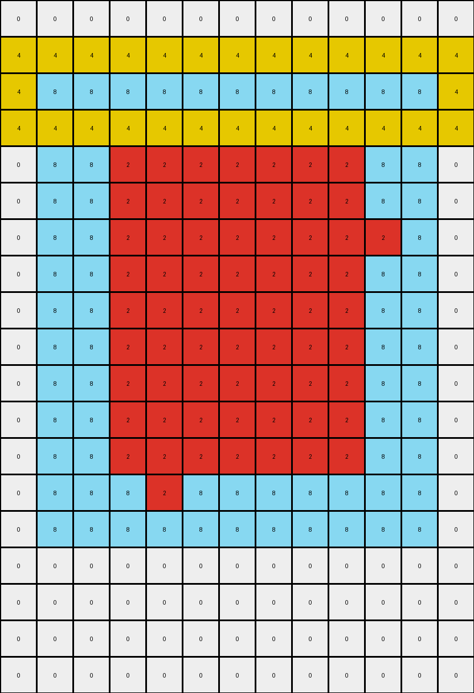
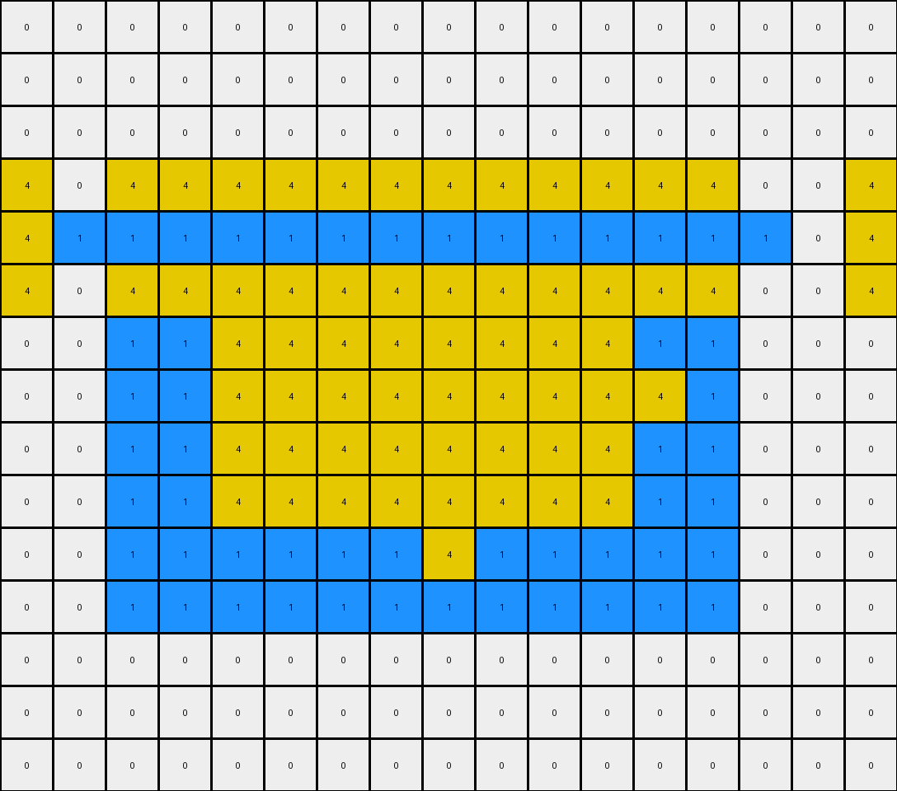
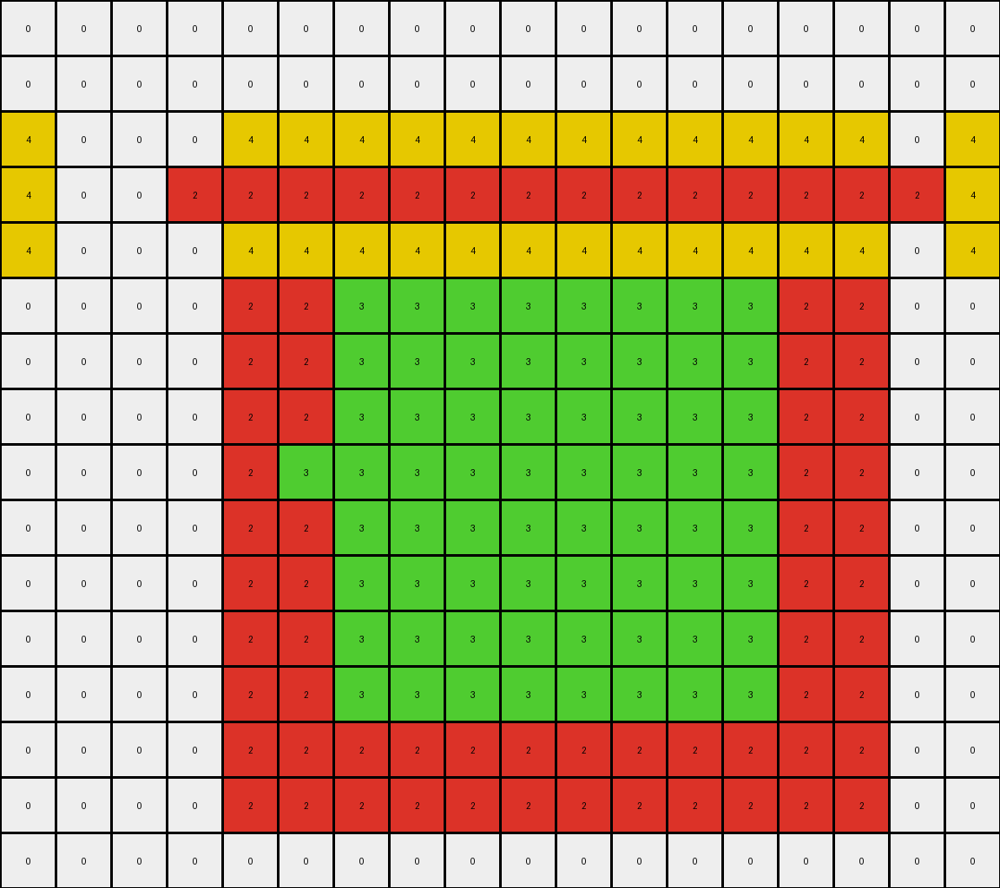

# f1cefba8 • 011 • refine_dreamer

---

Previous Code:
```python
"""
Transforms an input grid by preserving a central object's horizontal component,
extending vertical lines with yellow pixels, and modifying borders based on
the central object's rows.
"""

import numpy as np

def find_central_object(grid):
    rows, cols = grid.shape
    object_pixels = []
    min_row, max_row = rows, -1

    for r in range(rows):
        for c in range(cols):
            if grid[r, c] != 0:
                object_pixels.append((r, c))
                min_row = min(min_row, r)
                max_row = max(max_row, r)

    horizontal_line_row = -1
    horizontal_counts = {}

    for r, c in object_pixels:
      if r not in horizontal_counts:
        horizontal_counts[r] = 0
      horizontal_counts[r] += 1
    
    max_count = 0
    for r in horizontal_counts:
      if horizontal_counts[r] > max_count:
        max_count = horizontal_counts[r]
        horizontal_line_row = r

    return object_pixels, horizontal_line_row


def transform(input_grid):
    # Initialize output_grid as a copy of the input_grid
    output_grid = np.copy(input_grid)
    rows, cols = input_grid.shape

    # Find the central object and its core row (horizontal component)
    object_pixels, horizontal_line_row = find_central_object(input_grid)

    # Preserve Horizontal: keep pixels in the central horizontal line
    for r, c in object_pixels:
        if r == horizontal_line_row:
          output_grid[r,c] = input_grid[r,c]
           
    # Vertical Line Extenstion: Add yellow pixels above and below vertical lines
    vertical_cols = {}
    for r, c in object_pixels:
      if r != horizontal_line_row:
        if c not in vertical_cols:
          vertical_cols[c] = 0
        vertical_cols[c] += 1

    for c in vertical_cols:
      output_grid[horizontal_line_row -1, c] = 4
      output_grid[horizontal_line_row + 1, c] = 4      

    # Central shape adjacent row
    for r, c in object_pixels:
        if r == horizontal_line_row:
          if c > 0:
            output_grid[r, c-1] = output_grid[r, c]
          if c < cols - 1:
            output_grid[r, c+1] = output_grid[r,c]

    # Border Modification: change white columns to yellow on object rows.
    for r in range(rows):
        if input_grid[r, 0] == 0 and r >= horizontal_line_row - 1 and r <= horizontal_line_row + 1:
              output_grid[r, 0] = 4
        if input_grid[r, cols - 1] == 0 and r >= horizontal_line_row - 1 and r <= horizontal_line_row + 1:
              output_grid[r, cols - 1] = 4

    return output_grid
```

Train Set Results:

## Example 1:

Input:
```
0 0 0 0 0 0 0 0 0 0 0 0 0
0 0 0 0 0 0 0 0 0 0 0 0 0
0 8 8 8 8 8 8 8 8 8 8 8 0
0 8 8 8 8 8 8 2 8 8 8 8 0
0 8 8 2 2 2 2 2 2 2 8 8 0
0 8 8 2 2 2 2 2 2 2 8 8 0
0 8 8 2 2 2 2 2 2 2 2 8 0
0 8 8 2 2 2 2 2 2 2 8 8 0
0 8 8 2 2 2 2 2 2 2 8 8 0
0 8 8 2 2 2 2 2 2 2 8 8 0
0 8 8 2 2 2 2 2 2 2 8 8 0
0 8 8 2 2 2 2 2 2 2 8 8 0
0 8 8 2 2 2 2 2 2 2 8 8 0
0 8 8 8 2 8 8 8 8 8 8 8 0
0 8 8 8 8 8 8 8 8 8 8 8 0
0 0 0 0 0 0 0 0 0 0 0 0 0
0 0 0 0 0 0 0 0 0 0 0 0 0
0 0 0 0 0 0 0 0 0 0 0 0 0
0 0 0 0 0 0 0 0 0 0 0 0 0
```
Expected Output:
```
0 0 0 0 2 0 0 2 0 0 0 0 0
0 0 0 0 2 0 0 2 0 0 0 0 0
0 8 8 8 8 8 8 8 8 8 8 8 0
0 8 8 8 8 8 8 8 8 8 8 8 0
0 8 8 2 8 2 2 8 2 2 8 8 0
0 8 8 2 8 2 2 8 2 2 8 8 0
2 8 8 8 8 8 8 8 8 8 8 8 2
0 8 8 2 8 2 2 8 2 2 8 8 0
0 8 8 2 8 2 2 8 2 2 8 8 0
0 8 8 2 8 2 2 8 2 2 8 8 0
0 8 8 2 8 2 2 8 2 2 8 8 0
0 8 8 2 8 2 2 8 2 2 8 8 0
0 8 8 2 8 2 2 8 2 2 8 8 0
0 8 8 8 8 8 8 8 8 8 8 8 0
0 8 8 8 8 8 8 8 8 8 8 8 0
0 0 0 0 2 0 0 2 0 0 0 0 0
0 0 0 0 2 0 0 2 0 0 0 0 0
0 0 0 0 2 0 0 2 0 0 0 0 0
0 0 0 0 2 0 0 2 0 0 0 0 0
```
Transformed Output:
```
0 0 0 0 0 0 0 0 0 0 0 0 0
4 4 4 4 4 4 4 4 4 4 4 4 4
4 8 8 8 8 8 8 8 8 8 8 8 4
4 4 4 4 4 4 4 4 4 4 4 4 4
0 8 8 2 2 2 2 2 2 2 8 8 0
0 8 8 2 2 2 2 2 2 2 8 8 0
0 8 8 2 2 2 2 2 2 2 2 8 0
0 8 8 2 2 2 2 2 2 2 8 8 0
0 8 8 2 2 2 2 2 2 2 8 8 0
0 8 8 2 2 2 2 2 2 2 8 8 0
0 8 8 2 2 2 2 2 2 2 8 8 0
0 8 8 2 2 2 2 2 2 2 8 8 0
0 8 8 2 2 2 2 2 2 2 8 8 0
0 8 8 8 2 8 8 8 8 8 8 8 0
0 8 8 8 8 8 8 8 8 8 8 8 0
0 0 0 0 0 0 0 0 0 0 0 0 0
0 0 0 0 0 0 0 0 0 0 0 0 0
0 0 0 0 0 0 0 0 0 0 0 0 0
0 0 0 0 0 0 0 0 0 0 0 0 0
```

match: False
pixels_off: 65
size_correct: True
color_palette_correct: False
correct_pixel_counts: False

## Example 2:

Input:
```
0 0 0 0 0 0 0 0 0 0 0 0 0 0 0 0 0
0 0 0 0 0 0 0 0 0 0 0 0 0 0 0 0 0
0 0 0 0 0 0 0 0 0 0 0 0 0 0 0 0 0
0 0 0 0 0 0 0 0 0 0 0 0 0 0 0 0 0
0 0 1 1 1 1 1 1 1 1 1 1 1 1 0 0 0
0 0 1 1 1 1 4 1 1 1 1 1 1 1 0 0 0
0 0 1 1 4 4 4 4 4 4 4 4 1 1 0 0 0
0 0 1 1 4 4 4 4 4 4 4 4 4 1 0 0 0
0 0 1 1 4 4 4 4 4 4 4 4 1 1 0 0 0
0 0 1 1 4 4 4 4 4 4 4 4 1 1 0 0 0
0 0 1 1 1 1 1 1 4 1 1 1 1 1 0 0 0
0 0 1 1 1 1 1 1 1 1 1 1 1 1 0 0 0
0 0 0 0 0 0 0 0 0 0 0 0 0 0 0 0 0
0 0 0 0 0 0 0 0 0 0 0 0 0 0 0 0 0
0 0 0 0 0 0 0 0 0 0 0 0 0 0 0 0 0
```
Expected Output:
```
0 0 0 0 0 0 4 0 4 0 0 0 0 0 0 0 0
0 0 0 0 0 0 4 0 4 0 0 0 0 0 0 0 0
0 0 0 0 0 0 4 0 4 0 0 0 0 0 0 0 0
0 0 0 0 0 0 4 0 4 0 0 0 0 0 0 0 0
0 0 1 1 1 1 1 1 1 1 1 1 1 1 0 0 0
0 0 1 1 1 1 1 1 1 1 1 1 1 1 0 0 0
0 0 1 1 4 4 1 4 1 4 4 4 1 1 0 0 0
4 4 1 1 1 1 1 1 1 1 1 1 1 1 4 4 4
0 0 1 1 4 4 1 4 1 4 4 4 1 1 0 0 0
0 0 1 1 4 4 1 4 1 4 4 4 1 1 0 0 0
0 0 1 1 1 1 1 1 1 1 1 1 1 1 0 0 0
0 0 1 1 1 1 1 1 1 1 1 1 1 1 0 0 0
0 0 0 0 0 0 4 0 4 0 0 0 0 0 0 0 0
0 0 0 0 0 0 4 0 4 0 0 0 0 0 0 0 0
0 0 0 0 0 0 4 0 4 0 0 0 0 0 0 0 0
```
Transformed Output:
```
0 0 0 0 0 0 0 0 0 0 0 0 0 0 0 0 0
0 0 0 0 0 0 0 0 0 0 0 0 0 0 0 0 0
0 0 0 0 0 0 0 0 0 0 0 0 0 0 0 0 0
4 0 4 4 4 4 4 4 4 4 4 4 4 4 0 0 4
4 1 1 1 1 1 1 1 1 1 1 1 1 1 1 0 4
4 0 4 4 4 4 4 4 4 4 4 4 4 4 0 0 4
0 0 1 1 4 4 4 4 4 4 4 4 1 1 0 0 0
0 0 1 1 4 4 4 4 4 4 4 4 4 1 0 0 0
0 0 1 1 4 4 4 4 4 4 4 4 1 1 0 0 0
0 0 1 1 4 4 4 4 4 4 4 4 1 1 0 0 0
0 0 1 1 1 1 1 1 4 1 1 1 1 1 0 0 0
0 0 1 1 1 1 1 1 1 1 1 1 1 1 0 0 0
0 0 0 0 0 0 0 0 0 0 0 0 0 0 0 0 0
0 0 0 0 0 0 0 0 0 0 0 0 0 0 0 0 0
0 0 0 0 0 0 0 0 0 0 0 0 0 0 0 0 0
```

match: False
pixels_off: 63
size_correct: True
color_palette_correct: True
correct_pixel_counts: False

## Example 3:

Input:
```
0 0 0 0 0 0 0 0 0 0 0 0 0 0 0 0 0 0
0 0 0 0 0 0 0 0 0 0 0 0 0 0 0 0 0 0
0 0 0 0 0 0 0 0 0 0 0 0 0 0 0 0 0 0
0 0 0 0 2 2 2 2 2 2 2 2 2 2 2 2 0 0
0 0 0 0 2 2 2 2 2 2 2 3 2 2 2 2 0 0
0 0 0 0 2 2 3 3 3 3 3 3 3 3 2 2 0 0
0 0 0 0 2 2 3 3 3 3 3 3 3 3 2 2 0 0
0 0 0 0 2 2 3 3 3 3 3 3 3 3 2 2 0 0
0 0 0 0 2 3 3 3 3 3 3 3 3 3 2 2 0 0
0 0 0 0 2 2 3 3 3 3 3 3 3 3 2 2 0 0
0 0 0 0 2 2 3 3 3 3 3 3 3 3 2 2 0 0
0 0 0 0 2 2 3 3 3 3 3 3 3 3 2 2 0 0
0 0 0 0 2 2 3 3 3 3 3 3 3 3 2 2 0 0
0 0 0 0 2 2 2 2 2 2 2 2 2 2 2 2 0 0
0 0 0 0 2 2 2 2 2 2 2 2 2 2 2 2 0 0
0 0 0 0 0 0 0 0 0 0 0 0 0 0 0 0 0 0
```
Expected Output:
```
0 0 0 0 0 0 0 0 0 0 0 3 0 0 0 0 0 0
0 0 0 0 0 0 0 0 0 0 0 3 0 0 0 0 0 0
0 0 0 0 0 0 0 0 0 0 0 3 0 0 0 0 0 0
0 0 0 0 2 2 2 2 2 2 2 2 2 2 2 2 0 0
0 0 0 0 2 2 2 2 2 2 2 2 2 2 2 2 0 0
0 0 0 0 2 2 3 3 3 3 3 2 3 3 2 2 0 0
0 0 0 0 2 2 3 3 3 3 3 2 3 3 2 2 0 0
0 0 0 0 2 2 3 3 3 3 3 2 3 3 2 2 0 0
3 3 3 3 2 2 2 2 2 2 2 2 2 2 2 2 3 3
0 0 0 0 2 2 3 3 3 3 3 2 3 3 2 2 0 0
0 0 0 0 2 2 3 3 3 3 3 2 3 3 2 2 0 0
0 0 0 0 2 2 3 3 3 3 3 2 3 3 2 2 0 0
0 0 0 0 2 2 3 3 3 3 3 2 3 3 2 2 0 0
0 0 0 0 2 2 2 2 2 2 2 2 2 2 2 2 0 0
0 0 0 0 2 2 2 2 2 2 2 2 2 2 2 2 0 0
0 0 0 0 0 0 0 0 0 0 0 3 0 0 0 0 0 0
```
Transformed Output:
```
0 0 0 0 0 0 0 0 0 0 0 0 0 0 0 0 0 0
0 0 0 0 0 0 0 0 0 0 0 0 0 0 0 0 0 0
4 0 0 0 4 4 4 4 4 4 4 4 4 4 4 4 0 4
4 0 0 2 2 2 2 2 2 2 2 2 2 2 2 2 2 4
4 0 0 0 4 4 4 4 4 4 4 4 4 4 4 4 0 4
0 0 0 0 2 2 3 3 3 3 3 3 3 3 2 2 0 0
0 0 0 0 2 2 3 3 3 3 3 3 3 3 2 2 0 0
0 0 0 0 2 2 3 3 3 3 3 3 3 3 2 2 0 0
0 0 0 0 2 3 3 3 3 3 3 3 3 3 2 2 0 0
0 0 0 0 2 2 3 3 3 3 3 3 3 3 2 2 0 0
0 0 0 0 2 2 3 3 3 3 3 3 3 3 2 2 0 0
0 0 0 0 2 2 3 3 3 3 3 3 3 3 2 2 0 0
0 0 0 0 2 2 3 3 3 3 3 3 3 3 2 2 0 0
0 0 0 0 2 2 2 2 2 2 2 2 2 2 2 2 0 0
0 0 0 0 2 2 2 2 2 2 2 2 2 2 2 2 0 0
0 0 0 0 0 0 0 0 0 0 0 0 0 0 0 0 0 0
```

match: False
pixels_off: 57
size_correct: True
color_palette_correct: False
correct_pixel_counts: False
**INSTRUCTIONS**

The code above was generated based on observations from the first training
example

we have tested the transform function on each of the task example inputs and
compared with the expected output

review each of the examples provided and the results and consider how the
natural language program should be updated to accommodate this new knowledge

respond with the following deliverables:

- general assessment of the information provided and strategy for resolving the
  errors
- gather metrics about each of the examples and results - use code_execution to
  develop accurate reports on your assumptions
- a YAML block documenting facts - Focus on identifying objects, their properties, and the actions performed on them.
- a natural language program - Be as clear and concise as possible, providing a complete description of the transformation rule.


your responses should be considered as information in a report - not a
conversation
