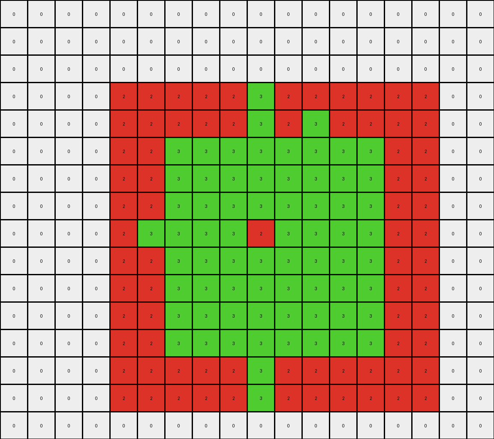

# f1cefba8 • 015 • refine_dreamer

---


Previous Code:
```python
"""
The transformation identifies an outer red rectangle and an inner green rectangle. 
The central vertical column of the inner rectangle is modified.
Green pixels are added ("creep") vertically from the center of the original green rectangle,
stopping when encountering a different color.
"""

import numpy as np

def find_object(grid, color):
    """Finds the bounding box of an object with a specific color."""
    rows, cols = np.where(grid == color)
    if len(rows) == 0:
        return None
    min_row, max_row = np.min(rows), np.max(rows)
    min_col, max_col = np.min(cols), np.max(cols)
    return (min_row, min_col), (max_row, max_col)

def get_central_column(top_left, bottom_right):
    """Calculates the central column index."""
    _, min_col = top_left
    _, max_col = bottom_right
    central_col = (min_col + max_col) // 2
    return central_col

def creeping(grid, start_row, start_col, color):
    """Adds pixels of a given color vertically from a starting point until non-matching color."""
    rows, cols = grid.shape
    # Creep upwards
    row = start_row -1
    while row >= 0:
        if grid[row,start_col] != 2:
           break;

        grid[row, start_col] = color
        row -= 1

    row = start_row + 1
    while row < rows:
        if grid[row,start_col] != 2:
           break;

        grid[row, start_col] = color
        row += 1

    return grid
    

def transform(input_grid):
    # Initialize output grid as a copy of the input grid
    output_grid = np.copy(input_grid)

    # Find the outer red rectangle
    outer_top_left, outer_bottom_right = find_object(input_grid, 2)

    # Find the inner green rectangle
    inner_top_left, inner_bottom_right = find_object(input_grid, 3)
   
    if inner_top_left is None or outer_top_left is None:
       return output_grid

    # Get the central column of the green rectangle
    central_col = get_central_column(inner_top_left, inner_bottom_right)
    inner_min_row, _ = inner_top_left
    inner_max_row, _ = inner_bottom_right

    # modify the inner object
    for row in range(inner_min_row, inner_max_row + 1):
        output_grid[row, central_col] = 2

    center_row = (inner_top_left[0] + inner_bottom_right[0]) // 2
    
    output_grid = creeping(output_grid, center_row, central_col, 3)

    return output_grid
```

Train Set Results:

## Example 1:

Input:
```
0 0 0 0 0 0 0 0 0 0 0 0 0
0 0 0 0 0 0 0 0 0 0 0 0 0
0 8 8 8 8 8 8 8 8 8 8 8 0
0 8 8 8 8 8 8 2 8 8 8 8 0
0 8 8 2 2 2 2 2 2 2 8 8 0
0 8 8 2 2 2 2 2 2 2 8 8 0
0 8 8 2 2 2 2 2 2 2 2 8 0
0 8 8 2 2 2 2 2 2 2 8 8 0
0 8 8 2 2 2 2 2 2 2 8 8 0
0 8 8 2 2 2 2 2 2 2 8 8 0
0 8 8 2 2 2 2 2 2 2 8 8 0
0 8 8 2 2 2 2 2 2 2 8 8 0
0 8 8 2 2 2 2 2 2 2 8 8 0
0 8 8 8 2 8 8 8 8 8 8 8 0
0 8 8 8 8 8 8 8 8 8 8 8 0
0 0 0 0 0 0 0 0 0 0 0 0 0
0 0 0 0 0 0 0 0 0 0 0 0 0
0 0 0 0 0 0 0 0 0 0 0 0 0
0 0 0 0 0 0 0 0 0 0 0 0 0
```
Expected Output:
```
0 0 0 0 2 0 0 2 0 0 0 0 0
0 0 0 0 2 0 0 2 0 0 0 0 0
0 8 8 8 8 8 8 8 8 8 8 8 0
0 8 8 8 8 8 8 8 8 8 8 8 0
0 8 8 2 8 2 2 8 2 2 8 8 0
0 8 8 2 8 2 2 8 2 2 8 8 0
2 8 8 8 8 8 8 8 8 8 8 8 2
0 8 8 2 8 2 2 8 2 2 8 8 0
0 8 8 2 8 2 2 8 2 2 8 8 0
0 8 8 2 8 2 2 8 2 2 8 8 0
0 8 8 2 8 2 2 8 2 2 8 8 0
0 8 8 2 8 2 2 8 2 2 8 8 0
0 8 8 2 8 2 2 8 2 2 8 8 0
0 8 8 8 8 8 8 8 8 8 8 8 0
0 8 8 8 8 8 8 8 8 8 8 8 0
0 0 0 0 2 0 0 2 0 0 0 0 0
0 0 0 0 2 0 0 2 0 0 0 0 0
0 0 0 0 2 0 0 2 0 0 0 0 0
0 0 0 0 2 0 0 2 0 0 0 0 0
```
match: ERROR: cannot unpack non-iterable NoneType object
pixels_off: None
size_correct: None
color_palette_correct: None
correct_pixel_counts: None

## Example 2:

Input:
```
0 0 0 0 0 0 0 0 0 0 0 0 0 0 0 0 0
0 0 0 0 0 0 0 0 0 0 0 0 0 0 0 0 0
0 0 0 0 0 0 0 0 0 0 0 0 0 0 0 0 0
0 0 0 0 0 0 0 0 0 0 0 0 0 0 0 0 0
0 0 1 1 1 1 1 1 1 1 1 1 1 1 0 0 0
0 0 1 1 1 1 4 1 1 1 1 1 1 1 0 0 0
0 0 1 1 4 4 4 4 4 4 4 4 1 1 0 0 0
0 0 1 1 4 4 4 4 4 4 4 4 4 1 0 0 0
0 0 1 1 4 4 4 4 4 4 4 4 1 1 0 0 0
0 0 1 1 4 4 4 4 4 4 4 4 1 1 0 0 0
0 0 1 1 1 1 1 1 4 1 1 1 1 1 0 0 0
0 0 1 1 1 1 1 1 1 1 1 1 1 1 0 0 0
0 0 0 0 0 0 0 0 0 0 0 0 0 0 0 0 0
0 0 0 0 0 0 0 0 0 0 0 0 0 0 0 0 0
0 0 0 0 0 0 0 0 0 0 0 0 0 0 0 0 0
```
Expected Output:
```
0 0 0 0 0 0 4 0 4 0 0 0 0 0 0 0 0
0 0 0 0 0 0 4 0 4 0 0 0 0 0 0 0 0
0 0 0 0 0 0 4 0 4 0 0 0 0 0 0 0 0
0 0 0 0 0 0 4 0 4 0 0 0 0 0 0 0 0
0 0 1 1 1 1 1 1 1 1 1 1 1 1 0 0 0
0 0 1 1 1 1 1 1 1 1 1 1 1 1 0 0 0
0 0 1 1 4 4 1 4 1 4 4 4 1 1 0 0 0
4 4 1 1 1 1 1 1 1 1 1 1 1 1 4 4 4
0 0 1 1 4 4 1 4 1 4 4 4 1 1 0 0 0
0 0 1 1 4 4 1 4 1 4 4 4 1 1 0 0 0
0 0 1 1 1 1 1 1 1 1 1 1 1 1 0 0 0
0 0 1 1 1 1 1 1 1 1 1 1 1 1 0 0 0
0 0 0 0 0 0 4 0 4 0 0 0 0 0 0 0 0
0 0 0 0 0 0 4 0 4 0 0 0 0 0 0 0 0
0 0 0 0 0 0 4 0 4 0 0 0 0 0 0 0 0
```
match: ERROR: cannot unpack non-iterable NoneType object
pixels_off: None
size_correct: None
color_palette_correct: None
correct_pixel_counts: None

## Example 3:

Input:
```
0 0 0 0 0 0 0 0 0 0 0 0 0 0 0 0 0 0
0 0 0 0 0 0 0 0 0 0 0 0 0 0 0 0 0 0
0 0 0 0 0 0 0 0 0 0 0 0 0 0 0 0 0 0
0 0 0 0 2 2 2 2 2 2 2 2 2 2 2 2 0 0
0 0 0 0 2 2 2 2 2 2 2 3 2 2 2 2 0 0
0 0 0 0 2 2 3 3 3 3 3 3 3 3 2 2 0 0
0 0 0 0 2 2 3 3 3 3 3 3 3 3 2 2 0 0
0 0 0 0 2 2 3 3 3 3 3 3 3 3 2 2 0 0
0 0 0 0 2 3 3 3 3 3 3 3 3 3 2 2 0 0
0 0 0 0 2 2 3 3 3 3 3 3 3 3 2 2 0 0
0 0 0 0 2 2 3 3 3 3 3 3 3 3 2 2 0 0
0 0 0 0 2 2 3 3 3 3 3 3 3 3 2 2 0 0
0 0 0 0 2 2 3 3 3 3 3 3 3 3 2 2 0 0
0 0 0 0 2 2 2 2 2 2 2 2 2 2 2 2 0 0
0 0 0 0 2 2 2 2 2 2 2 2 2 2 2 2 0 0
0 0 0 0 0 0 0 0 0 0 0 0 0 0 0 0 0 0
```
Expected Output:
```
0 0 0 0 0 0 0 0 0 0 0 3 0 0 0 0 0 0
0 0 0 0 0 0 0 0 0 0 0 3 0 0 0 0 0 0
0 0 0 0 0 0 0 0 0 0 0 3 0 0 0 0 0 0
0 0 0 0 2 2 2 2 2 2 2 2 2 2 2 2 0 0
0 0 0 0 2 2 2 2 2 2 2 2 2 2 2 2 0 0
0 0 0 0 2 2 3 3 3 3 3 2 3 3 2 2 0 0
0 0 0 0 2 2 3 3 3 3 3 2 3 3 2 2 0 0
0 0 0 0 2 2 3 3 3 3 3 2 3 3 2 2 0 0
3 3 3 3 2 2 2 2 2 2 2 2 2 2 2 2 3 3
0 0 0 0 2 2 3 3 3 3 3 2 3 3 2 2 0 0
0 0 0 0 2 2 3 3 3 3 3 2 3 3 2 2 0 0
0 0 0 0 2 2 3 3 3 3 3 2 3 3 2 2 0 0
0 0 0 0 2 2 3 3 3 3 3 2 3 3 2 2 0 0
0 0 0 0 2 2 2 2 2 2 2 2 2 2 2 2 0 0
0 0 0 0 2 2 2 2 2 2 2 2 2 2 2 2 0 0
0 0 0 0 0 0 0 0 0 0 0 3 0 0 0 0 0 0
```
Transformed Output:
```
0 0 0 0 0 0 0 0 0 0 0 0 0 0 0 0 0 0
0 0 0 0 0 0 0 0 0 0 0 0 0 0 0 0 0 0
0 0 0 0 0 0 0 0 0 0 0 0 0 0 0 0 0 0
0 0 0 0 2 2 2 2 2 3 2 2 2 2 2 2 0 0
0 0 0 0 2 2 2 2 2 3 2 3 2 2 2 2 0 0
0 0 0 0 2 2 3 3 3 3 3 3 3 3 2 2 0 0
0 0 0 0 2 2 3 3 3 3 3 3 3 3 2 2 0 0
0 0 0 0 2 2 3 3 3 3 3 3 3 3 2 2 0 0
0 0 0 0 2 3 3 3 3 2 3 3 3 3 2 2 0 0
0 0 0 0 2 2 3 3 3 3 3 3 3 3 2 2 0 0
0 0 0 0 2 2 3 3 3 3 3 3 3 3 2 2 0 0
0 0 0 0 2 2 3 3 3 3 3 3 3 3 2 2 0 0
0 0 0 0 2 2 3 3 3 3 3 3 3 3 2 2 0 0
0 0 0 0 2 2 2 2 2 3 2 2 2 2 2 2 0 0
0 0 0 0 2 2 2 2 2 3 2 2 2 2 2 2 0 0
0 0 0 0 0 0 0 0 0 0 0 0 0 0 0 0 0 0
```

match: False
pixels_off: 30
size_correct: True
color_palette_correct: True
correct_pixel_counts: False

**INSTRUCTIONS**

The code above was generated based on observations from the first training
example

we have tested the transform function on each of the task example inputs and
compared with the expected output

review each of the examples provided and the results and consider how the
natural language program should be updated to accommodate this new knowledge

respond with the following deliverables:

- general assessment of the information provided and strategy for resolving the
  errors
- gather metrics about each of the examples and results - use code_execution to
  develop accurate reports on your assumptions
- a YAML block documenting facts - Focus on identifying objects, their properties, and the actions performed on them.
- a natural language program - Be as clear and concise as possible, providing a complete description of the transformation rule.


your responses should be considered as information in a report - not a
conversation
