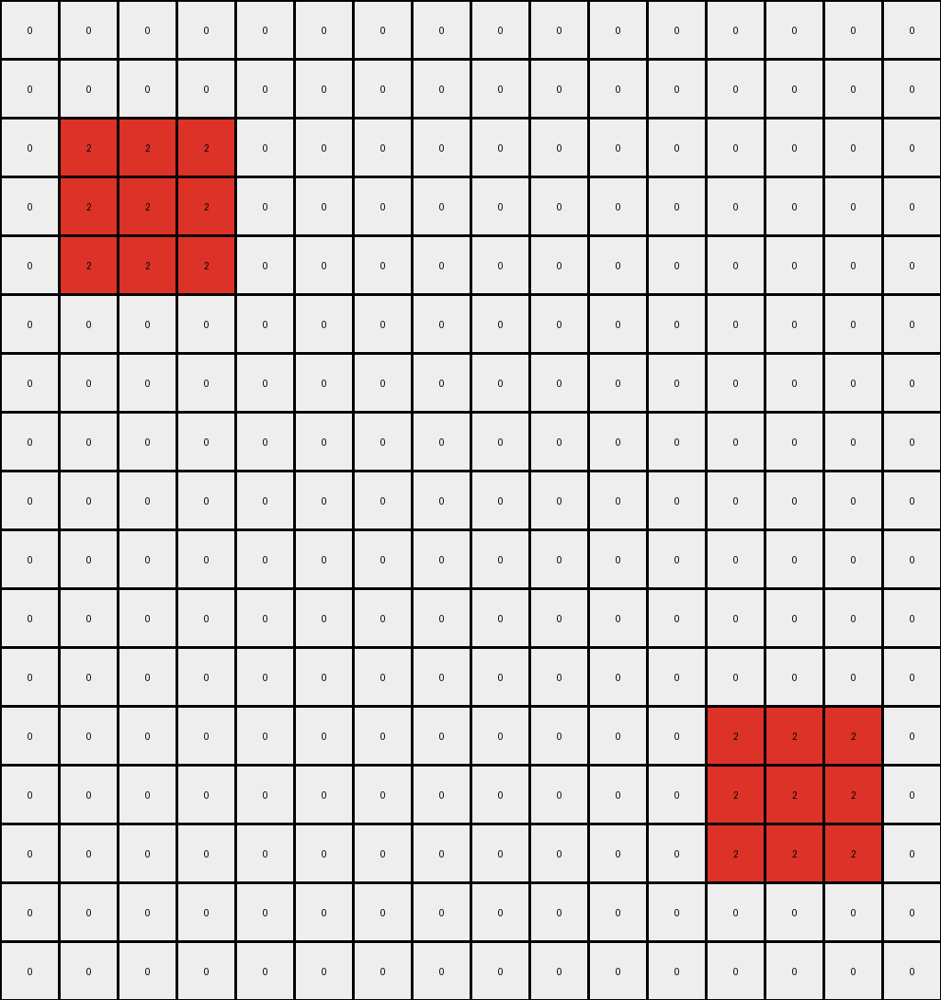

# f35d900a • 003 • refine_dreamer

---


Previous Code:
```python
"""
1.  **Identify Initial Positions:** Locate all red (2) and green (3) pixels in the input grid.

2.  **Expand:** For each red and green pixel, create a 3x3 block of the same color centered on the original pixel's location in the output grid. If the edges go beyond the sides, then stop there.

3.  **Overlap (Interaction):** Where the expanded 3x3 regions of red and green pixels overlap, replace those pixels in the output grid with gray (5) pixels.

4.  **Fill**: keep the rest of the grid as the same, white (0) pixels
"""

import numpy as np

def get_pixels_by_color(grid, color):
    """Finds the positions of all pixels of a given color."""
    return np.argwhere(grid == color)

def expand_pixel(grid, position, color):
    """Expands a pixel into a 3x3 block."""
    rows, cols = grid.shape
    row, col = position
    for i in range(max(0, row - 1), min(rows, row + 2)):
        for j in range(max(0, col - 1), min(cols, col + 2)):
            grid[i, j] = color
    return grid

def transform(input_grid):
    """Transforms the input grid according to the defined rules."""

    # Initialize output_grid as a copy of the input grid
    output_grid = np.copy(input_grid)

    # Get initial positions of red and green pixels
    red_pixels = get_pixels_by_color(input_grid, 2)
    green_pixels = get_pixels_by_color(input_grid, 3)
    
    # Expand the red and green pixels first, store in temp grids for overlap
    expanded_red_grid = np.copy(input_grid)
    for pos in red_pixels:
       expanded_red_grid =  expand_pixel(expanded_red_grid, pos, 2)
       
    expanded_green_grid = np.copy(input_grid)
    for pos in green_pixels:
        expanded_green_grid = expand_pixel(expanded_green_grid, pos, 3)

    # combine expanded red and green and create gray
    for i in range(output_grid.shape[0]):
        for j in range(output_grid.shape[1]):
            if(expanded_red_grid[i,j] == 2 and expanded_green_grid[i,j] == 3):
                output_grid[i,j] = 5
            elif(expanded_red_grid[i,j] == 2):
                output_grid[i,j] = 2
            elif(expanded_green_grid[i,j] == 3):
                output_grid[i,j] = 3
            else:
                output_grid[i,j] = 0 # keep existing background

    return output_grid
```

Train Set Results:

## Example 1:

Input:
```
0 0 0 0 0 0 0 0 0 0 0 0 0 0
0 0 0 0 0 0 0 0 0 0 0 0 0 0
0 2 0 0 0 0 3 0 0 0 0 0 0 0
0 0 0 0 0 0 0 0 0 0 0 0 0 0
0 0 0 0 0 0 0 0 0 0 0 0 0 0
0 0 0 0 0 0 0 0 0 0 0 0 0 0
0 0 0 0 0 0 0 0 0 0 0 0 0 0
0 0 0 0 0 0 0 0 0 0 0 0 0 0
0 3 0 0 0 0 2 0 0 0 0 0 0 0
0 0 0 0 0 0 0 0 0 0 0 0 0 0
0 0 0 0 0 0 0 0 0 0 0 0 0 0
0 0 0 0 0 0 0 0 0 0 0 0 0 0
0 0 0 0 0 0 0 0 0 0 0 0 0 0
0 0 0 0 0 0 0 0 0 0 0 0 0 0
```
Expected Output:
```
0 0 0 0 0 0 0 0 0 0 0 0 0 0
3 3 3 0 0 2 2 2 0 0 0 0 0 0
3 2 3 5 5 2 3 2 0 0 0 0 0 0
3 3 3 0 0 2 2 2 0 0 0 0 0 0
0 5 0 0 0 0 5 0 0 0 0 0 0 0
0 0 0 0 0 0 0 0 0 0 0 0 0 0
0 5 0 0 0 0 5 0 0 0 0 0 0 0
2 2 2 0 0 3 3 3 0 0 0 0 0 0
2 3 2 5 5 3 2 3 0 0 0 0 0 0
2 2 2 0 0 3 3 3 0 0 0 0 0 0
0 0 0 0 0 0 0 0 0 0 0 0 0 0
0 0 0 0 0 0 0 0 0 0 0 0 0 0
0 0 0 0 0 0 0 0 0 0 0 0 0 0
0 0 0 0 0 0 0 0 0 0 0 0 0 0
```
Transformed Output:
```
0 0 0 0 0 0 0 0 0 0 0 0 0 0
2 2 2 0 0 3 3 3 0 0 0 0 0 0
2 2 2 0 0 3 3 3 0 0 0 0 0 0
2 2 2 0 0 3 3 3 0 0 0 0 0 0
0 0 0 0 0 0 0 0 0 0 0 0 0 0
0 0 0 0 0 0 0 0 0 0 0 0 0 0
0 0 0 0 0 0 0 0 0 0 0 0 0 0
3 3 3 0 0 2 2 2 0 0 0 0 0 0
3 3 3 0 0 2 2 2 0 0 0 0 0 0
3 3 3 0 0 2 2 2 0 0 0 0 0 0
0 0 0 0 0 0 0 0 0 0 0 0 0 0
0 0 0 0 0 0 0 0 0 0 0 0 0 0
0 0 0 0 0 0 0 0 0 0 0 0 0 0
0 0 0 0 0 0 0 0 0 0 0 0 0 0
```

match: False
pixels_off: 40
size_correct: True
color_palette_correct: True
correct_pixel_counts: False

## Example 2:

Input:
```
0 0 0 0 0 0 0 0 0 0 0 0 0 0
0 0 0 0 0 0 0 0 0 0 0 0 0 0
0 0 0 0 0 0 0 0 0 0 0 0 0 0
0 0 1 0 0 0 0 0 0 0 8 0 0 0
0 0 0 0 0 0 0 0 0 0 0 0 0 0
0 0 0 0 0 0 0 0 0 0 0 0 0 0
0 0 0 0 0 0 0 0 0 0 0 0 0 0
0 0 0 0 0 0 0 0 0 0 0 0 0 0
0 0 0 0 0 0 0 0 0 0 0 0 0 0
0 0 0 0 0 0 0 0 0 0 0 0 0 0
0 0 0 0 0 0 0 0 0 0 0 0 0 0
0 0 0 0 0 0 0 0 0 0 0 0 0 0
0 0 0 0 0 0 0 0 0 0 0 0 0 0
0 0 0 0 0 0 0 0 0 0 0 0 0 0
0 0 8 0 0 0 0 0 0 0 1 0 0 0
0 0 0 0 0 0 0 0 0 0 0 0 0 0
0 0 0 0 0 0 0 0 0 0 0 0 0 0
```
Expected Output:
```
0 0 0 0 0 0 0 0 0 0 0 0 0 0
0 0 0 0 0 0 0 0 0 0 0 0 0 0
0 8 8 8 0 0 0 0 0 1 1 1 0 0
0 8 1 8 5 0 5 0 5 1 8 1 0 0
0 8 8 8 0 0 0 0 0 1 1 1 0 0
0 0 5 0 0 0 0 0 0 0 5 0 0 0
0 0 0 0 0 0 0 0 0 0 0 0 0 0
0 0 5 0 0 0 0 0 0 0 5 0 0 0
0 0 0 0 0 0 0 0 0 0 0 0 0 0
0 0 0 0 0 0 0 0 0 0 0 0 0 0
0 0 5 0 0 0 0 0 0 0 5 0 0 0
0 0 0 0 0 0 0 0 0 0 0 0 0 0
0 0 5 0 0 0 0 0 0 0 5 0 0 0
0 1 1 1 0 0 0 0 0 8 8 8 0 0
0 1 8 1 5 0 5 0 5 8 1 8 0 0
0 1 1 1 0 0 0 0 0 8 8 8 0 0
0 0 0 0 0 0 0 0 0 0 0 0 0 0
```
Transformed Output:
```
0 0 0 0 0 0 0 0 0 0 0 0 0 0
0 0 0 0 0 0 0 0 0 0 0 0 0 0
0 0 0 0 0 0 0 0 0 0 0 0 0 0
0 0 0 0 0 0 0 0 0 0 0 0 0 0
0 0 0 0 0 0 0 0 0 0 0 0 0 0
0 0 0 0 0 0 0 0 0 0 0 0 0 0
0 0 0 0 0 0 0 0 0 0 0 0 0 0
0 0 0 0 0 0 0 0 0 0 0 0 0 0
0 0 0 0 0 0 0 0 0 0 0 0 0 0
0 0 0 0 0 0 0 0 0 0 0 0 0 0
0 0 0 0 0 0 0 0 0 0 0 0 0 0
0 0 0 0 0 0 0 0 0 0 0 0 0 0
0 0 0 0 0 0 0 0 0 0 0 0 0 0
0 0 0 0 0 0 0 0 0 0 0 0 0 0
0 0 0 0 0 0 0 0 0 0 0 0 0 0
0 0 0 0 0 0 0 0 0 0 0 0 0 0
0 0 0 0 0 0 0 0 0 0 0 0 0 0
```

match: False
pixels_off: 50
size_correct: True
color_palette_correct: True
correct_pixel_counts: False

## Example 3:

Input:
```
0 0 0 0 0 0 0 0 0 0 0 0 0 0 0 0
0 0 0 0 0 0 0 0 0 0 0 0 0 0 0 0
0 0 0 0 0 0 0 0 0 0 0 0 0 0 0 0
0 0 2 0 0 0 0 0 0 0 0 0 0 4 0 0
0 0 0 0 0 0 0 0 0 0 0 0 0 0 0 0
0 0 0 0 0 0 0 0 0 0 0 0 0 0 0 0
0 0 0 0 0 0 0 0 0 0 0 0 0 0 0 0
0 0 0 0 0 0 0 0 0 0 0 0 0 0 0 0
0 0 0 0 0 0 0 0 0 0 0 0 0 0 0 0
0 0 0 0 0 0 0 0 0 0 0 0 0 0 0 0
0 0 0 0 0 0 0 0 0 0 0 0 0 0 0 0
0 0 0 0 0 0 0 0 0 0 0 0 0 0 0 0
0 0 0 0 0 0 0 0 0 0 0 0 0 0 0 0
0 0 4 0 0 0 0 0 0 0 0 0 0 2 0 0
0 0 0 0 0 0 0 0 0 0 0 0 0 0 0 0
0 0 0 0 0 0 0 0 0 0 0 0 0 0 0 0
0 0 0 0 0 0 0 0 0 0 0 0 0 0 0 0
```
Expected Output:
```
0 0 0 0 0 0 0 0 0 0 0 0 0 0 0 0
0 0 0 0 0 0 0 0 0 0 0 0 0 0 0 0
0 4 4 4 0 0 0 0 0 0 0 0 2 2 2 0
0 4 2 4 5 0 5 0 0 5 0 5 2 4 2 0
0 4 4 4 0 0 0 0 0 0 0 0 2 2 2 0
0 0 5 0 0 0 0 0 0 0 0 0 0 5 0 0
0 0 0 0 0 0 0 0 0 0 0 0 0 0 0 0
0 0 5 0 0 0 0 0 0 0 0 0 0 5 0 0
0 0 0 0 0 0 0 0 0 0 0 0 0 0 0 0
0 0 5 0 0 0 0 0 0 0 0 0 0 5 0 0
0 0 0 0 0 0 0 0 0 0 0 0 0 0 0 0
0 0 5 0 0 0 0 0 0 0 0 0 0 5 0 0
0 2 2 2 0 0 0 0 0 0 0 0 4 4 4 0
0 2 4 2 5 0 5 0 0 5 0 5 4 2 4 0
0 2 2 2 0 0 0 0 0 0 0 0 4 4 4 0
0 0 0 0 0 0 0 0 0 0 0 0 0 0 0 0
0 0 0 0 0 0 0 0 0 0 0 0 0 0 0 0
```
Transformed Output:
```
0 0 0 0 0 0 0 0 0 0 0 0 0 0 0 0
0 0 0 0 0 0 0 0 0 0 0 0 0 0 0 0
0 2 2 2 0 0 0 0 0 0 0 0 0 0 0 0
0 2 2 2 0 0 0 0 0 0 0 0 0 0 0 0
0 2 2 2 0 0 0 0 0 0 0 0 0 0 0 0
0 0 0 0 0 0 0 0 0 0 0 0 0 0 0 0
0 0 0 0 0 0 0 0 0 0 0 0 0 0 0 0
0 0 0 0 0 0 0 0 0 0 0 0 0 0 0 0
0 0 0 0 0 0 0 0 0 0 0 0 0 0 0 0
0 0 0 0 0 0 0 0 0 0 0 0 0 0 0 0
0 0 0 0 0 0 0 0 0 0 0 0 0 0 0 0
0 0 0 0 0 0 0 0 0 0 0 0 0 0 0 0
0 0 0 0 0 0 0 0 0 0 0 0 2 2 2 0
0 0 0 0 0 0 0 0 0 0 0 0 2 2 2 0
0 0 0 0 0 0 0 0 0 0 0 0 2 2 2 0
0 0 0 0 0 0 0 0 0 0 0 0 0 0 0 0
0 0 0 0 0 0 0 0 0 0 0 0 0 0 0 0
```

match: False
pixels_off: 50
size_correct: True
color_palette_correct: True
correct_pixel_counts: False

## Example 4:

Input:
```
0 0 0 0 0 0 0 0 0 0 0 0 0 0 0 0
0 0 0 0 0 0 0 0 0 0 0 0 0 0 0 0
0 0 0 0 0 0 0 0 0 0 0 0 0 0 0 0
0 0 0 0 3 0 0 0 0 0 0 0 8 0 0 0
0 0 0 0 0 0 0 0 0 0 0 0 0 0 0 0
0 0 0 0 0 0 0 0 0 0 0 0 0 0 0 0
0 0 0 0 0 0 0 0 0 0 0 0 0 0 0 0
0 0 0 0 0 0 0 0 0 0 0 0 0 0 0 0
0 0 0 0 8 0 0 0 0 0 0 0 3 0 0 0
0 0 0 0 0 0 0 0 0 0 0 0 0 0 0 0
0 0 0 0 0 0 0 0 0 0 0 0 0 0 0 0
0 0 0 0 0 0 0 0 0 0 0 0 0 0 0 0
0 0 0 0 0 0 0 0 0 0 0 0 0 0 0 0
0 0 0 0 0 0 0 0 0 0 0 0 0 0 0 0
0 0 0 0 0 0 0 0 0 0 0 0 0 0 0 0
0 0 0 0 0 0 0 0 0 0 0 0 0 0 0 0
0 0 0 0 0 0 0 0 0 0 0 0 0 0 0 0
```
Expected Output:
```
0 0 0 0 0 0 0 0 0 0 0 0 0 0 0 0
0 0 0 0 0 0 0 0 0 0 0 0 0 0 0 0
0 0 0 8 8 8 0 0 0 0 0 3 3 3 0 0
0 0 0 8 3 8 5 0 5 0 5 3 8 3 0 0
0 0 0 8 8 8 0 0 0 0 0 3 3 3 0 0
0 0 0 0 5 0 0 0 0 0 0 0 5 0 0 0
0 0 0 0 5 0 0 0 0 0 0 0 5 0 0 0
0 0 0 3 3 3 0 0 0 0 0 8 8 8 0 0
0 0 0 3 8 3 5 0 5 0 5 8 3 8 0 0
0 0 0 3 3 3 0 0 0 0 0 8 8 8 0 0
0 0 0 0 0 0 0 0 0 0 0 0 0 0 0 0
0 0 0 0 0 0 0 0 0 0 0 0 0 0 0 0
0 0 0 0 0 0 0 0 0 0 0 0 0 0 0 0
0 0 0 0 0 0 0 0 0 0 0 0 0 0 0 0
0 0 0 0 0 0 0 0 0 0 0 0 0 0 0 0
0 0 0 0 0 0 0 0 0 0 0 0 0 0 0 0
0 0 0 0 0 0 0 0 0 0 0 0 0 0 0 0
```
Transformed Output:
```
0 0 0 0 0 0 0 0 0 0 0 0 0 0 0 0
0 0 0 0 0 0 0 0 0 0 0 0 0 0 0 0
0 0 0 3 3 3 0 0 0 0 0 0 0 0 0 0
0 0 0 3 3 3 0 0 0 0 0 0 0 0 0 0
0 0 0 3 3 3 0 0 0 0 0 0 0 0 0 0
0 0 0 0 0 0 0 0 0 0 0 0 0 0 0 0
0 0 0 0 0 0 0 0 0 0 0 0 0 0 0 0
0 0 0 0 0 0 0 0 0 0 0 3 3 3 0 0
0 0 0 0 0 0 0 0 0 0 0 3 3 3 0 0
0 0 0 0 0 0 0 0 0 0 0 3 3 3 0 0
0 0 0 0 0 0 0 0 0 0 0 0 0 0 0 0
0 0 0 0 0 0 0 0 0 0 0 0 0 0 0 0
0 0 0 0 0 0 0 0 0 0 0 0 0 0 0 0
0 0 0 0 0 0 0 0 0 0 0 0 0 0 0 0
0 0 0 0 0 0 0 0 0 0 0 0 0 0 0 0
0 0 0 0 0 0 0 0 0 0 0 0 0 0 0 0
0 0 0 0 0 0 0 0 0 0 0 0 0 0 0 0
```

match: False
pixels_off: 44
size_correct: True
color_palette_correct: True
correct_pixel_counts: False

**INSTRUCTIONS**

The code above was generated based on observations from the first training
example

we have tested the transform function on each of the task example inputs and
compared with the expected output

review each of the examples provided and the results and consider how the
natural language program should be updated to accommodate this new knowledge

respond with the following deliverables:

- general assessment of the information provided and strategy for resolving the
  errors
- gather metrics about each of the examples and results - use code_execution to
  develop accurate reports on your assumptions
- a YAML block documenting facts - Focus on identifying objects, their properties, and the actions performed on them.
- a natural language program - Be as clear and concise as possible, providing a complete description of the transformation rule.


your responses should be considered as information in a report - not a
conversation
