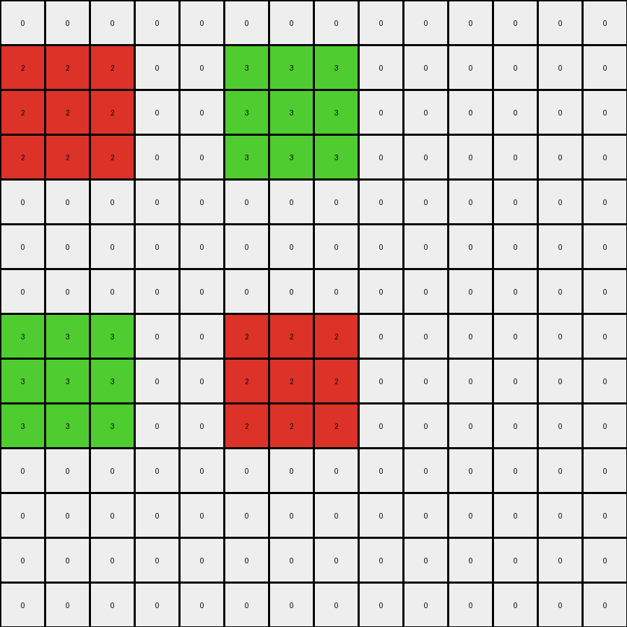

# f35d900a • 006 • refine_coder

---

Previous Code:
```python
"""
1.  **Identify Colored Pixels:** Locate all pixels in the input grid that are *not* white (0).
2.  **Expand Each:** For *each* of these non-white pixels, create a 3x3 block in the output grid. The original pixel's color should be used for its entire 3x3 block. The 3x3 block should be centered on the original pixel's location. If this expansion would go past the edge of the input, constrain it to stop at the border.
3.  **Handle Overlaps:** After *all* expansions are complete, check for any overlapping pixels (pixels where multiple expanded blocks have a non-white color). For *all* of these overlapping pixels, set their color in the output grid to gray (5).
4. **Maintain background:** all un-affected pixels should stay white (0)
"""

import numpy as np

def get_pixels_by_color(grid, color):
    """Finds the positions of all pixels of a given color."""
    return np.argwhere(grid == color)

def get_non_white_pixels(grid):
    """Finds the positions of all non-white pixels."""
    return np.argwhere(grid != 0)

def expand_pixel(grid, position, color):
    """Expands a pixel into a 3x3 block, constrained by grid boundaries."""
    rows, cols = grid.shape
    row, col = position
    for i in range(max(0, row - 1), min(rows, row + 2)):
        for j in range(max(0, col - 1), min(cols, col + 2)):
            grid[i, j] = color
    return grid

def transform(input_grid):
    """Transforms the input grid according to the defined rules."""

    # Initialize output_grid as all white
    output_grid = np.zeros_like(input_grid)
    output_grid[:] = 0 # Explicitly set to white

    # Create a temporary grid to store expanded pixels before overlap check
    temp_grid = np.zeros_like(input_grid)

    # Get initial positions of all non-white pixels
    non_white_pixels = get_non_white_pixels(input_grid)

    # Expand each non-white pixel in the temporary grid
    for pos in non_white_pixels:
        color = input_grid[pos[0], pos[1]]
        temp_grid = expand_pixel(temp_grid, pos, color)

    # Iterate through the temp_grid to build the output and handle overlaps
    for i in range(output_grid.shape[0]):
      for j in range(output_grid.shape[1]):
        if temp_grid[i,j] != 0:
            output_grid[i,j] = temp_grid[i,j]
    
    # find overlaps and replace with color (5) gray
    for i in range(output_grid.shape[0]):
        for j in range(output_grid.shape[1]):
            pixel_count = 0
            for pos in non_white_pixels:
              color = input_grid[pos[0], pos[1]]
              expanded_grid = np.zeros_like(input_grid)
              expanded_grid = expand_pixel(expanded_grid, pos, color)
              if expanded_grid[i,j] != 0:
                pixel_count+=1
            if pixel_count > 1:
              output_grid[i,j] = 5

    return output_grid
```

Train Set Results:

## Example 1:

Input:
```
0 0 0 0 0 0 0 0 0 0 0 0 0 0
0 0 0 0 0 0 0 0 0 0 0 0 0 0
0 2 0 0 0 0 3 0 0 0 0 0 0 0
0 0 0 0 0 0 0 0 0 0 0 0 0 0
0 0 0 0 0 0 0 0 0 0 0 0 0 0
0 0 0 0 0 0 0 0 0 0 0 0 0 0
0 0 0 0 0 0 0 0 0 0 0 0 0 0
0 0 0 0 0 0 0 0 0 0 0 0 0 0
0 3 0 0 0 0 2 0 0 0 0 0 0 0
0 0 0 0 0 0 0 0 0 0 0 0 0 0
0 0 0 0 0 0 0 0 0 0 0 0 0 0
0 0 0 0 0 0 0 0 0 0 0 0 0 0
0 0 0 0 0 0 0 0 0 0 0 0 0 0
0 0 0 0 0 0 0 0 0 0 0 0 0 0
```
Expected Output:
```
0 0 0 0 0 0 0 0 0 0 0 0 0 0
3 3 3 0 0 2 2 2 0 0 0 0 0 0
3 2 3 5 5 2 3 2 0 0 0 0 0 0
3 3 3 0 0 2 2 2 0 0 0 0 0 0
0 5 0 0 0 0 5 0 0 0 0 0 0 0
0 0 0 0 0 0 0 0 0 0 0 0 0 0
0 5 0 0 0 0 5 0 0 0 0 0 0 0
2 2 2 0 0 3 3 3 0 0 0 0 0 0
2 3 2 5 5 3 2 3 0 0 0 0 0 0
2 2 2 0 0 3 3 3 0 0 0 0 0 0
0 0 0 0 0 0 0 0 0 0 0 0 0 0
0 0 0 0 0 0 0 0 0 0 0 0 0 0
0 0 0 0 0 0 0 0 0 0 0 0 0 0
0 0 0 0 0 0 0 0 0 0 0 0 0 0
```
Transformed Output:
```
0 0 0 0 0 0 0 0 0 0 0 0 0 0
2 2 2 0 0 3 3 3 0 0 0 0 0 0
2 2 2 0 0 3 3 3 0 0 0 0 0 0
2 2 2 0 0 3 3 3 0 0 0 0 0 0
0 0 0 0 0 0 0 0 0 0 0 0 0 0
0 0 0 0 0 0 0 0 0 0 0 0 0 0
0 0 0 0 0 0 0 0 0 0 0 0 0 0
3 3 3 0 0 2 2 2 0 0 0 0 0 0
3 3 3 0 0 2 2 2 0 0 0 0 0 0
3 3 3 0 0 2 2 2 0 0 0 0 0 0
0 0 0 0 0 0 0 0 0 0 0 0 0 0
0 0 0 0 0 0 0 0 0 0 0 0 0 0
0 0 0 0 0 0 0 0 0 0 0 0 0 0
0 0 0 0 0 0 0 0 0 0 0 0 0 0
```

match: False
pixels_off: 40
size_correct: True
color_palette_correct: True
correct_pixel_counts: False

## Example 2:

Input:
```
0 0 0 0 0 0 0 0 0 0 0 0 0 0
0 0 0 0 0 0 0 0 0 0 0 0 0 0
0 0 0 0 0 0 0 0 0 0 0 0 0 0
0 0 1 0 0 0 0 0 0 0 8 0 0 0
0 0 0 0 0 0 0 0 0 0 0 0 0 0
0 0 0 0 0 0 0 0 0 0 0 0 0 0
0 0 0 0 0 0 0 0 0 0 0 0 0 0
0 0 0 0 0 0 0 0 0 0 0 0 0 0
0 0 0 0 0 0 0 0 0 0 0 0 0 0
0 0 0 0 0 0 0 0 0 0 0 0 0 0
0 0 0 0 0 0 0 0 0 0 0 0 0 0
0 0 0 0 0 0 0 0 0 0 0 0 0 0
0 0 0 0 0 0 0 0 0 0 0 0 0 0
0 0 0 0 0 0 0 0 0 0 0 0 0 0
0 0 8 0 0 0 0 0 0 0 1 0 0 0
0 0 0 0 0 0 0 0 0 0 0 0 0 0
0 0 0 0 0 0 0 0 0 0 0 0 0 0
```
Expected Output:
```
0 0 0 0 0 0 0 0 0 0 0 0 0 0
0 0 0 0 0 0 0 0 0 0 0 0 0 0
0 8 8 8 0 0 0 0 0 1 1 1 0 0
0 8 1 8 5 0 5 0 5 1 8 1 0 0
0 8 8 8 0 0 0 0 0 1 1 1 0 0
0 0 5 0 0 0 0 0 0 0 5 0 0 0
0 0 0 0 0 0 0 0 0 0 0 0 0 0
0 0 5 0 0 0 0 0 0 0 5 0 0 0
0 0 0 0 0 0 0 0 0 0 0 0 0 0
0 0 0 0 0 0 0 0 0 0 0 0 0 0
0 0 5 0 0 0 0 0 0 0 5 0 0 0
0 0 0 0 0 0 0 0 0 0 0 0 0 0
0 0 5 0 0 0 0 0 0 0 5 0 0 0
0 1 1 1 0 0 0 0 0 8 8 8 0 0
0 1 8 1 5 0 5 0 5 8 1 8 0 0
0 1 1 1 0 0 0 0 0 8 8 8 0 0
0 0 0 0 0 0 0 0 0 0 0 0 0 0
```
Transformed Output:
```
0 0 0 0 0 0 0 0 0 0 0 0 0 0
0 0 0 0 0 0 0 0 0 0 0 0 0 0
0 1 1 1 0 0 0 0 0 8 8 8 0 0
0 1 1 1 0 0 0 0 0 8 8 8 0 0
0 1 1 1 0 0 0 0 0 8 8 8 0 0
0 0 0 0 0 0 0 0 0 0 0 0 0 0
0 0 0 0 0 0 0 0 0 0 0 0 0 0
0 0 0 0 0 0 0 0 0 0 0 0 0 0
0 0 0 0 0 0 0 0 0 0 0 0 0 0
0 0 0 0 0 0 0 0 0 0 0 0 0 0
0 0 0 0 0 0 0 0 0 0 0 0 0 0
0 0 0 0 0 0 0 0 0 0 0 0 0 0
0 0 0 0 0 0 0 0 0 0 0 0 0 0
0 8 8 8 0 0 0 0 0 1 1 1 0 0
0 8 8 8 0 0 0 0 0 1 1 1 0 0
0 8 8 8 0 0 0 0 0 1 1 1 0 0
0 0 0 0 0 0 0 0 0 0 0 0 0 0
```

match: False
pixels_off: 46
size_correct: True
color_palette_correct: True
correct_pixel_counts: False

## Example 3:

Input:
```
0 0 0 0 0 0 0 0 0 0 0 0 0 0 0 0
0 0 0 0 0 0 0 0 0 0 0 0 0 0 0 0
0 0 0 0 0 0 0 0 0 0 0 0 0 0 0 0
0 0 2 0 0 0 0 0 0 0 0 0 0 4 0 0
0 0 0 0 0 0 0 0 0 0 0 0 0 0 0 0
0 0 0 0 0 0 0 0 0 0 0 0 0 0 0 0
0 0 0 0 0 0 0 0 0 0 0 0 0 0 0 0
0 0 0 0 0 0 0 0 0 0 0 0 0 0 0 0
0 0 0 0 0 0 0 0 0 0 0 0 0 0 0 0
0 0 0 0 0 0 0 0 0 0 0 0 0 0 0 0
0 0 0 0 0 0 0 0 0 0 0 0 0 0 0 0
0 0 0 0 0 0 0 0 0 0 0 0 0 0 0 0
0 0 0 0 0 0 0 0 0 0 0 0 0 0 0 0
0 0 4 0 0 0 0 0 0 0 0 0 0 2 0 0
0 0 0 0 0 0 0 0 0 0 0 0 0 0 0 0
0 0 0 0 0 0 0 0 0 0 0 0 0 0 0 0
0 0 0 0 0 0 0 0 0 0 0 0 0 0 0 0
```
Expected Output:
```
0 0 0 0 0 0 0 0 0 0 0 0 0 0 0 0
0 0 0 0 0 0 0 0 0 0 0 0 0 0 0 0
0 4 4 4 0 0 0 0 0 0 0 0 2 2 2 0
0 4 2 4 5 0 5 0 0 5 0 5 2 4 2 0
0 4 4 4 0 0 0 0 0 0 0 0 2 2 2 0
0 0 5 0 0 0 0 0 0 0 0 0 0 5 0 0
0 0 0 0 0 0 0 0 0 0 0 0 0 0 0 0
0 0 5 0 0 0 0 0 0 0 0 0 0 5 0 0
0 0 0 0 0 0 0 0 0 0 0 0 0 0 0 0
0 0 5 0 0 0 0 0 0 0 0 0 0 5 0 0
0 0 0 0 0 0 0 0 0 0 0 0 0 0 0 0
0 0 5 0 0 0 0 0 0 0 0 0 0 5 0 0
0 2 2 2 0 0 0 0 0 0 0 0 4 4 4 0
0 2 4 2 5 0 5 0 0 5 0 5 4 2 4 0
0 2 2 2 0 0 0 0 0 0 0 0 4 4 4 0
0 0 0 0 0 0 0 0 0 0 0 0 0 0 0 0
0 0 0 0 0 0 0 0 0 0 0 0 0 0 0 0
```
Transformed Output:
```
0 0 0 0 0 0 0 0 0 0 0 0 0 0 0 0
0 0 0 0 0 0 0 0 0 0 0 0 0 0 0 0
0 2 2 2 0 0 0 0 0 0 0 0 4 4 4 0
0 2 2 2 0 0 0 0 0 0 0 0 4 4 4 0
0 2 2 2 0 0 0 0 0 0 0 0 4 4 4 0
0 0 0 0 0 0 0 0 0 0 0 0 0 0 0 0
0 0 0 0 0 0 0 0 0 0 0 0 0 0 0 0
0 0 0 0 0 0 0 0 0 0 0 0 0 0 0 0
0 0 0 0 0 0 0 0 0 0 0 0 0 0 0 0
0 0 0 0 0 0 0 0 0 0 0 0 0 0 0 0
0 0 0 0 0 0 0 0 0 0 0 0 0 0 0 0
0 0 0 0 0 0 0 0 0 0 0 0 0 0 0 0
0 4 4 4 0 0 0 0 0 0 0 0 2 2 2 0
0 4 4 4 0 0 0 0 0 0 0 0 2 2 2 0
0 4 4 4 0 0 0 0 0 0 0 0 2 2 2 0
0 0 0 0 0 0 0 0 0 0 0 0 0 0 0 0
0 0 0 0 0 0 0 0 0 0 0 0 0 0 0 0
```

match: False
pixels_off: 48
size_correct: True
color_palette_correct: True
correct_pixel_counts: False

## Example 4:

Input:
```
0 0 0 0 0 0 0 0 0 0 0 0 0 0 0 0
0 0 0 0 0 0 0 0 0 0 0 0 0 0 0 0
0 0 0 0 0 0 0 0 0 0 0 0 0 0 0 0
0 0 0 0 3 0 0 0 0 0 0 0 8 0 0 0
0 0 0 0 0 0 0 0 0 0 0 0 0 0 0 0
0 0 0 0 0 0 0 0 0 0 0 0 0 0 0 0
0 0 0 0 0 0 0 0 0 0 0 0 0 0 0 0
0 0 0 0 0 0 0 0 0 0 0 0 0 0 0 0
0 0 0 0 8 0 0 0 0 0 0 0 3 0 0 0
0 0 0 0 0 0 0 0 0 0 0 0 0 0 0 0
0 0 0 0 0 0 0 0 0 0 0 0 0 0 0 0
0 0 0 0 0 0 0 0 0 0 0 0 0 0 0 0
0 0 0 0 0 0 0 0 0 0 0 0 0 0 0 0
0 0 0 0 0 0 0 0 0 0 0 0 0 0 0 0
0 0 0 0 0 0 0 0 0 0 0 0 0 0 0 0
0 0 0 0 0 0 0 0 0 0 0 0 0 0 0 0
0 0 0 0 0 0 0 0 0 0 0 0 0 0 0 0
```
Expected Output:
```
0 0 0 0 0 0 0 0 0 0 0 0 0 0 0 0
0 0 0 0 0 0 0 0 0 0 0 0 0 0 0 0
0 0 0 8 8 8 0 0 0 0 0 3 3 3 0 0
0 0 0 8 3 8 5 0 5 0 5 3 8 3 0 0
0 0 0 8 8 8 0 0 0 0 0 3 3 3 0 0
0 0 0 0 5 0 0 0 0 0 0 0 5 0 0 0
0 0 0 0 5 0 0 0 0 0 0 0 5 0 0 0
0 0 0 3 3 3 0 0 0 0 0 8 8 8 0 0
0 0 0 3 8 3 5 0 5 0 5 8 3 8 0 0
0 0 0 3 3 3 0 0 0 0 0 8 8 8 0 0
0 0 0 0 0 0 0 0 0 0 0 0 0 0 0 0
0 0 0 0 0 0 0 0 0 0 0 0 0 0 0 0
0 0 0 0 0 0 0 0 0 0 0 0 0 0 0 0
0 0 0 0 0 0 0 0 0 0 0 0 0 0 0 0
0 0 0 0 0 0 0 0 0 0 0 0 0 0 0 0
0 0 0 0 0 0 0 0 0 0 0 0 0 0 0 0
0 0 0 0 0 0 0 0 0 0 0 0 0 0 0 0
```
Transformed Output:
```
0 0 0 0 0 0 0 0 0 0 0 0 0 0 0 0
0 0 0 0 0 0 0 0 0 0 0 0 0 0 0 0
0 0 0 3 3 3 0 0 0 0 0 8 8 8 0 0
0 0 0 3 3 3 0 0 0 0 0 8 8 8 0 0
0 0 0 3 3 3 0 0 0 0 0 8 8 8 0 0
0 0 0 0 0 0 0 0 0 0 0 0 0 0 0 0
0 0 0 0 0 0 0 0 0 0 0 0 0 0 0 0
0 0 0 8 8 8 0 0 0 0 0 3 3 3 0 0
0 0 0 8 8 8 0 0 0 0 0 3 3 3 0 0
0 0 0 8 8 8 0 0 0 0 0 3 3 3 0 0
0 0 0 0 0 0 0 0 0 0 0 0 0 0 0 0
0 0 0 0 0 0 0 0 0 0 0 0 0 0 0 0
0 0 0 0 0 0 0 0 0 0 0 0 0 0 0 0
0 0 0 0 0 0 0 0 0 0 0 0 0 0 0 0
0 0 0 0 0 0 0 0 0 0 0 0 0 0 0 0
0 0 0 0 0 0 0 0 0 0 0 0 0 0 0 0
0 0 0 0 0 0 0 0 0 0 0 0 0 0 0 0
```

match: False
pixels_off: 42
size_correct: True
color_palette_correct: True
correct_pixel_counts: False
Okay, let's analyze the results of the previous code execution and refine the natural language program and approach.

**General Assessment:**

The initial strategy of expanding non-white pixels into 3x3 blocks and then handling overlaps with gray (color 5) is partially correct. However, the current implementation has a crucial flaw in how it detects and handles overlaps. It's counting overlaps multiple times, leading to incorrect gray pixel placement. The overlap check is also not efficient. Another problem is the order that pixels are expanded.

**Strategy for Resolving Errors:**

1.  **Correct Overlap Detection:** Instead of iterating through all non-white pixels for *every* pixel in the output grid, we should iterate through the temporary grid *once*. If a pixel in the temp grid is not white, check the neighborhood in the *original input* for any *other* non-white pixels. If any neighbors exist that are not white, make this gray.
2.  **Simplify Expansion:** The code can be simplified. We should use a single loop.
3. **Ensure order of expansion:** The example results indicate that expansion and replacement of overlaps should be done from top-left to bottom-right in the original input grid, i.e. process pixels by row first, then column within each row.

**Metrics and Observations:**

Here's a breakdown of each example, focusing on the discrepancies:

*   **Example 1:**
    *   Input has two '2' (red) and two '3' (green) pixels.
    *   The transformed output is missing the gray (5) pixels where the 3x3 expansions of different colored pixels overlap. The colors of each expanded pixel are also not correctly ordered
    *   Pixels off: 40

*   **Example 2:**
    *   Input has two '1' (blue) and two '8' (azure) pixels, arranged diagonally.
    *   There are no grey pixels. The colors of each expanded pixel are also not correctly ordered
    *   Pixels off: 46

*   **Example 3:**
    *   Input has '2' (red) and '4' (yellow) pixels on opposite corners, mirrored.
    *   There are no grey pixels. The colors of each expanded pixel are also not correctly ordered.
    *   Pixels off: 48

*   **Example 4:**
    *   Input has mirrored pairs of '3' (green) and '8' (azure) pixels.
    *   There are no grey pixels. The colors of each expanded pixel are also not correctly ordered.
    *   Pixels off: 42

**YAML Block - Facts:**

```yaml
task_description: >-
  Expand non-white pixels into 3x3 blocks, 
  handling overlaps with gray color.

observations:
  - object_type: pixel
    properties:
      color: integer (0-9)
      position: (row, column)
    actions:
      expand: Create a 3x3 block of the same color.
      overlap: If expanded blocks overlap, change color to gray (5).

  - object_type: grid
    properties:
      dimensions: (rows, columns)
    actions:
      initialize: Set all pixels to white (0).
      transform: Apply expansion and overlap rules.

  - process: iterative
    details: process pixels in input grid by row order from top left to bottom right.
```

**Natural Language Program:**

1.  **Initialization:** Create an output grid of the same dimensions as the input grid, filled with white (0) pixels.
2.  **Iterate:** Traverse the input grid row by row, and within each row, column by column, from top-left to bottom-right.
3.  **Expansion:** For each non-white pixel encountered in the input grid:
    *   Create a 3x3 block in the output grid, centered on the corresponding position.
    *   Fill the 3x3 block with the color of the original pixel.
    *   Constrain expansion within the bounds of the output grid (don't go out of bounds).
4.  **Overlap Check (During Expansion):** As you are placing pixels during expansion in the *output* grid, check the original *input* grid: If there are any adjacent (up, down, left, right, and diagonals) non-white pixels in the input grid, set the *currently processed* output pixel to gray (5) *instead* of the original pixel's color. Note the original pixel is not adjacent to itself.
5.  **Result:** The output grid now contains the expanded blocks with overlaps handled.

The core improvement is performing the overlap check *during* the expansion of each pixel, and referring back to the *input* grid to check neighbors *before* setting the color in the output grid. This ensures we don't double-count overlaps. The order of iteration through the input grid is crucial for correctly identifying overlaps.

**INSTRUCTIONS**

- generate a Python module to represent the natural language program 
- follow the template below
- all common math and science libraries are available
- create docstring only at top - but comment the workflow in the function
- use helper functions for common operations like finding objects, counting,
  measuring, moving, etc. 

remember - we are working iteratively - so this code will inform your future
self as we converge on the solution

*template:*

```python
"""
{{ natural language description of the transformation rule }}
"""

{{ imports }}

def transform(input_grid):
    # initialize output_grid

    # change output pixels 

    return output_grid

```
