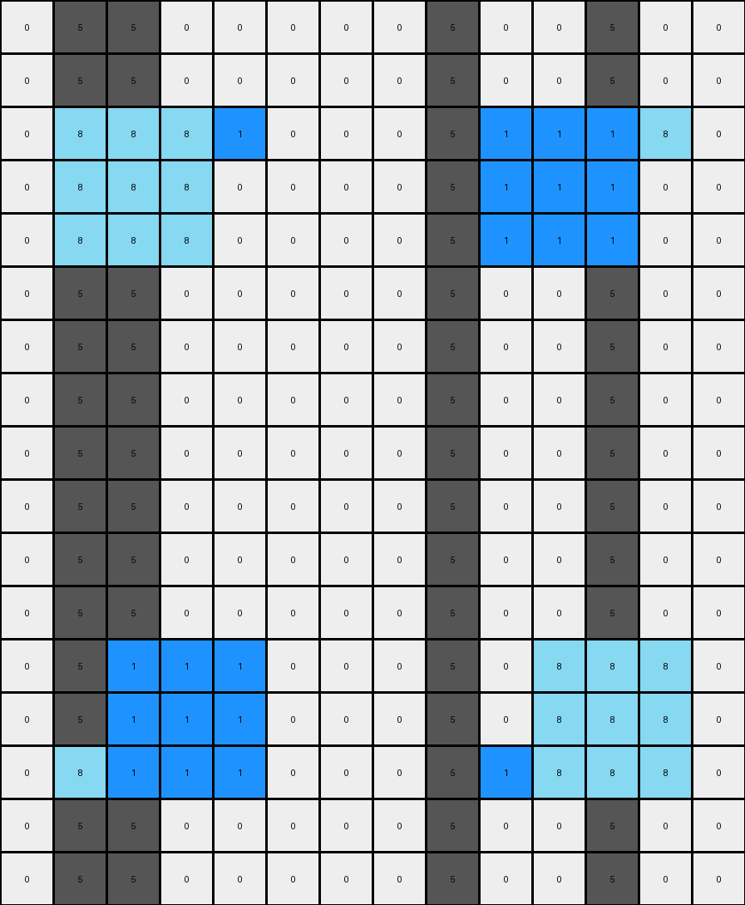

# f35d900a • 009 • refine_dreamer

---


Previous Code:
```python
"""
This program takes an input grid and performs a series of transformations:
1. Identifies 'blue' (1) and 'azure' (8) pixels, and their horizontal mirrors.
2. Expands these pixels horizontally into 3x1 blocks.
3. Expands these blocks vertically into 3x3 blocks.
4. Swaps the positions of the blue and azure colors within their expanded blocks.
5. Introduces 'gray' (5) pixels between the expanded blocks and along the central horizontal line.
"""

import numpy as np

def find_pixels_by_color(grid, color):
    """Finds the coordinates of pixels of a specific color."""
    return np.array(np.where(grid == color)).T.tolist()

def expand_horizontally(grid, coords, color):
    """Expands a pixel horizontally into a 3x1 block."""
    row, col = coords
    for i in range(max(0, col -1), min(grid.shape[1], col + 2)):
        grid[row, i] = color
        
    return grid

def expand_block_vertically(grid, row_start, col_start, color):
    """Expands a 3 x 1 block into a 3x3 block"""
    for r in range(max(0, row_start - 1), min(grid.shape[0], row_start + 2)):
        for c in range(max(0, col_start), min(grid.shape[1], col_start + 3)):
          grid[r,c] = color
    return grid

def swap_colors_in_block(grid, row_start, col_start, color1, color2):
    """Swap color positions between two"""

    coords1 = []
    coords2 = []

    #collect positions
    for r in range(row_start, row_start+3):
      for c in range(col_start, col_start+3):
        if grid[r,c] == color1:
          coords1.append([r,c])
        if grid[r,c] == color2:
          coords2.append([r,c])

    #swap
    for r,c in coords1:
      grid[r,c] = color2

    for r,c in coords2:
      grid[r,c] = color1

    return grid

def introduce_gray_pixels(grid, blue_block_start, azure_block_start):
    """Introduces gray pixels between and around the expanded blocks."""

    row_blue, col_blue = blue_block_start
    row_azure, col_azure = azure_block_start

    #between blocks in central horizontal
    for r in range(grid.shape[0]):
      if grid[r, col_blue + 1] != 1 and grid[r, col_blue + 1] != 8:
        grid[r, col_blue + 1] = 5
      if grid[r, col_azure - 1] != 1 and grid[r, col_azure - 1] != 8:
        grid[r, col_azure -1] = 5

    #vertically adjacent
    for r in range(grid.shape[0]):
        if 1 <= row_blue <= grid.shape[0]-2:
            if grid[row_blue+1, col_blue + 1] == 0:
                grid[row_blue+1, col_blue + 1] = 5
        if 0 <= row_blue -2:
            if grid[row_blue-1, col_blue+1] == 0:
                grid[row_blue-1, col_blue + 1] = 5

        if 1 <= row_azure <= grid.shape[0]-2:
            if grid[row_azure+1, col_azure + 1] == 0:
                grid[row_azure+1, col_azure + 1] = 5
        if 0 <= row_azure - 2:
           if grid[row_azure-1, col_azure + 1] == 0:
                grid[row_azure-1, col_azure + 1] = 5

    return grid

def transform(input_grid):
    # Initialize output grid as a copy of the input grid
    output_grid = np.copy(input_grid)
    
    # Find initial blue and azure pixels
    blue_pixels = find_pixels_by_color(input_grid, 1)
    azure_pixels = find_pixels_by_color(input_grid, 8)

    #mirror locations
    blue_pixels_mirror = []
    azure_pixels_mirror = []
    for r, c in blue_pixels:
        blue_pixels_mirror.append([input_grid.shape[0] -1 - r, input_grid.shape[1] - 1- c])
    for r, c in azure_pixels:
        azure_pixels_mirror.append([input_grid.shape[0] -1 - r, input_grid.shape[1] - 1- c])

    # Expand horizontally
    for row, col in blue_pixels:
      output_grid = expand_horizontally(output_grid, [row, col], 1)
    for row, col in azure_pixels:
      output_grid = expand_horizontally(output_grid, [row, col], 8)

    #Expand horizontally - mirror
    for row, col in blue_pixels_mirror:
        output_grid = expand_horizontally(output_grid, [row, col], 1)
    for row, col in azure_pixels_mirror:
        output_grid = expand_horizontally(output_grid, [row, col], 8)
    
    #Find positions for blocks, before expansion
    blue_row = blue_pixels[0][0]
    blue_col = blue_pixels[0][1]

    azure_row = azure_pixels[0][0]
    azure_col = azure_pixels[0][1]

    #find positions for blocks - mirror
    blue_row_m = blue_pixels_mirror[0][0]
    blue_col_m = blue_pixels_mirror[0][1]

    azure_row_m = azure_pixels_mirror[0][0]
    azure_col_m = azure_pixels_mirror[0][1]

    #expand vertically, make 3x3 blocks
    output_grid = expand_block_vertically(output_grid, blue_row, blue_col -1, 1)
    output_grid = expand_block_vertically(output_grid, azure_row, azure_col-1, 8)
    output_grid = expand_block_vertically(output_grid, blue_row_m, blue_col_m - 1, 1)
    output_grid = expand_block_vertically(output_grid, azure_row_m, azure_col_m - 1, 8)
    

    #swap colors in 3x3
    output_grid = swap_colors_in_block(output_grid, blue_row-1, blue_col-1, 1, 8 )
    output_grid = swap_colors_in_block(output_grid, azure_row-1, azure_col-1, 1, 8)
    output_grid = swap_colors_in_block(output_grid, blue_row_m - 1, blue_col_m - 1, 1, 8)
    output_grid = swap_colors_in_block(output_grid, azure_row_m - 1, azure_col_m - 1, 1, 8)
    

    # Introduce gray pixels

    output_grid = introduce_gray_pixels(output_grid, [blue_row, blue_col - 1], [azure_row, azure_col -1] )
    output_grid = introduce_gray_pixels(output_grid, [blue_row_m, blue_col_m -1], [azure_row_m, azure_col_m - 1])

    return output_grid
```

Train Set Results:

## Example 1:

Input:
```
0 0 0 0 0 0 0 0 0 0 0 0 0 0
0 0 0 0 0 0 0 0 0 0 0 0 0 0
0 2 0 0 0 0 3 0 0 0 0 0 0 0
0 0 0 0 0 0 0 0 0 0 0 0 0 0
0 0 0 0 0 0 0 0 0 0 0 0 0 0
0 0 0 0 0 0 0 0 0 0 0 0 0 0
0 0 0 0 0 0 0 0 0 0 0 0 0 0
0 0 0 0 0 0 0 0 0 0 0 0 0 0
0 3 0 0 0 0 2 0 0 0 0 0 0 0
0 0 0 0 0 0 0 0 0 0 0 0 0 0
0 0 0 0 0 0 0 0 0 0 0 0 0 0
0 0 0 0 0 0 0 0 0 0 0 0 0 0
0 0 0 0 0 0 0 0 0 0 0 0 0 0
0 0 0 0 0 0 0 0 0 0 0 0 0 0
```
Expected Output:
```
0 0 0 0 0 0 0 0 0 0 0 0 0 0
3 3 3 0 0 2 2 2 0 0 0 0 0 0
3 2 3 5 5 2 3 2 0 0 0 0 0 0
3 3 3 0 0 2 2 2 0 0 0 0 0 0
0 5 0 0 0 0 5 0 0 0 0 0 0 0
0 0 0 0 0 0 0 0 0 0 0 0 0 0
0 5 0 0 0 0 5 0 0 0 0 0 0 0
2 2 2 0 0 3 3 3 0 0 0 0 0 0
2 3 2 5 5 3 2 3 0 0 0 0 0 0
2 2 2 0 0 3 3 3 0 0 0 0 0 0
0 0 0 0 0 0 0 0 0 0 0 0 0 0
0 0 0 0 0 0 0 0 0 0 0 0 0 0
0 0 0 0 0 0 0 0 0 0 0 0 0 0
0 0 0 0 0 0 0 0 0 0 0 0 0 0
```
match: ERROR: list index out of range
pixels_off: None
size_correct: None
color_palette_correct: None
correct_pixel_counts: None

## Example 2:

Input:
```
0 0 0 0 0 0 0 0 0 0 0 0 0 0
0 0 0 0 0 0 0 0 0 0 0 0 0 0
0 0 0 0 0 0 0 0 0 0 0 0 0 0
0 0 1 0 0 0 0 0 0 0 8 0 0 0
0 0 0 0 0 0 0 0 0 0 0 0 0 0
0 0 0 0 0 0 0 0 0 0 0 0 0 0
0 0 0 0 0 0 0 0 0 0 0 0 0 0
0 0 0 0 0 0 0 0 0 0 0 0 0 0
0 0 0 0 0 0 0 0 0 0 0 0 0 0
0 0 0 0 0 0 0 0 0 0 0 0 0 0
0 0 0 0 0 0 0 0 0 0 0 0 0 0
0 0 0 0 0 0 0 0 0 0 0 0 0 0
0 0 0 0 0 0 0 0 0 0 0 0 0 0
0 0 0 0 0 0 0 0 0 0 0 0 0 0
0 0 8 0 0 0 0 0 0 0 1 0 0 0
0 0 0 0 0 0 0 0 0 0 0 0 0 0
0 0 0 0 0 0 0 0 0 0 0 0 0 0
```
Expected Output:
```
0 0 0 0 0 0 0 0 0 0 0 0 0 0
0 0 0 0 0 0 0 0 0 0 0 0 0 0
0 8 8 8 0 0 0 0 0 1 1 1 0 0
0 8 1 8 5 0 5 0 5 1 8 1 0 0
0 8 8 8 0 0 0 0 0 1 1 1 0 0
0 0 5 0 0 0 0 0 0 0 5 0 0 0
0 0 0 0 0 0 0 0 0 0 0 0 0 0
0 0 5 0 0 0 0 0 0 0 5 0 0 0
0 0 0 0 0 0 0 0 0 0 0 0 0 0
0 0 0 0 0 0 0 0 0 0 0 0 0 0
0 0 5 0 0 0 0 0 0 0 5 0 0 0
0 0 0 0 0 0 0 0 0 0 0 0 0 0
0 0 5 0 0 0 0 0 0 0 5 0 0 0
0 1 1 1 0 0 0 0 0 8 8 8 0 0
0 1 8 1 5 0 5 0 5 8 1 8 0 0
0 1 1 1 0 0 0 0 0 8 8 8 0 0
0 0 0 0 0 0 0 0 0 0 0 0 0 0
```
Transformed Output:
```
0 5 5 0 0 0 0 0 5 0 0 5 0 0
0 5 5 0 0 0 0 0 5 0 0 5 0 0
0 8 8 8 1 0 0 0 5 1 1 1 8 0
0 8 8 8 0 0 0 0 5 1 1 1 0 0
0 8 8 8 0 0 0 0 5 1 1 1 0 0
0 5 5 0 0 0 0 0 5 0 0 5 0 0
0 5 5 0 0 0 0 0 5 0 0 5 0 0
0 5 5 0 0 0 0 0 5 0 0 5 0 0
0 5 5 0 0 0 0 0 5 0 0 5 0 0
0 5 5 0 0 0 0 0 5 0 0 5 0 0
0 5 5 0 0 0 0 0 5 0 0 5 0 0
0 5 5 0 0 0 0 0 5 0 0 5 0 0
0 5 1 1 1 0 0 0 5 0 8 8 8 0
0 5 1 1 1 0 0 0 5 0 8 8 8 0
0 8 1 1 1 0 0 0 5 1 8 8 8 0
0 5 5 0 0 0 0 0 5 0 0 5 0 0
0 5 5 0 0 0 0 0 5 0 0 5 0 0
```

match: False
pixels_off: 75
size_correct: True
color_palette_correct: True
correct_pixel_counts: False

## Example 3:

Input:
```
0 0 0 0 0 0 0 0 0 0 0 0 0 0 0 0
0 0 0 0 0 0 0 0 0 0 0 0 0 0 0 0
0 0 0 0 0 0 0 0 0 0 0 0 0 0 0 0
0 0 2 0 0 0 0 0 0 0 0 0 0 4 0 0
0 0 0 0 0 0 0 0 0 0 0 0 0 0 0 0
0 0 0 0 0 0 0 0 0 0 0 0 0 0 0 0
0 0 0 0 0 0 0 0 0 0 0 0 0 0 0 0
0 0 0 0 0 0 0 0 0 0 0 0 0 0 0 0
0 0 0 0 0 0 0 0 0 0 0 0 0 0 0 0
0 0 0 0 0 0 0 0 0 0 0 0 0 0 0 0
0 0 0 0 0 0 0 0 0 0 0 0 0 0 0 0
0 0 0 0 0 0 0 0 0 0 0 0 0 0 0 0
0 0 0 0 0 0 0 0 0 0 0 0 0 0 0 0
0 0 4 0 0 0 0 0 0 0 0 0 0 2 0 0
0 0 0 0 0 0 0 0 0 0 0 0 0 0 0 0
0 0 0 0 0 0 0 0 0 0 0 0 0 0 0 0
0 0 0 0 0 0 0 0 0 0 0 0 0 0 0 0
```
Expected Output:
```
0 0 0 0 0 0 0 0 0 0 0 0 0 0 0 0
0 0 0 0 0 0 0 0 0 0 0 0 0 0 0 0
0 4 4 4 0 0 0 0 0 0 0 0 2 2 2 0
0 4 2 4 5 0 5 0 0 5 0 5 2 4 2 0
0 4 4 4 0 0 0 0 0 0 0 0 2 2 2 0
0 0 5 0 0 0 0 0 0 0 0 0 0 5 0 0
0 0 0 0 0 0 0 0 0 0 0 0 0 0 0 0
0 0 5 0 0 0 0 0 0 0 0 0 0 5 0 0
0 0 0 0 0 0 0 0 0 0 0 0 0 0 0 0
0 0 5 0 0 0 0 0 0 0 0 0 0 5 0 0
0 0 0 0 0 0 0 0 0 0 0 0 0 0 0 0
0 0 5 0 0 0 0 0 0 0 0 0 0 5 0 0
0 2 2 2 0 0 0 0 0 0 0 0 4 4 4 0
0 2 4 2 5 0 5 0 0 5 0 5 4 2 4 0
0 2 2 2 0 0 0 0 0 0 0 0 4 4 4 0
0 0 0 0 0 0 0 0 0 0 0 0 0 0 0 0
0 0 0 0 0 0 0 0 0 0 0 0 0 0 0 0
```
match: ERROR: list index out of range
pixels_off: None
size_correct: None
color_palette_correct: None
correct_pixel_counts: None

## Example 4:

Input:
```
0 0 0 0 0 0 0 0 0 0 0 0 0 0 0 0
0 0 0 0 0 0 0 0 0 0 0 0 0 0 0 0
0 0 0 0 0 0 0 0 0 0 0 0 0 0 0 0
0 0 0 0 3 0 0 0 0 0 0 0 8 0 0 0
0 0 0 0 0 0 0 0 0 0 0 0 0 0 0 0
0 0 0 0 0 0 0 0 0 0 0 0 0 0 0 0
0 0 0 0 0 0 0 0 0 0 0 0 0 0 0 0
0 0 0 0 0 0 0 0 0 0 0 0 0 0 0 0
0 0 0 0 8 0 0 0 0 0 0 0 3 0 0 0
0 0 0 0 0 0 0 0 0 0 0 0 0 0 0 0
0 0 0 0 0 0 0 0 0 0 0 0 0 0 0 0
0 0 0 0 0 0 0 0 0 0 0 0 0 0 0 0
0 0 0 0 0 0 0 0 0 0 0 0 0 0 0 0
0 0 0 0 0 0 0 0 0 0 0 0 0 0 0 0
0 0 0 0 0 0 0 0 0 0 0 0 0 0 0 0
0 0 0 0 0 0 0 0 0 0 0 0 0 0 0 0
0 0 0 0 0 0 0 0 0 0 0 0 0 0 0 0
```
Expected Output:
```
0 0 0 0 0 0 0 0 0 0 0 0 0 0 0 0
0 0 0 0 0 0 0 0 0 0 0 0 0 0 0 0
0 0 0 8 8 8 0 0 0 0 0 3 3 3 0 0
0 0 0 8 3 8 5 0 5 0 5 3 8 3 0 0
0 0 0 8 8 8 0 0 0 0 0 3 3 3 0 0
0 0 0 0 5 0 0 0 0 0 0 0 5 0 0 0
0 0 0 0 5 0 0 0 0 0 0 0 5 0 0 0
0 0 0 3 3 3 0 0 0 0 0 8 8 8 0 0
0 0 0 3 8 3 5 0 5 0 5 8 3 8 0 0
0 0 0 3 3 3 0 0 0 0 0 8 8 8 0 0
0 0 0 0 0 0 0 0 0 0 0 0 0 0 0 0
0 0 0 0 0 0 0 0 0 0 0 0 0 0 0 0
0 0 0 0 0 0 0 0 0 0 0 0 0 0 0 0
0 0 0 0 0 0 0 0 0 0 0 0 0 0 0 0
0 0 0 0 0 0 0 0 0 0 0 0 0 0 0 0
0 0 0 0 0 0 0 0 0 0 0 0 0 0 0 0
0 0 0 0 0 0 0 0 0 0 0 0 0 0 0 0
```
match: ERROR: list index out of range
pixels_off: None
size_correct: None
color_palette_correct: None
correct_pixel_counts: None

**INSTRUCTIONS**

The code above was generated based on observations from the first training
example

we have tested the transform function on each of the task example inputs and
compared with the expected output

review each of the examples provided and the results and consider how the
natural language program should be updated to accommodate this new knowledge

respond with the following deliverables:

- general assessment of the information provided and strategy for resolving the
  errors
- gather metrics about each of the examples and results - use code_execution to
  develop accurate reports on your assumptions
- a YAML block documenting facts - Focus on identifying objects, their properties, and the actions performed on them.
- a natural language program - Be as clear and concise as possible, providing a complete description of the transformation rule.


your responses should be considered as information in a report - not a
conversation
