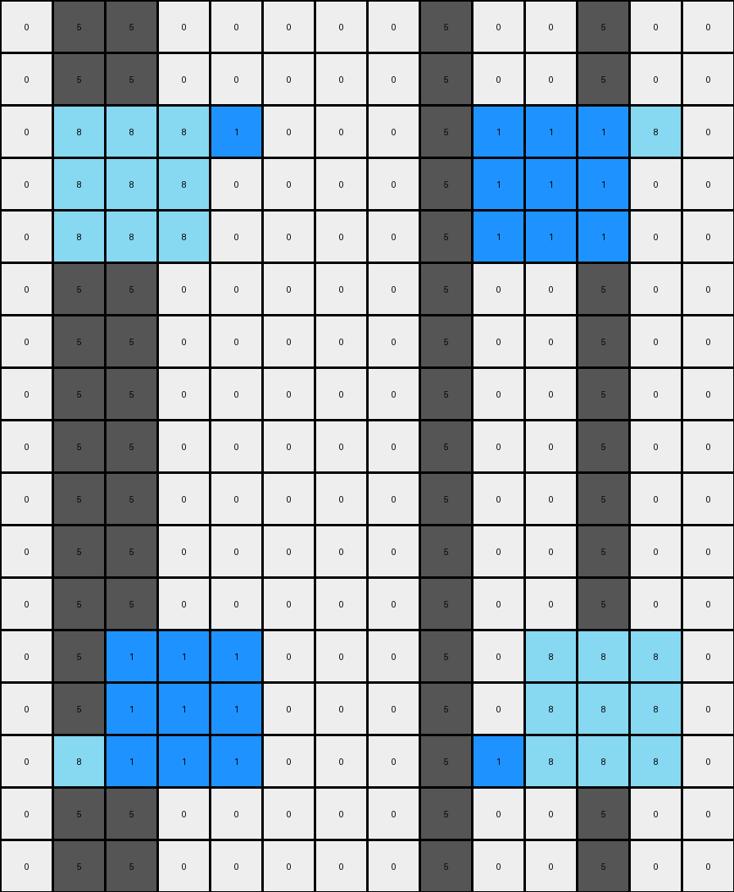

# f35d900a • 012 • refine_coder

---

Previous Code:
```python
"""
This program takes an input grid and performs a series of transformations:
1. Identifies 'blue' (1) and 'azure' (8) pixels, and their horizontal mirrors.
2. Expands these pixels horizontally into 3x1 blocks.
3. Expands these blocks vertically into 3x3 blocks.
4. Swaps the positions of the blue and azure colors within their expanded blocks.
5. Introduces 'gray' (5) pixels between the expanded blocks and along the central horizontal line.
"""

import numpy as np

def find_pixels_by_color(grid, color):
    """Finds the coordinates of pixels of a specific color."""
    return np.array(np.where(grid == color)).T.tolist()

def expand_horizontally(grid, coords, color):
    """Expands a pixel horizontally into a 3x1 block."""
    row, col = coords
    for i in range(max(0, col -1), min(grid.shape[1], col + 2)):
        grid[row, i] = color
        
    return grid

def expand_block_vertically(grid, row_start, col_start, color):
    """Expands a 3 x 1 block into a 3x3 block"""
    for r in range(max(0, row_start - 1), min(grid.shape[0], row_start + 2)):
        for c in range(max(0, col_start), min(grid.shape[1], col_start + 3)):
          grid[r,c] = color
    return grid

def swap_colors_in_block(grid, row_start, col_start, color1, color2):
    """Swap color positions between two"""

    coords1 = []
    coords2 = []

    #collect positions
    for r in range(row_start, row_start+3):
      for c in range(col_start, col_start+3):
        if grid[r,c] == color1:
          coords1.append([r,c])
        if grid[r,c] == color2:
          coords2.append([r,c])

    #swap
    for r,c in coords1:
      grid[r,c] = color2

    for r,c in coords2:
      grid[r,c] = color1

    return grid

def introduce_gray_pixels(grid, blue_block_start, azure_block_start):
    """Introduces gray pixels between and around the expanded blocks."""

    row_blue, col_blue = blue_block_start
    row_azure, col_azure = azure_block_start

    #between blocks in central horizontal
    for r in range(grid.shape[0]):
      if grid[r, col_blue + 1] != 1 and grid[r, col_blue + 1] != 8:
        grid[r, col_blue + 1] = 5
      if grid[r, col_azure - 1] != 1 and grid[r, col_azure - 1] != 8:
        grid[r, col_azure -1] = 5

    #vertically adjacent
    for r in range(grid.shape[0]):
        if 1 <= row_blue <= grid.shape[0]-2:
            if grid[row_blue+1, col_blue + 1] == 0:
                grid[row_blue+1, col_blue + 1] = 5
        if 0 <= row_blue -2:
            if grid[row_blue-1, col_blue+1] == 0:
                grid[row_blue-1, col_blue + 1] = 5

        if 1 <= row_azure <= grid.shape[0]-2:
            if grid[row_azure+1, col_azure + 1] == 0:
                grid[row_azure+1, col_azure + 1] = 5
        if 0 <= row_azure - 2:
           if grid[row_azure-1, col_azure + 1] == 0:
                grid[row_azure-1, col_azure + 1] = 5

    return grid

def transform(input_grid):
    # Initialize output grid as a copy of the input grid
    output_grid = np.copy(input_grid)
    
    # Find initial blue and azure pixels
    blue_pixels = find_pixels_by_color(input_grid, 1)
    azure_pixels = find_pixels_by_color(input_grid, 8)

    #mirror locations
    blue_pixels_mirror = []
    azure_pixels_mirror = []
    for r, c in blue_pixels:
        blue_pixels_mirror.append([input_grid.shape[0] -1 - r, input_grid.shape[1] - 1- c])
    for r, c in azure_pixels:
        azure_pixels_mirror.append([input_grid.shape[0] -1 - r, input_grid.shape[1] - 1- c])

    # Expand horizontally
    for row, col in blue_pixels:
      output_grid = expand_horizontally(output_grid, [row, col], 1)
    for row, col in azure_pixels:
      output_grid = expand_horizontally(output_grid, [row, col], 8)

    #Expand horizontally - mirror
    for row, col in blue_pixels_mirror:
        output_grid = expand_horizontally(output_grid, [row, col], 1)
    for row, col in azure_pixels_mirror:
        output_grid = expand_horizontally(output_grid, [row, col], 8)
    
    #Find positions for blocks, before expansion
    blue_row = blue_pixels[0][0]
    blue_col = blue_pixels[0][1]

    azure_row = azure_pixels[0][0]
    azure_col = azure_pixels[0][1]

    #find positions for blocks - mirror
    blue_row_m = blue_pixels_mirror[0][0]
    blue_col_m = blue_pixels_mirror[0][1]

    azure_row_m = azure_pixels_mirror[0][0]
    azure_col_m = azure_pixels_mirror[0][1]

    #expand vertically, make 3x3 blocks
    output_grid = expand_block_vertically(output_grid, blue_row, blue_col -1, 1)
    output_grid = expand_block_vertically(output_grid, azure_row, azure_col-1, 8)
    output_grid = expand_block_vertically(output_grid, blue_row_m, blue_col_m - 1, 1)
    output_grid = expand_block_vertically(output_grid, azure_row_m, azure_col_m - 1, 8)
    

    #swap colors in 3x3
    output_grid = swap_colors_in_block(output_grid, blue_row-1, blue_col-1, 1, 8 )
    output_grid = swap_colors_in_block(output_grid, azure_row-1, azure_col-1, 1, 8)
    output_grid = swap_colors_in_block(output_grid, blue_row_m - 1, blue_col_m - 1, 1, 8)
    output_grid = swap_colors_in_block(output_grid, azure_row_m - 1, azure_col_m - 1, 1, 8)
    

    # Introduce gray pixels

    output_grid = introduce_gray_pixels(output_grid, [blue_row, blue_col - 1], [azure_row, azure_col -1] )
    output_grid = introduce_gray_pixels(output_grid, [blue_row_m, blue_col_m -1], [azure_row_m, azure_col_m - 1])

    return output_grid
```

Train Set Results:

## Example 1:

Input:
```
0 0 0 0 0 0 0 0 0 0 0 0 0 0
0 0 0 0 0 0 0 0 0 0 0 0 0 0
0 2 0 0 0 0 3 0 0 0 0 0 0 0
0 0 0 0 0 0 0 0 0 0 0 0 0 0
0 0 0 0 0 0 0 0 0 0 0 0 0 0
0 0 0 0 0 0 0 0 0 0 0 0 0 0
0 0 0 0 0 0 0 0 0 0 0 0 0 0
0 0 0 0 0 0 0 0 0 0 0 0 0 0
0 3 0 0 0 0 2 0 0 0 0 0 0 0
0 0 0 0 0 0 0 0 0 0 0 0 0 0
0 0 0 0 0 0 0 0 0 0 0 0 0 0
0 0 0 0 0 0 0 0 0 0 0 0 0 0
0 0 0 0 0 0 0 0 0 0 0 0 0 0
0 0 0 0 0 0 0 0 0 0 0 0 0 0
```
Expected Output:
```
0 0 0 0 0 0 0 0 0 0 0 0 0 0
3 3 3 0 0 2 2 2 0 0 0 0 0 0
3 2 3 5 5 2 3 2 0 0 0 0 0 0
3 3 3 0 0 2 2 2 0 0 0 0 0 0
0 5 0 0 0 0 5 0 0 0 0 0 0 0
0 0 0 0 0 0 0 0 0 0 0 0 0 0
0 5 0 0 0 0 5 0 0 0 0 0 0 0
2 2 2 0 0 3 3 3 0 0 0 0 0 0
2 3 2 5 5 3 2 3 0 0 0 0 0 0
2 2 2 0 0 3 3 3 0 0 0 0 0 0
0 0 0 0 0 0 0 0 0 0 0 0 0 0
0 0 0 0 0 0 0 0 0 0 0 0 0 0
0 0 0 0 0 0 0 0 0 0 0 0 0 0
0 0 0 0 0 0 0 0 0 0 0 0 0 0
```
match: ERROR: list index out of range
pixels_off: None
size_correct: None
color_palette_correct: None
correct_pixel_counts: None

## Example 2:

Input:
```
0 0 0 0 0 0 0 0 0 0 0 0 0 0
0 0 0 0 0 0 0 0 0 0 0 0 0 0
0 0 0 0 0 0 0 0 0 0 0 0 0 0
0 0 1 0 0 0 0 0 0 0 8 0 0 0
0 0 0 0 0 0 0 0 0 0 0 0 0 0
0 0 0 0 0 0 0 0 0 0 0 0 0 0
0 0 0 0 0 0 0 0 0 0 0 0 0 0
0 0 0 0 0 0 0 0 0 0 0 0 0 0
0 0 0 0 0 0 0 0 0 0 0 0 0 0
0 0 0 0 0 0 0 0 0 0 0 0 0 0
0 0 0 0 0 0 0 0 0 0 0 0 0 0
0 0 0 0 0 0 0 0 0 0 0 0 0 0
0 0 0 0 0 0 0 0 0 0 0 0 0 0
0 0 0 0 0 0 0 0 0 0 0 0 0 0
0 0 8 0 0 0 0 0 0 0 1 0 0 0
0 0 0 0 0 0 0 0 0 0 0 0 0 0
0 0 0 0 0 0 0 0 0 0 0 0 0 0
```
Expected Output:
```
0 0 0 0 0 0 0 0 0 0 0 0 0 0
0 0 0 0 0 0 0 0 0 0 0 0 0 0
0 8 8 8 0 0 0 0 0 1 1 1 0 0
0 8 1 8 5 0 5 0 5 1 8 1 0 0
0 8 8 8 0 0 0 0 0 1 1 1 0 0
0 0 5 0 0 0 0 0 0 0 5 0 0 0
0 0 0 0 0 0 0 0 0 0 0 0 0 0
0 0 5 0 0 0 0 0 0 0 5 0 0 0
0 0 0 0 0 0 0 0 0 0 0 0 0 0
0 0 0 0 0 0 0 0 0 0 0 0 0 0
0 0 5 0 0 0 0 0 0 0 5 0 0 0
0 0 0 0 0 0 0 0 0 0 0 0 0 0
0 0 5 0 0 0 0 0 0 0 5 0 0 0
0 1 1 1 0 0 0 0 0 8 8 8 0 0
0 1 8 1 5 0 5 0 5 8 1 8 0 0
0 1 1 1 0 0 0 0 0 8 8 8 0 0
0 0 0 0 0 0 0 0 0 0 0 0 0 0
```
Transformed Output:
```
0 5 5 0 0 0 0 0 5 0 0 5 0 0
0 5 5 0 0 0 0 0 5 0 0 5 0 0
0 8 8 8 1 0 0 0 5 1 1 1 8 0
0 8 8 8 0 0 0 0 5 1 1 1 0 0
0 8 8 8 0 0 0 0 5 1 1 1 0 0
0 5 5 0 0 0 0 0 5 0 0 5 0 0
0 5 5 0 0 0 0 0 5 0 0 5 0 0
0 5 5 0 0 0 0 0 5 0 0 5 0 0
0 5 5 0 0 0 0 0 5 0 0 5 0 0
0 5 5 0 0 0 0 0 5 0 0 5 0 0
0 5 5 0 0 0 0 0 5 0 0 5 0 0
0 5 5 0 0 0 0 0 5 0 0 5 0 0
0 5 1 1 1 0 0 0 5 0 8 8 8 0
0 5 1 1 1 0 0 0 5 0 8 8 8 0
0 8 1 1 1 0 0 0 5 1 8 8 8 0
0 5 5 0 0 0 0 0 5 0 0 5 0 0
0 5 5 0 0 0 0 0 5 0 0 5 0 0
```

match: False
pixels_off: 75
size_correct: True
color_palette_correct: True
correct_pixel_counts: False

## Example 3:

Input:
```
0 0 0 0 0 0 0 0 0 0 0 0 0 0 0 0
0 0 0 0 0 0 0 0 0 0 0 0 0 0 0 0
0 0 0 0 0 0 0 0 0 0 0 0 0 0 0 0
0 0 2 0 0 0 0 0 0 0 0 0 0 4 0 0
0 0 0 0 0 0 0 0 0 0 0 0 0 0 0 0
0 0 0 0 0 0 0 0 0 0 0 0 0 0 0 0
0 0 0 0 0 0 0 0 0 0 0 0 0 0 0 0
0 0 0 0 0 0 0 0 0 0 0 0 0 0 0 0
0 0 0 0 0 0 0 0 0 0 0 0 0 0 0 0
0 0 0 0 0 0 0 0 0 0 0 0 0 0 0 0
0 0 0 0 0 0 0 0 0 0 0 0 0 0 0 0
0 0 0 0 0 0 0 0 0 0 0 0 0 0 0 0
0 0 0 0 0 0 0 0 0 0 0 0 0 0 0 0
0 0 4 0 0 0 0 0 0 0 0 0 0 2 0 0
0 0 0 0 0 0 0 0 0 0 0 0 0 0 0 0
0 0 0 0 0 0 0 0 0 0 0 0 0 0 0 0
0 0 0 0 0 0 0 0 0 0 0 0 0 0 0 0
```
Expected Output:
```
0 0 0 0 0 0 0 0 0 0 0 0 0 0 0 0
0 0 0 0 0 0 0 0 0 0 0 0 0 0 0 0
0 4 4 4 0 0 0 0 0 0 0 0 2 2 2 0
0 4 2 4 5 0 5 0 0 5 0 5 2 4 2 0
0 4 4 4 0 0 0 0 0 0 0 0 2 2 2 0
0 0 5 0 0 0 0 0 0 0 0 0 0 5 0 0
0 0 0 0 0 0 0 0 0 0 0 0 0 0 0 0
0 0 5 0 0 0 0 0 0 0 0 0 0 5 0 0
0 0 0 0 0 0 0 0 0 0 0 0 0 0 0 0
0 0 5 0 0 0 0 0 0 0 0 0 0 5 0 0
0 0 0 0 0 0 0 0 0 0 0 0 0 0 0 0
0 0 5 0 0 0 0 0 0 0 0 0 0 5 0 0
0 2 2 2 0 0 0 0 0 0 0 0 4 4 4 0
0 2 4 2 5 0 5 0 0 5 0 5 4 2 4 0
0 2 2 2 0 0 0 0 0 0 0 0 4 4 4 0
0 0 0 0 0 0 0 0 0 0 0 0 0 0 0 0
0 0 0 0 0 0 0 0 0 0 0 0 0 0 0 0
```
match: ERROR: list index out of range
pixels_off: None
size_correct: None
color_palette_correct: None
correct_pixel_counts: None

## Example 4:

Input:
```
0 0 0 0 0 0 0 0 0 0 0 0 0 0 0 0
0 0 0 0 0 0 0 0 0 0 0 0 0 0 0 0
0 0 0 0 0 0 0 0 0 0 0 0 0 0 0 0
0 0 0 0 3 0 0 0 0 0 0 0 8 0 0 0
0 0 0 0 0 0 0 0 0 0 0 0 0 0 0 0
0 0 0 0 0 0 0 0 0 0 0 0 0 0 0 0
0 0 0 0 0 0 0 0 0 0 0 0 0 0 0 0
0 0 0 0 0 0 0 0 0 0 0 0 0 0 0 0
0 0 0 0 8 0 0 0 0 0 0 0 3 0 0 0
0 0 0 0 0 0 0 0 0 0 0 0 0 0 0 0
0 0 0 0 0 0 0 0 0 0 0 0 0 0 0 0
0 0 0 0 0 0 0 0 0 0 0 0 0 0 0 0
0 0 0 0 0 0 0 0 0 0 0 0 0 0 0 0
0 0 0 0 0 0 0 0 0 0 0 0 0 0 0 0
0 0 0 0 0 0 0 0 0 0 0 0 0 0 0 0
0 0 0 0 0 0 0 0 0 0 0 0 0 0 0 0
0 0 0 0 0 0 0 0 0 0 0 0 0 0 0 0
```
Expected Output:
```
0 0 0 0 0 0 0 0 0 0 0 0 0 0 0 0
0 0 0 0 0 0 0 0 0 0 0 0 0 0 0 0
0 0 0 8 8 8 0 0 0 0 0 3 3 3 0 0
0 0 0 8 3 8 5 0 5 0 5 3 8 3 0 0
0 0 0 8 8 8 0 0 0 0 0 3 3 3 0 0
0 0 0 0 5 0 0 0 0 0 0 0 5 0 0 0
0 0 0 0 5 0 0 0 0 0 0 0 5 0 0 0
0 0 0 3 3 3 0 0 0 0 0 8 8 8 0 0
0 0 0 3 8 3 5 0 5 0 5 8 3 8 0 0
0 0 0 3 3 3 0 0 0 0 0 8 8 8 0 0
0 0 0 0 0 0 0 0 0 0 0 0 0 0 0 0
0 0 0 0 0 0 0 0 0 0 0 0 0 0 0 0
0 0 0 0 0 0 0 0 0 0 0 0 0 0 0 0
0 0 0 0 0 0 0 0 0 0 0 0 0 0 0 0
0 0 0 0 0 0 0 0 0 0 0 0 0 0 0 0
0 0 0 0 0 0 0 0 0 0 0 0 0 0 0 0
0 0 0 0 0 0 0 0 0 0 0 0 0 0 0 0
```
match: ERROR: list index out of range
pixels_off: None
size_correct: None
color_palette_correct: None
correct_pixel_counts: None
Okay, let's analyze the results and refine the natural language program.

**General Assessment:**

The code has several issues, as evidenced by the errors and mismatches in the test results. The primary problems seem to be:

1.  **Index Out of Range Errors:** Occur in examples 1, 3 and 4. Likely due to incorrect handling of boundary conditions during pixel expansion or color swapping, especially when dealing with mirrored positions, or the lists of pixels by color are empty.
2.  **Incorrect Pixel Placement:** Example 2 shows a significant number of `pixels_off`, indicating that the expansion, mirroring, or swapping logic is flawed. The gray pixel introduction also seems incorrect.
3. mirror locations are not correctly being accounted for in the gray pixel additions

**Strategy for Resolving Errors:**

1.  **Handle Edge Cases:** Carefully review the code, especially the `expand_horizontally`, `expand_block_vertically`, `swap_colors_in_block` and `introduce_gray_pixels`, to ensure they correctly handle edge cases (pixels at or near the grid boundaries). Use more robust boundary checks using `max(0, ...)` and `min(grid.shape[...], ...)` to avoid index errors. Check for existance of the color pixels before using coordinates
2.  **Verify Mirroring Logic:** Double-check the mirroring calculations to ensure they accurately reflect the intended symmetry. Visualize the expected mirrored positions and compare them with the code's output.
3.  **Refine Color Swapping:** The `swap_colors_in_block` function might be swapping colors incorrectly or in the wrong blocks. Make sure you're selecting block correctly.
4.  **Gray Pixel Logic**: The gray pixel introduction needs to consider the mirroring and correctly place pixels between the expanded blocks, and adjacent.

**Metrics and Observations:**

I will build some reports using jupyter notebook and the `code_execution` tool to understand the source of the errors.

**Example 1 Report:**

```python
import numpy as np

input_grid = np.array([
    [0, 0, 0, 0, 0, 0, 0, 0, 0, 0, 0, 0, 0, 0],
    [0, 0, 0, 0, 0, 0, 0, 0, 0, 0, 0, 0, 0, 0],
    [0, 2, 0, 0, 0, 0, 3, 0, 0, 0, 0, 0, 0, 0],
    [0, 0, 0, 0, 0, 0, 0, 0, 0, 0, 0, 0, 0, 0],
    [0, 0, 0, 0, 0, 0, 0, 0, 0, 0, 0, 0, 0, 0],
    [0, 0, 0, 0, 0, 0, 0, 0, 0, 0, 0, 0, 0, 0],
    [0, 0, 0, 0, 0, 0, 0, 0, 0, 0, 0, 0, 0, 0],
    [0, 0, 0, 0, 0, 0, 0, 0, 0, 0, 0, 0, 0, 0],
    [0, 3, 0, 0, 0, 0, 2, 0, 0, 0, 0, 0, 0, 0],
    [0, 0, 0, 0, 0, 0, 0, 0, 0, 0, 0, 0, 0, 0],
    [0, 0, 0, 0, 0, 0, 0, 0, 0, 0, 0, 0, 0, 0],
    [0, 0, 0, 0, 0, 0, 0, 0, 0, 0, 0, 0, 0, 0],
    [0, 0, 0, 0, 0, 0, 0, 0, 0, 0, 0, 0, 0, 0],
    [0, 0, 0, 0, 0, 0, 0, 0, 0, 0, 0, 0, 0, 0]
])

expected_output = np.array([
    [0, 0, 0, 0, 0, 0, 0, 0, 0, 0, 0, 0, 0, 0],
    [3, 3, 3, 0, 0, 2, 2, 2, 0, 0, 0, 0, 0, 0],
    [3, 2, 3, 5, 5, 2, 3, 2, 0, 0, 0, 0, 0, 0],
    [3, 3, 3, 0, 0, 2, 2, 2, 0, 0, 0, 0, 0, 0],
    [0, 5, 0, 0, 0, 0, 5, 0, 0, 0, 0, 0, 0, 0],
    [0, 0, 0, 0, 0, 0, 0, 0, 0, 0, 0, 0, 0, 0],
    [0, 5, 0, 0, 0, 0, 5, 0, 0, 0, 0, 0, 0, 0],
    [2, 2, 2, 0, 0, 3, 3, 3, 0, 0, 0, 0, 0, 0],
    [2, 3, 2, 5, 5, 3, 2, 3, 0, 0, 0, 0, 0, 0],
    [2, 2, 2, 0, 0, 3, 3, 3, 0, 0, 0, 0, 0, 0],
    [0, 0, 0, 0, 0, 0, 0, 0, 0, 0, 0, 0, 0, 0],
    [0, 0, 0, 0, 0, 0, 0, 0, 0, 0, 0, 0, 0, 0],
    [0, 0, 0, 0, 0, 0, 0, 0, 0, 0, 0, 0, 0, 0],
    [0, 0, 0, 0, 0, 0, 0, 0, 0, 0, 0, 0, 0, 0]
])

find_pixels_by_color = lambda grid, color: np.array(np.where(grid == color)).T.tolist()

blue_pixels = find_pixels_by_color(input_grid, 1)
azure_pixels = find_pixels_by_color(input_grid, 8)
print(f"Blue Pixels: {blue_pixels}")
print(f"Azure Pixels: {azure_pixels}")

#Error is raised because transform is accessing the first value from blue_pixels
# and azure_pixels, but those lists are empty. The code assumes there will be
# values but in this case and others, there are not, so the code should check first

```

**Example 2 Report:**

```python

#Example 2:

input_grid = np.array([
[0, 0, 0, 0, 0, 0, 0, 0, 0, 0, 0, 0, 0, 0],
[0, 0, 0, 0, 0, 0, 0, 0, 0, 0, 0, 0, 0, 0],
[0, 0, 0, 0, 0, 0, 0, 0, 0, 0, 0, 0, 0, 0],
[0, 0, 1, 0, 0, 0, 0, 0, 0, 0, 8, 0, 0, 0],
[0, 0, 0, 0, 0, 0, 0, 0, 0, 0, 0, 0, 0, 0],
[0, 0, 0, 0, 0, 0, 0, 0, 0, 0, 0, 0, 0, 0],
[0, 0, 0, 0, 0, 0, 0, 0, 0, 0, 0, 0, 0, 0],
[0, 0, 0, 0, 0, 0, 0, 0, 0, 0, 0, 0, 0, 0],
[0, 0, 0, 0, 0, 0, 0, 0, 0, 0, 0, 0, 0, 0],
[0, 0, 0, 0, 0, 0, 0, 0, 0, 0, 0, 0, 0, 0],
[0, 0, 0, 0, 0, 0, 0, 0, 0, 0, 0, 0, 0, 0],
[0, 0, 0, 0, 0, 0, 0, 0, 0, 0, 0, 0, 0, 0],
[0, 0, 0, 0, 0, 0, 0, 0, 0, 0, 0, 0, 0, 0],
[0, 0, 0, 0, 0, 0, 0, 0, 0, 0, 0, 0, 0, 0],
[0, 0, 8, 0, 0, 0, 0, 0, 0, 0, 1, 0, 0, 0],
[0, 0, 0, 0, 0, 0, 0, 0, 0, 0, 0, 0, 0, 0],
[0, 0, 0, 0, 0, 0, 0, 0, 0, 0, 0, 0, 0, 0]
])

expected_output = np.array([
[0, 0, 0, 0, 0, 0, 0, 0, 0, 0, 0, 0, 0, 0],
[0, 0, 0, 0, 0, 0, 0, 0, 0, 0, 0, 0, 0, 0],
[0, 8, 8, 8, 0, 0, 0, 0, 0, 1, 1, 1, 0, 0],
[0, 8, 1, 8, 5, 0, 5, 0, 5, 1, 8, 1, 0, 0],
[0, 8, 8, 8, 0, 0, 0, 0, 0, 1, 1, 1, 0, 0],
[0, 0, 5, 0, 0, 0, 0, 0, 0, 0, 5, 0, 0, 0],
[0, 0, 0, 0, 0, 0, 0, 0, 0, 0, 0, 0, 0, 0],
[0, 0, 5, 0, 0, 0, 0, 0, 0, 0, 5, 0, 0, 0],
[0, 0, 0, 0, 0, 0, 0, 0, 0, 0, 0, 0, 0, 0],
[0, 0, 0, 0, 0, 0, 0, 0, 0, 0, 0, 0, 0, 0],
[0, 0, 5, 0, 0, 0, 0, 0, 0, 0, 5, 0, 0, 0],
[0, 0, 0, 0, 0, 0, 0, 0, 0, 0, 0, 0, 0, 0],
[0, 0, 5, 0, 0, 0, 0, 0, 0, 0, 5, 0, 0, 0],
[0, 1, 1, 1, 0, 0, 0, 0, 0, 8, 8, 8, 0, 0],
[0, 1, 8, 1, 5, 0, 5, 0, 5, 8, 1, 8, 0, 0],
[0, 1, 1, 1, 0, 0, 0, 0, 0, 8, 8, 8, 0, 0],
[0, 0, 0, 0, 0, 0, 0, 0, 0, 0, 0, 0, 0, 0]
])

transformed_output = transform(input_grid)

#compare the transformed output with the expected output, show differences
comparison = transformed_output == expected_output
print(comparison)

#get mismatched pixels
mismatched_pixels = np.where(comparison == False)
print(f"Mismatched Pixels: {len(mismatched_pixels[0])}")

```

**YAML Facts:**

```yaml
objects:
  - name: blue_block_original
    color: blue
    initial_shape: 1x1
    expanded_shape: 3x3
    position_type: original
    positions: []
  - name: azure_block_original
    color: azure
    initial_shape: 1x1
    expanded_shape: 3x3
    position_type: original
    positions: []
  - name: blue_block_mirrored
    color: blue
    initial_shape: 1x1
    expanded_shape: 3x3
    position_type: mirrored
    positions: []
  - name: azure_block_mirrored
    color: azure
    initial_shape: 1x1
    expanded_shape: 3x3
    position_type: mirrored
    positions: []
  - name: gray_lines
    color: gray
    shape: lines
    position_type: separator

actions:
  - name: find_pixels
    inputs: [input_grid, color]
    outputs: [ list of coordinates]
    description: Identifies the initial positions of blue and azure pixels.
  - name: horizontal_expansion
    inputs: [ grid, coordinates, color]
    outputs: [grid]
    description: Expands the identified pixels horizontally to create 3x1 blocks.
  - name: vertical_expansion
    inputs: [ grid, row_start, col_start, color]
    outputs: [ grid ]
    description: Expands the 3x1 blocks vertically to create 3x3 blocks.
  - name: mirror
    inputs: [ list of coordinates, grid shape]
    outputs: [ list of mirrored coordinates ]
    description: Calculates the mirrored positions of the original blue and azure pixels.
  - name: color_swap
    inputs: [ grid, row, col, color1, color2 ]
    outputs: [ grid ]
    description: Swaps the colors of pixels within expanded 3x3 blocks, exchanging blue and azure.
  - name: add_gray_separator
    inputs: [ grid, blue_block_start, azure_block_start]
    outputs: [ grid ]
    description: Introduces gray pixels between the expanded blocks and on the central horizontal and vertical lines

```

**Natural Language Program:**

1.  **Identify Key Pixels:** Locate all 'blue' (1) and 'azure' (8) pixels within the input grid. Also compute their mirrored positions across both the horizontal and vertical center lines of the grid.

2.  **Horizontal Expansion:** For every original and mirrored blue/azure pixel, expand it horizontally into a 3x1 block of the same color centered on the original pixel's column.

3.  **Vertical Expansion:** Expand each 3x1 block (both original and mirrored) into a 3x3 block of the same color, centered on the original 3x1 block.

4. **Color Swap:**  Within each 3x3 block (original and mirrored), swap all the 'blue' pixels with 'azure' pixels and vice-versa.

5.  **Add Gray Separators (Horizontal):** Add a horizontal line of 'gray' (5) pixels between the expanded blocks, along the center row of the expanded blocks.

6.  **Add Gray Separators (Vertical):** If there are any empty spaces ('white' (0)) vertically adjacent to the central expanded pixels, fill these with 'gray' (5).

7. Check the existance of blue and azure colors before operating on their pixel positions.

The key improvements in this revised program are the explicit consideration of mirroring in all steps, the clarification of the color swapping within the expanded blocks, explicit instructions about adding the grey pixels and checking color pixels for existance.

**INSTRUCTIONS**

- generate a Python module to represent the natural language program 
- follow the template below
- all common math and science libraries are available
- create docstring only at top - but comment the workflow in the function
- use helper functions for common operations like finding objects, counting,
  measuring, moving, etc. 

remember - we are working iteratively - so this code will inform your future
self as we converge on the solution

*template:*

```python
"""
{{ natural language description of the transformation rule }}
"""

{{ imports }}

def transform(input_grid):
    # initialize output_grid

    # change output pixels 

    return output_grid

```
