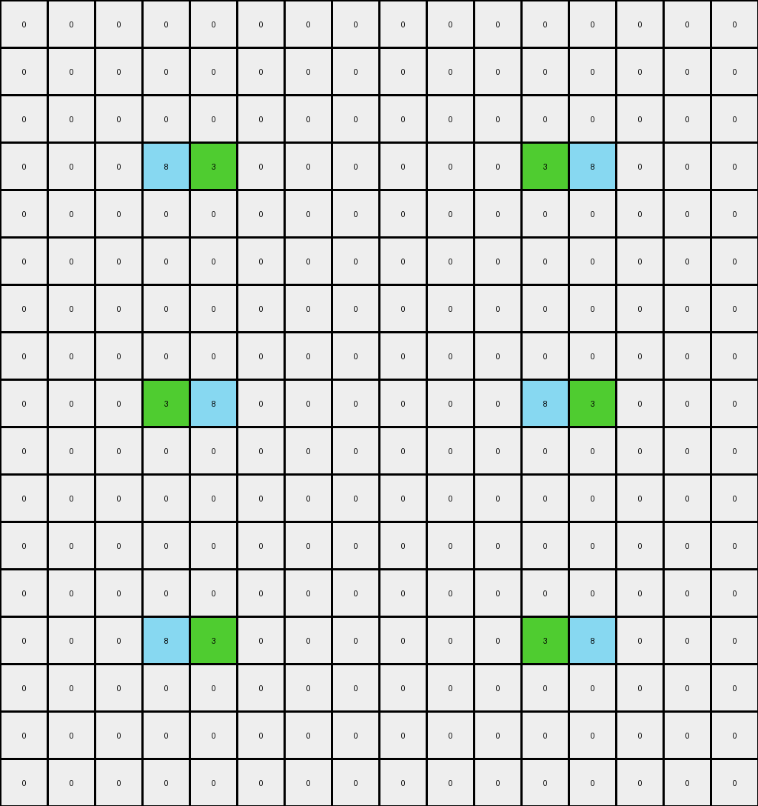

# f35d900a • 015 • refine_dreamer

---


Previous Code:
```python
"""
1.  **Mirroring and Initial Expansion**: Copy each non-white pixel from the input to the output, then "expand" the colors.
    *   Expand red (2) to all directly adjacent white pixels.
    *   Expand yellow (4) to all directly adjacent white pixels.
    *   Mirror the initial colored pixels positions across a vertical and a horizontal axis.

2.  **Adjacency Check and Gray Fill**: For each white (0) pixel in the *output* grid:
    *   Check if it is adjacent to at least one non-white pixel.
    *   Check if the adjacent non-white pixels contain at least two different colors.
    *   If *both conditions are true*, replace the white pixel with gray (5). Otherwise, keep the current value of the pixel.
3. If the cell is not white and has not been changed to gray, maintain its input color in the output grid.
"""

import numpy as np

def get_adjacent_pixels(grid, row, col):
    """Gets the values of adjacent pixels (up, down, left, right)."""
    rows, cols = grid.shape
    adjacent = []
    if row > 0:
        adjacent.append(grid[row - 1, col])  # Up
    if row < rows - 1:
        adjacent.append(grid[row + 1, col])  # Down
    if col > 0:
        adjacent.append(grid[row, col - 1])  # Left
    if col < cols - 1:
        adjacent.append(grid[row, col + 1])  # Right
    return adjacent

def transform(input_grid):
    # initialize output_grid
    output_grid = np.zeros_like(input_grid)
    rows, cols = output_grid.shape

    # Mirror and initial placement
    for i in range(rows):
      for j in range(cols):
        if input_grid[i,j] != 0:
          output_grid[i,j] = input_grid[i,j]
          output_grid[i, cols-1-j] = input_grid[i,j]
          output_grid[rows-1-i, j] = input_grid[i,j]
          output_grid[rows-1-i, cols-1-j] = input_grid[i,j]


    # Expand Colors
    temp_grid = np.copy(output_grid)
    for i in range(rows):
        for j in range(cols):
            if output_grid[i, j] == 0:  # Only expand onto white pixels
                adjacent = get_adjacent_pixels(output_grid, i, j)
                for adj_val in adjacent:
                  if adj_val == 2:
                      temp_grid[i,j] = 2
                  elif adj_val == 4:
                      temp_grid[i,j] = 4

    output_grid = np.copy(temp_grid)

    # Adjacency check and Gray Fill
    for i in range(rows):
        for j in range(cols):
            if output_grid[i, j] == 0:
                adjacent = get_adjacent_pixels(output_grid, i, j)
                adjacent_colors = set(adjacent)
                adjacent_colors.discard(0)  # Remove white from consideration
                if len(adjacent_colors) >= 2:
                    output_grid[i, j] = 5

    return output_grid
```

Train Set Results:

## Example 1:

Input:
```
0 0 0 0 0 0 0 0 0 0 0 0 0 0
0 0 0 0 0 0 0 0 0 0 0 0 0 0
0 2 0 0 0 0 3 0 0 0 0 0 0 0
0 0 0 0 0 0 0 0 0 0 0 0 0 0
0 0 0 0 0 0 0 0 0 0 0 0 0 0
0 0 0 0 0 0 0 0 0 0 0 0 0 0
0 0 0 0 0 0 0 0 0 0 0 0 0 0
0 0 0 0 0 0 0 0 0 0 0 0 0 0
0 3 0 0 0 0 2 0 0 0 0 0 0 0
0 0 0 0 0 0 0 0 0 0 0 0 0 0
0 0 0 0 0 0 0 0 0 0 0 0 0 0
0 0 0 0 0 0 0 0 0 0 0 0 0 0
0 0 0 0 0 0 0 0 0 0 0 0 0 0
0 0 0 0 0 0 0 0 0 0 0 0 0 0
```
Expected Output:
```
0 0 0 0 0 0 0 0 0 0 0 0 0 0
3 3 3 0 0 2 2 2 0 0 0 0 0 0
3 2 3 5 5 2 3 2 0 0 0 0 0 0
3 3 3 0 0 2 2 2 0 0 0 0 0 0
0 5 0 0 0 0 5 0 0 0 0 0 0 0
0 0 0 0 0 0 0 0 0 0 0 0 0 0
0 5 0 0 0 0 5 0 0 0 0 0 0 0
2 2 2 0 0 3 3 3 0 0 0 0 0 0
2 3 2 5 5 3 2 3 0 0 0 0 0 0
2 2 2 0 0 3 3 3 0 0 0 0 0 0
0 0 0 0 0 0 0 0 0 0 0 0 0 0
0 0 0 0 0 0 0 0 0 0 0 0 0 0
0 0 0 0 0 0 0 0 0 0 0 0 0 0
0 0 0 0 0 0 0 0 0 0 0 0 0 0
```
Transformed Output:
```
0 0 0 0 0 0 0 0 0 0 0 0 0 0
0 2 0 0 0 0 0 0 0 0 0 0 2 0
2 2 2 0 0 0 3 3 0 0 0 2 2 2
0 2 0 0 0 0 5 5 0 0 0 0 2 0
0 5 0 0 0 0 2 2 0 0 0 0 5 0
0 3 0 0 0 2 2 2 2 0 0 0 3 0
0 0 0 0 0 0 2 2 0 0 0 0 0 0
0 0 0 0 0 0 2 2 0 0 0 0 0 0
0 3 0 0 0 2 2 2 2 0 0 0 3 0
0 5 0 0 0 0 2 2 0 0 0 0 5 0
0 2 0 0 0 0 5 5 0 0 0 0 2 0
2 2 2 0 0 0 3 3 0 0 0 2 2 2
0 2 0 0 0 0 0 0 0 0 0 0 2 0
0 0 0 0 0 0 0 0 0 0 0 0 0 0
```

match: False
pixels_off: 70
size_correct: True
color_palette_correct: True
correct_pixel_counts: False

## Example 2:

Input:
```
0 0 0 0 0 0 0 0 0 0 0 0 0 0
0 0 0 0 0 0 0 0 0 0 0 0 0 0
0 0 0 0 0 0 0 0 0 0 0 0 0 0
0 0 1 0 0 0 0 0 0 0 8 0 0 0
0 0 0 0 0 0 0 0 0 0 0 0 0 0
0 0 0 0 0 0 0 0 0 0 0 0 0 0
0 0 0 0 0 0 0 0 0 0 0 0 0 0
0 0 0 0 0 0 0 0 0 0 0 0 0 0
0 0 0 0 0 0 0 0 0 0 0 0 0 0
0 0 0 0 0 0 0 0 0 0 0 0 0 0
0 0 0 0 0 0 0 0 0 0 0 0 0 0
0 0 0 0 0 0 0 0 0 0 0 0 0 0
0 0 0 0 0 0 0 0 0 0 0 0 0 0
0 0 0 0 0 0 0 0 0 0 0 0 0 0
0 0 8 0 0 0 0 0 0 0 1 0 0 0
0 0 0 0 0 0 0 0 0 0 0 0 0 0
0 0 0 0 0 0 0 0 0 0 0 0 0 0
```
Expected Output:
```
0 0 0 0 0 0 0 0 0 0 0 0 0 0
0 0 0 0 0 0 0 0 0 0 0 0 0 0
0 8 8 8 0 0 0 0 0 1 1 1 0 0
0 8 1 8 5 0 5 0 5 1 8 1 0 0
0 8 8 8 0 0 0 0 0 1 1 1 0 0
0 0 5 0 0 0 0 0 0 0 5 0 0 0
0 0 0 0 0 0 0 0 0 0 0 0 0 0
0 0 5 0 0 0 0 0 0 0 5 0 0 0
0 0 0 0 0 0 0 0 0 0 0 0 0 0
0 0 0 0 0 0 0 0 0 0 0 0 0 0
0 0 5 0 0 0 0 0 0 0 5 0 0 0
0 0 0 0 0 0 0 0 0 0 0 0 0 0
0 0 5 0 0 0 0 0 0 0 5 0 0 0
0 1 1 1 0 0 0 0 0 8 8 8 0 0
0 1 8 1 5 0 5 0 5 8 1 8 0 0
0 1 1 1 0 0 0 0 0 8 8 8 0 0
0 0 0 0 0 0 0 0 0 0 0 0 0 0
```
Transformed Output:
```
0 0 0 0 0 0 0 0 0 0 0 0 0 0
0 0 0 0 0 0 0 0 0 0 0 0 0 0
0 0 8 1 0 0 0 0 0 0 1 8 0 0
0 0 1 8 0 0 0 0 0 0 8 1 0 0
0 0 0 0 0 0 0 0 0 0 0 0 0 0
0 0 0 0 0 0 0 0 0 0 0 0 0 0
0 0 0 0 0 0 0 0 0 0 0 0 0 0
0 0 0 0 0 0 0 0 0 0 0 0 0 0
0 0 0 0 0 0 0 0 0 0 0 0 0 0
0 0 0 0 0 0 0 0 0 0 0 0 0 0
0 0 0 0 0 0 0 0 0 0 0 0 0 0
0 0 0 0 0 0 0 0 0 0 0 0 0 0
0 0 0 0 0 0 0 0 0 0 0 0 0 0
0 0 1 8 0 0 0 0 0 0 8 1 0 0
0 0 8 1 0 0 0 0 0 0 1 8 0 0
0 0 0 0 0 0 0 0 0 0 0 0 0 0
0 0 0 0 0 0 0 0 0 0 0 0 0 0
```

match: False
pixels_off: 38
size_correct: True
color_palette_correct: True
correct_pixel_counts: False

## Example 3:

Input:
```
0 0 0 0 0 0 0 0 0 0 0 0 0 0 0 0
0 0 0 0 0 0 0 0 0 0 0 0 0 0 0 0
0 0 0 0 0 0 0 0 0 0 0 0 0 0 0 0
0 0 2 0 0 0 0 0 0 0 0 0 0 4 0 0
0 0 0 0 0 0 0 0 0 0 0 0 0 0 0 0
0 0 0 0 0 0 0 0 0 0 0 0 0 0 0 0
0 0 0 0 0 0 0 0 0 0 0 0 0 0 0 0
0 0 0 0 0 0 0 0 0 0 0 0 0 0 0 0
0 0 0 0 0 0 0 0 0 0 0 0 0 0 0 0
0 0 0 0 0 0 0 0 0 0 0 0 0 0 0 0
0 0 0 0 0 0 0 0 0 0 0 0 0 0 0 0
0 0 0 0 0 0 0 0 0 0 0 0 0 0 0 0
0 0 0 0 0 0 0 0 0 0 0 0 0 0 0 0
0 0 4 0 0 0 0 0 0 0 0 0 0 2 0 0
0 0 0 0 0 0 0 0 0 0 0 0 0 0 0 0
0 0 0 0 0 0 0 0 0 0 0 0 0 0 0 0
0 0 0 0 0 0 0 0 0 0 0 0 0 0 0 0
```
Expected Output:
```
0 0 0 0 0 0 0 0 0 0 0 0 0 0 0 0
0 0 0 0 0 0 0 0 0 0 0 0 0 0 0 0
0 4 4 4 0 0 0 0 0 0 0 0 2 2 2 0
0 4 2 4 5 0 5 0 0 5 0 5 2 4 2 0
0 4 4 4 0 0 0 0 0 0 0 0 2 2 2 0
0 0 5 0 0 0 0 0 0 0 0 0 0 5 0 0
0 0 0 0 0 0 0 0 0 0 0 0 0 0 0 0
0 0 5 0 0 0 0 0 0 0 0 0 0 5 0 0
0 0 0 0 0 0 0 0 0 0 0 0 0 0 0 0
0 0 5 0 0 0 0 0 0 0 0 0 0 5 0 0
0 0 0 0 0 0 0 0 0 0 0 0 0 0 0 0
0 0 5 0 0 0 0 0 0 0 0 0 0 5 0 0
0 2 2 2 0 0 0 0 0 0 0 0 4 4 4 0
0 2 4 2 5 0 5 0 0 5 0 5 4 2 4 0
0 2 2 2 0 0 0 0 0 0 0 0 4 4 4 0
0 0 0 0 0 0 0 0 0 0 0 0 0 0 0 0
0 0 0 0 0 0 0 0 0 0 0 0 0 0 0 0
```
Transformed Output:
```
0 0 0 0 0 0 0 0 0 0 0 0 0 0 0 0
0 0 0 0 0 0 0 0 0 0 0 0 0 0 0 0
0 0 2 0 0 0 0 0 0 0 0 0 0 2 0 0
0 2 2 2 0 0 0 0 0 0 0 0 2 2 2 0
0 0 2 0 0 0 0 0 0 0 0 0 0 2 0 0
0 0 0 0 0 0 0 0 0 0 0 0 0 0 0 0
0 0 0 0 0 0 0 0 0 0 0 0 0 0 0 0
0 0 0 0 0 0 0 0 0 0 0 0 0 0 0 0
0 0 0 0 0 0 0 0 0 0 0 0 0 0 0 0
0 0 0 0 0 0 0 0 0 0 0 0 0 0 0 0
0 0 0 0 0 0 0 0 0 0 0 0 0 0 0 0
0 0 0 0 0 0 0 0 0 0 0 0 0 0 0 0
0 0 2 0 0 0 0 0 0 0 0 0 0 2 0 0
0 2 2 2 0 0 0 0 0 0 0 0 2 2 2 0
0 0 2 0 0 0 0 0 0 0 0 0 0 2 0 0
0 0 0 0 0 0 0 0 0 0 0 0 0 0 0 0
0 0 0 0 0 0 0 0 0 0 0 0 0 0 0 0
```

match: False
pixels_off: 42
size_correct: True
color_palette_correct: True
correct_pixel_counts: False

## Example 4:

Input:
```
0 0 0 0 0 0 0 0 0 0 0 0 0 0 0 0
0 0 0 0 0 0 0 0 0 0 0 0 0 0 0 0
0 0 0 0 0 0 0 0 0 0 0 0 0 0 0 0
0 0 0 0 3 0 0 0 0 0 0 0 8 0 0 0
0 0 0 0 0 0 0 0 0 0 0 0 0 0 0 0
0 0 0 0 0 0 0 0 0 0 0 0 0 0 0 0
0 0 0 0 0 0 0 0 0 0 0 0 0 0 0 0
0 0 0 0 0 0 0 0 0 0 0 0 0 0 0 0
0 0 0 0 8 0 0 0 0 0 0 0 3 0 0 0
0 0 0 0 0 0 0 0 0 0 0 0 0 0 0 0
0 0 0 0 0 0 0 0 0 0 0 0 0 0 0 0
0 0 0 0 0 0 0 0 0 0 0 0 0 0 0 0
0 0 0 0 0 0 0 0 0 0 0 0 0 0 0 0
0 0 0 0 0 0 0 0 0 0 0 0 0 0 0 0
0 0 0 0 0 0 0 0 0 0 0 0 0 0 0 0
0 0 0 0 0 0 0 0 0 0 0 0 0 0 0 0
0 0 0 0 0 0 0 0 0 0 0 0 0 0 0 0
```
Expected Output:
```
0 0 0 0 0 0 0 0 0 0 0 0 0 0 0 0
0 0 0 0 0 0 0 0 0 0 0 0 0 0 0 0
0 0 0 8 8 8 0 0 0 0 0 3 3 3 0 0
0 0 0 8 3 8 5 0 5 0 5 3 8 3 0 0
0 0 0 8 8 8 0 0 0 0 0 3 3 3 0 0
0 0 0 0 5 0 0 0 0 0 0 0 5 0 0 0
0 0 0 0 5 0 0 0 0 0 0 0 5 0 0 0
0 0 0 3 3 3 0 0 0 0 0 8 8 8 0 0
0 0 0 3 8 3 5 0 5 0 5 8 3 8 0 0
0 0 0 3 3 3 0 0 0 0 0 8 8 8 0 0
0 0 0 0 0 0 0 0 0 0 0 0 0 0 0 0
0 0 0 0 0 0 0 0 0 0 0 0 0 0 0 0
0 0 0 0 0 0 0 0 0 0 0 0 0 0 0 0
0 0 0 0 0 0 0 0 0 0 0 0 0 0 0 0
0 0 0 0 0 0 0 0 0 0 0 0 0 0 0 0
0 0 0 0 0 0 0 0 0 0 0 0 0 0 0 0
0 0 0 0 0 0 0 0 0 0 0 0 0 0 0 0
```
Transformed Output:
```
0 0 0 0 0 0 0 0 0 0 0 0 0 0 0 0
0 0 0 0 0 0 0 0 0 0 0 0 0 0 0 0
0 0 0 0 0 0 0 0 0 0 0 0 0 0 0 0
0 0 0 8 3 0 0 0 0 0 0 3 8 0 0 0
0 0 0 0 0 0 0 0 0 0 0 0 0 0 0 0
0 0 0 0 0 0 0 0 0 0 0 0 0 0 0 0
0 0 0 0 0 0 0 0 0 0 0 0 0 0 0 0
0 0 0 0 0 0 0 0 0 0 0 0 0 0 0 0
0 0 0 3 8 0 0 0 0 0 0 8 3 0 0 0
0 0 0 0 0 0 0 0 0 0 0 0 0 0 0 0
0 0 0 0 0 0 0 0 0 0 0 0 0 0 0 0
0 0 0 0 0 0 0 0 0 0 0 0 0 0 0 0
0 0 0 0 0 0 0 0 0 0 0 0 0 0 0 0
0 0 0 8 3 0 0 0 0 0 0 3 8 0 0 0
0 0 0 0 0 0 0 0 0 0 0 0 0 0 0 0
0 0 0 0 0 0 0 0 0 0 0 0 0 0 0 0
0 0 0 0 0 0 0 0 0 0 0 0 0 0 0 0
```

match: False
pixels_off: 42
size_correct: True
color_palette_correct: True
correct_pixel_counts: False

**INSTRUCTIONS**

The code above was generated based on observations from the first training
example

we have tested the transform function on each of the task example inputs and
compared with the expected output

review each of the examples provided and the results and consider how the
natural language program should be updated to accommodate this new knowledge

respond with the following deliverables:

- general assessment of the information provided and strategy for resolving the
  errors
- gather metrics about each of the examples and results - use code_execution to
  develop accurate reports on your assumptions
- a YAML block documenting facts - Focus on identifying objects, their properties, and the actions performed on them.
- a natural language program - Be as clear and concise as possible, providing a complete description of the transformation rule.


your responses should be considered as information in a report - not a
conversation
