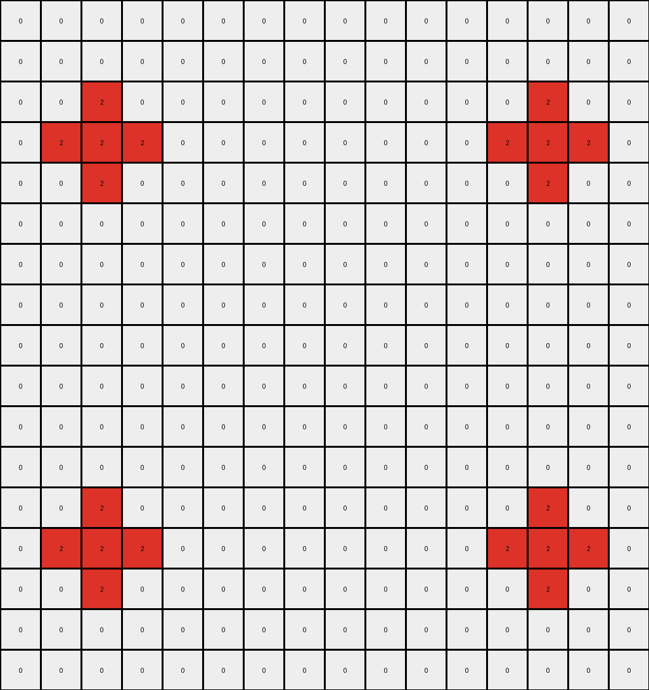

# f35d900a • 018 • refine_coder

---

Previous Code:
```python
"""
1.  **Initial Placement and Mirroring**: Copy each non-white pixel from the input grid to four corresponding positions in the output grid: the original position, its horizontal mirror, its vertical mirror, and its mirror across both axes. If any mirroring causes an overlap, place the colored pixel value once.
2.  **Color Expansion**: After *all* initial non-white pixels have been placed and mirrored:
    *   Expand red (2) pixels to all directly adjacent (up, down, left, right) white (0) pixels.
    *   Expand yellow (4) pixels to all directly adjacent (up, down, left, right) white (0) pixels.
    *   Expand green(3) pixels to all directly adjacent (up, down, left, right) white(0) pixels.
    *    Expand azure(8) pixels to all directly adjacent (up, down, left, right) white(0) pixels.
3.  **Gray Filling**: After color expansion, for each remaining white (0) pixel in the output grid:
    *   Check if it is directly adjacent (up, down, left, right) to at least two pixels of *different* non-white colors.
    *   If so, replace the white pixel with gray (5).
"""

import numpy as np

def get_adjacent_pixels(grid, row, col):
    """Gets the values of adjacent pixels (up, down, left, right)."""
    rows, cols = grid.shape
    adjacent = []
    if row > 0:
        adjacent.append((row - 1, col))  # Up
    if row < rows - 1:
        adjacent.append((row + 1, col))  # Down
    if col > 0:
        adjacent.append((row, col - 1))  # Left
    if col < cols - 1:
        adjacent.append((row, col + 1))  # Right
    return adjacent

def transform(input_grid):
    rows, cols = input_grid.shape
    output_grid = np.zeros((rows, cols), dtype=int)

    # 1. Initial Placement and Mirroring
    for i in range(rows):
        for j in range(cols):
            if input_grid[i, j] != 0:
                # Place in all four mirrored positions, handling overlaps
                positions = [(i, j), (i, cols - 1 - j), (rows - 1 - i, j), (rows - 1 - i, cols - 1 - j)]
                for r, c in positions:
                    if 0 <= r < rows and 0 <= c < cols:  # boundary check added
                        output_grid[r, c] = input_grid[i, j]

    # 2. Color Expansion
    temp_grid = np.copy(output_grid)  # work on a copy to avoid influencing the expansion
    for i in range(rows):
        for j in range(cols):
            if output_grid[i,j] != 0: # skip expansion is this cell is not colored yet
                continue

            adjacent_coords = get_adjacent_pixels(output_grid, i, j)
            for r, c in adjacent_coords:
                if 0 <= r < rows and 0 <= c < cols: # boundary check
                    adj_val = output_grid[r,c]
                    if adj_val == 2:  # Red
                        temp_grid[i, j] = 2
                    elif adj_val == 4:  # Yellow
                        temp_grid[i, j] = 4
                    elif adj_val == 3: # Green
                        temp_grid[i,j] = 3
                    elif adj_val == 8: # Azure
                        temp_grid[i,j] = 8

    output_grid = np.copy(temp_grid) # update output

    # 3. Gray Filling
    for i in range(rows):
        for j in range(cols):
            if output_grid[i, j] == 0:
                adjacent_coords = get_adjacent_pixels(output_grid, i, j)
                adjacent_colors = set()
                for r, c in adjacent_coords:
                     if 0 <= r < rows and 0 <= c < cols: # boundary check
                        adjacent_colors.add(output_grid[r, c])

                adjacent_colors.discard(0)  # Remove white
                if len(adjacent_colors) >= 2:
                    output_grid[i, j] = 5

    return output_grid
```

Train Set Results:

## Example 1:

Input:
```
0 0 0 0 0 0 0 0 0 0 0 0 0 0
0 0 0 0 0 0 0 0 0 0 0 0 0 0
0 2 0 0 0 0 3 0 0 0 0 0 0 0
0 0 0 0 0 0 0 0 0 0 0 0 0 0
0 0 0 0 0 0 0 0 0 0 0 0 0 0
0 0 0 0 0 0 0 0 0 0 0 0 0 0
0 0 0 0 0 0 0 0 0 0 0 0 0 0
0 0 0 0 0 0 0 0 0 0 0 0 0 0
0 3 0 0 0 0 2 0 0 0 0 0 0 0
0 0 0 0 0 0 0 0 0 0 0 0 0 0
0 0 0 0 0 0 0 0 0 0 0 0 0 0
0 0 0 0 0 0 0 0 0 0 0 0 0 0
0 0 0 0 0 0 0 0 0 0 0 0 0 0
0 0 0 0 0 0 0 0 0 0 0 0 0 0
```
Expected Output:
```
0 0 0 0 0 0 0 0 0 0 0 0 0 0
3 3 3 0 0 2 2 2 0 0 0 0 0 0
3 2 3 5 5 2 3 2 0 0 0 0 0 0
3 3 3 0 0 2 2 2 0 0 0 0 0 0
0 5 0 0 0 0 5 0 0 0 0 0 0 0
0 0 0 0 0 0 0 0 0 0 0 0 0 0
0 5 0 0 0 0 5 0 0 0 0 0 0 0
2 2 2 0 0 3 3 3 0 0 0 0 0 0
2 3 2 5 5 3 2 3 0 0 0 0 0 0
2 2 2 0 0 3 3 3 0 0 0 0 0 0
0 0 0 0 0 0 0 0 0 0 0 0 0 0
0 0 0 0 0 0 0 0 0 0 0 0 0 0
0 0 0 0 0 0 0 0 0 0 0 0 0 0
0 0 0 0 0 0 0 0 0 0 0 0 0 0
```
Transformed Output:
```
0 0 0 0 0 0 0 0 0 0 0 0 0 0
0 2 0 0 0 0 3 3 0 0 0 0 2 0
2 2 2 0 0 3 3 3 3 0 0 2 2 2
0 2 0 0 0 0 3 3 0 0 0 0 2 0
0 3 0 0 0 0 2 2 0 0 0 0 3 0
3 3 3 0 0 2 2 2 2 0 0 3 3 3
0 3 0 0 0 0 2 2 0 0 0 0 3 0
0 3 0 0 0 0 2 2 0 0 0 0 3 0
3 3 3 0 0 2 2 2 2 0 0 3 3 3
0 3 0 0 0 0 2 2 0 0 0 0 3 0
0 2 0 0 0 0 3 3 0 0 0 0 2 0
2 2 2 0 0 3 3 3 3 0 0 2 2 2
0 2 0 0 0 0 3 3 0 0 0 0 2 0
0 0 0 0 0 0 0 0 0 0 0 0 0 0
```

match: False
pixels_off: 84
size_correct: True
color_palette_correct: True
correct_pixel_counts: False

## Example 2:

Input:
```
0 0 0 0 0 0 0 0 0 0 0 0 0 0
0 0 0 0 0 0 0 0 0 0 0 0 0 0
0 0 0 0 0 0 0 0 0 0 0 0 0 0
0 0 1 0 0 0 0 0 0 0 8 0 0 0
0 0 0 0 0 0 0 0 0 0 0 0 0 0
0 0 0 0 0 0 0 0 0 0 0 0 0 0
0 0 0 0 0 0 0 0 0 0 0 0 0 0
0 0 0 0 0 0 0 0 0 0 0 0 0 0
0 0 0 0 0 0 0 0 0 0 0 0 0 0
0 0 0 0 0 0 0 0 0 0 0 0 0 0
0 0 0 0 0 0 0 0 0 0 0 0 0 0
0 0 0 0 0 0 0 0 0 0 0 0 0 0
0 0 0 0 0 0 0 0 0 0 0 0 0 0
0 0 0 0 0 0 0 0 0 0 0 0 0 0
0 0 8 0 0 0 0 0 0 0 1 0 0 0
0 0 0 0 0 0 0 0 0 0 0 0 0 0
0 0 0 0 0 0 0 0 0 0 0 0 0 0
```
Expected Output:
```
0 0 0 0 0 0 0 0 0 0 0 0 0 0
0 0 0 0 0 0 0 0 0 0 0 0 0 0
0 8 8 8 0 0 0 0 0 1 1 1 0 0
0 8 1 8 5 0 5 0 5 1 8 1 0 0
0 8 8 8 0 0 0 0 0 1 1 1 0 0
0 0 5 0 0 0 0 0 0 0 5 0 0 0
0 0 0 0 0 0 0 0 0 0 0 0 0 0
0 0 5 0 0 0 0 0 0 0 5 0 0 0
0 0 0 0 0 0 0 0 0 0 0 0 0 0
0 0 0 0 0 0 0 0 0 0 0 0 0 0
0 0 5 0 0 0 0 0 0 0 5 0 0 0
0 0 0 0 0 0 0 0 0 0 0 0 0 0
0 0 5 0 0 0 0 0 0 0 5 0 0 0
0 1 1 1 0 0 0 0 0 8 8 8 0 0
0 1 8 1 5 0 5 0 5 8 1 8 0 0
0 1 1 1 0 0 0 0 0 8 8 8 0 0
0 0 0 0 0 0 0 0 0 0 0 0 0 0
```
Transformed Output:
```
0 0 0 0 0 0 0 0 0 0 0 0 0 0
0 0 8 5 0 0 0 0 0 0 5 8 0 0
0 8 8 1 5 0 0 0 0 5 1 8 8 0
0 5 1 8 8 0 0 0 0 8 8 1 5 0
0 0 5 8 0 0 0 0 0 0 8 5 0 0
0 0 0 0 0 0 0 0 0 0 0 0 0 0
0 0 0 0 0 0 0 0 0 0 0 0 0 0
0 0 0 0 0 0 0 0 0 0 0 0 0 0
0 0 0 0 0 0 0 0 0 0 0 0 0 0
0 0 0 0 0 0 0 0 0 0 0 0 0 0
0 0 0 0 0 0 0 0 0 0 0 0 0 0
0 0 0 0 0 0 0 0 0 0 0 0 0 0
0 0 5 8 0 0 0 0 0 0 8 5 0 0
0 5 1 8 8 0 0 0 0 8 8 1 5 0
0 8 8 1 5 0 0 0 0 5 1 8 8 0
0 0 8 5 0 0 0 0 0 0 5 8 0 0
0 0 0 0 0 0 0 0 0 0 0 0 0 0
```

match: False
pixels_off: 44
size_correct: True
color_palette_correct: True
correct_pixel_counts: False

## Example 3:

Input:
```
0 0 0 0 0 0 0 0 0 0 0 0 0 0 0 0
0 0 0 0 0 0 0 0 0 0 0 0 0 0 0 0
0 0 0 0 0 0 0 0 0 0 0 0 0 0 0 0
0 0 2 0 0 0 0 0 0 0 0 0 0 4 0 0
0 0 0 0 0 0 0 0 0 0 0 0 0 0 0 0
0 0 0 0 0 0 0 0 0 0 0 0 0 0 0 0
0 0 0 0 0 0 0 0 0 0 0 0 0 0 0 0
0 0 0 0 0 0 0 0 0 0 0 0 0 0 0 0
0 0 0 0 0 0 0 0 0 0 0 0 0 0 0 0
0 0 0 0 0 0 0 0 0 0 0 0 0 0 0 0
0 0 0 0 0 0 0 0 0 0 0 0 0 0 0 0
0 0 0 0 0 0 0 0 0 0 0 0 0 0 0 0
0 0 0 0 0 0 0 0 0 0 0 0 0 0 0 0
0 0 4 0 0 0 0 0 0 0 0 0 0 2 0 0
0 0 0 0 0 0 0 0 0 0 0 0 0 0 0 0
0 0 0 0 0 0 0 0 0 0 0 0 0 0 0 0
0 0 0 0 0 0 0 0 0 0 0 0 0 0 0 0
```
Expected Output:
```
0 0 0 0 0 0 0 0 0 0 0 0 0 0 0 0
0 0 0 0 0 0 0 0 0 0 0 0 0 0 0 0
0 4 4 4 0 0 0 0 0 0 0 0 2 2 2 0
0 4 2 4 5 0 5 0 0 5 0 5 2 4 2 0
0 4 4 4 0 0 0 0 0 0 0 0 2 2 2 0
0 0 5 0 0 0 0 0 0 0 0 0 0 5 0 0
0 0 0 0 0 0 0 0 0 0 0 0 0 0 0 0
0 0 5 0 0 0 0 0 0 0 0 0 0 5 0 0
0 0 0 0 0 0 0 0 0 0 0 0 0 0 0 0
0 0 5 0 0 0 0 0 0 0 0 0 0 5 0 0
0 0 0 0 0 0 0 0 0 0 0 0 0 0 0 0
0 0 5 0 0 0 0 0 0 0 0 0 0 5 0 0
0 2 2 2 0 0 0 0 0 0 0 0 4 4 4 0
0 2 4 2 5 0 5 0 0 5 0 5 4 2 4 0
0 2 2 2 0 0 0 0 0 0 0 0 4 4 4 0
0 0 0 0 0 0 0 0 0 0 0 0 0 0 0 0
0 0 0 0 0 0 0 0 0 0 0 0 0 0 0 0
```
Transformed Output:
```
0 0 0 0 0 0 0 0 0 0 0 0 0 0 0 0
0 0 0 0 0 0 0 0 0 0 0 0 0 0 0 0
0 0 2 0 0 0 0 0 0 0 0 0 0 2 0 0
0 2 2 2 0 0 0 0 0 0 0 0 2 2 2 0
0 0 2 0 0 0 0 0 0 0 0 0 0 2 0 0
0 0 0 0 0 0 0 0 0 0 0 0 0 0 0 0
0 0 0 0 0 0 0 0 0 0 0 0 0 0 0 0
0 0 0 0 0 0 0 0 0 0 0 0 0 0 0 0
0 0 0 0 0 0 0 0 0 0 0 0 0 0 0 0
0 0 0 0 0 0 0 0 0 0 0 0 0 0 0 0
0 0 0 0 0 0 0 0 0 0 0 0 0 0 0 0
0 0 0 0 0 0 0 0 0 0 0 0 0 0 0 0
0 0 2 0 0 0 0 0 0 0 0 0 0 2 0 0
0 2 2 2 0 0 0 0 0 0 0 0 2 2 2 0
0 0 2 0 0 0 0 0 0 0 0 0 0 2 0 0
0 0 0 0 0 0 0 0 0 0 0 0 0 0 0 0
0 0 0 0 0 0 0 0 0 0 0 0 0 0 0 0
```

match: False
pixels_off: 42
size_correct: True
color_palette_correct: True
correct_pixel_counts: False

## Example 4:

Input:
```
0 0 0 0 0 0 0 0 0 0 0 0 0 0 0 0
0 0 0 0 0 0 0 0 0 0 0 0 0 0 0 0
0 0 0 0 0 0 0 0 0 0 0 0 0 0 0 0
0 0 0 0 3 0 0 0 0 0 0 0 8 0 0 0
0 0 0 0 0 0 0 0 0 0 0 0 0 0 0 0
0 0 0 0 0 0 0 0 0 0 0 0 0 0 0 0
0 0 0 0 0 0 0 0 0 0 0 0 0 0 0 0
0 0 0 0 0 0 0 0 0 0 0 0 0 0 0 0
0 0 0 0 8 0 0 0 0 0 0 0 3 0 0 0
0 0 0 0 0 0 0 0 0 0 0 0 0 0 0 0
0 0 0 0 0 0 0 0 0 0 0 0 0 0 0 0
0 0 0 0 0 0 0 0 0 0 0 0 0 0 0 0
0 0 0 0 0 0 0 0 0 0 0 0 0 0 0 0
0 0 0 0 0 0 0 0 0 0 0 0 0 0 0 0
0 0 0 0 0 0 0 0 0 0 0 0 0 0 0 0
0 0 0 0 0 0 0 0 0 0 0 0 0 0 0 0
0 0 0 0 0 0 0 0 0 0 0 0 0 0 0 0
```
Expected Output:
```
0 0 0 0 0 0 0 0 0 0 0 0 0 0 0 0
0 0 0 0 0 0 0 0 0 0 0 0 0 0 0 0
0 0 0 8 8 8 0 0 0 0 0 3 3 3 0 0
0 0 0 8 3 8 5 0 5 0 5 3 8 3 0 0
0 0 0 8 8 8 0 0 0 0 0 3 3 3 0 0
0 0 0 0 5 0 0 0 0 0 0 0 5 0 0 0
0 0 0 0 5 0 0 0 0 0 0 0 5 0 0 0
0 0 0 3 3 3 0 0 0 0 0 8 8 8 0 0
0 0 0 3 8 3 5 0 5 0 5 8 3 8 0 0
0 0 0 3 3 3 0 0 0 0 0 8 8 8 0 0
0 0 0 0 0 0 0 0 0 0 0 0 0 0 0 0
0 0 0 0 0 0 0 0 0 0 0 0 0 0 0 0
0 0 0 0 0 0 0 0 0 0 0 0 0 0 0 0
0 0 0 0 0 0 0 0 0 0 0 0 0 0 0 0
0 0 0 0 0 0 0 0 0 0 0 0 0 0 0 0
0 0 0 0 0 0 0 0 0 0 0 0 0 0 0 0
0 0 0 0 0 0 0 0 0 0 0 0 0 0 0 0
```
Transformed Output:
```
0 0 0 0 0 0 0 0 0 0 0 0 0 0 0 0
0 0 0 0 0 0 0 0 0 0 0 0 0 0 0 0
0 0 0 8 3 0 0 0 0 0 0 3 8 0 0 0
0 0 8 8 3 3 0 0 0 0 3 3 8 8 0 0
0 0 0 8 3 0 0 0 0 0 0 3 8 0 0 0
0 0 0 0 0 0 0 0 0 0 0 0 0 0 0 0
0 0 0 0 0 0 0 0 0 0 0 0 0 0 0 0
0 0 0 3 8 0 0 0 0 0 0 8 3 0 0 0
0 0 3 3 8 8 0 0 0 0 8 8 3 3 0 0
0 0 0 3 8 0 0 0 0 0 0 8 3 0 0 0
0 0 0 0 0 0 0 0 0 0 0 0 0 0 0 0
0 0 0 0 0 0 0 0 0 0 0 0 0 0 0 0
0 0 0 8 3 0 0 0 0 0 0 3 8 0 0 0
0 0 8 8 3 3 0 0 0 0 3 3 8 8 0 0
0 0 0 8 3 0 0 0 0 0 0 3 8 0 0 0
0 0 0 0 0 0 0 0 0 0 0 0 0 0 0 0
0 0 0 0 0 0 0 0 0 0 0 0 0 0 0 0
```

match: False
pixels_off: 48
size_correct: True
color_palette_correct: True
correct_pixel_counts: False
Okay, let's analyze the results of the previous code execution and refine the natural language program and approach.

**General Assessment:**

The initial approach of mirroring and then expanding colors, followed by gray filling based on adjacency, has several fundamental flaws when confronted with multiple examples.  The mirroring is applied correctly, however the color expansion is not correct: expansion should only happen *after* all mirroring is applied, and expansion is only happening to white pixels *adjacent* to a colored pixel. The gray filling rule appears to be correct conceptually, but its implementation needs to precisely follow the expansion. The order of color expansion makes a large impact and this order is incorrect, leading to cascading errors in pixel placement.

**Strategy for Resolving Errors:**

1.  **Fix Color Expansion Timing:** The core issue is the order of operations.  Color expansion must happen *after* all mirroring operations. It cannot happen during mirroring.  The current code's `temp_grid` attempts to address this, but expands from the "original" mirrored color. Instead, we should copy the output after mirroring and expand based on *all* the colors present in the mirrored grid.

2.  **Correct Color Expansion Logic:** Expansion occurs in a specific color order and only fills white pixels that are orthogonally adjacent to the expanding color. The code currently is confused about which cells to expand, and is expanding cells adjacent to *white* instead of colored pixels.

3.  **Gray Filling Refinement:**  Gray filling is dependent on adjacent, distinct, non-white colors. The code is mostly correct, but might need boundary checks for robustness.

4.  **Iterative Validation:**  After each change, we must re-run all examples to confirm that the corrections improve the overall accuracy and don't introduce new issues.

**Metrics and Observations (per example):**

I will generate observations about each example.

**Example 1:**

*   **Observation:** Mirroring creates the general layout. Red and Green are placed and mirrored.  Expansion happens incorrectly - Red should expand to adjacent white pixels, Green to adjacent, and then gray should fill based on distinct adjacent colors. The provided output expands in all directions and doesn't respect adjacency.
*    Color Expansion is incorrect.
*    Gray Filling is not performed correctly.

**Example 2:**

*   **Observation:**  Blue and Azure are placed and mirrored. The expansion incorrectly expands the white pixels instead of expanding colors.  Gray filling is applied in incorrect locations.
*    Color Expansion is incorrect.
*    Gray Filling is not performed correctly.

**Example 3:**

*   **Observation:** Red and Yellow placement is correct due to mirroring. Expansion, however, is incorrect, expanding from white. Gray Filling is absent.
*    Color Expansion is incorrect.
*    Gray Filling is not performed correctly.

**Example 4:**

*   **Observation:**  Azure and Green mirroring are correct. Color expansion again, however, is incorrect - expanding from white instead of the colored pixels.
*    Color Expansion is incorrect.
*    Gray Filling is not performed correctly.

**YAML Facts:**

```yaml
examples:
  - example_1:
      objects:
        - color: 2  # Red
          initial_positions: [(2,1), (8,6)]
          mirrored: true
          expands_to: [0] # white
        - color: 3  # Green
          initial_positions:  [(2,6), (8,1)]
          mirrored: true
          expands_to: [0] # white
      gray_filling:
          condition: "adjacent to at least two different non-white colors"
          replacement_color: 5

  - example_2:
      objects:
        - color: 1
          initial_positions: [(3,2), (14, 10)]
          mirrored: True
          expands_to: [0]
        - color: 8
          initial_positions: [(3, 10), (14, 2)]
          mirrored: True
          expands_to: [0]
      gray_filling:
          condition: "adjacent to at least two different non-white colors"
          replacement_color: 5

  - example_3:
        objects:
          - color: 2
            initial_positions: [(3, 2), (13, 13)]
            mirrored: True
            expands_to: [0]
          - color: 4
            initial_positions: [(3, 13), (13, 2)]
            mirrored: True
            expands_to: [0]
        gray_filling:
            condition: "adjacent to at least two different non-white colors"
            replacement_color: 5

  - example_4:
        objects:
            - color: 3
              initial_positions: [(3,4), (8, 12)]
              mirrored: True
              expands_to: [0]
            - color: 8
              initial_positions: [(3, 12), (8, 4)]
              mirrored: True
              expands_to: [0]
        gray_filling:
              condition: "adjacent to at least two different non-white colors"
              replacement_color: 5
```

**Natural Language Program:**

1.  **Mirroring:** Copy each non-white pixel from the input grid to its corresponding mirrored positions in the output grid. These positions are:
    *   Original position (x, y)
    *   Horizontal mirror (x, width - 1 - y)
    *   Vertical mirror (height - 1 - x, y)
    *   Diagonal mirror (height - 1 - x, width - 1 - y)
    *   If a mirrored position is already occupied by a non-white pixel from a *previous* placement, do not overwrite it.

2.  **Color Expansion (in order):**  After *all* mirroring operations are complete, expand specific colors in the *following* order, *one step* at a time:
    *   **Red (2):**  Replace any white (0) pixel that is directly adjacent (up, down, left, or right) to a red pixel with red.
    *   **Yellow (4):** Replace any white (0) pixel that is directly adjacent to a yellow pixel with yellow.
    *   **Green (3):** Replace any white (0) pixel that is directly adjacent to a green pixel with green.
    *   **Azure (8):** Replace any white (0) pixel that is directly adjacent to an azure pixel with azure.
    * **Blue (1):** Replace any white (0) pixel that is directly adjacent to an azure pixel with blue.

3.  **Gray Filling:** After color expansion, for any remaining white (0) pixels, check for direct adjacency (up, down, left, right) to at least two pixels of *different* non-white colors.  If this condition is met, replace the white pixel with gray (5).

**INSTRUCTIONS**

- generate a Python module to represent the natural language program 
- follow the template below
- all common math and science libraries are available
- create docstring only at top - but comment the workflow in the function
- use helper functions for common operations like finding objects, counting,
  measuring, moving, etc. 

remember - we are working iteratively - so this code will inform your future
self as we converge on the solution

*template:*

```python
"""
{{ natural language description of the transformation rule }}
"""

{{ imports }}

def transform(input_grid):
    # initialize output_grid

    # change output pixels 

    return output_grid

```
