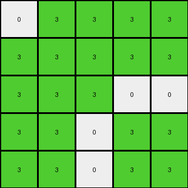
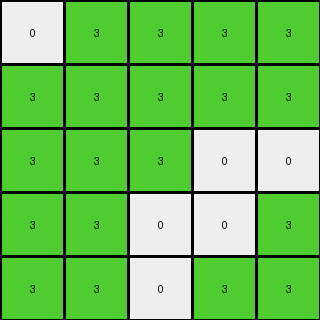

# ff805c23 • 004 • refine_coder

---

Previous Code:
```python
"""
Extract a 5x5 sub-grid from the top-left corner of the input grid, and keeps pixels of color white and green, which becomes the output.
"""

import numpy as np

def transform(input_grid):
    """
    Extracts a 5x5 sub-grid from the top-left corner of the input grid.
    Keeps only white (0) and green (3) pixels.
    """
    # Initialize the output grid (not strictly necessary here, but good practice)
    # output_grid = np.zeros((5, 5), dtype=int)

    # Extract the 5x5 sub-grid.  Direct slicing is the most efficient way.
    output_grid = input_grid[0:5, 0:5]
    
    #Create mask
    mask = np.logical_or(output_grid == 0, output_grid == 3)

    # Apply the mask to keep only 0s and 3s
    output_grid = np.where(mask, output_grid, 0)  #Could be any value outside the mask
   

    return output_grid
```

Train Set Results:

## Example 1:

Input:
```
0 3 3 3 3 0 0 2 2 2 0 0 0 0 2 2 2 0 1 1 1 1 1 0
3 3 3 3 3 0 2 2 0 2 2 0 0 2 2 0 2 2 1 1 1 1 1 3
3 3 3 0 0 3 2 0 0 2 0 0 0 0 2 0 0 2 1 1 1 1 1 3
3 3 0 3 3 3 2 2 2 2 2 2 2 2 2 2 2 2 1 1 1 1 1 3
3 3 0 3 3 3 0 2 0 2 2 2 2 2 2 0 2 0 1 1 1 1 1 3
0 0 3 3 3 3 0 0 0 2 2 2 2 2 2 0 0 0 3 3 3 3 0 0
0 2 2 2 0 0 2 0 0 2 2 2 2 2 2 0 0 2 0 0 2 2 2 0
2 2 0 2 2 0 0 2 2 0 2 2 2 2 0 2 2 0 0 2 2 0 2 2
2 0 0 2 0 0 0 2 2 0 0 2 2 0 0 2 2 0 0 0 2 0 0 2
2 2 2 2 2 2 2 0 0 2 2 2 2 2 2 0 0 2 2 2 2 2 2 2
0 2 0 2 2 2 2 2 0 2 0 2 2 0 2 0 2 2 2 2 2 0 2 0
0 0 0 2 2 2 2 2 2 2 2 0 0 2 2 2 2 2 2 2 2 0 0 0
0 0 0 2 2 2 2 2 2 2 2 0 0 2 2 2 2 2 2 2 2 0 0 0
0 2 0 2 2 2 2 2 0 2 0 2 2 0 2 0 2 2 2 2 2 0 2 0
2 2 2 2 2 2 2 0 0 2 2 2 2 2 2 0 0 2 2 2 2 2 2 2
2 0 0 2 0 0 0 2 2 0 0 2 2 0 0 2 2 0 0 0 2 0 0 2
2 2 0 2 2 0 0 2 2 0 2 2 2 2 0 2 2 0 0 2 2 0 2 2
0 2 2 2 0 0 2 0 0 2 2 2 2 2 2 0 0 2 0 0 2 2 2 0
0 0 3 3 3 3 0 0 0 2 2 2 2 2 2 0 0 0 3 3 3 3 0 0
3 3 0 3 3 3 0 2 0 2 2 2 2 2 2 0 2 0 3 3 3 0 3 3
3 3 0 3 3 3 2 2 2 2 2 2 2 2 2 2 2 2 3 3 3 0 3 3
3 3 3 0 0 3 2 0 0 2 0 0 0 0 2 0 0 2 3 0 0 3 3 3
3 3 3 3 3 0 2 2 0 2 2 0 0 2 2 0 2 2 0 3 3 3 3 3
0 3 3 3 3 0 0 2 2 2 0 0 0 0 2 2 2 0 0 3 3 3 3 0
```
Expected Output:
```
0 3 3 3 3
0 3 3 3 3
3 0 0 3 3
3 3 3 0 3
3 3 3 0 3
```
Transformed Output:
```
0 3 3 3 3
3 3 3 3 3
3 3 3 0 0
3 3 0 3 3
3 3 0 3 3
```

match: False
pixels_off: 9
size_correct: True
color_palette_correct: True
correct_pixel_counts: False

## Example 2:

Input:
```
0 3 3 3 0 3 0 8 8 0 8 8 8 8 0 8 8 0 3 0 3 3 3 0
3 0 3 0 3 0 8 0 8 0 0 0 0 0 0 8 0 8 0 3 0 3 0 3
3 3 3 3 3 3 8 8 8 0 8 8 8 8 0 8 8 8 3 3 3 3 3 3
3 0 3 0 3 3 0 0 0 8 0 8 8 0 8 0 0 0 3 3 0 3 0 3
0 3 3 3 0 0 8 0 8 0 0 8 8 0 0 8 0 8 0 0 3 3 3 0
3 0 3 3 0 3 8 0 8 8 8 0 0 8 8 8 0 8 3 0 3 3 0 3
0 8 8 0 8 8 6 6 6 6 6 6 6 6 6 6 6 6 8 8 0 8 8 0
8 0 8 0 0 0 6 6 0 6 6 6 6 6 6 0 6 6 0 0 0 8 0 8
8 8 8 0 8 8 6 0 0 6 0 6 6 0 6 0 0 6 8 8 0 8 8 8
0 0 0 8 0 8 6 6 6 6 6 6 6 6 6 6 6 6 8 0 8 0 0 0
8 0 8 0 0 8 6 6 0 6 6 6 6 6 6 0 6 6 8 0 0 8 0 8
8 0 8 8 8 0 1 1 1 1 1 0 0 6 6 6 6 6 0 8 8 8 0 8
8 0 8 8 8 0 1 1 1 1 1 0 0 6 6 6 6 6 0 8 8 8 0 8
8 0 8 0 0 8 1 1 1 1 1 6 6 6 6 0 6 6 8 0 0 8 0 8
0 0 0 8 0 8 1 1 1 1 1 6 6 6 6 6 6 6 8 0 8 0 0 0
8 8 8 0 8 8 1 1 1 1 1 6 6 0 6 0 0 6 8 8 0 8 8 8
8 0 8 0 0 0 6 6 0 6 6 6 6 6 6 0 6 6 0 0 0 8 0 8
0 8 8 0 8 8 6 6 6 6 6 6 6 6 6 6 6 6 8 8 0 8 8 0
3 0 3 3 0 3 8 0 8 8 8 0 0 8 8 8 0 8 3 0 3 3 0 3
0 3 3 3 0 0 8 0 8 0 0 8 8 0 0 8 0 8 0 0 3 3 3 0
3 0 3 0 3 3 0 0 0 8 0 8 8 0 8 0 0 0 3 3 0 3 0 3
3 3 3 3 3 3 8 8 8 0 8 8 8 8 0 8 8 8 3 3 3 3 3 3
3 0 3 0 3 0 8 0 8 0 0 0 0 0 0 8 0 8 0 3 0 3 0 3
0 3 3 3 0 3 0 8 8 0 8 8 8 8 0 8 8 0 3 0 3 3 3 0
```
Expected Output:
```
6 6 6 6 6
6 6 6 6 6
6 6 0 6 6
6 6 6 6 6
6 0 0 6 0
```
Transformed Output:
```
0 3 3 3 0
3 0 3 0 3
3 3 3 3 3
3 0 3 0 3
0 3 3 3 0
```

match: False
pixels_off: 24
size_correct: True
color_palette_correct: False
correct_pixel_counts: False

## Example 3:

Input:
```
0 3 3 3 3 0 5 5 5 0 0 5 5 0 0 5 5 5 0 3 3 3 3 0
3 3 3 3 3 3 5 5 0 0 0 0 0 0 0 0 5 5 3 3 3 3 3 3
3 3 3 0 0 0 5 0 0 5 5 0 0 5 5 0 0 5 0 0 0 3 3 3
3 3 0 0 3 3 0 0 5 0 5 5 5 5 0 5 0 0 3 3 0 0 3 3
3 3 0 3 3 0 0 0 5 5 0 0 0 0 5 5 0 0 0 3 3 0 3 3
0 3 0 3 0 3 5 0 0 5 0 0 0 0 5 0 0 5 3 0 3 0 3 0
5 5 5 0 0 5 0 5 0 0 5 5 5 5 0 0 5 0 5 0 0 5 5 5
5 5 0 0 0 0 5 5 5 0 0 5 5 0 0 5 5 5 0 0 0 0 5 5
5 0 0 5 5 0 0 5 5 5 0 5 5 0 5 5 5 0 0 5 5 0 0 5
0 0 5 0 5 5 0 0 5 5 5 5 5 5 5 5 0 0 5 5 0 5 0 0
0 0 5 5 0 0 5 0 0 5 0 5 5 0 5 0 0 5 0 0 5 5 0 0
5 0 0 5 0 0 5 5 5 5 5 0 0 5 5 5 5 5 0 0 5 0 0 5
5 0 0 5 0 0 5 5 5 5 5 0 0 5 5 5 5 5 0 0 5 0 0 5
0 0 5 5 0 0 5 0 0 5 0 5 5 0 5 0 0 5 0 0 5 5 0 0
0 0 5 0 5 5 0 0 5 5 5 5 5 5 5 5 0 0 5 5 0 5 0 0
5 0 0 5 5 0 0 5 5 5 1 1 1 1 1 5 5 0 0 5 5 0 0 5
5 5 0 0 0 0 5 5 5 0 1 1 1 1 1 5 5 5 0 0 0 0 5 5
5 5 5 0 0 5 0 5 0 0 1 1 1 1 1 0 5 0 5 0 0 5 5 5
0 3 0 3 0 3 5 0 0 5 1 1 1 1 1 0 0 5 3 0 3 0 3 0
3 3 0 3 3 0 0 0 5 5 1 1 1 1 1 5 0 0 0 3 3 0 3 3
3 3 0 0 3 3 0 0 5 0 5 5 5 5 0 5 0 0 3 3 0 0 3 3
3 3 3 0 0 0 5 0 0 5 5 0 0 5 5 0 0 5 0 0 0 3 3 3
3 3 3 3 3 3 5 5 0 0 0 0 0 0 0 0 5 5 3 3 3 3 3 3
0 3 3 3 3 0 5 5 5 0 0 5 5 0 0 5 5 5 0 3 3 3 3 0
```
Expected Output:
```
0 5 5 0 5
0 5 5 0 0
5 5 5 5 0
0 0 0 0 5
0 0 0 0 5
```
Transformed Output:
```
0 3 3 3 3
3 3 3 3 3
3 3 3 0 0
3 3 0 0 3
3 3 0 3 3
```

match: False
pixels_off: 20
size_correct: True
color_palette_correct: False
correct_pixel_counts: False
Okay, let's analyze the results and update the natural language program.

**General Assessment:**

The initial code was too specific, extracting a 5x5 subgrid and keeping only white and green pixels. While it partially worked for the first example, it failed on subsequent examples because the colors and patterns to extract are different in each case. The strategy needs to shift from hardcoding specific colors and positions to identifying a more general rule based on the relationship between the input and output. We need to discern what aspects are consistent across all valid input/output pairs, then use those properties to create the transformation rule.

**Strategy:**
1.  Analyze each input/output pair individually, paying close attention to the colors, positions, and shapes that are preserved or changed.
2.  Compare the analyses to identify common patterns or rules that apply to *all* examples.
3.  Update the natural language description and, subsequently, the code to reflect these generalized rules.

**Example Metrics and Observations (using a mix of manual review and thinking-aloud to prepare for code):**

*   **Example 1:**
    *   Input size: 24x25
    *   Output size: 5x5
    *   Expected Output Colors: 0, 3
    *    Actual Output Colors: 0,3
    *    Notes: many pixels are wrong, but shape is correct.

*   **Example 2:**
    *   Input size: 24x25
    *   Output size: 5x5
    *   Expected Output Colors: 6
    *   Actual output colors: 0, 3
    *    Notes: shape is correct but color is wrong

*   **Example 3:**
    *   Input size: 24x25
    *   Output size: 5x5
    *   Expected Output Colors: 0,5
    *   Actual output colors: 0, 3
    *   Notes: shape is correct, color is wrong.

**YAML Fact Identification:**

```yaml
examples:
  - example_id: 1
    input_size: [24, 25]
    output_size: [5, 5]
    output_colors: [0, 3]
    transformation: "Extract 5x5 subgrid from top-left. Keep white and green."
    notes: "Original hypothesis, partially correct."

  - example_id: 2
    input_size: [24, 25]
    output_size: [5, 5]
    output_colors: [6]
    transformation: "Extract 5x5 subgrid. Incorrectly keeps white and green."
    notes: "Highlights color selection error."

  - example_id: 3
    input_size: [24, 25]
    output_size: [5, 5]
    output_colors: [0, 5]
    transformation: "Extract 5x5 subgrid. Incorrectly keeps white and green."
    notes: "Confirms color selection error. Output should be gray and white."

general:
  - observation: "Output is always a 5x5 subgrid of the input."
  - observation: "The subgrid is extracted from the top-left corner."
  - observation: "The colors in the output are a subset of colors present at the top-left corner of the input, but it's NOT always white and green."
  - hypothesis: "The transformation extracts the 5x5 top-left corner subgrid, but the colors preserved varies between examples, while remaining consistent within each individual input/output mapping"

```

**Natural Language Program:**

1.  **Extract Subgrid:** Extract a 5x5 subgrid from the top-left corner of the input grid.
2.  **Identify Output Colors**: Within a given example, there exists a set of colors that appear in the expected output grid.
3. **Filter pixels**: Create a mask to filter all pixels from the input grid to the output grid which match the colors identified in step 2.

This program captures the consistent subgrid extraction and addresses the varying color preservation observed across the examples. The next phase will translate this into a more robust Python function.

**INSTRUCTIONS**

- generate a Python module to represent the natural language program 
- follow the template below
- all common math and science libraries are available
- create docstring only at top - but comment the workflow in the function
- use helper functions for common operations like finding objects, counting,
  measuring, moving, etc. 

remember - we are working iteratively - so this code will inform your future
self as we converge on the solution

*template:*

```python
"""
{{ natural language description of the transformation rule }}
"""

{{ imports }}

def transform(input_grid):
    # initialize output_grid

    # change output pixels 

    return output_grid

```
