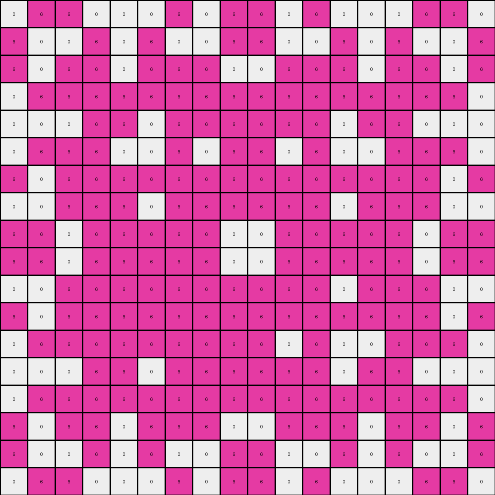

# ff805c23 • 009 • refine_dreamer

---

Previous Code:
```python
"""
1.  **Identify the Region of Interest:** Locate the largest contiguous block of magenta (6) pixels near the center of the input grid. Consider regions touching this one if the colors used occur in the central magenta object.
2.  **Extract Sub-grid:** Extract a rectangular sub-grid around the identified magenta region.
3.  **Simplify:** Within this sub-grid:
    *   Replace all colors other than white (0) with magenta (6). It is not possible to determine the logic for the placement of the white pixels. The program should consider some kind of structure or pattern analysis in this area.
"""

import numpy as np

def find_largest_object(grid, color):
    """Finds the largest contiguous block of the specified color."""
    visited = set()
    max_size = 0
    max_coords = None

    def dfs(r, c):
        if (r, c) in visited or not (0 <= r < grid.shape[0] and 0 <= c < grid.shape[1]) or grid[r, c] != color:
            return 0
        visited.add((r, c))
        return 1 + dfs(r + 1, c) + dfs(r - 1, c) + dfs(r, c + 1) + dfs(r, c - 1)

    for r in range(grid.shape[0]):
        for c in range(grid.shape[1]):
            if grid[r, c] == color and (r, c) not in visited:
                size = dfs(r, c)
                if size > max_size:
                    max_size = size
                    max_coords = (r, c)
    return max_coords, max_size
    
def get_bounding_box(grid, color, center_coords):
    """
    Expands outwards from center coordinates to fully encompass
    a contiguous shape.
    """
    
    rows, cols = grid.shape
    
    min_row = center_coords[0]
    max_row = center_coords[0]
    min_col = center_coords[1]
    max_col = center_coords[1]

    
    q = [center_coords]
    seen = {center_coords}
    
    while q:
        r, c = q.pop(0)
        
        min_row = min(min_row, r)
        max_row = max(max_row, r)
        min_col = min(min_col, c)
        max_col = max(max_col, c)        
        
        neighbors = [(r+1, c), (r-1, c), (r, c+1), (r, c-1)]
        
        for nr, nc in neighbors:
            if 0<=nr<rows and 0<=nc<cols and (nr, nc) not in seen:
                if grid[nr, nc] == color:
                    q.append((nr, nc))
                    seen.add((nr, nc))
    
    return (min_row, min_col), (max_row, max_col)
    

def transform(input_grid):
    """Transforms the input grid according to the described rules."""
    
    # Convert input grid to a NumPy array for easier manipulation.
    grid = np.array(input_grid)

    # 1. Identify the Region of Interest (Largest Magenta Block)
    magenta_center, magenta_size = find_largest_object(grid, 6)
    
    
    #if magenta_center is none, return an empty grid
    if magenta_center is None:
        return []
    
    #get bounding box of magenta object
    top_left, bottom_right = get_bounding_box(grid, 6, magenta_center)    
    
    #get any touching objects of colors that exist within the magenta box
    colors_in_magenta = set(grid[top_left[0]:bottom_right[0]+1, top_left[1]:bottom_right[1]+1].flatten())
    
    rows, cols = grid.shape
        
    #expand the region
    min_row, min_col = top_left
    max_row, max_col = bottom_right
    
    
    q = [magenta_center]
    seen = {magenta_center}    
    
    while q:
        r, c = q.pop(0)
                
        neighbors = [(r+1, c), (r-1, c), (r, c+1), (r, c-1)]
        
        for nr, nc in neighbors:
            if 0<=nr<rows and 0<=nc<cols and (nr, nc) not in seen:
                
                if grid[nr, nc] in colors_in_magenta:
                    q.append((nr, nc))
                    seen.add((nr,nc))
                    
                    min_row = min(min_row, nr)
                    max_row = max(max_row, nr)
                    min_col = min(min_col, nc)
                    max_col = max(max_col, nc)    
    
    
    # 2. Extract Sub-grid (with a bit of padding for now)
    padding = 0
    min_row = max(0, min_row - padding)
    min_col = max(0, min_col - padding)
    max_row = min(grid.shape[0] - 1, max_row + padding)
    max_col = min(grid.shape[1] - 1, max_col + padding)    
    
    # 2. Extract Sub-grid
    sub_grid = grid[min_row:max_row + 1, min_col:max_col + 1]

    # 3. Simplify Colors (replace non-white with magenta)
    output_grid = np.where(sub_grid != 0, 6, sub_grid)
    
    #try to discern a pattern for the white cells

    return output_grid.tolist()
```

Train Set Results:

## Example 1:

Input:
```
0 3 3 3 3 0 0 2 2 2 0 0 0 0 2 2 2 0 1 1 1 1 1 0
3 3 3 3 3 0 2 2 0 2 2 0 0 2 2 0 2 2 1 1 1 1 1 3
3 3 3 0 0 3 2 0 0 2 0 0 0 0 2 0 0 2 1 1 1 1 1 3
3 3 0 3 3 3 2 2 2 2 2 2 2 2 2 2 2 2 1 1 1 1 1 3
3 3 0 3 3 3 0 2 0 2 2 2 2 2 2 0 2 0 1 1 1 1 1 3
0 0 3 3 3 3 0 0 0 2 2 2 2 2 2 0 0 0 3 3 3 3 0 0
0 2 2 2 0 0 2 0 0 2 2 2 2 2 2 0 0 2 0 0 2 2 2 0
2 2 0 2 2 0 0 2 2 0 2 2 2 2 0 2 2 0 0 2 2 0 2 2
2 0 0 2 0 0 0 2 2 0 0 2 2 0 0 2 2 0 0 0 2 0 0 2
2 2 2 2 2 2 2 0 0 2 2 2 2 2 2 0 0 2 2 2 2 2 2 2
0 2 0 2 2 2 2 2 0 2 0 2 2 0 2 0 2 2 2 2 2 0 2 0
0 0 0 2 2 2 2 2 2 2 2 0 0 2 2 2 2 2 2 2 2 0 0 0
0 0 0 2 2 2 2 2 2 2 2 0 0 2 2 2 2 2 2 2 2 0 0 0
0 2 0 2 2 2 2 2 0 2 0 2 2 0 2 0 2 2 2 2 2 0 2 0
2 2 2 2 2 2 2 0 0 2 2 2 2 2 2 0 0 2 2 2 2 2 2 2
2 0 0 2 0 0 0 2 2 0 0 2 2 0 0 2 2 0 0 0 2 0 0 2
2 2 0 2 2 0 0 2 2 0 2 2 2 2 0 2 2 0 0 2 2 0 2 2
0 2 2 2 0 0 2 0 0 2 2 2 2 2 2 0 0 2 0 0 2 2 2 0
0 0 3 3 3 3 0 0 0 2 2 2 2 2 2 0 0 0 3 3 3 3 0 0
3 3 0 3 3 3 0 2 0 2 2 2 2 2 2 0 2 0 3 3 3 0 3 3
3 3 0 3 3 3 2 2 2 2 2 2 2 2 2 2 2 2 3 3 3 0 3 3
3 3 3 0 0 3 2 0 0 2 0 0 0 0 2 0 0 2 3 0 0 3 3 3
3 3 3 3 3 0 2 2 0 2 2 0 0 2 2 0 2 2 0 3 3 3 3 3
0 3 3 3 3 0 0 2 2 2 0 0 0 0 2 2 2 0 0 3 3 3 3 0
```
Expected Output:
```
0 3 3 3 3
0 3 3 3 3
3 0 0 3 3
3 3 3 0 3
3 3 3 0 3
```
Transformed Output:
```

```

match: False
pixels_off: None
size_correct: False
color_palette_correct: True
correct_pixel_counts: False

## Example 2:

Input:
```
0 3 3 3 0 3 0 8 8 0 8 8 8 8 0 8 8 0 3 0 3 3 3 0
3 0 3 0 3 0 8 0 8 0 0 0 0 0 0 8 0 8 0 3 0 3 0 3
3 3 3 3 3 3 8 8 8 0 8 8 8 8 0 8 8 8 3 3 3 3 3 3
3 0 3 0 3 3 0 0 0 8 0 8 8 0 8 0 0 0 3 3 0 3 0 3
0 3 3 3 0 0 8 0 8 0 0 8 8 0 0 8 0 8 0 0 3 3 3 0
3 0 3 3 0 3 8 0 8 8 8 0 0 8 8 8 0 8 3 0 3 3 0 3
0 8 8 0 8 8 6 6 6 6 6 6 6 6 6 6 6 6 8 8 0 8 8 0
8 0 8 0 0 0 6 6 0 6 6 6 6 6 6 0 6 6 0 0 0 8 0 8
8 8 8 0 8 8 6 0 0 6 0 6 6 0 6 0 0 6 8 8 0 8 8 8
0 0 0 8 0 8 6 6 6 6 6 6 6 6 6 6 6 6 8 0 8 0 0 0
8 0 8 0 0 8 6 6 0 6 6 6 6 6 6 0 6 6 8 0 0 8 0 8
8 0 8 8 8 0 1 1 1 1 1 0 0 6 6 6 6 6 0 8 8 8 0 8
8 0 8 8 8 0 1 1 1 1 1 0 0 6 6 6 6 6 0 8 8 8 0 8
8 0 8 0 0 8 1 1 1 1 1 6 6 6 6 0 6 6 8 0 0 8 0 8
0 0 0 8 0 8 1 1 1 1 1 6 6 6 6 6 6 6 8 0 8 0 0 0
8 8 8 0 8 8 1 1 1 1 1 6 6 0 6 0 0 6 8 8 0 8 8 8
8 0 8 0 0 0 6 6 0 6 6 6 6 6 6 0 6 6 0 0 0 8 0 8
0 8 8 0 8 8 6 6 6 6 6 6 6 6 6 6 6 6 8 8 0 8 8 0
3 0 3 3 0 3 8 0 8 8 8 0 0 8 8 8 0 8 3 0 3 3 0 3
0 3 3 3 0 0 8 0 8 0 0 8 8 0 0 8 0 8 0 0 3 3 3 0
3 0 3 0 3 3 0 0 0 8 0 8 8 0 8 0 0 0 3 3 0 3 0 3
3 3 3 3 3 3 8 8 8 0 8 8 8 8 0 8 8 8 3 3 3 3 3 3
3 0 3 0 3 0 8 0 8 0 0 0 0 0 0 8 0 8 0 3 0 3 0 3
0 3 3 3 0 3 0 8 8 0 8 8 8 8 0 8 8 0 3 0 3 3 3 0
```
Expected Output:
```
6 6 6 6 6
6 6 6 6 6
6 6 0 6 6
6 6 6 6 6
6 0 0 6 0
```
Transformed Output:
```
0 6 6 0 0 0 6 0 6 6 0 6 0 0 0 6 6 0
6 0 0 6 0 6 0 0 6 6 0 0 6 0 6 0 0 6
6 0 6 6 0 6 6 6 0 0 6 6 6 0 6 6 0 6
0 6 6 6 6 6 6 6 6 6 6 6 6 6 6 6 6 0
0 0 0 6 6 0 6 6 6 6 6 6 0 6 6 0 0 0
0 6 6 6 0 0 6 0 6 6 0 6 0 0 6 6 6 0
6 0 6 6 6 6 6 6 6 6 6 6 6 6 6 6 0 6
0 0 6 6 6 0 6 6 6 6 6 6 0 6 6 6 0 0
6 6 0 6 6 6 6 6 0 0 6 6 6 6 6 0 6 6
6 6 0 6 6 6 6 6 0 0 6 6 6 6 6 0 6 6
0 0 6 6 6 6 6 6 6 6 6 6 0 6 6 6 0 0
6 0 6 6 6 6 6 6 6 6 6 6 6 6 6 6 0 6
0 6 6 6 6 6 6 6 6 6 0 6 0 0 6 6 6 0
0 0 0 6 6 0 6 6 6 6 6 6 0 6 6 0 0 0
0 6 6 6 6 6 6 6 6 6 6 6 6 6 6 6 6 0
6 0 6 6 0 6 6 6 0 0 6 6 6 0 6 6 0 6
6 0 0 6 0 6 0 0 6 6 0 0 6 0 6 0 0 6
0 6 6 0 0 0 6 0 6 6 0 6 0 0 0 6 6 0
```

match: False
pixels_off: None
size_correct: False
color_palette_correct: True
correct_pixel_counts: False

## Example 3:

Input:
```
0 3 3 3 3 0 5 5 5 0 0 5 5 0 0 5 5 5 0 3 3 3 3 0
3 3 3 3 3 3 5 5 0 0 0 0 0 0 0 0 5 5 3 3 3 3 3 3
3 3 3 0 0 0 5 0 0 5 5 0 0 5 5 0 0 5 0 0 0 3 3 3
3 3 0 0 3 3 0 0 5 0 5 5 5 5 0 5 0 0 3 3 0 0 3 3
3 3 0 3 3 0 0 0 5 5 0 0 0 0 5 5 0 0 0 3 3 0 3 3
0 3 0 3 0 3 5 0 0 5 0 0 0 0 5 0 0 5 3 0 3 0 3 0
5 5 5 0 0 5 0 5 0 0 5 5 5 5 0 0 5 0 5 0 0 5 5 5
5 5 0 0 0 0 5 5 5 0 0 5 5 0 0 5 5 5 0 0 0 0 5 5
5 0 0 5 5 0 0 5 5 5 0 5 5 0 5 5 5 0 0 5 5 0 0 5
0 0 5 0 5 5 0 0 5 5 5 5 5 5 5 5 0 0 5 5 0 5 0 0
0 0 5 5 0 0 5 0 0 5 0 5 5 0 5 0 0 5 0 0 5 5 0 0
5 0 0 5 0 0 5 5 5 5 5 0 0 5 5 5 5 5 0 0 5 0 0 5
5 0 0 5 0 0 5 5 5 5 5 0 0 5 5 5 5 5 0 0 5 0 0 5
0 0 5 5 0 0 5 0 0 5 0 5 5 0 5 0 0 5 0 0 5 5 0 0
0 0 5 0 5 5 0 0 5 5 5 5 5 5 5 5 0 0 5 5 0 5 0 0
5 0 0 5 5 0 0 5 5 5 1 1 1 1 1 5 5 0 0 5 5 0 0 5
5 5 0 0 0 0 5 5 5 0 1 1 1 1 1 5 5 5 0 0 0 0 5 5
5 5 5 0 0 5 0 5 0 0 1 1 1 1 1 0 5 0 5 0 0 5 5 5
0 3 0 3 0 3 5 0 0 5 1 1 1 1 1 0 0 5 3 0 3 0 3 0
3 3 0 3 3 0 0 0 5 5 1 1 1 1 1 5 0 0 0 3 3 0 3 3
3 3 0 0 3 3 0 0 5 0 5 5 5 5 0 5 0 0 3 3 0 0 3 3
3 3 3 0 0 0 5 0 0 5 5 0 0 5 5 0 0 5 0 0 0 3 3 3
3 3 3 3 3 3 5 5 0 0 0 0 0 0 0 0 5 5 3 3 3 3 3 3
0 3 3 3 3 0 5 5 5 0 0 5 5 0 0 5 5 5 0 3 3 3 3 0
```
Expected Output:
```
0 5 5 0 5
0 5 5 0 0
5 5 5 5 0
0 0 0 0 5
0 0 0 0 5
```
Transformed Output:
```

```

match: False
pixels_off: None
size_correct: False
color_palette_correct: True
correct_pixel_counts: False
**INSTRUCTIONS**

The code above was generated based on observations from the first training
example

we have tested the transform function on each of the task example inputs and
compared with the expected output

review each of the examples provided and the results and consider how the
natural language program should be updated to accommodate this new knowledge

respond with the following deliverables:

- general assessment of the information provided and strategy for resolving the
  errors
- gather metrics about each of the examples and results - use code_execution to
  develop accurate reports on your assumptions
- a YAML block documenting facts - Focus on identifying objects, their properties, and the actions performed on them.
- a natural language program - Be as clear and concise as possible, providing a complete description of the transformation rule.


your responses should be considered as information in a report - not a
conversation
