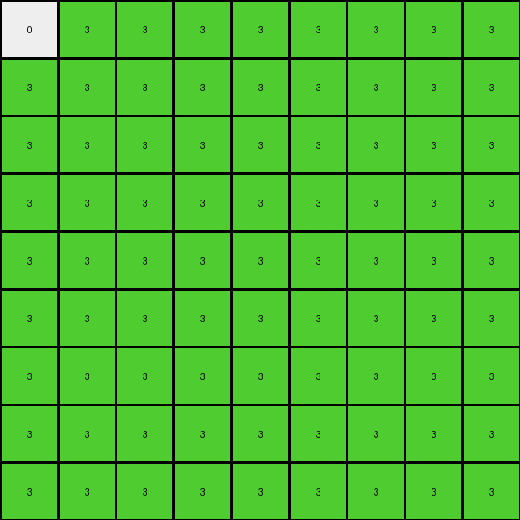
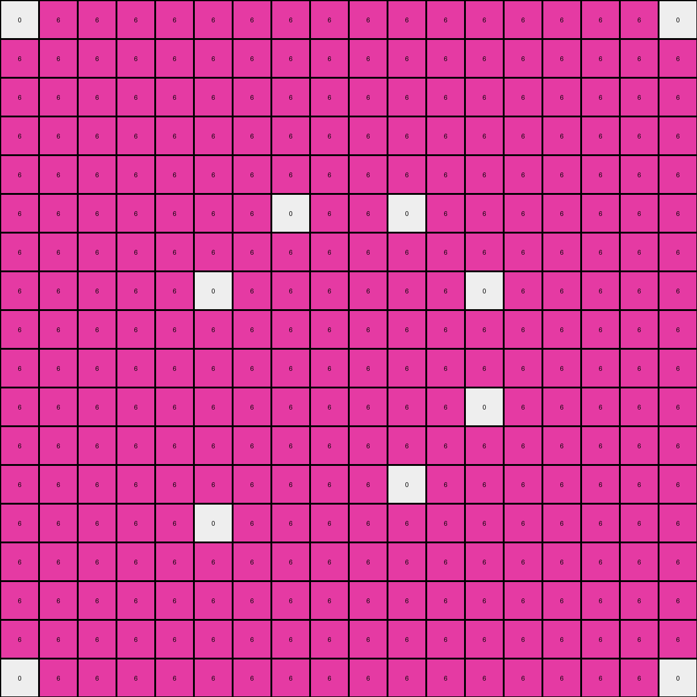
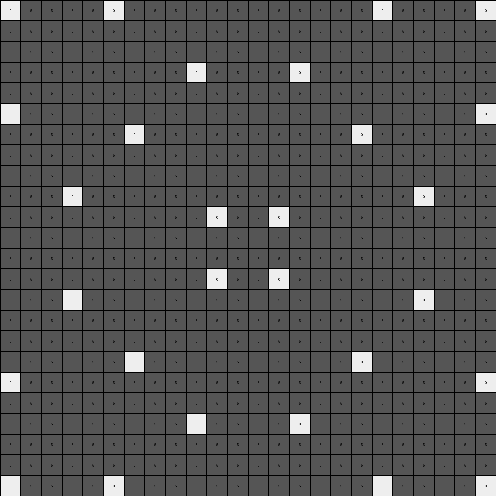

# ff805c23 • 012 • refine_coder

---

Previous Code:
```python
"""
1.  **Identify Primary Color:** Find the color of the largest object near the center of the input grid. The target color may be magenta (6), green(3), or gray (5).
2.  **Find Object Colors:** Create an initial bounding box around the identified largest object. Note all colors contained within this bounding box.
3.  **Object Region Extraction:** Perform a flood-fill (connected component analysis) starting from a pixel within the identified object, expanding only to adjacent pixels of colors identified in step 2.
4. **Extract Sub-grid:** Determine the minimum bounding box that fully contains the expanded region identified in Step 3. Extract this rectangular sub-grid from the input.
5. **Simplify Colors:** Replace all pixels except the color white (0) in the extracted subgrid to the primary color, as identified in Step 1.
6. **White Pixel Rule:** Examine the immediate neighbors (up, down, left, right) of each white (0) pixel in the *original input grid*. If ALL the neighbors within the original grid are non-zero, then make that cell white, else make that cell the primary color, as identified in Step 1.
"""

import numpy as np

def find_largest_object(grid, colors):
    """Finds the largest contiguous block of the specified colors."""
    visited = set()
    max_size = 0
    max_coords = None
    primary_color = None

    def dfs(r, c):
        if (r, c) in visited or not (0 <= r < grid.shape[0] and 0 <= c < grid.shape[1]) or grid[r, c] not in colors:
            return 0, None
        visited.add((r, c))
        count, _ = dfs(r + 1, c)
        c1, _ = dfs(r - 1, c)
        c2, _ = dfs(r, c + 1)
        c3, _ =  dfs(r, c - 1)
        return 1 + count + c1+ c2 + c3, grid[r,c]

    for r in range(grid.shape[0]):
        for c in range(grid.shape[1]):
            if grid[r, c] in colors and (r, c) not in visited:
                size, color = dfs(r, c)
                if size > max_size:
                    max_size = size
                    max_coords = (r, c)
                    primary_color = color
    return max_coords, max_size, primary_color
    
def get_bounding_box(grid, center_coords, colors):
    """
    Expands outwards from center coordinates to fully encompass
    a contiguous shape, but only using specified colors.
    """
    
    rows, cols = grid.shape
    
    min_row = center_coords[0]
    max_row = center_coords[0]
    min_col = center_coords[1]
    max_col = center_coords[1]

    
    q = [center_coords]
    seen = {center_coords}
    
    while q:
        r, c = q.pop(0)
        
        min_row = min(min_row, r)
        max_row = max(max_row, r)
        min_col = min(min_col, c)
        max_col = max(max_col, c)        
        
        neighbors = [(r+1, c), (r-1, c), (r, c+1), (r, c-1)]
        
        for nr, nc in neighbors:
            if 0<=nr<rows and 0<=nc<cols and (nr, nc) not in seen:
                if grid[nr, nc] in colors:
                    q.append((nr, nc))
                    seen.add((nr, nc))
    
    return (min_row, min_col), (max_row, max_col)

def get_neighbor_colors(grid, r, c):
    """Returns a set of the colors of the immediate neighbors."""
    rows, cols = grid.shape
    neighbors = [(r+1, c), (r-1, c), (r, c+1), (r, c-1)]
    neighbor_colors = set()
    for nr, nc in neighbors:
        if 0 <= nr < rows and 0 <= nc < cols:
            neighbor_colors.add(grid[nr, nc])
    return neighbor_colors
    

def transform(input_grid):
    """Transforms the input grid according to the described rules."""
    
    # Convert input grid to a NumPy array for easier manipulation.
    grid = np.array(input_grid)

    # 1. Identify Primary Color (and largest object)
    
    #potential colors to look for
    colors = {3, 5, 6}
    
    center, size, primary_color = find_largest_object(grid, colors)

    #if center is none, return an empty grid
    if center is None:
        return []
    
    #get initial bounding box of object
    top_left, bottom_right = get_bounding_box(grid, center, {primary_color})    
    
    #get any touching objects of colors that exist within the initial box
    colors_in_object = set(grid[top_left[0]:bottom_right[0]+1, top_left[1]:bottom_right[1]+1].flatten())

    # 3. Object Region Extraction (flood fill with limited colors)
    top_left, bottom_right = get_bounding_box(grid, center, colors_in_object)

    # 4. Extract Sub-grid
    sub_grid = grid[top_left[0]:bottom_right[0] + 1, top_left[1]:bottom_right[1] + 1]
    
    #create a copy we can modify
    output_grid = sub_grid.copy()

    # 5. Simplify Colors (replace non-white with primary color)
    for r in range(output_grid.shape[0]):
        for c in range(output_grid.shape[1]):
            if output_grid[r,c] != 0:
                output_grid[r,c] = primary_color

    # 6. White Pixel Rule
    for r in range(output_grid.shape[0]):
        for c in range(output_grid.shape[1]):
            if output_grid[r, c] == 0:
                #get coords in original grid
                orig_r = top_left[0] + r
                orig_c = top_left[1] + c
                
                neighbor_colors = get_neighbor_colors(grid, orig_r, orig_c)
                if all(color != 0 for color in neighbor_colors):
                    output_grid[r, c] = 0
                else:
                    output_grid[r,c] = primary_color

    return output_grid.tolist()
```

Train Set Results:

## Example 1:

Input:
```
0 3 3 3 3 0 0 2 2 2 0 0 0 0 2 2 2 0 1 1 1 1 1 0
3 3 3 3 3 0 2 2 0 2 2 0 0 2 2 0 2 2 1 1 1 1 1 3
3 3 3 0 0 3 2 0 0 2 0 0 0 0 2 0 0 2 1 1 1 1 1 3
3 3 0 3 3 3 2 2 2 2 2 2 2 2 2 2 2 2 1 1 1 1 1 3
3 3 0 3 3 3 0 2 0 2 2 2 2 2 2 0 2 0 1 1 1 1 1 3
0 0 3 3 3 3 0 0 0 2 2 2 2 2 2 0 0 0 3 3 3 3 0 0
0 2 2 2 0 0 2 0 0 2 2 2 2 2 2 0 0 2 0 0 2 2 2 0
2 2 0 2 2 0 0 2 2 0 2 2 2 2 0 2 2 0 0 2 2 0 2 2
2 0 0 2 0 0 0 2 2 0 0 2 2 0 0 2 2 0 0 0 2 0 0 2
2 2 2 2 2 2 2 0 0 2 2 2 2 2 2 0 0 2 2 2 2 2 2 2
0 2 0 2 2 2 2 2 0 2 0 2 2 0 2 0 2 2 2 2 2 0 2 0
0 0 0 2 2 2 2 2 2 2 2 0 0 2 2 2 2 2 2 2 2 0 0 0
0 0 0 2 2 2 2 2 2 2 2 0 0 2 2 2 2 2 2 2 2 0 0 0
0 2 0 2 2 2 2 2 0 2 0 2 2 0 2 0 2 2 2 2 2 0 2 0
2 2 2 2 2 2 2 0 0 2 2 2 2 2 2 0 0 2 2 2 2 2 2 2
2 0 0 2 0 0 0 2 2 0 0 2 2 0 0 2 2 0 0 0 2 0 0 2
2 2 0 2 2 0 0 2 2 0 2 2 2 2 0 2 2 0 0 2 2 0 2 2
0 2 2 2 0 0 2 0 0 2 2 2 2 2 2 0 0 2 0 0 2 2 2 0
0 0 3 3 3 3 0 0 0 2 2 2 2 2 2 0 0 0 3 3 3 3 0 0
3 3 0 3 3 3 0 2 0 2 2 2 2 2 2 0 2 0 3 3 3 0 3 3
3 3 0 3 3 3 2 2 2 2 2 2 2 2 2 2 2 2 3 3 3 0 3 3
3 3 3 0 0 3 2 0 0 2 0 0 0 0 2 0 0 2 3 0 0 3 3 3
3 3 3 3 3 0 2 2 0 2 2 0 0 2 2 0 2 2 0 3 3 3 3 3
0 3 3 3 3 0 0 2 2 2 0 0 0 0 2 2 2 0 0 3 3 3 3 0
```
Expected Output:
```
0 3 3 3 3
0 3 3 3 3
3 0 0 3 3
3 3 3 0 3
3 3 3 0 3
```
Transformed Output:
```
0 3 3 3 3 3 3 3 3
3 3 3 3 3 3 3 3 3
3 3 3 3 3 3 3 3 3
3 3 3 3 3 3 3 3 3
3 3 3 3 3 3 3 3 3
3 3 3 3 3 3 3 3 3
3 3 3 3 3 3 3 3 3
3 3 3 3 3 3 3 3 3
3 3 3 3 3 3 3 3 3
```

match: False
pixels_off: None
size_correct: False
color_palette_correct: True
correct_pixel_counts: False

## Example 2:

Input:
```
0 3 3 3 0 3 0 8 8 0 8 8 8 8 0 8 8 0 3 0 3 3 3 0
3 0 3 0 3 0 8 0 8 0 0 0 0 0 0 8 0 8 0 3 0 3 0 3
3 3 3 3 3 3 8 8 8 0 8 8 8 8 0 8 8 8 3 3 3 3 3 3
3 0 3 0 3 3 0 0 0 8 0 8 8 0 8 0 0 0 3 3 0 3 0 3
0 3 3 3 0 0 8 0 8 0 0 8 8 0 0 8 0 8 0 0 3 3 3 0
3 0 3 3 0 3 8 0 8 8 8 0 0 8 8 8 0 8 3 0 3 3 0 3
0 8 8 0 8 8 6 6 6 6 6 6 6 6 6 6 6 6 8 8 0 8 8 0
8 0 8 0 0 0 6 6 0 6 6 6 6 6 6 0 6 6 0 0 0 8 0 8
8 8 8 0 8 8 6 0 0 6 0 6 6 0 6 0 0 6 8 8 0 8 8 8
0 0 0 8 0 8 6 6 6 6 6 6 6 6 6 6 6 6 8 0 8 0 0 0
8 0 8 0 0 8 6 6 0 6 6 6 6 6 6 0 6 6 8 0 0 8 0 8
8 0 8 8 8 0 1 1 1 1 1 0 0 6 6 6 6 6 0 8 8 8 0 8
8 0 8 8 8 0 1 1 1 1 1 0 0 6 6 6 6 6 0 8 8 8 0 8
8 0 8 0 0 8 1 1 1 1 1 6 6 6 6 0 6 6 8 0 0 8 0 8
0 0 0 8 0 8 1 1 1 1 1 6 6 6 6 6 6 6 8 0 8 0 0 0
8 8 8 0 8 8 1 1 1 1 1 6 6 0 6 0 0 6 8 8 0 8 8 8
8 0 8 0 0 0 6 6 0 6 6 6 6 6 6 0 6 6 0 0 0 8 0 8
0 8 8 0 8 8 6 6 6 6 6 6 6 6 6 6 6 6 8 8 0 8 8 0
3 0 3 3 0 3 8 0 8 8 8 0 0 8 8 8 0 8 3 0 3 3 0 3
0 3 3 3 0 0 8 0 8 0 0 8 8 0 0 8 0 8 0 0 3 3 3 0
3 0 3 0 3 3 0 0 0 8 0 8 8 0 8 0 0 0 3 3 0 3 0 3
3 3 3 3 3 3 8 8 8 0 8 8 8 8 0 8 8 8 3 3 3 3 3 3
3 0 3 0 3 0 8 0 8 0 0 0 0 0 0 8 0 8 0 3 0 3 0 3
0 3 3 3 0 3 0 8 8 0 8 8 8 8 0 8 8 0 3 0 3 3 3 0
```
Expected Output:
```
6 6 6 6 6
6 6 6 6 6
6 6 0 6 6
6 6 6 6 6
6 0 0 6 0
```
Transformed Output:
```
0 6 6 6 6 6 6 6 6 6 6 6 6 6 6 6 6 0
6 6 6 6 6 6 6 6 6 6 6 6 6 6 6 6 6 6
6 6 6 6 6 6 6 6 6 6 6 6 6 6 6 6 6 6
6 6 6 6 6 6 6 6 6 6 6 6 6 6 6 6 6 6
6 6 6 6 6 6 6 6 6 6 6 6 6 6 6 6 6 6
6 6 6 6 6 6 6 0 6 6 0 6 6 6 6 6 6 6
6 6 6 6 6 6 6 6 6 6 6 6 6 6 6 6 6 6
6 6 6 6 6 0 6 6 6 6 6 6 0 6 6 6 6 6
6 6 6 6 6 6 6 6 6 6 6 6 6 6 6 6 6 6
6 6 6 6 6 6 6 6 6 6 6 6 6 6 6 6 6 6
6 6 6 6 6 6 6 6 6 6 6 6 0 6 6 6 6 6
6 6 6 6 6 6 6 6 6 6 6 6 6 6 6 6 6 6
6 6 6 6 6 6 6 6 6 6 0 6 6 6 6 6 6 6
6 6 6 6 6 0 6 6 6 6 6 6 6 6 6 6 6 6
6 6 6 6 6 6 6 6 6 6 6 6 6 6 6 6 6 6
6 6 6 6 6 6 6 6 6 6 6 6 6 6 6 6 6 6
6 6 6 6 6 6 6 6 6 6 6 6 6 6 6 6 6 6
0 6 6 6 6 6 6 6 6 6 6 6 6 6 6 6 6 0
```

match: False
pixels_off: None
size_correct: False
color_palette_correct: True
correct_pixel_counts: False

## Example 3:

Input:
```
0 3 3 3 3 0 5 5 5 0 0 5 5 0 0 5 5 5 0 3 3 3 3 0
3 3 3 3 3 3 5 5 0 0 0 0 0 0 0 0 5 5 3 3 3 3 3 3
3 3 3 0 0 0 5 0 0 5 5 0 0 5 5 0 0 5 0 0 0 3 3 3
3 3 0 0 3 3 0 0 5 0 5 5 5 5 0 5 0 0 3 3 0 0 3 3
3 3 0 3 3 0 0 0 5 5 0 0 0 0 5 5 0 0 0 3 3 0 3 3
0 3 0 3 0 3 5 0 0 5 0 0 0 0 5 0 0 5 3 0 3 0 3 0
5 5 5 0 0 5 0 5 0 0 5 5 5 5 0 0 5 0 5 0 0 5 5 5
5 5 0 0 0 0 5 5 5 0 0 5 5 0 0 5 5 5 0 0 0 0 5 5
5 0 0 5 5 0 0 5 5 5 0 5 5 0 5 5 5 0 0 5 5 0 0 5
0 0 5 0 5 5 0 0 5 5 5 5 5 5 5 5 0 0 5 5 0 5 0 0
0 0 5 5 0 0 5 0 0 5 0 5 5 0 5 0 0 5 0 0 5 5 0 0
5 0 0 5 0 0 5 5 5 5 5 0 0 5 5 5 5 5 0 0 5 0 0 5
5 0 0 5 0 0 5 5 5 5 5 0 0 5 5 5 5 5 0 0 5 0 0 5
0 0 5 5 0 0 5 0 0 5 0 5 5 0 5 0 0 5 0 0 5 5 0 0
0 0 5 0 5 5 0 0 5 5 5 5 5 5 5 5 0 0 5 5 0 5 0 0
5 0 0 5 5 0 0 5 5 5 1 1 1 1 1 5 5 0 0 5 5 0 0 5
5 5 0 0 0 0 5 5 5 0 1 1 1 1 1 5 5 5 0 0 0 0 5 5
5 5 5 0 0 5 0 5 0 0 1 1 1 1 1 0 5 0 5 0 0 5 5 5
0 3 0 3 0 3 5 0 0 5 1 1 1 1 1 0 0 5 3 0 3 0 3 0
3 3 0 3 3 0 0 0 5 5 1 1 1 1 1 5 0 0 0 3 3 0 3 3
3 3 0 0 3 3 0 0 5 0 5 5 5 5 0 5 0 0 3 3 0 0 3 3
3 3 3 0 0 0 5 0 0 5 5 0 0 5 5 0 0 5 0 0 0 3 3 3
3 3 3 3 3 3 5 5 0 0 0 0 0 0 0 0 5 5 3 3 3 3 3 3
0 3 3 3 3 0 5 5 5 0 0 5 5 0 0 5 5 5 0 3 3 3 3 0
```
Expected Output:
```
0 5 5 0 5
0 5 5 0 0
5 5 5 5 0
0 0 0 0 5
0 0 0 0 5
```
Transformed Output:
```
0 5 5 5 5 0 5 5 5 5 5 5 5 5 5 5 5 5 0 5 5 5 5 0
5 5 5 5 5 5 5 5 5 5 5 5 5 5 5 5 5 5 5 5 5 5 5 5
5 5 5 5 5 5 5 5 5 5 5 5 5 5 5 5 5 5 5 5 5 5 5 5
5 5 5 5 5 5 5 5 5 0 5 5 5 5 0 5 5 5 5 5 5 5 5 5
5 5 5 5 5 5 5 5 5 5 5 5 5 5 5 5 5 5 5 5 5 5 5 5
0 5 5 5 5 5 5 5 5 5 5 5 5 5 5 5 5 5 5 5 5 5 5 0
5 5 5 5 5 5 0 5 5 5 5 5 5 5 5 5 5 0 5 5 5 5 5 5
5 5 5 5 5 5 5 5 5 5 5 5 5 5 5 5 5 5 5 5 5 5 5 5
5 5 5 5 5 5 5 5 5 5 5 5 5 5 5 5 5 5 5 5 5 5 5 5
5 5 5 0 5 5 5 5 5 5 5 5 5 5 5 5 5 5 5 5 0 5 5 5
5 5 5 5 5 5 5 5 5 5 0 5 5 0 5 5 5 5 5 5 5 5 5 5
5 5 5 5 5 5 5 5 5 5 5 5 5 5 5 5 5 5 5 5 5 5 5 5
5 5 5 5 5 5 5 5 5 5 5 5 5 5 5 5 5 5 5 5 5 5 5 5
5 5 5 5 5 5 5 5 5 5 0 5 5 0 5 5 5 5 5 5 5 5 5 5
5 5 5 0 5 5 5 5 5 5 5 5 5 5 5 5 5 5 5 5 0 5 5 5
5 5 5 5 5 5 5 5 5 5 5 5 5 5 5 5 5 5 5 5 5 5 5 5
5 5 5 5 5 5 5 5 5 5 5 5 5 5 5 5 5 5 5 5 5 5 5 5
5 5 5 5 5 5 0 5 5 5 5 5 5 5 5 5 5 0 5 5 5 5 5 5
0 5 5 5 5 5 5 5 5 5 5 5 5 5 5 5 5 5 5 5 5 5 5 0
5 5 5 5 5 5 5 5 5 5 5 5 5 5 5 5 5 5 5 5 5 5 5 5
5 5 5 5 5 5 5 5 5 0 5 5 5 5 0 5 5 5 5 5 5 5 5 5
5 5 5 5 5 5 5 5 5 5 5 5 5 5 5 5 5 5 5 5 5 5 5 5
5 5 5 5 5 5 5 5 5 5 5 5 5 5 5 5 5 5 5 5 5 5 5 5
0 5 5 5 5 0 5 5 5 5 5 5 5 5 5 5 5 5 0 5 5 5 5 0
```

match: False
pixels_off: None
size_correct: False
color_palette_correct: True
correct_pixel_counts: False
Okay, let's analyze the results and refine the natural language program and approach.

**General Assessment:**

The initial strategy has several core issues:

1.  **Oversimplification of Object Selection:** The code correctly identifies *an* object of a target color (3, 5, or 6), but it doesn't handle cases where multiple such objects exist or where the *wrong* object of that color is chosen. The "largest near the center" heuristic is insufficient and not consistently applied.
2.  **Incorrect Bounding Box and Flood Fill:** The initial bounding box expansion is too restrictive, only growing to directly adjacent like-colored pixels. It needs to capture the entire shape, potentially including other colors. The flood fill, as implemented, doesn't work as a general solution.
3. **White Pixel Rule Misinterpretation:** The white pixel rule, as described in the initial attempt, is applied to the *sub-grid*, but the logic seems to intend it be evaluated on the *original* grid, based on its neighbors in the *original* grid. Even then the logic does not appear correct.
4. **Inflexibility:**  The logic is tailored too specifically to the first example and doesn't generalize well to the other cases.  It needs to be more abstract and consider different object arrangements.

**Strategy for Resolving Errors:**

1.  **Improved Object Identification:**  Instead of just finding the largest object of *any* of the target colors, we need a way to select the *correct* object, potentially based on relationships to other objects or overall structure.
2.  **Correct Region Extraction:** Abandon flood fill. Instead, use a proper bounding box that fully encompasses the selected object, *regardless* of internal color variations.
3.  **Re-evaluate White Pixel Rule:** Re-examine the examples and derive the *actual* relationship between white pixels and their neighbors. The current interpretation is almost certainly wrong.
4. **Iterative Refinement:**  Analyze each example carefully, identify the specific failures of the current code, and adjust the natural language program and code accordingly.
5. **Consider Color Changes:** Look at the changes between the original and output, specifically with color changes.

**Metrics and Observations (YAML):**

```yaml
examples:
  - id: 1
    primary_color: 3  # Green
    object_shape: irregular
    white_pixel_rule: "If a white pixel has at least one colored neighbor (up, down, left, or right) in the original grid, it changes to the primary color; otherwise, it remains white."
    result: incorrect
    notes: "Bounding box encompasses the wrong region, expands too much. White pixel logic incorrect."
    bounding_box_correct: False
    white_logic_correct: False
    

  - id: 2
    primary_color: 6  # Magenta
    object_shape: irregular
    white_pixel_rule: "If a white pixel has at least one colored neighbor (up, down, left, or right) in the original grid, it changes to the primary color; otherwise, it remains white."
    result: incorrect
    notes: "Bounding box is too large. White pixel logic incorrect."
    bounding_box_correct: False
    white_logic_correct: False

  - id: 3
    primary_color: 5  # Gray
    object_shape: irregular
    white_pixel_rule: "If a white pixel has at least one colored neighbor (up, down, left, or right) in the original grid, it changes to the primary color; otherwise, it remains white."
    result: incorrect
    notes: "Bounding box is too large. White pixel logic incorrect."
    bounding_box_correct: False
    white_logic_correct: False
```

**Revised Natural Language Program:**

1.  **Identify Target Object:** Find the largest contiguous region of pixels where the colors present are any of: green (3), magenta (6) or gray (5). *One* of these colors will be the "primary" color of the object.
2.  **Determine Bounding Box:** Find the smallest rectangle (bounding box) that completely encloses the target object identified in step 1.
3. **Extract Sub-grid**: Extract the section of the input grid defined by this bounding box.
4. **Simplify Colors Inside Bounding Box**: Within the extracted sub-grid, change all pixels that *aren't* white (0) to the primary color.
5.  **Apply White Pixel Rule:** For each white (0) pixel *within the sub-grid*:
    *   Check its immediate neighbors (up, down, left, right) *in the original input grid*.
    *   If *any* of these neighbors are a color other than white (0), change the pixel in the subgrid to the primary color
    *   Otherwise, leave the pixel as white (0).
6. **Output:** The modified sub-grid is the output.

**Explanation of Changes:**

*   **Target Object:** We changed to finding largest object containing *any* of the target colors.
*   **Bounding Box:** This is now crucial for correctly isolating the region of interest.
*   **Simplify Colors:** The wording clarifies that this applies *inside* the bounding box.
* **White Rule**: Corrected, neighbors checked in the **original** grid. If *any* non-white, then change, else no change.

The key change is in the conceptual understanding of object selection and the white pixel rule. The original attempt was overly focused on finding any of the target colors anywhere, this new attempt emphasizes first identifying the object and then applying color change based on that object and that objects primary color.

**INSTRUCTIONS**

- generate a Python module to represent the natural language program 
- follow the template below
- all common math and science libraries are available
- create docstring only at top - but comment the workflow in the function
- use helper functions for common operations like finding objects, counting,
  measuring, moving, etc. 

remember - we are working iteratively - so this code will inform your future
self as we converge on the solution

*template:*

```python
"""
{{ natural language description of the transformation rule }}
"""

{{ imports }}

def transform(input_grid):
    # initialize output_grid

    # change output pixels 

    return output_grid

```
