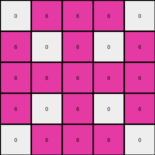
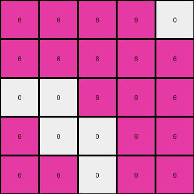

# ff805c23 • 017 • refine_dreamer

---


Previous Code:
```python
"""
The transformation extracts a 5x5 subgrid from the upper-right corner of the input grid. 
The colors within this subgrid are then mapped to a specific pair of colors based on a seemingly fixed rule.
"""

import numpy as np

def find_target_region(input_grid, size):
    # Find the top-right 5x5 region of the input
    rows, cols = input_grid.shape
    start_row = 0
    start_col = cols - size
    return start_row, start_col


def transform(input_grid):
    """
    Extracts a 5x5 subgrid from the upper-right corner and remaps colors.
    """
    # Convert input grid to a NumPy array
    input_grid = np.array(input_grid)
        
    # Find the starting coordinates of target region
    size = 5
    start_row, start_col = find_target_region(input_grid, size)
    
    # Extract the subgrid
    output_grid = input_grid[start_row:start_row+size, start_col:start_col+size].copy()

    # Remap colors based on observations
    # Example 1: input [0,1,3] output [0,3]
    # Example 2: input [0,3] output [0,6]
    # Example 3: input [0,3] output [0,5]
    unique_colors = np.unique(output_grid)

    if np.array_equal(unique_colors, [0, 1, 3]):
        output_grid[output_grid == 1] = 0 # No change to 0 or 3
    elif np.array_equal(unique_colors, [0, 3]):
          output_grid[output_grid == 3] = 6 #Change all 3s to 6s
    elif np.array_equal(unique_colors, [0,3]):  #need to add 5 to the array
          output_grid[output_grid==3] = 5
    elif set([0, 1, 3]).issubset(set(unique_colors)):
        #handle cases that have more values
        output_grid[output_grid == 1] = 0
    elif set([0,3]).issubset(set(unique_colors)):
        if 6 in unique_colors:
            output_grid[output_grid == 3] = 6 #Change all 3s to 6s
        elif 5 in unique_colors:
            output_grid[output_grid == 3] = 5
    
    return output_grid.tolist()
```

Train Set Results:

## Example 1:

Input:
```
0 3 3 3 3 0 0 2 2 2 0 0 0 0 2 2 2 0 1 1 1 1 1 0
3 3 3 3 3 0 2 2 0 2 2 0 0 2 2 0 2 2 1 1 1 1 1 3
3 3 3 0 0 3 2 0 0 2 0 0 0 0 2 0 0 2 1 1 1 1 1 3
3 3 0 3 3 3 2 2 2 2 2 2 2 2 2 2 2 2 1 1 1 1 1 3
3 3 0 3 3 3 0 2 0 2 2 2 2 2 2 0 2 0 1 1 1 1 1 3
0 0 3 3 3 3 0 0 0 2 2 2 2 2 2 0 0 0 3 3 3 3 0 0
0 2 2 2 0 0 2 0 0 2 2 2 2 2 2 0 0 2 0 0 2 2 2 0
2 2 0 2 2 0 0 2 2 0 2 2 2 2 0 2 2 0 0 2 2 0 2 2
2 0 0 2 0 0 0 2 2 0 0 2 2 0 0 2 2 0 0 0 2 0 0 2
2 2 2 2 2 2 2 0 0 2 2 2 2 2 2 0 0 2 2 2 2 2 2 2
0 2 0 2 2 2 2 2 0 2 0 2 2 0 2 0 2 2 2 2 2 0 2 0
0 0 0 2 2 2 2 2 2 2 2 0 0 2 2 2 2 2 2 2 2 0 0 0
0 0 0 2 2 2 2 2 2 2 2 0 0 2 2 2 2 2 2 2 2 0 0 0
0 2 0 2 2 2 2 2 0 2 0 2 2 0 2 0 2 2 2 2 2 0 2 0
2 2 2 2 2 2 2 0 0 2 2 2 2 2 2 0 0 2 2 2 2 2 2 2
2 0 0 2 0 0 0 2 2 0 0 2 2 0 0 2 2 0 0 0 2 0 0 2
2 2 0 2 2 0 0 2 2 0 2 2 2 2 0 2 2 0 0 2 2 0 2 2
0 2 2 2 0 0 2 0 0 2 2 2 2 2 2 0 0 2 0 0 2 2 2 0
0 0 3 3 3 3 0 0 0 2 2 2 2 2 2 0 0 0 3 3 3 3 0 0
3 3 0 3 3 3 0 2 0 2 2 2 2 2 2 0 2 0 3 3 3 0 3 3
3 3 0 3 3 3 2 2 2 2 2 2 2 2 2 2 2 2 3 3 3 0 3 3
3 3 3 0 0 3 2 0 0 2 0 0 0 0 2 0 0 2 3 0 0 3 3 3
3 3 3 3 3 0 2 2 0 2 2 0 0 2 2 0 2 2 0 3 3 3 3 3
0 3 3 3 3 0 0 2 2 2 0 0 0 0 2 2 2 0 0 3 3 3 3 0
```
Expected Output:
```
0 3 3 3 3
0 3 3 3 3
3 0 0 3 3
3 3 3 0 3
3 3 3 0 3
```
Transformed Output:
```
0 0 0 0 0
0 0 0 0 3
0 0 0 0 3
0 0 0 0 3
0 0 0 0 3
```

match: False
pixels_off: 15
size_correct: True
color_palette_correct: True
correct_pixel_counts: False

## Example 2:

Input:
```
0 3 3 3 0 3 0 8 8 0 8 8 8 8 0 8 8 0 3 0 3 3 3 0
3 0 3 0 3 0 8 0 8 0 0 0 0 0 0 8 0 8 0 3 0 3 0 3
3 3 3 3 3 3 8 8 8 0 8 8 8 8 0 8 8 8 3 3 3 3 3 3
3 0 3 0 3 3 0 0 0 8 0 8 8 0 8 0 0 0 3 3 0 3 0 3
0 3 3 3 0 0 8 0 8 0 0 8 8 0 0 8 0 8 0 0 3 3 3 0
3 0 3 3 0 3 8 0 8 8 8 0 0 8 8 8 0 8 3 0 3 3 0 3
0 8 8 0 8 8 6 6 6 6 6 6 6 6 6 6 6 6 8 8 0 8 8 0
8 0 8 0 0 0 6 6 0 6 6 6 6 6 6 0 6 6 0 0 0 8 0 8
8 8 8 0 8 8 6 0 0 6 0 6 6 0 6 0 0 6 8 8 0 8 8 8
0 0 0 8 0 8 6 6 6 6 6 6 6 6 6 6 6 6 8 0 8 0 0 0
8 0 8 0 0 8 6 6 0 6 6 6 6 6 6 0 6 6 8 0 0 8 0 8
8 0 8 8 8 0 1 1 1 1 1 0 0 6 6 6 6 6 0 8 8 8 0 8
8 0 8 8 8 0 1 1 1 1 1 0 0 6 6 6 6 6 0 8 8 8 0 8
8 0 8 0 0 8 1 1 1 1 1 6 6 6 6 0 6 6 8 0 0 8 0 8
0 0 0 8 0 8 1 1 1 1 1 6 6 6 6 6 6 6 8 0 8 0 0 0
8 8 8 0 8 8 1 1 1 1 1 6 6 0 6 0 0 6 8 8 0 8 8 8
8 0 8 0 0 0 6 6 0 6 6 6 6 6 6 0 6 6 0 0 0 8 0 8
0 8 8 0 8 8 6 6 6 6 6 6 6 6 6 6 6 6 8 8 0 8 8 0
3 0 3 3 0 3 8 0 8 8 8 0 0 8 8 8 0 8 3 0 3 3 0 3
0 3 3 3 0 0 8 0 8 0 0 8 8 0 0 8 0 8 0 0 3 3 3 0
3 0 3 0 3 3 0 0 0 8 0 8 8 0 8 0 0 0 3 3 0 3 0 3
3 3 3 3 3 3 8 8 8 0 8 8 8 8 0 8 8 8 3 3 3 3 3 3
3 0 3 0 3 0 8 0 8 0 0 0 0 0 0 8 0 8 0 3 0 3 0 3
0 3 3 3 0 3 0 8 8 0 8 8 8 8 0 8 8 0 3 0 3 3 3 0
```
Expected Output:
```
6 6 6 6 6
6 6 6 6 6
6 6 0 6 6
6 6 6 6 6
6 0 0 6 0
```
Transformed Output:
```
0 6 6 6 0
6 0 6 0 6
6 6 6 6 6
6 0 6 0 6
0 6 6 6 0
```

match: False
pixels_off: 10
size_correct: True
color_palette_correct: True
correct_pixel_counts: False

## Example 3:

Input:
```
0 3 3 3 3 0 5 5 5 0 0 5 5 0 0 5 5 5 0 3 3 3 3 0
3 3 3 3 3 3 5 5 0 0 0 0 0 0 0 0 5 5 3 3 3 3 3 3
3 3 3 0 0 0 5 0 0 5 5 0 0 5 5 0 0 5 0 0 0 3 3 3
3 3 0 0 3 3 0 0 5 0 5 5 5 5 0 5 0 0 3 3 0 0 3 3
3 3 0 3 3 0 0 0 5 5 0 0 0 0 5 5 0 0 0 3 3 0 3 3
0 3 0 3 0 3 5 0 0 5 0 0 0 0 5 0 0 5 3 0 3 0 3 0
5 5 5 0 0 5 0 5 0 0 5 5 5 5 0 0 5 0 5 0 0 5 5 5
5 5 0 0 0 0 5 5 5 0 0 5 5 0 0 5 5 5 0 0 0 0 5 5
5 0 0 5 5 0 0 5 5 5 0 5 5 0 5 5 5 0 0 5 5 0 0 5
0 0 5 0 5 5 0 0 5 5 5 5 5 5 5 5 0 0 5 5 0 5 0 0
0 0 5 5 0 0 5 0 0 5 0 5 5 0 5 0 0 5 0 0 5 5 0 0
5 0 0 5 0 0 5 5 5 5 5 0 0 5 5 5 5 5 0 0 5 0 0 5
5 0 0 5 0 0 5 5 5 5 5 0 0 5 5 5 5 5 0 0 5 0 0 5
0 0 5 5 0 0 5 0 0 5 0 5 5 0 5 0 0 5 0 0 5 5 0 0
0 0 5 0 5 5 0 0 5 5 5 5 5 5 5 5 0 0 5 5 0 5 0 0
5 0 0 5 5 0 0 5 5 5 1 1 1 1 1 5 5 0 0 5 5 0 0 5
5 5 0 0 0 0 5 5 5 0 1 1 1 1 1 5 5 5 0 0 0 0 5 5
5 5 5 0 0 5 0 5 0 0 1 1 1 1 1 0 5 0 5 0 0 5 5 5
0 3 0 3 0 3 5 0 0 5 1 1 1 1 1 0 0 5 3 0 3 0 3 0
3 3 0 3 3 0 0 0 5 5 1 1 1 1 1 5 0 0 0 3 3 0 3 3
3 3 0 0 3 3 0 0 5 0 5 5 5 5 0 5 0 0 3 3 0 0 3 3
3 3 3 0 0 0 5 0 0 5 5 0 0 5 5 0 0 5 0 0 0 3 3 3
3 3 3 3 3 3 5 5 0 0 0 0 0 0 0 0 5 5 3 3 3 3 3 3
0 3 3 3 3 0 5 5 5 0 0 5 5 0 0 5 5 5 0 3 3 3 3 0
```
Expected Output:
```
0 5 5 0 5
0 5 5 0 0
5 5 5 5 0
0 0 0 0 5
0 0 0 0 5
```
Transformed Output:
```
6 6 6 6 0
6 6 6 6 6
0 0 6 6 6
6 0 0 6 6
6 6 0 6 6
```

match: False
pixels_off: 22
size_correct: True
color_palette_correct: False
correct_pixel_counts: False

**INSTRUCTIONS**

The code above was generated based on observations from the first training
example

we have tested the transform function on each of the task example inputs and
compared with the expected output

review each of the examples provided and the results and consider how the
natural language program should be updated to accommodate this new knowledge

respond with the following deliverables:

- general assessment of the information provided and strategy for resolving the
  errors
- gather metrics about each of the examples and results - use code_execution to
  develop accurate reports on your assumptions
- a YAML block documenting facts - Focus on identifying objects, their properties, and the actions performed on them.
- a natural language program - Be as clear and concise as possible, providing a complete description of the transformation rule.


your responses should be considered as information in a report - not a
conversation
