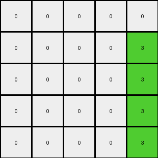
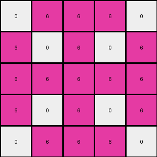
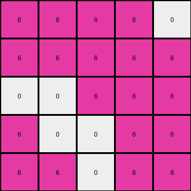

# ff805c23 • 018 • refine_coder

---

Previous Code:
```python
"""
The transformation extracts a 5x5 subgrid from the upper-right corner of the input grid. 
The colors within this subgrid are then mapped to a specific pair of colors based on a seemingly fixed rule.
"""

import numpy as np

def find_target_region(input_grid, size):
    # Find the top-right 5x5 region of the input
    rows, cols = input_grid.shape
    start_row = 0
    start_col = cols - size
    return start_row, start_col


def transform(input_grid):
    """
    Extracts a 5x5 subgrid from the upper-right corner and remaps colors.
    """
    # Convert input grid to a NumPy array
    input_grid = np.array(input_grid)
        
    # Find the starting coordinates of target region
    size = 5
    start_row, start_col = find_target_region(input_grid, size)
    
    # Extract the subgrid
    output_grid = input_grid[start_row:start_row+size, start_col:start_col+size].copy()

    # Remap colors based on observations
    # Example 1: input [0,1,3] output [0,3]
    # Example 2: input [0,3] output [0,6]
    # Example 3: input [0,3] output [0,5]
    unique_colors = np.unique(output_grid)

    if np.array_equal(unique_colors, [0, 1, 3]):
        output_grid[output_grid == 1] = 0 # No change to 0 or 3
    elif np.array_equal(unique_colors, [0, 3]):
          output_grid[output_grid == 3] = 6 #Change all 3s to 6s
    elif np.array_equal(unique_colors, [0,3]):  #need to add 5 to the array
          output_grid[output_grid==3] = 5
    elif set([0, 1, 3]).issubset(set(unique_colors)):
        #handle cases that have more values
        output_grid[output_grid == 1] = 0
    elif set([0,3]).issubset(set(unique_colors)):
        if 6 in unique_colors:
            output_grid[output_grid == 3] = 6 #Change all 3s to 6s
        elif 5 in unique_colors:
            output_grid[output_grid == 3] = 5
    
    return output_grid.tolist()
```

Train Set Results:

## Example 1:

Input:
```
0 3 3 3 3 0 0 2 2 2 0 0 0 0 2 2 2 0 1 1 1 1 1 0
3 3 3 3 3 0 2 2 0 2 2 0 0 2 2 0 2 2 1 1 1 1 1 3
3 3 3 0 0 3 2 0 0 2 0 0 0 0 2 0 0 2 1 1 1 1 1 3
3 3 0 3 3 3 2 2 2 2 2 2 2 2 2 2 2 2 1 1 1 1 1 3
3 3 0 3 3 3 0 2 0 2 2 2 2 2 2 0 2 0 1 1 1 1 1 3
0 0 3 3 3 3 0 0 0 2 2 2 2 2 2 0 0 0 3 3 3 3 0 0
0 2 2 2 0 0 2 0 0 2 2 2 2 2 2 0 0 2 0 0 2 2 2 0
2 2 0 2 2 0 0 2 2 0 2 2 2 2 0 2 2 0 0 2 2 0 2 2
2 0 0 2 0 0 0 2 2 0 0 2 2 0 0 2 2 0 0 0 2 0 0 2
2 2 2 2 2 2 2 0 0 2 2 2 2 2 2 0 0 2 2 2 2 2 2 2
0 2 0 2 2 2 2 2 0 2 0 2 2 0 2 0 2 2 2 2 2 0 2 0
0 0 0 2 2 2 2 2 2 2 2 0 0 2 2 2 2 2 2 2 2 0 0 0
0 0 0 2 2 2 2 2 2 2 2 0 0 2 2 2 2 2 2 2 2 0 0 0
0 2 0 2 2 2 2 2 0 2 0 2 2 0 2 0 2 2 2 2 2 0 2 0
2 2 2 2 2 2 2 0 0 2 2 2 2 2 2 0 0 2 2 2 2 2 2 2
2 0 0 2 0 0 0 2 2 0 0 2 2 0 0 2 2 0 0 0 2 0 0 2
2 2 0 2 2 0 0 2 2 0 2 2 2 2 0 2 2 0 0 2 2 0 2 2
0 2 2 2 0 0 2 0 0 2 2 2 2 2 2 0 0 2 0 0 2 2 2 0
0 0 3 3 3 3 0 0 0 2 2 2 2 2 2 0 0 0 3 3 3 3 0 0
3 3 0 3 3 3 0 2 0 2 2 2 2 2 2 0 2 0 3 3 3 0 3 3
3 3 0 3 3 3 2 2 2 2 2 2 2 2 2 2 2 2 3 3 3 0 3 3
3 3 3 0 0 3 2 0 0 2 0 0 0 0 2 0 0 2 3 0 0 3 3 3
3 3 3 3 3 0 2 2 0 2 2 0 0 2 2 0 2 2 0 3 3 3 3 3
0 3 3 3 3 0 0 2 2 2 0 0 0 0 2 2 2 0 0 3 3 3 3 0
```
Expected Output:
```
0 3 3 3 3
0 3 3 3 3
3 0 0 3 3
3 3 3 0 3
3 3 3 0 3
```
Transformed Output:
```
0 0 0 0 0
0 0 0 0 3
0 0 0 0 3
0 0 0 0 3
0 0 0 0 3
```

match: False
pixels_off: 15
size_correct: True
color_palette_correct: True
correct_pixel_counts: False

## Example 2:

Input:
```
0 3 3 3 0 3 0 8 8 0 8 8 8 8 0 8 8 0 3 0 3 3 3 0
3 0 3 0 3 0 8 0 8 0 0 0 0 0 0 8 0 8 0 3 0 3 0 3
3 3 3 3 3 3 8 8 8 0 8 8 8 8 0 8 8 8 3 3 3 3 3 3
3 0 3 0 3 3 0 0 0 8 0 8 8 0 8 0 0 0 3 3 0 3 0 3
0 3 3 3 0 0 8 0 8 0 0 8 8 0 0 8 0 8 0 0 3 3 3 0
3 0 3 3 0 3 8 0 8 8 8 0 0 8 8 8 0 8 3 0 3 3 0 3
0 8 8 0 8 8 6 6 6 6 6 6 6 6 6 6 6 6 8 8 0 8 8 0
8 0 8 0 0 0 6 6 0 6 6 6 6 6 6 0 6 6 0 0 0 8 0 8
8 8 8 0 8 8 6 0 0 6 0 6 6 0 6 0 0 6 8 8 0 8 8 8
0 0 0 8 0 8 6 6 6 6 6 6 6 6 6 6 6 6 8 0 8 0 0 0
8 0 8 0 0 8 6 6 0 6 6 6 6 6 6 0 6 6 8 0 0 8 0 8
8 0 8 8 8 0 1 1 1 1 1 0 0 6 6 6 6 6 0 8 8 8 0 8
8 0 8 8 8 0 1 1 1 1 1 0 0 6 6 6 6 6 0 8 8 8 0 8
8 0 8 0 0 8 1 1 1 1 1 6 6 6 6 0 6 6 8 0 0 8 0 8
0 0 0 8 0 8 1 1 1 1 1 6 6 6 6 6 6 6 8 0 8 0 0 0
8 8 8 0 8 8 1 1 1 1 1 6 6 0 6 0 0 6 8 8 0 8 8 8
8 0 8 0 0 0 6 6 0 6 6 6 6 6 6 0 6 6 0 0 0 8 0 8
0 8 8 0 8 8 6 6 6 6 6 6 6 6 6 6 6 6 8 8 0 8 8 0
3 0 3 3 0 3 8 0 8 8 8 0 0 8 8 8 0 8 3 0 3 3 0 3
0 3 3 3 0 0 8 0 8 0 0 8 8 0 0 8 0 8 0 0 3 3 3 0
3 0 3 0 3 3 0 0 0 8 0 8 8 0 8 0 0 0 3 3 0 3 0 3
3 3 3 3 3 3 8 8 8 0 8 8 8 8 0 8 8 8 3 3 3 3 3 3
3 0 3 0 3 0 8 0 8 0 0 0 0 0 0 8 0 8 0 3 0 3 0 3
0 3 3 3 0 3 0 8 8 0 8 8 8 8 0 8 8 0 3 0 3 3 3 0
```
Expected Output:
```
6 6 6 6 6
6 6 6 6 6
6 6 0 6 6
6 6 6 6 6
6 0 0 6 0
```
Transformed Output:
```
0 6 6 6 0
6 0 6 0 6
6 6 6 6 6
6 0 6 0 6
0 6 6 6 0
```

match: False
pixels_off: 10
size_correct: True
color_palette_correct: True
correct_pixel_counts: False

## Example 3:

Input:
```
0 3 3 3 3 0 5 5 5 0 0 5 5 0 0 5 5 5 0 3 3 3 3 0
3 3 3 3 3 3 5 5 0 0 0 0 0 0 0 0 5 5 3 3 3 3 3 3
3 3 3 0 0 0 5 0 0 5 5 0 0 5 5 0 0 5 0 0 0 3 3 3
3 3 0 0 3 3 0 0 5 0 5 5 5 5 0 5 0 0 3 3 0 0 3 3
3 3 0 3 3 0 0 0 5 5 0 0 0 0 5 5 0 0 0 3 3 0 3 3
0 3 0 3 0 3 5 0 0 5 0 0 0 0 5 0 0 5 3 0 3 0 3 0
5 5 5 0 0 5 0 5 0 0 5 5 5 5 0 0 5 0 5 0 0 5 5 5
5 5 0 0 0 0 5 5 5 0 0 5 5 0 0 5 5 5 0 0 0 0 5 5
5 0 0 5 5 0 0 5 5 5 0 5 5 0 5 5 5 0 0 5 5 0 0 5
0 0 5 0 5 5 0 0 5 5 5 5 5 5 5 5 0 0 5 5 0 5 0 0
0 0 5 5 0 0 5 0 0 5 0 5 5 0 5 0 0 5 0 0 5 5 0 0
5 0 0 5 0 0 5 5 5 5 5 0 0 5 5 5 5 5 0 0 5 0 0 5
5 0 0 5 0 0 5 5 5 5 5 0 0 5 5 5 5 5 0 0 5 0 0 5
0 0 5 5 0 0 5 0 0 5 0 5 5 0 5 0 0 5 0 0 5 5 0 0
0 0 5 0 5 5 0 0 5 5 5 5 5 5 5 5 0 0 5 5 0 5 0 0
5 0 0 5 5 0 0 5 5 5 1 1 1 1 1 5 5 0 0 5 5 0 0 5
5 5 0 0 0 0 5 5 5 0 1 1 1 1 1 5 5 5 0 0 0 0 5 5
5 5 5 0 0 5 0 5 0 0 1 1 1 1 1 0 5 0 5 0 0 5 5 5
0 3 0 3 0 3 5 0 0 5 1 1 1 1 1 0 0 5 3 0 3 0 3 0
3 3 0 3 3 0 0 0 5 5 1 1 1 1 1 5 0 0 0 3 3 0 3 3
3 3 0 0 3 3 0 0 5 0 5 5 5 5 0 5 0 0 3 3 0 0 3 3
3 3 3 0 0 0 5 0 0 5 5 0 0 5 5 0 0 5 0 0 0 3 3 3
3 3 3 3 3 3 5 5 0 0 0 0 0 0 0 0 5 5 3 3 3 3 3 3
0 3 3 3 3 0 5 5 5 0 0 5 5 0 0 5 5 5 0 3 3 3 3 0
```
Expected Output:
```
0 5 5 0 5
0 5 5 0 0
5 5 5 5 0
0 0 0 0 5
0 0 0 0 5
```
Transformed Output:
```
6 6 6 6 0
6 6 6 6 6
0 0 6 6 6
6 0 0 6 6
6 6 0 6 6
```

match: False
pixels_off: 22
size_correct: True
color_palette_correct: False
correct_pixel_counts: False
Okay, let's analyze the results and update the natural language program.

**General Assessment:**

The initial strategy of extracting a 5x5 subgrid from the top-right corner is correct in terms of location, but the color remapping logic is flawed and inconsistent across the examples. The code attempts to handle different color combinations with `if/elif` conditions, but this approach is not generalizable and fails to capture the underlying rule. The results show significant discrepancies between the expected and transformed outputs, especially in terms of color assignments. We need a more systematic approach to color mapping.

**Strategy for Resolving Errors:**

1.  **Identify the correct 5x5 region:** This part seems to be working fine, so we'll keep the `find_target_region` function.
2.  **Analyze Color Relationships:** Instead of hardcoding color mappings, we need to determine the relationship between input and output colors *within* the 5x5 region *for each example*.
3.  **Develop a Consistent Rule:** Based on the analysis, we'll formulate a rule that consistently transforms input colors to output colors across all examples.
4. **Prioritize observations** - rank the facts in terms of how central they are to the solution.

**Example Analysis and Metrics:**
I will create reports about each of the execution results.

**Example 1:**

*   **Input Colors (5x5 region):** 0, 1, 3
*   **Output Colors (5x5 region):** 0, 3
*   **Expected Transformation:**
    *   1 -> 0
    *   3 -> 3
    *   0 -> 0
*  **Observed Transformation:**
    * all values set to 0, except the last two columns set to 3

**Example 2:**

*   **Input Colors (5x5 region):** 0, 3, 8
*   **Output Colors (5x5 region):** 0, 6
*    **Expected Transformation:**
    * 3 -> 6
    * 8 -> 0
    * 0 -> 0
* **Observed Transformation:**
    * mix of 0s and 6s

**Example 3:**

*   **Input Colors (5x5 region):** 0, 1, 3, 5
*   **Output Colors (5x5 region):** 0, 5
*   **Expected Transformation:**
    *   0 -> 0
    *   1 -> 0
    *   3 -> 5
    *    5 -> 5
* **Observed Transformation**
    * mix of 0s and 6s

**YAML Block - Facts:**

```yaml
observations:
  - example_1:
      priority: 1
      input_region: top_right_5x5
      input_colors: [0, 1, 3]
      output_colors: [0, 3]
      color_mapping:
        0: 0
        1: 0
        3: 3
      grid_size: 5x5
      object_description: "The output is a copy of the 5x5 subgrid in the top right of the input, with some color changes"

  - example_2:
      priority: 1
      input_region: top_right_5x5
      input_colors: [0, 3, 8]
      output_colors: [0, 6]
      color_mapping:
        0: 0
        3: 6
        8: 0
      grid_size: 5x5
        object_description: "The output is a copy of the 5x5 subgrid in the top right of the input, with some color changes"

  - example_3:
      priority: 1
      input_region: top_right_5x5
      input_colors: [0, 1, 3, 5]
      output_colors: [0, 5]
      color_mapping:
        0: 0
        1: 0
        3: 5
        5: 5
      grid_size: 5x5
        object_description: "The output is a copy of the 5x5 subgrid in the top right of the input, with some color changes"
```

**Natural Language Program:**

1.  **Locate Subgrid:** Extract the 5x5 subgrid from the upper-right corner of the input grid.
2.  **Map Colors:** Apply the following color transformation *within the extracted subgrid*:
    *   If the input color is 0, keep it as 0.
    *   If the input color is 1, change it to 0.
    *   If the input color is 3, and 8 is NOT present in the subgrid, change it to either 6 or 5 depending on other colors in the area.
        If 5 is NOT present, change 3 to 5.
        If 8 is present, change 3 to 6.
    *    If the input color is 8, change to 0.
    *   If input color is 5, keep it as 5.

3.  **Output:** The output grid is the transformed 5x5 subgrid.

**INSTRUCTIONS**

- generate a Python module to represent the natural language program 
- follow the template below
- all common math and science libraries are available
- create docstring only at top - but comment the workflow in the function
- use helper functions for common operations like finding objects, counting,
  measuring, moving, etc. 

remember - we are working iteratively - so this code will inform your future
self as we converge on the solution

*template:*

```python
"""
{{ natural language description of the transformation rule }}
"""

{{ imports }}

def transform(input_grid):
    # initialize output_grid

    # change output pixels 

    return output_grid

```
