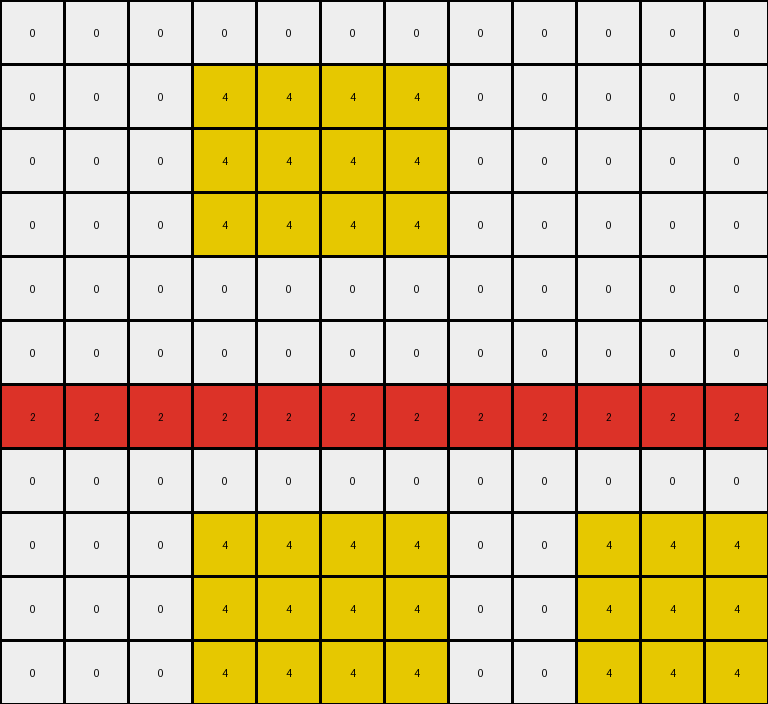
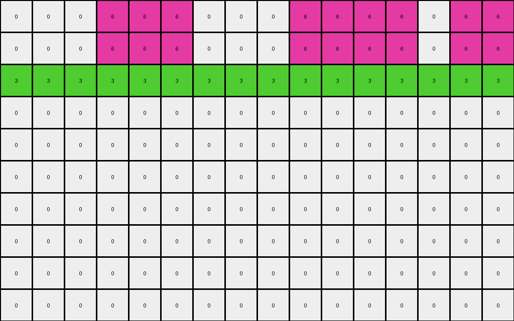
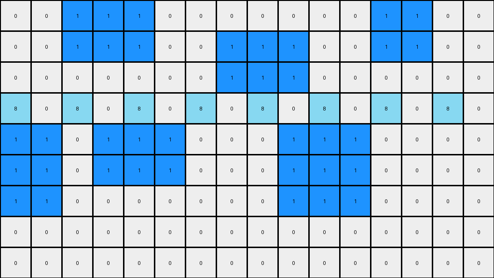

# AboveBelow1 • 009 • refine_dreamer

---

Previous Code:
```python
"""
The transformation identifies regions of magenta (6) and green (3) pixels. It preserves the magenta pixels in the top three rows and the green pixels, while changing all other magenta pixels to white (0).
"""

import numpy as np

def find_contiguous_regions(grid, color):
    """Finds contiguous regions of the specified color in the grid."""
    visited = np.zeros_like(grid, dtype=bool)
    regions = []

    def dfs(row, col, region):
        """Depth-First Search to explore a contiguous region."""
        if (row < 0 or row >= grid.shape[0] or col < 0 or col >= grid.shape[1] or
                visited[row, col] or grid[row, col] != color):
            return
        visited[row, col] = True
        region.append((row, col))
        dfs(row + 1, col, region)
        dfs(row - 1, col, region)
        dfs(row, col + 1, region)
        dfs(row, col - 1, region)

    for row in range(grid.shape[0]):
        for col in range(grid.shape[1]):
            if grid[row, col] == color and not visited[row, col]:
                region = []
                dfs(row, col, region)
                regions.append(region)
    return regions

def transform(input_grid):
    """Transforms the input grid according to the described rule."""
    output_grid = np.copy(input_grid)
    magenta_regions = find_contiguous_regions(input_grid, 6)
    green_regions = find_contiguous_regions(input_grid, 3)

    # Preserve top magenta and erase the rest
    for region in magenta_regions:
        for row, col in region:
            if row > 2:  # Not in the top three rows
                output_grid[row, col] = 0

    return output_grid
```

Train Set Results:

## Example 1:

Input:
```
0 0 0 0 0 0 0 0 0 0 0 0
0 0 0 4 4 4 4 0 0 0 0 0
0 0 0 4 4 4 4 0 0 0 0 0
0 0 0 4 4 4 4 0 0 0 0 0
0 0 0 0 0 0 0 0 0 0 0 0
0 0 0 0 0 0 0 0 0 0 0 0
2 2 2 2 2 2 2 2 2 2 2 2
0 0 0 0 0 0 0 0 0 0 0 0
0 0 0 4 4 4 4 0 0 4 4 4
0 0 0 4 4 4 4 0 0 4 4 4
0 0 0 4 4 4 4 0 0 4 4 4
```
Expected Output:
```
0 0 0 0 0 0 0 0 0 0 0 0
0 0 0 4 4 4 4 0 0 0 0 0
0 0 0 4 4 4 4 0 0 0 0 0
0 0 0 4 4 4 4 0 0 0 0 0
0 0 0 0 0 0 0 0 0 0 0 0
0 0 0 0 0 0 0 0 0 0 0 0
2 2 2 2 2 2 2 2 2 2 2 2
0 0 0 0 0 0 0 0 0 0 0 0
0 0 0 0 0 0 0 0 0 0 0 0
0 0 0 0 0 0 0 0 0 0 0 0
0 0 0 0 0 0 0 0 0 0 0 0
```
Transformed Output:
```
0 0 0 0 0 0 0 0 0 0 0 0
0 0 0 4 4 4 4 0 0 0 0 0
0 0 0 4 4 4 4 0 0 0 0 0
0 0 0 4 4 4 4 0 0 0 0 0
0 0 0 0 0 0 0 0 0 0 0 0
0 0 0 0 0 0 0 0 0 0 0 0
2 2 2 2 2 2 2 2 2 2 2 2
0 0 0 0 0 0 0 0 0 0 0 0
0 0 0 4 4 4 4 0 0 4 4 4
0 0 0 4 4 4 4 0 0 4 4 4
0 0 0 4 4 4 4 0 0 4 4 4
```

match: False
pixels_off: 21
size_correct: True
color_palette_correct: True
correct_pixel_counts: False

## Example 2:

Input:
```
0 0 0 6 6 6 0 0 0 6 6 6 6 0 6 6
0 0 0 6 6 6 0 0 0 6 6 6 6 0 6 6
3 3 3 3 3 3 3 3 3 3 3 3 3 3 3 3
0 0 6 6 6 0 0 0 0 0 6 6 6 6 0 0
0 0 6 6 6 0 0 0 0 0 6 6 6 6 0 0
0 0 0 0 0 0 0 0 0 0 6 6 6 6 0 0
0 0 0 0 0 0 0 0 0 0 6 6 6 6 0 0
0 0 6 6 0 0 6 6 0 0 6 6 6 6 0 0
0 0 6 6 0 0 6 6 0 0 0 0 0 0 0 0
0 0 6 6 0 0 6 6 0 0 0 0 0 0 0 0
```
Expected Output:
```
0 0 0 6 6 6 0 0 0 6 6 6 6 0 6 6
0 0 0 6 6 6 0 0 0 6 6 6 6 0 6 6
3 3 3 3 3 3 3 3 3 3 3 3 3 3 3 3
0 0 0 0 0 0 0 0 0 0 0 0 0 0 0 0
0 0 0 0 0 0 0 0 0 0 0 0 0 0 0 0
0 0 0 0 0 0 0 0 0 0 0 0 0 0 0 0
0 0 0 0 0 0 0 0 0 0 0 0 0 0 0 0
0 0 0 0 0 0 0 0 0 0 0 0 0 0 0 0
0 0 0 0 0 0 0 0 0 0 0 0 0 0 0 0
0 0 0 0 0 0 0 0 0 0 0 0 0 0 0 0
```
Transformed Output:
```
0 0 0 6 6 6 0 0 0 6 6 6 6 0 6 6
0 0 0 6 6 6 0 0 0 6 6 6 6 0 6 6
3 3 3 3 3 3 3 3 3 3 3 3 3 3 3 3
0 0 0 0 0 0 0 0 0 0 0 0 0 0 0 0
0 0 0 0 0 0 0 0 0 0 0 0 0 0 0 0
0 0 0 0 0 0 0 0 0 0 0 0 0 0 0 0
0 0 0 0 0 0 0 0 0 0 0 0 0 0 0 0
0 0 0 0 0 0 0 0 0 0 0 0 0 0 0 0
0 0 0 0 0 0 0 0 0 0 0 0 0 0 0 0
0 0 0 0 0 0 0 0 0 0 0 0 0 0 0 0
```

match: True
pixels_off: 0
size_correct: True
color_palette_correct: True
correct_pixel_counts: True

## Example 3:

Input:
```
0 0 1 1 1 0 0 0 0 0 0 0 1 1 0 0
0 0 1 1 1 0 0 1 1 1 0 0 1 1 0 0
0 0 0 0 0 0 0 1 1 1 0 0 0 0 0 0
8 0 8 0 8 0 8 0 8 0 8 0 8 0 8 0
1 1 0 1 1 1 0 0 0 1 1 1 0 0 0 0
1 1 0 1 1 1 0 0 0 1 1 1 0 0 0 0
1 1 0 0 0 0 0 0 0 1 1 1 0 0 0 0
0 0 0 0 0 0 0 0 0 0 0 0 0 0 0 0
0 0 0 0 0 0 0 0 0 0 0 0 0 0 0 0
```
Expected Output:
```
0 0 1 1 1 0 0 0 0 0 0 0 1 1 0 0
0 0 1 1 1 0 0 1 1 1 0 0 1 1 0 0
0 0 0 0 0 0 0 1 1 1 0 0 0 0 0 0
8 0 8 0 8 0 8 0 8 0 8 0 8 0 8 0
0 0 0 0 0 0 0 0 0 0 0 0 0 0 0 0
0 0 0 0 0 0 0 0 0 0 0 0 0 0 0 0
0 0 0 0 0 0 0 0 0 0 0 0 0 0 0 0
0 0 0 0 0 0 0 0 0 0 0 0 0 0 0 0
0 0 0 0 0 0 0 0 0 0 0 0 0 0 0 0
```
Transformed Output:
```
0 0 1 1 1 0 0 0 0 0 0 0 1 1 0 0
0 0 1 1 1 0 0 1 1 1 0 0 1 1 0 0
0 0 0 0 0 0 0 1 1 1 0 0 0 0 0 0
8 0 8 0 8 0 8 0 8 0 8 0 8 0 8 0
1 1 0 1 1 1 0 0 0 1 1 1 0 0 0 0
1 1 0 1 1 1 0 0 0 1 1 1 0 0 0 0
1 1 0 0 0 0 0 0 0 1 1 1 0 0 0 0
0 0 0 0 0 0 0 0 0 0 0 0 0 0 0 0
0 0 0 0 0 0 0 0 0 0 0 0 0 0 0 0
```

match: False
pixels_off: 21
size_correct: True
color_palette_correct: True
correct_pixel_counts: False
**INSTRUCTIONS**

The code above was generated based on observations from the first training
example

we have tested the transform function on each of the task example inputs and
compared with the expected output

review each of the examples provided and the results and consider how the
natural language program should be updated to accommodate this new knowledge

respond with the following deliverables:

- general assessment of the information provided and strategy for resolving the
  errors
- gather metrics about each of the examples and results - use code_execution to
  develop accurate reports on your assumptions
- a YAML block documenting facts - Focus on identifying objects, their properties, and the actions performed on them.
- a natural language program - Be as clear and concise as possible, providing a complete description of the transformation rule.


your responses should be considered as information in a report - not a
conversation
