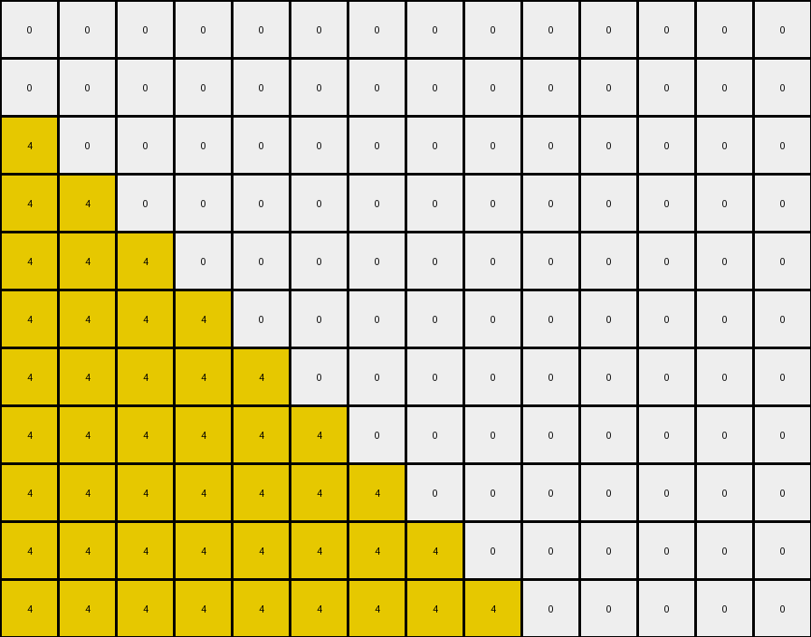

# AboveBelow10 • 003 • refine_dreamer

---

Previous Code:
```python
"""
1.  **Identify the diagonal:** Locate the existing diagonal line of yellow (4) pixels extending from the top-left corner downwards.
2.  **Fill below the diagonal:** For each row, starting from the top, change all pixels to the left of the yellow diagonal pixel in that row to yellow (4). Stop when reaching the bottom of the grid or end of a row. The result is a filled triangle.
"""

import numpy as np

def transform(input_grid):
    """Transforms the input grid by filling the area below the diagonal with yellow."""
    output_grid = np.copy(input_grid)
    rows, cols = output_grid.shape

    # Iterate through each row
    for i in range(rows):
        # Find the index of the yellow pixel in the current row
        yellow_index = -1
        for j in range(cols):
            if output_grid[i, j] == 4:
                yellow_index = j
                break  # Stop searching after finding the first yellow pixel

        # Fill pixels to the left of the yellow pixel with yellow
        if yellow_index != -1:
            for j in range(yellow_index):
                output_grid[i, j] = 4

    return output_grid
```

Train Set Results:

## Example 1:

Input:
```
0 0 0 0 0 0 0 0 0 0 0 0 0 0
0 0 0 0 0 0 0 0 0 0 0 0 0 0
4 0 0 0 0 0 0 0 0 0 0 0 0 0
0 4 0 0 0 0 0 0 0 0 0 0 0 0
0 0 4 0 0 0 0 0 0 0 0 0 0 0
0 0 0 4 0 0 0 0 0 0 0 0 0 0
0 0 0 0 4 0 0 0 0 0 0 0 0 0
0 0 0 0 0 4 0 0 0 0 0 0 0 0
0 0 0 0 0 0 4 0 0 0 0 0 0 0
0 0 0 0 0 0 0 4 0 0 0 0 0 0
0 0 0 0 0 0 0 0 4 0 0 0 0 0
```
Expected Output:
```
0 0 0 0 0 0 0 0 0 0 0 0 0 0
0 0 0 0 0 0 0 0 0 0 0 0 0 0
4 0 0 0 0 0 0 0 0 0 0 0 0 0
4 4 0 0 0 0 0 0 0 0 0 0 0 0
4 4 4 0 0 0 0 0 0 0 0 0 0 0
4 4 4 4 0 0 0 0 0 0 0 0 0 0
4 4 4 4 4 0 0 0 0 0 0 0 0 0
4 4 4 4 4 4 0 0 0 0 0 0 0 0
4 4 4 4 4 4 4 0 0 0 0 0 0 0
4 4 4 4 4 4 4 4 0 0 0 0 0 0
4 4 4 4 4 4 4 4 4 0 0 0 0 0
```
Transformed Output:
```
0 0 0 0 0 0 0 0 0 0 0 0 0 0
0 0 0 0 0 0 0 0 0 0 0 0 0 0
4 0 0 0 0 0 0 0 0 0 0 0 0 0
4 4 0 0 0 0 0 0 0 0 0 0 0 0
4 4 4 0 0 0 0 0 0 0 0 0 0 0
4 4 4 4 0 0 0 0 0 0 0 0 0 0
4 4 4 4 4 0 0 0 0 0 0 0 0 0
4 4 4 4 4 4 0 0 0 0 0 0 0 0
4 4 4 4 4 4 4 0 0 0 0 0 0 0
4 4 4 4 4 4 4 4 0 0 0 0 0 0
4 4 4 4 4 4 4 4 4 0 0 0 0 0
```

match: True
pixels_off: 0
size_correct: True
color_palette_correct: True
correct_pixel_counts: True

## Example 2:

Input:
```
0 0 0 0 0 0 0 0 3 0 0 0
0 0 0 0 0 0 0 3 0 0 0 0
0 0 0 0 0 0 3 0 0 0 0 0
0 0 0 0 0 3 0 0 0 0 0 0
0 0 0 0 3 0 0 0 0 0 0 0
0 0 0 3 0 0 0 0 0 0 0 0
0 0 3 0 0 0 0 0 0 0 0 0
0 3 0 0 0 0 0 0 0 0 0 0
3 0 0 0 0 0 0 0 0 0 0 0
0 0 0 0 0 0 0 0 0 0 0 0
0 0 0 0 0 0 0 0 0 0 0 0
```
Expected Output:
```
0 0 0 0 0 0 0 0 3 3 3 3
0 0 0 0 0 0 0 3 3 3 3 3
0 0 0 0 0 0 3 3 3 3 3 3
0 0 0 0 0 3 3 3 3 3 3 3
0 0 0 0 3 3 3 3 3 3 3 3
0 0 0 3 3 3 3 3 3 3 3 3
0 0 3 3 3 3 3 3 3 3 3 3
0 3 3 3 3 3 3 3 3 3 3 3
3 3 3 3 3 3 3 3 3 3 3 3
3 3 3 3 3 3 3 3 3 3 3 3
3 3 3 3 3 3 3 3 3 3 3 3
```
Transformed Output:
```
0 0 0 0 0 0 0 0 3 0 0 0
0 0 0 0 0 0 0 3 0 0 0 0
0 0 0 0 0 0 3 0 0 0 0 0
0 0 0 0 0 3 0 0 0 0 0 0
0 0 0 0 3 0 0 0 0 0 0 0
0 0 0 3 0 0 0 0 0 0 0 0
0 0 3 0 0 0 0 0 0 0 0 0
0 3 0 0 0 0 0 0 0 0 0 0
3 0 0 0 0 0 0 0 0 0 0 0
0 0 0 0 0 0 0 0 0 0 0 0
0 0 0 0 0 0 0 0 0 0 0 0
```

match: False
pixels_off: 87
size_correct: True
color_palette_correct: True
correct_pixel_counts: False
**INSTRUCTIONS**

The code above was generated based on observations from the first training
example

we have tested the transform function on each of the task example inputs and
compared with the expected output

review each of the examples provided and the results and consider how the
natural language program should be updated to accommodate this new knowledge

respond with the following deliverables:

- general assessment of the information provided and strategy for resolving the
  errors
- gather metrics about each of the examples and results - use code_execution to
  develop accurate reports on your assumptions
- a YAML block documenting facts - Focus on identifying objects, their properties, and the actions performed on them.
- a natural language program - Be as clear and concise as possible, providing a complete description of the transformation rule.


your responses should be considered as information in a report - not a
conversation
