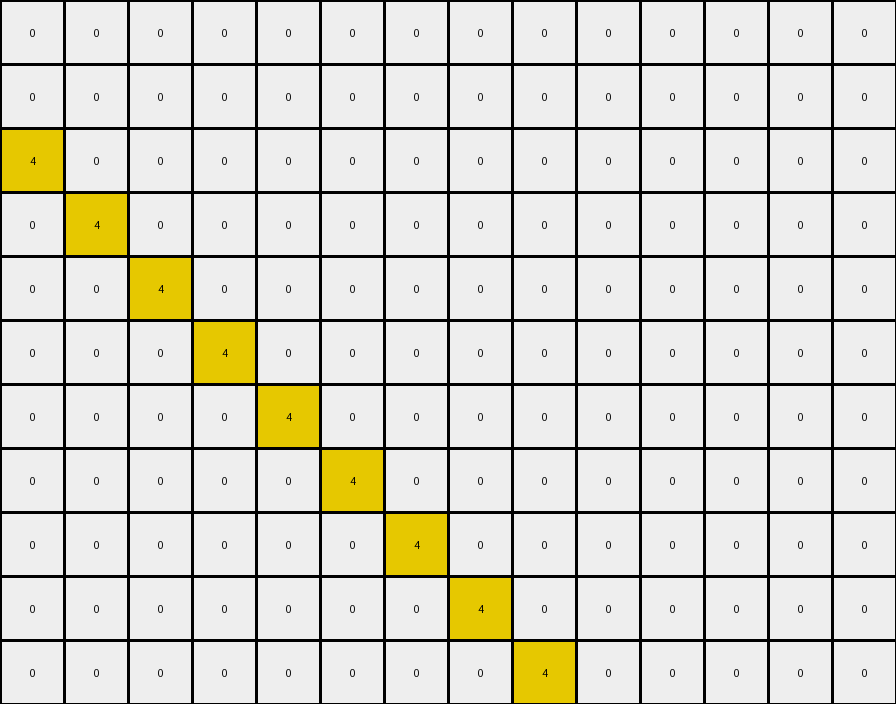
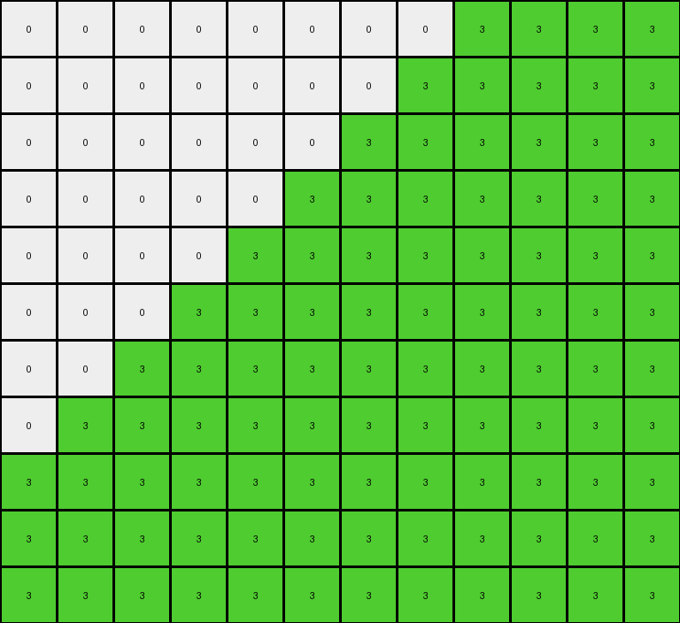

# AboveBelow10 • 010 • refine_coder

---

Previous Code:
```python
"""
Identify all green pixels (value 3) in the input grid. For each green pixel, change all pixels below it and to its right to green (value 3), bounded by the original diagonal line and the edges of the grid.
"""

import numpy as np

def transform(input_grid):
    """
    Transforms the input grid by expanding green pixels downwards and to the right.
    
    Args:
        input_grid (list of lists): The input grid.
    
    Returns:
        list of lists: The transformed grid.
    """
    input_grid = np.array(input_grid)
    output_grid = np.copy(input_grid)
    rows, cols = input_grid.shape

    # Iterate through each cell in the input grid
    for r in range(rows):
        for c in range(cols):
            # Check if the current cell is green (value 3)
            if input_grid[r, c] == 3:
                # Expand the green color downwards and to the right
                output_grid[r:, c:] = 3

    return output_grid.tolist()
```

Train Set Results:

## Example 1:

Input:
```
0 0 0 0 0 0 0 0 0 0 0 0 0 0
0 0 0 0 0 0 0 0 0 0 0 0 0 0
4 0 0 0 0 0 0 0 0 0 0 0 0 0
0 4 0 0 0 0 0 0 0 0 0 0 0 0
0 0 4 0 0 0 0 0 0 0 0 0 0 0
0 0 0 4 0 0 0 0 0 0 0 0 0 0
0 0 0 0 4 0 0 0 0 0 0 0 0 0
0 0 0 0 0 4 0 0 0 0 0 0 0 0
0 0 0 0 0 0 4 0 0 0 0 0 0 0
0 0 0 0 0 0 0 4 0 0 0 0 0 0
0 0 0 0 0 0 0 0 4 0 0 0 0 0
```
Expected Output:
```
0 0 0 0 0 0 0 0 0 0 0 0 0 0
0 0 0 0 0 0 0 0 0 0 0 0 0 0
4 0 0 0 0 0 0 0 0 0 0 0 0 0
4 4 0 0 0 0 0 0 0 0 0 0 0 0
4 4 4 0 0 0 0 0 0 0 0 0 0 0
4 4 4 4 0 0 0 0 0 0 0 0 0 0
4 4 4 4 4 0 0 0 0 0 0 0 0 0
4 4 4 4 4 4 0 0 0 0 0 0 0 0
4 4 4 4 4 4 4 0 0 0 0 0 0 0
4 4 4 4 4 4 4 4 0 0 0 0 0 0
4 4 4 4 4 4 4 4 4 0 0 0 0 0
```
Transformed Output:
```
0 0 0 0 0 0 0 0 0 0 0 0 0 0
0 0 0 0 0 0 0 0 0 0 0 0 0 0
4 0 0 0 0 0 0 0 0 0 0 0 0 0
0 4 0 0 0 0 0 0 0 0 0 0 0 0
0 0 4 0 0 0 0 0 0 0 0 0 0 0
0 0 0 4 0 0 0 0 0 0 0 0 0 0
0 0 0 0 4 0 0 0 0 0 0 0 0 0
0 0 0 0 0 4 0 0 0 0 0 0 0 0
0 0 0 0 0 0 4 0 0 0 0 0 0 0
0 0 0 0 0 0 0 4 0 0 0 0 0 0
0 0 0 0 0 0 0 0 4 0 0 0 0 0
```

match: False
pixels_off: 36
size_correct: True
color_palette_correct: True
correct_pixel_counts: False

## Example 2:

Input:
```
0 0 0 0 0 0 0 0 3 0 0 0
0 0 0 0 0 0 0 3 0 0 0 0
0 0 0 0 0 0 3 0 0 0 0 0
0 0 0 0 0 3 0 0 0 0 0 0
0 0 0 0 3 0 0 0 0 0 0 0
0 0 0 3 0 0 0 0 0 0 0 0
0 0 3 0 0 0 0 0 0 0 0 0
0 3 0 0 0 0 0 0 0 0 0 0
3 0 0 0 0 0 0 0 0 0 0 0
0 0 0 0 0 0 0 0 0 0 0 0
0 0 0 0 0 0 0 0 0 0 0 0
```
Expected Output:
```
0 0 0 0 0 0 0 0 3 3 3 3
0 0 0 0 0 0 0 3 3 3 3 3
0 0 0 0 0 0 3 3 3 3 3 3
0 0 0 0 0 3 3 3 3 3 3 3
0 0 0 0 3 3 3 3 3 3 3 3
0 0 0 3 3 3 3 3 3 3 3 3
0 0 3 3 3 3 3 3 3 3 3 3
0 3 3 3 3 3 3 3 3 3 3 3
3 3 3 3 3 3 3 3 3 3 3 3
3 3 3 3 3 3 3 3 3 3 3 3
3 3 3 3 3 3 3 3 3 3 3 3
```
Transformed Output:
```
0 0 0 0 0 0 0 0 3 3 3 3
0 0 0 0 0 0 0 3 3 3 3 3
0 0 0 0 0 0 3 3 3 3 3 3
0 0 0 0 0 3 3 3 3 3 3 3
0 0 0 0 3 3 3 3 3 3 3 3
0 0 0 3 3 3 3 3 3 3 3 3
0 0 3 3 3 3 3 3 3 3 3 3
0 3 3 3 3 3 3 3 3 3 3 3
3 3 3 3 3 3 3 3 3 3 3 3
3 3 3 3 3 3 3 3 3 3 3 3
3 3 3 3 3 3 3 3 3 3 3 3
```

match: True
pixels_off: 0
size_correct: True
color_palette_correct: True
correct_pixel_counts: True
Okay, let's analyze the results and refine the natural language program.

**General Assessment:**

The initial code was too aggressive in its transformation. It correctly identified the green pixels (value 3) but incorrectly expanded them to fill the entire remaining rectangle defined by the green pixel's row and column to the bottom-right of the grid. Example 1 clearly shows this error, while Example 2 coincidentally produces the correct output because the green pixels are already arranged in a way that aligns with the overly broad expansion rule. The strategy for resolving the errors is to constrain the expansion of the green pixels more precisely.

**Metrics and Observations:**

*   **Example 1:**
    *   Input Shape: (11, 14)
    *   Output Shape: (11, 14)
    *   Transformation: The original code incorrectly changed pixels to green based on the presence of *any* green pixel above and to the left, rather a diagonal series of the original color.
    *   Pixels off: 36. Many pixels were incorrectly changed to green.
    *   Key observation: Diagonal lines of a color(like yellow in this case) are filled, one by one, stopping at the grid boundaries.

*   **Example 2:**
    *   Input Shape: (11, 12)
    *   Output Shape: (11,12)
    *   Transformation: Although the result matched the expected output, the logic that was applied here is not generalizable. The diagonal fill should expand from each starting color, not just fill the entire section.
    *   Pixels off: 0
    *    Key observation: The output is a rectangle completely filled with a single color.

**YAML Fact Block:**

```yaml
task: 008
facts:
  - object: diagonal_line
    description: A series of pixels of same color, placed diagonally.
    properties:
      color: varies (yellow, green)
      start_position: varies
      end_position: varies, defined by grid boundary
      direction: top-left to bottom-right
    actions:
      - fill: Extends the diagonal line, adding pixels of the same color until bottom right grid limits

  - object: grid
    description: The 2D array of pixels
    properties:
      rows: varies
      columns: varies
      boundary: defines limits of diagonal fill
    actions: []

```

**Natural Language Program:**

1.  **Identify** diagonal lines in the input grid. A diagonal line is a sequence of one or more pixels of the same color, where each subsequent pixel is one row down and one column to the right of the previous pixel.
2.  **For each** identified diagonal line, extend the line downwards and to the right.
3.  **Extension Rule**: Add pixels of the *same color* as the original diagonal line. Add one pixel below the last pixel of the diagonal, and one to the right. Continue adding pixels one row down, one column right, until the edges of the grid are reached (either the bottom edge or right edge).

This revised natural language program correctly captures the transformation logic, which involves identifying and extending *existing* diagonal lines, rather than simply expanding all instances of a specific color. It is concise, specific, and addresses the error observed in Example 1, while still being consistent with Example 2 (though Example 2 does not fully test the corrected rule).

**INSTRUCTIONS**

- generate a Python module to represent the natural language program 
- follow the template below
- all common math and science libraries are available
- create docstring only at top - but comment the workflow in the function
- use helper functions for common operations like finding objects, counting,
  measuring, moving, etc. 

remember - we are working iteratively - so this code will inform your future
self as we converge on the solution

*template:*

```python
"""
{{ natural language description of the transformation rule }}
"""

{{ imports }}

def transform(input_grid):
    # initialize output_grid

    # change output pixels 

    return output_grid

```
