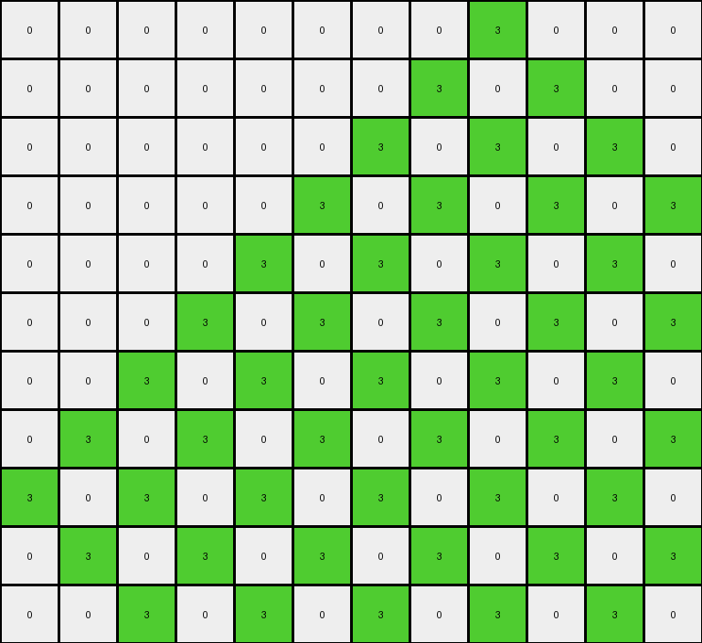

# AboveBelow10 • 011 • refine_dreamer

---

Previous Code:
```python
"""
Identify diagonal lines in the input grid. A diagonal line is a sequence of one or more pixels of the same color, where each subsequent pixel is one row down and one column to the right of the previous pixel. For each identified diagonal line, extend the line downwards and to the right. Extension Rule: Add pixels of the *same color* as the original diagonal line. Add one pixel below the last pixel of the diagonal, and one to the right. Continue adding pixels one row down, one column right, until the edges of the grid are reached (either the bottom edge or right edge).
"""

import numpy as np

def find_diagonal_lines(grid):
    """
    Finds diagonal lines in the grid.
    """
    rows, cols = grid.shape
    diagonals = []
    for r in range(rows):
        for c in range(cols):
            if len(diagonals) == 0 or not any((r,c) in d for d in diagonals):
                color = grid[r, c]
                if color != 0: #ignore background
                    diagonal = [(r, c)]
                    cr, cc = r + 1, c + 1
                    while cr < rows and cc < cols and grid[cr, cc] == color:
                        diagonal.append((cr, cc))
                        cr += 1
                        cc += 1
                    if len(diagonal) >= 1: #considering single pixels to be part of diagoal.
                        diagonals.append(diagonal)
    return diagonals

def extend_diagonal_line(grid, diagonal):
    """
    Extends a diagonal line downwards and to the right.
    """
    output_grid = np.copy(grid)
    last_r, last_c = diagonal[-1]
    color = grid[diagonal[0][0], diagonal[0][1]]
    r, c = last_r + 1, last_c + 1
    while r < grid.shape[0] and c < grid.shape[1]:
        output_grid[r, c] = color
        r += 1
        c += 1
    return output_grid

def transform(input_grid):
    """
    Transforms the input grid by extending diagonal lines.
    
    Args:
        input_grid (list of lists): The input grid.
    
    Returns:
        list of lists: The transformed grid.
    """
    input_grid = np.array(input_grid)
    output_grid = np.copy(input_grid)
    diagonals = find_diagonal_lines(input_grid)

    # Extend each diagonal line
    for diagonal in diagonals:
        output_grid = extend_diagonal_line(output_grid, diagonal)

    return output_grid.tolist()
```

Train Set Results:

## Example 1:

Input:
```
0 0 0 0 0 0 0 0 0 0 0 0 0 0
0 0 0 0 0 0 0 0 0 0 0 0 0 0
4 0 0 0 0 0 0 0 0 0 0 0 0 0
0 4 0 0 0 0 0 0 0 0 0 0 0 0
0 0 4 0 0 0 0 0 0 0 0 0 0 0
0 0 0 4 0 0 0 0 0 0 0 0 0 0
0 0 0 0 4 0 0 0 0 0 0 0 0 0
0 0 0 0 0 4 0 0 0 0 0 0 0 0
0 0 0 0 0 0 4 0 0 0 0 0 0 0
0 0 0 0 0 0 0 4 0 0 0 0 0 0
0 0 0 0 0 0 0 0 4 0 0 0 0 0
```
Expected Output:
```
0 0 0 0 0 0 0 0 0 0 0 0 0 0
0 0 0 0 0 0 0 0 0 0 0 0 0 0
4 0 0 0 0 0 0 0 0 0 0 0 0 0
4 4 0 0 0 0 0 0 0 0 0 0 0 0
4 4 4 0 0 0 0 0 0 0 0 0 0 0
4 4 4 4 0 0 0 0 0 0 0 0 0 0
4 4 4 4 4 0 0 0 0 0 0 0 0 0
4 4 4 4 4 4 0 0 0 0 0 0 0 0
4 4 4 4 4 4 4 0 0 0 0 0 0 0
4 4 4 4 4 4 4 4 0 0 0 0 0 0
4 4 4 4 4 4 4 4 4 0 0 0 0 0
```
Transformed Output:
```
0 0 0 0 0 0 0 0 0 0 0 0 0 0
0 0 0 0 0 0 0 0 0 0 0 0 0 0
4 0 0 0 0 0 0 0 0 0 0 0 0 0
0 4 0 0 0 0 0 0 0 0 0 0 0 0
0 0 4 0 0 0 0 0 0 0 0 0 0 0
0 0 0 4 0 0 0 0 0 0 0 0 0 0
0 0 0 0 4 0 0 0 0 0 0 0 0 0
0 0 0 0 0 4 0 0 0 0 0 0 0 0
0 0 0 0 0 0 4 0 0 0 0 0 0 0
0 0 0 0 0 0 0 4 0 0 0 0 0 0
0 0 0 0 0 0 0 0 4 0 0 0 0 0
```

match: False
pixels_off: 36
size_correct: True
color_palette_correct: True
correct_pixel_counts: False

## Example 2:

Input:
```
0 0 0 0 0 0 0 0 3 0 0 0
0 0 0 0 0 0 0 3 0 0 0 0
0 0 0 0 0 0 3 0 0 0 0 0
0 0 0 0 0 3 0 0 0 0 0 0
0 0 0 0 3 0 0 0 0 0 0 0
0 0 0 3 0 0 0 0 0 0 0 0
0 0 3 0 0 0 0 0 0 0 0 0
0 3 0 0 0 0 0 0 0 0 0 0
3 0 0 0 0 0 0 0 0 0 0 0
0 0 0 0 0 0 0 0 0 0 0 0
0 0 0 0 0 0 0 0 0 0 0 0
```
Expected Output:
```
0 0 0 0 0 0 0 0 3 3 3 3
0 0 0 0 0 0 0 3 3 3 3 3
0 0 0 0 0 0 3 3 3 3 3 3
0 0 0 0 0 3 3 3 3 3 3 3
0 0 0 0 3 3 3 3 3 3 3 3
0 0 0 3 3 3 3 3 3 3 3 3
0 0 3 3 3 3 3 3 3 3 3 3
0 3 3 3 3 3 3 3 3 3 3 3
3 3 3 3 3 3 3 3 3 3 3 3
3 3 3 3 3 3 3 3 3 3 3 3
3 3 3 3 3 3 3 3 3 3 3 3
```
Transformed Output:
```
0 0 0 0 0 0 0 0 3 0 0 0
0 0 0 0 0 0 0 3 0 3 0 0
0 0 0 0 0 0 3 0 3 0 3 0
0 0 0 0 0 3 0 3 0 3 0 3
0 0 0 0 3 0 3 0 3 0 3 0
0 0 0 3 0 3 0 3 0 3 0 3
0 0 3 0 3 0 3 0 3 0 3 0
0 3 0 3 0 3 0 3 0 3 0 3
3 0 3 0 3 0 3 0 3 0 3 0
0 3 0 3 0 3 0 3 0 3 0 3
0 0 3 0 3 0 3 0 3 0 3 0
```

match: False
pixels_off: 49
size_correct: True
color_palette_correct: True
correct_pixel_counts: False
**INSTRUCTIONS**

The code above was generated based on observations from the first training
example

we have tested the transform function on each of the task example inputs and
compared with the expected output

review each of the examples provided and the results and consider how the
natural language program should be updated to accommodate this new knowledge

respond with the following deliverables:

- general assessment of the information provided and strategy for resolving the
  errors
- gather metrics about each of the examples and results - use code_execution to
  develop accurate reports on your assumptions
- a YAML block documenting facts - Focus on identifying objects, their properties, and the actions performed on them.
- a natural language program - Be as clear and concise as possible, providing a complete description of the transformation rule.


your responses should be considered as information in a report - not a
conversation
