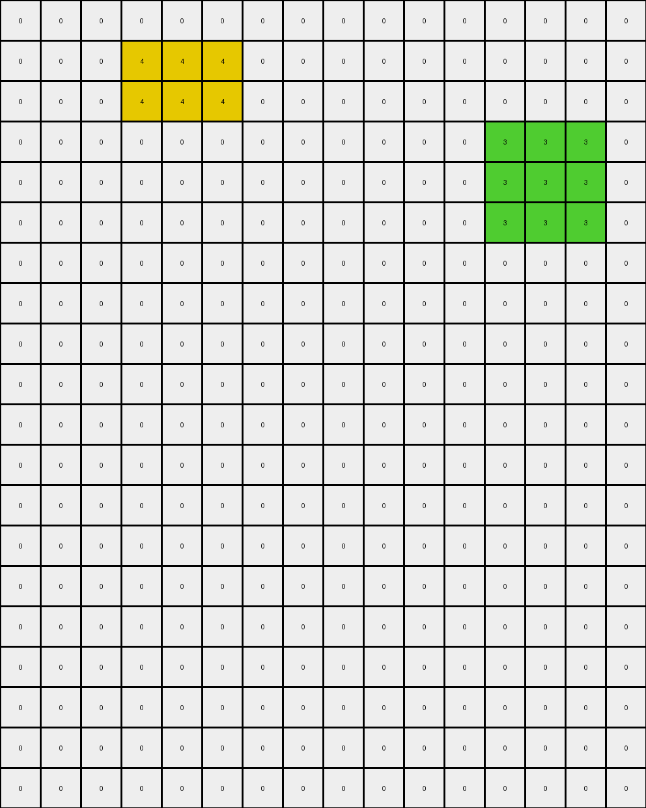

# AboveBelow2 • 003 • refine_dreamer

---

Previous Code:
```python
"""
1.  **Identify Rectangles:** Locate all rectangular shapes formed by contiguous blocks of pixels of the same color (excluding white/0).
2.  **Selective Retention:** Retain any Green and yellow rectangles.
3.  **Removal:** remove red and blue rectangles
4.  **Output:** Produce a new grid with the selected color areas retained and all others replaced with background (white/0).
"""

import numpy as np

def find_objects(grid):
    """
    Finds rectangular objects in the grid.
    Returns a list of (color, (min_row, max_row, min_col, max_col)) tuples.
    """
    objects = []
    visited = np.zeros_like(grid, dtype=bool)

    def is_valid(r, c):
        return 0 <= r < grid.shape[0] and 0 <= c < grid.shape[1]

    def dfs(r, c, color, min_row, max_row, min_col, max_col):
        if not is_valid(r, c) or visited[r, c] or grid[r, c] != color:
            return min_row, max_row, min_col, max_col

        visited[r, c] = True
        min_row = min(min_row, r)
        max_row = max(max_row, r)
        min_col = min(min_col, c)
        max_col = max(max_col, c)

        for dr, dc in [(0, 1), (0, -1), (1, 0), (-1, 0)]:
            min_row, max_row, min_col, max_col = dfs(r + dr, c + dc, color, min_row, max_row, min_col, max_col)
        return min_row, max_row, min_col, max_col

    for r in range(grid.shape[0]):
        for c in range(grid.shape[1]):
            if not visited[r, c] and grid[r, c] != 0:
                color = grid[r, c]
                min_row, max_row, min_col, max_col = dfs(r, c, color, r, r, c, c)
                objects.append((color, (min_row, max_row, min_col, max_col)))
    return objects
def transform(input_grid):
    """
    Transforms the input grid according to the rules.
    """
    # initialize output_grid
    input_grid = np.array(input_grid)
    output_grid = np.zeros_like(input_grid)

    # Find all objects
    objects = find_objects(input_grid)
    
    # Iterate over identified objects and selectively retain/remove
    for color, (min_row, max_row, min_col, max_col) in objects:
        if color in (3, 4): # Green or Yellow
            output_grid[min_row:max_row+1, min_col:max_col+1] = color

    return output_grid.tolist()
```

Train Set Results:

## Example 1:

Input:
```
0 0 4 4 4 0 0 0 0 0 0 0 0 0 0 0 0 1 1 1
0 0 4 4 4 0 0 0 0 0 0 0 0 0 0 0 0 1 1 1
0 0 0 0 0 0 0 0 0 0 0 0 0 0 0 0 0 1 1 1
0 2 2 2 0 0 2 2 2 0 0 0 0 2 2 2 0 0 0 0
0 2 2 2 0 0 2 2 2 0 0 0 0 2 2 2 0 0 0 0
0 2 2 2 0 0 2 2 2 0 0 0 0 2 2 2 0 0 0 0
0 2 2 2 0 0 0 0 0 0 0 0 0 2 2 2 0 0 0 0
0 0 0 0 0 0 0 0 0 0 0 0 0 0 0 0 0 0 0 0
0 0 0 0 0 0 0 0 0 0 0 0 0 0 0 0 0 0 0 0
0 0 0 0 3 3 3 3 3 0 0 0 0 0 0 0 0 0 0 0
0 0 0 0 3 3 3 3 3 0 0 0 0 0 0 0 0 0 0 0
0 0 0 0 3 3 3 3 3 0 0 0 0 0 0 0 0 0 0 0
0 0 0 0 3 3 3 3 3 0 0 0 0 0 0 0 0 0 0 0
0 0 0 0 3 3 3 3 3 0 0 0 0 0 0 0 0 0 0 0
0 0 0 0 0 0 0 0 0 0 0 0 0 0 0 0 0 0 0 0
0 0 0 4 4 4 0 0 0 4 4 4 0 0 0 0 0 0 0 0
0 0 0 4 4 4 0 0 0 4 4 4 0 0 0 0 0 0 0 0
0 0 0 4 4 4 0 0 0 4 4 4 0 0 0 0 0 0 0 0
```
Expected Output:
```
0 0 0 0 0 0 0 0 0 0 0 0 0 0 0 0 0 0 0 0
0 0 0 0 0 0 0 0 0 0 0 0 0 0 0 0 0 0 0 0
0 0 0 0 0 0 0 0 0 0 0 0 0 0 0 0 0 0 0 0
0 0 0 0 0 0 0 0 0 0 0 0 0 0 0 0 0 0 0 0
0 0 0 0 0 0 0 0 0 0 0 0 0 0 0 0 0 0 0 0
0 0 0 0 0 0 0 0 0 0 0 0 0 0 0 0 0 0 0 0
0 0 0 0 0 0 0 0 0 0 0 0 0 0 0 0 0 0 0 0
0 0 0 0 0 0 0 0 0 0 0 0 0 0 0 0 0 0 0 0
0 0 0 0 0 0 0 0 0 0 0 0 0 0 0 0 0 0 0 0
0 0 0 0 3 3 3 3 3 0 0 0 0 0 0 0 0 0 0 0
0 0 0 0 3 3 3 3 3 0 0 0 0 0 0 0 0 0 0 0
0 0 0 0 3 3 3 3 3 0 0 0 0 0 0 0 0 0 0 0
0 0 0 0 3 3 3 3 3 0 0 0 0 0 0 0 0 0 0 0
0 0 0 0 3 3 3 3 3 0 0 0 0 0 0 0 0 0 0 0
0 0 0 0 0 0 0 0 0 0 0 0 0 0 0 0 0 0 0 0
0 0 0 4 4 4 0 0 0 4 4 4 0 0 0 0 0 0 0 0
0 0 0 4 4 4 0 0 0 4 4 4 0 0 0 0 0 0 0 0
0 0 0 4 4 4 0 0 0 4 4 4 0 0 0 0 0 0 0 0
```
Transformed Output:
```
0 0 4 4 4 0 0 0 0 0 0 0 0 0 0 0 0 0 0 0
0 0 4 4 4 0 0 0 0 0 0 0 0 0 0 0 0 0 0 0
0 0 0 0 0 0 0 0 0 0 0 0 0 0 0 0 0 0 0 0
0 0 0 0 0 0 0 0 0 0 0 0 0 0 0 0 0 0 0 0
0 0 0 0 0 0 0 0 0 0 0 0 0 0 0 0 0 0 0 0
0 0 0 0 0 0 0 0 0 0 0 0 0 0 0 0 0 0 0 0
0 0 0 0 0 0 0 0 0 0 0 0 0 0 0 0 0 0 0 0
0 0 0 0 0 0 0 0 0 0 0 0 0 0 0 0 0 0 0 0
0 0 0 0 0 0 0 0 0 0 0 0 0 0 0 0 0 0 0 0
0 0 0 0 3 3 3 3 3 0 0 0 0 0 0 0 0 0 0 0
0 0 0 0 3 3 3 3 3 0 0 0 0 0 0 0 0 0 0 0
0 0 0 0 3 3 3 3 3 0 0 0 0 0 0 0 0 0 0 0
0 0 0 0 3 3 3 3 3 0 0 0 0 0 0 0 0 0 0 0
0 0 0 0 3 3 3 3 3 0 0 0 0 0 0 0 0 0 0 0
0 0 0 0 0 0 0 0 0 0 0 0 0 0 0 0 0 0 0 0
0 0 0 4 4 4 0 0 0 4 4 4 0 0 0 0 0 0 0 0
0 0 0 4 4 4 0 0 0 4 4 4 0 0 0 0 0 0 0 0
0 0 0 4 4 4 0 0 0 4 4 4 0 0 0 0 0 0 0 0
```

match: False
pixels_off: 6
size_correct: True
color_palette_correct: True
correct_pixel_counts: False

## Example 2:

Input:
```
0 0 0 0 0 0 0 0 0 0 0 2 2 2 0 0
0 0 0 4 4 4 0 0 0 0 0 2 2 2 0 0
0 0 0 4 4 4 0 0 0 0 0 0 0 0 0 0
0 0 0 0 0 0 0 0 0 0 0 0 3 3 3 0
0 0 0 0 0 0 0 0 0 0 0 0 3 3 3 0
0 0 0 0 0 0 0 0 0 0 0 0 3 3 3 0
0 2 2 2 0 0 0 0 0 0 0 0 0 0 0 0
0 2 2 2 0 0 0 0 0 0 0 0 0 0 0 0
0 0 0 0 0 0 0 0 0 0 0 0 0 0 0 0
0 0 0 0 0 0 0 0 0 0 0 0 2 2 2 2
0 0 0 0 0 0 2 2 2 0 0 0 2 2 2 2
0 0 0 0 0 0 2 2 2 0 0 0 2 2 2 2
0 0 0 0 0 0 2 2 2 0 0 0 2 2 2 2
2 2 2 0 0 0 0 0 0 0 0 0 2 2 2 2
2 2 2 0 0 0 0 0 0 0 0 0 2 2 2 2
2 2 2 0 0 0 0 0 0 0 0 0 0 0 0 0
0 0 0 0 0 0 0 0 0 0 0 0 0 0 0 0
0 0 0 0 0 0 0 0 0 0 0 0 0 0 0 0
0 0 0 0 0 0 0 0 0 0 0 0 0 0 0 0
0 0 0 0 0 0 0 0 0 0 0 0 0 0 0 0
```
Expected Output:
```
0 0 0 0 0 0 0 0 0 0 0 0 0 0 0 0
0 0 0 0 0 0 0 0 0 0 0 0 0 0 0 0
0 0 0 0 0 0 0 0 0 0 0 0 0 0 0 0
0 0 0 0 0 0 0 0 0 0 0 0 3 3 3 0
0 0 0 0 0 0 0 0 0 0 0 0 3 3 3 0
0 0 0 0 0 0 0 0 0 0 0 0 3 3 3 0
0 2 2 2 0 0 0 0 0 0 0 0 0 0 0 0
0 2 2 2 0 0 0 0 0 0 0 0 0 0 0 0
0 0 0 0 0 0 0 0 0 0 0 0 0 0 0 0
0 0 0 0 0 0 0 0 0 0 0 0 2 2 2 2
0 0 0 0 0 0 2 2 2 0 0 0 2 2 2 2
0 0 0 0 0 0 2 2 2 0 0 0 2 2 2 2
0 0 0 0 0 0 2 2 2 0 0 0 2 2 2 2
2 2 2 0 0 0 0 0 0 0 0 0 2 2 2 2
2 2 2 0 0 0 0 0 0 0 0 0 2 2 2 2
2 2 2 0 0 0 0 0 0 0 0 0 0 0 0 0
0 0 0 0 0 0 0 0 0 0 0 0 0 0 0 0
0 0 0 0 0 0 0 0 0 0 0 0 0 0 0 0
0 0 0 0 0 0 0 0 0 0 0 0 0 0 0 0
0 0 0 0 0 0 0 0 0 0 0 0 0 0 0 0
```
Transformed Output:
```
0 0 0 0 0 0 0 0 0 0 0 0 0 0 0 0
0 0 0 4 4 4 0 0 0 0 0 0 0 0 0 0
0 0 0 4 4 4 0 0 0 0 0 0 0 0 0 0
0 0 0 0 0 0 0 0 0 0 0 0 3 3 3 0
0 0 0 0 0 0 0 0 0 0 0 0 3 3 3 0
0 0 0 0 0 0 0 0 0 0 0 0 3 3 3 0
0 0 0 0 0 0 0 0 0 0 0 0 0 0 0 0
0 0 0 0 0 0 0 0 0 0 0 0 0 0 0 0
0 0 0 0 0 0 0 0 0 0 0 0 0 0 0 0
0 0 0 0 0 0 0 0 0 0 0 0 0 0 0 0
0 0 0 0 0 0 0 0 0 0 0 0 0 0 0 0
0 0 0 0 0 0 0 0 0 0 0 0 0 0 0 0
0 0 0 0 0 0 0 0 0 0 0 0 0 0 0 0
0 0 0 0 0 0 0 0 0 0 0 0 0 0 0 0
0 0 0 0 0 0 0 0 0 0 0 0 0 0 0 0
0 0 0 0 0 0 0 0 0 0 0 0 0 0 0 0
0 0 0 0 0 0 0 0 0 0 0 0 0 0 0 0
0 0 0 0 0 0 0 0 0 0 0 0 0 0 0 0
0 0 0 0 0 0 0 0 0 0 0 0 0 0 0 0
0 0 0 0 0 0 0 0 0 0 0 0 0 0 0 0
```

match: False
pixels_off: 54
size_correct: True
color_palette_correct: False
correct_pixel_counts: False

## Example 3:

Input:
```
0 0 0 8 8 8 0
0 0 0 8 8 8 0
0 0 0 8 8 8 0
0 0 0 0 0 0 0
0 0 7 7 7 0 0
0 0 7 7 7 0 0
0 0 7 7 7 0 0
0 0 0 0 0 0 0
7 7 7 7 0 8 8
7 7 7 7 0 8 8
0 0 0 0 0 0 0
0 0 0 0 3 3 3
0 0 0 0 3 3 3
0 0 0 0 3 3 3
0 0 0 0 0 0 0
```
Expected Output:
```
0 0 0 0 0 0 0
0 0 0 0 0 0 0
0 0 0 0 0 0 0
0 0 0 0 0 0 0
0 0 0 0 0 0 0
0 0 0 0 0 0 0
0 0 0 0 0 0 0
0 0 0 0 0 0 0
0 0 0 0 0 0 0
0 0 0 0 0 0 0
0 0 0 0 0 0 0
0 0 0 0 3 3 3
0 0 0 0 3 3 3
0 0 0 0 3 3 3
0 0 0 0 0 0 0
```
Transformed Output:
```
0 0 0 0 0 0 0
0 0 0 0 0 0 0
0 0 0 0 0 0 0
0 0 0 0 0 0 0
0 0 0 0 0 0 0
0 0 0 0 0 0 0
0 0 0 0 0 0 0
0 0 0 0 0 0 0
0 0 0 0 0 0 0
0 0 0 0 0 0 0
0 0 0 0 0 0 0
0 0 0 0 3 3 3
0 0 0 0 3 3 3
0 0 0 0 3 3 3
0 0 0 0 0 0 0
```

match: True
pixels_off: 0
size_correct: True
color_palette_correct: True
correct_pixel_counts: True
**INSTRUCTIONS**

The code above was generated based on observations from the first training
example

we have tested the transform function on each of the task example inputs and
compared with the expected output

review each of the examples provided and the results and consider how the
natural language program should be updated to accommodate this new knowledge

respond with the following deliverables:

- general assessment of the information provided and strategy for resolving the
  errors
- gather metrics about each of the examples and results - use code_execution to
  develop accurate reports on your assumptions
- a YAML block documenting facts - Focus on identifying objects, their properties, and the actions performed on them.
- a natural language program - Be as clear and concise as possible, providing a complete description of the transformation rule.


your responses should be considered as information in a report - not a
conversation
