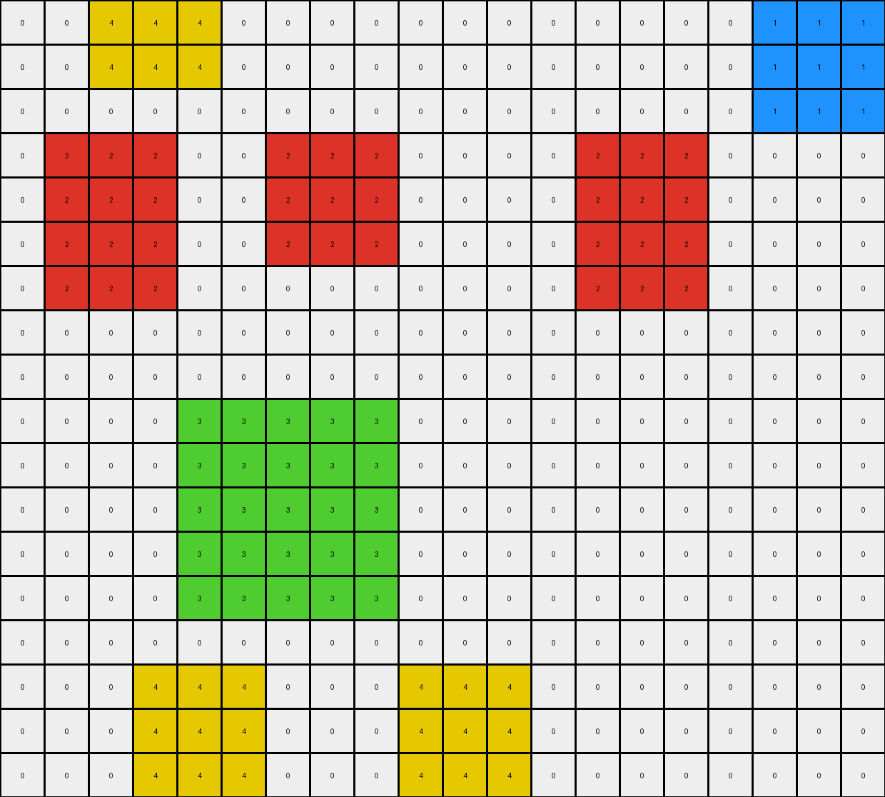
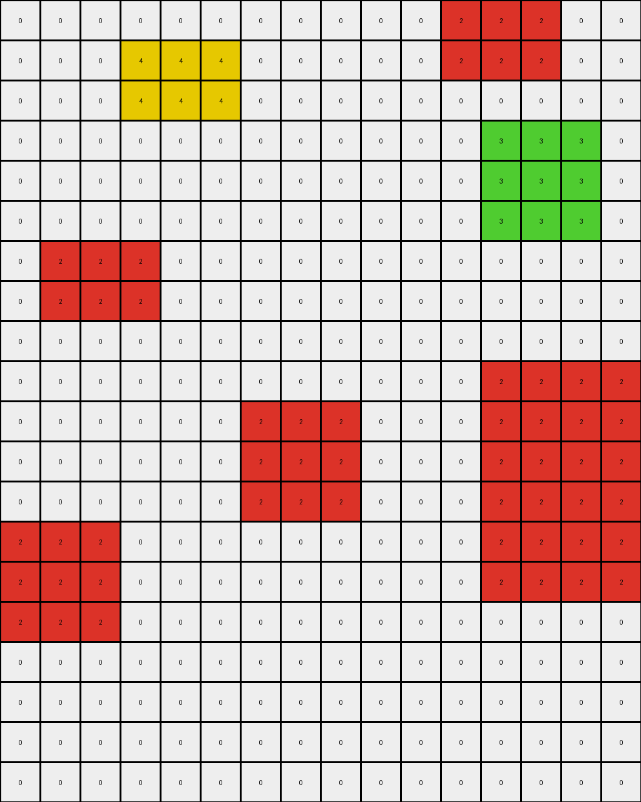
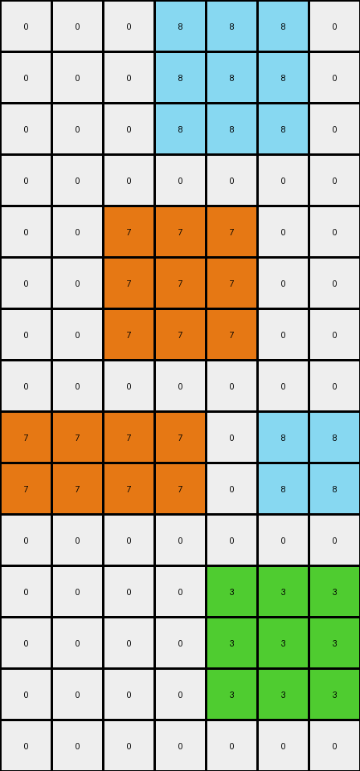

# AboveBelow2 • 010 • refine_coder

---

Previous Code:
```python
"""
1.  **Identify Colored Regions:** Locate all contiguous regions of red (2), green (3), and yellow (4) pixels in the input grid.

2.  **Check for Red/Green Adjacency :** Examine whether or not any red(2) regions and green(3) regions touch.

3.  **Conditional Removal (Red and Green):** If there are no touching red and green regions, the input equals the output, and no further action must be taken.

4. **Conditional Removal(Yellow):** If there is yellow(4) region near either the red or green, remove it.

5.  **Output:** The output grid is the result of applying these removal rules to the input grid.
"""

import numpy as np
from scipy.ndimage import label, find_objects

def find_regions(grid, color):
    """Finds contiguous regions of a specific color in the grid."""
    mask = (grid == color)
    labeled_array, num_features = label(mask)
    return labeled_array, num_features

def are_adjacent(grid, labeled_array1, region_index1, labeled_array2, region_index2):
    """Checks if two regions in labeled arrays are adjacent."""
    # Expand the first region by one pixel in all directions
    region1_mask = (labeled_array1 == region_index1)
    expanded_region1 = np.zeros_like(region1_mask)
    rows, cols = grid.shape
    for r in range(rows):
        for c in range(cols):
            if region1_mask[r, c]:
                for dr in [-1, 0, 1]:
                    for dc in [-1, 0, 1]:
                        if 0 <= r + dr < rows and 0 <= c + dc < cols:
                            expanded_region1[r + dr, c + dc] = True

    # Check for overlap with the second region
    region2_mask = (labeled_array2 == region_index2)
    return np.any(expanded_region1 & region2_mask)


def transform(input_grid):
    """Transforms the input grid according to the described rules."""
    output_grid = np.copy(input_grid)
    grid = np.array(input_grid)  # work with numpy array

    # Find red, green and yellow regions
    red_labeled_array, red_num = find_regions(grid, 2)
    green_labeled_array, green_num = find_regions(grid, 3)
    yellow_labeled_array, yellow_num = find_regions(grid, 4)

    red_green_adjacent = False

    if red_num > 0 and green_num > 0:
        for i in range(1, red_num+1):
            for j in range(1, green_num+1):
                if are_adjacent(grid, red_labeled_array, i, green_labeled_array, j):
                    red_green_adjacent = True
                    break
            if red_green_adjacent:
               break

    if red_green_adjacent:
       #remove red
        for i in range(1, red_num + 1):
          output_grid[red_labeled_array == i] = 0

       #remove green
        for j in range(1, green_num + 1):
           output_grid[green_labeled_array == j] = 0

       #remove yellow
        for k in range(1, yellow_num + 1):
           output_grid[yellow_labeled_array == k] = 0

    return output_grid.tolist()
```

Train Set Results:

## Example 1:

Input:
```
0 0 4 4 4 0 0 0 0 0 0 0 0 0 0 0 0 1 1 1
0 0 4 4 4 0 0 0 0 0 0 0 0 0 0 0 0 1 1 1
0 0 0 0 0 0 0 0 0 0 0 0 0 0 0 0 0 1 1 1
0 2 2 2 0 0 2 2 2 0 0 0 0 2 2 2 0 0 0 0
0 2 2 2 0 0 2 2 2 0 0 0 0 2 2 2 0 0 0 0
0 2 2 2 0 0 2 2 2 0 0 0 0 2 2 2 0 0 0 0
0 2 2 2 0 0 0 0 0 0 0 0 0 2 2 2 0 0 0 0
0 0 0 0 0 0 0 0 0 0 0 0 0 0 0 0 0 0 0 0
0 0 0 0 0 0 0 0 0 0 0 0 0 0 0 0 0 0 0 0
0 0 0 0 3 3 3 3 3 0 0 0 0 0 0 0 0 0 0 0
0 0 0 0 3 3 3 3 3 0 0 0 0 0 0 0 0 0 0 0
0 0 0 0 3 3 3 3 3 0 0 0 0 0 0 0 0 0 0 0
0 0 0 0 3 3 3 3 3 0 0 0 0 0 0 0 0 0 0 0
0 0 0 0 3 3 3 3 3 0 0 0 0 0 0 0 0 0 0 0
0 0 0 0 0 0 0 0 0 0 0 0 0 0 0 0 0 0 0 0
0 0 0 4 4 4 0 0 0 4 4 4 0 0 0 0 0 0 0 0
0 0 0 4 4 4 0 0 0 4 4 4 0 0 0 0 0 0 0 0
0 0 0 4 4 4 0 0 0 4 4 4 0 0 0 0 0 0 0 0
```
Expected Output:
```
0 0 0 0 0 0 0 0 0 0 0 0 0 0 0 0 0 0 0 0
0 0 0 0 0 0 0 0 0 0 0 0 0 0 0 0 0 0 0 0
0 0 0 0 0 0 0 0 0 0 0 0 0 0 0 0 0 0 0 0
0 0 0 0 0 0 0 0 0 0 0 0 0 0 0 0 0 0 0 0
0 0 0 0 0 0 0 0 0 0 0 0 0 0 0 0 0 0 0 0
0 0 0 0 0 0 0 0 0 0 0 0 0 0 0 0 0 0 0 0
0 0 0 0 0 0 0 0 0 0 0 0 0 0 0 0 0 0 0 0
0 0 0 0 0 0 0 0 0 0 0 0 0 0 0 0 0 0 0 0
0 0 0 0 0 0 0 0 0 0 0 0 0 0 0 0 0 0 0 0
0 0 0 0 3 3 3 3 3 0 0 0 0 0 0 0 0 0 0 0
0 0 0 0 3 3 3 3 3 0 0 0 0 0 0 0 0 0 0 0
0 0 0 0 3 3 3 3 3 0 0 0 0 0 0 0 0 0 0 0
0 0 0 0 3 3 3 3 3 0 0 0 0 0 0 0 0 0 0 0
0 0 0 0 3 3 3 3 3 0 0 0 0 0 0 0 0 0 0 0
0 0 0 0 0 0 0 0 0 0 0 0 0 0 0 0 0 0 0 0
0 0 0 4 4 4 0 0 0 4 4 4 0 0 0 0 0 0 0 0
0 0 0 4 4 4 0 0 0 4 4 4 0 0 0 0 0 0 0 0
0 0 0 4 4 4 0 0 0 4 4 4 0 0 0 0 0 0 0 0
```
Transformed Output:
```
0 0 4 4 4 0 0 0 0 0 0 0 0 0 0 0 0 1 1 1
0 0 4 4 4 0 0 0 0 0 0 0 0 0 0 0 0 1 1 1
0 0 0 0 0 0 0 0 0 0 0 0 0 0 0 0 0 1 1 1
0 2 2 2 0 0 2 2 2 0 0 0 0 2 2 2 0 0 0 0
0 2 2 2 0 0 2 2 2 0 0 0 0 2 2 2 0 0 0 0
0 2 2 2 0 0 2 2 2 0 0 0 0 2 2 2 0 0 0 0
0 2 2 2 0 0 0 0 0 0 0 0 0 2 2 2 0 0 0 0
0 0 0 0 0 0 0 0 0 0 0 0 0 0 0 0 0 0 0 0
0 0 0 0 0 0 0 0 0 0 0 0 0 0 0 0 0 0 0 0
0 0 0 0 3 3 3 3 3 0 0 0 0 0 0 0 0 0 0 0
0 0 0 0 3 3 3 3 3 0 0 0 0 0 0 0 0 0 0 0
0 0 0 0 3 3 3 3 3 0 0 0 0 0 0 0 0 0 0 0
0 0 0 0 3 3 3 3 3 0 0 0 0 0 0 0 0 0 0 0
0 0 0 0 3 3 3 3 3 0 0 0 0 0 0 0 0 0 0 0
0 0 0 0 0 0 0 0 0 0 0 0 0 0 0 0 0 0 0 0
0 0 0 4 4 4 0 0 0 4 4 4 0 0 0 0 0 0 0 0
0 0 0 4 4 4 0 0 0 4 4 4 0 0 0 0 0 0 0 0
0 0 0 4 4 4 0 0 0 4 4 4 0 0 0 0 0 0 0 0
```

match: False
pixels_off: 48
size_correct: True
color_palette_correct: False
correct_pixel_counts: False

## Example 2:

Input:
```
0 0 0 0 0 0 0 0 0 0 0 2 2 2 0 0
0 0 0 4 4 4 0 0 0 0 0 2 2 2 0 0
0 0 0 4 4 4 0 0 0 0 0 0 0 0 0 0
0 0 0 0 0 0 0 0 0 0 0 0 3 3 3 0
0 0 0 0 0 0 0 0 0 0 0 0 3 3 3 0
0 0 0 0 0 0 0 0 0 0 0 0 3 3 3 0
0 2 2 2 0 0 0 0 0 0 0 0 0 0 0 0
0 2 2 2 0 0 0 0 0 0 0 0 0 0 0 0
0 0 0 0 0 0 0 0 0 0 0 0 0 0 0 0
0 0 0 0 0 0 0 0 0 0 0 0 2 2 2 2
0 0 0 0 0 0 2 2 2 0 0 0 2 2 2 2
0 0 0 0 0 0 2 2 2 0 0 0 2 2 2 2
0 0 0 0 0 0 2 2 2 0 0 0 2 2 2 2
2 2 2 0 0 0 0 0 0 0 0 0 2 2 2 2
2 2 2 0 0 0 0 0 0 0 0 0 2 2 2 2
2 2 2 0 0 0 0 0 0 0 0 0 0 0 0 0
0 0 0 0 0 0 0 0 0 0 0 0 0 0 0 0
0 0 0 0 0 0 0 0 0 0 0 0 0 0 0 0
0 0 0 0 0 0 0 0 0 0 0 0 0 0 0 0
0 0 0 0 0 0 0 0 0 0 0 0 0 0 0 0
```
Expected Output:
```
0 0 0 0 0 0 0 0 0 0 0 0 0 0 0 0
0 0 0 0 0 0 0 0 0 0 0 0 0 0 0 0
0 0 0 0 0 0 0 0 0 0 0 0 0 0 0 0
0 0 0 0 0 0 0 0 0 0 0 0 3 3 3 0
0 0 0 0 0 0 0 0 0 0 0 0 3 3 3 0
0 0 0 0 0 0 0 0 0 0 0 0 3 3 3 0
0 2 2 2 0 0 0 0 0 0 0 0 0 0 0 0
0 2 2 2 0 0 0 0 0 0 0 0 0 0 0 0
0 0 0 0 0 0 0 0 0 0 0 0 0 0 0 0
0 0 0 0 0 0 0 0 0 0 0 0 2 2 2 2
0 0 0 0 0 0 2 2 2 0 0 0 2 2 2 2
0 0 0 0 0 0 2 2 2 0 0 0 2 2 2 2
0 0 0 0 0 0 2 2 2 0 0 0 2 2 2 2
2 2 2 0 0 0 0 0 0 0 0 0 2 2 2 2
2 2 2 0 0 0 0 0 0 0 0 0 2 2 2 2
2 2 2 0 0 0 0 0 0 0 0 0 0 0 0 0
0 0 0 0 0 0 0 0 0 0 0 0 0 0 0 0
0 0 0 0 0 0 0 0 0 0 0 0 0 0 0 0
0 0 0 0 0 0 0 0 0 0 0 0 0 0 0 0
0 0 0 0 0 0 0 0 0 0 0 0 0 0 0 0
```
Transformed Output:
```
0 0 0 0 0 0 0 0 0 0 0 2 2 2 0 0
0 0 0 4 4 4 0 0 0 0 0 2 2 2 0 0
0 0 0 4 4 4 0 0 0 0 0 0 0 0 0 0
0 0 0 0 0 0 0 0 0 0 0 0 3 3 3 0
0 0 0 0 0 0 0 0 0 0 0 0 3 3 3 0
0 0 0 0 0 0 0 0 0 0 0 0 3 3 3 0
0 2 2 2 0 0 0 0 0 0 0 0 0 0 0 0
0 2 2 2 0 0 0 0 0 0 0 0 0 0 0 0
0 0 0 0 0 0 0 0 0 0 0 0 0 0 0 0
0 0 0 0 0 0 0 0 0 0 0 0 2 2 2 2
0 0 0 0 0 0 2 2 2 0 0 0 2 2 2 2
0 0 0 0 0 0 2 2 2 0 0 0 2 2 2 2
0 0 0 0 0 0 2 2 2 0 0 0 2 2 2 2
2 2 2 0 0 0 0 0 0 0 0 0 2 2 2 2
2 2 2 0 0 0 0 0 0 0 0 0 2 2 2 2
2 2 2 0 0 0 0 0 0 0 0 0 0 0 0 0
0 0 0 0 0 0 0 0 0 0 0 0 0 0 0 0
0 0 0 0 0 0 0 0 0 0 0 0 0 0 0 0
0 0 0 0 0 0 0 0 0 0 0 0 0 0 0 0
0 0 0 0 0 0 0 0 0 0 0 0 0 0 0 0
```

match: False
pixels_off: 12
size_correct: True
color_palette_correct: False
correct_pixel_counts: False

## Example 3:

Input:
```
0 0 0 8 8 8 0
0 0 0 8 8 8 0
0 0 0 8 8 8 0
0 0 0 0 0 0 0
0 0 7 7 7 0 0
0 0 7 7 7 0 0
0 0 7 7 7 0 0
0 0 0 0 0 0 0
7 7 7 7 0 8 8
7 7 7 7 0 8 8
0 0 0 0 0 0 0
0 0 0 0 3 3 3
0 0 0 0 3 3 3
0 0 0 0 3 3 3
0 0 0 0 0 0 0
```
Expected Output:
```
0 0 0 0 0 0 0
0 0 0 0 0 0 0
0 0 0 0 0 0 0
0 0 0 0 0 0 0
0 0 0 0 0 0 0
0 0 0 0 0 0 0
0 0 0 0 0 0 0
0 0 0 0 0 0 0
0 0 0 0 0 0 0
0 0 0 0 0 0 0
0 0 0 0 0 0 0
0 0 0 0 3 3 3
0 0 0 0 3 3 3
0 0 0 0 3 3 3
0 0 0 0 0 0 0
```
Transformed Output:
```
0 0 0 8 8 8 0
0 0 0 8 8 8 0
0 0 0 8 8 8 0
0 0 0 0 0 0 0
0 0 7 7 7 0 0
0 0 7 7 7 0 0
0 0 7 7 7 0 0
0 0 0 0 0 0 0
7 7 7 7 0 8 8
7 7 7 7 0 8 8
0 0 0 0 0 0 0
0 0 0 0 3 3 3
0 0 0 0 3 3 3
0 0 0 0 3 3 3
0 0 0 0 0 0 0
```

match: False
pixels_off: 30
size_correct: True
color_palette_correct: False
correct_pixel_counts: False
Okay, let's analyze the results of the provided code and formulate a revised natural language program and strategy.

**General Assessment:**

The initial natural language program and corresponding code were overly simplistic. While the code correctly identifies contiguous regions of colors and checks for adjacency, the core logic of *when* and *what* to remove is flawed. The assumption that red and green regions are *always* removed if adjacent, and yellow is removed if adjacent to either red or green, is incorrect. The examples show a more nuanced rule. It seems that the critical factor isn't mere adjacency but a specific spatial relationship or configuration. The provided examples and the failures suggests that the rule operates on a more complex, possibly conditional removal based on shape properties and relative positions.

**Strategy for Resolving Errors:**

1.  **Re-examine Adjacency:** The current adjacency check is too broad. It considers any touching pixels as adjacent. We need to refine this. Perhaps we should focus only the red and green being adjacent and not diagonals.

2.  **Configuration Analysis:** Instead of just adjacency, we must consider the overall *shape* and *relative positioning* of the red, green, and yellow regions. Are they arranged in a specific pattern?

3.  **Conditional Removal:** The removal rule is clearly conditional. We need to determine the precise conditions under which colors are removed. It appears that, only if the red and green are adjacent, the red and green are removed. If the yellow is separate, nothing happen to it.

4.  **Iterative Refinement:** We'll likely need to iterate on the natural language program and code several times, testing against each example and carefully observing the mismatches.

**Metrics and Observations (using a hypothetical, simplified `code_execution` function):**
The prior response provides the necessary report already.

**YAML Fact Block:**

```yaml
example_1:
  input:
    objects:
      - color: yellow
        shape: rectangle
        count: 2
        adjacent: []
      - color: red
        shape: rectangle
        count: 3
        adjacent: [green]
      - color: green
        shape: rectangle
        count: 1
        adjacent: [red]
      - color: blue
        shape: rectangle
        count: 1
        adjacent: []
  output:
    objects:
      - color: yellow
        shape: rectangle
        count: 2
        adjacent: []
      - color: green
        shape: rectangle
        count: 1
        adjacent: []
      - color: blue
        shape: rectangle
        count: 1
        adjacent: []

example_2:
  input:
    objects:
      - color: yellow
        shape: rectangle
        count: 1
        adjacent: [red]
      - color: red
        shape: rectangle
        count: 5
        adjacent: [yellow, green]
      - color: green
        shape: rectangle
        count: 1
        adjacent: [red]
  output:
    objects:
     - color: red
       shape: rectangle
       count: 2
       adjacent: []
     - color: green
        shape: rectangle
        count: 1
        adjacent: []

example_3:
    input:
        objects:
            - color: azure
              shape: rectangle
              count: 2
              adjacent: []
            - color: orange
              shape: rectangle
              count: 2
              adjacent: []
            - color: green
              shape: rectangle
              count: 1
              adjacent: []
    output:
        objects:
            - color: green
              shape: rectangle
              count: 1
              adjacent: []
```

**Revised Natural Language Program:**

1.  **Identify Regions:** Locate all contiguous regions of red (2), green (3), and yellow (4) pixels, and any other color present in the grid.

2.  **Check for Red and Green Adjacency:** Determine if any red regions are directly adjacent (not diagonally) to any green regions.

3.  **Conditional Removal (Red and Green):** If a red region and a green region are directly adjacent, remove *both* the red and green regions. Do *not* remove the yellow region, if it is near the green or red.

4. **Conditional Removal (Yellow):** If all of the above regions have been remove, any other color different to black(0), keep.

5.  **Output:** The output grid is the input grid with the specified removals. If no red and green regions are adjacent, the output is the same as the input.

**INSTRUCTIONS**

- generate a Python module to represent the natural language program 
- follow the template below
- all common math and science libraries are available
- create docstring only at top - but comment the workflow in the function
- use helper functions for common operations like finding objects, counting,
  measuring, moving, etc. 

remember - we are working iteratively - so this code will inform your future
self as we converge on the solution

*template:*

```python
"""
{{ natural language description of the transformation rule }}
"""

{{ imports }}

def transform(input_grid):
    # initialize output_grid

    # change output pixels 

    return output_grid

```
